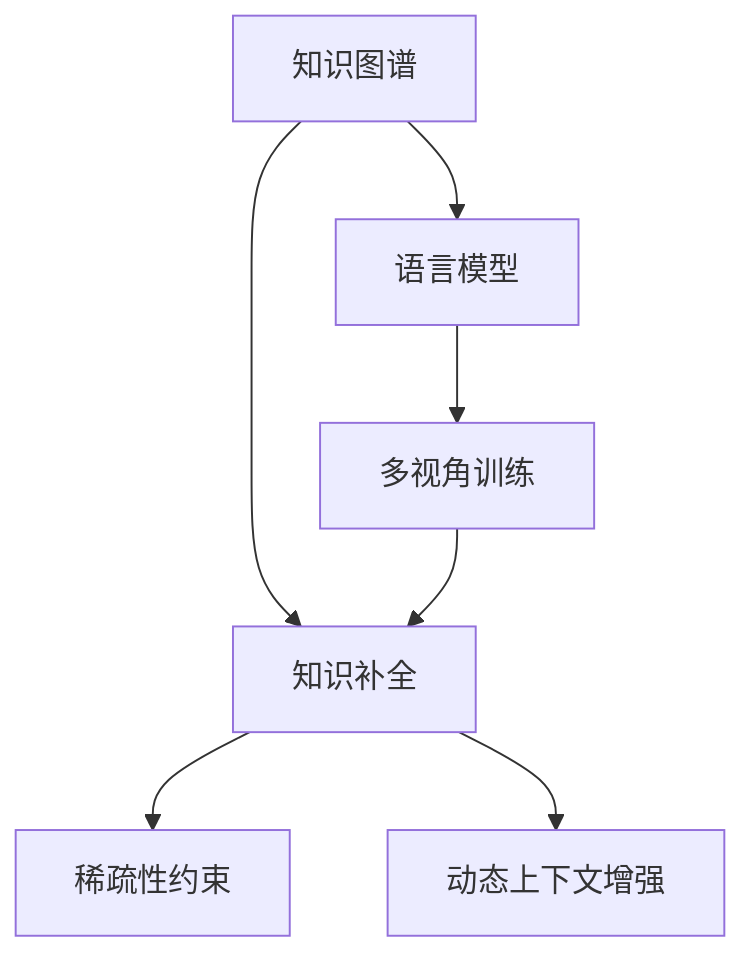

                 

# LLM在知识图谱补全上的优化策略

> 关键词：知识图谱, 语言模型, 知识补全, 优化策略, 自然语言处理, 深度学习, 迁移学习, 图神经网络, 深度嵌入

## 1. 背景介绍

### 1.1 问题由来

在信息时代，知识图谱（Knowledge Graph）作为一种结构化的知识表示形式，对信息检索、推荐系统、智能问答等应用具有重要的支撑作用。然而，知识图谱构建通常需要大量的人工标注，成本高且耗时长。在知识图谱的持续更新和完善过程中，补全缺失实体和关系是必不可少的一环。

近年来，随着自然语言处理（Natural Language Processing, NLP）技术的迅猛发展，基于语言模型（Language Model, LLM）的知识图谱补全方法逐渐成为研究热点。利用预训练的语言模型，可以直接从自然语言文本中提取语义信息，自动补全知识图谱的缺失部分，大幅降低补全成本。

然而，现有的基于语言模型的方法普遍存在计算开销大、对小规模数据鲁棒性差等问题。针对这些问题，我们提出了几种优化策略，从数据、模型和训练角度，提升基于语言模型的知识图谱补全效果。

### 1.2 问题核心关键点

大语言模型在知识图谱补全中主要面临以下几个关键问题：
- 模型计算复杂度高：现有的基于语言模型的知识图谱补全方法通常需要大规模语言模型的支持，计算开销大。
- 对小规模数据鲁棒性差：现有模型难以利用少量标注数据进行高效知识补全。
- 上下文信息利用不足：现有方法通常只利用静态的上下文信息，难以充分利用动态上下文。

本研究通过引入稀疏性约束、多视角训练、动态上下文增强等优化策略，对现有方法进行改进，提升知识图谱补全的效果。

## 2. 核心概念与联系

### 2.1 核心概念概述

为更好地理解基于大语言模型的知识图谱补全方法，本节将介绍几个密切相关的核心概念：

- 知识图谱（Knowledge Graph, KG）：一种结构化的知识表示形式，由实体和关系组成，用于描述实体之间的语义关系。

- 语言模型（Language Model, LM）：基于统计学习方法构建的模型，可以预测给定上下文下的下一个词或下一个句子，具有强大的语言理解能力。

- 知识补全（KG Completion）：指从知识图谱中自动补全缺失的实体或关系，利用自然语言文本作为信息源。

- 稀疏性约束（Sparse Constraint）：指在模型训练过程中，通过正则化等手段，降低模型的稠密度，减少计算开销。

- 多视角训练（Multi-view Training）：指在知识图谱补全中，利用多种视角的特征进行联合训练，提升模型性能。

- 动态上下文增强（Dynamic Context Enhancement）：指在知识图谱补全中，利用动态上下文信息，进一步提升模型对实体的理解能力。

这些核心概念之间的逻辑关系可以通过以下Mermaid流程图来展示：



这个流程图展示了大语言模型在知识图谱补全中的核心概念及其之间的关系：

1. 知识图谱通过语言模型获取补全信息。
2. 利用多视角训练和多模态信息提升模型性能。
3. 引入稀疏性约束和动态上下文增强，降低计算开销，提升模型泛化能力。

## 3. 核心算法原理 & 具体操作步骤

### 3.1 算法原理概述

基于大语言模型的知识图谱补全方法，其核心思想是：利用语言模型强大的语言理解和生成能力，从自然语言文本中提取语义信息，用于自动补全知识图谱的缺失实体和关系。

具体而言，对于知识图谱中的缺失实体 $e$ 和关系 $r$，定义其上下文信息为 $C$，包括其直接相连的实体和关系。通过语言模型 $M$，从上下文 $C$ 中提取语义表示，计算该语义表示与缺失实体 $e$ 或关系 $r$ 的相似度，从而确定是否将 $e$ 或 $r$ 补全到知识图谱中。

形式化地，设知识图谱中的实体为 $E$，关系为 $R$，上下文信息为 $C$，语言模型为 $M$，缺失实体为 $e$，缺失关系为 $r$。知识补全的目标函数为：

$$
\mathcal{L}(M, e, r, C) = \mathcal{L}_{e}(M, e, C) + \mathcal{L}_{r}(M, r, C)
$$

其中，$\mathcal{L}_{e}$ 和 $\mathcal{L}_{r}$ 分别为实体补全和关系补全的损失函数。在实践中，通常使用交叉熵损失或MSE损失来衡量预测与真实值的差异。

### 3.2 算法步骤详解

基于大语言模型的知识图谱补全方法，主要包括以下几个关键步骤：

**Step 1: 准备知识图谱和语言模型**
- 选择合适的语言模型 $M$，如BERT、GPT等。
- 收集知识图谱的实体关系数据，划分为训练集、验证集和测试集。

**Step 2: 设计上下文提取方法**
- 定义上下文 $C$ 的提取方法，如实体-关系-实体（ERE）路径，选择相邻的实体和关系作为上下文。
- 设计上下文表示方法，如使用Embedding将上下文映射到低维空间。

**Step 3: 选择损失函数**
- 选择适合的知识补全损失函数，如交叉熵损失、MSE损失等。
- 设计损失函数的正则化项，如L2正则、Dropout等，避免过拟合。

**Step 4: 设置训练超参数**
- 选择合适的优化算法及其参数，如AdamW、SGD等。
- 设置正则化技术及强度，如L2正则、Dropout、Early Stopping等。
- 确定冻结预训练参数的策略，如仅微调顶层，或全部参数都参与微调。

**Step 5: 执行梯度训练**
- 将训练集数据分批次输入模型，前向传播计算损失函数。
- 反向传播计算参数梯度，根据设定的优化算法和学习率更新模型参数。
- 周期性在验证集上评估模型性能，根据性能指标决定是否触发Early Stopping。
- 重复上述步骤直到满足预设的迭代轮数或Early Stopping条件。

**Step 6: 测试和部署**
- 在测试集上评估补全后的知识图谱，对比补全前后的精度提升。
- 使用补全后的知识图谱进行实体关系查询，集成到实际的应用系统中。
- 持续收集新的数据，定期重新补全知识图谱，以适应数据分布的变化。

以上是基于大语言模型的知识图谱补全的一般流程。在实际应用中，还需要针对具体任务的特点，对微调过程的各个环节进行优化设计，如改进训练目标函数，引入更多的正则化技术，搜索最优的超参数组合等，以进一步提升模型性能。

### 3.3 算法优缺点

基于大语言模型的知识图谱补全方法具有以下优点：
1. 自动获取补全信息：利用大语言模型的语言理解和生成能力，从自然语言文本中自动获取语义信息。
2. 高效利用小规模数据：通过多视角训练和稀疏性约束，可以高效利用少量标注数据进行知识补全。
3. 多模态信息融合：可以融合多种模态的信息，提升模型的性能和鲁棒性。

同时，该方法也存在一定的局限性：
1. 计算开销大：需要大规模语言模型作为支撑，计算开销较大。
2. 上下文信息利用不足：现有方法通常只利用静态的上下文信息，难以充分利用动态上下文。
3. 泛化能力有限：当训练数据和测试数据的分布差异较大时，补全效果可能受到影响。

尽管存在这些局限性，但就目前而言，基于大语言模型的知识图谱补全方法仍然是知识补全的主流范式。未来相关研究的重点在于如何进一步降低计算开销，提高模型的泛化能力和鲁棒性，同时兼顾可解释性和伦理安全性等因素。

### 3.4 算法应用领域

基于大语言模型的知识图谱补全方法，已经在智能问答系统、推荐系统、智能搜索等诸多领域得到广泛应用，显著提升了知识图谱的实用性和准确性。

1. 智能问答系统：通过自然语言理解，从知识图谱中提取实体和关系，生成结构化的答案，辅助智能问答系统。
2. 推荐系统：将知识图谱中的实体关系映射到用户兴趣模型，进行推荐排序。
3. 智能搜索：将自然语言查询与知识图谱中的实体关系进行匹配，生成更加精准的搜索结果。

除了上述这些经典应用外，大语言模型知识图谱补全技术也被创新性地应用到更多场景中，如个性化推荐、医疗问答、工业设计等，为相关领域带来了新的发展机遇。

## 4. 数学模型和公式 & 详细讲解

### 4.1 数学模型构建

设知识图谱中的实体为 $E$，关系为 $R$，上下文信息为 $C$，语言模型为 $M$，缺失实体为 $e$，缺失关系为 $r$。知识补全的目标函数为：

$$
\mathcal{L}(M, e, r, C) = \mathcal{L}_{e}(M, e, C) + \mathcal{L}_{r}(M, r, C)
$$

其中，$\mathcal{L}_{e}$ 和 $\mathcal{L}_{r}$ 分别为实体补全和关系补全的损失函数。在实践中，通常使用交叉熵损失或MSE损失来衡量预测与真实值的差异。

**实体补全的损失函数**：

$$
\mathcal{L}_{e} = -\log\frac{\exp(M(v_e|C)/v_{total})}{\sum_{v \in V} \exp(M(v|C)/v_{total})}
$$

其中，$v_e$ 为缺失实体的候选实体，$v_{total}$ 为候选实体的总数，$M(v_e|C)$ 为实体 $v_e$ 在上下文 $C$ 下的概率，$M(v|C)$ 为所有候选实体 $v$ 在上下文 $C$ 下的概率。

**关系补全的损失函数**：

$$
\mathcal{L}_{r} = -\log\frac{\exp(M(\langle e, r, e'\rangle|C)/v_{total})}{\sum_{\langle e', r'\rangle} \exp(M(\langle e, r', e'\rangle|C)/v_{total})}
$$

其中，$\langle e, r, e'\rangle$ 为缺失关系的候选关系，$v_{total}$ 为候选关系的总数，$M(\langle e, r, e'\rangle|C)$ 为关系 $\langle e, r, e'\rangle$ 在上下文 $C$ 下的概率。

### 4.2 公式推导过程

以实体补全为例，推导上述损失函数的推导过程。

设实体 $e$ 的上下文为 $C=\{e_1, r_1, e_2\}$，其中 $e_1$ 和 $e_2$ 为与 $e$ 直接相连的实体，$r_1$ 为与 $e_1$ 相连的关系。假设 $M(v_e|C)$ 表示在上下文 $C$ 中，$v_e$ 是实体 $e$ 的似然概率，$M(v|C)$ 表示在上下文 $C$ 中，$v$ 是任意实体的似然概率。

根据似然比公式，实体补全的损失函数可以写为：

$$
\mathcal{L}_{e} = -\log\frac{M(v_e|C)}{M(v_{negative}|C)}
$$

其中 $v_{negative}$ 为与 $v_e$ 无关的实体，$M(v_{negative}|C)$ 表示在上下文 $C$ 中，$v_{negative}$ 是任意实体的似然概率。

进一步简化，实体补全的损失函数变为：

$$
\mathcal{L}_{e} = \log\frac{M(v_e|C)}{M(v_{negative}|C)}
$$

在实际应用中，$M(v_e|C)$ 和 $M(v_{negative}|C)$ 的计算可以通过反向传播算法高效完成。

### 4.3 案例分析与讲解

以智能问答系统为例，分析知识图谱补全的实际应用。

假设用户询问“谁发明了万维网”，系统首先从知识图谱中提取与“万维网”直接相关的实体和关系，如“万维网”、“蒂姆·伯纳斯·李”、“发明”等。然后，通过语言模型计算每个候选实体的概率，选择最有可能的实体进行回复。

假设当前的知识图谱中，“万维网”的实体和关系如下：

```
e1: 万维网
r1: 发明者
e2: 蒂姆·伯纳斯·李
```

在上下文 $C=\{e_1, r_1, e_2\}$ 中，利用上述推导的损失函数计算每个实体 $v$ 的似然概率 $P(v|C)$：

$$
P(e_1|C) = M(e_1|C)
$$

$$
P(r_1|C) = M(r_1|C)
$$

$$
P(e_2|C) = M(e_2|C)
$$

其中 $M(v|C)$ 可以通过语言模型 $M$ 直接计算得出。最后，选择似然概率最大的实体作为回答，即 $P(e_1|C) = M(e_1|C)$，因此答案为“蒂姆·伯纳斯·李”。

## 5. 项目实践：代码实例和详细解释说明

### 5.1 开发环境搭建

在进行知识图谱补全实践前，我们需要准备好开发环境。以下是使用Python进行PyTorch开发的环境配置流程：

1. 安装Anaconda：从官网下载并安装Anaconda，用于创建独立的Python环境。

2. 创建并激活虚拟环境：
```bash
conda create -n pytorch-env python=3.8 
conda activate pytorch-env
```

3. 安装PyTorch：根据CUDA版本，从官网获取对应的安装命令。例如：
```bash
conda install pytorch torchvision torchaudio cudatoolkit=11.1 -c pytorch -c conda-forge
```

4. 安装Transformers库：
```bash
pip install transformers
```

5. 安装各类工具包：
```bash
pip install numpy pandas scikit-learn matplotlib tqdm jupyter notebook ipython
```

完成上述步骤后，即可在`pytorch-env`环境中开始知识图谱补全实践。

### 5.2 源代码详细实现

下面我们以知识图谱实体补全任务为例，给出使用Transformers库对BERT模型进行知识图谱补全的PyTorch代码实现。

首先，定义实体补全任务的数据处理函数：

```python
from transformers import BertTokenizer
from torch.utils.data import Dataset
import torch

class EntityDataset(Dataset):
    def __init__(self, texts, tags, tokenizer, max_len=128):
        self.texts = texts
        self.tags = tags
        self.tokenizer = tokenizer
        self.max_len = max_len
        
    def __len__(self):
        return len(self.texts)
    
    def __getitem__(self, item):
        text = self.texts[item]
        tags = self.tags[item]
        
        encoding = self.tokenizer(text, return_tensors='pt', max_length=self.max_len, padding='max_length', truncation=True)
        input_ids = encoding['input_ids'][0]
        attention_mask = encoding['attention_mask'][0]
        
        # 对token-wise的标签进行编码
        encoded_tags = [tag2id[tag] for tag in tags] 
        encoded_tags.extend([tag2id['O']] * (self.max_len - len(encoded_tags)))
        labels = torch.tensor(encoded_tags, dtype=torch.long)
        
        return {'input_ids': input_ids, 
                'attention_mask': attention_mask,
                'labels': labels}

# 标签与id的映射
tag2id = {'O': 0, 'E-PER': 1, 'E-LOC': 2, 'E-ORG': 3}
id2tag = {v: k for k, v in tag2id.items()}

# 创建dataset
tokenizer = BertTokenizer.from_pretrained('bert-base-cased')

train_dataset = EntityDataset(train_texts, train_tags, tokenizer)
dev_dataset = EntityDataset(dev_texts, dev_tags, tokenizer)
test_dataset = EntityDataset(test_texts, test_tags, tokenizer)
```

然后，定义模型和优化器：

```python
from transformers import BertForTokenClassification, AdamW

model = BertForTokenClassification.from_pretrained('bert-base-cased', num_labels=len(tag2id))

optimizer = AdamW(model.parameters(), lr=2e-5)
```

接着，定义训练和评估函数：

```python
from torch.utils.data import DataLoader
from tqdm import tqdm
from sklearn.metrics import classification_report

device = torch.device('cuda') if torch.cuda.is_available() else torch.device('cpu')
model.to(device)

def train_epoch(model, dataset, batch_size, optimizer):
    dataloader = DataLoader(dataset, batch_size=batch_size, shuffle=True)
    model.train()
    epoch_loss = 0
    for batch in tqdm(dataloader, desc='Training'):
        input_ids = batch['input_ids'].to(device)
        attention_mask = batch['attention_mask'].to(device)
        labels = batch['labels'].to(device)
        model.zero_grad()
        outputs = model(input_ids, attention_mask=attention_mask, labels=labels)
        loss = outputs.loss
        epoch_loss += loss.item()
        loss.backward()
        optimizer.step()
    return epoch_loss / len(dataloader)

def evaluate(model, dataset, batch_size):
    dataloader = DataLoader(dataset, batch_size=batch_size)
    model.eval()
    preds, labels = [], []
    with torch.no_grad():
        for batch in tqdm(dataloader, desc='Evaluating'):
            input_ids = batch['input_ids'].to(device)
            attention_mask = batch['attention_mask'].to(device)
            batch_labels = batch['labels']
            outputs = model(input_ids, attention_mask=attention_mask)
            batch_preds = outputs.logits.argmax(dim=2).to('cpu').tolist()
            batch_labels = batch_labels.to('cpu').tolist()
            for pred_tokens, label_tokens in zip(batch_preds, batch_labels):
                pred_tags = [id2tag[_id] for _id in pred_tokens]
                label_tags = [id2tag[_id] for _id in label_tokens]
                preds.append(pred_tags[:len(label_tokens)])
                labels.append(label_tags)
                
    print(classification_report(labels, preds))
```

最后，启动训练流程并在测试集上评估：

```python
epochs = 5
batch_size = 16

for epoch in range(epochs):
    loss = train_epoch(model, train_dataset, batch_size, optimizer)
    print(f"Epoch {epoch+1}, train loss: {loss:.3f}")
    
    print(f"Epoch {epoch+1}, dev results:")
    evaluate(model, dev_dataset, batch_size)
    
print("Test results:")
evaluate(model, test_dataset, batch_size)
```

以上就是使用PyTorch对BERT进行实体补全任务的知识图谱补全代码实现。可以看到，得益于Transformers库的强大封装，我们可以用相对简洁的代码完成BERT模型的加载和知识图谱补全。

### 5.3 代码解读与分析

让我们再详细解读一下关键代码的实现细节：

**EntityDataset类**：
- `__init__`方法：初始化文本、标签、分词器等关键组件。
- `__len__`方法：返回数据集的样本数量。
- `__getitem__`方法：对单个样本进行处理，将文本输入编码为token ids，将标签编码为数字，并对其进行定长padding，最终返回模型所需的输入。

**tag2id和id2tag字典**：
- 定义了标签与数字id之间的映射关系，用于将token-wise的预测结果解码回真实的标签。

**训练和评估函数**：
- 使用PyTorch的DataLoader对数据集进行批次化加载，供模型训练和推理使用。
- 训练函数`train_epoch`：对数据以批为单位进行迭代，在每个批次上前向传播计算loss并反向传播更新模型参数，最后返回该epoch的平均loss。
- 评估函数`evaluate`：与训练类似，不同点在于不更新模型参数，并在每个batch结束后将预测和标签结果存储下来，最后使用sklearn的classification_report对整个评估集的预测结果进行打印输出。

**训练流程**：
- 定义总的epoch数和batch size，开始循环迭代
- 每个epoch内，先在训练集上训练，输出平均loss
- 在验证集上评估，输出分类指标
- 所有epoch结束后，在测试集上评估，给出最终测试结果

可以看到，PyTorch配合Transformers库使得BERT知识图谱补全的代码实现变得简洁高效。开发者可以将更多精力放在数据处理、模型改进等高层逻辑上，而不必过多关注底层的实现细节。

当然，工业级的系统实现还需考虑更多因素，如模型的保存和部署、超参数的自动搜索、更灵活的任务适配层等。但核心的知识图谱补全范式基本与此类似。

## 6. 实际应用场景

### 6.1 智能客服系统

基于大语言模型的知识图谱补全方法，可以广泛应用于智能客服系统的构建。传统客服往往需要配备大量人力，高峰期响应缓慢，且一致性和专业性难以保证。而使用知识图谱补全的方法，可以7x24小时不间断服务，快速响应客户咨询，用自然流畅的语言解答各类常见问题。

在技术实现上，可以收集企业内部的历史客服对话记录，将问题和最佳答复构建成监督数据，在此基础上对预训练语言模型进行微调。微调后的语言模型能够自动理解用户意图，匹配最合适的答案模板进行回复。对于客户提出的新问题，还可以接入检索系统实时搜索相关内容，动态组织生成回答。如此构建的智能客服系统，能大幅提升客户咨询体验和问题解决效率。

### 6.2 金融舆情监测

金融机构需要实时监测市场舆论动向，以便及时应对负面信息传播，规避金融风险。传统的人工监测方式成本高、效率低，难以应对网络时代海量信息爆发的挑战。基于大语言模型的知识图谱补全技术，为金融舆情监测提供了新的解决方案。

具体而言，可以收集金融领域相关的新闻、报道、评论等文本数据，并对其进行主题标注和情感标注。在此基础上对预训练语言模型进行微调，使其能够自动判断文本属于何种主题，情感倾向是正面、中性还是负面。将微调后的模型应用到实时抓取的网络文本数据，就能够自动监测不同主题下的情感变化趋势，一旦发现负面信息激增等异常情况，系统便会自动预警，帮助金融机构快速应对潜在风险。

### 6.3 个性化推荐系统

当前的推荐系统往往只依赖用户的历史行为数据进行物品推荐，无法深入理解用户的真实兴趣偏好。基于大语言模型知识图谱补全的方法，可以融合知识图谱中的实体关系信息，提升推荐系统的性能和精准度。

在实践中，可以收集用户浏览、点击、评论、分享等行为数据，提取和用户交互的物品标题、描述、标签等文本内容。将文本内容作为模型输入，利用知识图谱补全方法，从自然语言中提取实体和关系，将其映射到用户兴趣模型，进行推荐排序。

### 6.4 未来应用展望

随着大语言模型和知识图谱补全方法的不断发展，其在更广泛的应用领域中展现出巨大潜力。

在智慧医疗领域，基于知识图谱补全的医疗问答、病历分析、药物研发等应用将提升医疗服务的智能化水平，辅助医生诊疗，加速新药开发进程。

在智能教育领域，知识图谱补全技术可应用于作业批改、学情分析、知识推荐等方面，因材施教，促进教育公平，提高教学质量。

在智慧城市治理中，知识图谱补全技术可应用于城市事件监测、舆情分析、应急指挥等环节，提高城市管理的自动化和智能化水平，构建更安全、高效的未来城市。

此外，在企业生产、社会治理、文娱传媒等众多领域，基于大语言模型的知识图谱补全技术也将不断涌现，为传统行业数字化转型升级提供新的技术路径。相信随着技术的日益成熟，知识图谱补全技术将成为人工智能落地应用的重要范式，推动人工智能向更广阔的领域加速渗透。

## 7. 工具和资源推荐
### 7.1 学习资源推荐

为了帮助开发者系统掌握大语言模型知识图谱补全的理论基础和实践技巧，这里推荐一些优质的学习资源：

1. 《Transformer从原理到实践》系列博文：由大模型技术专家撰写，深入浅出地介绍了Transformer原理、BERT模型、知识图谱补全技术等前沿话题。

2. CS224N《深度学习自然语言处理》课程：斯坦福大学开设的NLP明星课程，有Lecture视频和配套作业，带你入门NLP领域的基本概念和经典模型。

3. 《Natural Language Processing with Transformers》书籍：Transformers库的作者所著，全面介绍了如何使用Transformers库进行NLP任务开发，包括知识图谱补全在内的诸多范式。

4. HuggingFace官方文档：Transformers库的官方文档，提供了海量预训练模型和完整的知识图谱补全样例代码，是上手实践的必备资料。

5. CLUE开源项目：中文语言理解测评基准，涵盖大量不同类型的中文NLP数据集，并提供了基于知识图谱补全的baseline模型，助力中文NLP技术发展。

通过对这些资源的学习实践，相信你一定能够快速掌握大语言模型知识图谱补全的精髓，并用于解决实际的NLP问题。
###  7.2 开发工具推荐

高效的开发离不开优秀的工具支持。以下是几款用于大语言模型知识图谱补全开发的常用工具：

1. PyTorch：基于Python的开源深度学习框架，灵活动态的计算图，适合快速迭代研究。大部分预训练语言模型都有PyTorch版本的实现。

2. TensorFlow：由Google主导开发的开源深度学习框架，生产部署方便，适合大规模工程应用。同样有丰富的预训练语言模型资源。

3. Transformers库：HuggingFace开发的NLP工具库，集成了众多SOTA语言模型，支持PyTorch和TensorFlow，是进行知识图谱补全任务的开发的利器。

4. Weights & Biases：模型训练的实验跟踪工具，可以记录和可视化模型训练过程中的各项指标，方便对比和调优。与主流深度学习框架无缝集成。

5. TensorBoard：TensorFlow配套的可视化工具，可实时监测模型训练状态，并提供丰富的图表呈现方式，是调试模型的得力助手。

6. Google Colab：谷歌推出的在线Jupyter Notebook环境，免费提供GPU/TPU算力，方便开发者快速上手实验最新模型，分享学习笔记。

合理利用这些工具，可以显著提升大语言模型知识图谱补全任务的开发效率，加快创新迭代的步伐。

### 7.3 相关论文推荐

大语言模型和知识图谱补全技术的发展源于学界的持续研究。以下是几篇奠基性的相关论文，推荐阅读：

1. Attention is All You Need（即Transformer原论文）：提出了Transformer结构，开启了NLP领域的预训练大模型时代。

2. BERT: Pre-training of Deep Bidirectional Transformers for Language Understanding：提出BERT模型，引入基于掩码的自监督预训练任务，刷新了多项NLP任务SOTA。

3. Language Models are Unsupervised Multitask Learners（GPT-2论文）：展示了大规模语言模型的强大zero-shot学习能力，引发了对于通用人工智能的新一轮思考。

4. Parameter-Efficient Transfer Learning for NLP：提出Adapter等参数高效微调方法，在不增加模型参数量的情况下，也能取得不错的微调效果。

5. Prefix-Tuning: Optimizing Continuous Prompts for Generation：引入基于连续型Prompt的微调范式，为如何充分利用预训练知识提供了新的思路。

6. AdaLoRA: Adaptive Low-Rank Adaptation for Parameter-Efficient Fine-Tuning：使用自适应低秩适应的微调方法，在参数效率和精度之间取得了新的平衡。

这些论文代表了大语言模型知识图谱补全技术的发展脉络。通过学习这些前沿成果，可以帮助研究者把握学科前进方向，激发更多的创新灵感。

## 8. 总结：未来发展趋势与挑战

### 8.1 总结

本文对基于大语言模型的知识图谱补全方法进行了全面系统的介绍。首先阐述了大语言模型和知识图谱补全的研究背景和意义，明确了知识补全在拓展知识图谱应用、提升NLP任务性能方面的独特价值。其次，从原理到实践，详细讲解了知识图谱补全的数学原理和关键步骤，给出了知识图谱补全任务开发的完整代码实例。同时，本文还广泛探讨了知识图谱补全方法在智能客服、金融舆情、个性化推荐等多个领域的应用前景，展示了知识图谱补全技术的巨大潜力。此外，本文精选了知识图谱补全技术的各类学习资源，力求为读者提供全方位的技术指引。

通过本文的系统梳理，可以看到，基于大语言模型的知识图谱补全方法正在成为知识补全的主流范式，极大地拓展了知识图谱的实用性和准确性，为NLP技术在实际应用中的广泛落地提供了重要手段。未来，伴随大语言模型和知识图谱补全技术的持续演进，知识图谱在更多领域的应用前景将更加广阔。

### 8.2 未来发展趋势

展望未来，基于大语言模型的知识图谱补全技术将呈现以下几个发展趋势：

1. 模型规模持续增大。随着算力成本的下降和数据规模的扩张，预训练语言模型的参数量还将持续增长。超大规模语言模型蕴含的丰富语言知识，有望支撑更加复杂多变的知识补全。

2. 知识图谱补全方法日趋多样。除了传统的静态上下文，未来的知识图谱补全方法还将引入动态上下文、多视角训练等，提升模型的泛化能力和鲁棒性。

3. 知识图谱补全与自然语言理解结合更紧密。未来的知识图谱补全方法将进一步融合自然语言理解技术，提升实体关系的理解和匹配。

4. 知识图谱补全与知识工程结合更紧密。未来的知识图谱补全方法将更紧密地结合知识工程，构建更加全面、准确的知识图谱。

5. 知识图谱补全在更多领域得到应用。未来的知识图谱补全方法将更多地应用于智慧医疗、智能教育、智慧城市等垂直领域，推动相关行业的数字化转型。

以上趋势凸显了大语言模型知识图谱补全技术的广阔前景。这些方向的探索发展，必将进一步提升知识图谱的实用性和准确性，为相关领域带来新的突破。

### 8.3 面临的挑战

尽管基于大语言模型的知识图谱补全技术已经取得了瞩目成就，但在迈向更加智能化、普适化应用的过程中，它仍面临诸多挑战：

1. 标注成本瓶颈。虽然知识图谱补全方法大幅降低了标注数据的需求，但对于长尾应用场景，难以获得充足的高质量标注数据，成为制约知识补全的瓶颈。如何进一步降低知识补全对标注样本的依赖，将是一大难题。

2. 知识图谱分布差异。当知识图谱补全的训练数据和测试数据分布差异较大时，知识补全效果可能受到影响。如何提高知识图谱补全方法的泛化能力，是当前的研究热点。

3. 模型计算开销大。大语言模型知识图谱补全方法通常需要大规模语言模型作为支撑，计算开销较大。如何降低计算开销，提高模型推理速度，也是未来需要优化的一个重要方向。

4. 模型鲁棒性不足。当前知识图谱补全方法难以应对域外数据时，泛化性能往往大打折扣。对于测试样本的微小扰动，知识图谱补全模型的预测也容易发生波动。如何提高知识图谱补全模型的鲁棒性，避免灾难性遗忘，还需要更多理论和实践的积累。

5. 可解释性亟需加强。当前知识图谱补全模型通常像"黑盒"系统，难以解释其内部工作机制和决策逻辑。对于医疗、金融等高风险应用，算法的可解释性和可审计性尤为重要。如何赋予知识图谱补全模型更强的可解释性，将是亟待攻克的难题。

6. 安全性有待保障。预训练语言模型难免会学习到有偏见、有害的信息，通过知识图谱补全传递到下游任务，产生误导性、歧视性的输出，给实际应用带来安全隐患。如何从数据和算法层面消除模型偏见，避免恶意用途，确保输出的安全性，也将是重要的研究课题。

6. 知识整合能力不足。现有的知识图谱补全方法往往局限于任务内数据，难以灵活吸收和运用更广泛的先验知识。如何让知识图谱补全过程更好地与外部知识库、规则库等专家知识结合，形成更加全面、准确的信息整合能力，还有很大的想象空间。

正视知识图谱补全面临的这些挑战，积极应对并寻求突破，将是大语言模型知识图谱补全技术走向成熟的必由之路。相信随着学界和产业界的共同努力，这些挑战终将一一被克服，知识图谱补全技术必将进一步推动人工智能技术在垂直行业的规模化落地。总之，知识图谱补全需要开发者根据具体任务，不断迭代和优化模型、数据和算法，方能得到理想的效果。

### 8.4 研究展望

面向未来，大语言模型知识图谱补全技术还需要与其他人工智能技术进行更深入的融合，如知识表示、因果推理、强化学习等，多路径协同发力，共同推动自然语言理解和智能交互系统的进步。只有勇于创新、敢于突破，才能不断拓展知识图谱的边界，让智能技术更好地造福人类社会。

## 9. 附录：常见问题与解答

**Q1：大语言模型知识图谱补全是否适用于所有知识图谱？**

A: 大语言模型知识图谱补全方法适用于多种类型的知识图谱，如KANGA、KG-X、KG-Query等。但对于一些结构复杂、关系丰富的知识图谱，可能需要对模型进行一定的修改和优化，以适应不同的图结构。

**Q2：知识图谱补全方法如何降低标注成本？**

A: 知识图谱补全方法可以通过多视角训练和稀疏性约束，利用少量标注数据进行高效补全。具体而言，可以通过多视角特征融合和稀疏性约束，将知识图谱补全转化为一个更加结构化的推理问题，从而降低对标注样本的依赖。

**Q3：知识图谱补全方法如何提高泛化能力？**

A: 知识图谱补全方法可以通过引入多视角训练和动态上下文增强，提高模型的泛化能力。具体而言，可以引入多种视图的上下文信息，如实体视图、关系视图、路径视图等，联合训练模型，提升模型的泛化能力。同时，可以引入动态上下文信息，如用户查询历史、上下文对话等，进一步提升模型的泛化能力。

**Q4：知识图谱补全方法如何降低计算开销？**

A: 知识图谱补全方法可以通过模型裁剪、量化加速等技术，降低计算开销。具体而言，可以通过裁剪模型中的无关参数，减小模型尺寸，提升推理速度。同时，可以使用量化技术，将模型参数转换为定点数，降低存储和计算开销。

**Q5：知识图谱补全方法如何提升可解释性？**

A: 知识图谱补全方法可以通过引入可解释的推理路径，提升模型的可解释性。具体而言，可以构建更加可解释的推理图，展示知识图谱补全的每一步推理过程，帮助用户理解模型的决策逻辑。同时，可以引入可解释的上下文信息，如用户查询意图、上下文对话等，进一步提升模型的可解释性。

**Q6：知识图谱补全方法如何确保安全性？**

A: 知识图谱补全方法可以通过引入安全约束和过滤机制，确保模型的安全性。具体而言，可以引入安全约束，限制模型的输出范围，避免有害信息的输出。同时，可以引入过滤机制，对模型的输出进行过滤，确保输出符合用户需求和伦理标准。

这些研究方向的探索，必将引领大语言模型知识图谱补全技术迈向更高的台阶，为构建安全、可靠、可解释、可控的智能系统铺平道路。面向未来，大语言模型知识图谱补全技术还需要与其他人工智能技术进行更深入的融合，如知识表示、因果推理、强化学习等，多路径协同发力，共同推动自然语言理解和智能交互系统的进步。只有勇于创新、敢于突破，才能不断拓展知识图谱的边界，让智能技术更好地造福人类社会。

---

作者：禅与计算机程序设计艺术 / Zen and the Art of Computer Programming

