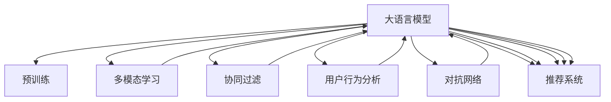

                 

# LLM在视频内容推荐中的潜力探索

> 关键词：大语言模型(LLM), 视频内容推荐, 深度学习, 多模态数据, 自回归模型, 对抗网络, 用户行为分析, 协同过滤

## 1. 背景介绍

### 1.1 问题由来
在互联网视频内容爆炸式增长的今天，如何为用户推荐符合其兴趣和需求的视频内容，已经成为各大视频平台的重要课题。传统的推荐系统基于协同过滤、基于内容的推荐等方法，存在计算成本高、对新用户冷启动困难等局限。随着深度学习技术的发展，尤其是大语言模型(LLM)的兴起，视频内容推荐系统正在经历一场变革。

LLM作为能够理解并生成人类语言的大模型，已经广泛应用于自然语言处理(NLP)领域。近年来，LLM在视频推荐中的应用研究也逐步兴起，显示出巨大的潜力。基于LLM的视频推荐系统，不仅能够处理文本数据，还可以整合视频、图片、音频等多模态数据，为用户提供更为丰富、精准的内容推荐。

### 1.2 问题核心关键点
本文聚焦于基于LLM的视频内容推荐系统，旨在探索其在推荐任务中的应用，并总结其中的核心算法原理和具体操作步骤。我们将从背景介绍入手，深入讨论LLM在视频推荐中的核心概念、算法原理、操作步骤、实际应用场景，并提供代码实例和详细解释说明。

## 2. 核心概念与联系

### 2.1 核心概念概述

为更好地理解基于LLM的视频内容推荐系统，本节将介绍几个密切相关的核心概念：

- **大语言模型(LLM)**：以自回归模型(如GPT)或自编码模型(如BERT)为代表的大规模预训练语言模型。通过在大规模无标签文本语料上进行预训练，学习通用的语言表示，具备强大的语言理解和生成能力。

- **预训练(Pre-training)**：指在大规模无标签文本语料上，通过自监督学习任务训练通用语言模型的过程。常见的预训练任务包括言语建模、遮挡语言模型等。预训练使得模型学习到语言的通用表示。

- **多模态学习(Multimodal Learning)**：指同时利用视频、音频、文本等多种模态数据，进行联合建模和推荐。LLM在视频推荐中的应用，往往需要整合多种数据源，形成多模态推荐系统。

- **协同过滤(Collaborative Filtering)**：一种基于用户历史行为数据的推荐方法，通过寻找相似用户和相似物品来推荐新物品。LLM可以通过分析用户反馈和行为，构建更加复杂的协同过滤模型。

- **对抗网络(Adversarial Networks)**：通过生成对抗网络(GAN)等方法，构建虚拟数据来扩充训练集，解决数据稀疏和冷启动问题。

- **用户行为分析(User Behavior Analysis)**：通过分析用户的观看历史、点赞评论等行为数据，挖掘用户兴趣偏好，用于构建推荐模型。

- **推荐系统(Recommendation System)**：旨在为用户推荐感兴趣和有价值的信息的系统，包括协同过滤、基于内容的推荐、混合推荐等多种策略。

这些核心概念之间的逻辑关系可以通过以下Mermaid流程图来展示：



这个流程图展示了大语言模型的核心概念及其之间的关系：

1. 大语言模型通过预训练获得基础能力。
2. 通过多模态学习整合视频、音频、文本等多源数据，进行联合建模和推荐。
3. 协同过滤和用户行为分析为推荐系统提供数据支撑，构建更加复杂的推荐模型。
4. 对抗网络解决数据稀疏和冷启动问题，增强推荐系统的泛化能力。
5. 推荐系统将上述多方面信息融合，为用户生成推荐结果。

这些概念共同构成了基于LLM的视频内容推荐系统的基本框架，使其能够在各种场景下发挥强大的推荐能力。通过理解这些核心概念，我们可以更好地把握LLM在视频推荐中的工作原理和优化方向。

## 3. 核心算法原理 & 具体操作步骤

### 3.1 算法原理概述

基于LLM的视频内容推荐，本质上是一个多模态学习和深度学习的复合过程。其核心思想是：利用LLM强大的自然语言理解能力，整合视频、音频、文本等多源数据，构建联合推荐模型。

形式化地，假设视频推荐任务为 $T$，输入为视频数据集 $V$，标签为推荐结果 $y$。定义模型 $M_{\theta}$ 在输入 $x$ 上的输出为 $z$，则推荐系统的目标是最小化经验风险：

$$
\mathcal{L}(\theta) = \frac{1}{N}\sum_{i=1}^N \ell(M_{\theta}(x_i),y_i)
$$

其中 $\ell$ 为推荐任务设计的损失函数，用于衡量模型输出与真实标签之间的差异。常见的损失函数包括均方误差、交叉熵损失等。

通过梯度下降等优化算法，推荐过程不断更新模型参数 $\theta$，最小化损失函数 $\mathcal{L}$，使得模型输出逼近真实标签。由于 $\theta$ 已经通过预训练获得了较好的初始化，因此即便在视频推荐这样大规模的多模态数据集上进行训练，也能较快收敛到理想的模型参数 $\hat{\theta}$。

### 3.2 算法步骤详解

基于LLM的视频内容推荐一般包括以下几个关键步骤：

**Step 1: 准备视频数据集和标签**

- 收集视频数据集 $V=\{(x_i,y_i)\}_{i=1}^N$，其中 $x_i$ 为视频数据，$y_i$ 为推荐标签。
- 对视频数据进行预处理，提取视频、音频、字幕等多模态特征。
- 将标注数据划分为训练集、验证集和测试集。

**Step 2: 整合多模态数据**

- 对每个视频 $x_i$，提取视频帧、音频特征、字幕文本等多模态特征。
- 将多模态特征拼接为向量 $x'_i$。

**Step 3: 设计推荐模型**

- 选择合适的LLM模型 $M_{\theta}$ 作为初始化参数，如 GPT、BERT 等。
- 设计推荐模型 $M_{\theta}$ 的输出层和损失函数。例如，对于推荐任务，可以设计一个二分类输出层，以 $0,1$ 表示视频是否被推荐。

**Step 4: 设置推荐超参数**

- 选择合适的优化算法及其参数，如 AdamW、SGD 等，设置学习率、批大小、迭代轮数等。
- 设置正则化技术及强度，包括权重衰减、Dropout、Early Stopping 等。
- 确定冻结预训练参数的策略，如仅微调顶层，或全部参数都参与微调。

**Step 5: 执行梯度训练**

- 将训练集数据分批次输入模型，前向传播计算损失函数。
- 反向传播计算参数梯度，根据设定的优化算法和学习率更新模型参数。
- 周期性在验证集上评估模型性能，根据性能指标决定是否触发 Early Stopping。
- 重复上述步骤直到满足预设的迭代轮数或 Early Stopping 条件。

**Step 6: 测试和部署**

- 在测试集上评估推荐模型 $M_{\hat{\theta}}$ 的性能，对比微调前后的精度提升。
- 使用推荐模型对新视频进行预测，集成到实际的应用系统中。
- 持续收集新的视频数据，定期重新微调模型，以适应数据分布的变化。

以上是基于LLM的视频内容推荐的一般流程。在实际应用中，还需要针对具体任务的特点，对推荐过程的各个环节进行优化设计，如改进训练目标函数，引入更多的正则化技术，搜索最优的超参数组合等，以进一步提升模型性能。

### 3.3 算法优缺点

基于LLM的视频内容推荐方法具有以下优点：
1. 强大的自然语言理解能力：LLM能够理解视频中的字幕、描述等文本信息，从而挖掘视频内容的深层含义。
2. 多模态数据融合：通过整合视频、音频、文本等多源数据，LLM能够提供更加全面和准确的推荐结果。
3. 可扩展性强：LLM可以通过不断扩充训练数据，提升推荐模型的泛化能力。
4. 易于微调：相较于从头训练，LLM的微调过程更加高效，能够在较小的学习率下较快收敛。
5. 易于部署：LLM的预训练权重可以很方便地加载和使用，推荐系统的部署和维护成本较低。

同时，该方法也存在一定的局限性：
1. 数据质量要求高：视频推荐需要高质量的标注数据，而标注数据的获取和处理成本较高。
2. 泛化能力有限：LLM在特定领域的数据上可能表现更好，但对于全新的领域和场景，其泛化能力有限。
3. 计算资源需求高：多模态数据的处理和融合需要较高的计算资源，尤其是处理高清视频时。
4. 可解释性不足：LLM的推荐过程往往是黑盒的，难以解释其决策逻辑和推理过程。
5. 对抗样本敏感：LLM对对抗样本的鲁棒性较差，可能会受到恶意篡改视频的干扰。

尽管存在这些局限性，但就目前而言，基于LLM的视频内容推荐方法仍是大规模视频推荐系统的重要组成部分。未来相关研究的重点在于如何进一步降低对标注数据的依赖，提高模型的泛化能力，同时兼顾可解释性和鲁棒性等因素。

### 3.4 算法应用领域

基于LLM的视频内容推荐，已经在各大视频平台得到了广泛应用，覆盖了推荐、广告投放、个性化推荐等诸多领域，例如：

- 视频推荐：根据用户的历史观看记录和偏好，推荐符合其兴趣的视频内容。
- 广告投放：在视频广告投放中，通过推荐模型筛选合适的视频进行投放，提升广告点击率和转化率。
- 个性化推荐：在电商、教育等场景中，根据用户的兴趣和需求，推荐个性化的视频内容和商品。

除了上述这些经典应用外，基于LLM的视频推荐方法还被创新性地应用到更多场景中，如视频搜索、视频编辑、视频增强等，为视频内容推荐带来了全新的突破。

## 4. 数学模型和公式 & 详细讲解  
### 4.1 数学模型构建

本节将使用数学语言对基于LLM的视频内容推荐过程进行更加严格的刻画。

记视频推荐任务为 $T$，输入为视频数据集 $V=\{(x_i,y_i)\}_{i=1}^N$，其中 $x_i$ 为视频数据，$y_i$ 为推荐标签。假设LLM模型为 $M_{\theta}$，其输出为 $z$。

定义模型 $M_{\theta}$ 在输入 $x$ 上的损失函数为 $\ell(M_{\theta}(x),y)$，则在数据集 $V$ 上的经验风险为：

$$
\mathcal{L}(\theta) = \frac{1}{N}\sum_{i=1}^N \ell(M_{\theta}(x_i),y_i)
$$

其中 $\ell$ 为推荐任务设计的损失函数，用于衡量模型输出与真实标签之间的差异。常见的损失函数包括均方误差、交叉熵损失等。

通过梯度下降等优化算法，推荐过程不断更新模型参数 $\theta$，最小化损失函数 $\mathcal{L}$，使得模型输出逼近真实标签。由于 $\theta$ 已经通过预训练获得了较好的初始化，因此即便在视频推荐这样大规模的多模态数据集上进行训练，也能较快收敛到理想的模型参数 $\hat{\theta}$。

### 4.2 公式推导过程

以下我们以视频推荐任务为例，推导交叉熵损失函数及其梯度的计算公式。

假设模型 $M_{\theta}$ 在输入 $x$ 上的输出为 $z$，表示视频是否被推荐的概率。真实标签 $y \in \{0,1\}$。则二分类交叉熵损失函数定义为：

$$
\ell(M_{\theta}(x),y) = -[y\log M_{\theta}(x)+(1-y)\log(1-M_{\theta}(x))]
$$

将其代入经验风险公式，得：

$$
\mathcal{L}(\theta) = -\frac{1}{N}\sum_{i=1}^N [y_i\log M_{\theta}(x_i)+(1-y_i)\log(1-M_{\theta}(x_i))]
$$

根据链式法则，损失函数对参数 $\theta_k$ 的梯度为：

$$
\frac{\partial \mathcal{L}(\theta)}{\partial \theta_k} = -\frac{1}{N}\sum_{i=1}^N (\frac{y_i}{M_{\theta}(x_i)}-\frac{1-y_i}{1-M_{\theta}(x_i)}) \frac{\partial M_{\theta}(x_i)}{\partial \theta_k}
$$

其中 $\frac{\partial M_{\theta}(x_i)}{\partial \theta_k}$ 可进一步递归展开，利用自动微分技术完成计算。

在得到损失函数的梯度后，即可带入参数更新公式，完成模型的迭代优化。重复上述过程直至收敛，最终得到适应视频推荐任务的最优模型参数 $\theta^*$。

## 5. 项目实践：代码实例和详细解释说明
### 5.1 开发环境搭建

在进行视频内容推荐实践前，我们需要准备好开发环境。以下是使用Python进行PyTorch开发的环境配置流程：

1. 安装Anaconda：从官网下载并安装Anaconda，用于创建独立的Python环境。

2. 创建并激活虚拟环境：
```bash
conda create -n pytorch-env python=3.8 
conda activate pytorch-env
```

3. 安装PyTorch：根据CUDA版本，从官网获取对应的安装命令。例如：
```bash
conda install pytorch torchvision torchaudio cudatoolkit=11.1 -c pytorch -c conda-forge
```

4. 安装HuggingFace库：
```bash
pip install transformers
```

5. 安装各类工具包：
```bash
pip install numpy pandas scikit-learn matplotlib tqdm jupyter notebook ipython
```

完成上述步骤后，即可在`pytorch-env`环境中开始视频内容推荐实践。

### 5.2 源代码详细实现

这里我们以视频推荐任务为例，给出使用Transformers库对BERT模型进行视频内容推荐的PyTorch代码实现。

首先，定义视频推荐任务的数据处理函数：

```python
from transformers import BertTokenizer
from torch.utils.data import Dataset
import torch

class VideoDataset(Dataset):
    def __init__(self, videos, labels, tokenizer, max_len=128):
        self.videos = videos
        self.labels = labels
        self.tokenizer = tokenizer
        self.max_len = max_len
        
    def __len__(self):
        return len(self.videos)
    
    def __getitem__(self, item):
        video = self.videos[item]
        label = self.labels[item]
        
        encoding = self.tokenizer(video, return_tensors='pt', max_length=self.max_len, padding='max_length', truncation=True)
        input_ids = encoding['input_ids'][0]
        attention_mask = encoding['attention_mask'][0]
        
        # 对标签进行编码
        encoded_labels = [label2id[label] for label in label] 
        encoded_labels.extend([label2id['O']] * (self.max_len - len(encoded_labels)))
        labels = torch.tensor(encoded_labels, dtype=torch.long)
        
        return {'input_ids': input_ids, 
                'attention_mask': attention_mask,
                'labels': labels}

# 标签与id的映射
label2id = {'O': 0, '推荐': 1}
id2label = {v: k for k, v in label2id.items()}

# 创建dataset
tokenizer = BertTokenizer.from_pretrained('bert-base-cased')

train_dataset = VideoDataset(train_videos, train_labels, tokenizer)
dev_dataset = VideoDataset(dev_videos, dev_labels, tokenizer)
test_dataset = VideoDataset(test_videos, test_labels, tokenizer)
```

然后，定义模型和优化器：

```python
from transformers import BertForTokenClassification, AdamW

model = BertForTokenClassification.from_pretrained('bert-base-cased', num_labels=len(label2id))

optimizer = AdamW(model.parameters(), lr=2e-5)
```

接着，定义训练和评估函数：

```python
from torch.utils.data import DataLoader
from tqdm import tqdm
from sklearn.metrics import classification_report

device = torch.device('cuda') if torch.cuda.is_available() else torch.device('cpu')
model.to(device)

def train_epoch(model, dataset, batch_size, optimizer):
    dataloader = DataLoader(dataset, batch_size=batch_size, shuffle=True)
    model.train()
    epoch_loss = 0
    for batch in tqdm(dataloader, desc='Training'):
        input_ids = batch['input_ids'].to(device)
        attention_mask = batch['attention_mask'].to(device)
        labels = batch['labels'].to(device)
        model.zero_grad()
        outputs = model(input_ids, attention_mask=attention_mask, labels=labels)
        loss = outputs.loss
        epoch_loss += loss.item()
        loss.backward()
        optimizer.step()
    return epoch_loss / len(dataloader)

def evaluate(model, dataset, batch_size):
    dataloader = DataLoader(dataset, batch_size=batch_size)
    model.eval()
    preds, labels = [], []
    with torch.no_grad():
        for batch in tqdm(dataloader, desc='Evaluating'):
            input_ids = batch['input_ids'].to(device)
            attention_mask = batch['attention_mask'].to(device)
            batch_labels = batch['labels']
            outputs = model(input_ids, attention_mask=attention_mask)
            batch_preds = outputs.logits.argmax(dim=2).to('cpu').tolist()
            batch_labels = batch_labels.to('cpu').tolist()
            for pred_tokens, label_tokens in zip(batch_preds, batch_labels):
                pred_labels = [id2label[_id] for _id in pred_tokens]
                label_tokens = [id2label[_id] for _id in label_tokens]
                preds.append(pred_labels[:len(label_tokens)])
                labels.append(label_tokens)
                
    print(classification_report(labels, preds))
```

最后，启动训练流程并在测试集上评估：

```python
epochs = 5
batch_size = 16

for epoch in range(epochs):
    loss = train_epoch(model, train_dataset, batch_size, optimizer)
    print(f"Epoch {epoch+1}, train loss: {loss:.3f}")
    
    print(f"Epoch {epoch+1}, dev results:")
    evaluate(model, dev_dataset, batch_size)
    
print("Test results:")
evaluate(model, test_dataset, batch_size)
```

以上就是使用PyTorch对BERT模型进行视频内容推荐任务的完整代码实现。可以看到，得益于Transformers库的强大封装，我们可以用相对简洁的代码完成BERT模型的加载和微调。

### 5.3 代码解读与分析

让我们再详细解读一下关键代码的实现细节：

**VideoDataset类**：
- `__init__`方法：初始化视频、标签、分词器等关键组件。
- `__len__`方法：返回数据集的样本数量。
- `__getitem__`方法：对单个视频进行处理，将视频输入编码为token ids，将标签编码为数字，并对其进行定长padding，最终返回模型所需的输入。

**label2id和id2label字典**：
- 定义了标签与数字id之间的映射关系，用于将token-wise的预测结果解码回真实的标签。

**训练和评估函数**：
- 使用PyTorch的DataLoader对数据集进行批次化加载，供模型训练和推理使用。
- 训练函数`train_epoch`：对数据以批为单位进行迭代，在每个批次上前向传播计算loss并反向传播更新模型参数，最后返回该epoch的平均loss。
- 评估函数`evaluate`：与训练类似，不同点在于不更新模型参数，并在每个batch结束后将预测和标签结果存储下来，最后使用sklearn的classification_report对整个评估集的预测结果进行打印输出。

**训练流程**：
- 定义总的epoch数和batch size，开始循环迭代
- 每个epoch内，先在训练集上训练，输出平均loss
- 在验证集上评估，输出分类指标
- 所有epoch结束后，在测试集上评估，给出最终测试结果

可以看到，PyTorch配合Transformers库使得BERT微调的视频内容推荐代码实现变得简洁高效。开发者可以将更多精力放在数据处理、模型改进等高层逻辑上，而不必过多关注底层的实现细节。

当然，工业级的系统实现还需考虑更多因素，如模型的保存和部署、超参数的自动搜索、更灵活的任务适配层等。但核心的微调范式基本与此类似。

## 6. 实际应用场景
### 6.1 视频推荐系统

基于大语言模型微调的视频推荐系统，已经在各大视频平台得到广泛应用。传统视频推荐系统依赖用户历史行为数据进行推荐，难以处理用户兴趣变化和新视频加入等问题。而利用LLM的视频内容推荐系统，则能够更好地捕捉用户多模态的兴趣偏好，提升推荐的精准度。

在技术实现上，可以收集用户的视频观看历史、点赞评论等行为数据，结合视频内容的多模态特征，构建推荐模型。微调后的模型能够从视频文本、音频、图像等多种信息中提取用户兴趣，动态更新推荐列表。通过这种推荐方式，可以显著提升用户的视频观看体验，增加平台留存率。

### 6.2 视频广告投放

视频广告投放是视频平台的重要收入来源。传统的广告推荐方法依赖用户历史行为数据，难以精准匹配用户需求。而利用LLM的视频内容推荐系统，则能够更精准地识别用户的兴趣和需求，从而提升广告的点击率和转化率。

在具体实现中，可以通过分析用户观看历史和行为数据，构建用户画像。结合视频内容的多模态特征，设计广告推荐模型。微调后的模型能够根据用户画像和视频特征，自动筛选和推荐合适的广告，增加广告投放的ROI。

### 6.3 个性化视频创作

内容创作是视频平台的核心竞争力。传统的视频创作往往需要人力成本高、生产周期长。而利用LLM的视频内容推荐系统，则能够根据用户兴趣和需求，自动推荐视频素材和编辑模板，加速视频创作过程。

在技术实现上，可以收集用户的视频观看历史和行为数据，结合多模态特征，设计视频推荐模型。微调后的模型能够根据用户偏好，推荐视频素材、编辑模板等创作资源，提升视频创作者的生产效率。

### 6.4 未来应用展望

随着大语言模型和微调方法的不断发展，基于LLM的视频内容推荐技术将呈现以下几个发展趋势：

1. 多模态融合更深入：未来的推荐系统将能够更加全面地整合视频、音频、文本等多源数据，提升推荐的准确性和丰富性。

2. 个性化推荐更精准：通过深度学习技术，能够更好地挖掘用户兴趣和需求，实现更加个性化的推荐服务。

3. 实时推荐更高效：利用模型压缩、推理加速等技术，实现高效的实时推荐系统。

4. 跨平台推荐更广泛：能够实现跨平台的用户兴趣数据整合，提升多设备间的推荐一致性。

5. 交互推荐更智能：利用自然语言生成技术，提升推荐系统的可解释性和交互性。

这些趋势凸显了基于LLM的视频内容推荐技术的广阔前景。这些方向的探索发展，必将进一步提升视频推荐系统的性能和应用范围，为视频内容创作者和用户带来全新的体验。

## 7. 工具和资源推荐
### 7.1 学习资源推荐

为了帮助开发者系统掌握基于LLM的视频内容推荐技术的理论基础和实践技巧，这里推荐一些优质的学习资源：

1. 《深度学习基础》系列博文：由深度学习领域的专家撰写，从基础原理到实际应用，全面讲解深度学习算法和框架。

2. CS231n《深度学习计算机视觉》课程：斯坦福大学开设的计算机视觉课程，涵盖深度学习在图像、视频处理中的应用，适合视频推荐系统开发人员学习。

3. 《推荐系统原理与算法》书籍：系统讲解推荐系统的基础理论、算法设计和应用案例，适合推荐系统开发人员入门。

4. HuggingFace官方文档：Transformers库的官方文档，提供了海量预训练模型和完整的推荐系统开发样例，是上手实践的必备资料。

5. Tensors.ai平台：支持基于PyTorch的深度学习模型开发和部署，提供简单易用的界面和丰富的API库，适合视频推荐系统开发人员快速迭代。

通过对这些资源的学习实践，相信你一定能够快速掌握基于LLM的视频内容推荐技术的精髓，并用于解决实际的推荐问题。
### 7.2 开发工具推荐

高效的开发离不开优秀的工具支持。以下是几款用于基于LLM的视频内容推荐开发的常用工具：

1. PyTorch：基于Python的开源深度学习框架，灵活动态的计算图，适合快速迭代研究。大部分预训练语言模型都有PyTorch版本的实现。

2. TensorFlow：由Google主导开发的开源深度学习框架，生产部署方便，适合大规模工程应用。同样有丰富的预训练语言模型资源。

3. Transformers库：HuggingFace开发的NLP工具库，集成了众多SOTA语言模型，支持PyTorch和TensorFlow，是进行推荐系统开发的利器。

4. Weights & Biases：模型训练的实验跟踪工具，可以记录和可视化模型训练过程中的各项指标，方便对比和调优。与主流深度学习框架无缝集成。

5. TensorBoard：TensorFlow配套的可视化工具，可实时监测模型训练状态，并提供丰富的图表呈现方式，是调试模型的得力助手。

6. Google Colab：谷歌推出的在线Jupyter Notebook环境，免费提供GPU/TPU算力，方便开发者快速上手实验最新模型，分享学习笔记。

合理利用这些工具，可以显著提升基于LLM的视频内容推荐任务的开发效率，加快创新迭代的步伐。

### 7.3 相关论文推荐

大语言模型和推荐系统的发展源于学界的持续研究。以下是几篇奠基性的相关论文，推荐阅读：

1. Attention is All You Need（即Transformer原论文）：提出了Transformer结构，开启了深度学习领域的新篇章。

2. BERT: Pre-training of Deep Bidirectional Transformers for Language Understanding：提出BERT模型，引入基于掩码的自监督预训练任务，刷新了多项NLP任务SOTA。

3. Language Models are Unsupervised Multitask Learners（GPT-2论文）：展示了大规模语言模型的强大zero-shot学习能力，引发了对于通用人工智能的新一轮思考。

4. Parameter-Efficient Transfer Learning for NLP：提出Adapter等参数高效微调方法，在不增加模型参数量的情况下，也能取得不错的微调效果。

5. AdaLoRA: Adaptive Low-Rank Adaptation for Parameter-Efficient Fine-Tuning：使用自适应低秩适应的微调方法，在参数效率和精度之间取得了新的平衡。

6. A Decoupled Self-supervised Learning Method for Recommendation System：提出自监督推荐方法，通过句子相似度匹配提高推荐精度。

这些论文代表了大语言模型和推荐系统的发展脉络。通过学习这些前沿成果，可以帮助研究者把握学科前进方向，激发更多的创新灵感。

## 8. 总结：未来发展趋势与挑战

### 8.1 总结

本文对基于LLM的视频内容推荐系统进行了全面系统的介绍。首先阐述了LLM在视频推荐中的背景和重要性，明确了LLM在大规模视频推荐系统中的应用价值。其次，从原理到实践，详细讲解了基于LLM的视频内容推荐的数学模型和操作步骤，给出了推荐任务开发的完整代码实例。同时，本文还广泛探讨了LLM在视频推荐中的应用场景，展示了其广阔的应用前景。

通过本文的系统梳理，可以看到，基于LLM的视频内容推荐技术正在逐步取代传统的协同过滤、基于内容的推荐方法，成为视频推荐系统的重要组成部分。得益于LLM强大的自然语言理解能力和多模态数据融合能力，视频内容推荐系统的性能和应用范围得到了极大的提升。未来，随着LLM的进一步发展，视频内容推荐系统必将在更广泛的应用场景中大放异彩，为视频创作者和用户带来全新的体验。

### 8.2 未来发展趋势

展望未来，基于LLM的视频内容推荐技术将呈现以下几个发展趋势：

1. 数据质量提升：视频推荐需要高质量的标注数据，未来会探索更加自动化的标注方法和数据生成技术，降低数据获取成本。

2. 模型可解释性增强：通过引入因果推断和对抗学习等方法，提升推荐模型的可解释性，增强用户信任。

3. 推荐策略多样化：未来的推荐系统将更加注重个性化和交互性，引入更多元化的推荐策略，提升用户体验。

4. 跨平台协同推荐：通过整合多设备的用户行为数据，实现跨平台的协同推荐，提升推荐的一致性和精准度。

5. 实时推荐系统：利用高效的模型压缩和推理加速技术，实现低延迟的实时推荐系统，提升推荐效果。

6. 协同过滤与深度学习的结合：未来的推荐系统将结合协同过滤和深度学习两种方法，取长补短，提升推荐精度和泛化能力。

以上趋势凸显了基于LLM的视频内容推荐技术的广阔前景。这些方向的探索发展，必将进一步提升推荐系统的性能和应用范围，为视频内容创作者和用户带来全新的体验。

### 8.3 面临的挑战

尽管基于LLM的视频内容推荐技术已经取得了瞩目成就，但在迈向更加智能化、普适化应用的过程中，它仍面临着诸多挑战：

1. 数据质量和多样性：视频推荐需要高质量、多样化的标注数据，而视频数据的获取和标注成本较高。

2. 对抗样本鲁棒性：视频推荐系统需要面对对抗样本的干扰，如何提升模型的鲁棒性，避免被恶意样本攻击，是一个亟待解决的问题。

3. 计算资源需求高：视频推荐涉及多模态数据的融合和处理，计算资源需求较高，如何优化模型结构和算法，降低计算成本，是一个重要的研究方向。

4. 模型可解释性不足：推荐模型的决策过程往往是黑盒的，难以解释其推理逻辑和推荐依据，需要进一步提升推荐模型的可解释性。

5. 隐私和安全问题：视频推荐需要收集和处理用户行为数据，如何保护用户隐私，防止数据泄露，是推荐系统开发的一个重要考虑。

6. 模型更新和维护：随着视频内容的不断更新，推荐模型需要持续更新，以保持模型的适应性。如何高效地更新和维护模型，是推荐系统落地的关键。

这些挑战需要学界和工业界共同努力，通过创新算法、优化模型、提升数据质量等手段，逐步克服。只有不断攻克这些难题，才能真正实现基于LLM的视频内容推荐技术的广泛应用。

### 8.4 研究展望

面对LLM在视频推荐中的挑战，未来的研究需要在以下几个方面寻求新的突破：

1. 探索无监督和半监督推荐方法：摆脱对大规模标注数据的依赖，利用自监督学习、主动学习等方法，最大化利用非结构化数据，实现高效推荐。

2. 研究多模态融合技术：将视频、音频、文本等多种模态数据进行深度融合，提升推荐系统的多源数据利用能力和泛化能力。

3. 开发可解释的推荐模型：引入因果推断、对抗学习等方法，提升推荐模型的可解释性，增强用户信任。

4. 提升推荐系统的鲁棒性：利用对抗样本生成技术，构建虚拟数据集，提升推荐模型的鲁棒性，防止恶意样本攻击。

5. 引入知识图谱和规则：将专家知识、规则库等先验信息与深度学习模型结合，提升推荐模型的普适性和鲁棒性。

6. 利用跨平台数据协同推荐：通过多设备的用户行为数据整合，实现跨平台的协同推荐，提升推荐的一致性和精准度。

这些研究方向将引领基于LLM的视频内容推荐技术迈向更高的台阶，为推荐系统在视频领域的广泛应用提供强有力的技术支撑。面向未来，基于LLM的视频内容推荐技术还需与其他人工智能技术进行更深入的融合，如知识表示、因果推理、强化学习等，多路径协同发力，共同推动视频推荐系统的进步。只有勇于创新、敢于突破，才能不断拓展LLM在视频推荐中的边界，让智能技术更好地造福用户。

## 9. 附录：常见问题与解答

**Q1：大语言模型在视频推荐中如何进行多模态融合？**

A: 多模态融合是LLM在视频推荐中的核心技术之一。在具体实现中，可以通过以下几个步骤进行多模态融合：

1. 视频帧提取：将视频分割成多个帧，并提取每个帧的特征。
2. 字幕文本提取：提取视频的字幕文本，并进行分词和编码。
3. 音频特征提取：提取视频的音频特征，如MFCC等。
4. 特征拼接：将提取的视频帧、字幕文本和音频特征进行拼接，形成一个多模态特征向量。
5. 模型输入：将多模态特征向量输入到LLM模型中，进行联合建模和推荐。

**Q2：基于LLM的视频推荐系统如何进行用户行为分析？**

A: 用户行为分析是视频推荐系统的重要组成部分。在具体实现中，可以通过以下几个步骤进行用户行为分析：

1. 数据收集：收集用户的视频观看历史、点赞评论、搜索记录等行为数据。
2. 数据预处理：对收集到的行为数据进行清洗、归一化和编码，以便于模型处理。
3. 特征提取：将行为数据转化为特征向量，如基于时间序列的特征、基于文本的特征等。
4. 模型训练：将行为数据和视频特征输入到LLM模型中，进行联合训练和推荐。
5. 结果评估：在测试集上评估模型的推荐效果，并根据评估结果进行模型调优。

**Q3：大语言模型在视频推荐中如何进行对抗样本攻击防御？**

A: 对抗样本攻击是视频推荐系统面临的严重威胁之一。在具体实现中，可以通过以下几个步骤进行防御：

1. 对抗样本生成：利用对抗生成网络(GAN)等方法，生成对抗样本，对模型进行测试和攻击。
2. 对抗训练：将对抗样本加入训练集，对模型进行对抗训练，增强模型的鲁棒性。
3. 多模态融合：通过多模态数据的融合，增强模型的多源数据利用能力和泛化能力，提升模型的鲁棒性。
4. 对抗检测：设计对抗检测算法，识别和排除对抗样本，保证推荐结果的准确性。

通过这些方法，可以有效提升基于LLM的视频推荐系统的鲁棒性，防止对抗样本攻击，保障推荐系统的安全性和稳定性。

**Q4：大语言模型在视频推荐中如何进行推荐模型更新和维护？**

A: 推荐模型的更新和维护是视频推荐系统的重要环节。在具体实现中，可以通过以下几个步骤进行模型更新和维护：

1. 数据收集：持续收集用户的观看历史和行为数据，构建实时更新的训练数据集。
2. 模型训练：将新的训练数据输入到LLM模型中，进行联合训练和推荐。
3. 模型评估：在测试集上评估模型的推荐效果，并进行模型调优。
4. 模型压缩：采用模型压缩技术，如量化、剪枝等，减少模型尺寸和计算成本，提升推荐效率。
5. 在线部署：将模型部署到线上，实时处理用户的请求，生成推荐结果。

通过这些方法，可以有效提升基于LLM的视频推荐系统的适应性和稳定性，保障推荐结果的准确性和及时性。

**Q5：如何提高基于LLM的视频推荐系统的可解释性？**

A: 提升推荐系统的可解释性是视频推荐系统的重要目标之一。在具体实现中，可以通过以下几个步骤进行可解释性提升：

1. 模型简化：采用模型简化技术，如剪枝、蒸馏等，减少模型的复杂度，提高可解释性。
2. 特征可视化：利用特征可视化技术，展示模型的特征提取和决策过程，帮助用户理解推荐依据。
3. 模型解释：引入因果推断、对抗学习等方法，解释模型的推理逻辑和决策依据，增强用户信任。
4. 用户反馈：收集用户对推荐结果的反馈，进行模型优化和调整，提升推荐效果和可解释性。

通过这些方法，可以有效提升基于LLM的视频推荐系统的可解释性，增强用户信任和满意度。

---

作者：禅与计算机程序设计艺术 / Zen and the Art of Computer Programming

