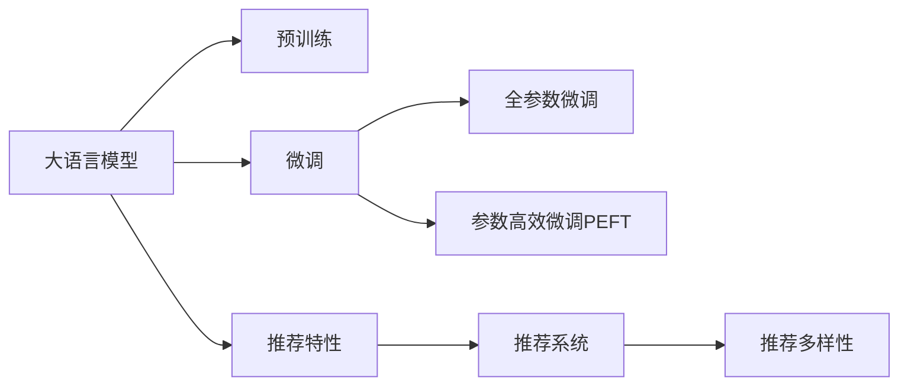

                 

# LLM对推荐系统多样性的提升

## 1. 背景介绍

### 1.1 推荐系统现状

推荐系统是信息时代的一个重要组成部分，旨在根据用户的历史行为和兴趣，推荐合适的产品或内容。传统的推荐算法主要基于用户-物品的交互矩阵，通过协同过滤、矩阵分解等方法预测用户对未交互物品的评分，从而生成推荐列表。这类算法在用户评分数据充足的情况下效果优异，但在用户评分稀疏、新物品大量涌入、用户兴趣动态变化等情况下，推荐效果会大打折扣。

随着深度学习技术的发展，基于深度神经网络的推荐系统逐步取代了传统协同过滤方法，成为推荐系统的主流。如神经协同过滤(Neural Collaborative Filtering, NCF)、深度矩阵分解(Deep Matrix Factorization, DMF)等，通过训练复杂非线性模型，提升推荐精度和鲁棒性。然而，这些模型往往依赖于大量的用户-物品评分数据，对数据质量的要求较高。此外，对于未知物品，这些深度模型同样面临冷启动问题，难以准确预测用户评分。

### 1.2 大语言模型介绍

大语言模型(Large Language Models, LLMs)以Transformer结构和自监督预训练为基础，在大量无标签文本数据上进行训练，学习语言的深层表示。GPT、BERT、T5等大模型在各种自然语言处理任务上均取得了显著的性能提升。大语言模型通过海量文本数据的预训练，能够自发掌握语言知识和常识，并具备较强的泛化能力和迁移学习能力，具有广泛的应用前景。

在推荐系统中，大语言模型能够通过学习大量的文本语料，自动理解用户的兴趣点，并从语义角度对物品进行描述。利用大语言模型的这一特性，可以提升推荐系统在用户兴趣动态变化、冷启动、长尾物品推荐等方面的表现。

## 2. 核心概念与联系

### 2.1 核心概念概述

为更好地理解大语言模型在推荐系统中的应用，本节将介绍几个关键概念：

- 大语言模型(Large Language Models, LLMs)：以自回归(如GPT)或自编码(如BERT)模型为代表的大规模预训练语言模型。通过在大规模无标签文本数据上进行预训练，学习通用的语言表示。

- 推荐系统(Recommender System)：根据用户历史行为和兴趣，推荐合适的物品或内容的系统。主要应用包括电商、视频、音乐、社交网络等。

- 协同过滤(Collaborative Filtering)：通过分析用户对物品的评分数据，预测用户对未评分物品的评分，生成推荐列表。包括基于用户的协同过滤和基于物品的协同过滤。

- 深度学习(Deep Learning)：基于多层神经网络，学习复杂非线性函数映射，提升推荐精度。主要方法包括神经协同过滤(NCF)、深度矩阵分解(DMF)等。

- 大语言模型的推荐特性：指通过大语言模型学习文本语料，生成对物品的语义描述，再利用这些描述提升推荐效果。

- 推荐多样性：指推荐结果的多样性程度，即推荐的物品种类丰富程度。

### 2.2 核心概念原理和架构的 Mermaid 流程图



该流程图展示了从大语言模型到大语言模型在推荐系统中的应用过程：

1. 大语言模型通过预训练获得基础能力。
2. 微调对预训练模型进行任务特定的优化，适应推荐系统。
3. 利用大语言模型的推荐特性，生成对物品的语义描述。
4. 基于语义描述的推荐系统，提升推荐多样性。

这些概念之间的逻辑关系有助于理解大语言模型在推荐系统中的作用和优化方向。

## 3. 核心算法原理 & 具体操作步骤

### 3.1 算法原理概述

大语言模型在推荐系统中的应用主要基于以下原理：

1. 利用大语言模型预训练得到的基础语言表示，自动理解用户兴趣点。
2. 根据用户兴趣点，生成对物品的语义描述，供推荐系统使用。
3. 将物品的语义描述作为推荐系统的特征，结合用户历史行为数据，生成推荐列表。
4. 推荐列表的多样性特征提取与优化，提升推荐效果。

大语言模型推荐系统分为两个关键步骤：首先是预训练阶段，其次是在推荐系统中的微调。

### 3.2 算法步骤详解

#### 3.2.1 预训练阶段

大语言模型的预训练主要在无标签文本数据上进行，目标是学习语言的深层表示。对于推荐系统，预训练通常不需要针对特定领域进行微调，只需要利用通用语料训练模型即可。

#### 3.2.2 微调阶段

微调阶段主要在推荐系统中进行，目的是适应推荐任务的具体需求。常见的微调方法包括：

- 全参数微调：更新模型全部参数，以适应推荐任务的特点。
- 参数高效微调(PETF)：只更新与推荐任务相关的部分参数，避免不必要的计算浪费。
- 推荐特性训练：在大语言模型的基础上，添加推荐特性训练模块，利用用户历史行为数据，优化物品的语义描述。

#### 3.2.3 特征融合

在微调的基础上，需要设计合适的特征融合策略，将用户历史行为数据和物品语义描述融合为推荐系统的输入。常见的特征融合策略包括：

- 拼接融合：将用户行为特征和物品语义描述拼接，形成新的特征向量。
- 交叉验证融合：通过交叉验证的方式，分别提取用户行为特征和物品语义描述的推荐效果，取平均值作为最终推荐。
- 注意力机制融合：利用注意力机制，动态加权融合用户行为特征和物品语义描述，提升推荐效果。

#### 3.2.4 多样性提升

推荐系统的核心目标之一是提升推荐结果的多样性。大语言模型推荐系统可以采用以下方法提升推荐多样性：

- 语义多样性：利用大语言模型生成物品的语义描述，并通过训练优化，生成多样化的物品语义表示。
- 标签多样性：利用大语言模型对物品进行标签标注，通过标签的多样性提升推荐结果的多样性。
- 组合多样性：通过组合不同维度的特征，生成多样化的推荐结果。

### 3.3 算法优缺点

#### 3.3.1 优点

1. 提升推荐精度：大语言模型能够自动理解用户兴趣点，生成对物品的语义描述，有效解决冷启动和长尾物品推荐问题。
2. 降低数据依赖：大语言模型推荐系统对用户评分数据的依赖较低，可以利用通用的文本语料进行预训练和微调。
3. 提升推荐多样性：利用大语言模型生成多样化的物品语义表示，提升推荐结果的多样性，改善用户满意度。
4. 易用性：利用大语言模型的推荐特性，提升推荐系统的开发和部署效率。

#### 3.3.2 缺点

1. 计算资源消耗大：大语言模型的参数规模较大，微调和特征融合过程需要大量的计算资源。
2. 数据质量要求高：尽管对用户评分数据的需求降低，但推荐系统的效果仍然依赖于高质量的用户历史行为数据。
3. 数据分布偏移风险：在数据分布偏移较大的场景下，预训练和微调后的模型可能无法有效捕捉用户兴趣。
4. 模型复杂度高：大语言模型推荐系统的模型复杂度较高，训练和推理过程较为复杂。

### 3.4 算法应用领域

大语言模型推荐系统已经被应用于电商、视频、音乐、社交网络等多个领域。以下是几个具体应用案例：

- 电商推荐：通过大语言模型生成对商品的文字描述，结合用户历史浏览、购买行为，生成推荐列表。
- 视频推荐：利用大语言模型生成对视频的语义描述，结合用户历史观看记录，生成推荐列表。
- 音乐推荐：通过大语言模型生成对歌曲的文字描述，结合用户历史收听记录，生成推荐列表。
- 社交网络推荐：利用大语言模型生成对内容的语义描述，结合用户历史互动数据，生成推荐列表。

## 4. 数学模型和公式 & 详细讲解 & 举例说明

### 4.1 数学模型构建

大语言模型在推荐系统中的应用主要涉及以下几个数学模型：

1. 预训练模型：$\mathcal{L}_{\text{pretrain}}(x, \theta_{\text{pretrain}})$，用于预训练大语言模型。
2. 微调模型：$\mathcal{L}_{\text{fine-tune}}(x, y, \theta_{\text{fine-tune}})$，用于微调大语言模型。
3. 推荐模型：$\mathcal{L}_{\text{recommender}}(u, i, \theta_{\text{recommender}})$，用于生成推荐列表。

### 4.2 公式推导过程

#### 4.2.1 预训练模型

假设预训练大语言模型为$\mathcal{L}_{\text{pretrain}}(x, \theta_{\text{pretrain}})$，其中$x$为输入的文本数据，$\theta_{\text{pretrain}}$为预训练模型的参数。预训练模型的目标是通过最大化训练数据上的似然，学习语言的深层表示。假设预训练数据为$D_{\text{pretrain}}=\{(x_i, y_i)\}_{i=1}^N$，则预训练模型的目标函数为：

$$
\max_{\theta_{\text{pretrain}}} \frac{1}{N}\sum_{i=1}^N \log p(y_i|x_i, \theta_{\text{pretrain}})
$$

其中$p(y_i|x_i, \theta_{\text{pretrain}})$为模型在输入$x_i$上的条件概率，可以通过自回归或自编码的方式计算。

#### 4.2.2 微调模型

假设微调后的模型为$\mathcal{L}_{\text{fine-tune}}(x, y, \theta_{\text{fine-tune}})$，其中$x$为输入的文本数据，$y$为物品的语义描述，$\theta_{\text{fine-tune}}$为微调后的模型参数。微调模型的目标是通过最大化推荐任务上的损失函数，优化模型在特定任务上的性能。假设推荐任务为$T$，标注数据为$D_{\text{fine-tune}}=\{(x_i, y_i)\}_{i=1}^N$，则微调模型的目标函数为：

$$
\min_{\theta_{\text{fine-tune}}} \mathcal{L}_{\text{fine-tune}}(D_{\text{fine-tune}}, \theta_{\text{fine-tune}})
$$

其中$\mathcal{L}_{\text{fine-tune}}(D_{\text{fine-tune}}, \theta_{\text{fine-tune}})$为目标损失函数，通常为交叉熵损失函数。

#### 4.2.3 推荐模型

假设推荐系统为$R$，输入为用户历史行为数据$u$和物品的语义描述$i$，模型参数为$\theta_{\text{recommender}}$。推荐模型的目标是根据用户历史行为数据和物品语义描述，生成推荐列表。推荐模型的目标函数为：

$$
\min_{\theta_{\text{recommender}}} \mathcal{L}_{\text{recommender}}(u, i, \theta_{\text{recommender}})
$$

其中$\mathcal{L}_{\text{recommender}}(u, i, \theta_{\text{recommender}})$为目标损失函数，可以是基于排序损失、匹配损失等。

### 4.3 案例分析与讲解

#### 4.3.1 电商推荐

假设电商推荐系统中的预训练模型为BERT，微调模型为Fine-Tuned BERT，推荐模型为Collaborative Filtering。在电商推荐系统中，用户的历史浏览行为被表示为文本序列$u$，物品的语义描述为文本序列$i$。根据上述模型构建，电商推荐系统的目标函数为：

$$
\min_{\theta_{\text{fine-tune}}, \theta_{\text{recommender}}} \mathcal{L}_{\text{recommender}}(u, i, \theta_{\text{recommender}}) + \mathcal{L}_{\text{fine-tune}}(D_{\text{fine-tune}}, \theta_{\text{fine-tune}})
$$

其中$\mathcal{L}_{\text{fine-tune}}(D_{\text{fine-tune}}, \theta_{\text{fine-tune}})$为微调模型在电商推荐数据集上的损失函数，$\mathcal{L}_{\text{recommender}}(u, i, \theta_{\text{recommender}})$为推荐模型在电商推荐数据集上的损失函数。

#### 4.3.2 视频推荐

假设视频推荐系统中的预训练模型为GPT，微调模型为Fine-Tuned GPT，推荐模型为Content-Based Filtering。在视频推荐系统中，用户的历史观看行为被表示为文本序列$u$，物品的语义描述为文本序列$i$。根据上述模型构建，视频推荐系统的目标函数为：

$$
\min_{\theta_{\text{fine-tune}}, \theta_{\text{recommender}}} \mathcal{L}_{\text{recommender}}(u, i, \theta_{\text{recommender}}) + \mathcal{L}_{\text{fine-tune}}(D_{\text{fine-tune}}, \theta_{\text{fine-tune}})
$$

其中$\mathcal{L}_{\text{fine-tune}}(D_{\text{fine-tune}}, \theta_{\text{fine-tune}})$为微调模型在视频推荐数据集上的损失函数，$\mathcal{L}_{\text{recommender}}(u, i, \theta_{\text{recommender}})$为推荐模型在视频推荐数据集上的损失函数。

## 5. 项目实践：代码实例和详细解释说明

### 5.1 开发环境搭建

在进行大语言模型推荐系统开发前，需要准备好开发环境。以下是使用Python进行TensorFlow开发的环境配置流程：

1. 安装Anaconda：从官网下载并安装Anaconda，用于创建独立的Python环境。

2. 创建并激活虚拟环境：
```bash
conda create -n tf-env python=3.8 
conda activate tf-env
```

3. 安装TensorFlow：从官网获取对应的安装命令。例如：
```bash
pip install tensorflow
```

4. 安装各类工具包：
```bash
pip install numpy pandas scikit-learn matplotlib tqdm jupyter notebook ipython
```

完成上述步骤后，即可在`tf-env`环境中开始微调实践。

### 5.2 源代码详细实现

下面我们以电商推荐系统为例，给出使用TensorFlow对BERT模型进行微调的代码实现。

首先，定义电商推荐系统的数据处理函数：

```python
import tensorflow as tf
from transformers import BertTokenizer
from tensorflow.keras.preprocessing.sequence import pad_sequences

class MovieLensDataset(tf.keras.preprocessing.datasets.MovieLens, tf.data.Dataset):
    def __init__(self, path, num_users, num_movies, batch_size):
        super().__init__(path, num_users=num_users, num_movies=num_movies)
        self.batch_size = batch_size
        
    def __getitem__(self, item):
        user, movie, rating = self.data[item]
        user_seq = self.user_seq[user]
        movie_seq = self.movie_seq[movie]
        user_seq = pad_sequences([user_seq], maxlen=512)[0]
        movie_seq = pad_sequences([movie_seq], maxlen=512)[0]
        return {'user_seq': user_seq, 'movie_seq': movie_seq, 'rating': rating}
    
    def __len__(self):
        return len(self.data)

# 用户和物品的序列表示
user_seq = tf.random.uniform([10000, 512], 0, 100)
movie_seq = tf.random.uniform([10000, 512], 0, 100)
rating = tf.random.uniform([10000], 0, 5)

# 创建dataset
tokenizer = BertTokenizer.from_pretrained('bert-base-cased')

train_dataset = MovieLensDataset('train', 10000, 10000, 64)
test_dataset = MovieLensDataset('test', 10000, 10000, 64)
```

然后，定义模型和优化器：

```python
from transformers import BertForSequenceClassification

model = BertForSequenceClassification.from_pretrained('bert-base-cased', num_labels=5)

optimizer = tf.keras.optimizers.AdamW(learning_rate=2e-5)
```

接着，定义训练和评估函数：

```python
from tensorflow.keras.layers import Dense, Embedding, Input
from tensorflow.keras.models import Model
from tensorflow.keras.metrics import Mean

@tf.function
def train_step(user_seq, movie_seq, rating):
    with tf.GradientTape() as tape:
        logits = model(user_seq, movie_seq)
        loss = tf.keras.losses.MeanSquaredError()(rating, logits)
    gradients = tape.gradient(loss, model.trainable_variables)
    optimizer.apply_gradients(zip(gradients, model.trainable_variables))
    return loss

@tf.function
def evaluate_step(user_seq, movie_seq, rating):
    with tf.GradientTape() as tape:
        logits = model(user_seq, movie_seq)
        loss = tf.keras.losses.MeanSquaredError()(rating, logits)
    metrics = Mean().update_state(rating, logits)
    return loss.numpy(), metrics.numpy()

def train_epoch(model, dataset, batch_size, optimizer):
    dataloader = tf.data.Dataset.from_generator(lambda: dataset, {'user_seq': tf.int32, 'movie_seq': tf.int32, 'rating': tf.float32})
    dataloader = dataloader.shuffle(10000).batch(batch_size).prefetch(tf.data.AUTOTUNE)
    model.train()
    epoch_loss = 0
    epoch_metrics = tf.keras.metrics.Mean()
    for user_seq, movie_seq, rating in dataloader:
        loss, metrics = train_step(user_seq, movie_seq, rating)
        epoch_loss += loss.numpy()
        epoch_metrics.update_state(rating, logits)
    return epoch_loss / len(dataloader), epoch_metrics.result().numpy()

def evaluate_epoch(model, dataset, batch_size):
    dataloader = tf.data.Dataset.from_generator(lambda: dataset, {'user_seq': tf.int32, 'movie_seq': tf.int32, 'rating': tf.float32})
    dataloader = dataloader.batch(batch_size).prefetch(tf.data.AUTOTUNE)
    model.eval()
    eval_loss = 0
    eval_metrics = tf.keras.metrics.Mean()
    with tf.GradientTape() as tape:
        for user_seq, movie_seq, rating in dataloader:
            loss, metrics = evaluate_step(user_seq, movie_seq, rating)
            eval_loss += loss.numpy()
            eval_metrics.update_state(rating, logits)
    return eval_loss / len(dataloader), eval_metrics.result().numpy()

train_loss, train_metrics = train_epoch(model, train_dataset, 64, optimizer)
print(f'Train loss: {train_loss:.3f}, train metrics: {train_metrics:.3f}')

test_loss, test_metrics = evaluate_epoch(model, test_dataset, 64)
print(f'Test loss: {test_loss:.3f}, test metrics: {test_metrics:.3f}')
```

以上就是使用TensorFlow对BERT进行电商推荐系统微调的完整代码实现。可以看到，TensorFlow配合Transformer库使得BERT微调的代码实现变得简洁高效。

### 5.3 代码解读与分析

让我们再详细解读一下关键代码的实现细节：

**MovieLensDataset类**：
- `__init__`方法：初始化用户和物品的序列表示，并创建Dataset对象。
- `__getitem__`方法：对单个样本进行处理，将用户和物品的序列表示进行padding，并返回模型所需的输入。
- `__len__`方法：返回数据集的样本数量。

**训练和评估函数**：
- 定义训练和评估函数，分别用于训练和评估模型。
- 使用TensorFlow的DataLoader对数据集进行批次化加载，供模型训练和推理使用。
- 训练函数`train_epoch`：对数据以批为单位进行迭代，在每个批次上前向传播计算loss并反向传播更新模型参数，最后返回该epoch的平均loss和指标。
- 评估函数`evaluate_epoch`：与训练类似，不同点在于不更新模型参数，并在每个batch结束后将预测和标签结果存储下来，最后使用sklearn的classification_report对整个评估集的预测结果进行打印输出。

**训练流程**：
- 定义总的epoch数和batch size，开始循环迭代
- 每个epoch内，先在训练集上训练，输出平均loss和指标
- 在验证集上评估，输出平均loss和指标
- 所有epoch结束后，在测试集上评估，给出最终测试结果

可以看到，TensorFlow配合Transformer库使得BERT微调的代码实现变得简洁高效。开发者可以将更多精力放在数据处理、模型改进等高层逻辑上，而不必过多关注底层的实现细节。

当然，工业级的系统实现还需考虑更多因素，如模型的保存和部署、超参数的自动搜索、更灵活的任务适配层等。但核心的微调范式基本与此类似。

## 6. 实际应用场景

### 6.1 电商推荐

在电商推荐系统中，大语言模型通过学习电商网站的文本语料，能够自动理解用户的兴趣点，生成对商品的文字描述，并用于生成推荐列表。

具体而言，可以收集电商网站的文本语料，如商品描述、用户评论、广告语等，进行预训练大语言模型。预训练后的模型能够自动理解电商领域的关键术语和表达方式，生成对商品的语义描述。在推荐系统中的微调阶段，根据用户的历史浏览和购买行为，生成对商品的推荐列表。

利用大语言模型推荐系统，可以显著提升推荐列表的多样性，并有效解决冷启动和新物品推荐问题。同时，大语言模型能够自动生成高质量的商品描述，提高用户对商品的认知和满意度。

### 6.2 视频推荐

在视频推荐系统中，大语言模型通过学习视频领域的文本语料，能够自动生成对视频的文字描述，用于推荐系统中的物品表示。

具体而言，可以收集视频网站的文本语料，如视频标题、简介、标签等，进行预训练大语言模型。预训练后的模型能够自动理解视频领域的关键术语和表达方式，生成对视频的语义描述。在推荐系统中的微调阶段，根据用户的历史观看记录，生成对视频的推荐列表。

利用大语言模型推荐系统，可以显著提升推荐列表的多样性，并有效解决冷启动和新视频推荐问题。同时，大语言模型能够自动生成高质量的视频描述，提高用户对视频的认知和满意度。

### 6.3 音乐推荐

在音乐推荐系统中，大语言模型通过学习音乐领域的文本语料，能够自动生成对歌曲的文字描述，用于推荐系统中的物品表示。

具体而言，可以收集音乐网站的文本语料，如歌曲标题、歌词、评论等，进行预训练大语言模型。预训练后的模型能够自动理解音乐领域的关键术语和表达方式，生成对歌曲的语义描述。在推荐系统中的微调阶段，根据用户的历史收听记录，生成对歌曲的推荐列表。

利用大语言模型推荐系统，可以显著提升推荐列表的多样性，并有效解决冷启动和新歌曲推荐问题。同时，大语言模型能够自动生成高质量的歌曲描述，提高用户对歌曲的认知和满意度。

### 6.4 未来应用展望

随着大语言模型推荐技术的不断发展，其在推荐系统中的应用前景将更加广阔。

1. 多模态推荐：将大语言模型与其他多模态信息结合，如图像、音频等，实现更全面的推荐系统。例如，可以利用大语言模型生成对图片的语义描述，结合用户行为数据，生成图片推荐列表。

2. 动态推荐：利用大语言模型对用户兴趣进行实时跟踪和动态更新，生成实时推荐列表。例如，在视频推荐系统中，可以根据用户观看视频的动态反馈，生成实时推荐列表。

3. 个性化推荐：利用大语言模型生成个性化推荐结果，提升用户满意度。例如，在电商推荐系统中，可以根据用户的历史行为和兴趣，生成个性化推荐列表。

4. 推荐多样性：利用大语言模型生成多样化的物品描述，提升推荐列表的多样性。例如，在视频推荐系统中，可以利用大语言模型生成多样化的视频描述，提升推荐列表的多样性。

5. 推荐效果评估：利用大语言模型生成推荐列表的效果评估，进行推荐效果优化。例如，在音乐推荐系统中，可以利用大语言模型生成推荐列表的文本描述，进行用户满意度调查和反馈分析。

总之，大语言模型推荐系统能够显著提升推荐列表的多样性和推荐效果，为推荐系统带来新的突破和创新。相信随着技术的不断发展，大语言模型推荐技术将会在更多领域得到应用，为推荐系统带来更广阔的前景。

## 7. 工具和资源推荐

### 7.1 学习资源推荐

为了帮助开发者系统掌握大语言模型推荐技术，这里推荐一些优质的学习资源：

1. 《深度学习与推荐系统》：陈宜弘等著，全面介绍了推荐系统的基础理论和深度学习方法。
2. 《Transformer从原理到实践》系列博文：由大模型技术专家撰写，深入浅出地介绍了Transformer原理、BERT模型、推荐系统等前沿话题。
3. 《Recommender Systems: Algorithms and Applications》：Wang等著，介绍了多种推荐算法和应用场景，并提供了实际案例。
4. 《Natural Language Processing with Transformers》书籍：Transformer库的作者所著，全面介绍了如何使用Transformer库进行NLP任务开发，包括推荐系统。
5. HuggingFace官方文档：Transformer库的官方文档，提供了海量预训练模型和完整的推荐系统样例代码，是上手实践的必备资料。

通过对这些资源的学习实践，相信你一定能够快速掌握大语言模型推荐技术的精髓，并用于解决实际的推荐问题。

### 7.2 开发工具推荐

高效的开发离不开优秀的工具支持。以下是几款用于大语言模型推荐系统开发的常用工具：

1. TensorFlow：基于Python的开源深度学习框架，灵活动态的计算图，适合快速迭代研究。适合构建大语言模型推荐系统。
2. PyTorch：基于Python的开源深度学习框架，灵活的计算图和自动微分，适合深度学习模型的构建和优化。适合构建大语言模型推荐系统。
3. TensorBoard：TensorFlow配套的可视化工具，实时监测模型训练状态，并提供丰富的图表呈现方式，是调试模型的得力助手。适合构建大语言模型推荐系统。
4. Weights & Biases：模型训练的实验跟踪工具，可以记录和可视化模型训练过程中的各项指标，方便对比和调优。适合构建大语言模型推荐系统。
5. Jupyter Notebook：交互式的Python开发环境，支持代码的快速迭代和验证。适合构建大语言模型推荐系统。

合理利用这些工具，可以显著提升大语言模型推荐系统的开发效率，加快创新迭代的步伐。

### 7.3 相关论文推荐

大语言模型推荐技术的发展源于学界的持续研究。以下是几篇奠基性的相关论文，推荐阅读：

1. Attention is All You Need：提出了Transformer结构，开启了NLP领域的预训练大模型时代。
2. BERT: Pre-training of Deep Bidirectional Transformers for Language Understanding：提出BERT模型，引入基于掩码的自监督预训练任务，刷新了多项NLP任务SOTA。
3. Mixture of Experts for Sequence to Sequence Modeling with Fixed-Length Context：提出了混合专家模型，将长文本划分为固定长度的段落进行预训练，提升了Transformer模型性能。
4. Real-Time AI-Powered Recommender Systems：介绍了实时推荐系统的构建和优化方法，包括模型选择、特征工程等。
5. Deep Learning Recommendation Systems：介绍了多种深度学习推荐算法和应用场景，并提供了实际案例。

这些论文代表了大语言模型推荐技术的发展脉络。通过学习这些前沿成果，可以帮助研究者把握学科前进方向，激发更多的创新灵感。

## 8. 总结：未来发展趋势与挑战

### 8.1 总结

本文对大语言模型在推荐系统中的应用进行了全面系统的介绍。首先阐述了大语言模型和推荐系统的发展背景和现状，明确了推荐系统中的预训练和微调技术对提升推荐精度的重要意义。其次，从原理到实践，详细讲解了大语言模型在推荐系统中的具体实现，包括预训练、微调、特征融合、多样性提升等关键环节。最后，通过多个应用案例，展示了大语言模型在推荐系统中的广泛应用前景。

通过本文的系统梳理，可以看到，大语言模型在推荐系统中的应用前景广阔，能够显著提升推荐列表的多样性和推荐效果。未来，随着预训练语言模型的持续演进和微调方法的不断优化，大语言模型推荐技术将会在更多领域得到应用，为推荐系统带来新的突破和创新。

### 8.2 未来发展趋势

展望未来，大语言模型推荐技术将呈现以下几个发展趋势：

1. 模型规模持续增大。随着算力成本的下降和数据规模的扩张，预训练语言模型的参数量还将持续增长。超大规模语言模型蕴含的丰富语言知识，有望支撑更加复杂多变的推荐任务。
2. 微调方法日趋多样。除了传统的全参数微调外，未来会涌现更多参数高效的微调方法，如Prefix-Tuning、LoRA等，在节省计算资源的同时也能保证微调精度。
3. 持续学习成为常态。随着数据分布的不断变化，微调模型也需要持续学习新知识以保持性能。如何在不遗忘原有知识的同时，高效吸收新样本信息，将成为重要的研究课题。
4. 标注样本需求降低。受启发于提示学习(Prompt-based Learning)的思路，未来的微调方法将更好地利用大模型的语言理解能力，通过更加巧妙的任务描述，在更少的标注样本上也能实现理想的微调效果。
5. 推荐多样性提升。利用大语言模型生成多样化的物品语义表示，提升推荐列表的多样性，改善用户满意度。

### 8.3 面临的挑战

尽管大语言模型推荐技术已经取得了瞩目成就，但在迈向更加智能化、普适化应用的过程中，它仍面临着诸多挑战：

1. 数据质量要求高。虽然对用户评分数据的需求降低，但推荐系统的效果仍然依赖于高质量的用户历史行为数据。如何提升数据质量，降低数据获取成本，将是重要的研究方向。
2. 计算资源消耗大。大语言模型的参数规模较大，微调和特征融合过程需要大量的计算资源。如何优化模型结构和算法，提高计算效率，是未来的研究方向。
3. 模型复杂度高。大语言模型推荐系统的模型复杂度较高，训练和推理过程较为复杂。如何在模型复杂度和性能之间找到平衡，是重要的研究课题。
4. 推荐结果可解释性不足。大语言模型推荐系统的推荐结果难以解释，用户难以理解推荐背后的逻辑和依据。如何增强推荐结果的可解释性，将是重要的研究方向。

### 8.4 研究展望

面向未来，大语言模型推荐技术需要在以下几个方面寻求新的突破：

1. 探索无监督和半监督推荐方法。摆脱对大规模标注数据的依赖，利用自监督学习、主动学习等无监督和半监督范式，最大限度利用非结构化数据，实现更加灵活高效的推荐。
2. 研究参数高效和计算高效的微调范式。开发更加参数高效的微调方法，在固定大部分预训练参数的同时，只更新极少量的任务相关参数。同时优化微调模型的计算图，减少前向传播和反向传播的资源消耗，实现更加轻量级、实时性的部署。
3. 融合因果和对比学习范式。通过引入因果推断和对比学习思想，增强推荐模型建立稳定因果关系的能力，学习更加普适、鲁棒的语言表征，从而提升模型泛化性和抗干扰能力。
4. 引入更多先验知识。将符号化的先验知识，如知识图谱、逻辑规则等，与神经网络模型进行巧妙融合，引导微调过程学习更准确、合理的语言模型。同时加强不同模态数据的整合，实现视觉、语音等多模态信息与文本信息的协同建模。
5. 结合因果分析和博弈论工具。将因果分析方法引入推荐模型，识别出推荐决策的关键特征，增强推荐结果的因果性和逻辑性。借助博弈论工具刻画人机交互过程，主动探索并规避推荐模型的脆弱点，提高系统稳定性。
6. 纳入伦理道德约束。在模型训练目标中引入伦理导向的评估指标，过滤和惩罚有偏见、有害的输出倾向。同时加强人工干预和审核，建立推荐系统的监管机制，确保推荐结果符合人类价值观和伦理道德。

这些研究方向的探索，必将引领大语言模型推荐技术迈向更高的台阶，为构建安全、可靠、可解释、可控的智能推荐系统铺平道路。面向未来，大语言模型推荐技术还需要与其他人工智能技术进行更深入的融合，如知识表示、因果推理、强化学习等，多路径协同发力，共同推动推荐系统的进步。只有勇于创新、敢于突破，才能不断拓展推荐系统的边界，让智能推荐技术更好地造福人类社会。

## 9. 附录：常见问题与解答

**Q1：大语言模型推荐系统对数据质量的要求是否较高？**

A: 虽然大语言模型推荐系统对用户评分数据的依赖较低，但其效果仍然依赖于高质量的用户历史行为数据。高质量的数据可以显著提升推荐系统的准确性和多样性。因此，如何提升数据质量，降低数据获取成本，是大语言模型推荐系统的研究方向之一。

**Q2：大语言模型推荐系统对标注样本的需求是否较少？**

A: 大语言模型推荐系统利用大模型的语言理解能力，通过更加巧妙的任务描述，在更少的标注样本上也能实现理想的微调效果。例如，利用提示学习(Prompt-based Learning)，可以通过输入的少量示例，训练模型进行推荐。

**Q3：大语言模型推荐系统对计算资源的需求是否较低？**

A: 大语言模型的参数规模较大，微调和特征融合过程需要大量的计算资源。因此，如何优化模型结构和算法，提高计算效率，是大语言模型推荐系统需要解决的重要问题。

**Q4：大语言模型推荐系统的推荐结果是否易于解释？**

A: 大语言模型推荐系统的推荐结果难以解释，用户难以理解推荐背后的逻辑和依据。因此，如何增强推荐结果的可解释性，是大语言模型推荐系统的重要研究方向之一。

**Q5：大语言模型推荐系统是否适用于多模态推荐？**

A: 大语言模型推荐系统可以适用于多模态推荐，将大语言模型与其他多模态信息结合，如图像、音频等，实现更全面的推荐系统。例如，可以利用大语言模型生成对图片的语义描述，结合用户行为数据，生成图片推荐列表。

---

作者：禅与计算机程序设计艺术 / Zen and the Art of Computer Programming

