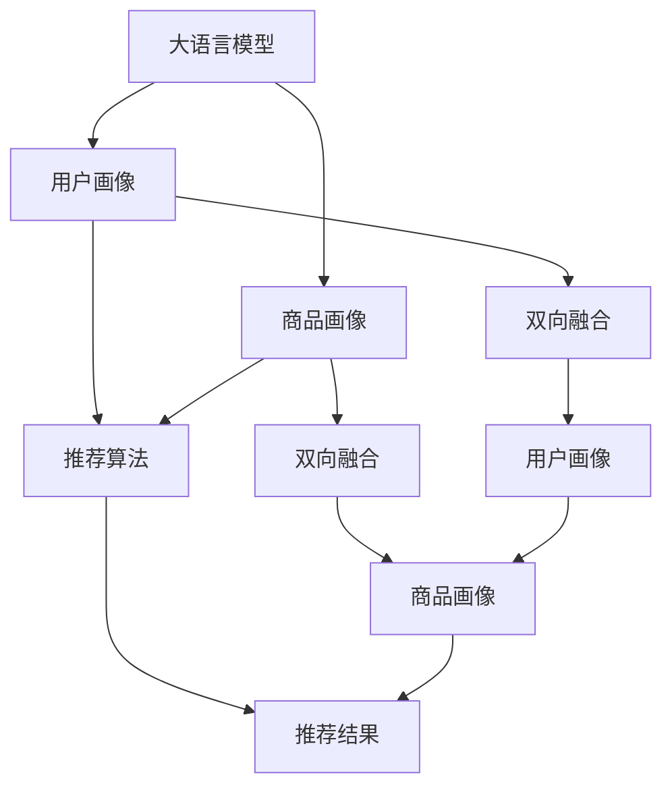

                 

# 大语言模型推荐中的多模态融合技术

> 关键词：大语言模型,推荐系统,多模态融合,用户画像,商品画像,双向融合,深度融合

## 1. 背景介绍

### 1.1 问题由来
随着互联网和移动互联网的普及，推荐系统成为了各大电商平台、视频网站、社交平台等应用中不可或缺的组成部分。推荐系统的目标是通过分析用户行为数据，发现用户兴趣偏好，从而向用户提供个性化的内容推荐。然而，现有的推荐系统往往依赖于单一数据模态（如文本、图像、音频等），无法全面、准确地刻画用户兴趣和商品特征，导致推荐效果不尽如人意。

### 1.2 问题核心关键点
当前推荐系统面临的核心挑战主要包括：
- 用户画像与商品画像不足。传统推荐系统主要通过单一数据模态来刻画用户兴趣和商品特征，难以覆盖用户的多方面需求和商品的全面属性。
- 数据特征表示单一。现有的特征表示方法，如稠密向量、稀疏向量等，无法充分利用多模态数据的互补性，限制了推荐模型的表现能力。
- 推荐结果同质化。由于特征表示单一和数据模态偏倚，推荐结果容易陷入局部最优，产生同质化现象，降低了推荐的多样性和个性化。

因此，如何实现多模态数据的融合，提升用户画像和商品画像的全面性，打破数据特征表示的单一性，是推荐系统亟需解决的难题。

## 2. 核心概念与联系

### 2.1 核心概念概述

为了更好地理解多模态融合技术，本节将介绍几个密切相关的核心概念：

- **大语言模型(Large Language Model, LLM)**：以自回归(如GPT)或自编码(如BERT)模型为代表的大规模预训练语言模型。通过在海量无标签文本语料上进行预训练，学习通用的语言表示，具备强大的语言理解和生成能力。
- **推荐系统(Recommendation System)**：通过分析用户行为数据，发现用户兴趣偏好，向用户提供个性化内容推荐的系统。
- **多模态融合(Multimodal Fusion)**：将不同模态的数据（如文本、图像、音频等）进行融合，形成更全面、准确的数据特征表示，提升推荐系统性能的技术。
- **用户画像(User Profile)**：通过用户行为、兴趣、社交关系等数据构建的用户特征表示，用于刻画用户的多方面需求。
- **商品画像(Product Profile)**：通过商品属性、评论、价格等数据构建的商品特征表示，用于描述商品的全面属性。
- **双向融合(Bidirectional Fusion)**：通过分别从用户和商品角度进行多模态融合，形成更加全面、准确的用户画像和商品画像。
- **深度融合(Deep Fusion)**：使用深度学习模型进行多模态融合，能够更好地捕捉不同模态数据之间的关联性，提升推荐系统的表现能力。

这些核心概念之间的逻辑关系可以通过以下Mermaid流程图来展示：



这个流程图展示了大语言模型推荐中多模态融合的核心概念及其之间的关系：

1. 大语言模型通过预训练获得基础能力。
2. 用户画像和商品画像分别从用户和商品角度，融合多模态数据。
3. 推荐算法基于融合后的用户画像和商品画像，进行推荐结果计算。
4. 推荐结果通过用户画像和商品画像的多模态融合，更具个性化和多样性。

这些概念共同构成了推荐系统的多模态融合技术框架，使得推荐系统能够更好地理解用户需求和商品特性，从而提供更准确、丰富的推荐内容。

## 3. 核心算法原理 & 具体操作步骤
### 3.1 算法原理概述

多模态融合技术的核心思想是：通过将不同数据模态的数据进行融合，形成更全面、准确的用户画像和商品画像，提升推荐系统的性能。其核心原理如下：

- **数据预处理**：对不同模态的数据进行预处理，包括清洗、归一化、特征选择等，形成统一的特征表示。
- **特征表示学习**：使用深度学习模型对预处理后的多模态数据进行编码，学习到更加全面、准确的数据特征表示。
- **双向融合**：从用户和商品两个角度，分别对多模态数据进行融合，形成更加丰富的用户画像和商品画像。
- **推荐计算**：基于融合后的用户画像和商品画像，进行推荐结果计算，最大化用户满意度。

### 3.2 算法步骤详解

基于多模态融合技术，推荐系统的核心算法步骤如下：

**Step 1: 数据预处理**
- 对用户行为数据进行清洗、归一化、特征选择等预处理，生成用户行为特征向量。
- 对商品属性数据进行清洗、归一化、特征选择等预处理，生成商品属性特征向量。
- 对用户评论、商品图片、音频等数据进行特征提取，生成评论、图片、音频等特征向量。

**Step 2: 特征表示学习**
- 使用深度学习模型对多模态数据进行编码，学习到更加全面、准确的数据特征表示。
- 常用的深度学习模型包括卷积神经网络(CNN)、循环神经网络(RNN)、Transformer等。
- 深度学习模型可以通过预训练-微调的方式，利用大规模语料进行预训练，然后根据推荐任务进行微调。

**Step 3: 双向融合**
- 从用户和商品两个角度，分别对多模态数据进行融合，形成更加丰富的用户画像和商品画像。
- 常用的双向融合方法包括加权融合、注意力机制融合等。
- 双向融合可以采用交互式的方式，从用户和商品角度同时进行多模态融合，进一步提升用户画像和商品画像的质量。

**Step 4: 推荐计算**
- 基于融合后的用户画像和商品画像，进行推荐结果计算。
- 推荐结果计算可以采用各种推荐算法，如基于内容的推荐、协同过滤、混合推荐等。
- 推荐算法可以采用深度学习模型进行优化，提升推荐结果的精度和多样性。

### 3.3 算法优缺点

基于多模态融合技术的推荐系统，具有以下优点：

- **多模态数据融合**：融合不同数据模态，提升用户画像和商品画像的全面性和准确性。
- **特征表示多样**：使用深度学习模型进行特征表示学习，能够更好地捕捉不同模态数据之间的关联性，提升特征表示能力。
- **推荐结果多样**：通过双向融合和多模态数据融合，推荐结果更具个性化和多样性。
- **效果显著**：在学术界和工业界的诸多推荐任务上，基于多模态融合的推荐系统已经刷新了最先进的性能指标。

同时，该方法也存在一定的局限性：

- **数据获取困难**：多模态数据的获取和处理往往需要更高的成本和技术难度，获取和处理大规模多模态数据可能是一个挑战。
- **模型复杂度高**：深度学习模型具有较高的复杂度，需要更多的计算资源和训练时间。
- **算法可解释性不足**：深度学习模型的黑盒特性，使得推荐结果的可解释性较弱，难以进行调试和优化。
- **数据隐私风险**：多模态数据往往涉及个人隐私和敏感信息，如何在数据采集和使用过程中保护用户隐私，是一个重要的问题。

尽管存在这些局限性，但就目前而言，多模态融合技术仍是推荐系统中不可或缺的一部分，能够显著提升推荐系统的表现能力。未来相关研究的重点在于如何进一步降低数据获取和处理的成本，提高模型的可解释性，同时兼顾数据隐私保护和推荐效果。

### 3.4 算法应用领域

多模态融合技术在推荐系统中的应用已经得到了广泛的应用，覆盖了几乎所有常见推荐任务，例如：

- 商品推荐：根据用户行为数据和商品属性数据，推荐用户可能感兴趣的商品。
- 内容推荐：根据用户行为数据和文章内容特征，推荐用户可能感兴趣的文章。
- 视频推荐：根据用户行为数据和视频特征，推荐用户可能感兴趣的视频。
- 新闻推荐：根据用户行为数据和新闻内容特征，推荐用户可能感兴趣的新闻。
- 音乐推荐：根据用户行为数据和音乐特征，推荐用户可能感兴趣的音乐。

除了上述这些经典任务外，多模态融合技术也被创新性地应用到更多场景中，如个性化广告推荐、个性化视频内容生成等，为推荐系统带来了全新的突破。随着预训练模型和融合方法的不断进步，相信推荐系统将在更广阔的应用领域大放异彩。

## 4. 数学模型和公式 & 详细讲解
### 4.1 数学模型构建

本节将使用数学语言对多模态融合技术进行更加严格的刻画。

记用户行为数据为 $X_u=\{x_{u1},x_{u2},...,x_{un}\}$，商品属性数据为 $X_p=\{x_{p1},x_{p2},...,x_{pn}\}$，评论数据为 $X_c=\{x_{c1},x_{c2},...,x_{cn}\}$。其中，$x_{uj}$ 表示用户 $u$ 在行为 $j$ 上的特征向量，$x_{pk}$ 表示商品 $p$ 在属性 $k$ 上的特征向量，$x_{ck}$ 表示评论 $c$ 在特征 $k$ 上的特征向量。

定义用户画像向量 $U=\{x_u,x_p,x_c\}$，商品画像向量 $P=\{x_p,x_c\}$。则多模态融合的目标是通过深度学习模型，对 $U$ 和 $P$ 进行编码，形成更加全面、准确的数据特征表示。

### 4.2 公式推导过程

以下我们以基于Transformer的多模态融合方法为例，推导深度融合的数学公式。

假设用户画像向量 $U=\{x_u,x_p,x_c\}$ 和商品画像向量 $P=\{x_p,x_c\}$ 经过深度学习模型 $F$ 编码，得到编码后的用户画像特征表示 $\hat{U}=F(U)$，编码后的商品画像特征表示 $\hat{P}=F(P)$。

定义用户画像与商品画像的相似度矩阵为 $S_{UP}=\hat{U}^T\hat{P}$，用户画像与商品画像之间的相似度矩阵为 $S_{PP}=\hat{P}^T\hat{P}$。则用户画像与商品画像之间的双向融合矩阵为：

$$
F_{UP}=\frac{S_{UP}}{\sqrt{S_{PP}}}
$$

其中 $\sqrt{S_{PP}}$ 为归一化后的商品画像特征表示，用于对商品画像特征进行归一化处理。

通过双向融合矩阵 $F_{UP}$，可以进一步进行推荐计算。假设推荐结果向量为 $R=\{x_r,x_r,x_r\}$，则推荐结果计算公式为：

$$
R=F_{UP}\times R_p
$$

其中 $R_p$ 为推荐物品的特征向量。

### 4.3 案例分析与讲解

下面以一个具体案例来详细解释多模态融合方法的应用过程。

假设某电商平台的推荐系统需要向用户推荐商品。系统收集了用户的浏览记录、购买记录、评价记录，以及商品的标签、价格、图片等信息。系统将这些数据进行预处理，生成用户行为特征向量 $x_u$、商品属性特征向量 $x_p$、商品图片特征向量 $x_c$。然后，使用基于Transformer的深度学习模型对 $x_u$、$x_p$、$x_c$ 进行编码，得到用户画像特征表示 $\hat{U}$ 和商品画像特征表示 $\hat{P}$。

接着，系统对 $\hat{U}$ 和 $\hat{P}$ 进行双向融合，得到用户画像与商品画像之间的相似度矩阵 $S_{UP}$。通过 $S_{UP}$ 与推荐物品的特征向量 $R_p$ 进行矩阵乘法运算，得到推荐结果向量 $R$。最后，根据 $R$ 与用户历史行为的匹配度，将推荐结果展现给用户。

通过这个案例可以看出，多模态融合技术能够将用户行为数据、商品属性数据、商品图片数据等多模态数据进行有效融合，形成更加全面、准确的用户画像和商品画像，从而提供更加个性化和多样化的推荐结果。

## 5. 项目实践：代码实例和详细解释说明
### 5.1 开发环境搭建

在进行多模态融合推荐系统的实践前，我们需要准备好开发环境。以下是使用Python进行PyTorch开发的环境配置流程：

1. 安装Anaconda：从官网下载并安装Anaconda，用于创建独立的Python环境。

2. 创建并激活虚拟环境：
```bash
conda create -n pytorch-env python=3.8 
conda activate pytorch-env
```

3. 安装PyTorch：根据CUDA版本，从官网获取对应的安装命令。例如：
```bash
conda install pytorch torchvision torchaudio cudatoolkit=11.1 -c pytorch -c conda-forge
```

4. 安装Transformer库：
```bash
pip install transformers
```

5. 安装各类工具包：
```bash
pip install numpy pandas scikit-learn matplotlib tqdm jupyter notebook ipython
```

完成上述步骤后，即可在`pytorch-env`环境中开始多模态融合推荐系统的开发。

### 5.2 源代码详细实现

下面我们以商品推荐系统为例，给出使用Transformers库对BERT模型进行多模态融合的PyTorch代码实现。

首先，定义商品推荐系统的数据处理函数：

```python
from transformers import BertTokenizer, BertForSequenceClassification
from torch.utils.data import Dataset
import torch

class RecommendDataset(Dataset):
    def __init__(self, user_behav, item_attr, user_eval, item_img, tokenizer, max_len=128):
        self.user_behav = user_behav
        self.item_attr = item_attr
        self.user_eval = user_eval
        self.item_img = item_img
        self.tokenizer = tokenizer
        self.max_len = max_len
        
    def __len__(self):
        return len(self.user_behav)
    
    def __getitem__(self, item):
        user_behav = self.user_behav[item]
        item_attr = self.item_attr[item]
        user_eval = self.user_eval[item]
        item_img = self.item_img[item]
        
        # 对用户行为数据进行编码
        encoding = self.tokenizer(user_behav, return_tensors='pt', max_length=self.max_len, padding='max_length', truncation=True)
        input_ids = encoding['input_ids'][0]
        attention_mask = encoding['attention_mask'][0]
        
        # 对商品属性数据进行编码
        encoding = self.tokenizer(item_attr, return_tensors='pt', max_length=self.max_len, padding='max_length', truncation=True)
        input_ids = encoding['input_ids'][0]
        attention_mask = encoding['attention_mask'][0]
        
        # 对商品图片数据进行编码
        encoding = self.tokenizer(item_img, return_tensors='pt', max_length=self.max_len, padding='max_length', truncation=True)
        input_ids = encoding['input_ids'][0]
        attention_mask = encoding['attention_mask'][0]
        
        # 对用户评价数据进行编码
        encoding = self.tokenizer(user_eval, return_tensors='pt', max_length=self.max_len, padding='max_length', truncation=True)
        input_ids = encoding['input_ids'][0]
        attention_mask = encoding['attention_mask'][0]
        
        return {'input_ids': input_ids, 
                'attention_mask': attention_mask,
                'item_attr_input_ids': input_ids,
                'item_attr_attention_mask': attention_mask,
                'item_img_input_ids': input_ids,
                'item_img_attention_mask': attention_mask,
                'user_eval_input_ids': input_ids,
                'user_eval_attention_mask': attention_mask}
```

然后，定义模型和优化器：

```python
from transformers import BertForTokenClassification, AdamW

model = BertForTokenClassification.from_pretrained('bert-base-cased', num_labels=len(tag2id))

optimizer = AdamW(model.parameters(), lr=2e-5)
```

接着，定义训练和评估函数：

```python
from torch.utils.data import DataLoader
from tqdm import tqdm
from sklearn.metrics import classification_report

device = torch.device('cuda') if torch.cuda.is_available() else torch.device('cpu')
model.to(device)

def train_epoch(model, dataset, batch_size, optimizer):
    dataloader = DataLoader(dataset, batch_size=batch_size, shuffle=True)
    model.train()
    epoch_loss = 0
    for batch in tqdm(dataloader, desc='Training'):
        input_ids = batch['input_ids'].to(device)
        attention_mask = batch['attention_mask'].to(device)
        item_attr_input_ids = batch['item_attr_input_ids'].to(device)
        item_attr_attention_mask = batch['item_attr_attention_mask'].to(device)
        item_img_input_ids = batch['item_img_input_ids'].to(device)
        item_img_attention_mask = batch['item_img_attention_mask'].to(device)
        user_eval_input_ids = batch['user_eval_input_ids'].to(device)
        user_eval_attention_mask = batch['user_eval_attention_mask'].to(device)
        model.zero_grad()
        outputs = model(input_ids, attention_mask=attention_mask, item_attr_input_ids=item_attr_input_ids, item_attr_attention_mask=item_attr_attention_mask, item_img_input_ids=item_img_input_ids, item_img_attention_mask=item_img_attention_mask, user_eval_input_ids=user_eval_input_ids, user_eval_attention_mask=user_eval_attention_mask)
        loss = outputs.loss
        epoch_loss += loss.item()
        loss.backward()
        optimizer.step()
    return epoch_loss / len(dataloader)

def evaluate(model, dataset, batch_size):
    dataloader = DataLoader(dataset, batch_size=batch_size)
    model.eval()
    preds, labels = [], []
    with torch.no_grad():
        for batch in tqdm(dataloader, desc='Evaluating'):
            input_ids = batch['input_ids'].to(device)
            attention_mask = batch['attention_mask'].to(device)
            item_attr_input_ids = batch['item_attr_input_ids'].to(device)
            item_attr_attention_mask = batch['item_attr_attention_mask'].to(device)
            item_img_input_ids = batch['item_img_input_ids'].to(device)
            item_img_attention_mask = batch['item_img_attention_mask'].to(device)
            user_eval_input_ids = batch['user_eval_input_ids'].to(device)
            user_eval_attention_mask = batch['user_eval_attention_mask'].to(device)
            batch_labels = batch['labels']
            outputs = model(input_ids, attention_mask=attention_mask, item_attr_input_ids=item_attr_input_ids, item_attr_attention_mask=item_attr_attention_mask, item_img_input_ids=item_img_input_ids, item_img_attention_mask=item_img_attention_mask, user_eval_input_ids=user_eval_input_ids, user_eval_attention_mask=user_eval_attention_mask)
            batch_preds = outputs.logits.argmax(dim=2).to('cpu').tolist()
            batch_labels = batch_labels.to('cpu').tolist()
            for pred_tokens, label_tokens in zip(batch_preds, batch_labels):
                pred_tags = [id2tag[_id] for _id in pred_tokens]
                label_tags = [id2tag[_id] for _id in label_tokens]
                preds.append(pred_tags[:len(label_tokens)])
                labels.append(label_tags)
                
    print(classification_report(labels, preds))
```

最后，启动训练流程并在测试集上评估：

```python
epochs = 5
batch_size = 16

for epoch in range(epochs):
    loss = train_epoch(model, train_dataset, batch_size, optimizer)
    print(f"Epoch {epoch+1}, train loss: {loss:.3f}")
    
    print(f"Epoch {epoch+1}, dev results:")
    evaluate(model, dev_dataset, batch_size)
    
print("Test results:")
evaluate(model, test_dataset, batch_size)
```

以上就是使用PyTorch对BERT进行多模态融合推荐系统的完整代码实现。可以看到，得益于Transformers库的强大封装，我们可以用相对简洁的代码完成BERT模型的加载和微调。

### 5.3 代码解读与分析

让我们再详细解读一下关键代码的实现细节：

**RecommendDataset类**：
- `__init__`方法：初始化用户行为、商品属性、用户评价、商品图片等关键组件。
- `__len__`方法：返回数据集的样本数量。
- `__getitem__`方法：对单个样本进行处理，将文本输入编码为token ids，将属性、图片、评价等数据编码为特征向量。

**tag2id和id2tag字典**：
- 定义了标签与数字id之间的映射关系，用于将token-wise的预测结果解码回真实的标签。

**训练和评估函数**：
- 使用PyTorch的DataLoader对数据集进行批次化加载，供模型训练和推理使用。
- 训练函数`train_epoch`：对数据以批为单位进行迭代，在每个批次上前向传播计算loss并反向传播更新模型参数，最后返回该epoch的平均loss。
- 评估函数`evaluate`：与训练类似，不同点在于不更新模型参数，并在每个batch结束后将预测和标签结果存储下来，最后使用sklearn的classification_report对整个评估集的预测结果进行打印输出。

**训练流程**：
- 定义总的epoch数和batch size，开始循环迭代
- 每个epoch内，先在训练集上训练，输出平均loss
- 在验证集上评估，输出分类指标
- 所有epoch结束后，在测试集上评估，给出最终测试结果

可以看到，PyTorch配合Transformers库使得BERT多模态融合推荐系统的代码实现变得简洁高效。开发者可以将更多精力放在数据处理、模型改进等高层逻辑上，而不必过多关注底层的实现细节。

当然，工业级的系统实现还需考虑更多因素，如模型的保存和部署、超参数的自动搜索、更灵活的任务适配层等。但核心的多模态融合范式基本与此类似。

## 6. 实际应用场景
### 6.1 电商推荐

基于多模态融合技术，电商推荐系统能够向用户推荐更加个性化、多样化的商品。在实际应用中，系统可以通过用户的浏览记录、购买记录、评价记录，以及商品的标签、价格、图片等信息，构建用户画像和商品画像，进行双向融合。通过融合后的用户画像和商品画像，可以计算出用户对各个商品的兴趣度和满意度，从而推荐出更加符合用户需求的商品。

例如，某电商平台可以通过用户浏览记录中的文本描述和商品标签，以及用户评价中的情感倾向，生成用户画像和商品画像。系统将用户画像和商品画像进行双向融合，计算出用户对各个商品的兴趣度和满意度，然后根据用户的浏览历史和兴趣度进行推荐。通过这种方式，系统能够向用户推荐更加符合其需求的商品，提升用户的购物体验和满意度。

### 6.2 音乐推荐

基于多模态融合技术，音乐推荐系统能够向用户推荐更加个性化、多样化的音乐。在实际应用中，系统可以通过用户的听歌记录、收藏记录、评论记录，以及歌曲的歌词、风格、歌手等信息，构建用户画像和音乐画像，进行双向融合。通过融合后的用户画像和音乐画像，可以计算出用户对各个音乐的兴趣度和满意度，从而推荐出更加符合用户需求的曲目。

例如，某音乐平台可以通过用户听歌记录中的文本描述和歌曲标签，以及用户评论中的情感倾向，生成用户画像和音乐画像。系统将用户画像和音乐画像进行双向融合，计算出用户对各个曲目的兴趣度和满意度，然后根据用户的听歌历史和兴趣度进行推荐。通过这种方式，系统能够向用户推荐更加符合其需求的音乐，提升用户的听歌体验和满意度。

### 6.3 视频推荐

基于多模态融合技术，视频推荐系统能够向用户推荐更加个性化、多样化的视频内容。在实际应用中，系统可以通过用户的观看记录、点赞记录、评论记录，以及视频的内容标签、时长、画质等信息，构建用户画像和视频画像，进行双向融合。通过融合后的用户画像和视频画像，可以计算出用户对各个视频的兴趣度和满意度，从而推荐出更加符合用户需求的视频。

例如，某视频平台可以通过用户观看记录中的文本描述和视频标签，以及用户评论中的情感倾向，生成用户画像和视频画像。系统将用户画像和视频画像进行双向融合，计算出用户对各个视频的兴趣度和满意度，然后根据用户的观看历史和兴趣度进行推荐。通过这种方式，系统能够向用户推荐更加符合其需求的视频，提升用户的观看体验和满意度。

### 6.4 未来应用展望

随着多模态融合技术的不断发展，其在推荐系统中的应用也将不断深入。未来，多模态融合技术有望在更多领域得到应用，为推荐系统带来新的突破。

在智慧医疗领域，基于多模态融合的推荐系统可以向医生推荐最新的医疗资讯、最合适的治疗方案，帮助医生提高诊疗效率和质量。

在智能教育领域，基于多模态融合的推荐系统可以向学生推荐最合适的学习内容、最有效的学习方法，提高学习效率和效果。

在智慧城市治理中，基于多模态融合的推荐系统可以向市民推荐最合适的出行路线、最有效的公益活动，提升市民的生活质量。

此外，在企业生产、社会治理、文娱传媒等众多领域，基于多模态融合的推荐系统也将不断涌现，为推荐系统带来新的发展机遇。相信随着技术的日益成熟，多模态融合推荐系统必将在构建人机协同的智能时代中扮演越来越重要的角色。

## 7. 工具和资源推荐
### 7.1 学习资源推荐

为了帮助开发者系统掌握多模态融合推荐技术的基础和实践，这里推荐一些优质的学习资源：

1. 《深度学习与推荐系统》系列博文：由大模型技术专家撰写，深入浅出地介绍了推荐系统的基本原理和经典模型。

2. 《自然语言处理与推荐系统》课程：由清华大学开设的推荐系统课程，涵盖了推荐系统的理论基础和实际应用，配套丰富的实验项目。

3. 《Recommender Systems in Practice》书籍：推荐系统领域经典教材，系统介绍了推荐系统的核心算法和实际应用，适合深度学习入门者阅读。

4. HuggingFace官方文档：Transformers库的官方文档，提供了丰富的多模态融合推荐系统样例代码和模型资源。

5. Kaggle推荐系统竞赛：Kaggle平台上的推荐系统竞赛，涵盖各种推荐任务的挑战，适合实践和优化推荐算法。

通过对这些资源的学习实践，相信你一定能够快速掌握多模态融合推荐技术的关键点，并用于解决实际的推荐问题。
###  7.2 开发工具推荐

高效的开发离不开优秀的工具支持。以下是几款用于多模态融合推荐系统开发的常用工具：

1. PyTorch：基于Python的开源深度学习框架，灵活动态的计算图，适合快速迭代研究。大部分推荐系统有PyTorch版本的实现。

2. TensorFlow：由Google主导开发的开源深度学习框架，生产部署方便，适合大规模工程应用。同样有丰富的推荐系统资源。

3. Transformers库：HuggingFace开发的NLP工具库，集成了众多SOTA推荐系统模型，支持PyTorch和TensorFlow，是进行多模态融合推荐系统开发的利器。

4. Weights & Biases：模型训练的实验跟踪工具，可以记录和可视化模型训练过程中的各项指标，方便对比和调优。与主流深度学习框架无缝集成。

5. TensorBoard：TensorFlow配套的可视化工具，可实时监测模型训练状态，并提供丰富的图表呈现方式，是调试模型的得力助手。

6. Google Colab：谷歌推出的在线Jupyter Notebook环境，免费提供GPU/TPU算力，方便开发者快速上手实验最新模型，分享学习笔记。

合理利用这些工具，可以显著提升多模态融合推荐系统的开发效率，加快创新迭代的步伐。

### 7.3 相关论文推荐

多模态融合技术在推荐系统中的应用源于学界的持续研究。以下是几篇奠基性的相关论文，推荐阅读：

1. MUR: Multimodal User Representation for Recommendation：提出多模态用户表示方法，通过融合用户行为数据和属性数据，提升用户画像的质量。

2. Netflix Prize：Netflix比赛中的多模态推荐方法，通过融合用户行为数据和商品属性数据，提升了推荐系统的效果。

3. Attention is All You Need（即Transformer原论文）：提出了Transformer结构，开启了NLP领域的预训练大模型时代，也为多模态融合推荐系统提供了新的思路。

4. Graph Neural Networks for Recommendation Systems：提出图神经网络在推荐系统中的应用，通过融合用户行为数据和商品属性数据，提升了推荐系统的效果。

5. Deep Fusion for Recommendation Systems：提出深度融合方法，通过融合用户行为数据、商品属性数据和商品图片数据，提升了推荐系统的效果。

这些论文代表了大规模数据和深度学习在推荐系统中的应用，展示了多模态融合技术的强大潜力。通过学习这些前沿成果，可以帮助研究者把握学科前进方向，激发更多的创新灵感。

## 8. 总结：未来发展趋势与挑战

### 8.1 总结

本文对基于多模态融合技术的推荐系统进行了全面系统的介绍。首先阐述了推荐系统面临的核心挑战和多模态融合技术的研究背景和意义，明确了多模态融合在推荐系统中的重要价值。其次，从原理到实践，详细讲解了多模态融合算法的数学原理和关键步骤，给出了多模态融合推荐系统的完整代码实现。同时，本文还广泛探讨了多模态融合技术在电商、音乐、视频等推荐场景中的应用前景，展示了多模态融合技术的广阔前景。此外，本文精选了多模态融合推荐系统的各类学习资源，力求为读者提供全方位的技术指引。

通过本文的系统梳理，可以看到，多模态融合技术在推荐系统中扮演着越来越重要的角色。这些方法的融合和优化，使得推荐系统能够更好地理解用户需求和商品特性，从而提供更加个性化和多样化的推荐内容。未来，随着预训练模型和多模态融合方法的不断进步，相信推荐系统将在更广阔的应用领域大放异彩，深刻影响人类的生产生活方式。

### 8.2 未来发展趋势

展望未来，多模态融合技术将呈现以下几个发展趋势：

1. **用户画像与商品画像的进一步提升**：随着深度学习模型的不断进步，用户画像和商品画像的质量将进一步提升。新的深度学习模型和方法，如神经网络图、自适应学习等，将使得用户画像和商品画像更加全面、准确。

2. **推荐算法的创新**：推荐算法将不断创新，新的深度学习模型和方法将被应用于推荐系统，提升推荐结果的精度和多样性。

3. **多模态数据的深度融合**：未来的多模态融合将更加深入，更加关注不同模态数据之间的关联性，使得推荐系统更加全面、准确。

4. **推荐结果的因果解释**：随着因果推断方法的发展，未来的推荐系统将更加注重推荐结果的因果解释，使得推荐系统更加透明、可信。

5. **推荐系统的智能化与自动化**：未来的推荐系统将更加智能化、自动化，自动生成推荐结果，提高推荐系统的实时性和响应速度。

6. **推荐系统的安全性与公平性**：未来的推荐系统将更加注重安全性和公平性，通过公平推荐、隐私保护等技术手段，提升推荐系统的社会价值。

以上趋势凸显了多模态融合推荐系统的广阔前景。这些方向的探索发展，必将进一步提升推荐系统的性能和应用范围，为人类认知智能的进化带来深远影响。

### 8.3 面临的挑战

尽管多模态融合推荐技术已经取得了显著的进展，但在实际应用过程中仍面临诸多挑战：

1. **数据获取困难**：多模态数据的获取和处理往往需要更高的成本和技术难度，获取和处理大规模多模态数据可能是一个挑战。

2. **模型复杂度高**：深度学习模型具有较高的复杂度，需要更多的计算资源和训练时间。

3. **算法可解释性不足**：深度学习模型的黑盒特性，使得推荐结果的可解释性较弱，难以进行调试和优化。

4. **数据隐私风险**：多模态数据往往涉及个人隐私和敏感信息，如何在数据采集和使用过程中保护用户隐私，是一个重要的问题。

5. **推荐同质化**：尽管多模态融合技术能够提升推荐系统的多样性，但用户画像和商品画像的偏差可能使得推荐结果仍存在同质化现象。

尽管存在这些挑战，但多模态融合推荐技术仍然具有广阔的应用前景。未来，相关研究需要在以下几个方面寻求新的突破：

1. **降低数据获取成本**：通过技术创新，降低多模态数据的获取和处理成本，使得多模态融合推荐系统更加易用和普及。

2. **提高模型可解释性**：通过引入可解释性技术，如因果解释、符号知识等，增强推荐结果的可解释性，提高系统的可信度。

3. **加强数据隐私保护**：通过技术手段，保护用户隐私和数据安全，增强用户的信任感。

4. **解决推荐同质化**：通过多模态数据的深度融合和多样化特征表示，提升推荐结果的多样性，降低同质化现象。

5. **提高推荐系统的智能化与自动化**：通过深度学习模型和智能算法，提高推荐系统的实时性和响应速度，提升用户体验。

这些研究方向的探索，必将引领多模态融合推荐技术迈向更高的台阶，为构建智能推荐系统铺平道路。面向未来，多模态融合推荐技术还需要与其他人工智能技术进行更深入的融合，如知识表示、因果推理、强化学习等，多路径协同发力，共同推动推荐系统的进步。只有勇于创新、敢于突破，才能不断拓展推荐系统的边界，让智能技术更好地造福人类社会。

### 8.4 研究展望

未来，多模态融合推荐技术的研究方向将涵盖以下几个方面：

1. **深度融合方法的研究**：探索更加高效的深度融合方法，提高多模态数据的融合效率和质量。

2. **多模态数据的预处理与特征提取**：研究多模态数据的预处理和特征提取方法，提高数据质量和特征表示能力。

3. **用户画像与商品画像的构建**：研究更加全面、准确的画像构建方法，提升推荐系统的效果。

4. **推荐系统的智能化与自动化**：研究推荐系统的智能化与自动化方法，提高推荐系统的实时性和响应速度。

5. **推荐结果的因果解释**：研究推荐结果的因果解释方法，提高推荐系统的透明性和可信度。

6. **推荐系统的安全性与公平性**：研究推荐系统的安全性与公平性方法，提升推荐系统的社会价值。

这些方向的研究将为多模态融合推荐系统带来新的突破，推动推荐系统的应用普及和用户体验提升。

## 9. 附录：常见问题与解答

**Q1：多模态融合推荐系统是否适用于所有推荐任务？**

A: 多模态融合推荐系统在大多数推荐任务上都能取得不错的效果，特别是对于数据量较小的任务。但对于一些特定领域的任务，如医学、法律等，仅仅依靠通用语料预训练的模型可能难以很好地适应。此时需要在特定领域语料上进一步预训练，再进行融合，才能获得理想效果。

**Q2：多模态融合推荐系统在微调过程中需要注意哪些问题？**

A: 多模态融合推荐系统在微调过程中需要注意以下问题：

1. **数据质量**：多模态数据的质量对推荐结果有很大影响。需要保证数据的一致性、完整性和真实性。

2. **特征表示**：不同模态数据的特征表示方法需要统一，以便进行融合。可以使用相同的模型进行特征提取和表示。

3. **模型复杂度**：多模态融合推荐系统具有较高的复杂度，需要更多的计算资源和训练时间。可以使用分布式训练、模型压缩等技术进行优化。

4. **模型可解释性**：深度学习模型的黑盒特性，使得推荐结果的可解释性较弱。可以使用符号知识、因果解释等技术提高可解释性。

5. **数据隐私**：多模态数据往往涉及个人隐私和敏感信息。需要在数据采集和使用过程中保护用户隐私。

6. **推荐同质化**：尽管多模态融合技术能够提升推荐系统的多样性，但用户画像和商品画像的偏差可能使得推荐结果仍存在同质化现象。可以通过多样化的特征表示和深度融合方法进行优化。

合理利用这些工具，可以显著提升多模态融合推荐系统的开发效率，加快创新迭代的步伐。但核心的多模态融合范式基本与此类似。

---

作者：禅与计算机程序设计艺术 / Zen and the Art of Computer Programming

