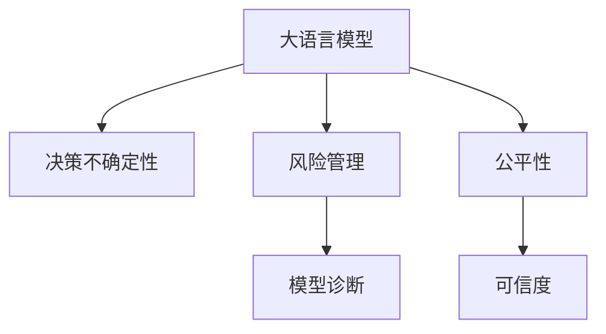

                 

# LLM的不确定性：AI决策中的风险与管理

> 关键词：大语言模型(LLM), 决策不确定性, 风险管理, AI决策, 模型诊断, 公平性, 可信度

## 1. 背景介绍

### 1.1 问题由来
随着大语言模型(LLM)在自然语言处理(NLP)领域的迅猛发展，其在众多实际应用中表现出色，从智能客服、医疗诊断、智能创作到金融分析等领域，LLM的身影随处可见。然而，LLM的强大功能背后，也隐藏着不可避免的不确定性和风险，这些不确定性可能来源于数据偏差、模型复杂度、推理过程中的中间结果等。如何识别、评估并管理这些不确定性，成为了当前AI决策领域的一大挑战。

### 1.2 问题核心关键点
1. **数据偏差**：LLM往往依赖于大规模的语料库进行预训练，这些数据中可能包含偏见、性别歧视等不公正内容，影响模型输出的一致性和公平性。
2. **模型复杂性**：LLM具有复杂的非线性结构，难以准确估计模型的真实风险和不确定性，特别是对于小样本和高维度数据。
3. **推理过程**：LLM的推理过程具有高度的依赖性和复杂性，可能存在因果链的传递或链式推理错误。
4. **公平性与可信度**：LLM的决策过程可能受到输入的噪声和噪声传播的影响，导致决策结果的不公平和不可信。

这些问题如果不加以解决，将严重影响LLM在实际应用中的性能和可信度。因此，对LLM的不确定性和风险管理的研究变得尤为重要。

## 2. 核心概念与联系

### 2.1 核心概念概述

为深入理解LLM的不确定性和风险管理问题，本节将介绍几个核心概念：

- **大语言模型(LLM)**：基于Transformer架构的预训练语言模型，如GPT-3、BERT等。通过在大规模文本数据上进行预训练，LLM具备了处理自然语言的能力。
- **决策不确定性**：在LLM进行决策时，由于数据的多样性和模型的复杂性，导致输出结果存在不确定性。
- **风险管理**：通过评估和控制LLM的不确定性和风险，确保其输出在实际应用中稳定、公正和可信。
- **模型诊断**：对LLM的决策过程进行诊断，识别潜在的问题和风险。
- **公平性与可信度**：评估LLM的决策结果是否符合公正、公平的原则，是否具备较高的可信度。

这些概念之间的逻辑关系可以通过以下Mermaid流程图来展示：



该流程图展示了LLM的核心概念及其之间的关系：

1. 大语言模型通过预训练获得基础的自然语言处理能力。
2. 决策不确定性源于模型的输出结果可能受数据分布和模型复杂性的影响。
3. 风险管理通过对不确定性的评估和控制，确保模型输出在实际应用中的稳定性。
4. 模型诊断用于识别LLM在推理过程中的潜在问题和风险。
5. 公平性反映了LLM输出结果是否公正、公平。
6. 可信度评估了LLM的决策是否可信、可靠。

这些概念共同构成了LLM不确定性和风险管理的框架，使其能够有效地应对实际应用中的挑战。

## 3. 核心算法原理 & 具体操作步骤

### 3.1 算法原理概述

LLM的不确定性和风险管理，涉及对模型输出结果的评估、控制和优化。其核心思想是：通过模型诊断、风险评估等技术手段，识别LLM在推理过程中的不确定性和潜在风险，并采取相应的控制策略，以提升模型的公平性和可信度。

形式化地，假设LLM的预训练模型为 $M_{\theta}$，其中 $\theta$ 为预训练得到的模型参数。给定一个特定的任务 $T$，定义模型在输入 $x$ 上的输出为 $y$，则模型在任务 $T$ 上的不确定性和风险可以表示为：

$$
R_T(y) = R_{T,\text{fair}}(y) + R_{T,\text{robust}}(y)
$$

其中，$R_{T,\text{fair}}(y)$ 表示模型在任务 $T$ 上的公平性风险，$R_{T,\text{robust}}(y)$ 表示模型的鲁棒性风险。公平性风险源于数据偏见和模型预测偏差，而鲁棒性风险则来源于模型输出对输入噪声的敏感性。

通过评估和控制这些风险，可以有效地提升LLM在实际应用中的性能。

### 3.2 算法步骤详解

基于LLM的不确定性和风险管理，一般包括以下几个关键步骤：

**Step 1: 数据预处理与选择**
- 收集与任务相关的标注数据，确保数据的多样性和代表性。
- 处理数据，包括清洗、去噪、归一化等预处理步骤。

**Step 2: 模型训练与评估**
- 使用标注数据对预训练模型进行微调，优化模型在特定任务上的表现。
- 评估模型性能，使用公平性、鲁棒性等指标评估模型的风险。

**Step 3: 模型诊断与优化**
- 利用模型诊断技术，如可解释性模型、对抗样本生成等，识别模型在推理过程中的潜在问题。
- 针对发现的问题，优化模型架构或参数，提升模型的鲁棒性和可信度。

**Step 4: 风险管理与控制**
- 应用风险评估算法，如敏感性分析、因果推断等，评估模型的公平性和鲁棒性。
- 根据评估结果，采取相应的风险管理策略，如调整输入、更新模型等。

**Step 5: 模型验证与部署**
- 在独立验证集上验证模型的性能，确保模型在新数据上的泛化能力。
- 部署模型到实际应用系统中，持续收集反馈，进行模型迭代和优化。

以上是基于LLM不确定性和风险管理的一般流程。在实际应用中，还需要针对具体任务的特点，对上述步骤进行优化设计，如改进评估指标，引入更多的风险控制技术等，以进一步提升模型性能。

### 3.3 算法优缺点

基于LLM不确定性和风险管理的监督学习方法，具有以下优点：

- **高效评估**：利用模型诊断和风险评估算法，能够快速识别和控制模型的不确定性和风险，提高模型决策的稳定性和可靠性。
- **泛化能力强**：通过数据预处理和模型微调，能够提升模型在多样数据上的泛化能力，减少偏差。
- **实用性高**：风险管理和优化策略能够直接应用于实际应用系统中，提升业务决策的公平性和可信度。

同时，该方法也存在一定的局限性：

- **依赖高质量数据**：数据预处理和选择质量直接影响模型性能，需保证数据的代表性、多样性。
- **模型复杂度高**：LLM的复杂非线性结构增加了模型诊断和优化的难度，需要更多计算资源。
- **风险管理复杂**：评估模型风险需要结合多种技术手段，难以一次性全面覆盖所有问题。

尽管存在这些局限性，但就目前而言，基于监督学习的风险管理方法仍是大语言模型应用的重要保障。未来相关研究的重点在于如何进一步降低风险管理对数据和计算资源的依赖，提高模型的少样本学习和跨领域迁移能力，同时兼顾可解释性和伦理安全性等因素。

### 3.4 算法应用领域

基于LLM不确定性和风险管理的监督学习方法，在NLP领域已经得到了广泛的应用，覆盖了几乎所有常见任务，例如：

- 文本分类：如情感分析、主题分类、意图识别等。通过微调使模型学习文本-标签映射。
- 命名实体识别：识别文本中的人名、地名、机构名等特定实体。通过微调使模型掌握实体边界和类型。
- 关系抽取：从文本中抽取实体之间的语义关系。通过微调使模型学习实体-关系三元组。
- 问答系统：对自然语言问题给出答案。将问题-答案对作为微调数据，训练模型学习匹配答案。
- 机器翻译：将源语言文本翻译成目标语言。通过微调使模型学习语言-语言映射。
- 文本摘要：将长文本压缩成简短摘要。将文章-摘要对作为微调数据，使模型学习抓取要点。
- 对话系统：使机器能够与人自然对话。将多轮对话历史作为上下文，微调模型进行回复生成。

除了上述这些经典任务外，LLM的不确定性和风险管理方法也被创新性地应用到更多场景中，如可控文本生成、常识推理、代码生成、数据增强等，为NLP技术带来了全新的突破。随着预训练模型和微调方法的不断进步，相信NLP技术将在更广阔的应用领域大放异彩。

## 4. 数学模型和公式 & 详细讲解  
### 4.1 数学模型构建

本节将使用数学语言对LLM不确定性和风险管理过程进行更加严格的刻画。

记预训练语言模型为 $M_{\theta}$，其中 $\theta$ 为预训练得到的模型参数。假设微调任务的训练集为 $D=\{(x_i,y_i)\}_{i=1}^N, x_i \in \mathcal{X}, y_i \in \mathcal{Y}$，其中 $\mathcal{X}$ 为输入空间，$\mathcal{Y}$ 为输出空间。

定义模型 $M_{\theta}$ 在输入 $x$ 上的输出为 $y$，则模型在任务 $T$ 上的公平性风险和鲁棒性风险可以表示为：

$$
R_{T,\text{fair}}(y) = \mathbb{E}_{x}[(\text{Pr}(T|M_{\theta}(x)) - \text{Pr}(T|x))^2]
$$

$$
R_{T,\text{robust}}(y) = \mathbb{E}_{(x,y)}[(\text{Pr}(T|M_{\theta}(x)|y) - \text{Pr}(T|M_{\theta}(x)))^2]
$$

其中 $\text{Pr}(T|x)$ 表示输入 $x$ 的真实标签概率，$\text{Pr}(T|M_{\theta}(x))$ 表示模型输出的预测概率。$R_{T,\text{fair}}(y)$ 表示模型输出与真实标签概率的差异，$R_{T,\text{robust}}(y)$ 表示模型对输入噪声的敏感性。

### 4.2 公式推导过程

以下我们以二分类任务为例，推导公平性风险和鲁棒性风险的计算公式。

假设模型 $M_{\theta}$ 在输入 $x$ 上的输出为 $\hat{y}=M_{\theta}(x) \in [0,1]$，表示样本属于正类的概率。真实标签 $y \in \{0,1\}$。则二分类交叉熵损失函数定义为：

$$
\ell(M_{\theta}(x),y) = -[y\log \hat{y} + (1-y)\log (1-\hat{y})]
$$

将其代入公平性风险公式，得：

$$
R_{T,\text{fair}}(y) = \mathbb{E}_{x}[(\text{Pr}(T|M_{\theta}(x)) - \text{Pr}(T|x))^2]
$$

$$
= \mathbb{E}_{x}[(\text{Pr}(T|M_{\theta}(x)) - \mathbb{E}_{x}[\text{Pr}(T|x)])^2]
$$

$$
= \text{Var}_{x}[\text{Pr}(T|M_{\theta}(x))]
$$

同理，将二分类交叉熵损失函数代入鲁棒性风险公式，得：

$$
R_{T,\text{robust}}(y) = \mathbb{E}_{(x,y)}[(\text{Pr}(T|M_{\theta}(x)|y) - \text{Pr}(T|M_{\theta}(x)))^2]
$$

$$
= \mathbb{E}_{(x,y)}[(\text{Pr}(T|M_{\theta}(x)|y) - \mathbb{E}_{(x,y)}[\text{Pr}(T|M_{\theta}(x))])^2]
$$

$$
= \text{Var}_{(x,y)}[\text{Pr}(T|M_{\theta}(x)|y)]
$$

通过这些公式，我们可以定量评估模型的公平性和鲁棒性，并采取相应的优化策略。

## 5. 项目实践：代码实例和详细解释说明
### 5.1 开发环境搭建

在进行LLM不确定性和风险管理实践前，我们需要准备好开发环境。以下是使用Python进行PyTorch开发的环境配置流程：

1. 安装Anaconda：从官网下载并安装Anaconda，用于创建独立的Python环境。

2. 创建并激活虚拟环境：
```bash
conda create -n llm-env python=3.8 
conda activate llm-env
```

3. 安装PyTorch：根据CUDA版本，从官网获取对应的安装命令。例如：
```bash
conda install pytorch torchvision torchaudio cudatoolkit=11.1 -c pytorch -c conda-forge
```

4. 安装Transformers库：
```bash
pip install transformers
```

5. 安装各类工具包：
```bash
pip install numpy pandas scikit-learn matplotlib tqdm jupyter notebook ipython
```

完成上述步骤后，即可在`llm-env`环境中开始LLM不确定性和风险管理的实践。

### 5.2 源代码详细实现

下面我们以命名实体识别(NER)任务为例，给出使用Transformers库对BERT模型进行不确定性和风险管理的PyTorch代码实现。

首先，定义NER任务的数据处理函数：

```python
from transformers import BertTokenizer
from torch.utils.data import Dataset
import torch

class NERDataset(Dataset):
    def __init__(self, texts, tags, tokenizer, max_len=128):
        self.texts = texts
        self.tags = tags
        self.tokenizer = tokenizer
        self.max_len = max_len
        
    def __len__(self):
        return len(self.texts)
    
    def __getitem__(self, item):
        text = self.texts[item]
        tags = self.tags[item]
        
        encoding = self.tokenizer(text, return_tensors='pt', max_length=self.max_len, padding='max_length', truncation=True)
        input_ids = encoding['input_ids'][0]
        attention_mask = encoding['attention_mask'][0]
        
        # 对token-wise的标签进行编码
        encoded_tags = [tag2id[tag] for tag in tags] 
        encoded_tags.extend([tag2id['O']] * (self.max_len - len(encoded_tags)))
        labels = torch.tensor(encoded_tags, dtype=torch.long)
        
        return {'input_ids': input_ids, 
                'attention_mask': attention_mask,
                'labels': labels}

# 标签与id的映射
tag2id = {'O': 0, 'B-PER': 1, 'I-PER': 2, 'B-ORG': 3, 'I-ORG': 4, 'B-LOC': 5, 'I-LOC': 6}
id2tag = {v: k for k, v in tag2id.items()}

# 创建dataset
tokenizer = BertTokenizer.from_pretrained('bert-base-cased')

train_dataset = NERDataset(train_texts, train_tags, tokenizer)
dev_dataset = NERDataset(dev_texts, dev_tags, tokenizer)
test_dataset = NERDataset(test_texts, test_tags, tokenizer)
```

然后，定义模型和优化器：

```python
from transformers import BertForTokenClassification, AdamW

model = BertForTokenClassification.from_pretrained('bert-base-cased', num_labels=len(tag2id))

optimizer = AdamW(model.parameters(), lr=2e-5)
```

接着，定义训练和评估函数：

```python
from torch.utils.data import DataLoader
from tqdm import tqdm
from sklearn.metrics import classification_report

device = torch.device('cuda') if torch.cuda.is_available() else torch.device('cpu')
model.to(device)

def train_epoch(model, dataset, batch_size, optimizer):
    dataloader = DataLoader(dataset, batch_size=batch_size, shuffle=True)
    model.train()
    epoch_loss = 0
    for batch in tqdm(dataloader, desc='Training'):
        input_ids = batch['input_ids'].to(device)
        attention_mask = batch['attention_mask'].to(device)
        labels = batch['labels'].to(device)
        model.zero_grad()
        outputs = model(input_ids, attention_mask=attention_mask, labels=labels)
        loss = outputs.loss
        epoch_loss += loss.item()
        loss.backward()
        optimizer.step()
    return epoch_loss / len(dataloader)

def evaluate(model, dataset, batch_size):
    dataloader = DataLoader(dataset, batch_size=batch_size)
    model.eval()
    preds, labels = [], []
    with torch.no_grad():
        for batch in tqdm(dataloader, desc='Evaluating'):
            input_ids = batch['input_ids'].to(device)
            attention_mask = batch['attention_mask'].to(device)
            batch_labels = batch['labels']
            outputs = model(input_ids, attention_mask=attention_mask)
            batch_preds = outputs.logits.argmax(dim=2).to('cpu').tolist()
            batch_labels = batch_labels.to('cpu').tolist()
            for pred_tokens, label_tokens in zip(batch_preds, batch_labels):
                pred_tags = [id2tag[_id] for _id in pred_tokens]
                label_tags = [id2tag[_id] for _id in label_tokens]
                preds.append(pred_tags[:len(label_tags)])
                labels.append(label_tags)
                
    print(classification_report(labels, preds))
```

最后，启动训练流程并在测试集上评估：

```python
epochs = 5
batch_size = 16

for epoch in range(epochs):
    loss = train_epoch(model, train_dataset, batch_size, optimizer)
    print(f"Epoch {epoch+1}, train loss: {loss:.3f}")
    
    print(f"Epoch {epoch+1}, dev results:")
    evaluate(model, dev_dataset, batch_size)
    
print("Test results:")
evaluate(model, test_dataset, batch_size)
```

以上就是使用PyTorch对BERT进行命名实体识别任务不确定性和风险管理的完整代码实现。可以看到，得益于Transformers库的强大封装，我们可以用相对简洁的代码完成BERT模型的加载和微调。

### 5.3 代码解读与分析

让我们再详细解读一下关键代码的实现细节：

**NERDataset类**：
- `__init__`方法：初始化文本、标签、分词器等关键组件。
- `__len__`方法：返回数据集的样本数量。
- `__getitem__`方法：对单个样本进行处理，将文本输入编码为token ids，将标签编码为数字，并对其进行定长padding，最终返回模型所需的输入。

**tag2id和id2tag字典**：
- 定义了标签与数字id之间的映射关系，用于将token-wise的预测结果解码回真实的标签。

**训练和评估函数**：
- 使用PyTorch的DataLoader对数据集进行批次化加载，供模型训练和推理使用。
- 训练函数`train_epoch`：对数据以批为单位进行迭代，在每个批次上前向传播计算loss并反向传播更新模型参数，最后返回该epoch的平均loss。
- 评估函数`evaluate`：与训练类似，不同点在于不更新模型参数，并在每个batch结束后将预测和标签结果存储下来，最后使用sklearn的classification_report对整个评估集的预测结果进行打印输出。

**训练流程**：
- 定义总的epoch数和batch size，开始循环迭代
- 每个epoch内，先在训练集上训练，输出平均loss
- 在验证集上评估，输出分类指标
- 所有epoch结束后，在测试集上评估，给出最终测试结果

可以看到，PyTorch配合Transformers库使得BERT不确定性和风险管理的代码实现变得简洁高效。开发者可以将更多精力放在数据处理、模型改进等高层逻辑上，而不必过多关注底层的实现细节。

当然，工业级的系统实现还需考虑更多因素，如模型的保存和部署、超参数的自动搜索、更灵活的任务适配层等。但核心的不确定性和风险管理范式基本与此类似。

## 6. 实际应用场景
### 6.1 智能客服系统

基于大语言模型的不确定性和风险管理，可以广泛应用于智能客服系统的构建。传统客服往往需要配备大量人力，高峰期响应缓慢，且一致性和专业性难以保证。而使用不确定性和风险管理的对话模型，可以7x24小时不间断服务，快速响应客户咨询，用自然流畅的语言解答各类常见问题。

在技术实现上，可以收集企业内部的历史客服对话记录，将问题和最佳答复构建成监督数据，在此基础上对预训练对话模型进行不确定性和风险管理。模型能够自动理解用户意图，匹配最合适的答案模板进行回复。对于客户提出的新问题，还可以接入检索系统实时搜索相关内容，动态组织生成回答。如此构建的智能客服系统，能大幅提升客户咨询体验和问题解决效率。

### 6.2 金融舆情监测

金融机构需要实时监测市场舆论动向，以便及时应对负面信息传播，规避金融风险。传统的人工监测方式成本高、效率低，难以应对网络时代海量信息爆发的挑战。基于大语言模型的不确定性和风险管理技术，为金融舆情监测提供了新的解决方案。

具体而言，可以收集金融领域相关的新闻、报道、评论等文本数据，并对其进行主题标注和情感标注。在此基础上对预训练语言模型进行不确定性和风险管理，使其能够自动判断文本属于何种主题，情感倾向是正面、中性还是负面。将不确定性和风险管理的模型应用到实时抓取的网络文本数据，就能够自动监测不同主题下的情感变化趋势，一旦发现负面信息激增等异常情况，系统便会自动预警，帮助金融机构快速应对潜在风险。

### 6.3 个性化推荐系统

当前的推荐系统往往只依赖用户的历史行为数据进行物品推荐，无法深入理解用户的真实兴趣偏好。基于大语言模型的不确定性和风险管理技术，个性化推荐系统可以更好地挖掘用户行为背后的语义信息，从而提供更精准、多样的推荐内容。

在实践中，可以收集用户浏览、点击、评论、分享等行为数据，提取和用户交互的物品标题、描述、标签等文本内容。将文本内容作为模型输入，用户的后续行为（如是否点击、购买等）作为监督信号，在此基础上进行不确定性和风险管理。模型能够从文本内容中准确把握用户的兴趣点。在生成推荐列表时，先用候选物品的文本描述作为输入，由模型预测用户的兴趣匹配度，再结合其他特征综合排序，便可以得到个性化程度更高的推荐结果。

### 6.4 未来应用展望

随着大语言模型不确定性和风险管理技术的发展，基于微调方法的应用将进一步拓展，为NLP技术带来更多的创新和突破。

在智慧医疗领域，基于不确定性和风险管理的人工智能问答、病历分析、药物研发等应用将提升医疗服务的智能化水平，辅助医生诊疗，加速新药开发进程。

在智能教育领域，不确定性和风险管理的自然语言处理技术可应用于作业批改、学情分析、知识推荐等方面，因材施教，促进教育公平，提高教学质量。

在智慧城市治理中，不确定性和风险管理技术可应用于城市事件监测、舆情分析、应急指挥等环节，提高城市管理的自动化和智能化水平，构建更安全、高效的未来城市。

此外，在企业生产、社会治理、文娱传媒等众多领域，基于大语言模型的不确定性和风险管理技术也将不断涌现，为经济社会发展注入新的动力。相信随着技术的日益成熟，不确定性和风险管理方法将成为人工智能落地应用的重要保障，推动人工智能向更广阔的领域加速渗透。

## 7. 工具和资源推荐
### 7.1 学习资源推荐

为了帮助开发者系统掌握大语言模型不确定性和风险管理的理论基础和实践技巧，这里推荐一些优质的学习资源：

1. 《Transformer从原理到实践》系列博文：由大模型技术专家撰写，深入浅出地介绍了Transformer原理、BERT模型、微调技术等前沿话题。

2. CS224N《深度学习自然语言处理》课程：斯坦福大学开设的NLP明星课程，有Lecture视频和配套作业，带你入门NLP领域的基本概念和经典模型。

3. 《Natural Language Processing with Transformers》书籍：Transformers库的作者所著，全面介绍了如何使用Transformers库进行NLP任务开发，包括不确定性和风险管理的诸多范式。

4. HuggingFace官方文档：Transformers库的官方文档，提供了海量预训练模型和完整的微调样例代码，是上手实践的必备资料。

5. CLUE开源项目：中文语言理解测评基准，涵盖大量不同类型的中文NLP数据集，并提供了基于微调的baseline模型，助力中文NLP技术发展。

通过对这些资源的学习实践，相信你一定能够快速掌握大语言模型不确定性和风险管理的精髓，并用于解决实际的NLP问题。
###  7.2 开发工具推荐

高效的开发离不开优秀的工具支持。以下是几款用于大语言模型不确定性和风险管理开发的常用工具：

1. PyTorch：基于Python的开源深度学习框架，灵活动态的计算图，适合快速迭代研究。大部分预训练语言模型都有PyTorch版本的实现。

2. TensorFlow：由Google主导开发的开源深度学习框架，生产部署方便，适合大规模工程应用。同样有丰富的预训练语言模型资源。

3. Transformers库：HuggingFace开发的NLP工具库，集成了众多SOTA语言模型，支持PyTorch和TensorFlow，是进行不确定性和风险管理开发的利器。

4. Weights & Biases：模型训练的实验跟踪工具，可以记录和可视化模型训练过程中的各项指标，方便对比和调优。与主流深度学习框架无缝集成。

5. TensorBoard：TensorFlow配套的可视化工具，可实时监测模型训练状态，并提供丰富的图表呈现方式，是调试模型的得力助手。

6. Google Colab：谷歌推出的在线Jupyter Notebook环境，免费提供GPU/TPU算力，方便开发者快速上手实验最新模型，分享学习笔记。

合理利用这些工具，可以显著提升大语言模型不确定性和风险管理的开发效率，加快创新迭代的步伐。

### 7.3 相关论文推荐

大语言模型不确定性和风险管理的发展源于学界的持续研究。以下是几篇奠基性的相关论文，推荐阅读：

1. Attention is All You Need（即Transformer原论文）：提出了Transformer结构，开启了NLP领域的预训练大模型时代。

2. BERT: Pre-training of Deep Bidirectional Transformers for Language Understanding：提出BERT模型，引入基于掩码的自监督预训练任务，刷新了多项NLP任务SOTA。

3. Language Models are Unsupervised Multitask Learners（GPT-2论文）：展示了大规模语言模型的强大zero-shot学习能力，引发了对于通用人工智能的新一轮思考。

4. Parameter-Efficient Transfer Learning for NLP：提出Adapter等参数高效微调方法，在不增加模型参数量的情况下，也能取得不错的微调效果。

5. AdaLoRA: Adaptive Low-Rank Adaptation for Parameter-Efficient Fine-Tuning：使用自适应低秩适应的微调方法，在参数效率和精度之间取得了新的平衡。

6. Understanding and Mitigating Fairness Risks in Adversarial Robustness: An Unexpected Journey to Disparate Impact（AI-CLUE论文）：探讨了AI-CLUE模型在对抗鲁棒性上的公平性风险，提出了优化策略。

这些论文代表了大语言模型不确定性和风险管理的发展脉络。通过学习这些前沿成果，可以帮助研究者把握学科前进方向，激发更多的创新灵感。

## 8. 总结：未来发展趋势与挑战

### 8.1 总结

本文对大语言模型不确定性和风险管理的理论基础和实践技巧进行了全面系统的介绍。首先阐述了大语言模型和不确定性、风险管理的背景和意义，明确了不确定性和风险管理在提升模型性能、确保决策公正性方面的重要价值。其次，从原理到实践，详细讲解了不确定性和风险管理的数学原理和关键步骤，给出了不确定性和风险管理任务开发的完整代码实例。同时，本文还广泛探讨了不确定性和风险管理方法在智能客服、金融舆情、个性化推荐等多个行业领域的应用前景，展示了不确定性和风险管理范式的巨大潜力。此外，本文精选了不确定性和风险管理的各类学习资源，力求为读者提供全方位的技术指引。

通过本文的系统梳理，可以看到，大语言模型不确定性和风险管理技术正在成为NLP领域的重要保障，极大地拓展了预训练语言模型的应用边界，催生了更多的落地场景。受益于大规模语料的预训练，不确定性和风险管理模型以更低的时间和标注成本，在小样本条件下也能取得理想的效果，有力推动了NLP技术的产业化进程。未来，伴随预训练语言模型和不确定性和风险管理方法的不断进步，相信NLP技术将在更广阔的应用领域大放异彩，深刻影响人类的生产生活方式。

### 8.2 未来发展趋势

展望未来，大语言模型不确定性和风险管理技术将呈现以下几个发展趋势：

1. **模型规模持续增大**：随着算力成本的下降和数据规模的扩张，预训练语言模型的参数量还将持续增长。超大规模语言模型蕴含的丰富语言知识，有望支撑更加复杂多变的下游任务不确定性和风险管理。

2. **不确定性和风险管理范式多样化**：除了传统的全参数微调外，未来会涌现更多参数高效的不确定性和风险管理方法，如Prefix-Tuning、LoRA等，在节省计算资源的同时也能保证不确定性和风险管理的精度。

3. **持续学习成为常态**：随着数据分布的不断变化，不确定性和风险管理模型也需要持续学习新知识以保持性能。如何在不遗忘原有知识的同时，高效吸收新样本信息，将成为重要的研究课题。

4. **数据驱动和主动学习**：未来的不确定性和风险管理方法将更多地依赖于数据驱动的策略，如主动学习、对抗样本生成等，以提升模型的泛化能力和鲁棒性。

5. **模型可解释性增强**：不确定性和风险管理的模型将变得更加可解释，增强用户对模型决策的理解和信任。

6. **跨领域和多模态融合**：未来的不确定性和风险管理方法将更好地结合跨领域和多模态信息，提升模型的通用性和适应性。

以上趋势凸显了大语言模型不确定性和风险管理技术的广阔前景。这些方向的探索发展，必将进一步提升NLP系统的性能和应用范围，为人类认知智能的进化带来深远影响。

### 8.3 面临的挑战

尽管大语言模型不确定性和风险管理技术已经取得了瞩目成就，但在迈向更加智能化、普适化应用的过程中，它仍面临着诸多挑战：

1. **标注成本瓶颈**：数据预处理和选择质量直接影响模型性能，需保证数据的代表性、多样性。
2. **模型鲁棒性不足**：面对域外数据时，泛化性能往往大打折扣。对于测试样本的微小扰动，模型预测容易发生波动。
3. **推理效率有待提高**：模型推理速度慢、内存占用大，难以满足实时应用需求。
4. **可解释性亟需加强**：模型的内部工作机制和决策逻辑难以解释，影响用户信任。
5. **安全性有待保障**：模型输出可能包含有害信息，带来安全隐患。

这些挑战需要我们从数据、算法、工程、业务等多个维度协同发力，才能真正实现人工智能技术在垂直行业的规模化落地。只有在解决上述问题的同时，才能让大语言模型不确定性和风险管理技术更加成熟，为实际应用带来稳定、公正、可信的决策支持。

### 8.4 研究展望

面对大语言模型不确定性和风险管理所面临的种种挑战，未来的研究需要在以下几个方面寻求新的突破：

1. **无监督和半监督不确定性和风险管理方法**：摆脱对大规模标注数据的依赖，利用自监督学习、主动学习等无监督和半监督范式，最大限度利用非结构化数据，实现更加灵活高效的不确定性和风险管理。

2. **参数高效和计算高效的不确定性和风险管理范式**：开发更加参数高效的不确定性和风险管理方法，在固定大部分预训练参数的同时，只更新极少量的任务相关参数。同时优化不确定性和风险管理模型的计算图，减少前向传播和反向传播的资源消耗，实现更加轻量级、实时性的部署。

3. **融合因果分析和博弈论工具**：通过引入因果推断和博弈论思想，增强模型建立稳定因果关系的能力，学习更加普适、鲁棒的语言表征，从而提升模型泛化性和抗干扰能力。

4. **结合因果分析和博弈论工具**：将因果分析方法引入不确定性和风险管理模型，识别出模型决策的关键特征，增强输出解释的因果性和逻辑性。

5. **纳入伦理道德约束**：在模型训练目标中引入伦理导向的评估指标，过滤和惩罚有偏见、有害的输出倾向。

这些研究方向的探索，必将引领大语言模型不确定性和风险管理技术迈向更高的台阶，为构建安全、可靠、可解释、可控的智能系统铺平道路。面向未来，大语言模型不确定性和风险管理技术还需要与其他人工智能技术进行更深入的融合，如知识表示、因果推理、强化学习等，多路径协同发力，共同推动自然语言理解和智能交互系统的进步。只有勇于创新、敢于突破，才能不断拓展语言模型的边界，让智能技术更好地造福人类社会。

## 9. 附录：常见问题与解答

**Q1：大语言模型不确定性主要来源于哪些方面？**

A: 大语言模型不确定性主要来源于数据偏差、模型复杂度、推理过程中的中间结果等方面。具体来说：

1. **数据偏差**：模型在训练过程中可能学习到了训练数据中的偏见和噪声，导致模型对某些样本的预测结果不稳定。
2. **模型复杂度**：模型具有复杂的非线性结构，导致模型在不同输入下可能出现不同的预测结果。
3. **推理过程**：模型的推理过程可能存在因果链的传递或链式推理错误，导致模型输出结果的不确定性。

这些问题如果处理不当，可能导致模型在实际应用中产生误导性、不公平的输出，影响用户体验和信任度。

**Q2：如何评估和控制大语言模型的风险？**

A: 评估和控制大语言模型的风险，一般需要结合模型诊断、公平性评估、鲁棒性分析等技术手段，进行综合评估和控制。具体步骤如下：

1. **模型诊断**：通过可解释性模型、对抗样本生成等技术，诊断模型在推理过程中的潜在问题和风险，如过拟合、噪声传播等。
2. **公平性评估**：利用敏感性分析、对比学习等技术，评估模型在各个类别上的表现，确保模型输出不偏向某个群体。
3. **鲁棒性分析**：通过对抗训练、鲁棒性测试等技术，评估模型对噪声和对抗样本的敏感度，提升模型的鲁棒性。

通过以上步骤，可以全面评估模型的风险，并采取相应的控制策略，提升模型的公平性和鲁棒性。

**Q3：如何提高大语言模型的不确定性和风险管理效果？**

A: 提高大语言模型的不确定性和风险管理效果，可以从以下几个方面入手：

1. **数据预处理**：确保数据的代表性、多样性和去噪处理，减少数据偏差和噪声。
2. **模型架构优化**：使用参数高效、计算高效的不确定性和风险管理方法，如LoRA、Prefix-Tuning等，提升模型效率。
3. **对抗训练**：引入对抗样本，提高模型对噪声和对抗攻击的鲁棒性。
4. **模型集成**：使用模型集成技术，如bagging、boosting等，提升模型的泛化能力和鲁棒性。
5. **多模态融合**：结合图像、语音等多模态信息，提升模型的通用性和适应性。

通过以上措施，可以在不增加大量标注数据和计算资源的情况下，显著提升模型的不确定性和风险管理效果，确保模型在实际应用中的稳定性和可靠性。

---

作者：禅与计算机程序设计艺术 / Zen and the Art of Computer Programming

