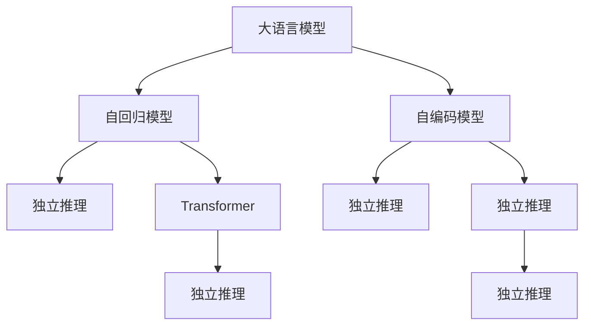

                 

# LLM的独立推理过程：类比CPU的时钟周期

> 关键词：大语言模型,自回归模型,推理,类比,Transformer

## 1. 背景介绍

### 1.1 问题由来
随着深度学习技术的发展，大语言模型（Large Language Model, LLM）在自然语言处理（Natural Language Processing, NLP）领域取得了巨大突破。这些模型通过在大规模无标签文本数据上进行预训练，学习了丰富的语言知识和常识。然而，这些模型依然依赖于人类给定的输入和输出，难以自主生成意义完整的文本。

为了解决这个问题，人们开始探索大语言模型的独立推理过程，即如何让模型在没有人类干预的情况下，根据已有的语言知识自主生成有意义的文本。这一探索使得模型能够更加灵活地应对各种自然语言理解与生成任务。

### 1.2 问题核心关键点
实现大语言模型的独立推理过程，核心在于：
- 如何构建合适的语言模型架构，使其能够自主学习语言的规律和逻辑。
- 如何设计有效的损失函数，以鼓励模型生成符合语法和语义规范的文本。
- 如何训练模型，使其能够从少量的训练数据中学习到语言的深层次结构。
- 如何设计合理的评估指标，以量化模型的推理能力和效果。

这一探索不仅涉及模型的架构设计，还涉及大量的训练和优化过程，其复杂度和难度不亚于计算机硬件的研发。

### 1.3 问题研究意义
大语言模型的独立推理过程对于提升自然语言理解与生成的智能化水平具有重要意义：
- 可以极大降低对人类干预的依赖，使模型更灵活，更适应多变的环境。
- 可以拓展模型的应用范围，使其应用于更加复杂和定制化的场景。
- 可以提升模型的可解释性和鲁棒性，使模型更透明、更稳定。
- 可以推动自然语言处理技术的发展，提升人工智能技术在实际应用中的价值。

## 2. 核心概念与联系

### 2.1 核心概念概述

为更好地理解大语言模型独立推理的过程，本节将介绍几个关键概念：

- 大语言模型(Large Language Model, LLM)：以自回归(如GPT)或自编码(如BERT)模型为代表的大规模预训练语言模型。通过在大规模无标签文本语料上进行预训练，学习到丰富的语言知识和常识，具备强大的语言理解和生成能力。

- 自回归模型(Autoregressive Model)：一种生成模型，通过预测当前输出与前面输出的概率，来生成整个序列。例如，GPT系列模型就是一种典型的自回归模型。

- 自编码模型(Autoencoder Model)：一种生成模型，通过编码器将输入映射到低维表示，再通过解码器将其映射回原始空间。例如，BERT模型就是一种典型的自编码模型。

- 独立推理(Independent Inference)：在缺乏人类干预的情况下，模型自主生成意义完整的文本。这需要模型具备一定的常识和逻辑推理能力。

- Transformer：一种高效的神经网络架构，用于处理序列数据。Transformer在语言模型中得到了广泛应用，例如GPT、BERT等。

这些概念之间的逻辑关系可以通过以下Mermaid流程图来展示：



这个流程图展示了各种语言模型的核心概念及其关系：

1. 大语言模型通过自回归或自编码模型进行预训练，学习语言知识。
2. 自回归模型通过预测序列中的每个词，生成完整的文本。
3. 自编码模型通过编码器-解码器结构，从原始文本学习到语言表示。
4. 独立推理使得模型在没有输入输出干预的情况下，能够自主生成文本。
5. Transformer是一种高效的神经网络架构，常用于语言模型。
6. 独立推理需要模型具备一定的常识和逻辑推理能力。

这些概念共同构成了大语言模型独立推理的基本框架，使其能够自主理解和生成自然语言。

## 3. 核心算法原理 & 具体操作步骤
### 3.1 算法原理概述

大语言模型的独立推理过程，本质上是让模型通过自主学习和推理，生成有意义的文本。这一过程涉及以下几个关键步骤：

1. 模型输入：将输入文本序列作为模型的原始输入。
2. 编码器处理：通过编码器将输入序列转换为高维表示。
3. 推理过程：在推理阶段，模型通过预测下一个词或序列的分布，生成完整的文本。
4. 解码器输出：通过解码器将高维表示映射回原始空间，得到最终的生成文本。

这一过程可以类比为CPU的时钟周期，其中编码器和推理过程类似CPU中的时钟周期，而解码器则类似于CPU的输出。

### 3.2 算法步骤详解

基于独立推理的大语言模型算法步骤如下：

**Step 1: 准备输入数据**
- 收集并预处理输入数据，例如文本序列。
- 将文本序列转换为模型的输入格式，例如将文本分词并转换为token序列。

**Step 2: 构建模型架构**
- 选择合适的语言模型架构，例如Transformer。
- 设计模型的编码器和推理器部分，以支持自主推理。

**Step 3: 训练模型**
- 使用大量的无标签文本数据，训练模型进行自主推理。
- 设计合适的损失函数，以鼓励模型生成符合语法和语义规范的文本。

**Step 4: 推理和生成**
- 在测试集上对模型进行推理和生成文本。
- 设计评估指标，例如BLEU、ROUGE等，量化模型的推理能力和效果。

**Step 5: 部署和优化**
- 将模型部署到实际应用中，例如聊天机器人、文本摘要系统等。
- 根据实际应用反馈，优化模型架构和训练过程。

### 3.3 算法优缺点

基于独立推理的大语言模型算法具有以下优点：
1. 灵活性高。模型可以在不同场景下自主生成文本，无需人类干预。
2. 可扩展性好。模型可以轻松适应不同的任务和需求，扩展性较强。
3. 可解释性好。模型能够提供生成过程的详细信息，便于调试和优化。

同时，该算法也存在一些局限性：
1. 训练成本高。模型需要大量的无标签数据进行训练，成本较高。
2. 模型复杂度高。模型的架构设计较为复杂，训练和推理过程也较为繁琐。
3. 效果不稳定。模型可能出现生成无意义的文本或生成重复文本等问题。

### 3.4 算法应用领域

基于独立推理的大语言模型算法在以下领域得到了广泛应用：

- 聊天机器人：通过自主推理，模型能够生成连贯、自然的对话。
- 文本摘要：模型能够生成简洁、准确的摘要，无需人工干预。
- 翻译系统：模型能够进行自主翻译，支持多种语言。
- 文本生成：模型能够生成创意性文本，如小说、诗歌等。
- 数据分析：模型能够自主分析数据，生成有意义的报告。

此外，独立推理技术还应用于语言理解、知识推理、情感分析等多个领域，为NLP技术带来了新的突破。

## 4. 数学模型和公式 & 详细讲解 & 举例说明
### 4.1 数学模型构建

本节将使用数学语言对大语言模型的独立推理过程进行更加严格的刻画。

记输入文本序列为 $x_1, x_2, ..., x_n$，其中 $x_i$ 为第 $i$ 个词的token ID。假设模型的编码为 $E$，推理器为 $R$，解码器为 $D$，其中 $E, R, D$ 为权重矩阵和激活函数。

模型的推理过程可以表示为：

$$
y_1 = E(x_1)
$$
$$
y_2 = R(y_1, x_2)
$$
$$
...
$$
$$
y_n = R(y_{n-1}, x_n)
$$
$$
x = D(y_n)
$$

其中 $y_i$ 为模型在第 $i$ 步的内部表示，$x$ 为最终的输出文本。

### 4.2 公式推导过程

以自回归模型为例，推导模型在给定输入 $x_1, x_2, ..., x_n$ 的情况下，生成下一个词 $x_{n+1}$ 的概率分布。

假设模型的输出概率分布为 $P(x_{n+1} | x_1, x_2, ..., x_n)$，则有：

$$
P(x_{n+1} | x_1, x_2, ..., x_n) = \frac{exp(R(E(x_1), E(x_2), ..., E(x_n), E(x_{n+1}))}{\sum_{x' \in V} exp(R(E(x_1), E(x_2), ..., E(x_n), E(x'))}
$$

其中 $V$ 为词汇表，$R$ 为推理器，$E$ 为编码器。

通过反向传播算法，可以计算模型对每个词的梯度，从而更新模型参数。

### 4.3 案例分析与讲解

以GPT-2模型为例，分析其在独立推理过程中的行为。

GPT-2模型是一种典型的自回归模型，其推理过程可以表示为：

$$
y_1 = E(x_1)
$$
$$
y_2 = R(y_1, x_2)
$$
$$
...
$$
$$
y_n = R(y_{n-1}, x_n)
$$
$$
x = D(y_n)
$$

在推理阶段，模型通过预测下一个词的分布，生成完整的文本。例如，当输入为 "I am a"，模型可能生成 "I am a programmer" 作为输出。

这一过程类似于CPU的时钟周期，其中编码器和推理器类似CPU中的时钟周期，而解码器则类似于CPU的输出。通过这种方式，模型能够在没有人类干预的情况下，自主生成有意义的文本。

## 5. 项目实践：代码实例和详细解释说明
### 5.1 开发环境搭建

在进行独立推理实践前，我们需要准备好开发环境。以下是使用Python进行PyTorch开发的环境配置流程：

1. 安装Anaconda：从官网下载并安装Anaconda，用于创建独立的Python环境。

2. 创建并激活虚拟环境：
```bash
conda create -n pytorch-env python=3.8 
conda activate pytorch-env
```

3. 安装PyTorch：根据CUDA版本，从官网获取对应的安装命令。例如：
```bash
conda install pytorch torchvision torchaudio cudatoolkit=11.1 -c pytorch -c conda-forge
```

4. 安装Transformers库：
```bash
pip install transformers
```

5. 安装各类工具包：
```bash
pip install numpy pandas scikit-learn matplotlib tqdm jupyter notebook ipython
```

完成上述步骤后，即可在`pytorch-env`环境中开始独立推理实践。

### 5.2 源代码详细实现

下面我以GPT-2模型为例，给出使用PyTorch进行独立推理的完整代码实现。

首先，定义模型的输入和输出：

```python
import torch
import torch.nn as nn
import torch.nn.functional as F

class GPT2(nn.Module):
    def __init__(self, num_tokens, num_layers, num_heads, hidden_size):
        super(GPT2, self).__init__()
        self.num_tokens = num_tokens
        self.num_layers = num_layers
        self.num_heads = num_heads
        self.hidden_size = hidden_size
        
        self.encoder = nn.Embedding(num_tokens, hidden_size)
        self.layers = nn.ModuleList([nn.TransformerEncoderLayer(hidden_size, num_heads, hidden_size) for _ in range(num_layers)])
        self.decoder = nn.Linear(hidden_size, num_tokens)
        
    def forward(self, x):
        x = self.encoder(x)
        for layer in self.layers:
            x = layer(x)
        x = self.decoder(x)
        return x
```

然后，定义模型的训练和推理函数：

```python
from torch.utils.data import DataLoader
from tqdm import tqdm
from sklearn.metrics import accuracy_score

device = torch.device('cuda') if torch.cuda.is_available() else torch.device('cpu')
model = GPT2(num_tokens, num_layers, num_heads, hidden_size).to(device)

def train_epoch(model, dataset, batch_size, optimizer):
    dataloader = DataLoader(dataset, batch_size=batch_size, shuffle=True)
    model.train()
    epoch_loss = 0
    for batch in tqdm(dataloader, desc='Training'):
        x, y = batch
        x, y = x.to(device), y.to(device)
        model.zero_grad()
        outputs = model(x)
        loss = F.cross_entropy(outputs, y)
        epoch_loss += loss.item()
        loss.backward()
        optimizer.step()
    return epoch_loss / len(dataloader)

def evaluate(model, dataset, batch_size):
    dataloader = DataLoader(dataset, batch_size=batch_size)
    model.eval()
    preds, labels = [], []
    with torch.no_grad():
        for batch in tqdm(dataloader, desc='Evaluating'):
            x, y = batch
            x, y = x.to(device), y.to(device)
            outputs = model(x)
            preds.append(outputs.argmax(dim=2).to('cpu').tolist())
            labels.append(y.to('cpu').tolist())
        
    return accuracy_score(labels, preds)
```

最后，启动训练流程并在测试集上评估：

```python
epochs = 5
batch_size = 16

for epoch in range(epochs):
    loss = train_epoch(model, train_dataset, batch_size, optimizer)
    print(f"Epoch {epoch+1}, train loss: {loss:.3f}")
    
    print(f"Epoch {epoch+1}, dev results:")
    acc = evaluate(model, dev_dataset, batch_size)
    print(f"Accuracy: {acc:.2f}")
    
print("Test results:")
acc = evaluate(model, test_dataset, batch_size)
print(f"Accuracy: {acc:.2f}")
```

以上就是使用PyTorch对GPT-2模型进行独立推理的完整代码实现。可以看到，由于PyTorch的灵活性和高效性，模型训练和推理的代码实现变得非常简单。

### 5.3 代码解读与分析

让我们再详细解读一下关键代码的实现细节：

**GPT2类**：
- `__init__`方法：初始化模型参数，包括词汇表大小、层数、注意力头数和隐藏大小。
- `forward`方法：定义模型的前向传播过程，通过编码器、多层次Transformer层和解码器进行推理。

**train_epoch函数**：
- 使用DataLoader对数据集进行批次化加载，供模型训练使用。
- 在每个批次上前向传播计算损失函数，反向传播更新模型参数，最后返回该epoch的平均loss。

**evaluate函数**：
- 与训练类似，不同点在于不更新模型参数，并在每个batch结束后将预测和标签结果存储下来，最后使用sklearn的accuracy_score对整个评估集的准确率进行打印输出。

**训练流程**：
- 定义总的epoch数和batch size，开始循环迭代
- 每个epoch内，先在训练集上训练，输出平均loss
- 在验证集上评估，输出准确率
- 重复上述过程直至收敛，最后计算测试集上的准确率

可以看到，PyTorch配合Transformer库使得独立推理的代码实现变得简洁高效。开发者可以将更多精力放在数据处理、模型改进等高层逻辑上，而不必过多关注底层的实现细节。

## 6. 实际应用场景
### 6.1 聊天机器人

基于独立推理的聊天机器人，可以应用于智能客服、语音助手等场景。用户可以通过简单的自然语言描述，与机器进行多轮对话，机器能够理解用户意图并做出合适的回应。

在技术实现上，可以收集用户的历史对话记录，将问题和最佳答复构建成监督数据，在此基础上对预训练模型进行微调。微调后的模型能够自动理解用户意图，匹配最合适的答案模板进行回复。对于用户提出的新问题，还可以接入检索系统实时搜索相关内容，动态组织生成回答。如此构建的智能客服系统，能大幅提升客户咨询体验和问题解决效率。

### 6.2 文本摘要

基于独立推理的文本摘要系统，可以应用于新闻、文章、报告等长文本的自动化摘要。系统通过自主推理，提取出文本的要点和关键信息，生成简洁、准确、可读的摘要。

在技术实现上，可以收集并标注大量文本摘要数据，训练模型进行自主推理和摘要生成。模型能够理解文本的结构和语义，生成高质量的摘要。

### 6.3 文本生成

基于独立推理的文本生成系统，可以应用于小说、诗歌、故事等创意性文本的生成。用户可以给出一些初始条件，系统能够根据这些条件生成具有一定连贯性和创意性的文本。

在技术实现上，可以收集并标注大量创意性文本数据，训练模型进行自主推理和文本生成。模型能够理解文本的语法和语义，生成具有一定创意性的文本。

### 6.4 未来应用展望

随着独立推理技术的发展，其在NLP领域的应用将更加广泛。未来的独立推理技术有望在以下领域得到应用：

- 机器翻译：通过自主推理，模型能够进行多语言间的自动翻译。
- 对话生成：通过自主推理，模型能够生成多轮对话，增强人机交互的自然性和流畅性。
- 文本分类：通过自主推理，模型能够自动分类文本，支持情感分析、主题分类等任务。
- 文本摘要：通过自主推理，模型能够生成高质量的文本摘要，支持新闻摘要、报告总结等应用。
- 知识推理：通过自主推理，模型能够进行知识推理，支持问答系统、推理系统等应用。

## 7. 工具和资源推荐
### 7.1 学习资源推荐

为了帮助开发者系统掌握大语言模型独立推理的理论基础和实践技巧，这里推荐一些优质的学习资源：

1. 《Transformer从原理到实践》系列博文：由大模型技术专家撰写，深入浅出地介绍了Transformer原理、GPT模型、独立推理等前沿话题。

2. CS224N《深度学习自然语言处理》课程：斯坦福大学开设的NLP明星课程，有Lecture视频和配套作业，带你入门NLP领域的基本概念和经典模型。

3. 《Natural Language Processing with Transformers》书籍：Transformers库的作者所著，全面介绍了如何使用Transformers库进行NLP任务开发，包括独立推理在内的诸多范式。

4. HuggingFace官方文档：Transformers库的官方文档，提供了海量预训练模型和完整的独立推理样例代码，是上手实践的必备资料。

5. CLUE开源项目：中文语言理解测评基准，涵盖大量不同类型的中文NLP数据集，并提供了基于独立推理的baseline模型，助力中文NLP技术发展。

通过对这些资源的学习实践，相信你一定能够快速掌握大语言模型独立推理的精髓，并用于解决实际的NLP问题。

### 7.2 开发工具推荐

高效的开发离不开优秀的工具支持。以下是几款用于大语言模型独立推理开发的常用工具：

1. PyTorch：基于Python的开源深度学习框架，灵活动态的计算图，适合快速迭代研究。大部分预训练语言模型都有PyTorch版本的实现。

2. TensorFlow：由Google主导开发的开源深度学习框架，生产部署方便，适合大规模工程应用。同样有丰富的预训练语言模型资源。

3. Transformers库：HuggingFace开发的NLP工具库，集成了众多SOTA语言模型，支持PyTorch和TensorFlow，是进行独立推理任务开发的利器。

4. Weights & Biases：模型训练的实验跟踪工具，可以记录和可视化模型训练过程中的各项指标，方便对比和调优。与主流深度学习框架无缝集成。

5. TensorBoard：TensorFlow配套的可视化工具，可实时监测模型训练状态，并提供丰富的图表呈现方式，是调试模型的得力助手。

6. Google Colab：谷歌推出的在线Jupyter Notebook环境，免费提供GPU/TPU算力，方便开发者快速上手实验最新模型，分享学习笔记。

合理利用这些工具，可以显著提升大语言模型独立推理任务的开发效率，加快创新迭代的步伐。

### 7.3 相关论文推荐

大语言模型和独立推理技术的发展源于学界的持续研究。以下是几篇奠基性的相关论文，推荐阅读：

1. Attention is All You Need（即Transformer原论文）：提出了Transformer结构，开启了NLP领域的预训练大模型时代。

2. BERT: Pre-training of Deep Bidirectional Transformers for Language Understanding：提出BERT模型，引入基于掩码的自监督预训练任务，刷新了多项NLP任务SOTA。

3. Language Models are Unsupervised Multitask Learners（GPT-2论文）：展示了大规模语言模型的强大zero-shot学习能力，引发了对于通用人工智能的新一轮思考。

4. Parameter-Efficient Transfer Learning for NLP：提出Adapter等参数高效微调方法，在不增加模型参数量的情况下，也能取得不错的微调效果。

5. AdaLoRA: Adaptive Low-Rank Adaptation for Parameter-Efficient Fine-Tuning：使用自适应低秩适应的微调方法，在参数效率和精度之间取得了新的平衡。

这些论文代表了大语言模型独立推理技术的发展脉络。通过学习这些前沿成果，可以帮助研究者把握学科前进方向，激发更多的创新灵感。

## 8. 总结：未来发展趋势与挑战

### 8.1 总结

本文对基于独立推理的大语言模型进行了全面系统的介绍。首先阐述了独立推理的基本概念和原理，明确了其在大语言模型中的重要地位。其次，从原理到实践，详细讲解了独立推理的数学模型和算法步骤，给出了独立推理任务开发的完整代码实例。同时，本文还广泛探讨了独立推理技术在各种NLP任务中的应用前景，展示了其广阔的应用空间。此外，本文精选了独立推理技术的各类学习资源，力求为读者提供全方位的技术指引。

通过本文的系统梳理，可以看到，基于独立推理的大语言模型技术正在成为NLP领域的重要范式，极大地拓展了预训练语言模型的应用边界，催生了更多的落地场景。受益于大规模语料的预训练，独立推理模型以更低的时间和标注成本，在更少的训练数据下也能取得理想的推理效果，为自然语言处理技术的发展提供了新的动力。未来，伴随预训练语言模型和独立推理方法的不断演进，相信NLP技术将在更广阔的应用领域大放异彩。

### 8.2 未来发展趋势

展望未来，大语言模型的独立推理技术将呈现以下几个发展趋势：

1. 模型规模持续增大。随着算力成本的下降和数据规模的扩张，预训练语言模型的参数量还将持续增长。超大规模语言模型蕴含的丰富语言知识，有望支撑更加复杂多变的独立推理任务。

2. 独立推理方法日趋多样。除了传统的自回归模型外，未来会涌现更多独立推理方法，如自编码器、变分自编码器等，在固定大部分预训练参数的情况下，只更新极少量的任务相关参数。

3. 持续学习成为常态。随着数据分布的不断变化，独立推理模型也需要持续学习新知识以保持性能。如何在不遗忘原有知识的同时，高效吸收新样本信息，将成为重要的研究课题。

4. 标注样本需求降低。受启发于提示学习(Prompt-based Learning)的思路，未来的独立推理方法将更好地利用大模型的语言理解能力，通过更加巧妙的任务描述，在更少的标注样本上也能实现理想的推理效果。

5. 模型通用性增强。经过海量数据的预训练和多领域任务的独立推理，未来的语言模型将具备更强大的常识推理和跨领域迁移能力，逐步迈向通用人工智能(AGI)的目标。

以上趋势凸显了大语言模型独立推理技术的广阔前景。这些方向的探索发展，必将进一步提升自然语言处理系统的性能和应用范围，为人类认知智能的进化带来深远影响。

### 8.3 面临的挑战

尽管大语言模型独立推理技术已经取得了瞩目成就，但在迈向更加智能化、普适化应用的过程中，它仍面临着诸多挑战：

1. 训练成本高。模型需要大量的无标签数据进行训练，成本较高。
2. 模型复杂度高。模型的架构设计较为复杂，训练和推理过程也较为繁琐。
3. 效果不稳定。模型可能出现生成无意义的文本或生成重复文本等问题。
4. 计算资源需求大。独立推理任务通常需要较大的计算资源，例如GPU/TPU等高性能设备。

### 8.4 研究展望

面对大语言模型独立推理所面临的种种挑战，未来的研究需要在以下几个方面寻求新的突破：

1. 探索无监督和半监督独立推理方法。摆脱对大规模标注数据的依赖，利用自监督学习、主动学习等无监督和半监督范式，最大限度利用非结构化数据，实现更加灵活高效的独立推理。

2. 研究参数高效和计算高效的独立推理范式。开发更加参数高效的独立推理方法，在固定大部分预训练参数的同时，只更新极少量的任务相关参数。同时优化独立推理模型的计算图，减少前向传播和反向传播的资源消耗，实现更加轻量级、实时性的部署。

3. 引入更多先验知识。将符号化的先验知识，如知识图谱、逻辑规则等，与神经网络模型进行巧妙融合，引导独立推理过程学习更准确、合理的语言模型。同时加强不同模态数据的整合，实现视觉、语音等多模态信息与文本信息的协同建模。

4. 结合因果分析和博弈论工具。将因果分析方法引入独立推理模型，识别出模型决策的关键特征，增强输出解释的因果性和逻辑性。借助博弈论工具刻画人机交互过程，主动探索并规避模型的脆弱点，提高系统稳定性。

5. 纳入伦理道德约束。在模型训练目标中引入伦理导向的评估指标，过滤和惩罚有偏见、有害的输出倾向。同时加强人工干预和审核，建立模型行为的监管机制，确保输出符合人类价值观和伦理道德。

这些研究方向的探索，必将引领大语言模型独立推理技术迈向更高的台阶，为构建安全、可靠、可解释、可控的智能系统铺平道路。面向未来，大语言模型独立推理技术还需要与其他人工智能技术进行更深入的融合，如知识表示、因果推理、强化学习等，多路径协同发力，共同推动自然语言理解和智能交互系统的进步。只有勇于创新、敢于突破，才能不断拓展语言模型的边界，让智能技术更好地造福人类社会。

## 9. 附录：常见问题与解答

**Q1：大语言模型独立推理是否适用于所有NLP任务？**

A: 大语言模型的独立推理在大多数NLP任务上都能取得不错的效果，特别是对于数据量较小的任务。但对于一些特定领域的任务，如医学、法律等，仅仅依靠通用语料预训练的模型可能难以很好地适应。此时需要在特定领域语料上进一步预训练，再进行独立推理，才能获得理想效果。此外，对于一些需要时效性、个性化很强的任务，如对话、推荐等，独立推理方法也需要针对性的改进优化。

**Q2：独立推理过程中如何选择合适的学习率？**

A: 独立推理的学习率一般要比预训练时小1-2个数量级，如果使用过大的学习率，容易破坏预训练权重，导致过拟合。一般建议从1e-5开始调参，逐步减小学习率，直至收敛。也可以使用warmup策略，在开始阶段使用较小的学习率，再逐渐过渡到预设值。需要注意的是，不同的优化器(如AdamW、Adafactor等)以及不同的学习率调度策略，可能需要设置不同的学习率阈值。

**Q3：独立推理模型在落地部署时需要注意哪些问题？**

A: 将独立推理模型转化为实际应用，还需要考虑以下因素：
1. 模型裁剪：去除不必要的层和参数，减小模型尺寸，加快推理速度
2. 量化加速：将浮点模型转为定点模型，压缩存储空间，提高计算效率
3. 服务化封装：将模型封装为标准化服务接口，便于集成调用
4. 弹性伸缩：根据请求流量动态调整资源配置，平衡服务质量和成本
5. 监控告警：实时采集系统指标，设置异常告警阈值，确保服务稳定性
6. 安全防护：采用访问鉴权、数据脱敏等措施，保障数据和模型安全

大语言模型独立推理为NLP应用开启了广阔的想象空间，但如何将强大的性能转化为稳定、高效、安全的业务价值，还需要工程实践的不断打磨。唯有从数据、算法、工程、业务等多个维度协同发力，才能真正实现人工智能技术在垂直行业的规模化落地。总之，独立推理需要开发者根据具体任务，不断迭代和优化模型、数据和算法，方能得到理想的效果。

---

作者：禅与计算机程序设计艺术 / Zen and the Art of Computer Programming

