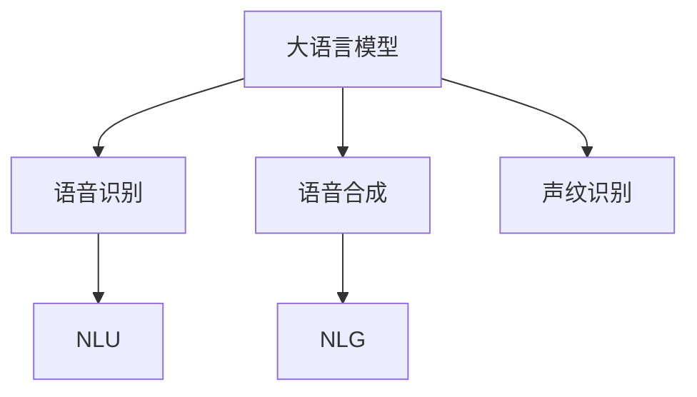

                 

# LLM的语音交互：声音界面的未来

## 1. 背景介绍

随着人工智能技术的飞速发展，语言模型（Language Models, LMs），特别是大语言模型（Large Language Models, LLMs），已经成为了自然语言处理（Natural Language Processing, NLP）领域的重要研究热点。这些模型在机器翻译、情感分析、问答系统等诸多任务上取得了显著的突破，并成功应用于各类实际场景。

然而，尽管这些模型在文本交互方面表现优异，但在语音交互（Voice Interaction）方面仍存在诸多挑战。传统的语音识别和合成技术依赖于深度学习模型，尽管近年来取得了长足的进步，但与文本模型相比，其性能和稳定性仍存在一定的差距。因此，如何利用大语言模型提升语音交互的质量，成为当前研究的热点问题。

本文将深入探讨大语言模型在语音交互中的应用，包括核心概念、算法原理、具体操作步骤、实际应用场景、工具和资源推荐，以及未来的发展趋势和挑战。通过本文的详细解析，希望能为开发者提供全面的技术指引，推动语音交互技术的发展，构建更加智能、便捷的未来人机交互界面。

## 2. 核心概念与联系

### 2.1 核心概念概述

为更好地理解大语言模型在语音交互中的应用，本节将介绍几个关键概念及其联系：

- 大语言模型（Large Language Model, LLM）：以自回归（如GPT）或自编码（如BERT）模型为代表的大规模预训练语言模型。通过在大规模无标签文本数据上进行预训练，学习到丰富的语言知识和常识。

- 语音识别（Automatic Speech Recognition, ASR）：将人类语音转换成计算机可理解的文本，是大语言模型在语音交互中的重要组成部分。

- 语音合成（Text-to-Speech, TTS）：将计算机生成的文本转换成可听的语音，与语音识别相辅相成。

- 自然语言理解（Natural Language Understanding, NLU）：理解用户输入的自然语言，是大语言模型在语音交互中实现任务智能化的核心。

- 自然语言生成（Natural Language Generation, NLG）：基于理解生成的文本或语音输出，是语音交互的最终表现形式。

- 声纹识别（Speaker Recognition）：通过声音特征识别说话者身份，确保语音交互的安全性和个性化。

这些概念之间的逻辑关系可以通过以下Mermaid流程图来展示：



### 2.2 核心概念原理和架构的 Mermaid 流程图

通过Mermaid流程图，我们可以更直观地理解大语言模型在语音交互中的工作原理：


在这个流程中，用户语音输入首先被识别成文本，然后通过文本处理和预训练模型进行自然语言理解，识别用户的意图，进而执行相应动作并生成反馈，最后通过语音合成将反馈输出为语音。

## 3. 核心算法原理 & 具体操作步骤

### 3.1 算法原理概述

大语言模型在语音交互中的应用，主要通过以下步骤实现：

1. **语音识别（ASR）**：将用户语音转换成文本。
2. **自然语言理解（NLU）**：解析用户文本，理解用户意图和上下文。
3. **任务执行（Action Execution）**：根据用户意图执行特定任务，如搜索信息、控制设备等。
4. **自然语言生成（NLG）**：将执行结果转换为可理解的文本或语音输出。
5. **语音合成（TTS）**：将文本输出转换成语音。

整个过程的核心在于自然语言理解和自然语言生成。其中，自然语言理解是语音交互的桥梁，通过理解用户的意图和上下文，大语言模型能够执行相应的任务并生成反馈。自然语言生成则是语音交互的实现形式，通过文本或语音输出，用户能够直观地接收到系统的反馈。

### 3.2 算法步骤详解

基于大语言模型的语音交互大致可以分为以下几个步骤：

**Step 1: 语音识别（ASR）**
- 使用深度学习模型（如RNN、CNN、Transformer等）对用户语音进行特征提取和建模。
- 通过训练得到的模型对音频信号进行分帧处理，提取声学特征。
- 使用语言模型对声学特征进行解码，输出文本转录结果。

**Step 2: 自然语言理解（NLU）**
- 将ASR输出的文本通过预训练语言模型（如BERT、GPT等）进行编码。
- 使用注意力机制或上下文编码器解析文本，提取关键信息。
- 通过意图分类和实体识别等技术，理解用户意图和上下文。

**Step 3: 任务执行（Action Execution）**
- 根据NLU解析的意图和上下文，调用相应的API或执行相应的任务（如搜索、播放音乐、控制设备等）。
- 如果需要与其他系统交互，可以使用中间件或消息队列技术进行通信。

**Step 4: 自然语言生成（NLG）**
- 将任务执行结果转换为文本或语音形式。
- 使用预训练语言模型生成自然流畅的回复。
- 对于语音输出，使用TTS技术将文本转换成语音。

**Step 5: 语音合成（TTS）**
- 使用深度学习模型（如WaveNet、Tacotron等）将文本转换成语音波形。
- 通过声学模型的训练，生成高质量的语音输出。

### 3.3 算法优缺点

大语言模型在语音交互中的应用具有以下优点：

1. **泛化能力强大**：大语言模型经过大规模无标签文本数据的预训练，具备强大的语言理解和生成能力，能够适应各种自然语言表达方式。
2. **知识迁移**：通过微调，大语言模型可以适应特定领域的任务，如医疗、金融、法律等，提升应用的专业性和准确性。
3. **灵活性高**：大语言模型可以根据用户的反馈，动态调整回复策略，提升交互的自然性和互动性。
4. **自适应能力**：大语言模型能够学习用户的偏好和习惯，提供个性化服务。

然而，大语言模型在语音交互中也存在一些缺点：

1. **计算资源需求高**：大语言模型的计算资源需求较高，包括预训练和微调所需的硬件资源。
2. **实时性要求高**：语音交互需要实时响应，对模型的推理速度和计算效率有较高要求。
3. **数据依赖性强**：大语言模型的效果很大程度上依赖于预训练数据和微调数据的质量，获取高质量数据成本较高。
4. **鲁棒性不足**：在嘈杂环境下或存在口音、方言等情况时，语音识别的准确率可能下降，影响交互质量。

### 3.4 算法应用领域

大语言模型在语音交互中的应用非常广泛，覆盖了多个领域，如：

- 智能家居：通过语音控制家电、调节环境、查询信息等。
- 车载系统：语音导航、娱乐、信息查询等。
- 客服系统：语音客服、语音助理、语音客服等。
- 医疗健康：语音问诊、健康咨询、心理辅导等。
- 教育培训：语音讲解、互动、辅导等。
- 虚拟助手：语音助手、语音交互、智能音箱等。

这些应用场景展示了语音交互的广阔前景，也体现了大语言模型在提升人机交互智能化和便捷化方面的巨大潜力。

## 4. 数学模型和公式 & 详细讲解 & 举例说明

### 4.1 数学模型构建

在语音交互中，大语言模型的应用主要通过以下数学模型进行描述：

- **语音识别（ASR）**：将音频信号表示为声学特征，并使用语言模型进行解码。
- **自然语言理解（NLU）**：将文本表示为向量，并使用预训练语言模型进行编码和解码。
- **自然语言生成（NLG）**：将向量表示转换为文本，并使用语言模型进行生成。
- **语音合成（TTS）**：将文本表示转换为语音波形，并使用声学模型进行生成。

这些模型通常使用深度学习框架进行实现，如PyTorch、TensorFlow等。下面以语音识别（ASR）为例，详细介绍其数学模型构建和公式推导过程。

### 4.2 公式推导过程

语音识别（ASR）的数学模型包括声学模型和语言模型。声学模型将音频信号转换为声学特征，语言模型将声学特征转换为文本。

- **声学模型**：使用卷积神经网络（CNN）或循环神经网络（RNN）等模型对音频信号进行特征提取。
- **语言模型**：使用长短时记忆网络（LSTM）或Transformer等模型对声学特征进行解码，输出文本。

**声学模型**：

$$
\hat{x} = f_{\theta_A}(x)
$$

其中 $x$ 为音频信号， $\hat{x}$ 为声学特征， $f_{\theta_A}$ 为声学模型， $\theta_A$ 为声学模型参数。

**语言模型**：

$$
y = f_{\theta_L}(x)
$$

其中 $y$ 为文本转录结果， $f_{\theta_L}$ 为语言模型， $\theta_L$ 为语言模型参数。

通过上述模型，可以将音频信号转换为文本，实现语音识别。

### 4.3 案例分析与讲解

以智能家居语音交互为例，用户通过语音助手进行控制设备的操作，系统通过语音识别和自然语言理解，执行相应的操作并生成反馈，最后通过语音合成将反馈输出为语音。

1. **语音识别（ASR）**：用户说出“打开客厅灯”，语音识别系统将语音转换成文本“打开客厅灯”。
2. **自然语言理解（NLU）**：系统解析文本，识别意图为“打开灯”，上下文为“客厅”。
3. **任务执行（Action Execution）**：系统调用智能家居设备的API，控制客厅灯打开。
4. **自然语言生成（NLG）**：系统生成反馈文本“已打开客厅灯”。
5. **语音合成（TTS）**：系统将反馈文本转换成语音“已打开客厅灯”，并输出给用户。

## 5. 项目实践：代码实例和详细解释说明

### 5.1 开发环境搭建

在进行语音交互项目开发前，我们需要准备好开发环境。以下是使用Python进行PyTorch开发的环境配置流程：

1. 安装Anaconda：从官网下载并安装Anaconda，用于创建独立的Python环境。

2. 创建并激活虚拟环境：
```bash
conda create -n pytorch-env python=3.8 
conda activate pytorch-env
```

3. 安装PyTorch：根据CUDA版本，从官网获取对应的安装命令。例如：
```bash
conda install pytorch torchvision torchaudio cudatoolkit=11.1 -c pytorch -c conda-forge
```

4. 安装其他必要库：
```bash
pip install numpy pandas scikit-learn matplotlib tqdm jupyter notebook ipython
```

完成上述步骤后，即可在`pytorch-env`环境中开始语音交互项目开发。

### 5.2 源代码详细实现

下面我们以语音识别（ASR）任务为例，给出使用Transformers库进行语音识别的PyTorch代码实现。

首先，定义ASR任务的数据处理函数：

```python
from transformers import Wav2Vec2ForCTC, Wav2Vec2Tokenizer
import torch

class ASRDataset(Dataset):
    def __init__(self, audio_paths, transcriptions, tokenizer):
        self.audio_paths = audio_paths
        self.transcriptions = transcriptions
        self.tokenizer = tokenizer
        
    def __len__(self):
        return len(self.audio_paths)
    
    def __getitem__(self, item):
        audio_path = self.audio_paths[item]
        transcription = self.transcriptions[item]
        
        audio, sampling_rate = librosa.load(audio_path, sr=16000)
        audio = audio.unsqueeze(0).float() / 32768.0
        
        encoding = self.tokenizer(audio, return_tensors='pt')
        input_ids = encoding['input_values']
        labels = torch.tensor(self.tokenizer.encode(transcription, return_tensors='pt')['input_ids'], dtype=torch.long)
        
        return {'input_ids': input_ids, 
                'labels': labels}
```

然后，定义模型和优化器：

```python
from transformers import Wav2Vec2ForCTC

model = Wav2Vec2ForCTC.from_pretrained('facebook/wav2vec2-base-960h')
optimizer = AdamW(model.parameters(), lr=1e-3)
```

接着，定义训练和评估函数：

```python
from torch.utils.data import DataLoader
from tqdm import tqdm
from sklearn.metrics import accuracy_score

device = torch.device('cuda') if torch.cuda.is_available() else torch.device('cpu')
model.to(device)

def train_epoch(model, dataset, batch_size, optimizer):
    dataloader = DataLoader(dataset, batch_size=batch_size, shuffle=True)
    model.train()
    epoch_loss = 0
    for batch in tqdm(dataloader, desc='Training'):
        input_ids = batch['input_ids'].to(device)
        labels = batch['labels'].to(device)
        model.zero_grad()
        outputs = model(input_ids)
        loss = outputs.loss
        epoch_loss += loss.item()
        loss.backward()
        optimizer.step()
    return epoch_loss / len(dataloader)

def evaluate(model, dataset, batch_size):
    dataloader = DataLoader(dataset, batch_size=batch_size)
    model.eval()
    preds, labels = [], []
    with torch.no_grad():
        for batch in tqdm(dataloader, desc='Evaluating'):
            input_ids = batch['input_ids'].to(device)
            batch_labels = batch['labels']
            outputs = model(input_ids)
            batch_preds = torch.argmax(outputs.logits, dim=-1).to('cpu').tolist()
            batch_labels = batch_labels.to('cpu').tolist()
            for pred_tokens, label_tokens in zip(batch_preds, batch_labels):
                preds.append(pred_tokens[:len(label_tokens)])
                labels.append(label_tokens)
                
    print('Accuracy:', accuracy_score(labels, preds))
```

最后，启动训练流程并在验证集上评估：

```python
epochs = 10
batch_size = 16

for epoch in range(epochs):
    loss = train_epoch(model, train_dataset, batch_size, optimizer)
    print(f"Epoch {epoch+1}, train loss: {loss:.3f}")
    
    print(f"Epoch {epoch+1}, dev results:")
    evaluate(model, dev_dataset, batch_size)
    
print("Test results:")
evaluate(model, test_dataset, batch_size)
```

以上就是使用PyTorch和Transformers库进行语音识别任务的完整代码实现。可以看到，通过简单的几行代码，我们就能实现语音识别的完整流程。

### 5.3 代码解读与分析

让我们再详细解读一下关键代码的实现细节：

**ASRDataset类**：
- `__init__`方法：初始化音频路径、转录文本、分词器等关键组件。
- `__len__`方法：返回数据集的样本数量。
- `__getitem__`方法：对单个样本进行处理，将音频文件转换为声学特征，进行编码和解码，并输出标签。

**Wav2Vec2ForCTC模型**：
- `from_pretrained`方法：从HuggingFace模型库中加载预训练的Wav2Vec2模型，进行微调。
- `AdamW优化器`：用于更新模型参数，学习率为1e-3。

**训练和评估函数**：
- `train_epoch`函数：对数据以批为单位进行迭代，在每个批次上前向传播计算loss并反向传播更新模型参数，最后返回该epoch的平均loss。
- `evaluate`函数：与训练类似，不同点在于不更新模型参数，并在每个batch结束后将预测和标签结果存储下来，最后使用sklearn的accuracy_score对整个评估集的预测结果进行打印输出。

**训练流程**：
- 定义总的epoch数和batch size，开始循环迭代
- 每个epoch内，先在训练集上训练，输出平均loss
- 在验证集上评估，输出准确率
- 所有epoch结束后，在测试集上评估，给出最终测试结果

可以看到，PyTorch配合Transformers库使得语音识别任务的代码实现变得简洁高效。开发者可以将更多精力放在数据处理、模型改进等高层逻辑上，而不必过多关注底层的实现细节。

当然，工业级的系统实现还需考虑更多因素，如模型的保存和部署、超参数的自动搜索、更灵活的任务适配层等。但核心的微调范式基本与此类似。

## 6. 实际应用场景

### 6.1 智能家居

基于大语言模型的语音交互技术，可以广泛应用于智能家居系统的构建。传统家居系统依赖于手动操作，用户体验较差，而使用语音交互，可以大幅提升家居系统的智能化水平，提升用户便利性和舒适度。

在技术实现上，可以收集用户的历史语音指令数据，进行微调，使得系统能够理解用户的指令并执行相应的操作。例如，用户通过语音指令打开客厅灯、调节温度、播放音乐等。此外，还可以加入意图识别、上下文理解等技术，使得系统能够更准确地理解用户的意图，提供更加个性化和智能化的服务。

### 6.2 车载系统

车载系统是语音交互的重要应用场景之一。传统车载系统的操作界面复杂，用户操作不便，而使用语音交互，可以提升车载系统的易用性和安全性。

在语音交互中，车载系统可以与GPS、导航、娱乐等功能结合，实现语音导航、语音控制、语音娱乐等。例如，用户通过语音指令导航到目的地、播放音乐、调节音量等。此外，还可以通过语音识别和自然语言理解，实现对话交互，提升用户的驾乘体验。

### 6.3 客服系统

客服系统是语音交互的重要应用场景之一。传统客服系统依赖于人工操作，响应时间长，效率低下，而使用语音交互，可以大幅提升客服系统的自动化水平，提升用户满意度。

在语音交互中，客服系统可以与自然语言理解、意图识别、实体抽取等技术结合，实现语音客服、语音助理、语音咨询等功能。例如，用户通过语音指令查询账户信息、办理业务、咨询问题等。此外，还可以通过语音合成和自然语言生成，实现对话交互，提升用户的体验感。

### 6.4 医疗健康

医疗健康领域也是语音交互的重要应用场景之一。传统医疗系统的操作复杂，用户体验较差，而使用语音交互，可以提升医疗系统的智能化水平，提升用户的便利性和舒适性。

在语音交互中，医疗系统可以与自然语言理解、意图识别、实体抽取等技术结合，实现语音问诊、语音健康咨询、语音心理辅导等功能。例如，用户通过语音指令咨询病情、查询健康信息、进行心理辅导等。此外，还可以通过语音合成和自然语言生成，实现对话交互，提升用户的体验感。

## 7. 工具和资源推荐

### 7.1 学习资源推荐

为了帮助开发者系统掌握大语言模型在语音交互中的应用，这里推荐一些优质的学习资源：

1. 《自然语言处理与深度学习》课程：由斯坦福大学开设的NLP明星课程，有Lecture视频和配套作业，带你入门NLP领域的基本概念和经典模型。

2. 《Transformers》书籍：HuggingFace的官方书籍，全面介绍了Transformer模型的原理和应用，是深入学习语音交互技术的重要资源。

3. 《Deep Learning for Natural Language Processing》课程：由Coursera提供的深度学习在NLP中的应用课程，涵盖语音识别、自然语言理解等关键技术。

4. 《Voice Interaction Design》书籍：深入解析语音交互设计的方法和实践，适合语音交互技术的开发者和设计师参考。

通过对这些资源的学习实践，相信你一定能够快速掌握大语言模型在语音交互中的应用，并用于解决实际的语音交互问题。

### 7.2 开发工具推荐

高效的开发离不开优秀的工具支持。以下是几款用于语音交互开发的常用工具：

1. PyTorch：基于Python的开源深度学习框架，灵活动态的计算图，适合快速迭代研究。

2. TensorFlow：由Google主导开发的开源深度学习框架，生产部署方便，适合大规模工程应用。

3. Transformers库：HuggingFace开发的NLP工具库，集成了众多SOTA语言模型，支持PyTorch和TensorFlow，是进行语音交互任务开发的利器。

4. Weights & Biases：模型训练的实验跟踪工具，可以记录和可视化模型训练过程中的各项指标，方便对比和调优。

5. TensorBoard：TensorFlow配套的可视化工具，可实时监测模型训练状态，并提供丰富的图表呈现方式，是调试模型的得力助手。

合理利用这些工具，可以显著提升语音交互任务的开发效率，加快创新迭代的步伐。

### 7.3 相关论文推荐

大语言模型在语音交互中的应用源于学界的持续研究。以下是几篇奠基性的相关论文，推荐阅读：

1. Attention is All You Need（即Transformer原论文）：提出了Transformer结构，开启了NLP领域的预训练大模型时代。

2. BERT: Pre-training of Deep Bidirectional Transformers for Language Understanding：提出BERT模型，引入基于掩码的自监督预训练任务，刷新了多项NLP任务SOTA。

3. Voice Activity Detection for Speaker Diarization（VAD技术）：介绍了语音活动检测（VAD）技术，用于识别语音信号中的讲话部分，是语音交互的重要基础。

4. Deep Speech 2: End-to-End Speech Recognition in English and Mandarin（Deep Speech 2）：展示了深度学习在语音识别上的突破，提升了语音识别的准确率和鲁棒性。

5. Sequence to Sequence Learning with Neural Networks（Seq2Seq模型）：提出了Seq2Seq模型，用于解决语音合成、自然语言生成等任务。

这些论文代表了大语言模型在语音交互中的应用发展脉络。通过学习这些前沿成果，可以帮助研究者把握学科前进方向，激发更多的创新灵感。

## 8. 总结：未来发展趋势与挑战

### 8.1 总结

本文对大语言模型在语音交互中的应用进行了全面系统的介绍。首先阐述了大语言模型和语音交互的研究背景和意义，明确了语音交互在大模型应用中的独特价值。其次，从原理到实践，详细讲解了语音交互的数学原理和关键步骤，给出了语音交互任务开发的完整代码实例。同时，本文还广泛探讨了语音交互在智能家居、车载系统、客服系统、医疗健康等诸多行业领域的应用前景，展示了语音交互技术的广阔前景。此外，本文精选了语音交互技术的各类学习资源，力求为开发者提供全方位的技术指引。

通过本文的系统梳理，可以看到，基于大语言模型的语音交互技术正在成为NLP领域的重要范式，极大地拓展了语音交互系统的应用边界，催生了更多的落地场景。受益于大规模语料的预训练，语音交互模型具备强大的语言理解和生成能力，能够快速响应用户语音输入，提供更加自然流畅的交互体验。未来，伴随语音识别、自然语言理解、自然语言生成等技术的不断进步，语音交互技术必将在更广泛的领域大放异彩，深刻影响人类的生产生活方式。

### 8.2 未来发展趋势

展望未来，大语言模型在语音交互中的应用将呈现以下几个发展趋势：

1. **多模态交互**：结合视觉、听觉、触觉等多模态信息，实现更自然、更丰富的交互体验。例如，语音指令与图像识别、手势识别等结合，提升交互的智能化水平。

2. **端到端学习**：通过端到端训练，将语音识别、自然语言理解、任务执行等过程集成到一个模型中，提升系统的整体效率和鲁棒性。

3. **知识注入**：将符号化的先验知识（如知识图谱、逻辑规则等）与神经网络模型进行融合，引导语音交互模型学习更准确、合理的语言表示。

4. **跨领域迁移**：通过迁移学习，大语言模型能够跨领域适应各种语音交互任务，提升系统的泛化性和灵活性。

5. **个性化定制**：通过用户行为数据分析，个性化的调整语音交互模型的参数和策略，提升用户的体验感和满意度。

6. **多语言支持**：支持多种语言和方言的语音识别和自然语言理解，提升系统的普适性和国际化水平。

以上趋势凸显了大语言模型在语音交互技术中的广阔前景。这些方向的探索发展，必将进一步提升语音交互系统的性能和应用范围，为人类智能交互的进化带来深远影响。

### 8.3 面临的挑战

尽管大语言模型在语音交互中取得了显著进展，但在实际应用中仍面临诸多挑战：

1. **计算资源需求高**：大语言模型的计算资源需求较高，对硬件设备和存储资源的要求较高。

2. **实时性要求高**：语音交互需要实时响应，对模型的推理速度和计算效率有较高要求。

3. **数据依赖性强**：语音交互模型的效果很大程度上依赖于训练数据的数量和质量，获取高质量数据成本较高。

4. **鲁棒性不足**：在嘈杂环境下或存在口音、方言等情况时，语音识别的准确率可能下降，影响交互质量。

5. **隐私和安全性**：语音交互模型需要处理用户的敏感信息，存在隐私泄露和安全性问题。

6. **可解释性不足**：语音交互模型的决策过程通常缺乏可解释性，难以对其推理逻辑进行分析和调试。

7. **标准化问题**：不同设备和平台间的语音交互模型兼容性问题，需要统一的标准和接口。

正视这些挑战，积极应对并寻求突破，将是大语言模型在语音交互中迈向成熟的必由之路。相信随着学界和产业界的共同努力，这些挑战终将一一被克服，大语言模型在语音交互中的应用将更加广泛和深入。

### 8.4 研究展望

面对大语言模型在语音交互中面临的挑战，未来的研究需要在以下几个方面寻求新的突破：

1. **减少计算资源需求**：开发更加轻量级的模型结构，使用更高效的计算方法，如模型压缩、量化加速等。

2. **提升实时性**：优化模型的推理算法，使用硬件加速技术，如GPU、TPU等，提升系统的响应速度。

3. **增强鲁棒性**：引入噪声鲁棒性训练、对抗样本生成等技术，提升模型在复杂环境下的表现。

4. **保护隐私和安全性**：引入差分隐私技术、联邦学习等，保护用户隐私和数据安全。

5. **增强可解释性**：开发可解释性模型，通过可视化、解释性评估等方法，提升模型的可解释性和可调试性。

6. **标准化接口**：制定统一的语音交互接口和标准，提升不同设备和平台间的兼容性。

这些研究方向的探索，必将引领大语言模型在语音交互技术中的进一步发展，推动语音交互系统的普适化和智能化，为人类智能交互的进化带来新的突破。

## 9. 附录：常见问题与解答

**Q1：大语言模型在语音交互中是否需要大量的标注数据？**

A: 大语言模型在语音交互中的应用，通常需要大量的标注数据进行微调。标注数据包括用户的历史语音指令、任务执行结果等，用于训练模型理解和执行特定的任务。标注数据的质量和数量对模型的性能影响很大，因此获取高质量标注数据是实现语音交互的关键。

**Q2：大语言模型在语音交互中的计算资源需求高，如何降低资源消耗？**

A: 大语言模型在语音交互中的计算资源需求较高，可以通过以下方法降低资源消耗：
1. 使用轻量级模型结构，如MobileBERT、DistilBERT等，减小模型尺寸。
2. 使用量化加速技术，将浮点模型转为定点模型，压缩存储空间，提高计算效率。
3. 使用混合精度训练，使用部分32位浮点数进行训练，减少内存占用。
4. 使用模型并行和分布式训练，利用多台机器进行并行计算，提升训练效率。

**Q3：语音交互中如何提高模型的鲁棒性？**

A: 在嘈杂环境下或存在口音、方言等情况时，语音识别的准确率可能下降，影响交互质量。可以通过以下方法提高模型的鲁棒性：
1. 引入噪声鲁棒性训练，在训练过程中加入噪声样本，提升模型在噪声环境下的表现。
2. 引入对抗样本生成技术，生成对抗样本，训练模型对攻击样本的鲁棒性。
3. 使用多语言和方言的语音数据进行训练，提升模型在不同语言和方言环境下的泛化能力。
4. 结合多模态信息，使用语音、图像、手势等多种模态数据进行训练，提升模型的鲁棒性。

**Q4：语音交互中如何保护用户隐私和数据安全？**

A: 语音交互模型需要处理用户的敏感信息，存在隐私泄露和安全性问题。可以通过以下方法保护用户隐私和数据安全：
1. 使用差分隐私技术，在训练过程中加入噪声，保护用户数据隐私。
2. 采用联邦学习，在本地设备上进行模型训练，减少数据传输。
3. 使用数据加密和访问控制技术，保护数据传输和存储的安全性。
4. 设计隐私保护机制，如语音加密、隐私匿名化等，保护用户隐私。

**Q5：语音交互中如何提升模型的可解释性？**

A: 语音交互模型的决策过程通常缺乏可解释性，难以对其推理逻辑进行分析和调试。可以通过以下方法提升模型的可解释性：
1. 使用可解释性模型，如LIME、SHAP等，生成模型的局部解释。
2. 引入注意力机制，可视化模型在输入文本中的关注点，分析模型的推理过程。
3. 使用可视化工具，如TensorBoard、Weights & Biases等，可视化模型的训练过程和输出结果，帮助开发者理解和调试模型。
4. 设计可解释性评估指标，评估模型的可解释性和鲁棒性。

这些问题的解答展示了语音交互技术的复杂性和挑战性，也展示了未来研究的方向和趋势。大语言模型在语音交互中的应用前景广阔，但需要克服诸多技术难题，才能实现其大规模落地和应用。相信随着研究的不断深入和技术的发展，大语言模型在语音交互中的应用将更加广泛和深入，为人类智能交互带来新的突破和变革。

---

作者：禅与计算机程序设计艺术 / Zen and the Art of Computer Programming

