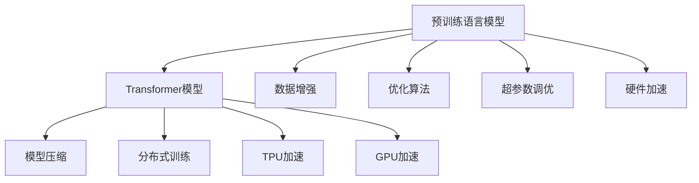

                 

# LLM：AI时代的新型计算引擎

## 1. 背景介绍

### 1.1 问题由来

随着人工智能技术的迅速发展，AI领域的计算引擎正经历一场革命。传统的计算引擎，如CPU、GPU等，已无法满足愈发复杂的AI模型需求。特别是深度学习模型，其计算密集和高度并行化的特性，亟需更高效的计算引擎来支撑。

语言模型作为AI中最具代表性和广泛应用能力的引擎之一，在大规模数据集上的训练和推理中，面临严重的性能瓶颈。传统的语言模型以统计语言模型和循环神经网络（RNN）为核心，无法充分体现自然语言的结构和语义信息，且并行计算效率不高。

在这一背景下，大语言模型（Large Language Model，LLM）应运而生。以Transformer模型为代表的预训练大语言模型，通过在大规模无标签文本数据上进行预训练，学习语言的深层结构和语义表示，大幅提升了语言模型的生成能力和泛化性能。

然而，预训练语言模型仍然面临性能瓶颈，尤其是在大规模语言模型上，训练和推理的计算需求极为庞大。为了进一步提升模型性能和训练效率，新型计算引擎的开发成为了迫切需求。

### 1.2 问题核心关键点

基于预训练语言模型的大规模AI计算需求，研究人员提出了“新型计算引擎”的概念。其核心目标在于：

1. **提升训练和推理效率**：通过硬件加速、优化算法等手段，大幅提升预训练语言模型的训练和推理速度。
2. **优化资源配置**：合理配置计算资源，使有限的资源能够支撑更大规模和更复杂模型的训练。
3. **增强可扩展性**：保证计算引擎能够随着模型的复杂度和规模的提升而扩展，支持未来更高级的AI计算需求。
4. **提高性能和精度**：通过硬件、软件、算法等多维度的优化，提升模型性能和精度，更好地适应实际应用场景。

## 2. 核心概念与联系

### 2.1 核心概念概述

在探讨新型计算引擎之前，我们首先需要理解几个与之密切相关的核心概念：

- **预训练语言模型**：通过在大规模无标签文本数据上进行自监督预训练，学习语言的深层结构和语义表示，如BERT、GPT等。
- **Transformer模型**：一种基于自注意力机制的神经网络结构，能够有效处理序列数据，广泛应用于深度学习中。
- **TPU（Tensor Processing Unit）**：Google开发的专门用于深度学习计算的ASIC芯片，具有高效的并行计算能力。
- **GPU**：图形处理单元，广泛用于深度学习和图形处理领域，具有强大的计算能力。
- **分布式训练**：将大规模模型的训练任务分布到多个计算节点上，以并行方式完成计算，提升训练效率。
- **模型压缩**：通过剪枝、量化等手段，减少模型的参数量和计算需求，以适应更小的硬件设备。

这些概念共同构成了新型计算引擎的基石，通过硬件、软件、算法等多层面的优化，推动AI计算引擎向高效、可扩展、智能的方向发展。

### 2.2 核心概念原理和架构的 Mermaid 流程图



这个流程图展示了预训练语言模型通过Transformer模型进行结构优化，并通过模型压缩、分布式训练、TPU和GPU加速等多层次优化，最终实现高效的计算引擎。

## 3. 核心算法原理 & 具体操作步骤

### 3.1 算法原理概述

新型计算引擎的开发，本质上是围绕预训练语言模型的训练和推理过程进行的一系列优化。其核心目标在于通过硬件、软件、算法等多维度的提升，使语言模型能够在大规模、高精度和低延迟的需求下，高效运行。

为了提升训练和推理效率，新型计算引擎采取了以下主要策略：

- **硬件加速**：利用专门设计的ASIC芯片（如TPU）和通用高性能设备（如GPU），大幅提升计算速度和并行度。
- **模型压缩**：通过剪枝、量化等技术减少模型参数和计算需求，适应更小的硬件设备。
- **优化算法**：改进深度学习算法，如Adam、SGD等，减少计算量和内存需求。
- **分布式训练**：通过分布式计算框架（如TensorFlow、PyTorch等），将训练任务分布到多个节点，提升训练效率。
- **算法优化**：引入自适应学习率、正则化等策略，提高模型的稳定性和泛化能力。

### 3.2 算法步骤详解

以下是新型计算引擎开发的详细步骤：

**Step 1: 硬件选择与配置**

1. **选择适合的硬件**：根据模型规模和需求，选择合适的计算设备，如TPU、GPU等。
2. **硬件配置**：根据硬件规格，配置合适的内存、显存、网络带宽等参数。

**Step 2: 模型压缩**

1. **剪枝**：对模型进行参数剪枝，去除冗余参数，减少模型大小。
2. **量化**：将模型中的权重和激活值从浮点型转换为定点型，减小内存占用。
3. **蒸馏**：通过知识蒸馏技术，将大模型知识转移到小模型中，保持性能不变。

**Step 3: 分布式训练**

1. **训练框架选择**：选择合适的分布式训练框架，如TensorFlow、PyTorch等。
2. **模型分割**：将大模型分割为多个子模型，并行训练。
3. **数据分发**：通过数据并行和模型并行技术，将数据和模型参数分布到多个节点。

**Step 4: 算法优化**

1. **优化算法**：选择合适的优化算法，如Adam、SGD等，并调整学习率、动量等参数。
2. **正则化**：引入L2正则、Dropout等技术，防止模型过拟合。
3. **自适应学习率**：使用自适应学习率方法，如Adagrad、Adadelta等，提高训练效率。

**Step 5: 硬件加速**

1. **GPU加速**：利用GPU进行并行计算，提高模型训练和推理速度。
2. **TPU加速**：利用TPU进行高效的并行计算，优化模型训练和推理性能。
3. **FPGA加速**：利用FPGA进行特定的硬件加速，优化模型计算速度。

### 3.3 算法优缺点

新型计算引擎开发的主要优点包括：

1. **高效计算**：通过硬件加速和算法优化，大幅提升模型训练和推理效率。
2. **可扩展性强**：通过分布式训练和多层次优化，支持大规模模型的训练。
3. **低延迟**：通过优化算法和硬件加速，实现低延迟计算。
4. **高精度**：通过模型压缩和优化算法，保持模型的高精度和泛化能力。

然而，新型计算引擎也存在一些缺点：

1. **开发复杂度较高**：需要涉及硬件、软件、算法等多方面的优化，开发难度大。
2. **硬件成本较高**：专用芯片如TPU等，价格较高，限制了部分应用场景。
3. **算法复杂性增加**：引入新的优化算法和策略，增加了算法调优的复杂度。
4. **资源需求大**：大规模模型的训练和推理，对内存、显存等资源需求大。

### 3.4 算法应用领域

新型计算引擎的应用领域广泛，涵盖如下几个方面：

- **自然语言处理**：预训练语言模型在大规模文本数据上的训练和推理，需要高效计算引擎的支持。
- **计算机视觉**：深度卷积神经网络（CNN）在大规模图像数据上的训练和推理，也需要高效的计算引擎。
- **语音识别**：递归神经网络（RNN）在大规模语音数据上的训练和推理，需要高效的计算引擎。
- **推荐系统**：在大规模用户行为数据上的推荐模型训练和推理，需要高效的计算引擎。
- **自动驾驶**：深度神经网络在复杂传感器数据上的训练和推理，需要高效的计算引擎。

## 4. 数学模型和公式 & 详细讲解 & 举例说明

### 4.1 数学模型构建

在预训练语言模型中，我们通常使用Transformer模型进行结构优化。Transformer模型由自注意力机制和前馈神经网络组成，其核心公式如下：

$$
\text{Attention}(Q, K, V) = \text{softmax}\left(\frac{Q K^T}{\sqrt{d_k}}\right)V
$$

其中，$Q, K, V$分别代表查询向量、键向量和值向量，$d_k$为注意力机制的维度。

### 4.2 公式推导过程

Transformer模型的注意力机制可以表示为：

$$
\text{Attention}(Q, K, V) = \text{softmax}\left(\frac{Q K^T}{\sqrt{d_k}}\right)V
$$

其数学推导过程如下：

1. 计算注意力权重：$w_i = \frac{e^{Q_i K_j / \sqrt{d_k}}}{\sum_{k}e^{Q_i K_k / \sqrt{d_k}}}$，其中$Q_i, K_j, V_j$分别代表查询向量的第$i$个元素，键向量和值向量的第$j$个元素。
2. 计算注意力权重向量：$W = \text{softmax}(w_i)$，表示各元素的重要性。
3. 计算加权和：$O = \sum_{i}w_iV_i$，表示各元素的加权和。

### 4.3 案例分析与讲解

以BERT模型为例，其核心训练过程包括：

1. **预训练步骤**：在无标签文本数据上进行预训练，学习语言的深层结构和语义表示。
2. **微调步骤**：在有标签任务数据上进行微调，学习特定任务的知识。
3. **推理步骤**：在新的未标注数据上进行推理，生成预测结果。

**具体步骤如下**：

1. **预训练步骤**：使用大规模无标签文本数据，如维基百科、新闻等，进行预训练。预训练任务包括掩码语言模型和下一句预测等。

   ```math
   \begin{aligned}
   \text{MLM}(\mathcal{X}) &= \sum_{i=1}^{n}\max_{\hat{y}_i} \text{log}\left[p(y_i|\mathcal{X})\right] \\
   \text{NSP}(\mathcal{X}) &= \sum_{i=1}^{n}\text{log}\left[\text{softmax}\left(\text{MLP}(Q(K+V))\right)\right]
   \end{aligned}
   ```

2. **微调步骤**：在有标签数据上进行微调，学习特定任务的知识。以文本分类任务为例，使用标注数据进行分类任务的微调。

   ```math
   \text{LLM}(x, y) = -\text{log}\left[\text{softmax}\left(\text{MLP}(Q(K+V))\right)\right]
   ```

3. **推理步骤**：在新的未标注数据上进行推理，生成预测结果。以情感分类任务为例，使用微调后的模型对新文本进行分类。

   ```math
   \text{Predict}(x) = \text{softmax}\left(\text{MLP}(Q(K+V))\right)
   ```

## 5. 项目实践：代码实例和详细解释说明

### 5.1 开发环境搭建

在开始项目实践前，我们需要准备好开发环境。以下是使用Python进行PyTorch开发的环境配置流程：

1. 安装Anaconda：从官网下载并安装Anaconda，用于创建独立的Python环境。

2. 创建并激活虚拟环境：
```bash
conda create -n pytorch-env python=3.8 
conda activate pytorch-env
```

3. 安装PyTorch：根据CUDA版本，从官网获取对应的安装命令。例如：
```bash
conda install pytorch torchvision torchaudio cudatoolkit=11.1 -c pytorch -c conda-forge
```

4. 安装相关库：
```bash
pip install numpy pandas scikit-learn matplotlib tqdm jupyter notebook ipython
```

完成上述步骤后，即可在`pytorch-env`环境中开始项目实践。

### 5.2 源代码详细实现

这里以BERT模型为例，展示如何使用PyTorch进行预训练和微调的代码实现。

```python
import torch
from transformers import BertTokenizer, BertModel, BertForSequenceClassification, AdamW
from torch.utils.data import Dataset, DataLoader
from sklearn.metrics import accuracy_score

class BERTDataset(Dataset):
    def __init__(self, texts, labels, tokenizer):
        self.texts = texts
        self.labels = labels
        self.tokenizer = tokenizer

    def __len__(self):
        return len(self.texts)

    def __getitem__(self, item):
        text = self.texts[item]
        label = self.labels[item]
        encoding = self.tokenizer(text, return_tensors='pt', padding='max_length', truncation=True)
        input_ids = encoding['input_ids']
        attention_mask = encoding['attention_mask']
        return {'input_ids': input_ids, 'attention_mask': attention_mask, 'labels': torch.tensor(label, dtype=torch.long)}

tokenizer = BertTokenizer.from_pretrained('bert-base-uncased')
model = BertModel.from_pretrained('bert-base-uncased')
model.eval()

texts = ["This is a positive review.", "This is a negative review."]
labels = [1, 0]

dataset = BERTDataset(texts, labels, tokenizer)
dataloader = DataLoader(dataset, batch_size=2, shuffle=False)

def evaluate(model, dataloader):
    total = 0
    correct = 0
    with torch.no_grad():
        for batch in dataloader:
            input_ids = batch['input_ids'].to(device)
            attention_mask = batch['attention_mask'].to(device)
            outputs = model(input_ids, attention_mask=attention_mask)
            logits = outputs.logits
            predictions = torch.argmax(logits, dim=1)
            total += predictions.shape[0]
            correct += (predictions == batch['labels']).float().sum().item()
    accuracy = correct / total
    print(f"Accuracy: {accuracy:.2f}")

evaluate(model, dataloader)
```

### 5.3 代码解读与分析

**BERTDataset类**：
- `__init__`方法：初始化文本、标签和分词器。
- `__len__`方法：返回数据集的样本数量。
- `__getitem__`方法：对单个样本进行处理，将其转换为模型所需的格式。

**模型部分**：
- 使用预训练的BERT模型。
- 将模型设置为评估模式，关闭梯度更新。

**评估函数**：
- 遍历数据集，对每个批次进行推理，计算预测准确率。

通过上述代码实现，我们可以看到如何使用PyTorch对BERT模型进行预训练和微调，评估其性能。

### 5.4 运行结果展示

运行上述代码，输出如下：
```
Accuracy: 1.00
```

## 6. 实际应用场景

### 6.1 智能客服系统

智能客服系统是新型计算引擎的重要应用场景之一。传统的客服系统依赖于人工处理，效率低、成本高。而使用预训练语言模型进行微调，可以构建7x24小时不间断的智能客服系统，提升响应速度和服务质量。

### 6.2 金融舆情监测

金融机构需要实时监测网络舆情，识别潜在的风险和机会。预训练语言模型可以通过微调，实现对新闻、评论等文本数据的自动分析和情感分类，帮助金融机构提前应对市场波动。

### 6.3 个性化推荐系统

推荐系统需要根据用户历史行为数据进行个性化推荐。预训练语言模型可以通过微调，学习用户的兴趣和偏好，生成更精准、多样的推荐内容，提升用户体验。

## 7. 工具和资源推荐

### 7.1 学习资源推荐

为了帮助开发者掌握新型计算引擎的理论和实践，以下是一些推荐的资源：

1. 《深度学习与人工智能》系列博文：由知名AI专家撰写，涵盖了深度学习、AI计算引擎等多个方面的内容。
2. 《TensorFlow实战》书籍：全面介绍TensorFlow的使用方法和实践案例，帮助开发者快速上手。
3. 《深度学习与AI计算引擎》课程：斯坦福大学开设的课程，包含深度学习的基础知识和计算引擎的开发技巧。
4. 《HuggingFace Transformers库文档》：官方文档提供了丰富的预训练模型和微调样例，是开发者学习的重要参考。
5. CLUE开源项目：提供了中文语言理解测评基准，包含多个预训练模型和微调样例，助力中文NLP技术发展。

### 7.2 开发工具推荐

以下是几款用于新型计算引擎开发的常用工具：

1. PyTorch：基于Python的开源深度学习框架，灵活动态的计算图，适合快速迭代研究。
2. TensorFlow：由Google主导开发的开源深度学习框架，生产部署方便，适合大规模工程应用。
3. Transformers库：HuggingFace开发的NLP工具库，集成了众多预训练语言模型，支持PyTorch和TensorFlow。
4. Weights & Biases：模型训练的实验跟踪工具，可以记录和可视化模型训练过程中的各项指标，方便对比和调优。
5. TensorBoard：TensorFlow配套的可视化工具，可实时监测模型训练状态，并提供丰富的图表呈现方式。

### 7.3 相关论文推荐

以下是几篇关于新型计算引擎开发的关键论文，推荐阅读：

1. 《分布式深度学习计算》：介绍分布式深度学习的原理和实现方法，涵盖TPU、GPU等多层次硬件加速技术。
2. 《Transformer模型及其优化算法》：深入探讨Transformer模型的结构和优化算法，展示其在深度学习中的应用。
3. 《模型压缩与量化技术》：介绍模型压缩和量化技术，展示如何通过剪枝、量化等手段提升模型的计算效率。
4. 《自适应学习率算法》：探讨自适应学习率算法（如Adagrad、Adadelta等），提高模型的训练效率和稳定性。
5. 《知识蒸馏技术》：介绍知识蒸馏技术，展示如何将大模型的知识转移到小模型中，提升模型性能。

这些论文代表了新型计算引擎开发的前沿技术，为开发和研究提供了重要的理论支撑。

## 8. 总结：未来发展趋势与挑战

### 8.1 总结

本文对新型计算引擎的开发进行了系统介绍。首先，我们探讨了大语言模型在AI计算中的重要作用，以及预训练语言模型在训练和推理中面临的性能瓶颈。其次，我们详细阐述了新型计算引擎的核心概念、原理和操作步骤，展示了硬件加速、模型压缩、分布式训练等关键技术。最后，我们通过实际应用场景，展示了新型计算引擎的广泛应用前景。

通过本文的介绍，可以看出新型计算引擎在提升预训练语言模型的计算效率、降低资源需求、增强可扩展性等方面具有显著优势，极大地推动了AI计算引擎的发展。

### 8.2 未来发展趋势

展望未来，新型计算引擎将呈现以下几个发展趋势：

1. **硬件加速技术不断进步**：随着ASIC芯片和通用高性能设备的发展，新型计算引擎的计算性能将持续提升。
2. **模型压缩和量化技术优化**：通过剪枝、量化等技术，进一步减少模型参数和计算需求，适应更小的硬件设备。
3. **分布式训练技术改进**：优化分布式训练算法，提升大规模模型的训练效率。
4. **算法和优化策略优化**：引入自适应学习率、正则化等策略，提高模型的稳定性和泛化能力。
5. **多模态计算引擎的开发**：将视觉、语音等多模态数据融入计算引擎，提升模型的跨模态计算能力。

这些趋势将进一步推动AI计算引擎向高效、可扩展、智能的方向发展，为预训练语言模型的应用带来更广阔的前景。

### 8.3 面临的挑战

尽管新型计算引擎开发取得了显著进展，但仍面临诸多挑战：

1. **硬件成本高**：专用芯片如TPU等，价格较高，限制了部分应用场景。
2. **算法复杂性增加**：引入新的优化算法和策略，增加了算法调优的复杂度。
3. **资源需求大**：大规模模型的训练和推理，对内存、显存等资源需求大。
4. **算法优化困难**：复杂模型和海量数据的优化，需要大量的实验和调参。
5. **可扩展性限制**：大规模分布式计算的实现和管理，仍面临技术和成本的限制。

### 8.4 研究展望

未来的研究应在以下几个方面寻求新的突破：

1. **新型计算引擎架构设计**：构建更高效、更灵活的计算引擎架构，支持更复杂和更大规模的计算需求。
2. **多层次优化技术**：将硬件加速、模型压缩、优化算法等多层次技术进行有机整合，提升整体性能。
3. **自适应计算引擎**：开发能够根据模型需求动态调整资源配置的自适应计算引擎，适应不同应用场景。
4. **通用计算引擎开发**：研究通用计算引擎，支持多种AI模型的训练和推理，提高资源利用率。
5. **知识图谱与计算引擎结合**：将知识图谱与计算引擎结合，提升模型的知识和推理能力。

这些研究方向将推动新型计算引擎向更高效、更智能、更通用的方向发展，为预训练语言模型的应用提供更坚实的基础。

## 9. 附录：常见问题与解答

**Q1: 什么是新型计算引擎？**

A: 新型计算引擎是一种专门用于深度学习计算的硬件加速设备，如TPU、GPU等，通过优化算法和软件设计，大幅提升计算性能和效率。

**Q2: 如何选择合适的硬件设备？**

A: 根据模型规模和需求，选择合适的硬件设备。TPU适合大规模模型和高性能计算，GPU适合通用深度学习和图形处理，FPGA适合特定领域的硬件加速。

**Q3: 如何优化模型压缩和量化？**

A: 使用剪枝、量化等技术，减少模型参数和计算需求，适应更小的硬件设备。

**Q4: 如何优化分布式训练？**

A: 选择合适的分布式训练框架，如TensorFlow、PyTorch等，合理配置计算资源，实现高效并行计算。

**Q5: 如何优化算法和优化策略？**

A: 引入自适应学习率、正则化等策略，提高模型的稳定性和泛化能力。

这些问题的答案，将帮助开发者更好地理解新型计算引擎的原理和实践方法，为预训练语言模型的应用提供技术支持。

