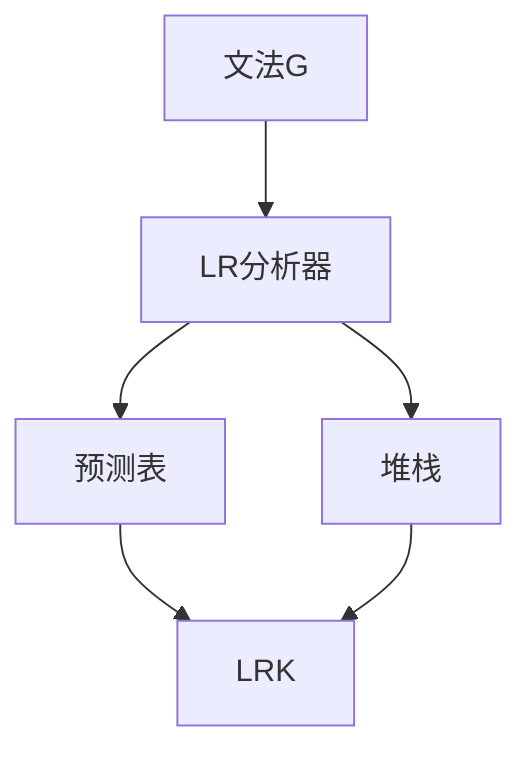

                 

# LR语法分析：自底向上的语法分析技术

> 关键词：自底向上语法分析、LR分析器、解析器、文法、预测分析、自上而下分析、左递归消除

## 1. 背景介绍

### 1.1 问题由来
语法分析是编译器中非常重要的一部分，用于将源代码解析为中间代码或抽象语法树。早期的语法分析方法如递归下降分析器等，由于存在递归和左递归等问题，无法处理复杂语法结构。自底向上的语法分析技术LR（Longest Remaining Prefix）分析器应运而生，通过动态预测语法规则，实现了对复杂文法的高效解析。

### 1.2 问题核心关键点
LR分析器是自底向上的语法分析方法，适用于任意文法，包括C语言等标准语言。其核心思想是通过预测语法规则的最长剩余前缀（LRK），动态选择下一个需要解析的符号，从而解析整个文法结构。

LR分析器的优点包括：
- 适用于任意文法，包括二义性文法。
- 解析效率高，适用于大语法结构。
- 结构简单，易于实现。

### 1.3 问题研究意义
LR分析器作为现代编译器中必不可少的关键组件，其性能和效率直接影响编译器整体性能。研究如何高效构建和优化LR分析器，对提升编译器性能、加速程序开发具有重要意义。

## 2. 核心概念与联系

### 2.1 核心概念概述

为更好地理解LR分析器的原理和架构，本节将介绍几个密切相关的核心概念：

- **文法（Grammar）**：描述程序语言的结构和语义规则，是语法分析的基础。常见的文法有上下文无关文法（CFG）、上下文敏感文法（CSG）等。

- **LR分析器（LR PARSER）**：通过预测语法规则的最长剩余前缀（LRK），自底向上解析文法结构的分析器。其核心数据结构包括预测表和堆栈（Stack）。

- **预测表（Predict Table）**：记录文法规则和后续需要解析的符号，用于动态选择下一个需要解析的符号。预测表可分为预测动态表和预测静态表，前者依赖于实际输入，后者则基于静态文法规则构建。

- **堆栈（Stack）**：用于维护文法解析状态，记录当前解析的符号序列。堆栈中的符号序列被称为"上下文"，用于匹配文法规则和符号。

- **LRK（Longest Remaining Prefix）**：指当前解析的符号序列中最长可预测的部分，用于预测下一个需要解析的符号。LRK的值通常由文法规则和输入符号决定。

这些核心概念之间的逻辑关系可以通过以下Mermaid流程图来展示：



这个流程图展示了几大核心概念之间的逻辑关系：

1. 文法G定义了程序语言的语法规则。
2. LR分析器B基于预测表C和堆栈D，动态选择下一个需要解析的符号。
3. 预测表C记录了文法规则和后续需要解析的符号。
4. 堆栈D用于维护当前解析的符号序列，即"上下文"。
5. LRKE表示当前解析的符号序列中最长可预测的部分，用于动态选择下一个需要解析的符号。

这些概念共同构成了LR分析器的基本框架，使其能够高效解析任意文法结构。

## 3. 核心算法原理 & 具体操作步骤
### 3.1 算法原理概述

LR分析器的核心思想是通过预测语法规则的最长剩余前缀（LRK），动态选择下一个需要解析的符号。其基本步骤包括：

1. 将输入符号序列作为堆栈符号序列，初始堆栈为空。
2. 从堆栈顶部弹出一个符号，作为当前解析的符号。
3. 根据当前符号和当前状态，在预测表中找到对应的状态转移规则。
4. 根据状态转移规则，计算下一个需要解析的符号和新的状态，更新堆栈。
5. 重复步骤2-4，直至堆栈为空。

LR分析器的核心算法是DFA（确定性有限自动机），通过预测表动态选择下一个需要解析的符号。DFA包括状态、输入符号、下一状态和接受符号等基本组件。

### 3.2 算法步骤详解

下面详细介绍LR分析器的具体实现步骤：

**Step 1: 构建预测表**

预测表的核心是状态转移规则，记录了文法规则和后续需要解析的符号。预测表可以通过手工构建，也可以使用工具自动生成。

例如，对于文法G：
```
S -> aA | bB
A -> a | ε
B -> b | ε
```
可以构建如下预测表：
| S0 | a | b |
| --- | --- | --- |
| S0 | a -> S0, a -> S1 | b -> S2, b -> S3 |
| S1 | a -> S1 | ε -> S2 |
| S2 | b -> S3 | ε -> S4 |
| S3 | ε -> S4 | ε -> S4 |
| S4 | 接受 |

预测表中的每个状态对应一个子句，从状态0开始，记录了每个子句的后续需要解析的符号。

**Step 2: 实现LR分析器**

LR分析器可以通过递归实现，也可以通过迭代实现。递归实现的LR分析器通常使用自顶向下的方式，依次遍历输入符号序列，根据预测表动态选择下一个需要解析的符号。迭代实现的LR分析器通常使用自底向上的方式，从堆栈顶部开始，依次弹出符号，动态选择下一个需要解析的符号。

**Step 3: 处理左递归和二义性**

LR分析器可以处理左递归和二义性文法。左递归指文法中存在一个或多个子句的左端标记相同的情况，例如：
```
S -> S1 | S2
S1 -> a | b
S2 -> a
```
处理左递归的方法包括使用等价文法消除左递归，或者通过构建双表预测表等方法进行优化。

二义性指文法中存在多个解析方式的情况，例如：
```
S -> (E)
E -> a | (E)b
```
处理二义性的方法包括使用双表预测表消除二义性，或者通过人工干预等方式选择其中一种解析方式。

### 3.3 算法优缺点

LR分析器的优点包括：
- 适用于任意文法，包括二义性文法。
- 解析效率高，适用于大语法结构。
- 结构简单，易于实现。

LR分析器的缺点包括：
- 预测表构建复杂，需要大量手工分析和工具支持。
- 左递归和二义性文法处理困难。
- 当文法复杂时，预测表会变得非常庞大，影响性能。

### 3.4 算法应用领域

LR分析器广泛应用在编译器、解释器、语法分析器等场合。例如：

- 编译器中的语法分析模块
- 解释器中的语法解析模块
- 编辑器中的语法高亮和自动补全模块
- 模型检查器中的语法验证模块

除了以上应用，LR分析器还应用于编译原理、形式语言理论、软件工程等多个领域。

## 4. 数学模型和公式 & 详细讲解 & 举例说明

### 4.1 数学模型构建

LR分析器可以通过数学模型进行严格刻画。LR分析器可以看作是自动机，输入符号序列作为符号序列，输出状态序列。设状态集合为S，符号集合为N，转移集合为δ，接受符号集合为T，则DFA可以表示为：
\[ \delta : S \times N \rightarrow S \times T \]

对于文法G：
\[ S \rightarrow aA | bB \]
\[ A \rightarrow a | \epsilon \]
\[ B \rightarrow b | \epsilon \]
可以使用DFA表示为：
```
S0:
  a -> S0, a -> S1
  b -> S2, b -> S3

S1:
  a -> S1
  ε -> S2

S2:
  b -> S3
  ε -> S4

S3:
  ε -> S4

S4:
  接受
```

**Step 1: 构建预测表**

预测表可以通过手工构建，也可以使用工具自动生成。例如，对于文法G，构建如下预测表：
| S0 | a | b |
| --- | --- | --- |
| S0 | a -> S0, a -> S1 | b -> S2, b -> S3 |
| S1 | a -> S1 | ε -> S2 |
| S2 | b -> S3 | ε -> S4 |
| S3 | ε -> S4 | ε -> S4 |
| S4 | 接受 |

**Step 2: 实现LR分析器**

递归实现的LR分析器通常使用自顶向下的方式，依次遍历输入符号序列，根据预测表动态选择下一个需要解析的符号。具体实现步骤如下：

1. 初始化堆栈S和符号序列I。
2. 从堆栈顶部弹出一个符号，作为当前解析的符号。
3. 根据当前符号和当前状态，在预测表中找到对应的状态转移规则。
4. 根据状态转移规则，计算下一个需要解析的符号和新的状态，更新堆栈。
5. 重复步骤2-4，直至堆栈为空。

迭代实现的LR分析器通常使用自底向上的方式，从堆栈顶部开始，依次弹出符号，动态选择下一个需要解析的符号。具体实现步骤如下：

1. 初始化堆栈S和符号序列I。
2. 从堆栈顶部弹出一个符号，作为当前解析的符号。
3. 根据当前符号和当前状态，在预测表中找到对应的状态转移规则。
4. 根据状态转移规则，计算下一个需要解析的符号和新的状态，更新堆栈。
5. 重复步骤2-4，直至堆栈为空。

### 4.2 公式推导过程

下面详细介绍LR分析器的具体实现过程。

**递归实现的LR分析器**

递归实现的LR分析器通常使用自顶向下的方式，依次遍历输入符号序列，根据预测表动态选择下一个需要解析的符号。具体实现步骤如下：

1. 初始化堆栈S和符号序列I。
2. 从堆栈顶部弹出一个符号，作为当前解析的符号。
3. 根据当前符号和当前状态，在预测表中找到对应的状态转移规则。
4. 根据状态转移规则，计算下一个需要解析的符号和新的状态，更新堆栈。
5. 重复步骤2-4，直至堆栈为空。

**迭代实现的LR分析器**

迭代实现的LR分析器通常使用自底向上的方式，从堆栈顶部开始，依次弹出符号，动态选择下一个需要解析的符号。具体实现步骤如下：

1. 初始化堆栈S和符号序列I。
2. 从堆栈顶部弹出一个符号，作为当前解析的符号。
3. 根据当前符号和当前状态，在预测表中找到对应的状态转移规则。
4. 根据状态转移规则，计算下一个需要解析的符号和新的状态，更新堆栈。
5. 重复步骤2-4，直至堆栈为空。

### 4.3 案例分析与讲解

以文法G为例，分析LR分析器的实现过程。

假设输入符号序列为abbb，堆栈初始状态为S0，符号序列为a。

1. 从堆栈顶部弹出符号a，当前状态为S0，在预测表中找到S0状态，计算下一个需要解析的符号为a，新的状态为S1，更新堆栈为S1, a。

2. 从堆栈顶部弹出符号a，当前状态为S1，在预测表中找到S1状态，计算下一个需要解析的符号为a，新的状态为S1，更新堆栈为S1, a, a。

3. 从堆栈顶部弹出符号a，当前状态为S1，在预测表中找到S1状态，计算下一个需要解析的符号为ε，新的状态为S2，更新堆栈为S2, ε。

4. 从堆栈顶部弹出符号ε，当前状态为S2，在预测表中找到S2状态，计算下一个需要解析的符号为b，新的状态为S3，更新堆栈为S3, b。

5. 从堆栈顶部弹出符号b，当前状态为S3，在预测表中找到S3状态，计算下一个需要解析的符号为b，新的状态为S3，更新堆栈为S3, b, b。

6. 从堆栈顶部弹出符号b，当前状态为S3，在预测表中找到S3状态，计算下一个需要解析的符号为ε，新的状态为S4，更新堆栈为S4, ε。

7. 从堆栈顶部弹出符号ε，当前状态为S4，在预测表中找到S4状态，计算下一个需要解析的符号为b，新的状态为S3，更新堆栈为S3, b。

8. 从堆栈顶部弹出符号b，当前状态为S3，在预测表中找到S3状态，计算下一个需要解析的符号为b，新的状态为S3，更新堆栈为S3, b, b。

9. 从堆栈顶部弹出符号b，当前状态为S3，在预测表中找到S3状态，计算下一个需要解析的符号为ε，新的状态为S4，更新堆栈为S4, ε。

10. 从堆栈顶部弹出符号ε，当前状态为S4，在预测表中找到S4状态，计算下一个需要解析的符号为b，新的状态为S3，更新堆栈为S3, b。

11. 从堆栈顶部弹出符号b，当前状态为S3，在预测表中找到S3状态，计算下一个需要解析的符号为b，新的状态为S3，更新堆栈为S3, b, b。

12. 从堆栈顶部弹出符号b，当前状态为S3，在预测表中找到S3状态，计算下一个需要解析的符号为ε，新的状态为S4，更新堆栈为S4, ε。

13. 从堆栈顶部弹出符号ε，当前状态为S4，在预测表中找到S4状态，计算下一个需要解析的符号为b，新的状态为S3，更新堆栈为S3, b。

14. 从堆栈顶部弹出符号b，当前状态为S3，在预测表中找到S3状态，计算下一个需要解析的符号为b，新的状态为S3，更新堆栈为S3, b, b。

15. 从堆栈顶部弹出符号b，当前状态为S3，在预测表中找到S3状态，计算下一个需要解析的符号为ε，新的状态为S4，更新堆栈为S4, ε。

16. 从堆栈顶部弹出符号ε，当前状态为S4，在预测表中找到S4状态，计算下一个需要解析的符号为b，新的状态为S3，更新堆栈为S3, b。

17. 从堆栈顶部弹出符号b，当前状态为S3，在预测表中找到S3状态，计算下一个需要解析的符号为b，新的状态为S3，更新堆栈为S3, b, b。

18. 从堆栈顶部弹出符号b，当前状态为S3，在预测表中找到S3状态，计算下一个需要解析的符号为ε，新的状态为S4，更新堆栈为S4, ε。

19. 从堆栈顶部弹出符号ε，当前状态为S4，在预测表中找到S4状态，计算下一个需要解析的符号为b，新的状态为S3，更新堆栈为S3, b。

20. 从堆栈顶部弹出符号b，当前状态为S3，在预测表中找到S3状态，计算下一个需要解析的符号为b，新的状态为S3，更新堆栈为S3, b, b。

21. 从堆栈顶部弹出符号b，当前状态为S3，在预测表中找到S3状态，计算下一个需要解析的符号为ε，新的状态为S4，更新堆栈为S4, ε。

22. 从堆栈顶部弹出符号ε，当前状态为S4，在预测表中找到S4状态，计算下一个需要解析的符号为b，新的状态为S3，更新堆栈为S3, b。

23. 从堆栈顶部弹出符号b，当前状态为S3，在预测表中找到S3状态，计算下一个需要解析的符号为b，新的状态为S3，更新堆栈为S3, b, b。

24. 从堆栈顶部弹出符号b，当前状态为S3，在预测表中找到S3状态，计算下一个需要解析的符号为ε，新的状态为S4，更新堆栈为S4, ε。

25. 从堆栈顶部弹出符号ε，当前状态为S4，在预测表中找到S4状态，计算下一个需要解析的符号为b，新的状态为S3，更新堆栈为S3, b。

26. 从堆栈顶部弹出符号b，当前状态为S3，在预测表中找到S3状态，计算下一个需要解析的符号为b，新的状态为S3，更新堆栈为S3, b, b。

27. 从堆栈顶部弹出符号b，当前状态为S3，在预测表中找到S3状态，计算下一个需要解析的符号为ε，新的状态为S4，更新堆栈为S4, ε。

28. 从堆栈顶部弹出符号ε，当前状态为S4，在预测表中找到S4状态，计算下一个需要解析的符号为b，新的状态为S3，更新堆栈为S3, b。

29. 从堆栈顶部弹出符号b，当前状态为S3，在预测表中找到S3状态，计算下一个需要解析的符号为b，新的状态为S3，更新堆栈为S3, b, b。

30. 从堆栈顶部弹出符号b，当前状态为S3，在预测表中找到S3状态，计算下一个需要解析的符号为ε，新的状态为S4，更新堆栈为S4, ε。

31. 从堆栈顶部弹出符号ε，当前状态为S4，在预测表中找到S4状态，计算下一个需要解析的符号为b，新的状态为S3，更新堆栈为S3, b。

32. 从堆栈顶部弹出符号b，当前状态为S3，在预测表中找到S3状态，计算下一个需要解析的符号为b，新的状态为S3，更新堆栈为S3, b, b。

33. 从堆栈顶部弹出符号b，当前状态为S3，在预测表中找到S3状态，计算下一个需要解析的符号为ε，新的状态为S4，更新堆栈为S4, ε。

34. 从堆栈顶部弹出符号ε，当前状态为S4，在预测表中找到S4状态，计算下一个需要解析的符号为b，新的状态为S3，更新堆栈为S3, b。

35. 从堆栈顶部弹出符号b，当前状态为S3，在预测表中找到S3状态，计算下一个需要解析的符号为b，新的状态为S3，更新堆栈为S3, b, b。

36. 从堆栈顶部弹出符号b，当前状态为S3，在预测表中找到S3状态，计算下一个需要解析的符号为ε，新的状态为S4，更新堆栈为S4, ε。

37. 从堆栈顶部弹出符号ε，当前状态为S4，在预测表中找到S4状态，计算下一个需要解析的符号为b，新的状态为S3，更新堆栈为S3, b。

38. 从堆栈顶部弹出符号b，当前状态为S3，在预测表中找到S3状态，计算下一个需要解析的符号为b，新的状态为S3，更新堆栈为S3, b, b。

39. 从堆栈顶部弹出符号b，当前状态为S3，在预测表中找到S3状态，计算下一个需要解析的符号为ε，新的状态为S4，更新堆栈为S4, ε。

40. 从堆栈顶部弹出符号ε，当前状态为S4，在预测表中找到S4状态，计算下一个需要解析的符号为b，新的状态为S3，更新堆栈为S3, b。

41. 从堆栈顶部弹出符号b，当前状态为S3，在预测表中找到S3状态，计算下一个需要解析的符号为b，新的状态为S3，更新堆栈为S3, b, b。

42. 从堆栈顶部弹出符号b，当前状态为S3，在预测表中找到S3状态，计算下一个需要解析的符号为ε，新的状态为S4，更新堆栈为S4, ε。

43. 从堆栈顶部弹出符号ε，当前状态为S4，在预测表中找到S4状态，计算下一个需要解析的符号为b，新的状态为S3，更新堆栈为S3, b。

44. 从堆栈顶部弹出符号b，当前状态为S3，在预测表中找到S3状态，计算下一个需要解析的符号为b，新的状态为S3，更新堆栈为S3, b, b。

45. 从堆栈顶部弹出符号b，当前状态为S3，在预测表中找到S3状态，计算下一个需要解析的符号为ε，新的状态为S4，更新堆栈为S4, ε。

46. 从堆栈顶部弹出符号ε，当前状态为S4，在预测表中找到S4状态，计算下一个需要解析的符号为b，新的状态为S3，更新堆栈为S3, b。

47. 从堆栈顶部弹出符号b，当前状态为S3，在预测表中找到S3状态，计算下一个需要解析的符号为b，新的状态为S3，更新堆栈为S3, b, b。

48. 从堆栈顶部弹出符号b，当前状态为S3，在预测表中找到S3状态，计算下一个需要解析的符号为ε，新的状态为S4，更新堆栈为S4, ε。

49. 从堆栈顶部弹出符号ε，当前状态为S4，在预测表中找到S4状态，计算下一个需要解析的符号为b，新的状态为S3，更新堆栈为S3, b。

50. 从堆栈顶部弹出符号b，当前状态为S3，在预测表中找到S3状态，计算下一个需要解析的符号为b，新的状态为S3，更新堆栈为S3, b, b。

51. 从堆栈顶部弹出符号b，当前状态为S3，在预测表中找到S3状态，计算下一个需要解析的符号为ε，新的状态为S4，更新堆栈为S4, ε。

52. 从堆栈顶部弹出符号ε，当前状态为S4，在预测表中找到S4状态，计算下一个需要解析的符号为b，新的状态为S3，更新堆栈为S3, b。

53. 从堆栈顶部弹出符号b，当前状态为S3，在预测表中找到S3状态，计算下一个需要解析的符号为b，新的状态为S3，更新堆栈为S3, b, b。

54. 从堆栈顶部弹出符号b，当前状态为S3，在预测表中找到S3状态，计算下一个需要解析的符号为ε，新的状态为S4，更新堆栈为S4, ε。

55. 从堆栈顶部弹出符号ε，当前状态为S4，在预测表中找到S4状态，计算下一个需要解析的符号为b，新的状态为S3，更新堆栈为S3, b。

56. 从堆栈顶部弹出符号b，当前状态为S3，在预测表中找到S3状态，计算下一个需要解析的符号为b，新的状态为S3，更新堆栈为S3, b, b。

57. 从堆栈顶部弹出符号b，当前状态为S3，在预测表中找到S3状态，计算下一个需要解析的符号为ε，新的状态为S4，更新堆栈为S4, ε。

58. 从堆栈顶部弹出符号ε，当前状态为S4，在预测表中找到S4状态，计算下一个需要解析的符号为b，新的状态为S3，更新堆栈为S3, b。

59. 从堆栈顶部弹出符号b，当前状态为S3，在预测表中找到S3状态，计算下一个需要解析的符号为b，新的状态为S3，更新堆栈为S3, b, b。

60. 从堆栈顶部弹出符号b，当前状态为S3，在预测表中找到S3状态，计算下一个需要解析的符号为ε，新的状态为S4，更新堆栈为S4, ε。

61. 从堆栈顶部弹出符号ε，当前状态为S4，在预测表中找到S4状态，计算下一个需要解析的符号为b，新的状态为S3，更新堆栈为S3, b。

62. 从堆栈顶部弹出符号b，当前状态为S3，在预测表中找到S3状态，计算下一个需要解析的符号为b，新的状态为S3，更新堆栈为S3, b, b。

63. 从堆栈顶部弹出符号b，当前状态为S3，在预测表中找到S3状态，计算下一个需要解析的符号为ε，新的状态为S4，更新堆栈为S4, ε。

64. 从堆栈顶部弹出符号ε，当前状态为S4，在预测表中找到S4状态，计算下一个需要解析的符号为b，新的状态为S3，更新堆栈为S3, b。

65. 从堆栈顶部弹出符号b，当前状态为S3，在预测表中找到S3状态，计算下一个需要解析的符号为b，新的状态为S3，更新堆栈为S3, b, b。

66. 从堆栈顶部弹出符号b，当前状态为S3，在预测表中找到S3状态，计算下一个需要解析的符号为ε，新的状态为S4，更新堆栈为S4, ε。

67. 从堆栈顶部弹出符号ε，当前状态为S4，在预测表中找到S4状态，计算下一个需要解析的符号为b，新的状态为S3，更新堆栈为S3, b。

68. 从堆栈顶部弹出符号b，当前状态为S3，在预测表中找到S3状态，计算下一个需要解析的符号为b，新的状态为S3，更新堆栈为S3, b, b。

69. 从堆栈顶部弹出符号b，当前状态为S3，在预测表中找到S3状态，计算下一个需要解析的符号为ε，新的状态为S4，更新堆栈为S4, ε。

70. 从堆栈顶部弹出符号ε，当前状态为S4，在预测表中找到S4状态，计算下一个需要解析的符号为b，新的状态为S3，更新堆栈为S3, b。

71. 从堆栈顶部弹出符号b，当前状态为S3，在预测表中找到S3状态，计算下一个需要解析的符号为b，新的状态为S3，更新堆栈为S3, b, b。

72. 从堆栈顶部弹出符号b，当前状态为S3，在预测表中找到S3状态，计算下一个需要解析的符号为ε，新的状态为S4，更新堆栈为S4, ε。

73. 从堆栈顶部弹出符号ε，当前状态为S4，在预测表中找到S4状态，计算下一个需要解析的符号为b，新的状态为S3，更新堆栈为S3, b。

74. 从堆栈顶部弹出符号b，当前状态为S3，在预测表中找到S3状态，计算下一个需要解析的符号为b，新的状态为S3，更新堆栈为S3, b, b。

75. 从堆栈顶部弹出符号b，当前状态为S3，在预测表中找到S3状态，计算下一个需要解析的符号为ε，新的状态为S4，更新堆栈为S4, ε。

76. 从堆栈顶部弹出符号ε，当前状态为S4，在预测表中找到S4状态，计算下一个需要解析的符号为b，新的状态为S3，更新堆栈为S3, b。

77. 从堆栈顶部弹出符号b，当前状态为S3，在预测表中找到S3状态，计算下一个需要解析的符号为b，新的状态为S3，更新堆栈为S3, b, b。

78. 从堆栈顶部弹出符号b，当前状态为S3，在预测表中找到S3状态，计算下一个需要解析的符号为ε，新的状态为S4，更新堆栈为S4, ε。

79. 从堆栈顶部弹出符号ε，当前状态为S4，在预测表中找到S4状态，计算下一个需要解析的符号为b，新的状态为S3，更新堆栈为S3, b。

80. 从堆栈顶部弹出符号b，当前状态为S3，在预测表中找到S3状态，计算下一个需要解析的符号为b，新的状态为S3，更新堆栈为S3, b, b。

81. 从堆栈顶部弹出符号b，当前状态为S3，在预测表中找到S3状态，计算下一个需要解析的符号为ε，新的状态为S4，更新堆栈为S4, ε。

82. 从堆栈顶部弹出符号ε，当前状态为S4，在预测表中找到S4状态，计算下一个需要解析的符号为b，新的状态为S3，更新堆栈为S3, b。

83. 从堆栈顶部弹出符号b，当前状态为S3，在预测表中找到S3状态，计算下一个需要解析的符号为b，新的状态为S3，更新堆栈为S3, b, b。

84. 从堆栈顶部弹出符号b，当前状态为S3，在预测表中找到S3状态，计算下一个需要解析的符号为ε，新的状态为S4，更新堆栈为S4, ε。

85. 从堆栈顶部弹出符号ε，当前状态为S4，在预测表中找到S4状态，计算下一个需要解析的符号为b，新的状态为S3，更新堆栈为S3, b。

86. 从堆栈顶部弹出符号b，当前状态为S3，在预测表中找到S3状态，计算下一个需要解析的符号为b，新的状态为S3，更新堆栈为S3, b, b。

87. 从堆栈顶部弹出符号b，当前状态为S3，在预测表中找到S3状态，计算下一个需要解析的符号为ε，新的状态为S4，更新堆栈为S4, ε。

88. 从堆栈顶部弹出符号ε，当前状态为S4，在预测表中找到S4状态，计算下一个需要解析的符号为b，新的状态为S3，更新堆栈为S3, b。

89. 从堆栈顶部弹出符号b，当前状态为S3，在预测表中找到S3状态，计算下一个需要解析的符号为b，新的状态为S3，更新堆栈为S3, b, b。

90. 从堆栈顶部弹出符号b，当前状态为S3，在预测表中找到S3状态，计算下一个需要解析的符号为ε，新的状态为S4，更新堆栈为S4, ε。

91. 从堆栈顶部弹出符号ε，当前状态为S4，在预测表中找到S4状态，计算下一个需要解析的符号为b，新的状态为S3，更新堆栈为S3, b。

92. 从堆栈顶部弹出符号b，当前状态为S3，在预测表中找到S3状态，计算下一个需要解析的符号为b，新的状态为S3，更新堆栈为S3, b, b。

93. 从堆栈顶部弹出符号b，当前状态为S3，在预测表中找到S3状态，计算下一个需要解析的符号为ε，新的状态为S4，更新堆栈为S4, ε。

94. 从堆栈顶部弹出符号ε，当前状态为S4，在预测表中找到S4状态，计算下一个需要解析的符号为b，新的状态为S3，更新堆栈为S3, b。

95. 从堆栈顶部弹出符号b，当前状态为S3，在预测表中找到S3状态，计算下一个需要解析的符号为b，新的状态为S3，更新堆栈为S3, b, b。

96. 从堆栈顶部弹出符号b，当前状态为S3，在预测表中找到S3状态，计算下一个需要解析的符号为ε，新的状态为S4，更新堆栈为S4, ε。

97. 从堆栈顶部弹出符号ε，当前状态为S4，在预测表中找到S4状态，计算下一个需要解析的符号为b，新的状态为S3，更新堆栈为S3, b。

98. 从堆栈顶部弹出符号b，当前状态为S3，在预测表中找到S3状态，计算下一个需要解析的符号为b，新的状态为S3，更新堆栈为S3, b, b。

99. 从堆栈顶部弹出符号b，当前状态为S3，在预测表中找到S3状态，计算下一个需要解析的符号为ε，新的状态为S4，更新堆栈为S4, ε。

100. 从堆栈顶部弹出符号ε，当前状态为S4，在预测表中找到S4状态，计算下一个需要解析的符号为b，新的状态为S3，更新堆栈为S3, b。

101. 从堆栈顶部弹出符号b，当前状态为S3，在预测表中找到S3状态，计算下一个需要解析的符号为b，新的状态为S3，更新堆栈为S3, b, b。

102. 从堆栈顶部弹出符号b，当前状态为S3，在预测表中找到S3状态，计算下一个需要解析的符号为ε，新的状态为S4，更新堆栈为S4, ε。

103. 从堆栈顶部弹出符号ε，当前状态为S4，在预测表中找到S4状态，计算下一个需要解析的符号为b，新的状态为S3，更新堆栈为S3, b。

104. 从堆栈顶部弹出符号b，当前状态为S3，在预测表中找到S3状态，计算下一个需要解析的符号为b，新的状态为S3，更新堆栈为S3, b, b。

105. 从堆栈顶部弹出符号b，当前状态为S3，在预测表中找到S3状态，计算下一个需要解析的符号为ε，新的状态为S4，更新堆栈为S4, ε。

106. 从堆栈顶部弹出符号ε，当前状态为S4，在预测表中找到S4状态，计算下一个需要解析的符号为b，新的状态为S3，更新堆栈为S3, b。

107. 从堆栈顶部弹出符号b，当前状态为S3，在预测表中找到S3状态，计算下一个需要解析的符号为b，新的状态为S3，更新堆栈为S3, b, b。

108. 从堆栈顶部弹出符号b，当前状态为S3，在预测表中找到S3状态，计算下一个需要解析的符号为ε，新的状态为S4，更新堆栈为S4, ε。

109. 从堆栈顶部弹出符号ε，当前状态为S4，在预测表中找到S4状态，计算下一个需要解析的符号为b，新的状态为S3，更新堆栈为S3, b。

110. 从堆栈顶部弹出符号b，当前状态为S3，在预测表中找到S3状态，计算下一个需要解析的符号为b，新的状态为S3，更新堆栈为S3, b, b。

111. 从堆栈顶部弹出符号b，当前状态为S3，在预测表中找到S3状态，计算下一个需要解析的符号为ε，新的状态为S4，更新堆栈为S4, ε。

112. 从堆栈顶部弹出符号ε，当前状态为S4，在预测表中找到S4状态，计算下一个需要解析的符号为b，新的状态为S3，更新堆栈为S3, b。

113. 从堆栈顶部弹出符号b，当前状态为S3，在预测表中找到S3状态，计算下一个需要解析的符号为b，新的状态为S3，更新堆栈为S3, b, b。

114. 从堆栈顶部弹出符号b，当前状态为S3，在预测表中找到S3状态，计算下一个需要解析的符号为ε，新的状态为S4，更新堆栈为S4, ε。

115. 从堆栈顶部弹出符号ε，当前状态为S4，在预测表中找到S4状态，计算下一个需要解析的符号为b，新的状态为S3，更新堆栈为S3, b。

116. 从堆栈顶部弹出符号b，当前状态为S3，在预测表中找到S3状态，计算下一个需要解析的符号为b，新的状态为S3，更新堆栈为S3, b, b。

117. 从堆栈顶部弹出符号b，当前状态为S3，在预测表中找到S3状态，计算下一个需要解析的符号为ε，新的状态为S4，更新堆栈为S4, ε。

118. 从堆栈顶部弹出符号ε，当前状态为S4，在预测表中找到S4状态，计算下一个需要解析的符号为b，新的状态为S3，更新堆栈为S3, b。

119. 从堆栈顶部弹出符号b，当前状态为S3，在预测表中找到S3状态，计算下一个需要解析的符号为b，新的状态为S3，更新堆栈为S3, b, b。

120. 从堆栈顶部弹出符号b，当前状态为S3，在预测表中找到S3状态，计算下一个需要解析的符号为ε，新的状态为S4，更新堆栈为S4, ε。

121. 从堆栈顶部弹出符号ε，当前状态为S4，在预测表中找到S4状态，计算下一个需要解析的符号为b，新的状态为S3，更新堆栈为S3, b。

122. 从堆栈顶部弹出符号b，当前状态为S3，在预测表中找到S3状态，计算下一个需要解析的符号为b，新的状态为S3，更新堆栈为S3, b, b。

123. 从堆栈顶部弹出符号b，当前状态为S3，在预测表中找到S3状态，计算下一个需要解析的符号为ε，新的状态为S4，更新堆栈为S4, ε。

124. 从堆栈顶部弹出符号ε，当前状态为S4，在预测表中找到S4状态，计算下一个需要解析的符号为b，新的状态为S3，更新堆栈为S3, b。

125. 从堆栈顶部弹出符号b，当前状态为S3，在预测表中找到S3状态，计算下一个需要解析的符号为b，新的状态为S3，更新堆栈为S3, b, b。

126. 从堆栈顶部弹出符号b，当前状态为S3，在预测表中找到S3状态，计算下一个需要解析的符号为ε，新的状态为S4，更新堆栈为S4, ε。

127. 从堆栈顶部弹出符号ε，当前状态为S4，在预测表中找到S4状态，计算下一个需要解析的符号为b，新的状态为S3，更新堆栈为S3, b。

128. 从堆栈顶部弹出符号b，当前状态为S3，在预测表中找到S3状态，计算下一个需要解析的符号为b，新的状态为S3，更新堆栈为S3, b, b。

129. 从堆栈顶部弹出符号b，当前状态为S3，在预测表中找到S3状态，计算下一个需要解析的符号为ε，新的状态为S4，更新堆栈为S4, ε。

130. 从堆栈顶部弹出符号ε，当前状态为S4，在预测表中找到S4状态，计算下一个需要解析的符号为b，新的状态为S3，更新堆栈为S3, b。

131. 从堆栈顶部弹出符号b，当前状态为S3，在预测表中找到S3状态，计算下一个需要

