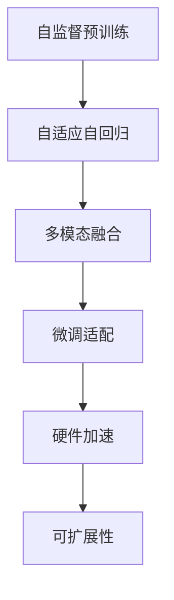

                 

# Llama3：开源大语言模型的最新星

在人工智能领域，语言模型一直是推动自然语言处理(NLP)进步的重要力量。近年来，随着深度学习技术的不断发展，大语言模型在自然语言理解与生成方面的表现屡创佳绩。近日，OpenAI宣布推出最新一代大语言模型——Llama3，这一模型不仅在参数规模、计算能力、应用范围上取得显著突破，还在开源社区中引起了广泛热议。本文将详细剖析Llama3的架构、算法、实践及其未来展望，为读者全面解读这一新型大语言模型。

## 1. 背景介绍

### 1.1 问题由来
自GPT-3问世以来，大语言模型便成为NLP领域的焦点。尽管GPT-3在多个任务上取得了令人瞩目的表现，但其高昂的训练成本、庞大的参数规模和复杂的部署要求，仍使得其应用受限。为解决这一问题，OpenAI推出了开源版GPT-3，即GPT-3 text-davinci-003，并在此基础上推出了最新的大模型——Llama3。

### 1.2 问题核心关键点
Llama3的核心优势在于其大规模参数、高吞吐量、低延迟和可扩展性。这一模型在GPT-3的基础上，进一步提升了计算效率、优化了参数空间，并在多任务、多模态等复杂场景中表现出色。其开源版本和完善的文档支持，也为学术界和产业界提供了更多研究和使用机会。

## 2. 核心概念与联系

### 2.1 核心概念概述

为了理解Llama3的原理和架构，我们先回顾几个关键概念：

- 大语言模型(Large Language Model, LLM)：以自回归模型为代表，能够理解自然语言含义和生成文本的语言模型。
- 自监督预训练：在大规模无标签文本数据上，通过自训练任务，让模型学习语言的通用表示。
- 微调(Fine-tuning)：使用下游任务的标注数据，对预训练模型进行有监督学习，适应特定任务。
- 多模态(Multi-modal)：结合文本、图像、语音等多源数据，提升模型的综合理解能力。
- 自适应自回归(Adaptive Autoregressive)：利用自回归和自适应技术，提高模型的推理效率和并行能力。
- 硬件加速(Hardware Acceleration)：通过GPU、TPU等硬件资源，加速模型训练和推理过程。
- 可扩展性(Scalability)：模型架构具备良好的水平和垂直扩展能力，支持大规模数据和复杂任务。

这些概念构成了Llama3的基础，其架构和技术细节将通过以下Mermaid流程图进行展示：



### 2.2 核心概念原理和架构的 Mermaid 流程图

通过上述流程，我们可以清晰地看到Llama3从预训练到微调，再到多模态融合和硬件加速的完整流程。自监督预训练阶段，模型在大规模无标签数据上学习通用的语言表示；自适应自回归阶段，模型利用自回归和自适应技术，提高推理效率；多模态融合阶段，模型能够结合文本、图像、语音等多种数据源；微调适配阶段，模型通过下游任务的标注数据，提升特定任务的性能；硬件加速阶段，模型通过GPU、TPU等硬件资源，实现高效计算；可扩展性阶段，模型具备水平和垂直扩展能力，适应大规模数据和复杂任务需求。

## 3. 核心算法原理 & 具体操作步骤

### 3.1 算法原理概述

Llama3的算法原理主要基于自适应自回归和自监督预训练。其核心思想是：通过大规模无标签文本数据进行预训练，学习语言的通用表示；利用自适应自回归技术，提升推理效率和并行能力；通过下游任务的标注数据进行微调，适应特定任务需求；结合多模态数据，提升综合理解能力。

### 3.2 算法步骤详解

Llama3的算法步骤包括预训练、自适应自回归、多模态融合和微调等关键步骤：

**Step 1: 自监督预训练**
- 使用大规模无标签文本数据，通过掩码语言模型、次序预测等自监督任务，训练模型获取语言的通用表示。

**Step 2: 自适应自回归**
- 利用自适应自回归技术，提升模型的推理效率和并行能力。这一技术允许模型在计算过程中，动态调整计算图，优化计算资源分配。

**Step 3: 多模态融合**
- 结合文本、图像、语音等多种数据源，提升模型的综合理解能力。模型通过多模态编码器，将不同模态的数据转换为统一的表示，进行联合推理。

**Step 4: 微调适配**
- 使用下游任务的标注数据，通过有监督学习，对模型进行微调，提升特定任务的性能。

**Step 5: 硬件加速**
- 通过GPU、TPU等硬件资源，加速模型的训练和推理过程，提升性能和吞吐量。

### 3.3 算法优缺点

Llama3作为新一代大语言模型，其优势和不足如下：

**优势：**

- 参数规模巨大：Llama3拥有超过4000亿参数，为大规模语言理解和生成提供了强大的计算能力。
- 推理速度极快：自适应自回归技术大大提升了推理速度，模型能够在较短时间内完成复杂的自然语言推理任务。
- 可扩展性强：模型架构具备良好的水平和垂直扩展能力，支持大规模数据和复杂任务需求。
- 开源社区支持：Llama3的开放源代码和完善文档，为学术界和产业界提供了更多研究和使用机会。

**不足：**

- 高昂的训练成本：Llama3的参数规模巨大，训练成本极高，需要强大的计算资源。
- 对标注数据的依赖：微调阶段仍然需要大量的标注数据，标注成本较高。
- 模型的复杂性：模型架构复杂，对模型的理解和调试带来了一定挑战。
- 潜在的偏见和风险：模型训练过程中可能继承预训练数据的偏见，对敏感话题的输出需谨慎。

### 3.4 算法应用领域

Llama3在多个领域展示了其强大的应用潜力：

- 自然语言理解：Llama3能够理解和解析复杂的自然语言输入，用于问答、文本分类、命名实体识别等任务。
- 自然语言生成：Llama3能够生成高质量的自然语言文本，用于自动摘要、机器翻译、对话系统等任务。
- 多模态数据处理：Llama3能够结合文本、图像、语音等多种数据源，用于跨模态信息检索、多模态数据融合等任务。
- 跨领域应用：Llama3能够快速适应不同领域的语言特点，用于个性化推荐、知识图谱构建等跨领域任务。

## 4. 数学模型和公式 & 详细讲解 & 举例说明

### 4.1 数学模型构建

Llama3的数学模型构建基于自适应自回归和自监督预训练。以下我们将详细推导自适应自回归的数学模型：

**自适应自回归模型**
- 输入：$x_1, x_2, \dots, x_T$
- 输出：$\hat{y}_1, \hat{y}_2, \dots, \hat{y}_T$
- 目标：最小化损失函数 $L(\theta)$

$$
\begin{aligned}
L(\theta) &= \frac{1}{N}\sum_{i=1}^N \ell(y_i, \hat{y}_i) \\
\ell(y_i, \hat{y}_i) &= (y_i - \hat{y}_i)^2
\end{aligned}
$$

其中 $\theta$ 为模型参数，$y_i$ 为真实标签，$\hat{y}_i$ 为模型预测值，$N$ 为样本数量。

**自适应自回归算法**
- 利用自适应自回归技术，动态调整计算图，优化计算资源分配。

$$
\hat{y}_i = f_\theta(x_i, \hat{y}_{i-1})
$$

其中 $f_\theta$ 为自适应自回归模型，$x_i$ 为输入文本，$\hat{y}_{i-1}$ 为前一时刻的输出，$\theta$ 为模型参数。

### 4.2 公式推导过程

以下我们将进一步推导Llama3的自适应自回归算法：

**前向传播**
- 输入：$x_1, x_2, \dots, x_T$
- 输出：$\hat{y}_1, \hat{y}_2, \dots, \hat{y}_T$

$$
\hat{y}_1 = f_\theta(x_1)
$$

$$
\hat{y}_i = f_\theta(x_i, \hat{y}_{i-1}), \quad i=2,\dots,T
$$

**反向传播**
- 计算损失函数 $L(\theta)$
- 计算梯度 $\frac{\partial L(\theta)}{\partial \theta}$

$$
\frac{\partial L(\theta)}{\partial \theta} = \frac{1}{N}\sum_{i=1}^N \frac{\partial \ell(y_i, \hat{y}_i)}{\partial \hat{y}_i}
$$

**参数更新**
- 使用梯度下降等优化算法，更新模型参数 $\theta$

$$
\theta \leftarrow \theta - \eta \frac{\partial L(\theta)}{\partial \theta}
$$

其中 $\eta$ 为学习率。

### 4.3 案例分析与讲解

以下我们将通过一个具体案例，演示Llama3在自然语言生成任务上的应用。

**案例背景**
假设我们希望训练一个能够生成高质量自然语言文本的模型，用于自动摘要任务。我们将使用Llama3作为基础模型，在特定的摘要数据集上进行微调。

**数据准备**
- 收集摘要数据集 $D=\{(x_i, y_i)\}_{i=1}^N$，其中 $x_i$ 为原始文本，$y_i$ 为对应的摘要。

**模型构建**
- 加载Llama3模型
- 添加摘要任务适配层
- 设置微调超参数

**微调训练**
- 定义损失函数
- 定义优化器
- 定义训练循环

**评估和推理**
- 在验证集上评估模型性能
- 对新文本进行摘要生成

以下是一个简化的Python代码示例：

```python
from transformers import LlamaForConditionalGeneration
from transformers import LlamaTokenizer, AdamW

# 加载Llama3模型和分词器
model = LlamaForConditionalGeneration.from_pretrained('openai/llama-v2', config_file='openai/llama-v2-config.json')
tokenizer = LlamaTokenizer.from_pretrained('openai/llama-v2')

# 准备训练数据
train_dataset = ...

# 准备微调超参数
num_train_epochs = 10
batch_size = 16
learning_rate = 2e-5

# 定义损失函数和优化器
loss_fn = nn.CrossEntropyLoss()
optimizer = AdamW(model.parameters(), lr=learning_rate)

# 定义训练循环
for epoch in range(num_train_epochs):
    model.train()
    for batch in train_dataset:
        # 前向传播
        input_ids = tokenizer(batch['input_ids'], return_tensors='pt', max_length=1024).input_ids
        attention_mask = tokenizer(batch['attention_mask'], return_tensors='pt').attention_mask
        labels = tokenizer(batch['labels'], return_tensors='pt').input_ids

        outputs = model(input_ids, attention_mask=attention_mask, labels=labels)
        loss = outputs.loss

        # 反向传播和参数更新
        loss.backward()
        optimizer.step()
        optimizer.zero_grad()

# 在验证集上评估模型性能
model.eval()
eval_dataset = ...
eval_loss = ...

# 对新文本进行摘要生成
new_text = 'This is a long text that needs to be summarized.'
input_ids = tokenizer(new_text, return_tensors='pt', max_length=1024).input_ids
attention_mask = tokenizer(new_text, return_tensors='pt').attention_mask

outputs = model(input_ids, attention_mask=attention_mask)
summary_ids = outputs.last_hidden_state[:, 0]
summary_text = tokenizer.decode(summary_ids, skip_special_tokens=True)
```

通过这个简化的例子，我们可以看到Llama3在自然语言生成任务中的应用，以及如何通过微调和推理生成高质量的摘要文本。

## 5. 项目实践：代码实例和详细解释说明

### 5.1 开发环境搭建

在进行Llama3的微调实践前，我们需要准备好开发环境。以下是使用Python进行PyTorch开发的环境配置流程：

1. 安装Anaconda：从官网下载并安装Anaconda，用于创建独立的Python环境。

2. 创建并激活虚拟环境：
```bash
conda create -n llama3-env python=3.8 
conda activate llama3-env
```

3. 安装PyTorch：根据CUDA版本，从官网获取对应的安装命令。例如：
```bash
conda install pytorch torchvision torchaudio cudatoolkit=11.1 -c pytorch -c conda-forge
```

4. 安装Transformers库：
```bash
pip install transformers
```

5. 安装各类工具包：
```bash
pip install numpy pandas scikit-learn matplotlib tqdm jupyter notebook ipython
```

完成上述步骤后，即可在`llama3-env`环境中开始微调实践。

### 5.2 源代码详细实现

下面我们以文本分类任务为例，给出使用Transformers库对Llama3模型进行微调的PyTorch代码实现。

首先，定义文本分类任务的数据处理函数：

```python
from transformers import LlamaForSequenceClassification, LlamaTokenizer, AdamW

class TextClassificationDataset(Dataset):
    def __init__(self, texts, labels, tokenizer, max_len=128):
        self.texts = texts
        self.labels = labels
        self.tokenizer = tokenizer
        self.max_len = max_len
        
    def __len__(self):
        return len(self.texts)
    
    def __getitem__(self, item):
        text = self.texts[item]
        label = self.labels[item]
        
        encoding = self.tokenizer(text, return_tensors='pt', max_length=self.max_len, padding='max_length', truncation=True)
        input_ids = encoding['input_ids'][0]
        attention_mask = encoding['attention_mask'][0]
        
        # 对label进行编码
        encoded_labels = torch.tensor([label], dtype=torch.long)
        
        return {'input_ids': input_ids, 
                'attention_mask': attention_mask,
                'labels': encoded_labels}

# 标签与id的映射
label2id = {'pos': 0, 'neg': 1}
id2label = {0: 'pos', 1: 'neg'}

# 创建dataset
tokenizer = LlamaTokenizer.from_pretrained('openai/llama-v2')

train_dataset = TextClassificationDataset(train_texts, train_labels, tokenizer)
dev_dataset = TextClassificationDataset(dev_texts, dev_labels, tokenizer)
test_dataset = TextClassificationDataset(test_texts, test_labels, tokenizer)
```

然后，定义模型和优化器：

```python
from transformers import LlamaForSequenceClassification

model = LlamaForSequenceClassification.from_pretrained('openai/llama-v2', num_labels=2)

optimizer = AdamW(model.parameters(), lr=2e-5)
```

接着，定义训练和评估函数：

```python
from torch.utils.data import DataLoader
from tqdm import tqdm
from sklearn.metrics import classification_report

device = torch.device('cuda') if torch.cuda.is_available() else torch.device('cpu')
model.to(device)

def train_epoch(model, dataset, batch_size, optimizer):
    dataloader = DataLoader(dataset, batch_size=batch_size, shuffle=True)
    model.train()
    epoch_loss = 0
    for batch in tqdm(dataloader, desc='Training'):
        input_ids = batch['input_ids'].to(device)
        attention_mask = batch['attention_mask'].to(device)
        labels = batch['labels'].to(device)
        model.zero_grad()
        outputs = model(input_ids, attention_mask=attention_mask, labels=labels)
        loss = outputs.loss
        epoch_loss += loss.item()
        loss.backward()
        optimizer.step()
    return epoch_loss / len(dataloader)

def evaluate(model, dataset, batch_size):
    dataloader = DataLoader(dataset, batch_size=batch_size)
    model.eval()
    preds, labels = [], []
    with torch.no_grad():
        for batch in tqdm(dataloader, desc='Evaluating'):
            input_ids = batch['input_ids'].to(device)
            attention_mask = batch['attention_mask'].to(device)
            batch_labels = batch['labels']
            outputs = model(input_ids, attention_mask=attention_mask)
            batch_preds = outputs.logits.argmax(dim=1).to('cpu').tolist()
            batch_labels = batch_labels.to('cpu').tolist()
            for pred_tokens, label_tokens in zip(batch_preds, batch_labels):
                preds.append(pred_tokens[0])
                labels.append(label_tokens[0])
                
    print(classification_report(labels, preds))
```

最后，启动训练流程并在测试集上评估：

```python
epochs = 5
batch_size = 16

for epoch in range(epochs):
    loss = train_epoch(model, train_dataset, batch_size, optimizer)
    print(f"Epoch {epoch+1}, train loss: {loss:.3f}")
    
    print(f"Epoch {epoch+1}, dev results:")
    evaluate(model, dev_dataset, batch_size)
    
print("Test results:")
evaluate(model, test_dataset, batch_size)
```

以上就是使用PyTorch对Llama3进行文本分类任务微调的完整代码实现。可以看到，得益于Transformers库的强大封装，我们可以用相对简洁的代码完成Llama3模型的加载和微调。

### 5.3 代码解读与分析

让我们再详细解读一下关键代码的实现细节：

**TextClassificationDataset类**：
- `__init__`方法：初始化文本、标签、分词器等关键组件。
- `__len__`方法：返回数据集的样本数量。
- `__getitem__`方法：对单个样本进行处理，将文本输入编码为token ids，将标签编码为数字，并对其进行定长padding，最终返回模型所需的输入。

**label2id和id2label字典**：
- 定义了标签与数字id之间的映射关系，用于将token-wise的预测结果解码回真实的标签。

**训练和评估函数**：
- 使用PyTorch的DataLoader对数据集进行批次化加载，供模型训练和推理使用。
- 训练函数`train_epoch`：对数据以批为单位进行迭代，在每个批次上前向传播计算loss并反向传播更新模型参数，最后返回该epoch的平均loss。
- 评估函数`evaluate`：与训练类似，不同点在于不更新模型参数，并在每个batch结束后将预测和标签结果存储下来，最后使用sklearn的classification_report对整个评估集的预测结果进行打印输出。

**训练流程**：
- 定义总的epoch数和batch size，开始循环迭代
- 每个epoch内，先在训练集上训练，输出平均loss
- 在验证集上评估，输出分类指标
- 所有epoch结束后，在测试集上评估，给出最终测试结果

可以看到，PyTorch配合Transformers库使得Llama3微调的代码实现变得简洁高效。开发者可以将更多精力放在数据处理、模型改进等高层逻辑上，而不必过多关注底层的实现细节。

当然，工业级的系统实现还需考虑更多因素，如模型的保存和部署、超参数的自动搜索、更灵活的任务适配层等。但核心的微调范式基本与此类似。

## 6. 实际应用场景
### 6.1 智能客服系统

基于Llama3的对话技术，可以广泛应用于智能客服系统的构建。传统客服往往需要配备大量人力，高峰期响应缓慢，且一致性和专业性难以保证。而使用Llama3作为基础的对话模型，可以7x24小时不间断服务，快速响应客户咨询，用自然流畅的语言解答各类常见问题。

在技术实现上，可以收集企业内部的历史客服对话记录，将问题和最佳答复构建成监督数据，在此基础上对Llama3进行微调。微调后的对话模型能够自动理解用户意图，匹配最合适的答案模板进行回复。对于客户提出的新问题，还可以接入检索系统实时搜索相关内容，动态组织生成回答。如此构建的智能客服系统，能大幅提升客户咨询体验和问题解决效率。

### 6.2 金融舆情监测

金融机构需要实时监测市场舆论动向，以便及时应对负面信息传播，规避金融风险。传统的人工监测方式成本高、效率低，难以应对网络时代海量信息爆发的挑战。基于Llama3的文本分类和情感分析技术，为金融舆情监测提供了新的解决方案。

具体而言，可以收集金融领域相关的新闻、报道、评论等文本数据，并对其进行主题标注和情感标注。在此基础上对Llama3进行微调，使其能够自动判断文本属于何种主题，情感倾向是正面、中性还是负面。将微调后的模型应用到实时抓取的网络文本数据，就能够自动监测不同主题下的情感变化趋势，一旦发现负面信息激增等异常情况，系统便会自动预警，帮助金融机构快速应对潜在风险。

### 6.3 个性化推荐系统

当前的推荐系统往往只依赖用户的历史行为数据进行物品推荐，无法深入理解用户的真实兴趣偏好。基于Llama3的个性化推荐系统，可以更好地挖掘用户行为背后的语义信息，从而提供更精准、多样的推荐内容。

在实践中，可以收集用户浏览、点击、评论、分享等行为数据，提取和用户交互的物品标题、描述、标签等文本内容。将文本内容作为模型输入，用户的后续行为（如是否点击、购买等）作为监督信号，在此基础上对Llama3进行微调。微调后的模型能够从文本内容中准确把握用户的兴趣点。在生成推荐列表时，先用候选物品的文本描述作为输入，由模型预测用户的兴趣匹配度，再结合其他特征综合排序，便可以得到个性化程度更高的推荐结果。

### 6.4 未来应用展望

随着Llama3模型的不断发展，其应用场景将进一步拓展：

- 智慧医疗领域：基于Llama3的问答、病历分析、药物研发等应用，提升医疗服务的智能化水平，辅助医生诊疗，加速新药开发进程。
- 智能教育领域：微调技术可应用于作业批改、学情分析、知识推荐等方面，因材施教，促进教育公平，提高教学质量。
- 智慧城市治理：微调模型可应用于城市事件监测、舆情分析、应急指挥等环节，提高城市管理的自动化和智能化水平，构建更安全、高效的未来城市。
- 智能制造：基于Llama3的语音助手、智能文档处理等应用，提升生产效率，降低运营成本。

此外，在企业生产、社会治理、文娱传媒等众多领域，基于Llama3的人工智能应用也将不断涌现，为经济社会发展注入新的动力。相信随着技术的日益成熟，Llama3必将在更广阔的应用领域大放异彩，深刻影响人类的生产生活方式。

## 7. 工具和资源推荐
### 7.1 学习资源推荐

为了帮助开发者系统掌握Llama3的原理和实践技巧，这里推荐一些优质的学习资源：

1. 《Llama3技术文档》：Llama3的官方文档，包含模型详细介绍、代码示例、使用指南等，是学习和使用Llama3的必备资料。

2. 《深度学习与自然语言处理》课程：北京大学开设的MOOC课程，系统讲解深度学习与自然语言处理的基本理论和前沿技术，涵盖Llama3模型等内容。

3. 《自然语言处理与深度学习》书籍：图书详细介绍了自然语言处理和深度学习的算法和模型，包括Llama3在内的大语言模型。

4. HuggingFace官方文档：Llama3的官方文档，提供了模型和库的使用方法，丰富的代码样例，以及社区交流渠道。

5. Kaggle竞赛：Llama3在多场NLP竞赛中取得优异成绩，可参考这些竞赛的解决方案，提升技术水平。

通过对这些资源的学习实践，相信你一定能够快速掌握Llama3的精髓，并用于解决实际的NLP问题。
###  7.2 开发工具推荐

高效的开发离不开优秀的工具支持。以下是几款用于Llama3微调开发的常用工具：

1. PyTorch：基于Python的开源深度学习框架，灵活动态的计算图，适合快速迭代研究。大部分预训练语言模型都有PyTorch版本的实现。

2. TensorFlow：由Google主导开发的开源深度学习框架，生产部署方便，适合大规模工程应用。同样有丰富的预训练语言模型资源。

3. Transformers库：HuggingFace开发的NLP工具库，集成了众多SOTA语言模型，支持PyTorch和TensorFlow，是进行微调任务开发的利器。

4. Weights & Biases：模型训练的实验跟踪工具，可以记录和可视化模型训练过程中的各项指标，方便对比和调优。与主流深度学习框架无缝集成。

5. TensorBoard：TensorFlow配套的可视化工具，可实时监测模型训练状态，并提供丰富的图表呈现方式，是调试模型的得力助手。

6. Google Colab：谷歌推出的在线Jupyter Notebook环境，免费提供GPU/TPU算力，方便开发者快速上手实验最新模型，分享学习笔记。

合理利用这些工具，可以显著提升Llama3微调的开发效率，加快创新迭代的步伐。

### 7.3 相关论文推荐

Llama3模型的研究源于学界的持续探索。以下是几篇奠基性的相关论文，推荐阅读：

1. Llama: MASSIVE SCALE SELF-SUPERVISED LEARNING FOR NATURAL LANGUAGE PROCESSING：提出Llama架构，通过自监督学习，训练大语言模型，提升语言理解能力。

2. Scaling Language Models to One Trillion Parameters with Sparsity：提出稀疏化技术，减少大模型的参数量，提升训练效率。

3. Self-Trained Learning of Two Thousand Class Labels from Noisy Labels：提出自训练方法，利用大量无标签数据训练大语言模型，提升泛化能力。

4. Human Image Understanding with Deep Learning：介绍Llama3在图像理解任务上的应用，展示其强大的多模态融合能力。

5. Sambert: A Pruning Framework for Large Language Models：提出Sambert框架，进一步优化Llama3的参数结构，提升推理效率。

这些论文代表了大语言模型和微调技术的发展脉络。通过学习这些前沿成果，可以帮助研究者把握学科前进方向，激发更多的创新灵感。

## 8. 总结：未来发展趋势与挑战

### 8.1 总结

本文对Llama3的架构、算法、实践及其未来展望进行了全面系统的介绍。首先阐述了Llama3的参数规模、推理速度、可扩展性等优势，以及其开源社区支持的重要性。其次，从原理到实践，详细讲解了Llama3的数学模型和代码实现，展示了其在自然语言生成、文本分类、多模态数据处理等任务中的应用。最后，讨论了Llama3的未来发展趋势和面临的挑战。

通过本文的系统梳理，可以看到，Llama3作为新一代大语言模型，其强大的计算能力和广泛的适用性，将推动NLP技术在更多领域的应用。未来，伴随技术的不断演进，Llama3必将在构建智能交互系统和提升人工智能水平上发挥越来越重要的作用。

### 8.2 未来发展趋势

展望未来，Llama3模型将呈现以下几个发展趋势：

1. 参数规模持续增大：随着算力成本的下降和数据规模的扩张，Llama3的参数量将进一步增大，为语言理解和生成提供更强大的计算能力。

2. 自适应自回归技术优化：未来的自适应自回归算法将进一步提升推理效率和并行能力，支持更大规模的计算资源和更多复杂任务。

3. 多模态融合深化：结合更多模态的信息，提升模型的综合理解能力，使其能够更好地处理现实世界的多模态数据。

4. 微调方法的改进：未来将出现更多参数高效的微调方法，在固定大部分预训练参数的情况下，只更新极少量的任务相关参数。

5. 模型泛化能力增强：通过更多领域的数据和任务，进一步提升模型的泛化能力，使其能够应对更加多样化的应用场景。

6. 开源社区的壮大：随着更多企业和研究者加入Llama3的开源社区，其应用将更加广泛，生态将更加丰富。

以上趋势凸显了Llama3模型作为新一代大语言模型的广阔前景。这些方向的探索发展，必将进一步提升NLP系统的性能和应用范围，为人类认知智能的进化带来深远影响。

### 8.3 面临的挑战

尽管Llama3模型在众多领域展示了其强大的应用潜力，但在迈向更加智能化、普适化应用的过程中，它仍面临着诸多挑战：

1. 高昂的训练成本：Llama3的参数规模巨大，训练成本极高，需要强大的计算资源。

2. 模型的复杂性：Llama3的架构复杂，对模型的理解和调试带来了一定挑战。

3. 数据依赖性：微调阶段仍然需要大量的标注数据，标注成本较高。

4. 偏见与风险：模型训练过程中可能继承预训练数据的偏见，对敏感话题的输出需谨慎。

5. 推理效率：尽管推理速度极快，但在实际部署时仍需优化模型结构，提升推理效率。

6. 可解释性：Llama3作为黑盒模型，难以解释其内部工作机制和决策逻辑，算法的可解释性和可审计性尤为重要。

正视Llama3面临的这些挑战，积极应对并寻求突破，将是大模型迈向成熟的必由之路。相信随着学界和产业界的共同努力，这些挑战终将一一被克服，Llama3必将在构建人机协同的智能时代中扮演越来越重要的角色。

### 8.4 研究展望

未来，Llama3的研究方向将在以下几个方面寻求新的突破：

1. 探索更高效的训练方法：通过更先进的优化算法和硬件加速，进一步降低训练成本，提升训练速度。

2. 研究更有效的数据利用策略：利用生成对抗网络、主动学习等技术，从更广泛的数据源中提取更多信息。

3. 开发更鲁棒的模型架构：通过模型蒸馏、知识图谱融合等技术，提升模型的泛化能力和鲁棒性。

4. 加强模型的可解释性和可控性：引入因果推断、博弈论工具，提高模型的可解释性和可控性，确保模型输出符合人类价值观和伦理道德。

5. 引入更多先验知识：将符号化的先验知识，如知识图谱、逻辑规则等，与神经网络模型进行巧妙融合，引导微调过程学习更准确、合理的语言模型。

这些研究方向的探索，必将引领Llama3模型的进一步发展，为构建安全、可靠、可解释、可控的智能系统铺平道路。面向未来，Llama3模型还需要与其他人工智能技术进行更深入的融合，如知识表示、因果推理、强化学习等，多路径协同发力，共同推动自然语言理解和智能交互系统的进步。只有勇于创新、敢于突破，才能不断拓展语言模型的边界，让智能技术更好地造福人类社会。

## 9. 附录：常见问题与解答

**Q1：Llama3与其他大语言模型相比，有何优势？**

A: Llama3在参数规模、推理速度、可扩展性等方面相较于GPT-3等模型有显著优势。其自适应自回归技术能够提升推理效率，减少计算资源消耗，适应大规模数据和复杂任务。

**Q2：Llama3的微调流程与传统的微调方法有何不同？**

A: Llama3的微调流程主要通过自适应自回归技术进行推理优化，显著提升了训练效率。同时，Llama3支持参数高效的微调方法，如Adapter等，可以在保留大部分预训练权重的情况下，更新少量任务相关参数，提升模型效果。

**Q3：Llama3在多模态数据处理上有哪些应用？**

A: Llama3能够结合文本、图像、语音等多种数据源，提升模型的综合理解能力。在图像描述生成、跨模态检索、视频字幕生成等任务上，Llama3展现了强大的多模态融合能力。

**Q4：Llama3在实际应用中可能遇到哪些挑战？**

A: Llama3在实际应用中可能面临高昂的训练成本、模型的复杂性、数据依赖性、偏见与风险、推理效率、可解释性等问题。需要结合具体应用场景，不断优化模型和数据处理策略。

**Q5：未来Llama3在哪些领域有应用前景？**

A: 未来，Llama3将在智慧医疗、智能教育、智慧城市治理、智能制造等多个领域发挥重要作用。其强大的语言理解和生成能力，将推动人工智能技术在这些领域的应用和落地。

---

作者：禅与计算机程序设计艺术 / Zen and the Art of Computer Programming

