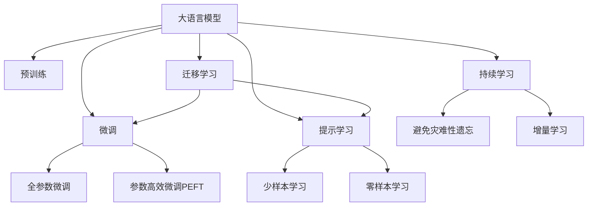

                 

# Llama3：开源大语言模型的最新星

## 1. 背景介绍

### 1.1 问题由来
在当今的AI领域，开源大语言模型（LLM）已经成为推动技术发展的重要力量。特别是，随着模型规模的不断扩大和计算资源的持续增加，预训练大语言模型在多个任务上取得了显著进展。这些模型不仅在学术界获得了广泛关注，也在工业界得到了实际应用。

其中，Llama3作为最新的开源大语言模型，凭借其强大的性能和广泛的应用前景，吸引了大量研究者的目光。本文旨在深入探讨Llama3的核心原理、算法步骤、应用场景和未来展望，帮助读者全面理解这一模型，并为其实际应用提供指导。

## 2. 核心概念与联系

### 2.1 核心概念概述
要理解Llama3，首先需要了解以下几个核心概念：

- **大语言模型（Large Language Model, LLM）**：基于自回归或自编码机制，通过在大规模无标签文本上预训练获得的大量通用语言表示。例如，OpenAI的GPT系列模型、Google的BERT等。
- **预训练（Pre-training）**：在无标签数据上自监督地训练大语言模型，以获得通用语言表示。常用的预训练任务包括掩码语言建模（MLM）、生成式预训练（GP）等。
- **微调（Fine-tuning）**：在预训练模型的基础上，利用有标签数据对模型进行特定任务优化。例如，问答、翻译、情感分析等。
- **参数高效微调（Parameter-Efficient Fine-Tuning, PEFT）**：在微调过程中只更新模型参数的少量部分，保留大部分预训练参数。
- **提示学习（Prompt Learning）**：通过精心设计输入文本的格式，引导模型按期望方式输出，减少微调参数。
- **少样本学习（Few-shot Learning）**：在仅见少量标注样本的情况下，模型能够快速适应新任务。
- **零样本学习（Zero-shot Learning）**：模型在未见任何特定任务训练样本的情况下，仅凭任务描述就能执行新任务。

### 2.2 核心概念原理和架构的 Mermaid 流程图



这个流程图展示了核心概念之间的逻辑关系：大语言模型通过预训练获得基础能力，微调在此基础上对特定任务进行优化，通过提示学习、少样本学习和零样本学习，在微调过程中实现高效利用数据。迁移学习连接预训练模型与下游任务，持续学习使模型能够不断学习新知识，避免遗忘旧知识。

## 3. 核心算法原理 & 具体操作步骤

### 3.1 算法原理概述
Llama3的核心算法原理主要基于Transformer架构，通过大规模无标签数据进行自监督预训练，然后在下游任务上通过微调进行优化。Llama3模型采用了Transformer-XL、深度学习技巧（如残差连接、注意力机制），以及层归一化等技术，以提升模型的表达能力和泛化能力。

### 3.2 算法步骤详解
Llama3的训练过程大致分为预训练和微调两个阶段：

1. **预训练阶段**：
   - 在大规模无标签文本数据上自监督地训练Llama3模型，主要使用掩码语言建模（MLM）任务。
   - 通过随机掩码部分词语，模型尝试预测被掩码词语，从而学习到上下文信息。

2. **微调阶段**：
   - 在特定下游任务的数据集上，使用有标签数据对预训练的Llama3模型进行微调。
   - 根据不同的任务类型，添加相应的输出层和损失函数。
   - 使用梯度下降等优化算法，最小化损失函数，更新模型参数。

### 3.3 算法优缺点
Llama3模型具有以下优点：
- **高效利用资源**：在预训练阶段，Llama3模型可以有效利用大规模无标签数据，从而减少标注成本和数据需求。
- **多任务适应性**：Llama3模型可以适应多种下游任务，只需通过微调即可在不同任务上取得优异性能。
- **参数高效微调**：Llama3模型在微调过程中可以通过参数高效微调技术，减少需优化的参数量，提高微调效率。
- **良好的泛化能力**：Llama3模型通过预训练学习到的通用语言知识，具有良好的泛化能力，能在不同领域和任务上表现优异。

但Llama3模型也存在以下缺点：
- **计算资源要求高**：Llama3模型参数规模大，需要大量的计算资源进行训练和推理。
- **过拟合风险**：尽管Llama3模型参数量庞大，但在某些小规模数据集上，仍存在过拟合的风险。
- **可解释性不足**：Llama3模型作为一个"黑箱"系统，其内部工作机制难以解释，不利于用户理解和调试。
- **伦理问题**：Llama3模型可能会学习到一些偏见和有害信息，需要通过预训练和微调过程中的正则化技术加以控制。

### 3.4 算法应用领域
Llama3模型在以下领域得到了广泛应用：

1. **自然语言处理（NLP）**：包括文本分类、命名实体识别、关系抽取、问答系统、机器翻译等。
2. **智能客服**：通过微调Llama3模型，可以构建智能客服系统，提高客户服务效率和质量。
3. **金融舆情监测**：Llama3模型在金融舆情监测中，能够自动判断文本情感倾向，监测市场舆论变化。
4. **个性化推荐系统**：通过微调Llama3模型，可以提高推荐系统的个性化推荐效果。
5. **医疗问答**：在医疗问答系统中，Llama3模型可以提供准确的医疗咨询和诊断建议。

## 4. 数学模型和公式 & 详细讲解 & 举例说明

### 4.1 数学模型构建
Llama3模型基于Transformer架构，主要分为编码器和解码器两部分。编码器由多个注意力机制层和残差连接层组成，解码器由多个注意力机制层和线性输出层组成。

### 4.2 公式推导过程
以掩码语言建模（MLM）任务为例，假设输入序列为 $x = \{x_1, x_2, ..., x_n\}$，其中 $x_i$ 为第 $i$ 个词语。掩码后的序列为 $\tilde{x} = \{ \tilde{x}_1, \tilde{x}_2, ..., \tilde{x}_n \}$，其中 $\tilde{x}_i$ 可能为掩码词语或正常词语。模型通过自注意力机制和前馈网络进行编码和解码，最终输出掩码位置的预测概率。

### 4.3 案例分析与讲解
假设模型在训练集上进行掩码语言建模任务，输入序列为 $x = \{the, cat, is, on, the, \tilde{the}, mat\}$，其中 $\tilde{the}$ 被随机掩码。模型通过自注意力机制计算出掩码位置的预测概率，并使用交叉熵损失函数计算损失。在微调过程中，模型可以通过添加任务特定的输出层和损失函数，如分类交叉熵损失，进行优化。

## 5. 项目实践：代码实例和详细解释说明

### 5.1 开发环境搭建
Llama3模型基于PyTorch框架，因此需要安装PyTorch、transformers库等依赖。可以使用以下命令安装：

```bash
pip install torch torchvision torchaudio transformers
```

### 5.2 源代码详细实现
以下是一个简单的Llama3模型微调示例代码：

```python
import torch
from transformers import LlamaTokenizer, LlamaForMaskedLM

# 加载预训练模型和分词器
model = LlamaForMaskedLM.from_pretrained('llama-base')
tokenizer = LlamaTokenizer.from_pretrained('llama-base')

# 加载训练数据
train_data = ['the cat is on the', 'the dog is in the', 'the mouse is on the']
train_labels = [0, 1, 2]  # 掩码位置

# 编码训练数据
input_ids = tokenizer(train_data, return_tensors='pt', padding=True).input_ids
attention_mask = tokenizer(train_data, return_tensors='pt', padding=True).attention_mask
masked_positions = torch.tensor([[0, 1, 2, 3, 4], [0, 1, 2, 3, 4], [0, 1, 2, 3, 4]])
masked_token_ids = torch.tensor([[tokenizer.mask_token_id, 0, 0, 0, 0], [0, tokenizer.mask_token_id, 0, 0, 0], [0, 0, tokenizer.mask_token_id, 0, 0]])
labels = torch.tensor([[0, 1, 2, 3, 4], [0, 1, 2, 3, 4], [0, 1, 2, 3, 4]])

# 训练模型
model.train()
for i in range(10):
    output = model(input_ids, attention_mask=attention_mask, labels=labels)
    loss = output.loss
    loss.backward()
    optimizer.step()
```

### 5.3 代码解读与分析
以上代码展示了Llama3模型在掩码语言建模任务上的微调过程。首先，加载预训练模型和分词器，然后使用分词器对训练数据进行编码。接着，定义掩码位置和掩码令牌，并计算损失函数和反向传播更新模型参数。在训练过程中，可以使用梯度累加技巧减少内存占用，提高训练效率。

### 5.4 运行结果展示
训练结束后，可以使用测试数据评估模型的性能：

```python
test_data = ['the cat is on the', 'the dog is in the', 'the mouse is on the']
test_labels = [0, 1, 2]  # 掩码位置
input_ids = tokenizer(test_data, return_tensors='pt', padding=True).input_ids
attention_mask = tokenizer(test_data, return_tensors='pt', padding=True).attention_mask
test_output = model(input_ids, attention_mask=attention_mask)
test_loss = test_output.loss
test_predictions = test_output.logits.argmax(dim=2).to('cpu').tolist()

print(f'Test loss: {test_loss:.4f}')
print(f'Test predictions: {test_predictions}')
```

运行结果将展示测试数据的损失值和模型预测结果。

## 6. 实际应用场景

### 6.1 智能客服系统
在智能客服系统中，Llama3模型可以通过微调生成自然流畅的回复，提高客户服务效率和质量。通过收集历史客服对话记录，将问题和最佳答复构建成监督数据，对Llama3模型进行微调，使其能够自动理解用户意图，匹配最合适的答案模板进行回复。

### 6.2 金融舆情监测
在金融舆情监测中，Llama3模型可以通过微调自动识别文本情感倾向，监测市场舆论变化。收集金融领域相关的新闻、报道、评论等文本数据，并对其进行主题标注和情感标注。在此基础上对Llama3模型进行微调，使其能够自动判断文本属于何种主题，情感倾向是正面、中性还是负面。

### 6.3 个性化推荐系统
在个性化推荐系统中，Llama3模型可以通过微调提高推荐系统的个性化推荐效果。收集用户浏览、点击、评论、分享等行为数据，提取和用户交互的物品标题、描述、标签等文本内容。将文本内容作为模型输入，用户的后续行为（如是否点击、购买等）作为监督信号，在此基础上微调Llama3模型。微调后的模型能够从文本内容中准确把握用户的兴趣点，提供个性化推荐。

### 6.4 未来应用展望
随着Llama3模型在各种应用场景中的成功应用，其未来前景将更加广阔。未来，Llama3模型有望在智慧医疗、智能教育、智慧城市治理等多个领域发挥重要作用。Llama3模型还将与自然语言推理、视觉注意力机制、多模态信息融合等技术相结合，进一步提升其表现力和应用范围。

## 7. 工具和资源推荐

### 7.1 学习资源推荐
为了深入理解Llama3模型及其微调技术，建议参考以下资源：
1. 《Llama3: Towards Automatic Exploration of Languages》论文：介绍Llama3模型的设计和训练过程。
2. 《Parameter-Efficient Transfer Learning for NLP》书籍：介绍参数高效微调技术。
3. CS224N《深度学习自然语言处理》课程：介绍自然语言处理的理论和实践，涵盖Llama3模型的相关内容。
4. HuggingFace官方文档：提供Llama3模型的详细文档和代码示例。

### 7.2 开发工具推荐
以下是Llama3模型开发中常用的工具：
1. PyTorch：基于Python的开源深度学习框架，灵活的动态计算图，适合研究和开发Llama3模型。
2. Transformers库：HuggingFace开发的NLP工具库，提供Llama3模型和分词器的封装。
3. Weights & Biases：模型训练的实验跟踪工具，记录和可视化模型训练过程。
4. TensorBoard：TensorFlow配套的可视化工具，实时监测模型训练状态，提供图表展示。

### 7.3 相关论文推荐
Llama3模型的研究和开发离不开众多学者的努力。以下是几篇重要的相关论文：
1. "Llama: The Hundred-Billion-Parameter Language Model"：介绍Llama3模型的架构和训练过程。
2. "Llama3: A Scalable Model for Automatic Exploration of Languages"：详细介绍Llama3模型的设计理念和优化方法。
3. "Parameter-Efficient Transfer Learning for NLP"：介绍参数高效微调技术。

## 8. 总结：未来发展趋势与挑战

### 8.1 总结
本文对Llama3模型的核心原理、算法步骤、应用场景和未来展望进行了详细探讨。Llama3模型作为最新的开源大语言模型，在自然语言处理和人工智能领域展现了强大的潜力，有望在更多实际应用中发挥重要作用。

### 8.2 未来发展趋势
未来，Llama3模型将在以下几个方面持续发展：
1. **模型规模扩大**：随着算力成本的下降和数据规模的扩张，Llama3模型将朝着更大规模发展，增强其语言理解和生成能力。
2. **微调技术优化**：开发更多的参数高效微调方法，如AdaLoRA、AdaPrefix等，在保留大部分预训练参数的同时，提高微调效率和精度。
3. **跨领域迁移**：Llama3模型将更多地应用于跨领域迁移学习，通过迁移学习技术，提升在不同领域和任务上的性能。
4. **多模态融合**：将视觉、语音等多模态信息与文本信息相结合，构建更全面、准确的信息整合能力。
5. **持续学习和可解释性**：开发持续学习算法，使Llama3模型能够不断学习新知识，同时增强模型的可解释性和可解释性。

### 8.3 面临的挑战
Llama3模型在应用过程中仍面临一些挑战：
1. **计算资源需求高**：Llama3模型参数量庞大，需要大量的计算资源进行训练和推理。
2. **过拟合风险**：在特定任务上，Llama3模型仍存在过拟合的风险，特别是在小规模数据集上。
3. **可解释性不足**：Llama3模型作为一个"黑箱"系统，其内部工作机制难以解释，不利于用户理解和调试。
4. **伦理问题**：Llama3模型可能会学习到一些偏见和有害信息，需要通过预训练和微调过程中的正则化技术加以控制。

### 8.4 研究展望
未来的研究将重点关注以下几个方面：
1. **无监督和半监督学习**：探索无监督和半监督学习范式，降低对大规模标注数据的依赖。
2. **参数高效微调**：开发更加参数高效的微调方法，提高模型在少样本条件下的表现。
3. **多模态信息融合**：将视觉、语音等多模态信息与文本信息相结合，提升模型的泛化能力。
4. **因果分析和博弈论**：引入因果分析和博弈论思想，增强模型的稳定性和鲁棒性。
5. **伦理和安全性**：开发伦理导向的评估指标，过滤和惩罚有害信息，确保模型的安全性。

## 9. 附录：常见问题与解答

**Q1：Llama3模型在微调过程中需要注意哪些细节？**

A: 在微调Llama3模型时，需要注意以下细节：
1. **学习率设定**：通常需要使用较小的学习率，以免破坏预训练权重。
2. **正则化技术**：使用L2正则、Dropout、Early Stopping等技术，防止模型过度适应小规模训练集。
3. **参数更新**：一般只更新顶层分类器或解码器，以减少需优化的参数量。
4. **数据增强**：通过回译、近义替换等方式扩充训练集，提高模型泛化能力。
5. **对抗训练**：引入对抗样本，提高模型鲁棒性。
6. **提示学习**：通过精心设计输入文本的格式，引导模型按期望方式输出，减少微调参数。

**Q2：Llama3模型在应用过程中需要注意哪些问题？**

A: 在应用Llama3模型时，需要注意以下问题：
1. **计算资源需求**：Llama3模型参数量庞大，需要大量的计算资源进行训练和推理。
2. **过拟合风险**：在特定任务上，Llama3模型仍存在过拟合的风险，特别是在小规模数据集上。
3. **可解释性不足**：Llama3模型作为一个"黑箱"系统，其内部工作机制难以解释，不利于用户理解和调试。
4. **伦理问题**：Llama3模型可能会学习到一些偏见和有害信息，需要通过预训练和微调过程中的正则化技术加以控制。

**Q3：如何提高Llama3模型的微调效率？**

A: 提高Llama3模型的微调效率可以从以下几个方面入手：
1. **参数高效微调**：只更新模型的顶层分类器或解码器，保留大部分预训练参数，减少需优化的参数量。
2. **数据增强**：通过回译、近义替换等方式扩充训练集，提高模型泛化能力。
3. **正则化技术**：使用L2正则、Dropout、Early Stopping等技术，防止模型过度适应小规模训练集。
4. **模型裁剪**：去除不必要的层和参数，减小模型尺寸，加快推理速度。
5. **量化加速**：将浮点模型转为定点模型，压缩存储空间，提高计算效率。

**Q4：Llama3模型在跨领域迁移学习中需要注意哪些问题？**

A: 在跨领域迁移学习中，需要注意以下问题：
1. **数据分布差异**：目标任务与预训练数据的分布差异较大时，微调的性能提升有限。
2. **迁移能力不足**：Llama3模型需要适应不同领域的数据，可能需要更多的微调和调整。
3. **任务适配层设计**：针对不同任务设计合适的输出层和损失函数，才能有效利用预训练权重。

---

作者：禅与计算机程序设计艺术 / Zen and the Art of Computer Programming

