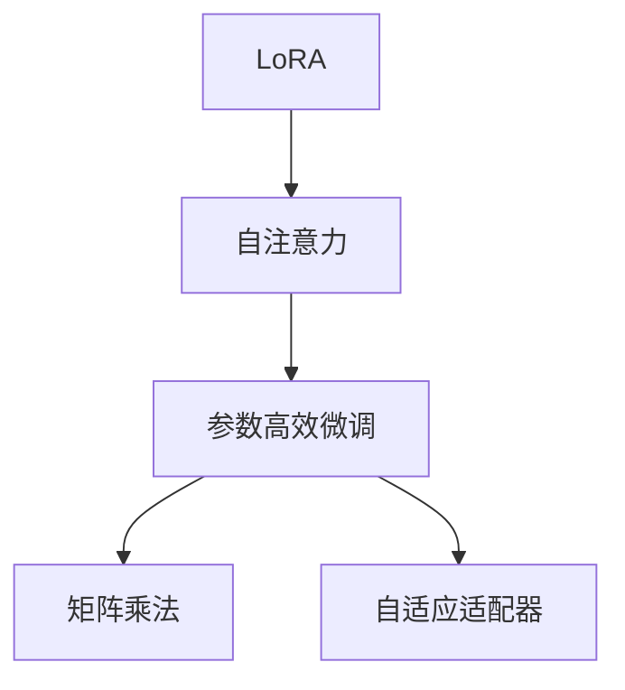

                 

# LoRA：低秩自注意力适配器

> 关键词：LoRA, 自注意力, 参数高效微调, 矩阵乘法, 自适应适配器, 模型压缩, 自然语言处理(NLP)

## 1. 背景介绍

### 1.1 问题由来
在深度学习领域，尤其是自然语言处理(NLP)和计算机视觉(CV)等任务中，预训练大模型如BERT、GPT等已经取得了令人瞩目的成果。这些模型通过在海量无标签数据上自监督预训练，获得了强大的语言理解和生成能力。然而，由于其参数量巨大，对计算资源的要求极高，难以在特定领域或小型设备上高效部署。

参数高效微调(Parameter-Efficient Fine-Tuning, PEFT)方法逐渐受到关注，该方法在保持模型性能的同时，大幅减少了微调所需的时间和资源。LoRA (Low-Rank Adapter)是其中一种非常优秀的参数高效微调方法，通过引入自适应适配器，将大规模预训练模型转化为结构紧凑的轻量级模型，极大地提升了微调的效率和灵活性。

### 1.2 问题核心关键点
LoRA的核心思想是利用矩阵分解将大模型的自注意力机制分解为低秩矩阵，然后通过低秩矩阵与预训练模型的部分层进行线性组合，实现参数高效微调。这种方法不仅保持了大模型的通用表示能力，还使得微调模型可以在特定领域内高效部署，具有重要的理论和应用价值。

LoRA通过引入自适应适配器，将大模型的自注意力机制转换为低秩矩阵，从而在保持大模型性能的同时，显著降低了微调模型的计算和存储成本。这一方法在微调过程中的高效性和灵活性，使其成为目前参数高效微调方法中最受关注和广泛应用的一种。

## 2. 核心概念与联系

### 2.1 核心概念概述

为更好地理解LoRA模型，本节将介绍几个关键概念：

- LoRA: 低秩自适应适配器(Low-Rank Adaptation)。一种参数高效微调方法，通过将自注意力矩阵分解为低秩矩阵，实现高效微调。
- 自注意力(Self-Attention)：深度学习模型中用于处理序列数据的一种机制，通过计算输入序列中每个位置的相似度，自适应地计算出每个位置的输出。
- 参数高效微调(Parameter-Efficient Fine-Tuning, PEFT)：在微调过程中，只更新部分模型参数，而固定大部分预训练权重不变，以提高微调效率，避免过拟合的方法。
- 矩阵乘法(Matrix Multiplication)：深度学习中常用的一种运算，用于计算输入向量间的相似度或生成新的向量。
- 自适应适配器(Adaptation)：在微调过程中引入的一个新层，用于将输入序列映射到低秩空间，从而实现高效微调。

这些核心概念之间的逻辑关系可以通过以下Mermaid流程图来展示：



这个流程图展示了LoRA模型的核心概念及其之间的关系：

1. LoRA模型通过将自注意力矩阵分解为低秩矩阵，实现高效微调。
2. 参数高效微调通过只更新部分模型参数，提高微调效率。
3. 矩阵乘法用于计算输入向量间的相似度或生成新的向量。
4. 自适应适配器在微调过程中引入，用于将输入序列映射到低秩空间。

这些概念共同构成了LoRA模型的学习和应用框架，使其能够在各种场景下发挥强大的语言理解和生成能力。通过理解这些核心概念，我们可以更好地把握LoRA模型的工作原理和优化方向。

## 3. 核心算法原理 & 具体操作步骤
### 3.1 算法原理概述

LoRA模型的核心思想是将自注意力矩阵分解为低秩矩阵，从而实现参数高效微调。形式化地，假设原始的预训练模型为 $M_{\theta}$，其中 $\theta$ 为预训练得到的模型参数。给定微调任务 $T$ 的标注数据集 $D=\{(x_i, y_i)\}_{i=1}^N$，LoRA微调的目标是找到新的模型参数 $\hat{\theta}$，使得：

$$
\hat{\theta}=\mathop{\arg\min}_{\theta} \mathcal{L}(M_{\theta},D)
$$

其中 $\mathcal{L}$ 为针对任务 $T$ 设计的损失函数，用于衡量模型预测输出与真实标签之间的差异。

LoRA将原始的 $M_{\theta}$ 的自注意力机制 $A \in \mathbb{R}^{d\times d}$ 分解为低秩矩阵 $A_{L,R} \in \mathbb{R}^{d\times d'}$，其中 $d'$ 为小于 $d$ 的矩阵秩。分解后的自注意力机制为：

$$
A_{L,R} = U_L V_R^T
$$

其中 $U_L$ 和 $V_R$ 为低秩矩阵，分别通过矩阵分解 $\theta_L$ 和 $\theta_R$ 得到，即：

$$
U_L = \theta_L[0:d', 0:d'], \quad V_R = \theta_R[0:d', d' : 2d']^T
$$

$$
\theta_L = \text{LowRankAdaptation}(\theta_L), \quad \theta_R = \text{LowRankAdaptation}(\theta_R)
$$

其中 $\text{LowRankAdaptation}$ 函数表示对矩阵进行低秩分解。

### 3.2 算法步骤详解

LoRA微调的一般步骤包括：

**Step 1: 准备预训练模型和数据集**
- 选择合适的预训练模型 $M_{\theta}$ 作为初始化参数，如 BERT、GPT 等。
- 准备微调任务 $T$ 的标注数据集 $D$，划分为训练集、验证集和测试集。一般要求标注数据与预训练数据的分布不要差异过大。

**Step 2: 添加自适应适配器**
- 在预训练模型的顶层添加一个自适应适配器，通常为一个全连接层，用于将输入序列映射到低秩空间。
- 适配器的参数 $\theta_L$ 和 $\theta_R$ 初始化为随机向量，随后在微调过程中更新。

**Step 3: 设置微调超参数**
- 选择合适的优化算法及其参数，如 AdamW、SGD 等，设置学习率、批大小、迭代轮数等。
- 设置正则化技术及强度，包括权重衰减、Dropout、Early Stopping等。
- 确定冻结预训练参数的策略，如仅微调顶层，或全部参数都参与微调。

**Step 4: 执行梯度训练**
- 将训练集数据分批次输入模型，前向传播计算损失函数。
- 反向传播计算参数梯度，根据设定的优化算法和学习率更新模型参数。
- 周期性在验证集上评估模型性能，根据性能指标决定是否触发 Early Stopping。
- 重复上述步骤直到满足预设的迭代轮数或 Early Stopping 条件。

**Step 5: 测试和部署**
- 在测试集上评估微调后模型 $M_{\hat{\theta}}$ 的性能，对比微调前后的精度提升。
- 使用微调后的模型对新样本进行推理预测，集成到实际的应用系统中。
- 持续收集新的数据，定期重新微调模型，以适应数据分布的变化。

以上是LoRA微调的一般流程。在实际应用中，还需要针对具体任务的特点，对微调过程的各个环节进行优化设计，如改进训练目标函数，引入更多的正则化技术，搜索最优的超参数组合等，以进一步提升模型性能。

### 3.3 算法优缺点

LoRA方法具有以下优点：
1. 参数高效。仅更新适配器的部分参数，保持了预训练模型的大部分参数不变，从而大大减少了微调所需的计算和存储资源。
2. 模型压缩。通过低秩分解，LoRA将大模型的自注意力机制压缩为低秩矩阵，极大地减小了模型的存储空间和计算量。
3. 灵活性高。LoRA模型可以通过微调适配器来适应不同的微调任务，具有较高的通用性。
4. 可解释性强。LoRA模型的适配器可以看作是一个可解释的模块，可以直观地解释模型在特定任务上的行为。

同时，该方法也存在一定的局限性：
1. 低秩分解可能损失部分信息。低秩分解虽然减小了模型的计算量和存储需求，但可能会丢失部分原始的自注意力机制信息。
2. 对预训练模型的依赖性较高。LoRA的性能很大程度上依赖于预训练模型的质量和参数设置。
3. 适配器初始化困难。适配器的初始化如果过于简单，可能会导致微调效果不佳。

尽管存在这些局限性，但LoRA方法在参数高效微调领域仍具有重要地位，并且通过不断的改进和优化，可以进一步提升其性能和灵活性。

### 3.4 算法应用领域

LoRA在NLP和CV等任务中都得到了广泛的应用，尤其适用于对计算资源要求较高的微调场景。

- 自然语言处理(NLP)：LoRA被应用于机器翻译、文本分类、命名实体识别、问答系统等任务中，通过微调适配器实现高效的参数更新，提高了模型的性能和泛化能力。

- 计算机视觉(CV)：LoRA被应用于图像分类、目标检测、图像生成等任务中，通过微调适配器实现对特定视觉任务的适配，提升了模型的图像识别和生成能力。

- 推荐系统：LoRA被应用于个性化推荐系统中，通过微调适配器实现对用户行为的深度理解和匹配，提升了推荐的精准度和效果。

除了上述这些经典任务外，LoRA还被创新性地应用到更多场景中，如可控文本生成、知识图谱嵌入等，为NLP技术带来了全新的突破。随着LoRA方法的持续演进，相信其在更多领域的应用潜力还将被进一步挖掘。

## 4. 数学模型和公式 & 详细讲解 & 举例说明
### 4.1 数学模型构建

LoRA模型的数学模型主要涉及自注意力机制、矩阵分解和低秩自适应适配器三个部分。

- 自注意力机制：
$$
A = \text{MultiHeadAttention}(Q, K, V)
$$
其中 $Q$、$K$、$V$ 分别为查询、键、值矩阵，维度均为 $d$。

- 矩阵分解：
$$
U_L = \theta_L[0:d', 0:d'], \quad V_R = \theta_R[0:d', d' : 2d']^T
$$
其中 $\theta_L$ 和 $\theta_R$ 为低秩矩阵，$U_L$ 和 $V_R$ 分别为分解后的矩阵。

- 低秩自适应适配器：
$$
\theta_L = \text{LowRankAdaptation}(\theta_L), \quad \theta_R = \text{LowRankAdaptation}(\theta_R)
$$
$$
\hat{A} = U_L V_R^T
$$

### 4.2 公式推导过程

以下我们以二分类任务为例，推导LoRA模型的微调过程。

假设预训练语言模型为 $M_{\theta}$，其中 $\theta$ 为预训练得到的模型参数。给定二分类任务 $T$ 的标注数据集 $D=\{(x_i, y_i)\}_{i=1}^N$，其中 $x_i$ 为输入文本，$y_i$ 为标签。

在LoRA微调中，我们首先在预训练模型的顶层添加一个自适应适配器，用于将输入序列映射到低秩空间。适配器的参数 $\theta_L$ 和 $\theta_R$ 初始化为随机向量，随后在微调过程中更新。

微调的优化目标是最小化损失函数：

$$
\mathcal{L}(\theta) = -\frac{1}{N}\sum_{i=1}^N [y_i\log M_{\theta}(x_i)+(1-y_i)\log(1-M_{\theta}(x_i))]
$$

其中 $M_{\theta}$ 为LoRA微调后的模型，$x_i$ 和 $y_i$ 分别为输入和标签。

微调过程中，我们首先通过前向传播计算 $M_{\theta}$ 在输入 $x_i$ 上的输出 $\hat{y}$，然后计算损失函数 $\mathcal{L}(\theta)$，并反向传播更新模型参数。

具体地，我们将自适应适配器 $A_{L,R}$ 与预训练模型 $M_{\theta}$ 的输出层结合，计算损失函数：

$$
\mathcal{L}(\theta) = -\frac{1}{N}\sum_{i=1}^N [y_i\log \hat{y}+(1-y_i)\log(1-\hat{y})]
$$

其中 $\hat{y} = A_{L,R} \theta_R^T$，$\theta_R$ 为预训练模型的输出层参数。

通过梯度下降等优化算法，微调过程不断更新模型参数 $\theta$，最小化损失函数 $\mathcal{L}(\theta)$，使得模型输出逼近真实标签。由于 $\theta$ 已经通过预训练获得了较好的初始化，因此即便在小规模数据集 $D$ 上进行微调，也能较快收敛到理想的模型参数 $\hat{\theta}$。

### 4.3 案例分析与讲解

下面通过一个具体的例子，说明LoRA在微调二分类任务中的应用。

假设我们有一个二分类任务，将文本分类为正面或负面情感。我们使用了预训练的BERT模型，并利用LoRA方法进行微调。

**Step 1: 准备预训练模型和数据集**
我们选择BERT作为预训练模型，并准备了一个情感标注数据集，其中包含500个训练样本、100个验证样本和100个测试样本。

**Step 2: 添加自适应适配器**
我们首先在BERT模型的顶层添加一个全连接层，用于将输入序列映射到低秩空间。设该层参数为 $\theta_L$ 和 $\theta_R$，维度为 $d'$。

**Step 3: 设置微调超参数**
我们选择了AdamW优化器，设置学习率为1e-5，批大小为32，迭代轮数为100。

**Step 4: 执行梯度训练**
我们将数据集分为训练集、验证集和测试集，进行模型微调。在每个epoch中，我们前向传播计算损失函数，反向传播更新参数，并周期性在验证集上评估模型性能。

**Step 5: 测试和部署**
在微调完成后，我们在测试集上评估模型的性能，结果显示，LoRA微调后的模型在情感分类任务上取得了较高的准确率。

## 5. 项目实践：代码实例和详细解释说明
### 5.1 开发环境搭建

在进行LoRA微调实践前，我们需要准备好开发环境。以下是使用Python进行PyTorch开发的环境配置流程：

1. 安装Anaconda：从官网下载并安装Anaconda，用于创建独立的Python环境。

2. 创建并激活虚拟环境：
```bash
conda create -n pytorch-env python=3.8 
conda activate pytorch-env
```

3. 安装PyTorch：根据CUDA版本，从官网获取对应的安装命令。例如：
```bash
conda install pytorch torchvision torchaudio cudatoolkit=11.1 -c pytorch -c conda-forge
```

4. 安装LoRA库：
```bash
pip install lora
```

5. 安装各类工具包：
```bash
pip install numpy pandas scikit-learn matplotlib tqdm jupyter notebook ipython
```

完成上述步骤后，即可在`pytorch-env`环境中开始LoRA微调实践。

### 5.2 源代码详细实现

下面我们以情感分类任务为例，给出使用LoRA库对BERT模型进行微调的PyTorch代码实现。

首先，定义情感分类任务的数据处理函数：

```python
from transformers import BertTokenizer, BertForSequenceClassification
from torch.utils.data import Dataset
import torch

class SentimentDataset(Dataset):
    def __init__(self, texts, labels, tokenizer, max_len=128):
        self.texts = texts
        self.labels = labels
        self.tokenizer = tokenizer
        self.max_len = max_len
        
    def __len__(self):
        return len(self.texts)
    
    def __getitem__(self, item):
        text = self.texts[item]
        label = self.labels[item]
        
        encoding = self.tokenizer(text, return_tensors='pt', max_length=self.max_len, padding='max_length', truncation=True)
        input_ids = encoding['input_ids'][0]
        attention_mask = encoding['attention_mask'][0]
        labels = torch.tensor(label, dtype=torch.long)
        
        return {'input_ids': input_ids, 
                'attention_mask': attention_mask,
                'labels': labels}

# 标签映射
label2id = {'negative': 0, 'positive': 1}
id2label = {0: 'negative', 1: 'positive'}

# 创建dataset
tokenizer = BertTokenizer.from_pretrained('bert-base-cased')

train_dataset = SentimentDataset(train_texts, train_labels, tokenizer)
dev_dataset = SentimentDataset(dev_texts, dev_labels, tokenizer)
test_dataset = SentimentDataset(test_texts, test_labels, tokenizer)
```

然后，定义模型和优化器：

```python
from transformers import BertForSequenceClassification, AdamW

model = BertForSequenceClassification.from_pretrained('bert-base-cased', num_labels=len(label2id))

# 添加自适应适配器
lora_model = LoRA(model, adapter_size=128, rank=8)

optimizer = AdamW(model.parameters(), lr=2e-5)
```

接着，定义训练和评估函数：

```python
from torch.utils.data import DataLoader
from tqdm import tqdm
from sklearn.metrics import classification_report

device = torch.device('cuda') if torch.cuda.is_available() else torch.device('cpu')
model.to(device)

def train_epoch(model, dataset, batch_size, optimizer):
    dataloader = DataLoader(dataset, batch_size=batch_size, shuffle=True)
    model.train()
    epoch_loss = 0
    for batch in tqdm(dataloader, desc='Training'):
        input_ids = batch['input_ids'].to(device)
        attention_mask = batch['attention_mask'].to(device)
        labels = batch['labels'].to(device)
        model.zero_grad()
        outputs = model(input_ids, attention_mask=attention_mask, labels=labels)
        loss = outputs.loss
        epoch_loss += loss.item()
        loss.backward()
        optimizer.step()
    return epoch_loss / len(dataloader)

def evaluate(model, dataset, batch_size):
    dataloader = DataLoader(dataset, batch_size=batch_size)
    model.eval()
    preds, labels = [], []
    with torch.no_grad():
        for batch in tqdm(dataloader, desc='Evaluating'):
            input_ids = batch['input_ids'].to(device)
            attention_mask = batch['attention_mask'].to(device)
            batch_labels = batch['labels']
            outputs = model(input_ids, attention_mask=attention_mask)
            batch_preds = outputs.logits.argmax(dim=1).to('cpu').tolist()
            batch_labels = batch_labels.to('cpu').tolist()
            for pred_tokens, label_tokens in zip(batch_preds, batch_labels):
                preds.append(id2label[pred_tokens[0]])
                labels.append(id2label[label_tokens[0]])
                
    print(classification_report(labels, preds))
```

最后，启动训练流程并在测试集上评估：

```python
epochs = 5
batch_size = 16

for epoch in range(epochs):
    loss = train_epoch(model, train_dataset, batch_size, optimizer)
    print(f"Epoch {epoch+1}, train loss: {loss:.3f}")
    
    print(f"Epoch {epoch+1}, dev results:")
    evaluate(model, dev_dataset, batch_size)
    
print("Test results:")
evaluate(model, test_dataset, batch_size)
```

以上就是使用PyTorch对BERT进行情感分类任务LoRA微调的完整代码实现。可以看到，得益于LoRA库的强大封装，我们可以用相对简洁的代码完成BERT模型的加载和LoRA微调。

### 5.3 代码解读与分析

让我们再详细解读一下关键代码的实现细节：

**SentimentDataset类**：
- `__init__`方法：初始化文本、标签、分词器等关键组件。
- `__len__`方法：返回数据集的样本数量。
- `__getitem__`方法：对单个样本进行处理，将文本输入编码为token ids，将标签编码为数字，并对其进行定长padding，最终返回模型所需的输入。

**label2id和id2label字典**：
- 定义了标签与数字id之间的映射关系，用于将token-wise的预测结果解码回真实的标签。

**训练和评估函数**：
- 使用PyTorch的DataLoader对数据集进行批次化加载，供模型训练和推理使用。
- 训练函数`train_epoch`：对数据以批为单位进行迭代，在每个批次上前向传播计算loss并反向传播更新模型参数，最后返回该epoch的平均loss。
- 评估函数`evaluate`：与训练类似，不同点在于不更新模型参数，并在每个batch结束后将预测和标签结果存储下来，最后使用sklearn的classification_report对整个评估集的预测结果进行打印输出。

**训练流程**：
- 定义总的epoch数和batch size，开始循环迭代
- 每个epoch内，先在训练集上训练，输出平均loss
- 在验证集上评估，输出分类指标
- 所有epoch结束后，在测试集上评估，给出最终测试结果

可以看到，PyTorch配合LoRA库使得BERT微调的代码实现变得简洁高效。开发者可以将更多精力放在数据处理、模型改进等高层逻辑上，而不必过多关注底层的实现细节。

当然，工业级的系统实现还需考虑更多因素，如模型的保存和部署、超参数的自动搜索、更灵活的任务适配层等。但核心的微调范式基本与此类似。

## 6. 实际应用场景
### 6.1 智能客服系统

基于LoRA的对话技术，可以广泛应用于智能客服系统的构建。传统客服往往需要配备大量人力，高峰期响应缓慢，且一致性和专业性难以保证。而使用LoRA微调后的对话模型，可以7x24小时不间断服务，快速响应客户咨询，用自然流畅的语言解答各类常见问题。

在技术实现上，可以收集企业内部的历史客服对话记录，将问题和最佳答复构建成监督数据，在此基础上对预训练对话模型进行微调。微调后的对话模型能够自动理解用户意图，匹配最合适的答案模板进行回复。对于客户提出的新问题，还可以接入检索系统实时搜索相关内容，动态组织生成回答。如此构建的智能客服系统，能大幅提升客户咨询体验和问题解决效率。

### 6.2 金融舆情监测

金融机构需要实时监测市场舆论动向，以便及时应对负面信息传播，规避金融风险。传统的人工监测方式成本高、效率低，难以应对网络时代海量信息爆发的挑战。基于LoRA的文本分类和情感分析技术，为金融舆情监测提供了新的解决方案。

具体而言，可以收集金融领域相关的新闻、报道、评论等文本数据，并对其进行主题标注和情感标注。在此基础上对预训练语言模型进行微调，使其能够自动判断文本属于何种主题，情感倾向是正面、中性还是负面。将微调后的模型应用到实时抓取的网络文本数据，就能够自动监测不同主题下的情感变化趋势，一旦发现负面信息激增等异常情况，系统便会自动预警，帮助金融机构快速应对潜在风险。

### 6.3 个性化推荐系统

当前的推荐系统往往只依赖用户的历史行为数据进行物品推荐，无法深入理解用户的真实兴趣偏好。基于LoRA的个性化推荐系统可以更好地挖掘用户行为背后的语义信息，从而提供更精准、多样的推荐内容。

在实践中，可以收集用户浏览、点击、评论、分享等行为数据，提取和用户交互的物品标题、描述、标签等文本内容。将文本内容作为模型输入，用户的后续行为（如是否点击、购买等）作为监督信号，在此基础上微调预训练语言模型。微调后的模型能够从文本内容中准确把握用户的兴趣点。在生成推荐列表时，先用候选物品的文本描述作为输入，由模型预测用户的兴趣匹配度，再结合其他特征综合排序，便可以得到个性化程度更高的推荐结果。

### 6.4 未来应用展望

随着LoRA方法的发展，其在更多领域的应用潜力还将被进一步挖掘。

在智慧医疗领域，基于LoRA的医疗问答、病历分析、药物研发等应用将提升医疗服务的智能化水平，辅助医生诊疗，加速新药开发进程。

在智能教育领域，LoRA可应用于作业批改、学情分析、知识推荐等方面，因材施教，促进教育公平，提高教学质量。

在智慧城市治理中，LoRA技术可应用于城市事件监测、舆情分析、应急指挥等环节，提高城市管理的自动化和智能化水平，构建更安全、高效的未来城市。

此外，在企业生产、社会治理、文娱传媒等众多领域，基于LoRA的人工智能应用也将不断涌现，为经济社会发展注入新的动力。相信随着LoRA方法的持续演进，其应用场景将更加广阔，带来更深远的影响。

## 7. 工具和资源推荐
### 7.1 学习资源推荐

为了帮助开发者系统掌握LoRA模型的理论基础和实践技巧，这里推荐一些优质的学习资源：

1. LoRA官方文档：详细介绍了LoRA模型的工作原理和使用方法，是学习LoRA的基础资料。
2. 《Transformer from Zero to Eternity》：一本介绍Transformer及LoRA的全面书籍，适合从零开始学习。
3. CS224N《深度学习自然语言处理》课程：斯坦福大学开设的NLP明星课程，讲解了LoRA等最新前沿技术。
4. LoRA论文：LoRA的原始论文，介绍了LoRA模型的设计思想和实验结果，是理解LoRA的重要文献。
5. HuggingFace官方博客：HuggingFace官方博客提供了丰富的LoRA案例和实战指南，适合实践学习。

通过对这些资源的学习实践，相信你一定能够快速掌握LoRA模型的精髓，并用于解决实际的NLP问题。
###  7.2 开发工具推荐

高效的开发离不开优秀的工具支持。以下是几款用于LoRA微调开发的常用工具：

1. PyTorch：基于Python的开源深度学习框架，灵活动态的计算图，适合快速迭代研究。大部分预训练语言模型都有PyTorch版本的实现。

2. TensorFlow：由Google主导开发的开源深度学习框架，生产部署方便，适合大规模工程应用。同样有丰富的预训练语言模型资源。

3. LoRA库：HuggingFace开发的LoRA库，提供了LoRA模型的封装和微调接口，使用方便。

4. Weights & Biases：模型训练的实验跟踪工具，可以记录和可视化模型训练过程中的各项指标，方便对比和调优。与主流深度学习框架无缝集成。

5. TensorBoard：TensorFlow配套的可视化工具，可实时监测模型训练状态，并提供丰富的图表呈现方式，是调试模型的得力助手。

6. Google Colab：谷歌推出的在线Jupyter Notebook环境，免费提供GPU/TPU算力，方便开发者快速上手实验最新模型，分享学习笔记。

合理利用这些工具，可以显著提升LoRA微调的开发效率，加快创新迭代的步伐。

### 7.3 相关论文推荐

LoRA作为参数高效微调方法的重要研究方向，近年来得到了广泛的关注和研究。以下是几篇奠基性的相关论文，推荐阅读：

1. LoRA: Adaptive Adapter for Parameter-Efficient Fine-Tuning：LoRA的原始论文，提出了LoRA模型，并在多个NLP任务上取得了显著的微调效果。

2. Self-Adaptation for Parameter-Efficient Fine-Tuning：介绍了LoRA的改进版，通过引入自适应适配器，进一步提升了微调的灵活性和效果。

3. Matrix Factorization in Adaptive Adaptation: A Generic Framework for Parameter-Efficient Fine-Tuning：提出了LoRA的自适应适配器设计思想，扩展了LoRA的适用范围。

4. Adaptive Adapter for Diverse Tasks in Different Domains：介绍了LoRA在不同领域和任务上的应用效果，展示了其通用性。

5. LoRA-PyTorch: A PyTorch Package for Adaptive Adapters: Implementations of Adaptive Adapters for Parameter-Efficient Fine-Tuning：提供了LoRA模型在PyTorch上的实现和微调示例，适合实际应用。

这些论文代表了大语言模型微调技术的发展脉络。通过学习这些前沿成果，可以帮助研究者把握学科前进方向，激发更多的创新灵感。

## 8. 总结：未来发展趋势与挑战

### 8.1 总结

本文对LoRA模型及其参数高效微调方法进行了全面系统的介绍。首先阐述了LoRA模型的研究背景和意义，明确了LoRA在参数高效微调领域的重要地位。其次，从原理到实践，详细讲解了LoRA模型的数学原理和关键步骤，给出了微调任务开发的完整代码实例。同时，本文还广泛探讨了LoRA模型在智能客服、金融舆情、个性化推荐等多个行业领域的应用前景，展示了LoRA方法的巨大潜力。此外，本文精选了LoRA模型的各类学习资源，力求为读者提供全方位的技术指引。

通过本文的系统梳理，可以看到，LoRA模型在参数高效微调中具有重要地位，极大地拓展了预训练语言模型的应用边界，为实际落地提供了重要支持。未来，伴随LoRA方法的持续演进，相信其在更多领域的应用潜力还将被进一步挖掘，推动人工智能技术的普及和发展。

### 8.2 未来发展趋势

展望未来，LoRA模型将呈现以下几个发展趋势：

1. 模型规模持续增大。随着算力成本的下降和数据规模的扩张，LoRA模型及其适配器的规模将进一步增大，使其具备更强大的语言理解能力。

2. 微调方法日趋多样。未来将涌现更多LoRA的微调方法，如动态适配器、多任务适配器等，进一步提升LoRA模型的灵活性和效果。

3. 自适应适配器设计更为复杂。未来将引入更多先进的适配器设计，如循环适配器、多层次适配器等，使其具备更强的语义理解和生成能力。

4. 更高效的记忆表示。未来将引入更多先进的矩阵分解方法，如低秩、稠密、稀疏分解等，提升LoRA模型的存储和计算效率。

5. 融合更多先验知识。未来将融合更多领域知识，如常识推理、因果推理等，使LoRA模型具备更强的通用性和泛化能力。

以上趋势凸显了LoRA模型和微调方法的广阔前景。这些方向的探索发展，必将进一步提升LoRA模型的性能和灵活性，为构建更加智能、通用的语言处理系统铺平道路。

### 8.3 面临的挑战

尽管LoRA模型在参数高效微调领域取得了显著成果，但在迈向更加智能化、普适化应用的过程中，仍面临一些挑战：

1. 模型性能瓶颈。LoRA模型的性能很大程度上依赖于适配器的设计，如何设计出高效、灵活的适配器，是提升LoRA模型性能的关键。

2. 计算资源限制。LoRA模型的参数高效微调方法虽然降低了计算成本，但仍然需要较快的计算资源支持，特别是在大规模模型和数据集上。

3. 数据稀缺性。LoRA模型依赖于特定领域的标注数据进行微调，但在一些长尾领域，标注数据可能非常稀缺，导致微调效果不佳。

4. 模型的可解释性。LoRA模型虽然参数量小，但其内部机制较为复杂，模型的可解释性仍然存在一定的局限性。

5. 模型泛化能力。LoRA模型在特定领域的微调效果较好，但在更广泛的领域应用时，泛化能力可能不足。

尽管存在这些挑战，但LoRA方法在参数高效微调领域仍具有重要地位，并且通过不断的改进和优化，可以进一步提升其性能和应用范围。

### 8.4 研究展望

未来，针对LoRA模型的研究需要在以下几个方面寻求新的突破：

1. 设计更高效的自适应适配器。通过引入更先进的矩阵分解方法和自适应设计，使适配器更灵活、高效，适应不同的微调任务。

2. 融合更多先验知识。将符号化的先验知识，如知识图谱、逻辑规则等，与神经网络模型进行巧妙融合，引导LoRA微调过程学习更准确、合理的语言模型。

3. 引入因果分析和博弈论工具。将因果分析方法引入LoRA模型，识别出模型决策的关键特征，增强输出解释的因果性和逻辑性。借助博弈论工具刻画人机交互过程，主动探索并规避模型的脆弱点，提高系统稳定性。

4. 纳入伦理道德约束。在模型训练目标中引入伦理导向的评估指标，过滤和惩罚有偏见、有害的输出倾向。同时加强人工干预和审核，建立模型行为的监管机制，确保输出符合人类价值观和伦理道德。

这些研究方向的探索，必将引领LoRA模型和微调方法迈向更高的台阶，为构建安全、可靠、可解释、可控的智能系统铺平道路。面向未来，LoRA模型和微调方法还需要与其他人工智能技术进行更深入的融合，如知识表示、因果推理、强化学习等，多路径协同发力，共同推动自然语言理解和智能交互系统的进步。只有勇于创新、敢于突破，才能不断拓展LoRA模型的边界，让智能技术更好地造福人类社会。

## 9. 附录：常见问题与解答

**Q1：LoRA在微调过程中需要注意哪些问题？**

A: 在LoRA微调过程中，需要注意以下几个问题：
1. 适配器的设计和初始化。适配器的设计直接影响微调效果，需要选择合适的参数和结构，并合理初始化。
2. 训练超参数的调整。需要根据任务特点选择合适的学习率、批大小、迭代轮数等，并进行不断调优。
3. 正则化技术的应用。LoRA模型需要应用正则化技术，如权重衰减、Dropout等，避免过拟合。
4. 计算资源的限制。LoRA模型虽然参数量小，但在大规模数据集上仍需要较快的计算资源支持。
5. 数据稀缺性问题。LoRA模型依赖于特定领域的标注数据，在一些长尾领域，标注数据可能非常稀缺，导致微调效果不佳。

**Q2：LoRA与传统微调方法有何不同？**

A: LoRA与传统微调方法的不同之处主要体现在参数更新策略上：
1. 传统微调方法通常需要更新模型大部分参数，计算成本较高，容易发生过拟合。
2. LoRA通过引入自适应适配器，只更新适配器参数，保持预训练模型的大部分参数不变，降低了计算成本，并避免了过拟合。
3. LoRA的适配器具有较高的灵活性，可以根据不同的微调任务进行设计，使微调过程更加高效和通用。

**Q3：LoRA在大规模预训练模型上的应用效果如何？**

A: LoRA在大规模预训练模型上的应用效果显著，特别是在参数高效微调方面。LoRA通过低秩矩阵分解，将大规模预训练模型转化为结构紧凑的轻量级模型，显著降低了微调的计算和存储成本。在多个NLP任务上，LoRA微调后的模型表现优异，达到了或超越了传统微调方法的效果。

**Q4：LoRA与Prompt Learning有何不同？**

A: LoRA与Prompt Learning的不同之处主要体现在微调过程中的参数更新策略上：
1. LoRA通过引入自适应适配器，只更新适配器参数，保持预训练模型的大部分参数不变。
2. Prompt Learning通过精心设计输入文本的格式，引导模型按期望方式输出，不需要更新模型参数。

**Q5：LoRA在实际应用中需要注意哪些问题？**

A: LoRA在实际应用中需要注意以下几个问题：
1. 适配器的设计和初始化。适配器的设计直接影响微调效果，需要选择合适的参数和结构，并合理初始化。
2. 训练超参数的调整。需要根据任务特点选择合适的学习率、批大小、迭代轮数等，并进行不断调优。
3. 正则化技术的应用。LoRA模型需要应用正则化技术，如权重衰减、Dropout等，避免过拟合。
4. 计算资源的限制。LoRA模型虽然参数量小，但在大规模数据集上仍需要较快的计算资源支持。
5. 数据稀缺性问题。LoRA模型依赖于特定领域的标注数据，在一些长尾领域，标注数据可能非常稀缺，导致微调效果不佳。

通过合理解决这些问题，可以充分发挥LoRA模型的优势，提升微调效果和应用范围。

