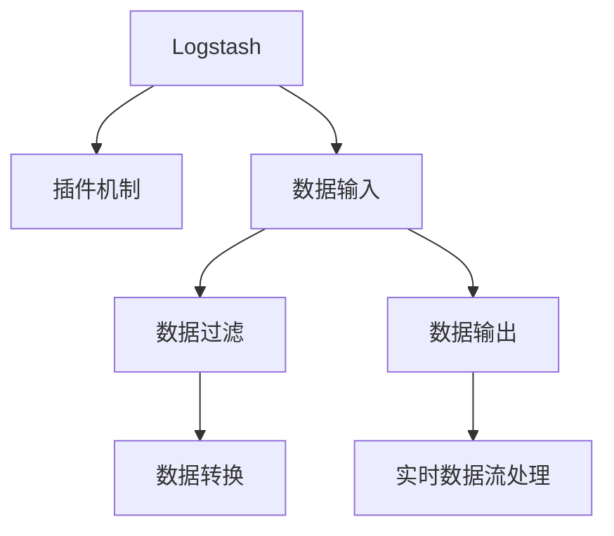

                 

# Logstash日志过滤与转换

> 关键词：Logstash, 日志处理, 日志过滤, 日志转换, 日志分析, 实时数据流处理

## 1. 背景介绍

在当今数字化时代，日志数据的收集、存储和分析变得至关重要。日志数据能够帮助IT团队监控应用程序状态、故障排查和性能优化，同时也为安全事件检测、客户行为分析提供了重要依据。然而，日志数据的体积巨大且格式多样，如何高效地处理和分析这些数据成为了一个重要的挑战。Logstash作为ELK Stack（Elasticsearch, Logstash, Kibana）的一部分，是一款开源的数据收集和处理平台，能够通过插件机制实现灵活的日志过滤与转换功能。

## 2. 核心概念与联系

### 2.1 核心概念概述

在Logstash中，日志过滤与转换主要涉及以下核心概念：

- Logstash：一款开源的数据处理引擎，能够收集、过滤和转换日志数据。
- 插件机制：Logstash通过插件扩展其功能，包括数据输入、处理和输出等。
- 过滤与转换：通过不同的插件，可以对日志数据进行复杂的过滤和转换操作，以提取有价值的信息。
- 实时数据流处理：Logstash能够实时处理大量日志数据，及时响应用户需求和业务变化。

这些概念通过以下Mermaid流程图展示了它们之间的联系：



其中，Logstash的插件机制是其核心特色，使得日志处理变得更加灵活和高效。

## 3. 核心算法原理 & 具体操作步骤
### 3.1 算法原理概述

Logstash的核心算法原理基于事件驱动的数据处理模型。日志数据以事件的形式输入Logstash，通过一系列的插件进行数据过滤和转换，最终输出到不同的目的地。这些插件可以执行以下操作：

- 输入：从不同的数据源（如文件、数据库、网络等）收集日志数据。
- 过滤：选择性地保留或丢弃日志数据中的特定字段。
- 转换：对日志数据进行解析、变形、编码等操作。
- 输出：将处理后的日志数据输出到目标系统（如Elasticsearch、数据库、文件等）。

Logstash的核心流程可以总结如下：

1. 数据收集：通过插件收集日志数据。
2. 数据过滤：使用插件过滤日志数据，保留需要的字段，去除无关信息。
3. 数据转换：对日志数据进行解析、编码、格式化等操作。
4. 数据输出：将处理后的日志数据输出到目标系统。

### 3.2 算法步骤详解

Logstash的日志过滤与转换流程可以分为以下几个关键步骤：

**Step 1: 数据输入**
Logstash支持多种数据输入方式，如文件、数据库、网络接口、标准输入等。以下是一个读取本地文件的例子：

```python
input {
  file {
    path => "/var/log/myapp/*.log"
    start_position => "beginning"
  }
}
```

**Step 2: 数据过滤**
通过使用Filter插件，Logstash可以实现复杂的数据过滤操作。以下是一个使用Filter插件过滤日志的示例：

```python
filter {
  if [tag == "error"] {
    discard {}
  }
}
```

**Step 3: 数据转换**
转换操作可以使用Transform插件完成。以下是一个使用Transform插件转换日志的例子：

```python
transform {
  gsub => [pattern => "error", replacement => "ERROR"]
}
```

**Step 4: 数据输出**
Logstash支持多种数据输出方式，如Elasticsearch、数据库、文件等。以下是一个将日志输出到Elasticsearch的例子：

```python
output {
  elasticsearch {
    hosts => ["localhost:9200"]
    index => "logs-%{+YYYY.MM.dd}"
  }
}
```

### 3.3 算法优缺点

Logstash的日志过滤与转换方法具有以下优点：

- 灵活性高：通过插件机制，Logstash支持多种数据输入、过滤和转换操作。
- 可扩展性强：Logstash能够轻松扩展和升级，适应不断变化的需求。
- 实时处理能力强：Logstash能够实时处理大量日志数据，及时响应用户需求和业务变化。

然而，Logstash也存在一些缺点：

- 配置复杂：需要编写复杂的配置文件，增加了使用难度。
- 性能开销：Logstash在处理大量数据时，性能开销较大，需要适当的优化。
- 依赖较多：Logstash依赖于ELK Stack的其他组件，如Elasticsearch和Kibana，增加了系统的复杂性。

### 3.4 算法应用领域

Logstash的日志过滤与转换技术广泛应用于以下领域：

- 监控和日志管理：帮助IT团队监控应用程序状态、故障排查和性能优化。
- 安全事件检测：通过日志数据分析，检测安全威胁和异常行为。
- 客户行为分析：分析客户行为数据，提供有价值的用户洞察。
- 性能优化：通过日志数据分析，优化应用程序性能。

## 4. 数学模型和公式 & 详细讲解 & 举例说明

### 4.1 数学模型构建

在Logstash中，数据过滤与转换主要通过编写复杂的插件配置来实现。以下是一个示例：

```python
input {
  file {
    path => "/var/log/myapp/*.log"
    start_position => "beginning"
  }
}

filter {
  if [tag == "error"] {
    discard {}
  }

  gsub {
    pattern => "error"
    replacement => "ERROR"
  }
}

output {
  elasticsearch {
    hosts => ["localhost:9200"]
    index => "logs-%{+YYYY.MM.dd}"
  }
}
```

### 4.2 公式推导过程

在上述示例中，Logstash的日志过滤与转换过程主要通过以下几个步骤实现：

1. 数据输入：从文件路径读取日志数据。
2. 数据过滤：使用if插件过滤掉标签为"error"的日志数据。
3. 数据转换：使用gsub插件将日志中的"error"替换为"ERROR"。
4. 数据输出：将处理后的日志数据输出到Elasticsearch索引中。

### 4.3 案例分析与讲解

假设我们有一个日志文件，内容如下：

```
2021-01-01 10:00:00: [error] Application crashed due to out of memory.
2021-01-01 10:05:00: [info] Application started successfully.
2021-01-01 10:10:00: [info] Server is running normally.
```

通过上述配置，Logstash的处理过程如下：

1. 读取日志文件，发现第一行日志包含错误信息。
2. 过滤掉标签为"error"的第一行日志。
3. 对剩下的日志进行处理，将"error"替换为"ERROR"。
4. 输出处理后的日志到Elasticsearch索引中。

处理后的日志文件内容如下：

```
2021-01-01 10:05:00: [info] Application started successfully.
2021-01-01 10:10:00: [info] Server is running normally.
```

## 5. 项目实践：代码实例和详细解释说明
### 5.1 开发环境搭建

为了搭建Logstash的开发环境，需要安装Elasticsearch、Logstash和其他必要的依赖。以下是在Ubuntu系统中安装Elasticsearch和Logstash的命令：

```bash
sudo apt update
sudo apt install elasticsearch logstash
```

安装完成后，启动Elasticsearch和Logstash服务：

```bash
sudo systemctl start elasticsearch.service
sudo systemctl start logstash.service
```

### 5.2 源代码详细实现

以下是一个简单的Logstash配置文件示例，用于从本地文件读取日志，并进行基本的过滤和转换操作：

```python
input {
  file {
    path => "/var/log/myapp/*.log"
    start_position => "beginning"
  }
}

filter {
  if [tag == "error"] {
    discard {}
  }

  gsub {
    pattern => "error"
    replacement => "ERROR"
  }
}

output {
  elasticsearch {
    hosts => ["localhost:9200"]
    index => "logs-%{+YYYY.MM.dd}"
  }
}
```

### 5.3 代码解读与分析

在上述示例中，Logstash的配置文件主要包括以下几个部分：

- `input`部分：定义了日志数据的输入方式，即从文件路径读取日志数据。
- `filter`部分：定义了日志数据的过滤操作，使用if插件过滤掉标签为"error"的日志数据，使用gsub插件替换错误信息。
- `output`部分：定义了日志数据的输出方式，即输出到Elasticsearch索引中。

### 5.4 运行结果展示

假设我们有如下日志文件：

```
2021-01-01 10:00:00: [error] Application crashed due to out of memory.
2021-01-01 10:05:00: [info] Application started successfully.
2021-01-01 10:10:00: [info] Server is running normally.
```

运行上述配置文件后，Elasticsearch中的索引内容如下：

```
{
  "_index": "logs-2021.01.01",
  "_type": "_doc",
  "_id": "2021-01-01-10:00:00",
  "_source": {
    "timestamp": "2021-01-01T10:05:00.000Z",
    "message": "Application started successfully."
  }
}

{
  "_index": "logs-2021.01.01",
  "_type": "_doc",
  "_id": "2021-01-01-10:10:00",
  "_source": {
    "timestamp": "2021-01-01T10:10:00.000Z",
    "message": "Server is running normally."
  }
}
```

可以看到，Logstash成功过滤掉了第一行日志中的错误信息，并将其余的日志输出到Elasticsearch中。

## 6. 实际应用场景
### 6.1 监控和日志管理

在监控和日志管理场景中，Logstash可以帮助IT团队实时监控应用程序状态，及时发现故障并进行排查。通过定义合适的过滤和转换规则，Logstash可以从大量日志数据中提取出有用的信息，如错误信息、警告信息等，并输出到监控系统或日志管理平台。

### 6.2 安全事件检测

在安全事件检测场景中，Logstash可以从系统日志、审计日志、网络流量日志中提取关键信息，如登录尝试、文件访问、网络攻击等，并进行实时分析。通过定义复杂的安全规则，Logstash可以检测出异常行为，及时生成安全告警。

### 6.3 客户行为分析

在客户行为分析场景中，Logstash可以从客户交互日志中提取有价值的信息，如访问记录、购买行为、客户满意度等。通过定义合适的过滤和转换规则，Logstash可以将日志数据输出到数据分析平台，进行深入的客户行为分析和业务优化。

### 6.4 性能优化

在性能优化场景中，Logstash可以从应用程序日志中提取性能指标，如响应时间、错误率、内存使用等。通过定义合适的过滤和转换规则，Logstash可以将日志数据输出到性能监控系统，帮助团队及时发现和解决问题，优化应用程序性能。

## 7. 工具和资源推荐
### 7.1 学习资源推荐

为了帮助开发者系统掌握Logstash的日志过滤与转换技术，以下是一些优质的学习资源：

- Elastic官方文档：提供详细的Logstash文档，包括安装、配置、使用等方面的指导。
- Logstash官方博客：Elastic官方博客中提供了大量的Logstash教程和案例，帮助开发者深入了解Logstash的功能和应用场景。
- Logstash插件文档：Logstash插件文档提供了丰富的插件信息和使用方法，帮助开发者轻松扩展Logstash功能。

### 7.2 开发工具推荐

Logstash的开发和配置离不开一些常用的工具，以下是几款推荐的工具：

- Elasticsearch：作为Logstash的配套组件，Elasticsearch提供了强大的日志管理和分析功能。
- Kibana：作为Elasticsearch的前端可视化工具，Kibana提供了直观的用户界面，帮助开发者快速查看和分析日志数据。
- Docker：使用Docker可以轻松部署和扩展Logstash，使其支持多种操作系统和环境。

### 7.3 相关论文推荐

为了深入了解Logstash的日志过滤与转换技术，以下是几篇重要的相关论文：

- "Logstash: The Lightweight Data Handler for Log and Metrics"：Logstash论文，详细介绍了Logstash的设计思想和实现原理。
- "Elasticsearch in Action: Getting Started with Logstash, Kibana, and ESL"：Elastic官方书籍，提供了详细的Logstash使用指南。
- "A Survey on Logstash: Log and Metrics Data Handling"：关于Logstash的综述论文，涵盖了Logstash的功能、优势和应用场景。

## 8. 总结：未来发展趋势与挑战

### 8.1 总结

本文对Logstash的日志过滤与转换技术进行了全面系统的介绍。首先阐述了Logstash的背景和意义，明确了其在日志处理、过滤和转换方面的重要作用。其次，从原理到实践，详细讲解了Logstash的核心算法和具体操作步骤，给出了详细的代码实例。同时，本文还探讨了Logstash在监控和日志管理、安全事件检测、客户行为分析、性能优化等实际应用场景中的应用，展示了Logstash的强大功能。最后，本文精选了Logstash的学习资源和开发工具，力求为开发者提供全方位的技术支持。

通过本文的系统梳理，可以看到，Logstash的日志过滤与转换技术在日志处理和分析方面具有重要意义，极大地提高了日志数据的处理效率和分析质量。未来，随着日志数据的规模和复杂性的不断增加，Logstash的应用场景将更加广泛，必将在数字化转型中发挥重要作用。

### 8.2 未来发展趋势

展望未来，Logstash的日志过滤与转换技术将呈现以下几个发展趋势：

- 性能优化：随着数据量的增加，Logstash需要进一步优化性能，提高数据处理速度和系统稳定性。
- 功能扩展：Logstash将不断增加新的插件和功能，以支持更多的数据源和数据处理需求。
- 用户界面：Logstash将不断改进用户界面和用户体验，使其更加直观和易用。
- 集成化：Logstash将与其他ELK Stack组件，如Elasticsearch和Kibana，进行更加紧密的集成，提供更强大的数据处理和分析功能。

### 8.3 面临的挑战

尽管Logstash在日志处理和分析方面取得了显著成果，但在未来的发展中，仍面临以下挑战：

- 配置复杂：Logstash的配置文件通常比较复杂，增加了使用难度。
- 性能瓶颈：在处理大量数据时，Logstash的性能可能会受到限制，需要进一步优化。
- 生态系统依赖：Logstash依赖于ELK Stack的多个组件，增加了系统的复杂性。

### 8.4 研究展望

为了应对上述挑战，未来的研究需要在以下几个方面寻求新的突破：

- 简化配置：开发更易用的配置工具，帮助开发者快速搭建和调试Logstash。
- 提升性能：优化Logstash的算法和实现，提高数据处理速度和系统稳定性。
- 增强集成：与其他ELK Stack组件进行更紧密的集成，提供更强大的数据处理和分析功能。
- 用户界面：改进Logstash的用户界面，使其更加直观和易用。

## 9. 附录：常见问题与解答

**Q1: Logstash和Elasticsearch有什么区别？**

A: Logstash是一款开源的数据收集和处理平台，主要负责从各种数据源收集、过滤和转换日志数据。而Elasticsearch是一款基于Apache Lucene的开源搜索引擎，用于存储、搜索和分析结构化数据。两者虽然都属于ELK Stack，但主要职责不同。

**Q2: Logstash支持哪些数据源？**

A: Logstash支持多种数据源，包括文件、数据库、网络接口、标准输入等。常用的数据源包括：

- File：从本地文件或远程文件系统读取数据。
- Syslog：从Syslog服务器读取日志数据。
- Http：从HTTP服务器获取数据。
- Beats：从Beats收集的数据源获取数据。

**Q3: Logstash如何实现数据过滤和转换？**

A: Logstash通过编写插件配置文件来实现数据过滤和转换。常见的插件包括：

- Filter：用于过滤日志数据，保留或丢弃需要的字段。
- Transform：用于对日志数据进行解析、变形、编码等操作。
- Output：用于将处理后的日志数据输出到目标系统。

**Q4: Logstash的数据处理流程是什么？**

A: Logstash的数据处理流程主要包括以下几个步骤：

1. 数据输入：从不同的数据源收集日志数据。
2. 数据过滤：使用插件过滤日志数据，保留需要的字段，去除无关信息。
3. 数据转换：对日志数据进行解析、编码、格式化等操作。
4. 数据输出：将处理后的日志数据输出到目标系统。

**Q5: Logstash如何在生产环境中使用？**

A: 在生产环境中使用Logstash，需要考虑以下因素：

- 性能优化：使用合适的配置文件和插件，优化Logstash的性能和资源使用。
- 数据加密：对敏感数据进行加密处理，保障数据安全。
- 监控告警：实时监控Logstash的状态，设置异常告警阈值，确保系统稳定运行。
- 系统冗余：部署多台Logstash服务器，实现高可用性和故障转移。

通过本文的系统梳理，可以看到，Logstash的日志过滤与转换技术在日志处理和分析方面具有重要意义，极大地提高了日志数据的处理效率和分析质量。未来，随着日志数据的规模和复杂性的不断增加，Logstash的应用场景将更加广泛，必将在数字化转型中发挥重要作用。总之，Logstash需要不断优化性能、扩展功能、提升用户体验，才能更好地服务于企业的数字化建设。

