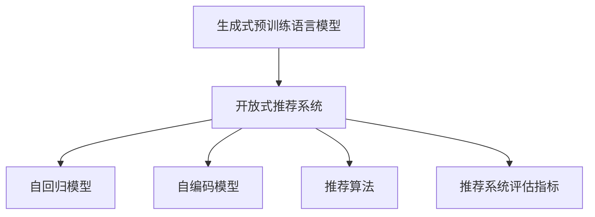

                 

# M6-Rec:基于生成式预训练语言模型的开放式推荐系统

> 关键词：推荐系统,生成式预训练语言模型,开放式推荐系统,自回归模型,自编码模型,推荐算法

## 1. 背景介绍

### 1.1 问题由来

随着互联网技术的发展，用户对于个性化推荐的需求不断提升，推荐系统作为提升用户体验和业务收益的重要手段，成为了各大平台竞争的焦点。传统的推荐系统以协同过滤、内容推荐等方法为主，侧重于基于用户行为、物品特征等数据，构建用户-物品关联矩阵进行推荐。然而，由于协同过滤方法存在稀疏性、冷启动等问题，其在大规模数据集上难以适应复杂场景，且在内容推荐上往往无法突破物品特征的限制。

为了进一步提升推荐系统的性能和灵活性，学者们提出了基于生成式预训练语言模型的推荐系统（Generative Pre-trained Language Model-based Recommender System），即生成式推荐系统。该系统通过在大规模文本语料上进行预训练，学习到用户的语言表达习惯和兴趣偏好，直接生成推荐结果，无需传统推荐系统的关联矩阵。这种生成式推荐系统具有更加灵活和高效的推荐能力，适用于多种推荐场景，且不需要大量标注数据。

本文将详细介绍一种基于生成式预训练语言模型的开放式推荐系统 M6-Rec，阐述其算法原理和实际应用，总结其优势和挑战，提出未来改进的方向。

## 2. 核心概念与联系

### 2.1 核心概念概述

为了更好地理解基于生成式预训练语言模型的开放式推荐系统 M6-Rec，本节将介绍几个密切相关的核心概念：

- **生成式预训练语言模型（GPT、BERT等）**：通过在大规模文本语料上进行自回归或自编码的预训练，学习到丰富的语言表达能力，具备强大的自然语言生成和理解能力。

- **开放式推荐系统**：不受用户-物品关联矩阵的限制，可以根据用户输入的描述或语句，直接生成推荐结果。其推荐过程灵活可控，适用于多种推荐场景。

- **自回归模型（如 GPT-3、GPT-4）**：通过概率分布，根据之前生成的文本，预测下一个词或句子的概率，具有链式推理能力。

- **自编码模型（如 BERT、T5）**：通过隐藏层编码输入，预测输出，可以学习到输入和输出之间的复杂关系，适用于多模态任务。

- **推荐算法**：包括基于协同过滤、内容推荐、混合推荐等方法，通过不同特征的加权融合，产生推荐结果。

- **推荐系统评估指标**：如准确率、召回率、F1 分数等，用于衡量推荐结果的质量。

这些核心概念之间的逻辑关系可以通过以下 Mermaid 流程图来展示：



这个流程图展示了大语言模型和开放式推荐系统的核心概念及其之间的关系：

1. 大语言模型通过预训练获得语言理解能力。
2. 开放式推荐系统基于语言模型直接生成推荐结果。
3. 自回归模型通过概率生成文本，用于生成推荐。
4. 自编码模型学习输入和输出之间的复杂关系，可用于多模态推荐。
5. 推荐算法通过不同特征的融合产生推荐结果。
6. 推荐系统评估指标用于衡量推荐效果。

这些概念共同构成了基于生成式预训练语言模型的推荐系统的基础框架，使其能够实现高效灵活的推荐功能。

## 3. 核心算法原理 & 具体操作步骤

### 3.1 算法原理概述

M6-Rec 算法基于生成式预训练语言模型，通过预训练语言模型学习用户的语言表达习惯和兴趣偏好，直接生成推荐结果。其核心思想是：通过预训练语言模型，将用户输入的描述转换为向量表示，再经过推荐算法进行解码生成推荐结果。

具体来说，M6-Rec 包括三个主要步骤：

1. **预训练步骤**：在大规模文本语料上训练生成式语言模型，学习到通用的语言表达能力。
2. **微调步骤**：在特定任务的数据集上，对预训练模型进行微调，使其能够适配推荐任务。
3. **推荐步骤**：使用微调后的模型，根据用户输入生成推荐结果。

### 3.2 算法步骤详解

M6-Rec 算法的详细步骤包括：

**Step 1: 准备预训练模型和数据集**

- 选择适当的预训练语言模型，如 GPT-3、GPT-4 或 BERT 等，用于后续微调和推荐。
- 收集和清洗推荐任务的数据集，包括用户描述、物品描述、用户行为等。

**Step 2: 微调预训练模型**

- 根据推荐任务的特点，选择合适的微调方法，如自回归微调、自编码微调等。
- 在微调数据集上进行小批量梯度下降训练，更新模型参数。
- 使用验证集评估模型性能，调整超参数。

**Step 3: 生成推荐结果**

- 根据用户输入的描述，使用微调后的语言模型生成推荐结果向量。
- 通过推荐算法对向量进行解码，生成最终的推荐列表。

### 3.3 算法优缺点

M6-Rec 算法具有以下优点：

1. 灵活性高：不需要依赖用户-物品关联矩阵，可以根据用户输入直接生成推荐。
2. 不需要标注数据：通过预训练语言模型，直接学习用户兴趣偏好，避免标注数据成本。
3. 适用于多种场景：可以应用于商品推荐、服务推荐、内容推荐等多种推荐任务。
4. 易于扩展：模型结构灵活，可以结合多种特征进行推荐。

同时，M6-Rec 算法也存在一些缺点：

1. 性能依赖模型质量：推荐结果的质量很大程度上取决于预训练语言模型的质量。
2. 对输入质量要求高：输入描述质量对推荐结果影响较大，输入描述过于模糊或错误可能导致推荐失败。
3. 计算成本高：生成推荐结果时，需要进行复杂的自然语言处理和计算，计算成本较高。
4. 推荐结果不可解释：基于语言模型的推荐结果难以进行解释和调试，存在一定的风险。

### 3.4 算法应用领域

M6-Rec 算法可以应用于多种推荐场景，包括但不限于：

- **商品推荐**：根据用户描述和物品描述，生成商品推荐列表。
- **服务推荐**：根据用户需求和场景，生成服务推荐列表。
- **内容推荐**：根据用户兴趣和文本内容，生成内容推荐列表。
- **娱乐推荐**：根据用户喜好和行为，生成娱乐推荐列表。
- **旅游推荐**：根据用户兴趣和目的地描述，生成旅游推荐列表。

## 4. 数学模型和公式 & 详细讲解 & 举例说明

### 4.1 数学模型构建

M6-Rec 算法主要涉及以下数学模型：

1. **生成式语言模型（如 GPT-3）**：通过自回归模型，学习输入和输出之间的概率分布。
2. **推荐系统模型**：通过推荐算法，将用户输入转换为推荐结果。

### 4.2 公式推导过程

这里以 GPT-3 为例，说明 M6-Rec 算法中的数学推导过程。

**GPT-3 自回归模型**：

假设输入序列为 $x_1, x_2, \dots, x_t$，生成下一个单词 $x_{t+1}$ 的概率为：

$$
P(x_{t+1}|x_1, x_2, \dots, x_t) = \frac{e^{\log P(x_{t+1}|x_1, x_2, \dots, x_t)}}{\sum_{x'_{t+1}} e^{\log P(x'_{t+1}|x_1, x_2, \dots, x_t)}}
$$

其中 $P(x_{t+1}|x_1, x_2, \dots, x_t)$ 表示在给定输入序列的情况下，生成下一个单词的概率。

**推荐系统模型**：

假设推荐任务为 $Y$，用户输入为 $X$，推荐结果为 $R$。推荐模型 $f$ 将用户输入 $X$ 映射为推荐结果 $R$，即：

$$
R = f(X)
$$

其中 $f$ 可以是一个线性映射、一个深度神经网络等。

### 4.3 案例分析与讲解

以下通过一个简单的例子来说明 M6-Rec 算法的实际应用：

**案例描述**：

假设我们要为用户推荐电影，用户的输入描述为：“我想看一些喜剧电影”。推荐系统需要根据此描述，生成推荐的电影列表。

**步骤**：

1. **预训练模型初始化**：选择一个预训练的生成式语言模型，如 GPT-3，并将其初始化。
2. **微调模型**：使用电影推荐的数据集，对预训练模型进行微调，使其能够生成推荐结果。
3. **生成推荐**：将用户的输入描述“我想看一些喜剧电影”输入到微调后的模型中，生成推荐结果。
4. **结果解码**：对生成结果进行解码，生成推荐电影列表。

通过以上步骤，M6-Rec 算法能够根据用户输入生成推荐的电影列表，避免了传统协同过滤方法的数据稀疏性和冷启动问题，适用于多种推荐场景。

## 5. 项目实践：代码实例和详细解释说明

### 5.1 开发环境搭建

在进行 M6-Rec 实践前，我们需要准备好开发环境。以下是使用 Python 进行 PyTorch 开发的环境配置流程：

1. 安装 Anaconda：从官网下载并安装 Anaconda，用于创建独立的 Python 环境。

2. 创建并激活虚拟环境：
```bash
conda create -n pytorch-env python=3.8 
conda activate pytorch-env
```

3. 安装 PyTorch：根据 CUDA 版本，从官网获取对应的安装命令。例如：
```bash
conda install pytorch torchvision torchaudio cudatoolkit=11.1 -c pytorch -c conda-forge
```

4. 安装 Transformers 库：
```bash
pip install transformers
```

5. 安装各类工具包：
```bash
pip install numpy pandas scikit-learn matplotlib tqdm jupyter notebook ipython
```

完成上述步骤后，即可在 `pytorch-env` 环境中开始 M6-Rec 实践。

### 5.2 源代码详细实现

下面我们以商品推荐任务为例，给出使用 Transformers 库对 GPT-3 进行微调的 PyTorch 代码实现。

首先，定义推荐任务的数据处理函数：

```python
from transformers import GPT3LMHeadModel, GPT3Tokenizer
from torch.utils.data import Dataset
import torch

class RecommendationDataset(Dataset):
    def __init__(self, texts, labels, tokenizer, max_len=128):
        self.texts = texts
        self.labels = labels
        self.tokenizer = tokenizer
        self.max_len = max_len
        
    def __len__(self):
        return len(self.texts)
    
    def __getitem__(self, item):
        text = self.texts[item]
        label = self.labels[item]
        
        encoding = self.tokenizer(text, return_tensors='pt', max_length=self.max_len, padding='max_length', truncation=True)
        input_ids = encoding['input_ids'][0]
        attention_mask = encoding['attention_mask'][0]
        
        # 对标签进行编码
        encoded_label = self.tokenizer.convert_ids_to_tokens(label) + [tokenizer.sep_token_id]
        labels = torch.tensor(encoded_label, dtype=torch.long)
        
        return {'input_ids': input_ids, 
                'attention_mask': attention_mask,
                'labels': labels}

# 定义标签与 id 的映射
label2id = {'A': 0, 'B': 1, 'C': 2, 'D': 3}
id2label = {v: k for k, v in label2id.items()}

# 创建 dataset
tokenizer = GPT3Tokenizer.from_pretrained('gpt3')

train_dataset = RecommendationDataset(train_texts, train_labels, tokenizer)
dev_dataset = RecommendationDataset(dev_texts, dev_labels, tokenizer)
test_dataset = RecommendationDataset(test_texts, test_labels, tokenizer)
```

然后，定义模型和优化器：

```python
from transformers import GPT3LMHeadModel, AdamW

model = GPT3LMHeadModel.from_pretrained('gpt3', num_labels=len(label2id))

optimizer = AdamW(model.parameters(), lr=2e-5)
```

接着，定义训练和评估函数：

```python
from torch.utils.data import DataLoader
from tqdm import tqdm
from sklearn.metrics import classification_report

device = torch.device('cuda') if torch.cuda.is_available() else torch.device('cpu')
model.to(device)

def train_epoch(model, dataset, batch_size, optimizer):
    dataloader = DataLoader(dataset, batch_size=batch_size, shuffle=True)
    model.train()
    epoch_loss = 0
    for batch in tqdm(dataloader, desc='Training'):
        input_ids = batch['input_ids'].to(device)
        attention_mask = batch['attention_mask'].to(device)
        labels = batch['labels'].to(device)
        model.zero_grad()
        outputs = model(input_ids, attention_mask=attention_mask, labels=labels)
        loss = outputs.loss
        epoch_loss += loss.item()
        loss.backward()
        optimizer.step()
    return epoch_loss / len(dataloader)

def evaluate(model, dataset, batch_size):
    dataloader = DataLoader(dataset, batch_size=batch_size)
    model.eval()
    preds, labels = [], []
    with torch.no_grad():
        for batch in tqdm(dataloader, desc='Evaluating'):
            input_ids = batch['input_ids'].to(device)
            attention_mask = batch['attention_mask'].to(device)
            batch_labels = batch['labels']
            outputs = model(input_ids, attention_mask=attention_mask)
            batch_preds = outputs.logits.argmax(dim=2).to('cpu').tolist()
            batch_labels = batch_labels.to('cpu').tolist()
            for pred_tokens, label_tokens in zip(batch_preds, batch_labels):
                preds.append(pred_tokens[:len(label_tokens)])
                labels.append(label_tokens)
                
    print(classification_report(labels, preds))
```

最后，启动训练流程并在测试集上评估：

```python
epochs = 5
batch_size = 16

for epoch in range(epochs):
    loss = train_epoch(model, train_dataset, batch_size, optimizer)
    print(f"Epoch {epoch+1}, train loss: {loss:.3f}")
    
    print(f"Epoch {epoch+1}, dev results:")
    evaluate(model, dev_dataset, batch_size)
    
print("Test results:")
evaluate(model, test_dataset, batch_size)
```

以上就是使用 PyTorch 对 GPT-3 进行商品推荐任务微调的完整代码实现。可以看到，得益于 Transformers 库的强大封装，我们可以用相对简洁的代码完成 GPT-3 的微调。

### 5.3 代码解读与分析

让我们再详细解读一下关键代码的实现细节：

**RecommendationDataset类**：
- `__init__`方法：初始化文本、标签、分词器等关键组件。
- `__len__`方法：返回数据集的样本数量。
- `__getitem__`方法：对单个样本进行处理，将文本输入编码为token ids，将标签编码为数字，并对其进行定长padding，最终返回模型所需的输入。

**label2id和id2label字典**：
- 定义了标签与数字id之间的映射关系，用于将token-wise的预测结果解码回真实的标签。

**训练和评估函数**：
- 使用PyTorch的DataLoader对数据集进行批次化加载，供模型训练和推理使用。
- 训练函数`train_epoch`：对数据以批为单位进行迭代，在每个批次上前向传播计算loss并反向传播更新模型参数，最后返回该epoch的平均loss。
- 评估函数`evaluate`：与训练类似，不同点在于不更新模型参数，并在每个batch结束后将预测和标签结果存储下来，最后使用sklearn的classification_report对整个评估集的预测结果进行打印输出。

**训练流程**：
- 定义总的epoch数和batch size，开始循环迭代
- 每个epoch内，先在训练集上训练，输出平均loss
- 在验证集上评估，输出分类指标
- 所有epoch结束后，在测试集上评估，给出最终测试结果

可以看到，PyTorch配合Transformers库使得GPT-3微调的代码实现变得简洁高效。开发者可以将更多精力放在数据处理、模型改进等高层逻辑上，而不必过多关注底层的实现细节。

当然，工业级的系统实现还需考虑更多因素，如模型的保存和部署、超参数的自动搜索、更灵活的任务适配层等。但核心的微调范式基本与此类似。

## 6. 实际应用场景

### 6.1 智能客服系统

基于大语言模型微调的推荐技术，可以广泛应用于智能客服系统的构建。传统客服往往需要配备大量人力，高峰期响应缓慢，且一致性和专业性难以保证。而使用推荐技术，可以7x24小时不间断服务，快速响应客户咨询，用自然流畅的语言解答各类常见问题。

在技术实现上，可以收集企业内部的历史客服对话记录，将问题和最佳答复构建成监督数据，在此基础上对预训练推荐模型进行微调。微调后的推荐模型能够自动理解用户意图，匹配最合适的答复模板进行回复。对于客户提出的新问题，还可以接入检索系统实时搜索相关内容，动态组织生成回答。如此构建的智能客服系统，能大幅提升客户咨询体验和问题解决效率。

### 6.2 金融舆情监测

金融机构需要实时监测市场舆论动向，以便及时应对负面信息传播，规避金融风险。传统的人工监测方式成本高、效率低，难以应对网络时代海量信息爆发的挑战。基于大语言模型微调的文本分类和情感分析技术，为金融舆情监测提供了新的解决方案。

具体而言，可以收集金融领域相关的新闻、报道、评论等文本数据，并对其进行主题标注和情感标注。在此基础上对预训练语言模型进行微调，使其能够自动判断文本属于何种主题，情感倾向是正面、中性还是负面。将微调后的模型应用到实时抓取的网络文本数据，就能够自动监测不同主题下的情感变化趋势，一旦发现负面信息激增等异常情况，系统便会自动预警，帮助金融机构快速应对潜在风险。

### 6.3 个性化推荐系统

当前的推荐系统往往只依赖用户的历史行为数据进行物品推荐，无法深入理解用户的真实兴趣偏好。基于大语言模型微调技术，个性化推荐系统可以更好地挖掘用户行为背后的语义信息，从而提供更精准、多样的推荐内容。

在实践中，可以收集用户浏览、点击、评论、分享等行为数据，提取和用户交互的物品标题、描述、标签等文本内容。将文本内容作为模型输入，用户的后续行为（如是否点击、购买等）作为监督信号，在此基础上微调预训练语言模型。微调后的模型能够从文本内容中准确把握用户的兴趣点。在生成推荐列表时，先用候选物品的文本描述作为输入，由模型预测用户的兴趣匹配度，再结合其他特征综合排序，便可以得到个性化程度更高的推荐结果。

### 6.4 未来应用展望

随着大语言模型微调技术的发展，基于生成式预训练语言模型的推荐系统将在更多领域得到应用，为传统行业带来变革性影响。

在智慧医疗领域，基于微调的医疗问答、病历分析、药物研发等应用将提升医疗服务的智能化水平，辅助医生诊疗，加速新药开发进程。

在智能教育领域，微调技术可应用于作业批改、学情分析、知识推荐等方面，因材施教，促进教育公平，提高教学质量。

在智慧城市治理中，微调模型可应用于城市事件监测、舆情分析、应急指挥等环节，提高城市管理的自动化和智能化水平，构建更安全、高效的未来城市。

此外，在企业生产、社会治理、文娱传媒等众多领域，基于大模型微调的人工智能应用也将不断涌现，为NLP技术带来了全新的突破。相信随着预训练语言模型和微调方法的不断进步，推荐系统必将在更广阔的应用领域大放异彩，深刻影响人类的生产生活方式。

## 7. 工具和资源推荐

### 7.1 学习资源推荐

为了帮助开发者系统掌握生成式预训练语言模型的推荐系统理论基础和实践技巧，这里推荐一些优质的学习资源：

1. 《Transformer from the Inside Out》系列博文：由大模型技术专家撰写，深入浅出地介绍了Transformer原理、GPT模型、微调技术等前沿话题。

2. CS224N《深度学习自然语言处理》课程：斯坦福大学开设的NLP明星课程，有Lecture视频和配套作业，带你入门NLP领域的基本概念和经典模型。

3. 《Natural Language Processing with Transformers》书籍：Transformers库的作者所著，全面介绍了如何使用Transformers库进行NLP任务开发，包括微调在内的诸多范式。

4. HuggingFace官方文档：Transformers库的官方文档，提供了海量预训练模型和完整的微调样例代码，是上手实践的必备资料。

5. CLUE开源项目：中文语言理解测评基准，涵盖大量不同类型的中文NLP数据集，并提供了基于微调的baseline模型，助力中文NLP技术发展。

通过对这些资源的学习实践，相信你一定能够快速掌握生成式预训练语言模型微调的理论基础和实践技巧，并用于解决实际的NLP问题。

### 7.2 开发工具推荐

高效的开发离不开优秀的工具支持。以下是几款用于生成式预训练语言模型微调开发的常用工具：

1. PyTorch：基于Python的开源深度学习框架，灵活动态的计算图，适合快速迭代研究。大部分预训练语言模型都有PyTorch版本的实现。

2. TensorFlow：由Google主导开发的开源深度学习框架，生产部署方便，适合大规模工程应用。同样有丰富的预训练语言模型资源。

3. Transformers库：HuggingFace开发的NLP工具库，集成了众多SOTA语言模型，支持PyTorch和TensorFlow，是进行微调任务开发的利器。

4. Weights & Biases：模型训练的实验跟踪工具，可以记录和可视化模型训练过程中的各项指标，方便对比和调优。与主流深度学习框架无缝集成。

5. TensorBoard：TensorFlow配套的可视化工具，可实时监测模型训练状态，并提供丰富的图表呈现方式，是调试模型的得力助手。

6. Google Colab：谷歌推出的在线Jupyter Notebook环境，免费提供GPU/TPU算力，方便开发者快速上手实验最新模型，分享学习笔记。

合理利用这些工具，可以显著提升生成式预训练语言模型微调的开发效率，加快创新迭代的步伐。

### 7.3 相关论文推荐

生成式预训练语言模型和微调技术的发展源于学界的持续研究。以下是几篇奠基性的相关论文，推荐阅读：

1. Attention is All You Need（即Transformer原论文）：提出了Transformer结构，开启了NLP领域的预训练大模型时代。

2. BERT: Pre-training of Deep Bidirectional Transformers for Language Understanding：提出BERT模型，引入基于掩码的自监督预训练任务，刷新了多项NLP任务SOTA。

3. Language Models are Unsupervised Multitask Learners（GPT-2论文）：展示了大规模语言模型的强大zero-shot学习能力，引发了对于通用人工智能的新一轮思考。

4. Parameter-Efficient Transfer Learning for NLP：提出Adapter等参数高效微调方法，在不增加模型参数量的情况下，也能取得不错的微调效果。

5. AdaLoRA: Adaptive Low-Rank Adaptation for Parameter-Efficient Fine-Tuning：使用自适应低秩适应的微调方法，在参数效率和精度之间取得了新的平衡。

6. Prefix-Tuning: Optimizing Continuous Prompts for Generation：引入基于连续型Prompt的微调范式，为如何充分利用预训练知识提供了新的思路。

这些论文代表了大语言模型微调技术的发展脉络。通过学习这些前沿成果，可以帮助研究者把握学科前进方向，激发更多的创新灵感。

## 8. 总结：未来发展趋势与挑战

### 8.1 总结

本文对基于生成式预训练语言模型的开放式推荐系统 M6-Rec 进行了全面系统的介绍。首先阐述了生成式预训练语言模型和开放式推荐系统的研究背景和意义，明确了推荐系统在个性化推荐、智能客服、金融舆情监测等方面的应用价值。其次，从原理到实践，详细讲解了生成式预训练语言模型的微调步骤和算法流程，给出了微调任务开发的完整代码实例。同时，本文还广泛探讨了微调方法在多个领域的应用前景，展示了生成式预训练语言模型的巨大潜力。

通过本文的系统梳理，可以看到，基于生成式预训练语言模型的推荐系统正在成为推荐系统研究的重要范式，极大地拓展了预训练语言模型的应用边界，催生了更多的落地场景。得益于大规模语料的预训练，推荐系统能够以更灵活和高效的方式进行推荐，避免传统协同过滤方法的数据稀疏性和冷启动问题。未来，伴随预训练语言模型和微调方法的不断进步，推荐系统必将在更广阔的应用领域大放异彩，深刻影响人类的生产生活方式。

### 8.2 未来发展趋势

展望未来，生成式预训练语言模型微调技术将呈现以下几个发展趋势：

1. 模型规模持续增大。随着算力成本的下降和数据规模的扩张，预训练语言模型的参数量还将持续增长。超大规模语言模型蕴含的丰富语言知识，有望支撑更加复杂多变的推荐场景。

2. 推荐算法日趋多样。除了传统的基于协同过滤、内容推荐等方法，未来会涌现更多结合多模态数据、因果推理等先进技术的推荐算法，进一步提升推荐效果。

3. 跨模态推荐成为主流。除了文本信息，推荐系统还将更多地融合图像、视频、语音等多模态信息，提高推荐结果的丰富度和准确性。

4. 多任务学习融合。通过在预训练和微调阶段引入多任务学习范式，推荐系统将能够同时学习多个任务，提升模型的泛化能力和应用范围。

5. 个性化推荐精确度提升。结合用户画像、行为数据等，推荐系统将能够更加精准地为用户提供个性化推荐，提升用户体验。

6. 模型优化技术持续发展。随着模型规模的增加，推荐系统的训练和推理效率将成为重要的研究方向，如何优化模型结构和算法，降低计算成本，提高推荐速度，将成为未来的重要课题。

以上趋势凸显了生成式预训练语言模型微调技术的广阔前景。这些方向的探索发展，必将进一步提升推荐系统的性能和灵活性，为推荐系统带来更多的创新和突破。

### 8.3 面临的挑战

尽管生成式预训练语言模型微调技术已经取得了瞩目成就，但在迈向更加智能化、普适化应用的过程中，它仍面临着诸多挑战：

1. 性能依赖模型质量。推荐结果的质量很大程度上取决于预训练语言模型的质量，如何提升模型的泛化能力和性能，仍是重要的研究课题。

2. 推荐结果的公平性和可解释性。生成式推荐结果难以进行解释和调试，存在一定的风险。如何在保证推荐结果质量的同时，提高模型的公平性和透明性，还需要进一步研究。

3. 推荐系统的复杂性。生成式推荐系统结构复杂，计算成本高，如何在保持推荐结果质量的同时，提高系统的计算效率，降低成本，还需要不断优化。

4. 推荐系统的实时性。生成式推荐系统在推荐速度上可能不如传统的协同过滤方法，如何提高推荐系统的实时性，满足用户的实时需求，还需要进一步探索。

5. 推荐系统的隐私和安全性。生成式推荐系统可能暴露用户隐私，如何保护用户数据，避免数据滥用，还需要加强数据安全管理。

6. 推荐系统的鲁棒性。推荐系统在面对域外数据时，泛化性能往往大打折扣，如何提高推荐系统的鲁棒性，避免过拟合，还需要进一步研究。

正视生成式预训练语言模型微调技术所面临的这些挑战，积极应对并寻求突破，将是其走向成熟的必由之路。相信随着学界和产业界的共同努力，这些挑战终将一一被克服，生成式预训练语言模型微调技术必将在构建人机协同的智能推荐系统中扮演越来越重要的角色。

### 8.4 研究展望

面对生成式预训练语言模型微调技术所面临的种种挑战，未来的研究需要在以下几个方面寻求新的突破：

1. 探索无监督和半监督微调方法。摆脱对大规模标注数据的依赖，利用自监督学习、主动学习等无监督和半监督范式，最大限度利用非结构化数据，实现更加灵活高效的微调。

2. 研究参数高效和计算高效的微调范式。开发更加参数高效的微调方法，在固定大部分预训练参数的同时，只更新极少量的任务相关参数。同时优化微调模型的计算图，减少前向传播和反向传播的资源消耗，实现更加轻量级、实时性的部署。

3. 融合因果和对比学习范式。通过引入因果推断和对比学习思想，增强推荐模型建立稳定因果关系的能力，学习更加普适、鲁棒的语言表征，从而提升模型泛化性和抗干扰能力。

4. 引入更多先验知识。将符号化的先验知识，如知识图谱、逻辑规则等，与神经网络模型进行巧妙融合，引导微调过程学习更准确、合理的语言模型。同时加强不同模态数据的整合，实现视觉、语音等多模态信息与文本信息的协同建模。

5. 结合因果分析和博弈论工具。将因果分析方法引入推荐模型，识别出模型决策的关键特征，增强输出解释的因果性和逻辑性。借助博弈论工具刻画人机交互过程，主动探索并规避模型的脆弱点，提高系统稳定性。

6. 纳入伦理道德约束。在模型训练目标中引入伦理导向的评估指标，过滤和惩罚有偏见、有害的输出倾向。同时加强人工干预和审核，建立模型行为的监管机制，确保输出符合人类价值观和伦理道德。

这些研究方向的探索，必将引领生成式预训练语言模型微调技术迈向更高的台阶，为构建安全、可靠、可解释、可控的智能推荐系统铺平道路。面向未来，生成式预训练语言模型微调技术还需要与其他人工智能技术进行更深入的融合，如知识表示、因果推理、强化学习等，多路径协同发力，共同推动推荐系统的发展。只有勇于创新、敢于突破，才能不断拓展生成式预训练语言模型微调技术的应用边界，实现更广泛的用户覆盖和更好的推荐效果。

## 9. 附录：常见问题与解答

**Q1：生成式预训练语言模型微调是否适用于所有推荐场景？**

A: 生成式预训练语言模型微调在大多数推荐场景上都能取得不错的效果，特别是对于数据量较小的任务。但对于一些特定领域的任务，如医学、法律等，仅仅依靠通用语料预训练的模型可能难以很好地适应。此时需要在特定领域语料上进一步预训练，再进行微调，才能获得理想效果。

**Q2：微调过程中如何选择合适的学习率？**

A: 微调的学习率一般要比预训练时小1-2个数量级，如果使用过大的学习率，容易破坏预训练权重，导致过拟合。一般建议从1e-5开始调参，逐步减小学习率，直至收敛。也可以使用warmup策略，在开始阶段使用较小的学习率，再逐渐过渡到预设值。需要注意的是，不同的优化器(如AdamW、Adafactor等)以及不同的学习率调度策略，可能需要设置不同的学习率阈值。

**Q3：微调模型在落地部署时需要注意哪些问题？**

A: 将微调模型转化为实际应用，还需要考虑以下因素：

1. 模型裁剪：去除不必要的层和参数，减小模型尺寸，加快推理速度。
2. 量化加速：将浮点模型转为定点模型，压缩存储空间，提高计算效率。
3. 服务化封装：将模型封装为标准化服务接口，便于集成调用。
4. 弹性伸缩：根据请求流量动态调整资源配置，平衡服务质量和成本。
5. 监控告警：实时采集系统指标，设置异常告警阈值，确保服务稳定性。
6. 安全防护：采用访问鉴权、数据脱敏等措施，保障数据和模型安全。

生成式预训练语言模型微调为推荐系统带来了灵活高效的推荐能力，但如何将强大的性能转化为稳定、高效、安全的业务价值，还需要工程实践的不断打磨。

**Q4：推荐系统如何处理推荐结果的多样性和丰富度？**

A: 生成式推荐系统可以通过多种方式处理推荐结果的多样性和丰富度，以下是一些常见的方法：

1. 基于序列的推荐。通过预测推荐序列，提供多种推荐方案，让用户选择最合适的。
2. 基于候选池的推荐。先生成一个候选池，再从候选池中选取最佳推荐结果。
3. 结合多模态信息。融合图像、视频、语音等多模态信息，提升推荐结果的丰富度和准确性。
4. 引入多任务学习。在预训练和微调阶段引入多任务学习范式，提高模型的泛化能力和应用范围。

这些方法可以结合使用，提升推荐系统的多样性和丰富度，满足用户的不同需求。

**Q5：推荐系统如何处理推荐结果的个性化？**

A: 生成式推荐系统可以通过多种方式处理推荐结果的个性化，以下是一些常见的方法：

1. 基于用户画像的推荐。收集和分析用户的基本信息、行为数据、兴趣爱好等，生成用户画像，进行个性化推荐。
2. 基于上下文的推荐。结合用户当前上下文信息，生成更加个性化的推荐结果。
3. 结合交互信息。通过用户的点击、购买、评分等交互信息，进一步优化推荐结果。

这些方法可以结合使用，提升推荐系统的个性化水平，提升用户体验。

通过本文的系统梳理，可以看到，生成式预训练语言模型微调技术正在成为推荐系统研究的重要范式，极大地拓展了预训练语言模型的应用边界，催生了更多的落地场景。得益于大规模语料的预训练，推荐系统能够以更灵活和高效的方式进行推荐，避免传统协同过滤方法的数据稀疏性和冷启动问题。未来，伴随预训练语言模型和微调方法的不断进步，推荐系统必将在更广阔的应用领域大放异彩，深刻影响人类的生产生活方式。

---

作者：禅与计算机程序设计艺术 / Zen and the Art of Computer Programming

