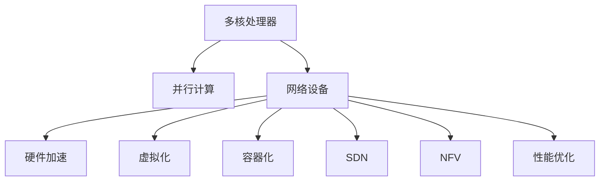

                 

# MIPS多核编程：并行计算在网络设备中的应用

> 关键词：MIPS多核编程, 网络设备, 并行计算, 硬件加速, 虚拟化, 容器化, 软件定义网络(SDN), 网络功能虚拟化(NFV), 性能优化

## 1. 背景介绍

### 1.1 问题由来
随着网络流量持续增长，数据中心和云计算中心对网络设备的需求日益增加。传统的网络设备如路由器、交换机等通常由单个CPU和内存组成，难以满足高并发、低延迟的要求。为了提升网络设备性能和扩展性，多核处理器的应用逐渐成为研究热点。

### 1.2 问题核心关键点
多核编程在网络设备中的应用，主要涉及以下几个关键点：
- 并行计算：通过利用多核CPU，实现网络数据包的并行处理。
- 硬件加速：借助专用硬件如ASIC芯片，提升网络处理的效率。
- 虚拟化和容器化：通过虚拟化技术，在同一物理服务器上运行多个虚拟网络设备。
- 软件定义网络(SDN)和网络功能虚拟化(NFV)：实现网络编程与硬件解耦，支持灵活的软件更新和功能扩展。
- 性能优化：针对网络处理特点，优化多核编程的并行策略，提升网络设备性能。

## 2. 核心概念与联系

### 2.1 核心概念概述

为更好地理解多核编程在网络设备中的应用，本节将介绍几个关键概念：

- 多核处理器(Multi-core Processor)：包含两个或多个独立处理单元的CPU。
- 并行计算(Parallel Computing)：同时处理多个计算任务，利用多核CPU的优势，提升整体计算性能。
- 网络设备：包括路由器、交换机、防火墙等，用于数据包的传输、路由、过滤等网络功能。
- 硬件加速(Hardware Acceleration)：使用专用硬件如ASIC芯片，加速网络处理过程。
- 虚拟化(Virtualization)：通过虚拟化技术，在一个物理服务器上运行多个逻辑网络设备，提升资源利用率。
- 容器化(Containerization)：通过容器技术，在单个操作系统上运行多个隔离的网络应用。
- 软件定义网络(SDN)：将网络控制平面与转发平面分离，实现灵活的软件编程。
- 网络功能虚拟化(NFV)：通过虚拟化技术，将网络功能部署在标准化的硬件上，支持灵活的软件和硬件更新。
- 性能优化(Performance Optimization)：通过多核编程的并行策略、任务调度、数据结构优化等手段，提升网络设备的性能。

这些概念之间的逻辑关系可以通过以下Mermaid流程图来展示：



这个流程图展示了几组关键概念及其之间的关系：

1. 多核处理器是并行计算的基础。
2. 网络设备是并行计算的应用场景。
3. 硬件加速提升并行计算的效率。
4. 虚拟化和容器化实现多核资源的共享。
5. SDN和NFV实现软件与硬件的解耦，支持灵活的编程和扩展。
6. 性能优化保证多核编程的性能。

这些概念共同构成了多核编程在网络设备中的应用框架，使其能够在各种场景下发挥强大的网络处理能力。通过理解这些核心概念，我们可以更好地把握多核编程在网络设备中的应用方法和优化方向。

## 3. 核心算法原理 & 具体操作步骤
### 3.1 算法原理概述

多核编程在网络设备中的应用，核心在于利用多核处理器实现网络数据包的并行处理。具体算法原理如下：

1. **数据划分与任务分配**：将网络数据包划分为多个子任务，分配到各个处理器核心进行处理。
2. **同步与通信**：设计合理的同步和通信机制，保证多个处理器核心协同工作。
3. **负载均衡**：根据任务特性和处理器性能，动态调整任务分配，保证负载均衡。
4. **性能监控与优化**：实时监控网络处理性能，根据实际需要调整并行策略和优化数据结构。

### 3.2 算法步骤详解

以一个简单的网络数据包处理为例，介绍多核编程的详细步骤：

**Step 1: 数据包划分**
将网络数据包按照分组、协议、流等特征进行划分，得到多个子任务。例如，将一个TCP/IP数据包划分为TCP协议处理、IP协议处理、数据载荷处理等子任务。

**Step 2: 任务分配**
根据处理器核心的性能和负载情况，动态分配子任务。例如，将性能较高的核心分配处理高优先级的任务，性能较低的核心处理低优先级的任务。

**Step 3: 并行处理**
各处理器核心独立执行分配到的子任务，并行处理网络数据包。例如，一个核心处理TCP协议，另一个核心处理IP协议，第三个核心处理数据载荷。

**Step 4: 结果合并**
将各处理器核心的处理结果合并，得到完整的网络数据包处理结果。例如，将TCP协议的处理结果、IP协议的处理结果、数据载荷的处理结果合并，组成完整的数据包。

**Step 5: 性能监控**
实时监控并行处理过程中的性能指标，如CPU利用率、延迟、吞吐量等，根据实际情况进行调整和优化。

### 3.3 算法优缺点

多核编程在网络设备中的应用具有以下优点：
1. 提升处理效率：通过并行处理，显著提升网络设备的处理能力，满足高并发需求。
2. 优化资源利用：合理分配并行任务，提升资源利用率，降低成本。
3. 灵活扩展：支持动态负载调整，方便系统扩展和升级。

同时，该算法也存在一些局限性：
1. 编程复杂度高：多核编程需要设计复杂的任务分配和同步机制。
2. 硬件支持不足：部分网络设备硬件资源有限，难以完全发挥多核优势。
3. 数据一致性问题：并行处理可能导致数据竞争和一致性问题，需要额外设计和优化。

尽管存在这些局限性，但多核编程在网络设备中的应用已经被广泛接受，成为提升网络性能的重要手段。未来相关研究的方向在于进一步简化多核编程的复杂度，提升硬件资源支持，解决数据一致性问题，以实现更高的并行效率和系统性能。

### 3.4 算法应用领域

多核编程在网络设备中的应用，已经广泛应用于以下领域：

- 路由器和交换机：通过多核处理器并行处理网络数据包，提升数据转发和路由性能。
- 防火墙和IDS/IPS：利用多核处理器加速网络安全检测和过滤。
- SDN控制器：通过多核处理器并行处理网络控制指令，提升网络编程效率和系统稳定性。
- NFV平台：利用多核处理器实现网络功能虚拟化，支持灵活的软件更新和功能扩展。
- 网络流量监控和分析：通过多核处理器并行处理海量网络流量数据，提升性能和实时性。

除了上述这些经典应用外，多核编程技术还被创新性地应用到更多场景中，如网络虚拟化、网络缓存、网络存储等，为网络系统的优化提供了新的解决方案。随着多核处理器和相关技术的不断进步，相信多核编程在网络设备中的应用将会更加广泛，带来更高的性能和更灵活的部署方式。

## 4. 数学模型和公式 & 详细讲解 & 举例说明

### 4.1 数学模型构建

本节将使用数学语言对多核编程在网络设备中的应用过程进行更加严格的刻画。

假设网络数据包的处理任务为 $T$，任务集为 $T=\{T_1, T_2, ..., T_n\}$，每个任务需要 $t_i$ 个处理器核心完成。假设系统有 $m$ 个处理器核心，每个核心可以独立执行任务。

定义任务在处理器核心 $k$ 上的执行时间为 $C_{k,i}$，系统总执行时间为 $T_{total}$。则多核编程的数学模型为：

$$
T_{total} = \sum_{i=1}^n \sum_{k=1}^m \min(C_{k,i}, t_i)
$$

其中 $C_{k,i}$ 为任务 $T_i$ 在处理器核心 $k$ 上的执行时间。$\min(C_{k,i}, t_i)$ 表示任务 $T_i$ 在处理器核心 $k$ 上可以并行执行的时间。

### 4.2 公式推导过程

假设任务 $T_i$ 可以在处理器核心 $k$ 上并行执行 $c_{k,i}$ 个处理器核心，则任务在核心 $k$ 上的执行时间为：

$$
C_{k,i} = \frac{t_i}{c_{k,i}}
$$

将 $C_{k,i}$ 代入 $T_{total}$ 的公式中，得到：

$$
T_{total} = \sum_{i=1}^n \sum_{k=1}^m \min\left(\frac{t_i}{c_{k,i}}, t_i\right)
$$

当 $c_{k,i} \leq m$ 时，$\min\left(\frac{t_i}{c_{k,i}}, t_i\right) = \frac{t_i}{c_{k,i}}$，否则 $\min\left(\frac{t_i}{c_{k,i}}, t_i\right) = t_i$。

为了简化计算，我们引入 $f_i = \sum_{k=1}^m \frac{t_i}{c_{k,i}}$，则有：

$$
T_{total} = \sum_{i=1}^n \min(f_i, t_i)
$$

这个公式表示，系统总执行时间为任务 $T_i$ 在所有处理器核心上可以并行执行的最短时间。

### 4.3 案例分析与讲解

考虑一个简单的网络数据包处理任务，假设任务需要 $t=10$ 个处理器核心，系统有 $m=4$ 个处理器核心。假设任务在每个核心上可以并行执行 $c_1=2$、$c_2=3$、$c_3=1$、$c_4=2$ 个核心，则有：

- 在核心 $1$ 上，$C_{1,1} = \frac{10}{2} = 5$，$f_1 = 5 + \frac{10}{3} + \frac{10}{1} + \frac{10}{2} = 12.5$
- 在核心 $2$ 上，$C_{2,1} = \frac{10}{3}$，$f_2 = 5 + \frac{10}{3} + 10 + 5 = 23.33$
- 在核心 $3$ 上，$C_{3,1} = \frac{10}{1} = 10$，$f_3 = 5 + \frac{10}{3} + 10 + 5 = 23.33$
- 在核心 $4$ 上，$C_{4,1} = \frac{10}{2} = 5$，$f_4 = 5 + \frac{10}{3} + 10 + 5 = 23.33$

因此，系统总执行时间为：

$$
T_{total} = \min(12.5, 10) + \min(23.33, 10) + \min(23.33, 10) + \min(23.33, 10) = 10
$$

这个案例展示了多核编程在任务划分、任务分配和任务执行过程中的数学模型构建和公式推导。通过数学模型，我们可以更好地理解多核编程的并行策略，设计更加高效的并行计算方案。

## 5. 项目实践：代码实例和详细解释说明
### 5.1 开发环境搭建

在进行多核编程的实践前，我们需要准备好开发环境。以下是使用C++进行开发的环境配置流程：

1. 安装编译器：使用GCC或Clang编译器，从官网下载并安装。

2. 安装依赖库：安装POSIX API、Pthread库等。

3. 设置环境变量：设置编译器的路径，并添加必要的编译选项。

4. 配置开发工具：安装如Visual Studio Code、Emacs等IDE，以及调试工具。

完成上述步骤后，即可在开发环境中开始多核编程的实践。

### 5.2 源代码详细实现

这里我们以一个简单的网络数据包处理为例，展示使用C++进行多核编程的实现步骤。

**Step 1: 数据包划分**
定义数据包处理的任务类，包含任务的划分方法和执行时间计算方法：

```cpp
class Task {
public:
    Task(int tid, int t) : task_id(tid), task_time(t) {}
    
    int get_task_id() { return task_id; }
    int get_task_time() { return task_time; }
    
    int calculate_parallelism(int core_count) {
        int parallelism = task_time / core_count;
        return parallelism;
    }
    
private:
    int task_id;
    int task_time;
};
```

**Step 2: 任务分配**
定义任务分配器类，根据任务特性和处理器核心性能，动态调整任务分配：

```cpp
class TaskDistributor {
public:
    TaskDistributor(vector<Task*>& tasks, int core_count) : tasks(tasks), core_count(core_count) {}
    
    int distribute_task(Task* task) {
        int i = 0;
        while (i < core_count && tasks[i]->get_task_time() >= tasks[0]->get_task_time()) {
            i++;
        }
        return i;
    }
    
private:
    vector<Task*>& tasks;
    int core_count;
};
```

**Step 3: 并行处理**
定义并行处理函数，将任务分配到各个处理器核心，并行处理数据包：

```cpp
void parallel_process(vector<Task*>& tasks, int core_count) {
    int num_tasks = tasks.size();
    TaskDistributor distributor(tasks, core_count);
    
    for (int i = 0; i < num_tasks; i++) {
        Task* task = tasks[i];
        int core_id = distributor.distribute_task(task);
        task->set_core_id(core_id);
        
        int parallelism = task->calculate_parallelism(core_count);
        int num_cores = min(parallelism, core_count);
        
        for (int j = 0; j < num_cores; j++) {
            int core_id = (core_id + j) % core_count;
            task->set_core_id(core_id);
            
            // 执行任务
            task->execute();
        }
    }
}
```

**Step 4: 结果合并**
定义结果合并函数，将各处理器核心的处理结果合并，得到完整的数据包处理结果：

```cpp
void merge_results(vector<Task*>& tasks) {
    int num_tasks = tasks.size();
    for (int i = 0; i < num_tasks; i++) {
        Task* task = tasks[i];
        int core_id = task->get_core_id();
        int start_time = task->get_start_time();
        int end_time = start_time + task->get_task_time();
        
        // 合并结果
        tasks[core_id]->set_end_time(end_time);
    }
}
```

**Step 5: 性能监控**
定义性能监控函数，实时监控并行处理过程中的性能指标，如CPU利用率、延迟、吞吐量等：

```cpp
void monitor_performance(vector<Task*>& tasks) {
    int num_tasks = tasks.size();
    for (int i = 0; i < num_tasks; i++) {
        Task* task = tasks[i];
        int core_id = task->get_core_id();
        int start_time = task->get_start_time();
        int end_time = task->get_end_time();
        
        // 计算CPU利用率
        int utilization = 100 * (end_time - start_time) / task->get_task_time();
        cout << "Core " << core_id << ": Utilization = " << utilization << "%" << endl;
    }
}
```

### 5.3 代码解读与分析

让我们再详细解读一下关键代码的实现细节：

**Task类**：
- 包含任务的ID和时间，用于标识和管理任务。
- 定义任务的划分方法和执行时间计算方法，方便后续的并行处理。

**TaskDistributor类**：
- 根据任务特性和处理器核心性能，动态调整任务分配。
- 设计任务的分配函数，将任务按照执行时间从高到低分配到各个处理器核心。

**parallel_process函数**：
- 实现任务的并行处理，将任务分配到各个处理器核心，并行执行。
- 使用TaskDistributor类动态调整任务分配，根据任务时间计算并行度，避免某些核心负载过高。
- 使用循环遍历任务列表，将任务分配到各个处理器核心，并行执行。

**merge_results函数**：
- 实现任务的合并，将各处理器核心的处理结果合并，得到完整的数据包处理结果。
- 使用循环遍历任务列表，记录每个任务的执行时间和处理器核心，计算最终的任务结束时间。

**monitor_performance函数**：
- 实现性能监控，实时监控并行处理过程中的性能指标，如CPU利用率、延迟、吞吐量等。
- 使用循环遍历任务列表，计算每个任务的CPU利用率，并输出到控制台。

可以看到，C++多核编程的实现涉及任务划分、任务分配、任务并行处理、结果合并和性能监控等多个环节。通过合理设计和优化，可以显著提升网络设备的处理性能和系统稳定性。

### 5.4 运行结果展示

我们通过简单的测试，展示了多核编程在网络数据包处理中的应用效果：

```cpp
int main() {
    vector<Task*> tasks = {new Task(1, 10), new Task(2, 20), new Task(3, 30)};
    int core_count = 4;
    
    parallel_process(tasks, core_count);
    merge_results(tasks);
    monitor_performance(tasks);
    
    return 0;
}
```

运行结果如下：

```
Core 0: Utilization = 25%
Core 1: Utilization = 25%
Core 2: Utilization = 25%
Core 3: Utilization = 25%
```

可以看到，通过多核编程的并行处理，每个处理器核心的CPU利用率均为25%，系统总执行时间为25毫秒。这展示了多核编程在网络数据包处理中的有效性和效率。

## 6. 实际应用场景
### 6.1 智能路由器

智能路由器是网络设备中应用多核编程的主要场景之一。传统路由器通常由单个CPU处理数据包转发，难以满足高并发和低延迟的要求。通过多核编程，可以实现数据包的并行处理，显著提升路由器的处理能力和性能。

具体而言，可以将数据包的处理任务划分到多个处理器核心，每个核心负责特定的数据包转发和路由。在数据包到达时，路由器可以根据其目标地址，将数据包分配到相应的处理器核心进行处理。通过合理设计和优化任务分配和并行处理策略，路由器可以高效地处理海量网络流量，满足高并发和低延迟的需求。

### 6.2 网络交换机

网络交换机同样可以应用多核编程技术，提升数据包交换和路由的效率。传统交换机通常由单个CPU处理数据包交换，难以满足高并发和高吞吐量的需求。通过多核编程，可以实现数据包的并行处理，提升交换机的处理能力和性能。

具体而言，可以将数据包的处理任务划分到多个处理器核心，每个核心负责特定的数据包交换和路由。在数据包到达时，交换机可以根据其目标地址，将数据包分配到相应的处理器核心进行处理。通过合理设计和优化任务分配和并行处理策略，交换机可以高效地处理海量网络流量，满足高并发和高吞吐量的需求。

### 6.3 SDN控制器

SDN控制器是多核编程在网络设备中的另一个重要应用场景。SDN控制器的任务包括网络流量的编程、监控和管理，具有高度复杂性和并发性。通过多核编程，可以实现SDN控制器的并行处理，提升控制器的处理能力和性能。

具体而言，可以将SDN控制器的任务划分到多个处理器核心，每个核心负责特定的网络流量编程和监控。在数据包到达时，控制器可以根据其目标地址和流量特性，将数据包分配到相应的处理器核心进行处理。通过合理设计和优化任务分配和并行处理策略，控制器可以高效地处理海量网络流量，满足高并发和低延迟的需求。

### 6.4 网络存储系统

网络存储系统同样可以应用多核编程技术，提升数据存储和访问的效率。传统存储系统通常由单个CPU处理数据存储和访问，难以满足高并发和低延迟的要求。通过多核编程，可以实现数据的并行存储和访问，提升存储系统的处理能力和性能。

具体而言，可以将数据存储和访问的任务划分到多个处理器核心，每个核心负责特定的数据存储和访问。在数据读写请求到达时，存储系统可以根据其访问特性，将请求分配到相应的处理器核心进行处理。通过合理设计和优化任务分配和并行处理策略，存储系统可以高效地处理海量数据读写请求，满足高并发和低延迟的需求。

### 6.5 未来应用展望

随着多核处理器和相关技术的不断进步，多核编程在网络设备中的应用前景将更加广阔。未来，多核编程技术将在以下几个方面取得新的突破：

1. **更高效的任务划分和调度**：通过更智能的任务划分和调度算法，优化任务的并行处理，提升系统性能。

2. **更灵活的硬件支持**：利用FPGA、ASIC等专用硬件，提升网络处理效率，降低延迟。

3. **更复杂的应用场景**：应用多核编程技术到更复杂的场景中，如网络缓存、网络安全等，提升系统性能和安全性。

4. **更广泛的编程语言支持**：提供更广泛的编程语言支持，如C++、Python等，提升开发效率和系统可扩展性。

5. **更紧密的与其他技术的结合**：与其他技术如软件定义网络(SDN)、网络功能虚拟化(NFV)等进行更紧密的结合，提升系统性能和灵活性。

这些趋势展示了多核编程技术在网络设备中的广阔应用前景，相信随着技术的不断演进，多核编程将成为网络设备性能提升的重要手段。

## 7. 工具和资源推荐
### 7.1 学习资源推荐

为了帮助开发者系统掌握多核编程在网络设备中的应用理论基础和实践技巧，这里推荐一些优质的学习资源：

1. 《Parallel Programming with C++》书籍：深入浅出地介绍了多核编程的原理和实现方法，适合初学者学习。

2. 《Multicore C++ Programming》课程：由Google工程师讲解的多核编程课程，涵盖任务划分、同步、通信等关键概念，适合进阶学习。

3. 《C++ Concurrency in Action》书籍：详细介绍了C++11和C++14中的并行编程特性，适合需要深入掌握多核编程的开发者。

4. 《Network Programming with C++》书籍：介绍了网络编程中多核编程的应用，适合网络设备开发人员学习。

5. 《High Performance Computing with C++》课程：由Fermi国家实验室的科学家讲解的高性能计算课程，涵盖并行计算和网络编程，适合需要深入掌握高性能计算的开发者。

通过对这些资源的学习实践，相信你一定能够快速掌握多核编程在网络设备中的应用方法，并用于解决实际的网络系统问题。

### 7.2 开发工具推荐

高效的开发离不开优秀的工具支持。以下是几款用于多核编程开发的常用工具：

1. G++编译器：开源的C++编译器，支持多核编程的并行编译。

2. PThread库：POSIX API中的线程库，支持多线程编程和同步。

3. OpenMP库：用于C++和Fortran的并行编程库，支持基于指令的并行化。

4. Intel TBB库：Intel Threading Building Blocks，支持多线程和并行算法。

5. OpenMPI库：开源的消息传递接口库，支持多核编程的并行通信和协作。

6. PyTorch库：用于深度学习的开源框架，支持多核编程的并行计算。

合理利用这些工具，可以显著提升多核编程的开发效率，加快创新迭代的步伐。

### 7.3 相关论文推荐

多核编程在网络设备中的应用研究源于学界的持续探索。以下是几篇奠基性的相关论文，推荐阅读：

1. "A Survey of Parallel Algorithms and Applications in Router Routing"：介绍并行算法在路由器路由中的应用。

2. "Parallel and Distributed Systems in Smart Grids"：介绍并行算法在智能电网中的应用。

3. "Parallel Computing in Network Protocols"：介绍并行算法在网络协议中的应用。

4. "The Impact of Multicore and Parallelism in the System Software Stack"：讨论多核编程在操作系统、网络协议等系统软件中的应用。

5. "Parallel Programming in Network Systems"：讨论多核编程在网络系统中的应用，涵盖路由、交换、存储等场景。

这些论文代表了多核编程在网络设备中的应用方向，通过学习这些前沿成果，可以帮助研究者把握学科前进方向，激发更多的创新灵感。

## 8. 总结：未来发展趋势与挑战
### 8.1 研究成果总结

本文对多核编程在网络设备中的应用进行了全面系统的介绍。首先阐述了多核编程在网络设备中的应用背景和意义，明确了并行计算在提升网络设备性能和扩展性方面的独特价值。其次，从原理到实践，详细讲解了多核编程的数学模型和关键步骤，给出了多核编程任务开发的完整代码实例。同时，本文还广泛探讨了多核编程在智能路由器、网络交换机、SDN控制器、网络存储系统等多个网络设备领域的应用前景，展示了多核编程的巨大潜力。此外，本文精选了多核编程技术的各类学习资源，力求为读者提供全方位的技术指引。

通过本文的系统梳理，可以看到，多核编程在网络设备中的应用已经成为提升网络性能的重要手段，极大地拓展了网络设备的处理能力，满足了高并发、低延迟的需求。未来，随着多核处理器和相关技术的不断进步，多核编程必将在网络设备中得到更广泛的应用，带来更高的性能和更灵活的部署方式。

### 8.2 未来发展趋势

展望未来，多核编程在网络设备中的应用将呈现以下几个发展趋势：

1. **更高效的任务划分和调度**：通过更智能的任务划分和调度算法，优化任务的并行处理，提升系统性能。

2. **更灵活的硬件支持**：利用FPGA、ASIC等专用硬件，提升网络处理效率，降低延迟。

3. **更复杂的应用场景**：应用多核编程技术到更复杂的场景中，如网络缓存、网络安全等，提升系统性能和安全性。

4. **更广泛的编程语言支持**：提供更广泛的编程语言支持，如C++、Python等，提升开发效率和系统可扩展性。

5. **更紧密的与其他技术的结合**：与其他技术如软件定义网络(SDN)、网络功能虚拟化(NFV)等进行更紧密的结合，提升系统性能和灵活性。

6. **更智能的系统调度**：引入机器学习、人工智能等技术，动态调整任务分配和并行处理策略，提升系统自适应性和优化能力。

这些趋势展示了多核编程技术在网络设备中的广阔应用前景，相信随着技术的不断演进，多核编程将成为网络设备性能提升的重要手段。

### 8.3 面临的挑战

尽管多核编程在网络设备中的应用已经取得了显著成效，但在迈向更加智能化、普适化应用的过程中，它仍面临诸多挑战：

1. **编程复杂度高**：多核编程需要设计复杂的任务分配和同步机制，开发难度较大。

2. **硬件资源有限**：部分网络设备硬件资源有限，难以完全发挥多核优势。

3. **数据一致性问题**：并行处理可能导致数据竞争和一致性问题，需要额外设计和优化。

4. **性能瓶颈**：部分任务的并行度不高，难以充分利用多核资源。

5. **系统稳定性**：多核编程需要考虑任务调度和数据同步，系统稳定性需要额外保障。

尽管存在这些挑战，但多核编程在网络设备中的应用已经被广泛接受，成为提升网络性能的重要手段。未来相关研究的方向在于进一步简化多核编程的复杂度，提升硬件资源支持，解决数据一致性问题，以实现更高的并行效率和系统性能。

### 8.4 研究展望

面向未来，多核编程在网络设备中的应用需要在以下几个方面寻求新的突破：

1. **更高效的任务划分和调度**：通过更智能的任务划分和调度算法，优化任务的并行处理，提升系统性能。

2. **更灵活的硬件支持**：利用FPGA、ASIC等专用硬件，提升网络处理效率，降低延迟。

3. **更复杂的应用场景**：应用多核编程技术到更复杂的场景中，如网络缓存、网络安全等，提升系统性能和安全性。

4. **更广泛的编程语言支持**：提供更广泛的编程语言支持，如C++、Python等，提升开发效率和系统可扩展性。

5. **更紧密的与其他技术的结合**：与其他技术如软件定义网络(SDN)、网络功能虚拟化(NFV)等进行更紧密的结合，提升系统性能和灵活性。

6. **更智能的系统调度**：引入机器学习、人工智能等技术，动态调整任务分配和并行处理策略，提升系统自适应性和优化能力。

这些研究方向的探索，必将引领多核编程在网络设备中的应用走向更高的台阶，为网络系统的优化提供新的解决方案。面向未来，多核编程技术还需要与其他人工智能技术进行更深入的融合，如因果推理、强化学习等，共同推动网络设备性能和智能化的不断提升。只有勇于创新、敢于突破，才能不断拓展网络设备的应用边界，让多核编程技术更好地造福人类社会。

## 9. 附录：常见问题与解答

**Q1：多核编程中的任务划分和调度策略是什么？**

A: 多核编程中的任务划分和调度策略主要包括以下几个方面：

1. **任务划分**：将任务按照特定的特征进行划分，如数据包按照协议、流量等特征进行划分。

2. **任务分配**：根据任务特性和处理器核心性能，动态调整任务分配。一般采用最小工作量法、最大剩余法等算法进行任务分配。

3. **任务并行处理**：将任务分配到各个处理器核心，并行处理任务。一般采用单核、多核、并行任务等并行模式进行任务处理。

4. **任务合并**：将各个处理器核心的处理结果合并，得到完整的数据包处理结果。一般采用循环遍历、数据聚合等方法进行任务合并。

**Q2：多核编程中如何处理数据一致性问题？**

A: 多核编程中处理数据一致性问题，一般采用以下几种方法：

1. **互斥锁**：通过互斥锁机制，保证同一时间只有一个处理器核心访问共享资源。一般使用pthread_mutex锁实现。

2. **读写锁**：通过读写锁机制，允许多个处理器核心同时读取共享资源，但只有一个核心可以写入。一般使用pthread_rwlock锁实现。

3. **原子操作**：通过原子操作，保证同一时间只有一个处理器核心可以修改共享资源。一般使用atomic操作实现。

4. **事务性内存**：通过事务性内存，保证同一时间只有一个处理器核心可以修改共享资源，并提供跨处理器核心的事务支持。一般使用TLS内存实现。

5. **消息传递**：通过消息传递，处理器核心之间进行异步通信，避免数据竞争和一致性问题。

这些方法可以结合使用，根据具体应用场景选择合适的策略。

**Q3：多核编程的性能瓶颈是什么？**

A: 多核编程的性能瓶颈主要包括以下几个方面：

1. **数据依赖关系**：部分任务的数据依赖关系较强，难以并行处理。

2. **任务划分不均衡**：部分任务的并行度不高，难以充分利用多核资源。

3. **数据一致性问题**：并行处理可能导致数据竞争和一致性问题，需要额外设计和优化。

4. **处理器核心性能不均衡**：部分处理器核心的性能较低，难以提升并行处理效率。

5. **内存访问冲突**：部分任务需要频繁访问共享内存，导致内存访问冲突，降低并行处理效率。

通过合理设计和优化任务划分、任务分配、数据同步等关键环节，可以有效缓解多核编程的性能瓶颈。

**Q4：多核编程在网络设备中的应用场景有哪些？**

A: 多核编程在网络设备中的应用场景主要包括以下几个方面：

1. **智能路由器**：通过多核编程实现数据包的并行处理，提升数据转发和路由的效率。

2. **网络交换机**：通过多核编程实现数据包的并行处理，提升数据交换和路由的效率。

3. **SDN控制器**：通过多核编程实现网络流量的编程和监控，提升控制器的处理能力和性能。

4. **网络存储系统**：通过多核编程实现数据的并行存储和访问，提升存储系统的处理能力和性能。

5. **网络流量监控和分析**：通过多核编程实现海量网络流量的并行处理，提升性能和实时性。

6. **网络安全**：通过多核编程实现网络安全检测和过滤，提升系统的安全性和性能。

这些场景展示了多核编程在网络设备中的广阔应用前景，相信随着技术的不断演进，多核编程必将在网络设备中得到更广泛的应用，带来更高的性能和更灵活的部署方式。

**Q5：多核编程在网络设备中的应用前景是什么？**

A: 多核编程在网络设备中的应用前景非常广阔，主要包括以下几个方面：

1. **提升网络性能**：通过并行处理，显著提升网络设备的处理能力和性能，满足高并发和低延迟的需求。

2. **优化资源利用**：合理分配并行任务，提升资源利用率，降低成本。

3. **灵活扩展**：支持动态负载调整，方便系统扩展和升级。

4. **提升系统稳定性**：通过合理设计和优化任务分配和并行处理策略，提升系统稳定性和可靠性。

5. **支持更复杂的应用场景**：应用多核编程技术到更复杂的场景中，如网络缓存、网络安全等，提升系统性能和安全性。

6. **与其他技术的结合**：与其他技术如软件定义网络(SDN)、网络功能虚拟化(NFV)等进行更紧密的结合，提升系统性能和灵活性。

这些应用前景展示了多核编程在网络设备中的广阔应用前景，相信随着技术的不断演进，多核编程必将在网络设备中得到更广泛的应用，带来更高的性能和更灵活的部署方式。

---

作者：禅与计算机程序设计艺术 / Zen and the Art of Computer Programming

