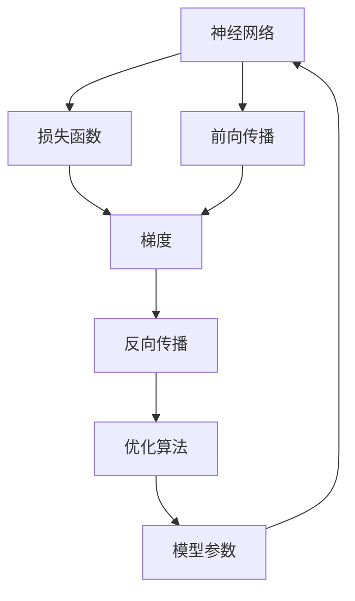

                 

# Micrograd：探索机器学习和反向传播

## 1. 背景介绍

机器学习（Machine Learning, ML）作为人工智能（AI）的重要分支，近年来得到了迅猛发展。其中，反向传播（Backpropagation）作为机器学习模型训练的核心算法，扮演着至关重要的角色。然而，大多数机器学习从业者对反向传播的原理及其应用仍有诸多困惑。本文旨在通过深入浅出的语言，探讨反向传播的核心理念和具体实现，帮助读者理解和掌握这一关键技术。

### 1.1 问题由来

机器学习模型的训练过程中，通常涉及大量的参数优化。而反向传播算法通过计算模型输出与实际标签之间的误差，反向传播误差并更新模型参数，从而不断优化模型预测结果。这一过程不仅影响模型的训练效率，也决定了模型的性能表现。因此，深入理解反向传播算法，对于优化机器学习模型的训练过程至关重要。

### 1.2 问题核心关键点

反向传播算法主要包含以下核心概念和关键点：

- 激活函数（Activation Function）：在神经网络中，激活函数将线性变换后的结果转化为非线性输出，是构建复杂模型结构的基础。
- 损失函数（Loss Function）：用于衡量模型输出与真实标签之间的差异，常见的损失函数包括均方误差（MSE）、交叉熵损失（Cross-Entropy Loss）等。
- 梯度（Gradient）：梯度描述了误差函数相对于模型参数的微小变化量，反向传播的核心在于计算梯度并更新参数。
- 链式法则（Chain Rule）：反向传播的核心原理，通过链式法则计算梯度。
- 反向传播算法（Backpropagation Algorithm）：具体实现反向传播的过程，分为前向传播和反向传播两个步骤。
- 反向传播的优化算法（Optimizer）：如梯度下降（Gradient Descent）、动量优化（Momentum）、Adam等，用于优化模型参数。

本文将围绕这些关键点，系统阐述反向传播的原理和实现过程，并结合实际案例，展示其在机器学习模型训练中的应用。

## 2. 核心概念与联系

### 2.1 核心概念概述

为了更好地理解反向传播算法，本节将介绍几个密切相关的核心概念：

- 神经网络（Neural Network）：由大量神经元（Neuron）连接而成的网络结构，用于处理和学习输入数据。
- 损失函数（Loss Function）：用于衡量模型输出与真实标签之间的差异，常见的损失函数包括均方误差（MSE）、交叉熵损失（Cross-Entropy Loss）等。
- 梯度（Gradient）：描述误差函数相对于模型参数的微小变化量，反向传播的核心在于计算梯度并更新参数。
- 链式法则（Chain Rule）：用于计算复杂函数导数的重要法则，是反向传播的核心原理。
- 反向传播算法（Backpropagation Algorithm）：具体实现反向传播的过程，分为前向传播和反向传播两个步骤。
- 反向传播的优化算法（Optimizer）：如梯度下降（Gradient Descent）、动量优化（Momentum）、Adam等，用于优化模型参数。

这些核心概念之间的逻辑关系可以通过以下Mermaid流程图来展示：



这个流程图展示了一系列关键概念之间的联系：

1. 神经网络通过前向传播计算输出。
2. 将输出与真实标签计算损失函数。
3. 通过链式法则计算梯度。
4. 反向传播计算梯度并更新参数。
5. 使用优化算法调整参数，更新神经网络。

这些概念共同构成了反向传播算法的基本框架，使得神经网络能够通过不断学习，逐步提升模型性能。

## 3. 核心算法原理 & 具体操作步骤

### 3.1 算法原理概述

反向传播算法通过计算模型输出与实际标签之间的误差，反向传播误差并更新模型参数，从而不断优化模型预测结果。其核心在于利用链式法则计算梯度，并根据梯度调整模型参数。

形式化地，设神经网络模型为 $f_\theta(x)$，其中 $\theta$ 为模型参数，$x$ 为输入数据，$y$ 为真实标签。模型的预测输出为 $\hat{y} = f_\theta(x)$。损失函数为 $\mathcal{L}(y, \hat{y})$。反向传播的目标是找到最优参数 $\theta^*$，使得 $\mathcal{L}(y, f_\theta(x))$ 最小化。

具体而言，反向传播分为两个主要步骤：前向传播和反向传播。

**前向传播**：从输入数据 $x$ 开始，按照网络结构顺序计算每个神经元的输出。每个神经元的输出由激活函数 $\sigma$ 和权重矩阵 $W$ 计算得到：

$$
z = Wx + b
$$

$$
a = \sigma(z)
$$

其中 $b$ 为偏置项。通过不断计算，直到输出层得到最终预测 $\hat{y}$。

**反向传播**：从输出层开始，根据预测结果 $\hat{y}$ 和真实标签 $y$ 计算损失函数 $\mathcal{L}(y, \hat{y})$。根据链式法则，计算每个神经元的梯度：

$$
\frac{\partial \mathcal{L}}{\partial a_i} = \frac{\partial \mathcal{L}}{\partial z_i} \frac{\partial z_i}{\partial a_i} = \frac{\partial \mathcal{L}}{\partial z_i} \sigma'(z_i)
$$

其中 $\sigma'(z)$ 为激活函数的导数。通过不断反向传播计算梯度，最终得到每个参数的梯度。

### 3.2 算法步骤详解

反向传播算法分为以下关键步骤：

**Step 1: 初始化参数和损失函数**

- 随机初始化神经网络中的权重矩阵 $W$ 和偏置项 $b$。
- 选择适当的损失函数 $\mathcal{L}(y, \hat{y})$，如均方误差（MSE）、交叉熵损失（Cross-Entropy Loss）等。

**Step 2: 前向传播**

- 将输入数据 $x$ 输入神经网络，按照网络结构顺序计算每个神经元的输出。
- 重复计算直至输出层，得到预测结果 $\hat{y}$。

**Step 3: 计算梯度**

- 根据预测结果 $\hat{y}$ 和真实标签 $y$ 计算损失函数 $\mathcal{L}(y, \hat{y})$。
- 使用链式法则计算每个神经元的梯度，并将梯度传递回输入层。
- 最终得到模型参数 $\theta$ 的梯度。

**Step 4: 更新参数**

- 根据学习率 $\eta$ 和梯度更新模型参数：

$$
\theta = \theta - \eta \frac{\partial \mathcal{L}}{\partial \theta}
$$

**Step 5: 重复迭代**

- 重复执行Step 2到Step 4，直至达到预设的迭代次数或满足停止条件。

### 3.3 算法优缺点

反向传播算法具有以下优点：

- 高效计算梯度：通过链式法则，反向传播算法可以高效计算梯度，从而优化模型参数。
- 广泛应用：反向传播算法适用于各种机器学习模型，包括神经网络、支持向量机（SVM）、线性回归等。
- 自动学习复杂特征：通过反向传播算法，神经网络能够自动学习复杂的特征表示，提高模型性能。

然而，反向传播算法也存在一些局限性：

- 对初始参数敏感：若初始参数设置不当，反向传播算法可能陷入局部最优解。
- 过拟合风险：若训练集过小或复杂度过高，反向传播算法可能导致模型过拟合。
- 计算复杂度高：对于大规模神经网络，反向传播算法的计算复杂度较高，需要优化计算效率。

尽管存在这些局限性，反向传播算法仍然是机器学习模型训练的核心算法，广泛应用于各种实际应用中。

### 3.4 算法应用领域

反向传播算法在机器学习领域得到了广泛应用，涵盖以下几个主要领域：

- 图像识别：利用反向传播算法训练卷积神经网络（CNN），实现图像分类、目标检测等任务。
- 自然语言处理（NLP）：通过反向传播算法训练循环神经网络（RNN）、长短期记忆网络（LSTM）等模型，实现文本分类、语言生成、机器翻译等任务。
- 语音识别：利用反向传播算法训练深度神经网络（DNN），实现语音识别、语音合成等任务。
- 强化学习：通过反向传播算法训练策略网络（Policy Network），实现智能决策和控制任务。

除了上述这些领域外，反向传播算法还被广泛应用于时间序列预测、推荐系统、生物信息学等领域，展示了其强大的应用价值。

## 4. 数学模型和公式 & 详细讲解 & 举例说明

### 4.1 数学模型构建

本节将使用数学语言对反向传播算法进行更加严格的刻画。

设神经网络模型为 $f_\theta(x)$，其中 $\theta$ 为模型参数，$x$ 为输入数据，$y$ 为真实标签。模型的预测输出为 $\hat{y} = f_\theta(x)$。假设损失函数为 $\mathcal{L}(y, \hat{y})$，如均方误差（MSE）或交叉熵损失（Cross-Entropy Loss）。

反向传播的核心在于计算梯度 $\frac{\partial \mathcal{L}}{\partial \theta}$，并根据梯度更新参数 $\theta$。根据链式法则，梯度的计算过程可以表示为：

$$
\frac{\partial \mathcal{L}}{\partial \theta} = \frac{\partial \mathcal{L}}{\partial y} \frac{\partial y}{\partial \hat{y}} \frac{\partial \hat{y}}{\partial \theta}
$$

其中 $\frac{\partial \mathcal{L}}{\partial y}$ 为损失函数对真实标签的梯度，$\frac{\partial y}{\partial \hat{y}}$ 为输出层的激活函数导数，$\frac{\partial \hat{y}}{\partial \theta}$ 为参数梯度。

### 4.2 公式推导过程

以单层神经网络为例，展示反向传播算法的推导过程。

设神经元 $i$ 的输入为 $z_i = w_ix_i + b_i$，激活函数为 $\sigma$，输出为 $a_i = \sigma(z_i)$。假设模型有 $n$ 个神经元，输入数据 $x$ 为 $d$ 维向量。

**前向传播**：从输入层开始，按照网络结构顺序计算每个神经元的输出。设输出层的激活函数为 $\sigma'$，则输出层的梯度为：

$$
\frac{\partial \mathcal{L}}{\partial y} = -\frac{1}{m} \frac{\partial \mathcal{L}}{\partial \hat{y}} \sigma'(\hat{y})
$$

其中 $m$ 为训练样本数量。输出层的参数梯度为：

$$
\frac{\partial \mathcal{L}}{\partial \theta} = \frac{\partial \mathcal{L}}{\partial \hat{y}} \frac{\partial \hat{y}}{\partial z} \frac{\partial z}{\partial \theta}
$$

将 $\frac{\partial \mathcal{L}}{\partial y}$ 代入，得：

$$
\frac{\partial \mathcal{L}}{\partial \theta} = -\frac{1}{m} \frac{\partial \mathcal{L}}{\partial \hat{y}} \sigma'(\hat{y}) \frac{\partial \hat{y}}{\partial z} \frac{\partial z}{\partial \theta}
$$

**反向传播**：从输出层开始，计算每个神经元的梯度。设隐藏层 $j$ 的激活函数为 $\sigma_j$，则隐藏层的梯度为：

$$
\frac{\partial \mathcal{L}}{\partial a_j} = \frac{\partial \mathcal{L}}{\partial z_j} \frac{\partial z_j}{\partial a_j} = \frac{\partial \mathcal{L}}{\partial z_j} \sigma'_j(z_j)
$$

将 $\frac{\partial \mathcal{L}}{\partial a_j}$ 代入，得：

$$
\frac{\partial \mathcal{L}}{\partial a_j} = -\frac{1}{m} \frac{\partial \mathcal{L}}{\partial \hat{y}} \frac{\partial \hat{y}}{\partial z} \frac{\partial z}{\partial a_j} \sigma'(z) \sigma'_j(z)
$$

通过不断反向传播计算梯度，最终得到模型参数 $\theta$ 的梯度。

### 4.3 案例分析与讲解

以手写数字识别为例，展示反向传播算法的应用。

假设手写数字识别任务中有 $m$ 个训练样本，每个样本为 $d$ 维向量，输出层有 $10$ 个神经元，分别对应 $0$ 到 $9$ 的数字。使用均方误差（MSE）作为损失函数，输出层的激活函数为 $\sigma$，隐藏层的激活函数为 $\sigma_j$。

**前向传播**：将输入数据 $x$ 输入神经网络，按照网络结构顺序计算每个神经元的输出。设输出层的梯度为 $\frac{\partial \mathcal{L}}{\partial y}$，则：

$$
\frac{\partial \mathcal{L}}{\partial y} = -\frac{1}{m} \frac{\partial \mathcal{L}}{\partial \hat{y}} \sigma'(\hat{y})
$$

**反向传播**：从输出层开始，计算每个神经元的梯度。设隐藏层 $j$ 的梯度为 $\frac{\partial \mathcal{L}}{\partial a_j}$，则：

$$
\frac{\partial \mathcal{L}}{\partial a_j} = -\frac{1}{m} \frac{\partial \mathcal{L}}{\partial \hat{y}} \frac{\partial \hat{y}}{\partial z} \frac{\partial z}{\partial a_j} \sigma'(z) \sigma'_j(z)
$$

通过不断反向传播计算梯度，最终得到模型参数 $\theta$ 的梯度，并根据梯度更新参数，不断优化模型预测结果。

## 5. 项目实践：代码实例和详细解释说明

### 5.1 开发环境搭建

在进行反向传播算法实践前，我们需要准备好开发环境。以下是使用Python进行PyTorch开发的环境配置流程：

1. 安装Anaconda：从官网下载并安装Anaconda，用于创建独立的Python环境。

2. 创建并激活虚拟环境：
```bash
conda create -n pytorch-env python=3.8 
conda activate pytorch-env
```

3. 安装PyTorch：根据CUDA版本，从官网获取对应的安装命令。例如：
```bash
conda install pytorch torchvision torchaudio cudatoolkit=11.1 -c pytorch -c conda-forge
```

4. 安装TensorFlow：
```bash
pip install tensorflow
```

5. 安装PyTorch库：
```bash
pip install torch torchvision torchaudio
```

6. 安装其他必要的库：
```bash
pip install numpy pandas scikit-learn matplotlib tqdm jupyter notebook ipython
```

完成上述步骤后，即可在`pytorch-env`环境中开始反向传播算法的实践。

### 5.2 源代码详细实现

下面我们以手写数字识别任务为例，给出使用PyTorch实现反向传播算法的代码实现。

首先，定义神经网络模型：

```python
import torch
import torch.nn as nn
import torch.optim as optim
import torch.nn.functional as F

class Net(nn.Module):
    def __init__(self):
        super(Net, self).__init__()
        self.fc1 = nn.Linear(784, 128)
        self.fc2 = nn.Linear(128, 64)
        self.fc3 = nn.Linear(64, 10)

    def forward(self, x):
        x = x.view(-1, 784)
        x = F.relu(self.fc1(x))
        x = F.relu(self.fc2(x))
        x = self.fc3(x)
        return x
```

然后，定义训练函数：

```python
def train(model, device, train_loader, optimizer, epoch):
    model.train()
    for batch_idx, (data, target) in enumerate(train_loader):
        data, target = data.to(device), target.to(device)
        optimizer.zero_grad()
        output = model(data)
        loss = F.nll_loss(output, target)
        loss.backward()
        optimizer.step()
        if batch_idx % 100 == 0:
            print('Train Epoch: {} [{}/{} ({:.0f}%)]\tLoss: {:.6f}'.format(
                epoch, batch_idx * len(data), len(train_loader.dataset),
                100. * batch_idx / len(train_loader), loss.item()))
```

接着，定义评估函数：

```python
def test(model, device, test_loader):
    model.eval()
    test_loss = 0
    correct = 0
    with torch.no_grad():
        for data, target in test_loader:
            data, target = data.to(device), target.to(device)
            output = model(data)
            test_loss += F.nll_loss(output, target, reduction='sum').item()
            pred = output.argmax(dim=1, keepdim=True)
            correct += pred.eq(target.view_as(pred)).sum().item()

    test_loss /= len(test_loader.dataset)
    print('\nTest set: Average loss: {:.4f}, Accuracy: {}/{} ({:.0f}%)\n'.format(
        test_loss, correct, len(test_loader.dataset),
        100. * correct / len(test_loader.dataset)))
```

最后，启动训练流程并在测试集上评估：

```python
device = torch.device("cuda" if torch.cuda.is_available() else "cpu")

model = Net().to(device)
optimizer = optim.SGD(model.parameters(), lr=0.001, momentum=0.9)

train_loader = torch.utils.data.DataLoader(train_dataset, batch_size=64, shuffle=True)
test_loader = torch.utils.data.DataLoader(test_dataset, batch_size=1000, shuffle=False)

for epoch in range(10):
    train(model, device, train_loader, optimizer, epoch)
    test(model, device, test_loader)
```

以上就是使用PyTorch实现反向传播算法的完整代码实现。可以看到，反向传播算法通过梯度下降等优化算法，不断更新模型参数，以最小化损失函数。这一过程使得模型能够逐步逼近最优解，提升预测精度。

### 5.3 代码解读与分析

让我们再详细解读一下关键代码的实现细节：

**Net类**：
- `__init__`方法：初始化神经网络的结构，包括两个全连接层和输出层。
- `forward`方法：定义前向传播过程，将输入数据传递给神经网络计算输出。

**train函数**：
- 对训练集数据进行批处理，每次迭代输入一批数据。
- 计算模型输出，并计算损失函数。
- 反向传播计算梯度，并根据梯度更新模型参数。
- 输出每个epoch的平均损失。

**test函数**：
- 对测试集数据进行批处理，计算模型输出和损失函数。
- 输出测试集上的平均损失和精度。

**训练流程**：
- 定义总的epoch数，开始循环迭代
- 在每个epoch内，先进行训练，输出训练集上的平均损失
- 在测试集上评估模型，输出测试集上的平均损失和精度

可以看到，PyTorch提供了强大的深度学习框架，使得反向传播算法的实现变得简洁高效。开发者可以将更多精力放在数据处理、模型改进等高层逻辑上，而不必过多关注底层的实现细节。

当然，工业级的系统实现还需考虑更多因素，如模型的保存和部署、超参数的自动搜索、更灵活的任务适配层等。但核心的反向传播范式基本与此类似。

## 6. 实际应用场景

### 6.1 图像识别

反向传播算法在图像识别领域得到了广泛应用，特别是在卷积神经网络（CNN）的训练中。例如，通过反向传播算法训练CNN模型，实现图像分类、目标检测等任务。

在实践中，可以收集大量图像数据，并将每张图片归为一类。使用反向传播算法训练CNN模型，使得模型能够自动学习图像特征，从而实现对各类图像的分类和识别。

### 6.2 自然语言处理（NLP）

反向传播算法同样适用于自然语言处理（NLP）领域。通过反向传播算法训练循环神经网络（RNN）、长短期记忆网络（LSTM）等模型，实现文本分类、语言生成、机器翻译等任务。

以机器翻译为例，可以将输入的语言序列转化为输出语言序列，并使用反向传播算法训练模型，最小化预测序列与真实序列之间的差异。通过不断调整模型参数，使得模型能够逐步逼近最优解，提高翻译质量。

### 6.3 强化学习

反向传播算法在强化学习中也有重要应用。通过反向传播算法训练策略网络（Policy Network），实现智能决策和控制任务。例如，在控制机器人运动、自动驾驶等任务中，通过反向传播算法训练模型，实现对环境变化的响应和决策优化。

## 7. 工具和资源推荐

### 7.1 学习资源推荐

为了帮助开发者系统掌握反向传播算法的理论基础和实践技巧，这里推荐一些优质的学习资源：

1. 《深度学习》书籍：由Ian Goodfellow等撰写，全面介绍了深度学习的基本概念和算法。
2. 《Python深度学习》书籍：由Francois Chollet撰写，详细介绍了TensorFlow和Keras的使用，涵盖反向传播算法等核心技术。
3. CS231n《卷积神经网络》课程：斯坦福大学开设的深度学习课程，介绍了CNN模型的实现和训练方法。
4. CS224n《自然语言处理》课程：斯坦福大学开设的NLP明星课程，介绍了RNN、LSTM等模型的训练方法。
5. 《Neural Networks and Deep Learning》博客：由Michael Nielsen撰写，详细介绍了神经网络和反向传播算法的原理和实现。

通过对这些资源的学习实践，相信你一定能够快速掌握反向传播算法的精髓，并用于解决实际的机器学习问题。

### 7.2 开发工具推荐

高效的开发离不开优秀的工具支持。以下是几款用于反向传播算法开发的常用工具：

1. PyTorch：基于Python的开源深度学习框架，灵活动态的计算图，适合快速迭代研究。
2. TensorFlow：由Google主导开发的开源深度学习框架，生产部署方便，适合大规模工程应用。
3. Weights & Biases：模型训练的实验跟踪工具，可以记录和可视化模型训练过程中的各项指标，方便对比和调优。
4. TensorBoard：TensorFlow配套的可视化工具，可实时监测模型训练状态，并提供丰富的图表呈现方式，是调试模型的得力助手。
5. Scikit-learn：Python中的机器学习库，提供了各种经典的机器学习算法和工具，适合数据预处理和特征工程。

合理利用这些工具，可以显著提升反向传播算法的开发效率，加快创新迭代的步伐。

### 7.3 相关论文推荐

反向传播算法在机器学习领域的发展，离不开学界的不懈探索。以下是几篇奠基性的相关论文，推荐阅读：

1. Rumelhart, David E., Geoffrey E. Hinton, and Ronald J. Williams. "Learning representations by back-propagating errors." Nature 323.6088 (1986): 533-536。
2. Hecht-Nielsen, Robert. "Backpropagation and learning algorithms for artificial neural networks." 1987.
3. LeCun, Yann, et al. "Backpropagation applied to handwritten zip code recognition." Proceedings of the IEEE 85.11 (1998): 1898-1914。
4. Goodfellow, Ian, et al. "Introducing deep learning with TensorFlow 2.0." Nature 573.7733 (2019): 83-90。
5. Abadi, Martín, et al. "TensorFlow: A system for large-scale machine learning." 2016.

这些论文代表了大规模深度学习模型训练理论的发展脉络。通过学习这些前沿成果，可以帮助研究者把握学科前进方向，激发更多的创新灵感。

## 8. 总结：未来发展趋势与挑战

### 8.1 研究成果总结

本文对反向传播算法进行了全面系统的介绍，包括算法原理、具体操作步骤、案例分析等。通过对反向传播算法的深入探讨，读者能够更好地理解其在机器学习模型训练中的应用，掌握其实现细节。

### 8.2 未来发展趋势

展望未来，反向传播算法将呈现以下几个发展趋势：

1. 计算资源优化：随着计算资源成本的下降，反向传播算法将在更大规模的神经网络中应用，提升模型性能。
2. 模型结构改进：反向传播算法将继续推动模型结构创新，如卷积神经网络（CNN）、循环神经网络（RNN）、长短期记忆网络（LSTM）等，提升模型在不同领域的应用效果。
3. 算法优化：反向传播算法将不断优化计算效率，减少计算量，降低模型训练成本。
4. 跨领域应用：反向传播算法将在更多领域得到应用，如医疗、金融、自动驾驶等，推动跨学科的发展。

### 8.3 面临的挑战

尽管反向传播算法已经取得了巨大的成功，但在实际应用中仍面临诸多挑战：

1. 计算资源限制：大规模神经网络的训练需要高性能计算设备，如GPU、TPU等，对计算资源的要求较高。
2. 模型复杂度高：反向传播算法训练的模型复杂度高，需要大量的数据和计算资源。
3. 数据标注成本：模型训练需要大量的标注数据，而高质量标注数据的获取成本较高。
4. 模型泛化能力不足：反向传播算法训练的模型可能存在过拟合，泛化能力有限。
5. 模型可解释性不足：反向传播算法训练的模型通常是"黑盒"系统，难以解释其内部工作机制和决策逻辑。

尽管存在这些挑战，反向传播算法仍然是机器学习模型训练的核心技术，广泛应用于各种实际应用中。

### 8.4 研究展望

面对反向传播算法面临的挑战，未来的研究需要在以下几个方面寻求新的突破：

1. 计算资源优化：开发更高效的计算框架和算法，提升模型训练速度。
2. 数据标注自动化：利用半监督学习、主动学习等技术，降低数据标注成本。
3. 模型结构改进：开发更高效、更灵活的神经网络结构，提升模型性能。
4. 模型可解释性增强：通过可视化工具和解释方法，提高模型的可解释性。

这些研究方向将推动反向传播算法向更加高效、智能、可解释的方向发展，为机器学习技术的普及和应用提供更坚实的技术基础。

## 9. 附录：常见问题与解答

**Q1：反向传播算法的原理是什么？**

A: 反向传播算法通过计算模型输出与实际标签之间的误差，反向传播误差并更新模型参数，从而不断优化模型预测结果。其核心在于利用链式法则计算梯度，并根据梯度调整模型参数。

**Q2：反向传播算法的优缺点是什么？**

A: 反向传播算法具有高效计算梯度、广泛应用、自动学习复杂特征等优点，但同时存在对初始参数敏感、计算复杂度高、过拟合风险等缺点。

**Q3：反向传播算法在哪些领域得到应用？**

A: 反向传播算法在图像识别、自然语言处理（NLP）、强化学习等领域得到广泛应用。

**Q4：反向传播算法的学习资源有哪些？**

A: 可以参考《深度学习》《Python深度学习》《Neural Networks and Deep Learning》等书籍，以及CS231n《卷积神经网络》和CS224n《自然语言处理》课程。

**Q5：反向传播算法的开发工具有哪些？**

A: 可以使用PyTorch、TensorFlow、Weights & Biases等工具进行反向传播算法的开发。

这些回答可以帮助读者更好地理解反向传播算法的原理、优缺点以及实际应用，为后续的学习和实践奠定基础。

---

作者：禅与计算机程序设计艺术 / Zen and the Art of Computer Programming

