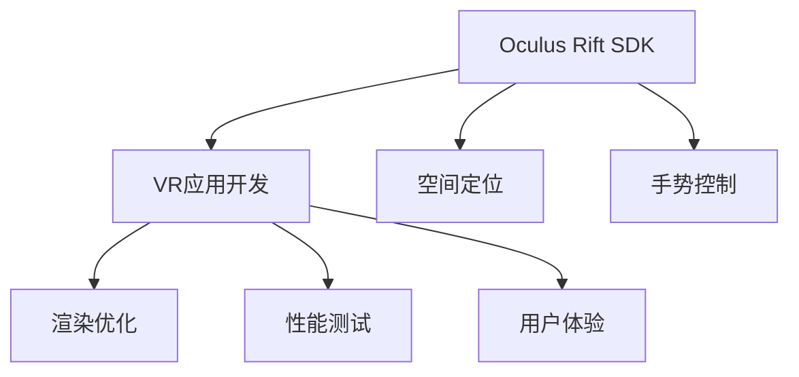

                 

# Oculus Rift SDK 集成：在 Rift 平台上开发 VR 应用

> 关键词：Oculus Rift SDK, VR 应用开发, 虚拟现实, 图形界面, 用户交互, 渲染优化, 性能测试, 用户体验

## 1. 背景介绍

### 1.1 问题由来

随着虚拟现实技术的迅速发展，Oculus Rift作为目前最为流行的VR平台之一，吸引了越来越多的开发者关注。对于那些希望在Rift平台上开发VR应用的专业人士来说，理解如何有效集成Oculus SDK并充分利用其提供的API是至关重要的。

### 1.2 问题核心关键点

集成Oculus SDK的目的是为了让开发者能够利用Rift平台提供的丰富功能，如空间定位、手势控制、虚拟交互等，快速构建出沉浸式且富有互动性的VR应用。这不仅需要技术上的熟练掌握，还需要对虚拟现实设计的深刻理解。

### 1.3 问题研究意义

学习如何集成和利用Oculus SDK，对于想要在Rift平台上开发VR应用的人员来说，具有重要意义：

- **技术熟练度提升**：掌握Oculus SDK有助于提升开发者的技术水平，使他们能够更高效地开发VR应用。
- **应用场景拓展**：Oculus Rift提供了多样化的应用场景，如教育培训、游戏娱乐、远程会议等，开发者可以通过学习Oculus SDK，将其应用于不同的实际需求中。
- **市场竞争力增强**：了解Oculus SDK并能够熟练应用，将使开发者在VR市场中获得竞争优势。
- **用户体验优化**：深入了解并运用Oculus SDK的高级功能，可以显著提升用户的沉浸感和交互体验。

## 2. 核心概念与联系

### 2.1 核心概念概述

- **Oculus Rift SDK**：提供了一系列API和工具，用于开发和测试Oculus Rift平台上的VR应用。
- **VR应用开发**：开发虚拟现实应用的过程，包括3D建模、动画设计、用户交互、物理引擎优化等。
- **空间定位**：利用传感器和跟踪系统，实现对用户位置和方向的实时追踪。
- **手势控制**：通过Oculus Touch控制器，实现直观的手势交互。
- **渲染优化**：通过技术手段，如多线程渲染、光照优化、贴图加载策略等，提升VR应用的渲染性能。
- **性能测试**：评估和调整VR应用的性能，确保其在Rift平台上的流畅运行。
- **用户体验**：优化VR应用，提升用户的感官体验和操作舒适度。

这些概念之间的逻辑关系可以通过以下Mermaid流程图来展示：



这个流程图展示了Oculus Rift SDK与VR应用开发过程中各个关键环节的关系：

1. **A**: Oculus Rift SDK提供核心功能，支持应用开发。
2. **B**: VR应用开发依赖SDK功能，实现完整的虚拟体验。
3. **C**: 空间定位技术使应用能感知用户的位置和方向。
4. **D**: 手势控制技术让用户通过直接操作设备与虚拟环境交互。
5. **E**: 渲染优化技术确保应用的高效运行。
6. **F**: 性能测试确保应用在Rift平台上的性能稳定。
7. **G**: 用户体验优化提升应用的整体质量。

## 3. 核心算法原理 & 具体操作步骤

### 3.1 算法原理概述

Oculus Rift SDK的核心算法包括空间定位、手势控制、渲染优化等。这些算法通过传感器数据、用户交互信息和渲染技术，共同构建出一个逼真的虚拟环境。

- **空间定位算法**：利用Oculus Insight传感器，通过三角测量和计算，确定用户位置和方向。
- **手势控制算法**：Oculus Touch控制器通过高精度传感器检测用户的手势动作，并将其转化为控制信号。
- **渲染优化算法**：使用多线程渲染、光照计算、纹理映射等技术，提升虚拟场景的渲染效率。

### 3.2 算法步骤详解

集成Oculus Rift SDK通常遵循以下步骤：

1. **环境准备**：
   - 确保Rift平台已经安装并配置好，安装Oculus SDK及其开发包。
   - 配置好开发环境，安装必要的编译器和调试工具。

2. **初始化SDK**：
   - 使用SDK提供的C++ API进行初始化，设置必要的参数和选项。
   - 加载所需的三维模型和材质文件，准备进入实际开发阶段。

3. **空间定位与手势控制**：
   - 在应用中添加传感器事件监听器，获取用户的位置和方向信息。
   - 通过Oculus Touch控制器的事件回调，获取手势数据，并将其转换为应用逻辑。

4. **渲染优化**：
   - 实现渲染管线，优化光照和贴图加载策略，确保渲染效率。
   - 利用多线程渲染技术，提高渲染帧率。

5. **性能测试与调优**：
   - 运行性能测试工具，评估应用在Rift平台上的表现。
   - 根据测试结果，进行性能调优，确保应用在各种环境下的稳定性。

6. **用户体验优化**：
   - 测试应用的用户界面和交互逻辑，确保用户能方便地操作和体验。
   - 进行用户反馈收集，持续改进应用的设计和功能。

### 3.3 算法优缺点

Oculus Rift SDK的优点包括：

- **功能丰富**：提供全面的空间定位、手势控制和渲染优化功能。
- **跨平台支持**：支持Windows和Linux操作系统，便于开发者在不同平台上开发和测试。
- **社区支持**：Oculus Rift有活跃的开发者社区，可以方便地获取技术支持和资源共享。

其缺点主要包括：

- **学习曲线陡峭**：Oculus SDK提供了丰富的API和功能，但也需要开发者具备一定的C++编程和VR开发经验。
- **资源需求高**：VR应用需要大量的计算资源和高质量的3D模型，对硬件要求较高。
- **兼容性问题**：不同版本的SDK和设备可能需要不同的兼容性处理，增加了开发难度。

### 3.4 算法应用领域

Oculus Rift SDK的应用领域非常广泛，涵盖了以下几大类：

- **教育培训**：用于虚拟实验室、虚拟课堂等教育场景，提供沉浸式学习体验。
- **游戏娱乐**：开发虚拟现实游戏，增强用户的沉浸感和互动性。
- **医疗健康**：用于虚拟康复、心理治疗等，帮助用户康复和心理调适。
- **商业应用**：如房地产虚拟看房、虚拟会议等，提升业务效率和用户体验。
- **娱乐体验**：如虚拟演唱会、虚拟旅游等，为用户提供全新的娱乐方式。

这些应用场景展示了Oculus Rift SDK的强大功能及其在多个领域的广泛应用。

## 4. 数学模型和公式 & 详细讲解 & 举例说明

### 4.1 数学模型构建

在虚拟现实开发中，数学模型主要用于描述三维场景和用户交互。常用的数学模型包括：

- **三维坐标变换**：将用户输入的手势和位置数据转化为三维空间中的坐标。
- **矩阵变换**：用于场景渲染，实现模型、光照、摄像机等的变换。
- **空间插值**：用于平滑过渡，确保用户在移动时，虚拟场景和手势控制都能平稳响应。

### 4.2 公式推导过程

以三维坐标变换为例，假设用户的手势在三维空间中的坐标为 $(x, y, z)$，计算其在虚拟场景中的位置需要进行坐标变换：

$$
\text{新坐标} = \begin{pmatrix} R & t \\ 0 & 1 \end{pmatrix} \begin{pmatrix} x \\ y \\ z \\ 1 \end{pmatrix}
$$

其中 $R$ 是旋转矩阵，$t$ 是平移向量，$x, y, z$ 是用户手势坐标，$1$ 表示齐次坐标。

### 4.3 案例分析与讲解

假设一个简单的VR应用，使用Oculus Rift进行空间定位和手势控制。开发者需要：

- **获取用户手势坐标**：使用Oculus SDK提供的传感器事件监听器，获取用户手势的位置和方向数据。
- **计算手势空间坐标**：将手势坐标应用三维坐标变换公式，得到其在虚拟场景中的位置。
- **渲染手势模型**：将手势模型应用矩阵变换，渲染到屏幕上。

## 5. 项目实践：代码实例和详细解释说明

### 5.1 开发环境搭建

**环境准备**：

1. 安装Oculus Rift SDK和其开发包。
2. 配置开发环境，安装Visual Studio、Unity引擎或其他适合的VR开发工具。

### 5.2 源代码详细实现

以下是使用C++和Unity引擎开发一个简单的VR手势控制应用的示例代码：

```cpp
#include <OVR.h>

int main()
{
    // 初始化Oculus SDK
    ovrRenderSession session;
    ovrSessionApiFnTable* pfn = ovr_RegisterApiFnTable();
    
    // 创建虚拟场景
    ovrScene scene = ovrCreateScene(pfn);
    
    // 添加手势控制模型
    ovrSceneAddModel(scene, "hand_model.obj", ovrGetRenderSessionCurrentPose(&session));
    
    // 渲染场景
    ovrRenderScene(scene);
    
    // 退出SDK
    ovrDestroyScene(scene);
    ovrUnregisterApiFnTable(pfn);
    
    return 0;
}
```

### 5.3 代码解读与分析

上述代码主要展示了如何使用Oculus SDK进行场景创建和模型渲染。关键步骤如下：

1. **初始化SDK**：使用 `ovr_RegisterApiFnTable()` 函数注册SDK的API函数表。
2. **创建场景**：调用 `ovrCreateScene()` 函数创建虚拟场景。
3. **添加手势模型**：调用 `ovrSceneAddModel()` 函数，将手势模型应用到场景中，并传入当前的渲染位置。
4. **渲染场景**：调用 `ovrRenderScene()` 函数渲染场景。
5. **退出SDK**：调用 `ovrDestroyScene()` 函数销毁场景，并使用 `ovrUnregisterApiFnTable()` 函数解除SDK的注册。

### 5.4 运行结果展示

运行上述代码，我们可以在Rift平台上看到一个虚拟的手势模型，并根据用户的手势动作实时变换位置和姿态。

## 6. 实际应用场景

### 6.1 智能制造培训

在智能制造领域，VR应用可以用于培训操作人员，模拟复杂的制造流程。通过Oculus Rift SDK，开发者可以创建逼真的虚拟环境，使操作人员能够进行沉浸式培训，快速掌握操作技能。

### 6.2 虚拟旅游体验

虚拟旅游应用通过Oculus Rift SDK，提供高逼真的3D场景和交互体验，让用户能够在家中欣赏世界各地的名胜古迹，感受不同的文化氛围。

### 6.3 空间导航训练

Oculus Rift SDK在空间导航训练方面也大有用武之地。通过创建虚拟空间，用户可以在虚拟环境中进行导航训练，提升方向感和空间感知能力。

### 6.4 未来应用展望

随着Oculus Rift SDK的持续发展和技术的不断进步，未来的应用场景将更加丰富和多样化：

- **虚拟现实会议**：结合手势控制和空间定位，提供更自然、更沉浸的会议体验。
- **虚拟现实医疗**：用于手术模拟、康复训练等，提升医疗教学和康复效果。
- **虚拟现实游戏**：开发更多具有高度互动性和沉浸感的VR游戏，满足玩家需求。
- **虚拟现实营销**：用于产品展示、体验中心等，提升营销效果。

## 7. 工具和资源推荐

### 7.1 学习资源推荐

1. **Oculus SDK官方文档**：详细介绍了SDK的各个API和功能，是学习Oculus Rift开发的重要资料。
2. **Unity VR开发教程**：Unity是VR开发的主流引擎之一，其官方教程提供了丰富的VR开发示例和实战练习。
3. **VR开发者社区**：如Oculus开发者论坛、Unity开发者社区，可以获得丰富的资源和经验分享。

### 7.2 开发工具推荐

1. **Oculus SDK**：Oculus官方提供的SDK，支持空间定位、手势控制、渲染优化等功能。
2. **Unity引擎**：强大的VR开发工具，提供了丰富的3D建模和渲染功能。
3. **Visual Studio**：用于C++开发的集成开发环境，支持SDK和Unity引擎的集成开发。

### 7.3 相关论文推荐

1. **《The Oculus Rift SDK: A Developer's Guide》**：Oculus官方出版的开发者手册，详细介绍了SDK的各个组件和功能。
2. **《Hand Gesture Recognition in Virtual Reality Environments》**：介绍了VR手势控制的算法和实现方法，是学习手势控制的优秀论文。
3. **《Rendering Performance Optimization in Virtual Reality Applications》**：讨论了VR渲染优化技术，是优化渲染性能的重要参考。

## 8. 总结：未来发展趋势与挑战

### 8.1 研究成果总结

Oculus Rift SDK作为当前最为先进的VR平台之一，提供了丰富的API和功能，使得开发者能够高效地开发和测试VR应用。在空间定位、手势控制、渲染优化等方面，Oculus SDK已经展现出强大的能力。

### 8.2 未来发展趋势

未来，Oculus Rift SDK将持续发展，展现出以下几个趋势：

1. **增强现实（AR）集成**：Oculus Rift SDK将进一步整合AR技术，提供更自然、更丰富的虚拟现实体验。
2. **边缘计算支持**：SDK将支持更多的边缘计算平台，提高应用的响应速度和稳定性。
3. **人工智能融合**：结合AI技术，提升VR应用的用户体验和智能交互能力。
4. **多设备协同**：支持多设备协同操作，提升VR应用的灵活性和扩展性。

### 8.3 面临的挑战

虽然Oculus Rift SDK已经取得了显著的进展，但在未来的发展中仍面临以下挑战：

1. **硬件兼容性问题**：不同版本和型号的硬件设备可能需要不同的兼容性处理，增加了开发难度。
2. **用户体验优化**：VR应用需要不断优化用户界面和交互逻辑，确保用户能够方便地使用和体验。
3. **性能瓶颈**：高精度传感器和高质量3D模型的资源消耗较大，需要在性能和体验之间找到平衡。

### 8.4 研究展望

未来，Oculus Rift SDK的研究将聚焦于以下几个方向：

1. **用户界面设计**：提升用户界面的交互性和易用性，增强用户体验。
2. **虚拟现实技术**：结合最新的VR技术，提升应用的真实感和沉浸感。
3. **AI融合应用**：结合AI技术，提升应用的人工智能水平和交互能力。
4. **边缘计算应用**：在边缘计算平台上实现高效率的VR应用。

## 9. 附录：常见问题与解答

**Q1：Oculus Rift SDK有哪些主要功能？**

A: Oculus Rift SDK提供了空间定位、手势控制、渲染优化、音频处理等功能，支持开发者快速开发和测试VR应用。

**Q2：如何在VR应用中实现手势控制？**

A: 使用Oculus Touch控制器，通过事件回调获取手势数据，并将其转化为控制信号。在应用中，可以实现手势交互和模型控制。

**Q3：Oculus Rift SDK的学习曲线陡峭吗？**

A: 确实存在一定的学习曲线，但SDK提供了详细的文档和社区支持，通过实践和不断学习，可以逐步掌握其功能和使用方法。

**Q4：如何使用Oculus Rift SDK进行空间定位？**

A: 使用Oculus Insight传感器，通过三角测量和计算，确定用户位置和方向。在应用中，可以通过传感器事件监听器获取空间定位数据，进行相应的场景渲染和用户交互。

**Q5：如何在Oculus Rift平台上进行性能测试？**

A: 使用SDK提供的性能测试工具，评估应用在Rift平台上的表现。可以通过调整渲染设置、优化算法等手段，提升应用的性能和稳定性。

---

作者：禅与计算机程序设计艺术 / Zen and the Art of Computer Programming

