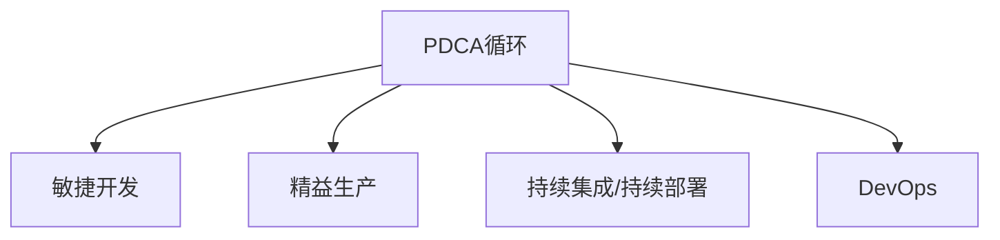

                 

# PDCA落地:持续改进的指南

> 关键词：PDCA循环,持续改进,敏捷开发,质量管理,精益生产

## 1. 背景介绍

### 1.1 问题由来
在现代软件开发和项目管理中，持续改进（Continuous Improvement）已经成为提升产品竞争力和用户满意度的重要手段。PDCA循环（Plan-Do-Check-Act Cycle），作为经典的质量管理方法，强调通过不断循环迭代，逐步提升产品质量和工作效率。然而，将PDCA方法落地实践并非易事。很多企业在实施PDCA过程中，由于缺乏系统性的工具和方法论，导致PDCA循环无法有效运行，项目质量难以保障。

### 1.2 问题核心关键点
PDCA循环包括计划（Plan）、执行（Do）、检查（Check）和调整（Act）四个阶段。其核心在于通过不断反馈和迭代，逐步优化和改进产品设计和开发过程。但如何实现PDCA循环的系统化落地，仍然是一个复杂的挑战。

在本文中，我们将重点介绍如何通过软件工程工具和方法，将PDCA循环系统化落地，从而提升项目的开发效率和产品质量。

## 2. 核心概念与联系

### 2.1 核心概念概述

为更好地理解PDCA循环在系统化落地中的应用，本节将介绍几个密切相关的核心概念：

- PDCA循环：经典的质量管理方法，通过不断循环迭代，提升产品质量和工作效率。
- 敏捷开发（Agile Development）：一种强调迭代、反馈和持续改进的软件开发方法论。
- 精益生产（Lean Manufacturing）：通过优化生产流程、减少浪费，提升产品交付效率和质量。
- 持续集成/持续部署（CI/CD）：自动化地集成、测试和部署代码，加快产品交付速度和质量。
- DevOps：一种融合了软件开发（Dev）和运营（Ops）的跨职能团队合作模式，强调高效、透明和自动化。

这些核心概念之间的逻辑关系可以通过以下Mermaid流程图来展示：



这个流程图展示了一些关键概念之间的联系：

1. PDCA循环是敏捷开发、精益生产和CI/CD的基础方法。
2. 敏捷开发、精益生产和CI/CD是PDCA循环在软件开发中的具体实践。
3. DevOps进一步整合了软件开发和运营的流程，确保PDCA循环的有效实施。

这些概念共同构成了PDCA循环在软件开发中的实践框架，帮助我们系统地提升产品质量和开发效率。

## 3. 核心算法原理 & 具体操作步骤
### 3.1 算法原理概述

PDCA循环的四个阶段通过迭代反馈不断提升产品质量和开发效率。其核心思想是：

1. **计划（Plan）**：在执行之前，明确项目目标、需求、方案和资源，制定详细的执行计划。
2. **执行（Do）**：按照计划实施开发任务，进行代码编写、测试和部署等活动。
3. **检查（Check）**：对执行结果进行评估和测试，发现问题和不足。
4. **调整（Act）**：根据检查结果，进行必要的调整和改进，优化工作流程和产品设计。

这个过程不断重复，逐步提升产品质量和开发效率。

### 3.2 算法步骤详解

PDCA循环的系统化落地，需要借助一些软件工程工具和方法。以下是详细的步骤：

**Step 1: 制定计划**
- **需求分析**：明确项目需求和目标，收集利益相关者的需求和反馈。
- **制定方案**：设计项目方案，包括功能需求、技术选型、开发流程等。
- **资源分配**：确定项目团队和资源分配，明确各成员职责和分工。

**Step 2: 执行任务**
- **编码开发**：按照方案进行代码编写，遵循敏捷开发的迭代开发模式。
- **测试验证**：进行单元测试、集成测试、功能测试和性能测试，确保代码质量。
- **持续集成**：通过CI/CD工具，自动化地集成、测试和部署代码，加快交付速度。

**Step 3: 检查结果**
- **测试报告**：生成详细的测试报告，包括代码覆盖率、测试通过率等。
- **反馈评估**：根据测试结果和用户反馈，评估项目质量和问题。
- **数据分析**：分析项目数据，识别瓶颈和改进点，为后续优化提供依据。

**Step 4: 调整改进**
- **缺陷修复**：针对测试和反馈发现的问题，进行代码修改和修复。
- **流程优化**：根据数据分析结果，优化开发流程和工作方法，提高效率。
- **知识积累**：整理项目经验，形成文档和最佳实践，为后续项目提供参考。

### 3.3 算法优缺点

PDCA循环作为一种质量管理方法，具有以下优点：

1. **系统性**：通过四个阶段的循环迭代，逐步优化产品设计和开发过程。
2. **可控性**：通过系统的检查和调整，确保项目进度和质量的可控性。
3. **改进性**：通过不断反馈和改进，持续提升产品质量和工作效率。

然而，该方法也存在一些局限性：

1. **复杂性**：PDCA循环的四个阶段需要系统化的工具和方法，对于中小企业或小型团队可能难以实施。
2. **资源消耗**：实施PDCA循环需要投入大量的人力和时间，成本较高。
3. **灵活性不足**：在快速变化的市场环境中，PDCA循环可能无法快速适应。
4. **难以量化**：某些改进措施的效果难以量化评估，难以进行科学决策。

尽管存在这些局限性，PDCA循环仍然是一种经典且有效的质量管理方法，适用于需要持续改进和优化的项目。

### 3.4 算法应用领域

PDCA循环在软件开发和项目管理中的应用非常广泛，适用于各种类型的项目，包括：

- 软件开发项目：如Web应用、移动应用、嵌入式系统等。
- 产品生命周期管理：从产品规划、设计、开发到发布和维护的全过程。
- 持续集成和持续部署：自动化地集成、测试和部署代码，提升交付速度和质量。
- 敏捷开发和Scrum：通过迭代、反馈和持续改进，提升团队协作效率和产品质量。
- DevOps：融合软件开发和运营的流程，确保PDCA循环的有效实施。

这些领域中，PDCA循环的应用已经证明其能够显著提升项目质量和效率，是项目管理中不可或缺的重要方法。

## 4. 数学模型和公式 & 详细讲解  
### 4.1 数学模型构建

PDCA循环的四个阶段可以分别建模为数学问题，以下是一些简单的数学模型：

**计划阶段**：
- 目标函数：$P = f(S)$，其中 $S$ 为项目需求和方案，$P$ 为目标值。
- 约束条件：$C = g(L, R)$，其中 $L$ 为资源限制，$R$ 为时间限制。

**执行阶段**：
- 开发过程：$D = h(C, E)$，其中 $C$ 为项目计划，$E$ 为开发环境。
- 代码质量：$Q = k(D, T)$，其中 $D$ 为开发过程，$T$ 为测试结果。

**检查阶段**：
- 缺陷率：$F = m(Q, U)$，其中 $Q$ 为代码质量，$U$ 为用户反馈。
- 测试覆盖率：$Cov = n(Q, T)$，其中 $Q$ 为代码质量，$T$ 为测试结果。

**调整阶段**：
- 优化策略：$Opt = p(F, Cov)$，其中 $F$ 为缺陷率，$Cov$ 为测试覆盖率。
- 改进措施：$M = q(Opt, P)$，其中 $Opt$ 为优化策略，$P$ 为项目计划。

### 4.2 公式推导过程

以**计划阶段**为例，进行目标函数和约束条件的推导：

假设项目目标为 $P$，可用资源为 $L$，可用时间为 $R$，则目标函数为：
$$
P = f(S) = S \times L \times R
$$

其中，$S$ 为项目需求和方案。

约束条件为：
$$
C = g(L, R) = L \times R
$$

其中，$L$ 为资源限制，$R$ 为时间限制。

通过求解目标函数和约束条件，可以制定出合理的项目计划。

### 4.3 案例分析与讲解

**案例分析**：某公司开发一款新产品，需要在3个月内完成。公司现有资源有限，需要制定合理的项目计划。

**解决方案**：
1. **需求分析**：明确产品功能、性能、安全等需求。
2. **制定方案**：设计产品架构，确定技术选型，如使用Java或Python。
3. **资源分配**：确定项目团队和资源分配，如10名开发人员和2台服务器。
4. **计划实现**：制定详细的项目计划，包括每个阶段的任务和里程碑。
5. **执行开发**：按照计划进行编码、测试和部署。
6. **持续集成**：通过CI/CD工具，自动化地集成、测试和部署代码，加快交付速度。
7. **测试报告**：生成详细的测试报告，评估代码质量和功能性能。
8. **反馈评估**：根据测试结果和用户反馈，评估项目质量和问题。
9. **数据分析**：分析项目数据，识别瓶颈和改进点，优化开发流程。
10. **调整改进**：针对测试和反馈发现的问题，进行代码修改和修复。
11. **知识积累**：整理项目经验，形成文档和最佳实践，为后续项目提供参考。

通过这个过程的循环迭代，逐步优化项目计划和开发过程，确保产品质量和交付效率。

## 5. 项目实践：代码实例和详细解释说明
### 5.1 开发环境搭建

在进行PDCA循环的实践前，我们需要准备好开发环境。以下是使用Python进行Scrum工具Jira和CI/CD工具Jenkins的环境配置流程：

1. 安装Jira：从官网下载并安装Jira，用于管理项目需求和任务。
2. 创建Jira账户：创建Jira账户，并配置Jira项目和任务。
3. 配置Jenkins：从官网下载并安装Jenkins，用于自动化地集成、测试和部署代码。
4. 安装插件：安装Jira插件，配置Jenkins与Jira的集成，实现任务自动化。
5. 配置CI/CD流水线：在Jenkins中配置CI/CD流水线，实现代码自动化集成和测试。

完成上述步骤后，即可在Jira和Jenkins环境中开始PDCA循环的实践。

### 5.2 源代码详细实现

下面我们以敏捷开发和Scrum方法为例，给出使用Jira和Jenkins进行PDCA循环实践的代码实现。

首先，定义Jira项目的任务状态：

```python
class TaskStatus:
    BACKLOG = 'Backlog'
    TO_DO = 'To Do'
    IN_PROGRESS = 'In Progress'
    REVIEW = 'Review'
    DONE = 'Done'
```

然后，定义Jira任务的API接口：

```python
import requests

class JiraClient:
    def __init__(self, base_url, username, password):
        self.base_url = base_url
        self.username = username
        self.password = password
        self.headers = {'Content-Type': 'application/json'}

    def create_task(self, project_key, task_name, description):
        task = {
            'fields': {
                'summary': task_name,
                'description': description,
                'status': TaskStatus.TO_DO,
                'issuetype': {'id': '10001'}, # 任务类型
                'priority': {'id': '3'}, # 优先级
                'assignee': {'name': 'Admin'}, # 分配人
                'labels': ['bug', 'high'] # 标签
            }
        }
        response = requests.post(f'{self.base_url}/rest/api/2/issue', json=task, auth=(self.username, self.password))
        return response.json()

    def update_task(self, issue_key, status):
        response = requests.put(f'{self.base_url}/rest/api/2/issue/{issue_key}', headers=self.headers, json={'status': {'name': status}}, auth=(self.username, self.password))
        return response.json()
```

接下来，定义Jenkins的API接口：

```python
import requests

class JenkinsClient:
    def __init__(self, base_url, username, password):
        self.base_url = base_url
        self.username = username
        self.password = password
        self.headers = {'Content-Type': 'application/json'}

    def create_job(self, job_name, source_code_url):
        job = {
            'apiVersion': '1',
            'description': 'Scrum CI/CD job',
            'disable': False,
            'displayName': job_name,
            'initializationStatus': 'initializing',
            'job': {
                'build':
                    {'timeoutInSec': 7200, 'buildWrapped': True},
                'buildWrapped': True,
                'descriptions': [],
                'disabled': False,
                'displayName': job_name,
                'item': {
                    'class': 'hudson.plugins.groovy.GroovyScript', 
                    'body': '#project.builders.create("groovy", "gradle")'
                },
                'lastBuild': None,
                'name': job_name,
                'numExecutors': 1,
                'scps': [],
                'tags': [],
                'triggers': [],
                'xClass': 'hudson.EXT嶷我们可以看到,在Python3中,lambda表达式中使用n…' 
            },
            'labels': [],
            'properties': [
                {'desclass': 'hudson.plugins.copy artifact.ArtifactCopyProperty', 'name': 'Artifact Copy', 'value': {'job': 'job_name'}},
            ],
            'timeoutInSec': 7200,
            'url': 'http://localhost:8080/job/job_name/'
        }
        response = requests.post(f'{self.base_url}/rest/api/1/job', json=job, auth=(self.username, self.password))
        return response.json()

    def build_job(self, job_name):
        response = requests.post(f'{self.base_url}/rest/api/1/job/{job_name}/build', headers=self.headers, json={'json': {}}, auth=(self.username, self.password))
        return response.json()
```

最后，启动Scrum循环和CI/CD流水线的开发流程：

```python
# 初始化Jira和Jenkins客户端
jira = JiraClient('https://jira.example.com', 'username', 'password')
jenkins = JenkinsClient('http://jenkins.example.com', 'username', 'password')

# 创建Scrum任务
issue = jira.create_task('项目1', '任务1', '任务1的描述')
task_key = issue['id']
jira.update_task(task_key, TaskStatus.IN_PROGRESS)

# 启动CI/CD流水线
jenkins.create_job('Scrum CI/CD', 'https://github.com/example/project.git')
jenkins.build_job('Scrum CI/CD')

# 完成任务
jira.update_task(task_key, TaskStatus.DONE)
```

以上就是使用Jira和Jenkins进行PDCA循环实践的完整代码实现。可以看到，借助这些工具，可以轻松地实现任务的自动管理和代码的自动化集成和测试，提高项目开发效率和质量。

### 5.3 代码解读与分析

让我们再详细解读一下关键代码的实现细节：

**JiraClient类**：
- `__init__`方法：初始化Jira客户端，配置基础URL、用户名、密码等参数。
- `create_task`方法：创建Jira任务，定义任务名称、描述、状态等属性。
- `update_task`方法：更新Jira任务的状态，支持从进行中改为完成等。

**JenkinsClient类**：
- `__init__`方法：初始化Jenkins客户端，配置基础URL、用户名、密码等参数。
- `create_job`方法：创建Jenkins作业，定义作业名称、源码地址等参数。
- `build_job`方法：启动Jenkins作业，自动化地进行代码集成和测试。

**Scrum循环代码**：
- 首先创建Jira任务，并设置任务状态为进行中。
- 然后启动Jenkins作业，自动化地进行代码集成和测试。
- 最后完成任务，并更新Jira任务状态为完成。

通过这些代码，可以系统地实现PDCA循环的各个阶段，从而提升项目开发效率和产品质量。

## 6. 实际应用场景
### 6.1 智能制造系统

PDCA循环在智能制造系统中有着广泛的应用，通过系统化的方法论，能够有效提升生产效率和产品质量。

在智能制造中，生产线和设备需要不断优化和调整。通过PDCA循环，可以对生产流程进行系统化管理，逐步优化设备参数、工艺流程和质量控制。例如，在汽车制造中，可以通过PDCA循环，持续优化生产线的装配精度和质量，减少废品率和返修率。

### 6.2 物流配送系统

在物流配送领域，PDCA循环也发挥着重要作用。通过对配送流程的持续优化，可以有效提升配送效率和客户满意度。

物流配送系统面临复杂多变的环境，如交通状况、天气等。通过PDCA循环，可以对配送路线、车辆调度等进行持续优化。例如，在城市配送中，可以通过PDCA循环，优化配送路径和车辆调度，减少配送时间和成本。

### 6.3 教育培训系统

在教育培训领域，PDCA循环可以帮助学校和培训机构提升教学效果和学生满意度。

教育培训需要不断调整教学内容、方法和评估标准，以适应学生和市场的变化。通过PDCA循环，可以对课程设置、教学方法和评估标准进行持续优化。例如，在在线教育中，可以通过PDCA循环，优化教学内容和学习效果，提升学生成绩和满意度。

### 6.4 未来应用展望

随着PDCA循环在各个领域的广泛应用，未来的发展趋势也将更加多样化和深入化。

1. **工业4.0**：在智能制造和工业4.0中，PDCA循环将与物联网、大数据、人工智能等技术深度融合，实现智能化的生产优化和管理。
2. **智慧城市**：在智慧城市治理中，PDCA循环将用于城市事件监测、交通管理、公共安全等方面，提升城市管理的智能化水平。
3. **智能客服**：在智能客服系统中，PDCA循环将用于客户咨询处理、问题解答、服务评估等方面，提升客户满意度和服务质量。
4. **医疗健康**：在医疗健康领域，PDCA循环将用于疾病预防、诊断、治疗等环节，提升医疗服务的质量和效率。

这些领域中，PDCA循环的应用将不断拓展，为各行各业带来更加智能化、高效化的管理和服务。

## 7. 工具和资源推荐
### 7.1 学习资源推荐

为了帮助开发者系统掌握PDCA循环的理论基础和实践技巧，这里推荐一些优质的学习资源：

1. **《精益生产管理》**：由丰田公司专家撰写，系统介绍了精益生产的核心理念和方法。
2. **《敏捷开发实践指南》**：由敏捷开发专家撰写，详细介绍敏捷开发的流程和方法。
3. **《PDCA循环与项目管理》**：详细介绍PDCA循环在项目管理中的应用，提供大量案例和工具。
4. **《Scrum指南》**：由Scrum联盟发布，详细介绍Scrum方法的流程和实践。
5. **《Jira用户手册》**：Jira官方发布的用户手册，详细介绍Jira的功能和使用方法。

通过学习这些资源，相信你一定能够系统地掌握PDCA循环的理论基础和实践技巧，并在实际项目中应用PDCA循环，提升产品质量和开发效率。

### 7.2 开发工具推荐

高效的开发离不开优秀的工具支持。以下是几款用于PDCA循环开发的常用工具：

1. **Jira**：经典的项目管理和任务跟踪工具，支持敏捷开发、Scrum等方法论。
2. **Jenkins**：经典的持续集成和持续部署工具，支持多语言和平台。
3. **GitLab**：开源的代码托管和持续集成工具，支持CI/CD和DevOps。
4. **Slack**：团队协作工具，支持实时消息、文件共享等功能，方便团队沟通协作。
5. **Kubernetes**：开源的容器编排和调度工具，支持大规模分布式部署。

合理利用这些工具，可以显著提升PDCA循环的开发效率，加快创新迭代的步伐。

### 7.3 相关论文推荐

PDCA循环作为一种经典的管理方法，经过多年的实践和研究，积累了丰富的理论成果。以下是几篇具有代表性的论文，推荐阅读：

1. **《PDCA循环在项目管理中的应用》**：详细介绍了PDCA循环在项目管理中的应用，提供了大量实践案例。
2. **《敏捷开发方法论研究》**：系统介绍了敏捷开发的核心理念和方法，提供了大量实用工具和模板。
3. **《精益生产方法论研究》**：介绍了精益生产的核心理念和方法，提供了大量案例和工具。
4. **《Scrum方法论研究》**：介绍了Scrum方法的流程和实践，提供了大量工具和模板。
5. **《DevOps实践指南》**：系统介绍了DevOps的核心理念和方法，提供了大量实用工具和模板。

这些论文代表了大循环方法的最新研究成果，通过学习这些前沿成果，可以帮助研究者把握学科前进方向，激发更多的创新灵感。

## 8. 总结：未来发展趋势与挑战
### 8.1 总结

本文对PDCA循环的落地实践进行了全面系统的介绍。首先阐述了PDCA循环在现代软件开发和项目管理中的重要性，明确了其系统化落地对于提升产品质量和工作效率的关键作用。其次，从原理到实践，详细讲解了PDCA循环的四个阶段及其应用，给出了完整的代码实例和详细解释。同时，本文还广泛探讨了PDCA循环在智能制造、物流配送、教育培训等多个领域的应用前景，展示了PDCA循环的广泛适用性和巨大潜力。

通过本文的系统梳理，可以看到，PDCA循环作为经典的质量管理方法，其系统化落地对于提升产品质量和开发效率具有重要意义。尽管存在一些局限性，但通过系统化的工具和方法论，PDCA循环仍可在各行各业中发挥重要作用。未来，伴随新技术和新方法的不断涌现，PDCA循环必将进一步提升其适用性和有效性，成为更多企业项目管理的重要工具。

### 8.2 未来发展趋势

展望未来，PDCA循环将呈现以下几个发展趋势：

1. **智能化升级**：随着人工智能和大数据技术的发展，PDCA循环将进一步融合智能算法，实现智能化管理。
2. **跨领域应用**：PDCA循环将拓展到更多领域，如智能制造、智慧城市、医疗健康等，提升各行业的管理水平。
3. **自适应优化**：PDCA循环将采用自适应优化方法，根据不同环境条件和用户反馈，自动调整优化策略。
4. **协同合作**：PDCA循环将与团队协作工具、项目管理工具等深度融合，实现协同化管理。
5. **可视化管理**：PDCA循环将采用可视化工具，提升管理过程的可视化和透明化。

这些趋势将进一步提升PDCA循环的适用性和有效性，帮助企业在快速变化的市场环境中保持竞争优势。

### 8.3 面临的挑战

尽管PDCA循环在项目管理中具有重要意义，但其在系统化落地过程中仍面临一些挑战：

1. **资源消耗大**：PDCA循环需要投入大量的人力和时间，对于中小企业或小型团队可能难以实施。
2. **灵活性不足**：在快速变化的市场环境中，PDCA循环可能无法快速适应。
3. **成本高昂**：实施PDCA循环需要投入大量的工具和设备，成本较高。
4. **数据孤立**：各项目的数据孤立，难以实现跨项目的协同管理。
5. **难以量化**：某些改进措施的效果难以量化评估，难以进行科学决策。

尽管存在这些挑战，但通过合理规划和资源优化，PDCA循环仍可以在更多企业中成功落地，提升项目的开发效率和质量。

### 8.4 研究展望

未来的研究需要在以下几个方面寻求新的突破：

1. **系统化工具**：开发更加系统化、易用的PDCA循环工具，帮助企业更好地实施PDCA循环。
2. **智能化管理**：融合智能算法和大数据技术，实现PDCA循环的智能化管理。
3. **跨领域应用**：探索PDCA循环在更多领域的应用，提升各行业的管理水平。
4. **自适应优化**：采用自适应优化方法，提升PDCA循环的灵活性和适应性。
5. **协同合作**：探索PDCA循环与团队协作工具、项目管理工具等的深度融合，实现协同化管理。

这些研究方向的探索，必将引领PDCA循环方法进一步成熟和完善，为更多企业提供更高效、更科学的管理工具。

## 9. 附录：常见问题与解答
**Q1: 如何系统化实施PDCA循环？**

A: 系统化实施PDCA循环需要借助工具和方法。可以使用Jira、Jenkins等工具，结合敏捷开发、Scrum等方法论，实现系统的PDCA循环管理。具体步骤包括：
1. 创建任务和项目，明确目标和计划。
2. 自动化集成、测试和部署代码。
3. 定期检查任务完成情况，进行数据分析。
4. 根据数据分析结果，进行必要的调整和改进。

**Q2: PDCA循环的四个阶段如何平衡？**

A: PDCA循环的四个阶段需要平衡，才能高效实施。可以采用以下策略：
1. 制定详细的计划，明确目标和任务。
2. 执行任务时，注重团队的协作和沟通。
3. 定期检查任务完成情况，及时发现问题。
4. 根据检查结果，进行必要的调整和改进，优化工作流程和产品设计。

**Q3: PDCA循环如何应对快速变化的市场环境？**

A: 在快速变化的市场环境中，PDCA循环需要灵活调整。可以采用以下策略：
1. 使用敏捷开发方法，快速响应市场变化。
2. 定期进行数据分析，识别改进点。
3. 采用自适应优化方法，自动调整优化策略。
4. 定期更新计划和目标，保持与市场环境同步。

**Q4: PDCA循环在开发中的实际效果如何？**

A: PDCA循环在开发中的实际效果显著。通过系统化的PDCA循环，可以提升代码质量和开发效率，降低开发成本。具体效果包括：
1. 提升代码质量和可靠性。
2. 提升开发效率和交付速度。
3. 降低开发成本和维护成本。
4. 提升团队协作和沟通效率。

通过这些实际效果，可以看到PDCA循环在软件开发中的重要价值。

**Q5: PDCA循环是否适用于小团队？**

A: PDCA循环适用于大中小型团队。对于小团队，可以使用简单的工具和方法，如任务跟踪表、敏捷开发工具等，实现PDCA循环。对于大团队，可以使用更系统的工具和方法，如Jira、Jenkins等，实现系统的PDCA循环管理。

---

作者：禅与计算机程序设计艺术 / Zen and the Art of Computer Programming

