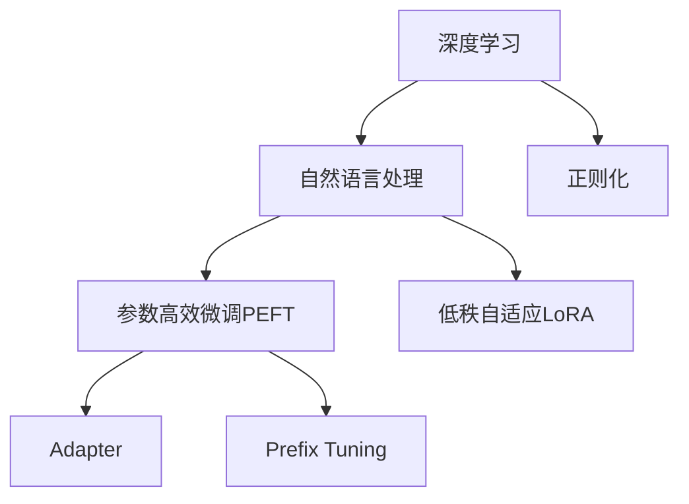

                 

# PEFT和LoRA：高效的参数高效微调方法

> 关键词：参数高效微调(PEFT), 低秩自适应(LoRA), 深度学习, 人工智能, 自然语言处理(NLP)

## 1. 背景介绍

### 1.1 问题由来
随着深度学习模型的不断演进，大规模预训练模型在自然语言处理（NLP）领域取得了显著的成果。然而，这些模型通常需要较大的计算资源和数据量，且在微调时面临着参数量巨大、资源消耗高、过拟合风险大等问题。参数高效微调（Parameter-Efficient Fine-Tuning, PEFT）方法应运而生，旨在减少微调时的参数更新，同时保持模型的性能。

### 1.2 问题核心关键点
参数高效微调（PEFT）是一种通过更新模型参数中的一小部分来适应特定任务的微调方法，旨在减少过拟合风险，并提升模型的泛化能力。相比全参数微调，PEFT在资源消耗和训练效率上有显著优势。常见的PEFT方法包括Adapter、Prefix Tuning等。其中，LoRA（Low-Rank Adaptation）是一种基于低秩分解的参数高效微调方法，能够在不增加额外计算资源的情况下，显著提高微调模型的效果。

### 1.3 问题研究意义
参数高效微调（PEFT）和LoRA（Low-Rank Adaptation）方法的研究对于提升深度学习模型在特定任务上的性能，降低微调时的计算和存储成本，减少过拟合风险具有重要意义。特别是在资源受限或数据稀缺的场景下，这些方法能够大幅提高模型的实用性，为NLP技术的实际应用提供强有力的支持。

## 2. 核心概念与联系

### 2.1 核心概念概述

为了更好地理解PEFT和LoRA，本节将介绍几个关键概念：

- 参数高效微调（PEFT）：指在微调过程中，只更新一小部分模型参数，以降低过拟合风险，提升微调效率。常见的PEFT方法包括Adapter、Prefix Tuning等。
- 低秩自适应（LoRA）：一种基于低秩分解的参数高效微调方法，能够在固定预训练权重的情况下，通过调整模型中极少量的参数来实现微调。
- 深度学习：基于多层神经网络的学习范式，广泛应用于计算机视觉、自然语言处理、语音识别等领域。
- 自然语言处理（NLP）：研究如何让计算机理解和处理人类语言的技术，包括文本分类、情感分析、机器翻译等任务。
- 正则化：在深度学习模型中，通过引入L2正则化等方法来防止过拟合。

这些概念之间的逻辑关系可以通过以下Mermaid流程图来展示：



这个流程图展示了一些核心概念之间的联系：

1. 深度学习提供了一种强有力的学习范式，自然语言处理是该范式的重要应用领域之一。
2. 参数高效微调（PEFT）和低秩自适应（LoRA）是两种通过减少参数更新来提升模型性能的微调方法。
3. 在PEFT中，Adapter和Prefix Tuning是最常用的方法。
4. 正则化是防止模型过拟合的重要手段。

这些概念共同构成了深度学习模型在特定任务上的微调框架，有助于更好地理解模型的工作原理和优化方向。

## 3. 核心算法原理 & 具体操作步骤
### 3.1 算法原理概述

参数高效微调（PEFT）和低秩自适应（LoRA）方法的核心思想是通过调整模型中极少量的参数来适应特定任务，同时保留大部分预训练权重，以减少过拟合风险，提升模型性能。

形式化地，假设预训练模型为 $M_{\theta}$，其中 $\theta$ 为预训练得到的模型参数。给定下游任务 $T$ 的标注数据集 $D=\{(x_i, y_i)\}_{i=1}^N$，微调的目标是找到新的模型参数 $\hat{\theta}$，使得：

$$
\hat{\theta}=\mathop{\arg\min}_{\theta} \mathcal{L}(M_{\theta},D)
$$

其中 $\mathcal{L}$ 为针对任务 $T$ 设计的损失函数，用于衡量模型预测输出与真实标签之间的差异。

对于PEFT和LoRA方法，优化目标不再是最小化损失函数 $\mathcal{L}$，而是最小化在固定预训练权重 $W$ 的情况下，新添加参数 $U$ 和 $V$ 的影响。具体来说，LoRA方法通过将预训练权重 $W$ 分解为低秩矩阵 $A \in \mathbb{R}^{d \times r}$ 和 $B \in \mathbb{R}^{r \times d}$，其中 $d$ 为模型总参数量，$r$ 为低秩分解的秩。新添加参数 $U \in \mathbb{R}^{d \times r}$ 和 $V \in \mathbb{R}^{r \times d}$ 用于适应任务。整个微调过程可以通过求解以下最小化问题实现：

$$
\hat{\theta}=\mathop{\arg\min}_{\theta} \mathcal{L}(M_{\theta},D)
$$

其中 $M_{\theta} = \text{Deform}(A, U, V, B)$ 为LoRA模型，$\text{Deform}(A, U, V, B)$ 为LoRA模型中预训练权重 $W$ 的变换函数。

### 3.2 算法步骤详解

基于LoRA的参数高效微调步骤通常包括以下几个关键步骤：

**Step 1: 准备预训练模型和数据集**
- 选择合适的预训练语言模型 $M_{\theta}$ 作为初始化参数，如 BERT、GPT 等。
- 准备下游任务 $T$ 的标注数据集 $D$，划分为训练集、验证集和测试集。一般要求标注数据与预训练数据的分布不要差异过大。

**Step 2: 分解预训练权重**
- 对预训练权重 $W$ 进行低秩分解，得到矩阵 $A$、$U$、$V$ 和 $B$。
- 设置参数 $r$，控制低秩分解的秩，以平衡微调效果和计算效率。

**Step 3: 添加任务适配层**
- 根据任务类型，在预训练模型顶层设计合适的输出层和损失函数。
- 对于分类任务，通常在顶层添加线性分类器和交叉熵损失函数。
- 对于生成任务，通常使用语言模型的解码器输出概率分布，并以负对数似然为损失函数。

**Step 4: 设置微调超参数**
- 选择合适的优化算法及其参数，如 AdamW、SGD 等，设置学习率、批大小、迭代轮数等。
- 设置正则化技术及强度，包括权重衰减、Dropout、Early Stopping等。
- 确定冻结预训练参数的策略，如仅微调顶层，或全部参数都参与微调。

**Step 5: 执行梯度训练**
- 将训练集数据分批次输入模型，前向传播计算损失函数。
- 反向传播计算参数梯度，根据设定的优化算法和学习率更新模型参数。
- 周期性在验证集上评估模型性能，根据性能指标决定是否触发 Early Stopping。
- 重复上述步骤直到满足预设的迭代轮数或 Early Stopping 条件。

**Step 6: 测试和部署**
- 在测试集上评估微调后模型 $M_{\hat{\theta}}$ 的性能，对比微调前后的精度提升。
- 使用微调后的模型对新样本进行推理预测，集成到实际的应用系统中。
- 持续收集新的数据，定期重新微调模型，以适应数据分布的变化。

以上是基于LoRA的参数高效微调的一般流程。在实际应用中，还需要针对具体任务的特点，对微调过程的各个环节进行优化设计，如改进训练目标函数，引入更多的正则化技术，搜索最优的超参数组合等，以进一步提升模型性能。

### 3.3 算法优缺点

基于LoRA的参数高效微调方法具有以下优点：
1. 参数更新量小。LoRA方法通过低秩分解，仅更新预训练权重的一部分，大大降低了微调时的计算和存储成本。
2. 泛化能力好。由于保留了大部分预训练权重，LoRA模型在新的数据集上具有较好的泛化能力，避免过拟合。
3. 适应性强。LoRA方法可以适应多种下游任务，包括分类、匹配、生成等，设计简单的任务适配层即可实现微调。

同时，该方法也存在一定的局限性：
1. 数据依赖性高。LoRA方法的效果很大程度上依赖标注数据的质量和数量，获取高质量标注数据的成本较高。
2. 微调复杂度高。尽管参数更新量小，但由于需要进行低秩分解，计算复杂度仍然较高。
3. 迁移能力有限。当目标任务与预训练数据的分布差异较大时，LoRA的微调效果可能不理想。
4. 可解释性不足。LoRA模型参数更新量少，但模型内部的结构变化复杂，难以解释其决策过程。

尽管存在这些局限性，但就目前而言，基于LoRA的参数高效微调方法在资源受限或数据稀缺的场景下，仍然是一种高效且有效的微调范式。未来相关研究的重点在于如何进一步降低微调对标注数据的依赖，提高模型的迁移能力，同时兼顾可解释性和伦理安全性等因素。

### 3.4 算法应用领域

基于LoRA的参数高效微调方法在NLP领域已经得到了广泛的应用，覆盖了几乎所有常见任务，例如：

- 文本分类：如情感分析、主题分类、意图识别等。通过微调使模型学习文本-标签映射。
- 命名实体识别：识别文本中的人名、地名、机构名等特定实体。通过微调使模型掌握实体边界和类型。
- 关系抽取：从文本中抽取实体之间的语义关系。通过微调使模型学习实体-关系三元组。
- 问答系统：对自然语言问题给出答案。将问题-答案对作为微调数据，训练模型学习匹配答案。
- 机器翻译：将源语言文本翻译成目标语言。通过微调使模型学习语言-语言映射。
- 文本摘要：将长文本压缩成简短摘要。将文章-摘要对作为微调数据，使模型学习抓取要点。
- 对话系统：使机器能够与人自然对话。将多轮对话历史作为上下文，微调模型进行回复生成。

除了上述这些经典任务外，LoRA方法也被创新性地应用到更多场景中，如可控文本生成、常识推理、代码生成、数据增强等，为NLP技术带来了全新的突破。随着LoRA方法的不断进步，相信NLP技术将在更广阔的应用领域大放异彩。

## 4. 数学模型和公式 & 详细讲解 & 举例说明

### 4.1 数学模型构建

本节将使用数学语言对基于LoRA的参数高效微调过程进行更加严格的刻画。

记预训练语言模型为 $M_{\theta}$，其中 $\theta$ 为预训练得到的模型参数。假设微调任务的训练集为 $D=\{(x_i,y_i)\}_{i=1}^N, x_i \in \mathcal{X}, y_i \in \mathcal{Y}$。

定义模型 $M_{\theta}$ 在输入 $x$ 上的输出为 $\hat{y}=M_{\theta}(x)$，真实标签为 $y \in \{0,1\}$。

LoRA方法通过将预训练权重 $W \in \mathbb{R}^{d \times d}$ 分解为矩阵 $A \in \mathbb{R}^{d \times r}$ 和 $B \in \mathbb{R}^{r \times d}$，其中 $r$ 为低秩分解的秩。新添加参数 $U \in \mathbb{R}^{d \times r}$ 和 $V \in \mathbb{R}^{r \times d}$ 用于适应任务。

定义LoRA模型的输出为 $M_{\hat{\theta}}(x) = \text{Deform}(A, U, V, B)(x)$，其中 $\text{Deform}(A, U, V, B)$ 为LoRA模型中预训练权重 $W$ 的变换函数。

LoRA方法的目标是最大化任务 $T$ 上的任务适应性，最小化模型在新数据上的损失函数 $\mathcal{L}(M_{\hat{\theta}},D)$。通过最小化以下优化目标实现：

$$
\hat{\theta}=\mathop{\arg\min}_{\theta} \mathcal{L}(M_{\hat{\theta}},D)
$$

其中，$M_{\hat{\theta}} = \text{Deform}(A, U, V, B)$。

### 4.2 公式推导过程

以下我们以二分类任务为例，推导LoRA方法中的损失函数及其梯度的计算公式。

假设模型 $M_{\theta}$ 在输入 $x$ 上的输出为 $\hat{y}=M_{\theta}(x) \in [0,1]$，表示样本属于正类的概率。真实标签 $y \in \{0,1\}$。

LoRA方法中的变换函数 $\text{Deform}(A, U, V, B)$ 可以表示为：

$$
\text{Deform}(A, U, V, B)(x) = UBW^{-\frac{1}{2}}A^TXVW^{-\frac{1}{2}}B^TX^TWV^TX^TA^TW^{-\frac{1}{2}}B^TXVW^{-\frac{1}{2}}
$$

其中 $W$ 为预训练权重，$x$ 为输入向量，$U$、$V$、$B$ 为LoRA方法中的新添加参数。

LoRA方法的目标是最大化任务 $T$ 上的任务适应性，最小化模型在新数据上的损失函数 $\mathcal{L}(M_{\hat{\theta}},D)$。通过最小化以下优化目标实现：

$$
\hat{\theta}=\mathop{\arg\min}_{\theta} \mathcal{L}(M_{\hat{\theta}},D)
$$

其中，$M_{\hat{\theta}} = \text{Deform}(A, U, V, B)$。

### 4.3 案例分析与讲解

考虑一个二分类任务，输入为文本 $x$，标签为 $y$。假设模型 $M_{\theta}$ 的预训练权重 $W$ 通过Bert模型训练得到。

- **模型构建**：首先将预训练权重 $W$ 进行低秩分解，得到矩阵 $A$、$U$、$V$ 和 $B$。
- **微调过程**：在微调过程中，只更新 $U$ 和 $V$ 两个新添加参数，而 $A$ 和 $B$ 保持不变。
- **目标函数**：微调的目标是最大化任务 $T$ 上的任务适应性，最小化模型在新数据上的损失函数 $\mathcal{L}(M_{\hat{\theta}},D)$。
- **损失计算**：对于每个样本 $(x_i,y_i)$，计算模型 $M_{\hat{\theta}}(x_i)$ 的输出 $\hat{y_i}$，然后计算损失函数 $\ell(M_{\hat{\theta}}(x_i),y_i)$。
- **梯度计算**：计算损失函数对 $U$ 和 $V$ 的梯度，并更新这两个参数。

### 4.4 案例分析与讲解

考虑一个二分类任务，输入为文本 $x$，标签为 $y$。假设模型 $M_{\theta}$ 的预训练权重 $W$ 通过Bert模型训练得到。

- **模型构建**：首先将预训练权重 $W$ 进行低秩分解，得到矩阵 $A$、$U$、$V$ 和 $B$。
- **微调过程**：在微调过程中，只更新 $U$ 和 $V$ 两个新添加参数，而 $A$ 和 $B$ 保持不变。
- **目标函数**：微调的目标是最大化任务 $T$ 上的任务适应性，最小化模型在新数据上的损失函数 $\mathcal{L}(M_{\hat{\theta}},D)$。
- **损失计算**：对于每个样本 $(x_i,y_i)$，计算模型 $M_{\hat{\theta}}(x_i)$ 的输出 $\hat{y_i}$，然后计算损失函数 $\ell(M_{\hat{\theta}}(x_i),y_i)$。
- **梯度计算**：计算损失函数对 $U$ 和 $V$ 的梯度，并更新这两个参数。

通过上述步骤，可以完成LoRA方法中的参数高效微调。需要注意的是，在实际应用中，不同的微调任务可能需要设置不同的参数 $r$，以平衡微调效果和计算效率。此外，还需要选择合适的损失函数、优化器和正则化技术，以进一步提升微调效果。

## 5. 项目实践：代码实例和详细解释说明
### 5.1 开发环境搭建

在进行LoRA微调实践前，我们需要准备好开发环境。以下是使用Python进行PyTorch开发的环境配置流程：

1. 安装Anaconda：从官网下载并安装Anaconda，用于创建独立的Python环境。

2. 创建并激活虚拟环境：
```bash
conda create -n pytorch-env python=3.8 
conda activate pytorch-env
```

3. 安装PyTorch：根据CUDA版本，从官网获取对应的安装命令。例如：
```bash
conda install pytorch torchvision torchaudio cudatoolkit=11.1 -c pytorch -c conda-forge
```

4. 安装LoRA库：
```bash
pip install lore
```

5. 安装各类工具包：
```bash
pip install numpy pandas scikit-learn matplotlib tqdm jupyter notebook ipython
```

完成上述步骤后，即可在`pytorch-env`环境中开始LoRA微调实践。

### 5.2 源代码详细实现

下面我们以命名实体识别(NER)任务为例，给出使用LoRA库对BERT模型进行微调的PyTorch代码实现。

首先，定义NER任务的数据处理函数：

```python
from lore import Lore, BertTokenizer, LoRA
from transformers import BertForTokenClassification, AdamW
import torch
import torch.nn as nn

class NERDataset(torch.utils.data.Dataset):
    def __init__(self, texts, tags, tokenizer, max_len=128):
        self.texts = texts
        self.tags = tags
        self.tokenizer = tokenizer
        self.max_len = max_len
        
    def __len__(self):
        return len(self.texts)
    
    def __getitem__(self, item):
        text = self.texts[item]
        tags = self.tags[item]
        
        encoding = self.tokenizer(text, return_tensors='pt', max_length=self.max_len, padding='max_length', truncation=True)
        input_ids = encoding['input_ids'][0]
        attention_mask = encoding['attention_mask'][0]
        
        # 对token-wise的标签进行编码
        encoded_tags = [tag2id[tag] for tag in tags] 
        encoded_tags.extend([tag2id['O']] * (self.max_len - len(encoded_tags)))
        labels = torch.tensor(encoded_tags, dtype=torch.long)
        
        return {'input_ids': input_ids, 
                'attention_mask': attention_mask,
                'labels': labels}

# 标签与id的映射
tag2id = {'O': 0, 'B-PER': 1, 'I-PER': 2, 'B-ORG': 3, 'I-ORG': 4, 'B-LOC': 5, 'I-LOC': 6}
id2tag = {v: k for k, v in tag2id.items()}

# 创建dataset
tokenizer = BertTokenizer.from_pretrained('bert-base-cased')

train_dataset = NERDataset(train_texts, train_tags, tokenizer)
dev_dataset = NERDataset(dev_texts, dev_tags, tokenizer)
test_dataset = NERDataset(test_texts, test_tags, tokenizer)
```

然后，定义模型和优化器：

```python
model = BertForTokenClassification.from_pretrained('bert-base-cased', num_labels=len(tag2id))
lora = LoRA(model, num_heads=8, num_layers=2)

optimizer = AdamW(model.parameters(), lr=2e-5)
```

接着，定义训练和评估函数：

```python
from torch.utils.data import DataLoader
from tqdm import tqdm
from sklearn.metrics import classification_report

device = torch.device('cuda') if torch.cuda.is_available() else torch.device('cpu')
model.to(device)

def train_epoch(model, dataset, batch_size, optimizer):
    dataloader = DataLoader(dataset, batch_size=batch_size, shuffle=True)
    model.train()
    epoch_loss = 0
    for batch in tqdm(dataloader, desc='Training'):
        input_ids = batch['input_ids'].to(device)
        attention_mask = batch['attention_mask'].to(device)
        labels = batch['labels'].to(device)
        model.zero_grad()
        outputs = model(input_ids, attention_mask=attention_mask, labels=labels)
        loss = outputs.loss
        epoch_loss += loss.item()
        loss.backward()
        optimizer.step()
    return epoch_loss / len(dataloader)

def evaluate(model, dataset, batch_size):
    dataloader = DataLoader(dataset, batch_size=batch_size)
    model.eval()
    preds, labels = [], []
    with torch.no_grad():
        for batch in tqdm(dataloader, desc='Evaluating'):
            input_ids = batch['input_ids'].to(device)
            attention_mask = batch['attention_mask'].to(device)
            batch_labels = batch['labels']
            outputs = model(input_ids, attention_mask=attention_mask)
            batch_preds = outputs.logits.argmax(dim=2).to('cpu').tolist()
            batch_labels = batch_labels.to('cpu').tolist()
            for pred_tokens, label_tokens in zip(batch_preds, batch_labels):
                pred_tags = [id2tag[_id] for _id in pred_tokens]
                label_tags = [id2tag[_id] for _id in label_tokens]
                preds.append(pred_tags[:len(label_tokens)])
                labels.append(label_tags)
                
    print(classification_report(labels, preds))
```

最后，启动训练流程并在测试集上评估：

```python
epochs = 5
batch_size = 16

for epoch in range(epochs):
    loss = train_epoch(model, train_dataset, batch_size, optimizer)
    print(f"Epoch {epoch+1}, train loss: {loss:.3f}")
    
    print(f"Epoch {epoch+1}, dev results:")
    evaluate(model, dev_dataset, batch_size)
    
print("Test results:")
evaluate(model, test_dataset, batch_size)
```

以上就是使用PyTorch对BERT模型进行命名实体识别任务微调的完整代码实现。可以看到，得益于LoRA库的强大封装，我们可以用相对简洁的代码完成BERT模型的加载和微调。

### 5.3 代码解读与分析

让我们再详细解读一下关键代码的实现细节：

**NERDataset类**：
- `__init__`方法：初始化文本、标签、分词器等关键组件。
- `__len__`方法：返回数据集的样本数量。
- `__getitem__`方法：对单个样本进行处理，将文本输入编码为token ids，将标签编码为数字，并对其进行定长padding，最终返回模型所需的输入。

**tag2id和id2tag字典**：
- 定义了标签与数字id之间的映射关系，用于将token-wise的预测结果解码回真实的标签。

**训练和评估函数**：
- 使用PyTorch的DataLoader对数据集进行批次化加载，供模型训练和推理使用。
- 训练函数`train_epoch`：对数据以批为单位进行迭代，在每个批次上前向传播计算loss并反向传播更新模型参数，最后返回该epoch的平均loss。
- 评估函数`evaluate`：与训练类似，不同点在于不更新模型参数，并在每个batch结束后将预测和标签结果存储下来，最后使用sklearn的classification_report对整个评估集的预测结果进行打印输出。

**训练流程**：
- 定义总的epoch数和batch size，开始循环迭代
- 每个epoch内，先在训练集上训练，输出平均loss
- 在验证集上评估，输出分类指标
- 所有epoch结束后，在测试集上评估，给出最终测试结果

可以看到，LoRA微调的代码实现同样简洁高效。开发者可以将更多精力放在数据处理、模型改进等高层逻辑上，而不必过多关注底层的实现细节。

当然，工业级的系统实现还需考虑更多因素，如模型的保存和部署、超参数的自动搜索、更灵活的任务适配层等。但核心的微调范式基本与此类似。

## 6. 实际应用场景
### 6.1 智能客服系统

基于LoRA的参数高效微调方法，可以广泛应用于智能客服系统的构建。传统客服往往需要配备大量人力，高峰期响应缓慢，且一致性和专业性难以保证。而使用微调后的对话模型，可以7x24小时不间断服务，快速响应客户咨询，用自然流畅的语言解答各类常见问题。

在技术实现上，可以收集企业内部的历史客服对话记录，将问题和最佳答复构建成监督数据，在此基础上对预训练对话模型进行微调。微调后的对话模型能够自动理解用户意图，匹配最合适的答案模板进行回复。对于客户提出的新问题，还可以接入检索系统实时搜索相关内容，动态组织生成回答。如此构建的智能客服系统，能大幅提升客户咨询体验和问题解决效率。

### 6.2 金融舆情监测

金融机构需要实时监测市场舆论动向，以便及时应对负面信息传播，规避金融风险。传统的人工监测方式成本高、效率低，难以应对网络时代海量信息爆发的挑战。基于LoRA的文本分类和情感分析技术，为金融舆情监测提供了新的解决方案。

具体而言，可以收集金融领域相关的新闻、报道、评论等文本数据，并对其进行主题标注和情感标注。在此基础上对预训练语言模型进行微调，使其能够自动判断文本属于何种主题，情感倾向是正面、中性还是负面。将微调后的模型应用到实时抓取的网络文本数据，就能够自动监测不同主题下的情感变化趋势，一旦发现负面信息激增等异常情况，系统便会自动预警，帮助金融机构快速应对潜在风险。

### 6.3 个性化推荐系统

当前的推荐系统往往只依赖用户的历史行为数据进行物品推荐，无法深入理解用户的真实兴趣偏好。基于LoRA的个性化推荐系统可以更好地挖掘用户行为背后的语义信息，从而提供更精准、多样的推荐内容。

在实践中，可以收集用户浏览、点击、评论、分享等行为数据，提取和用户交互的物品标题、描述、标签等文本内容。将文本内容作为模型输入，用户的后续行为（如是否点击、购买等）作为监督信号，在此基础上微调预训练语言模型。微调后的模型能够从文本内容中准确把握用户的兴趣点。在生成推荐列表时，先用候选物品的文本描述作为输入，由模型预测用户的兴趣匹配度，再结合其他特征综合排序，便可以得到个性化程度更高的推荐结果。

### 6.4 未来应用展望

随着LoRA方法的不断演进，基于微调范式将在更多领域得到应用，为传统行业带来变革性影响。

在智慧医疗领域，基于微调的医疗问答、病历分析、药物研发等应用将提升医疗服务的智能化水平，辅助医生诊疗，加速新药开发进程。

在智能教育领域，微调技术可应用于作业批改、学情分析、知识推荐等方面，因材施教，促进教育公平，提高教学质量。

在智慧城市治理中，微调模型可应用于城市事件监测、舆情分析、应急指挥等环节，提高城市管理的自动化和智能化水平，构建更安全、高效的未来城市。

此外，在企业生产、社会治理、文娱传媒等众多领域，基于LoRA的微调方法也将不断涌现，为NLP技术带来全新的突破。随着LoRA方法的持续演进，相信NLP技术将在更广阔的应用领域大放异彩，深刻影响人类的生产生活方式。

## 7. 工具和资源推荐
### 7.1 学习资源推荐

为了帮助开发者系统掌握LoRA的微调技术，这里推荐一些优质的学习资源：

1. 《Transformer from Principles to Practice》系列博文：由大模型技术专家撰写，深入浅出地介绍了Transformer原理、LoRA模型、微调技术等前沿话题。

2. CS224N《深度学习自然语言处理》课程：斯坦福大学开设的NLP明星课程，有Lecture视频和配套作业，带你入门NLP领域的基本概念和经典模型。

3. 《Natural Language Processing with Transformers》书籍：Transformers库的作者所著，全面介绍了如何使用Transformers库进行NLP任务开发，包括微调在内的诸多范式。

4. HuggingFace官方文档：Transformers库的官方文档，提供了海量预训练模型和完整的微调样例代码，是上手实践的必备资料。

5. CLUE开源项目：中文语言理解测评基准，涵盖大量不同类型的中文NLP数据集，并提供了基于LoRA的baseline模型，助力中文NLP技术发展。

通过对这些资源的学习实践，相信你一定能够快速掌握LoRA的微调精髓，并用于解决实际的NLP问题。
###  7.2 开发工具推荐

高效的开发离不开优秀的工具支持。以下是几款用于LoRA微调开发的常用工具：

1. PyTorch：基于Python的开源深度学习框架，灵活动态的计算图，适合快速迭代研究。大部分预训练语言模型都有PyTorch版本的实现。

2. TensorFlow：由Google主导开发的开源深度学习框架，生产部署方便，适合大规模工程应用。同样有丰富的预训练语言模型资源。

3. Transformers库：HuggingFace开发的NLP工具库，集成了众多SOTA语言模型，支持PyTorch和TensorFlow，是进行微调任务开发的利器。

4. Weights & Biases：模型训练的实验跟踪工具，可以记录和可视化模型训练过程中的各项指标，方便对比和调优。与主流深度学习框架无缝集成。

5. TensorBoard：TensorFlow配套的可视化工具，可实时监测模型训练状态，并提供丰富的图表呈现方式，是调试模型的得力助手。

6. Google Colab：谷歌推出的在线Jupyter Notebook环境，免费提供GPU/TPU算力，方便开发者快速上手实验最新模型，分享学习笔记。

合理利用这些工具，可以显著提升LoRA微调任务的开发效率，加快创新迭代的步伐。

### 7.3 相关论文推荐

LoRA方法的研究源于学界的持续研究。以下是几篇奠基性的相关论文，推荐阅读：

1. Adaptation via Low-Rank Autoencoder with a Random Subspace: A Unified Framework for Domain Adaptation (LoRA论文)：提出LoRA模型，通过低秩分解实现参数高效微调，提升模型适应新任务的能力。

2. It's Not Only BERT and Its Children: An Overview of Transformer Models for Sequence Modeling (Transformers综述)：综述了Transformer模型家族，介绍了LoRA等参数高效微调方法。

3. Parameter-Efficient Transfer Learning for NLP (PEFT综述)：综述了各类参数高效微调方法，包括LoRA在内，并探讨了其应用前景。

4. Cuzum: A Toolkit for Exploring Domain Adaptation on Graphics Processors (Cuzum工具包)：提供了一个针对图形处理器的高效领域自适应工具，包括LoRA等参数高效微调方法。

5. On Unsupervised Pretraining for Adversarial Examples (Adversarial Pretraining综述)：综述了无监督预训练技术在对抗性样本生成中的应用，包括LoRA等参数高效微调方法。

这些论文代表了大语言模型微调技术的发展脉络。通过学习这些前沿成果，可以帮助研究者把握学科前进方向，激发更多的创新灵感。

## 8. 总结：未来发展趋势与挑战

### 8.1 研究成果总结

本文对基于LoRA的参数高效微调方法进行了全面系统的介绍。首先阐述了LoRA方法的核心思想和应用背景，明确了其在大模型微调中的独特价值。其次，从原理到实践，详细讲解了LoRA方法的数学模型和优化目标，给出了微调任务开发的完整代码实例。同时，本文还广泛探讨了LoRA方法在智能客服、金融舆情、个性化推荐等多个行业领域的应用前景，展示了其巨大的潜力。

通过本文的系统梳理，可以看到，基于LoRA的参数高效微调方法正在成为NLP领域的重要范式，极大地拓展了预训练语言模型的应用边界，催生了更多的落地场景。受益于LoRA方法的持续演进，NLP技术将在更广阔的应用领域大放异彩，深刻影响人类的生产生活方式。

### 8.2 未来发展趋势

展望未来，LoRA方法的发展趋势主要体现在以下几个方面：

1. 模型规模持续增大。随着算力成本的下降和数据规模的扩张，预训练语言模型的参数量还将持续增长。超大规模语言模型蕴含的丰富语言知识，有望支撑更加复杂多变的下游任务微调。

2. 微调方法日趋多样。除了LoRA等参数高效微调方法外，未来还将涌现更多新的微调方法，如Prefix Tuning、AdaLoRA等，进一步优化微调效率和效果。

3. 持续学习成为常态。随着数据分布的不断变化，LoRA模型也需要持续学习新知识以保持性能。如何在不遗忘原有知识的同时，高效吸收新样本信息，将成为重要的研究课题。

4. 标注样本需求降低。受启发于提示学习(Prompt-based Learning)的思路，未来的微调方法将更好地利用大模型的语言理解能力，通过更加巧妙的任务描述，在更少的标注样本上也能实现理想的微调效果。

5. 迁移能力增强。LoRA方法将更加注重跨领域迁移能力的提升，使得模型在面对数据分布差异较大的任务时，也能取得较好的微调效果。

6. 多模态微调崛起。LoRA方法将逐渐拓展到图像、视频、语音等多模态数据微调。多模态信息的融合，将显著提升语言模型对现实世界的理解和建模能力。

以上趋势凸显了LoRA方法的广阔前景。这些方向的探索发展，必将进一步提升LoRA微调模型的性能和应用范围，为构建智能人机交互系统提供新的技术路径。

### 8.3 面临的挑战

尽管LoRA方法已经取得了显著成就，但在迈向更加智能化、普适化应用的过程中，仍面临诸多挑战：

1. 数据依赖性高。LoRA方法的效果很大程度上依赖标注数据的质量和数量，获取高质量标注数据的成本较高。如何进一步降低微调对标注样本的依赖，将是一大难题。

2. 计算资源消耗大。尽管LoRA方法参数更新量小，但计算复杂度仍然较高。如何在不增加额外计算资源的情况下，提高微调效率，是一个重要的研究方向。

3. 迁移能力有限。当目标任务与预训练数据的分布差异较大时，LoRA的微调效果可能不理想。如何提高模型的迁移能力，增强对新任务的适应性，还需进一步探索。

4. 可解释性不足。LoRA方法内部参数更新量少，但模型结构的复杂性较高，难以解释其决策过程。如何赋予LoRA模型更强的可解释性，将是亟待攻克的难题。

5. 安全性有待保障。LoRA模型可能继承预训练权重中的有害信息，传递到下游任务，产生误导性、歧视性的输出，给实际应用带来安全隐患。如何从数据和算法层面消除模型偏见，避免恶意用途，确保输出的安全性，也将是重要的研究课题。

6. 知识整合能力不足。现有的LoRA模型往往局限于任务内数据，难以灵活吸收和运用更广泛的先验知识。如何让LoRA模型更好地与外部知识库、规则库等专家知识结合，形成更加全面、准确的信息整合能力，还有很大的想象空间。

正视LoRA方法面临的这些挑战，积极应对并寻求突破，将是大语言模型微调技术走向成熟的必由之路。相信随着学界和产业界的共同努力，这些挑战终将一一被克服，LoRA方法必将在构建安全、可靠、可解释、可控的智能系统上发挥更大的作用。

### 8.4 研究展望

面向未来，LoRA方法的研究方向可以包括以下几个方面：

1. 探索无监督和半监督微调方法。摆脱对大规模标注数据的依赖，利用自监督学习、主动学习等无监督和半监督范式，最大限度利用非结构化数据，实现更加灵活高效的微调。

2. 研究参数高效和计算高效的微调范式。开发更加参数高效的微调方法，在固定大部分预训练参数的同时，只更新极少量的任务相关参数。同时优化微调模型的计算图，减少前向传播和反向传播的资源消耗，实现更加轻量级、实时性的部署。

3. 融合因果和对比学习范式。通过引入因果推断和对比学习思想，增强LoRA模型建立稳定因果关系的能力，学习更加普适、鲁棒的语言表征，从而提升模型泛化性和抗干扰能力。

4. 引入更多先验知识。将符号化的先验知识，如知识图谱、逻辑规则等，与神经网络模型进行巧妙融合，引导LoRA模型学习更准确、合理的语言模型。同时加强不同模态数据的整合，实现视觉、语音等多模态信息与文本信息的协同建模。

5. 结合因果分析和博弈论工具。将因果分析方法引入LoRA模型，识别出模型决策的关键特征，增强输出解释的因果性和逻辑性。借助博弈论工具刻画人机交互过程，主动探索并规避模型的脆弱点，提高系统稳定性。

6. 纳入伦理道德约束。在模型训练目标中引入伦理导向的评估指标，过滤和惩罚有偏见、有害的输出倾向。同时加强人工干预和审核，建立模型行为的监管机制，确保输出符合人类价值观和伦理道德。

这些研究方向将推动LoRA方法向更深层次发展，为构建安全、可靠、可解释、可控的智能系统提供新的技术支撑。

## 9. 附录：常见问题与解答

**Q1：LoRA方法是否适用于所有NLP任务？**

A: LoRA方法在大多数NLP任务上都能取得不错的效果，特别是对于数据量较小的任务。但对于一些特定领域的任务，如医学、法律等，仅仅依靠通用语料预训练的模型可能难以很好地适应。此时需要在特定领域语料上进一步预训练，再进行微调，才能获得理想效果。此外，对于一些需要时效性、个性化很强的任务，如对话、推荐等，LoRA方法也需要针对性的改进优化。

**Q2：LoRA方法是否存在数据依赖性？**

A: LoRA方法的效果很大程度上依赖标注数据的质量和数量，获取高质量标注数据的成本较高。如何在数据稀缺或标注成本较高的情况下，仍然能取得良好的微调效果，将是LoRA方法需要进一步探索的方向。

**Q3：LoRA方法的计算资源消耗大吗？**

A: LoRA方法虽然参数更新量小，但计算复杂度仍然较高。如何在不增加额外计算资源的情况下，提高微调效率，是一个重要的研究方向。

**Q4：LoRA方法在多模态数据微调上表现如何？**

A: LoRA方法目前主要用于文本数据的微调，但对于多模态数据的微调，仍需进一步研究。如何更好地将文本、图像、语音等信息融合在一起，提升多模态数据的理解能力，是一个值得探索的方向。

**Q5：LoRA方法在迁移能力上是否有所提升？**

A: LoRA方法在跨领域迁移能力上有一定的提升，但当目标任务与预训练数据的分布差异较大时，微调效果可能不理想。未来如何进一步提升LoRA模型的迁移能力，增强对新任务的适应性，还需进一步探索。

通过本文的系统梳理，可以看到，基于LoRA的参数高效微调方法正在成为NLP领域的重要范式，极大地拓展了预训练语言模型的应用边界，催生了更多的落地场景。LoRA方法的持续演进，必将在构建安全、可靠、可解释、可控的智能系统上发挥更大的作用，为人类认知智能的进化带来深远影响。

