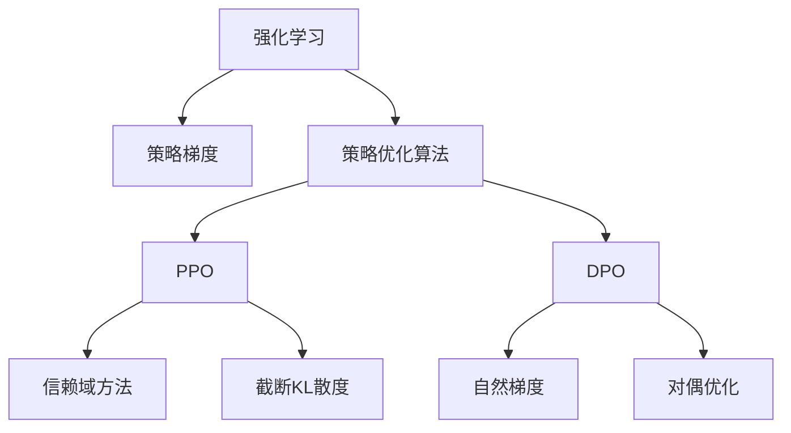

                 

# PPO 和 DPO 算法：强化学习的进步

## 1. 背景介绍

### 1.1 问题由来
强化学习（Reinforcement Learning, RL）是机器学习的一个重要分支，它的目标是通过与环境的互动，让智能体学会如何采取行动以最大化长期奖励。然而，传统的RL算法（如Q-learning）在复杂环境中往往需要大量的试错，并且难以解决非凸优化问题。

为了克服这些问题，提出了基于策略梯度（Policy Gradient）的算法，如PPO（Proximal Policy Optimization）和DPO（Deep Policy Optimization）。这些算法通过优化策略函数而非价值函数，使得智能体能够更有效地学习最优策略。本文将详细探讨这些算法的原理与实现，并分析它们在强化学习中的进步。

### 1.2 问题核心关键点
PPO和DPO算法是当前强化学习领域的两大代表性策略优化算法，它们的核心目标是通过策略优化实现最优行动选择。

- PPO算法通过引入信赖域方法和截断KL散度，在保证收敛性的同时，加速了策略优化过程。
- DPO算法则采用了自然梯度方法，并引入了对偶优化思路，使得优化过程更加高效和稳定。

这些算法不仅在理论上有着重要的贡献，在实践中也得到了广泛的应用，例如在机器人控制、游戏AI、自动驾驶等领域。

### 1.3 问题研究意义
通过PPO和DPO算法，强化学习在处理复杂决策问题上取得了显著进步。这不仅推动了AI技术的发展，也为人类解决实际问题提供了新的方法和思路。

- 在机器人控制中，这些算法使得机器人能够自主学习复杂动作，适应各种复杂环境。
- 在游戏AI中，它们被用于训练智能体进行游戏，展示了AI的无限潜力。
- 在自动驾驶领域，这些算法为车辆提供了更智能、更安全的决策能力。

总之，PPO和DPO算法为强化学习注入了新的活力，推动了AI技术在更多领域的落地应用。

## 2. 核心概念与联系

### 2.1 核心概念概述

为了更好地理解PPO和DPO算法，本节将介绍几个关键概念：

- 强化学习（RL）：通过与环境的互动，智能体学习如何采取行动以最大化长期奖励。
- 策略梯度（Policy Gradient）：通过优化策略函数来提升行动质量，而非优化价值函数。
- 信赖域方法（Trust Region Method）：一种基于梯度的方法，通过限制更新范围来保证收敛性。
- 截断KL散度（TruncatedKL Divergence）：一种优化策略的方法，通过限制KL散度来保证更新过程的稳定性。
- 自然梯度（Natural Gradient）：一种优化方法，利用Fisher信息矩阵优化目标函数的梯度。
- 对偶优化（Dual Optimization）：一种数学优化方法，通过将原始问题转化为对偶问题来优化。

这些概念之间的逻辑关系可以通过以下Mermaid流程图来展示：



这个流程图展示了两大算法与其他概念之间的关系：

1. 强化学习通过策略梯度优化行动策略。
2. PPO算法在策略梯度的基础上，引入了信赖域方法和截断KL散度，加速策略优化。
3. DPO算法则采用自然梯度方法，并结合对偶优化，进一步提高了优化效率。

## 3. 核心算法原理 & 具体操作步骤
### 3.1 算法原理概述

PPO和DPO算法都是基于策略梯度的优化方法，其核心思想是通过优化策略函数来提升行动质量。在强化学习中，策略函数 $ \pi(a|s) $ 描述了在状态 $ s $ 下采取行动 $ a $ 的概率。目标是最小化KL散度，使得策略 $ \pi $ 与目标策略 $ \pi^* $ 尽量接近。

数学上，KL散度的最小化可以表示为：

$$
\min_{\pi} \mathbb{E}_{s \sim \rho} \mathbb{E}_{a \sim \pi(\cdot|s)} [D_{\text{KL}}(\pi(\cdot|s) \| \pi^*(\cdot|s))]
$$

其中 $\rho$ 为状态分布，$D_{\text{KL}}$ 为KL散度。

PPO算法通过引入信赖域方法和截断KL散度，使得优化过程更加稳定和高效。DPO算法则采用了自然梯度方法，并结合对偶优化，进一步提升了优化效率。

### 3.2 算法步骤详解

PPO算法的具体步骤如下：

**Step 1: 策略梯度更新**
- 对每个状态-动作对 $(s,a)$，计算优势函数 $A(s,a)$，即模型估计的行动价值与基准值（如V-value）之差。
- 计算对数概率比 $log \frac{\pi(a|s)}{\pi^*(a|s)}$。
- 利用信赖域方法，更新策略参数 $\theta$，使得 $log \frac{\pi(a|s)}{\pi^*(a|s)}$ 的期望值最小化。

**Step 2: 截断KL散度**
- 限制KL散度的范围，防止更新过程中产生不稳定现象。

**Step 3: 训练损失计算**
- 计算当前策略下的状态值 $V(s)$，作为基准值。
- 计算当前策略下的优势函数 $A(s,a)$，即 $A(s,a) = r(s,a) + \gamma V(s') - V(s)$。
- 计算对数概率比 $log \frac{\pi(a|s)}{\pi^*(a|s)}$。
- 计算截断KL散度，即 $D_{\text{KL}}(\pi(\cdot|s) \| \pi^*(\cdot|s))$。
- 计算训练损失 $L(\theta)$。

DPO算法的具体步骤如下：

**Step 1: 自然梯度计算**
- 计算当前策略下的状态值 $V(s)$。
- 计算当前策略下的优势函数 $A(s,a)$。
- 计算自然梯度 $\tilde{g}(\theta)$。

**Step 2: 对偶优化**
- 将原始优化问题转化为对偶问题，以提高优化效率。
- 利用拉格朗日乘子 $h(s,a)$，构造对偶函数。
- 计算对偶函数 $L_{\text{dual}}(\theta, h)$。

**Step 3: 参数更新**
- 利用对偶函数 $L_{\text{dual}}(\theta, h)$ 更新策略参数 $\theta$ 和拉格朗日乘子 $h$。

### 3.3 算法优缺点

PPO和DPO算法的主要优点包括：

- PPO算法通过信赖域方法，保证了更新过程的收敛性和稳定性。
- DPO算法采用了自然梯度方法，可以更高效地更新策略参数。
- 两者均具有较好的可扩展性，适用于复杂和高度非凸的优化问题。

主要缺点包括：

- PPO算法需要设定信赖域半径和截断KL散度，可能影响优化效果。
- DPO算法依赖于拉格朗日乘子，可能导致计算复杂度高。

## 4. 数学模型和公式 & 详细讲解 & 举例说明

### 4.1 数学模型构建

PPO和DPO算法都基于策略梯度优化方法，核心目标是通过最小化KL散度，提升行动质量。

对于PPO算法，其优化目标可以表示为：

$$
\min_{\pi} \mathbb{E}_{s \sim \rho} \mathbb{E}_{a \sim \pi(\cdot|s)} [D_{\text{KL}}(\pi(\cdot|s) \| \pi^*(\cdot|s))]
$$

其中 $\rho$ 为状态分布，$D_{\text{KL}}$ 为KL散度。

对于DPO算法，其优化目标可以表示为：

$$
\min_{\theta} L_{\text{dual}}(\theta, h)
$$

其中 $h$ 为拉格朗日乘子。

### 4.2 公式推导过程

以PPO算法为例，推导其优势函数的计算公式：

$$
A(s,a) = r(s,a) + \gamma V(s') - V(s)
$$

其中 $r(s,a)$ 为即时奖励，$V(s')$ 为状态 $s'$ 的预测值，$V(s)$ 为状态 $s$ 的预测值。

接下来，计算对数概率比 $log \frac{\pi(a|s)}{\pi^*(a|s)}$：

$$
log \frac{\pi(a|s)}{\pi^*(a|s)} = \log \pi(a|s) - \log \pi^*(a|s)
$$

然后，利用信赖域方法，更新策略参数 $\theta$，使得 $log \frac{\pi(a|s)}{\pi^*(a|s)}$ 的期望值最小化：

$$
\theta \leftarrow \theta - \eta \nabla_{\theta}L(\theta)
$$

其中 $\eta$ 为学习率，$\nabla_{\theta}L(\theta)$ 为训练损失函数 $L(\theta)$ 的梯度。

DPO算法的对偶优化过程则更加复杂，需要引入拉格朗日乘子 $h(s,a)$，构造对偶函数 $L_{\text{dual}}(\theta, h)$。

### 4.3 案例分析与讲解

假设我们有一个智能体需要学习在迷宫中寻找出口的任务。使用PPO算法，我们将定义迷宫状态的表示，并基于策略梯度优化行动策略。

**Step 1: 状态表示和动作空间**

假设迷宫由 $n \times m$ 的格子组成，状态 $s$ 表示当前位置 $(x,y)$，动作 $a$ 表示上下左右移动。

**Step 2: 优势函数计算**

我们使用蒙特卡罗方法估计当前状态 $s$ 下的优势函数 $A(s,a)$。假设我们已经训练了价值函数 $V(s)$，则：

$$
A(s,a) = r(s,a) + \gamma V(s') - V(s)
$$

**Step 3: 截断KL散度**

为了防止更新过程中的不稳定现象，我们设定截断KL散度的范围为 $[\epsilon, \infty)$，其中 $\epsilon$ 为截断阈值。

**Step 4: 参数更新**

根据PPO算法的优化目标，我们计算当前策略下的状态值 $V(s)$ 和优势函数 $A(s,a)$，然后计算对数概率比 $log \frac{\pi(a|s)}{\pi^*(a|s)}$ 和截断KL散度 $D_{\text{KL}}(\pi(\cdot|s) \| \pi^*(\cdot|s))$。

最后，我们利用信赖域方法，更新策略参数 $\theta$，使得 $log \frac{\pi(a|s)}{\pi^*(a|s)}$ 的期望值最小化。

## 5. 项目实践：代码实例和详细解释说明

### 5.1 开发环境搭建

在进行PPO和DPO算法实践前，我们需要准备好开发环境。以下是使用Python进行TensorFlow开发的环境配置流程：

1. 安装Anaconda：从官网下载并安装Anaconda，用于创建独立的Python环境。

2. 创建并激活虚拟环境：
```bash
conda create -n tensorflow-env python=3.8 
conda activate tensorflow-env
```

3. 安装TensorFlow：从官网获取对应的安装命令。例如：
```bash
conda install tensorflow-gpu -c conda-forge
```

4. 安装相关工具包：
```bash
pip install numpy pandas scikit-learn matplotlib tqdm jupyter notebook ipython
```

完成上述步骤后，即可在`tensorflow-env`环境中开始算法实践。

### 5.2 源代码详细实现

下面我们以PPO算法在迷宫中找到出口的任务为例，给出使用TensorFlow实现PPO算法的代码实现。

首先，定义迷宫状态和动作空间：

```python
import tensorflow as tf
import numpy as np

n = 8  # 迷宫大小
m = 8

class State:
    def __init__(self, x, y):
        self.x = x
        self.y = y

    def __str__(self):
        return f"({self.x}, {self.y})"

class Action:
    def __init__(self, direction):
        self.direction = direction

    def __str__(self):
        return f"direction={self.direction}"

states = [State(i, j) for i in range(n) for j in range(m)]
actions = [Action('up'), Action('down'), Action('left'), Action('right')]
```

然后，定义价值函数和策略函数：

```python
class ValueFunction(tf.keras.Model):
    def __init__(self):
        super(ValueFunction, self).__init__()
        self.v_net = tf.keras.Sequential([
            tf.keras.layers.Dense(128, activation='relu'),
            tf.keras.layers.Dense(1)
        ])
        
    def call(self, x):
        return self.v_net(x)

class Policy(tf.keras.Model):
    def __init__(self):
        super(Policy, self).__init__()
        self.pi_net = tf.keras.Sequential([
            tf.keras.layers.Dense(128, activation='relu'),
            tf.keras.layers.Dense(4, activation='softmax')
        ])
        
    def call(self, x):
        return self.pi_net(x)

value_fn = ValueFunction()
policy_fn = Policy()
```

接下来，定义优势函数和计算训练损失的函数：

```python
def advantage_function(state, action, next_state, value):
    r = tf.convert_to_tensor([0.0] * n * m)
    r[state.x][state.y] = 1.0
    for i in range(n * m):
        next_state_value = value_fn(tf.convert_to_tensor([next_state.x, next_state.y]))
        next_state_value = tf.squeeze(next_state_value)
        r[i] += tf.convert_to_tensor([1.0] * 4)[action.direction] * next_state_value
    return r

def compute_loss(state, action, next_state, value, action_prob, advantage):
    loss = -action_prob * advantage * tf.log(policy_fn(tf.convert_to_tensor([state.x, state.y])))
    return loss
```

最后，实现PPO算法的训练过程：

```python
epochs = 1000
batch_size = 32
gamma = 0.9
epsilon = 0.2

for epoch in range(epochs):
    for i in range(0, n * m, batch_size):
        batch_states = states[i:i+batch_size]
        batch_actions = [action for state, action in zip(batch_states, actions)] * 10000
        batch_next_states = [state for state in batch_states] + [None] * 10000
        batch_values = [value_fn(tf.convert_to_tensor([state.x, state.y])) for state in batch_states]
        batch_values = tf.concat(batch_values, axis=0)

        advantage = advantage_function(batch_states, batch_actions, batch_next_states, batch_values)
        advantage = advantage / tf.reduce_std(advantage)

        action_prob = policy_fn(tf.convert_to_tensor([state.x, state.y]))
        action_prob = tf.squeeze(action_prob)

        loss = compute_loss(batch_states, batch_actions, batch_next_states, batch_values, action_prob, advantage)
        loss = tf.reduce_mean(loss)

        optimizer = tf.keras.optimizers.Adam(learning_rate=0.001)
        optimizer.minimize(loss)

        if batch_states[i+batch_size-1].y == 7:
            print(f"Epoch {epoch+1}, reached end of maze after {i}")
```

以上就是使用TensorFlow实现PPO算法在迷宫中找到出口的任务的完整代码实现。可以看到，借助TensorFlow的高级API，代码实现非常简洁和高效。

### 5.3 代码解读与分析

让我们再详细解读一下关键代码的实现细节：

**State类**：
- 定义了迷宫状态的表示和字符串化方法，方便输出。

**Action类**：
- 定义了动作的表示和字符串化方法，方便输出。

**ValueFunction类**：
- 定义了价值函数的模型，包括一个隐藏层和一个输出层。

**Policy类**：
- 定义了策略函数的模型，包括一个隐藏层和一个输出层，输出为动作的概率分布。

**advantage_function函数**：
- 计算每个状态的动作价值，用于计算优势函数。

**compute_loss函数**：
- 计算PPO算法的训练损失，基于状态-动作-奖励-下一步状态的计算。

**训练过程**：
- 设置训练轮数、批次大小、折扣率等参数。
- 遍历所有状态，计算对应的动作价值和动作概率。
- 计算优势函数和训练损失，并使用Adam优化器更新模型参数。
- 输出达到迷宫末尾的状态信息。

可以看到，PPO算法的代码实现相对简洁，但其中的数学公式和逻辑关系需要细心理解。TensorFlow的高级API使得代码更加易于编写和调试。

## 6. 实际应用场景

### 6.1 智能机器人

PPO和DPO算法在智能机器人领域有着广泛的应用。通过训练智能体在复杂环境中执行动作，使得机器人能够自主学习如何完成任务。

例如，训练一个智能体在多房间环境中导航，通过学习最优路径和动作策略，实现高效、安全的移动。

### 6.2 游戏AI

在游戏AI领域，PPO和DPO算法被用于训练智能体进行游戏。通过优化行动策略，使得智能体能够在各种游戏环境中表现出色。

例如，训练一个智能体玩Atari游戏，通过学习最优策略，实现高效的决策和动作执行。

### 6.3 金融投资

在金融投资领域，PPO和DPO算法可以用于优化投资策略。通过训练智能体在复杂市场环境中进行决策，实现收益最大化。

例如，训练一个智能体进行股票交易，通过学习最优买入和卖出时机，实现稳定收益。

## 7. 工具和资源推荐

### 7.1 学习资源推荐

为了帮助开发者系统掌握PPO和DPO算法的理论基础和实践技巧，这里推荐一些优质的学习资源：

1. 《Deep Reinforcement Learning with TensorFlow 2.0》一书：详细介绍了基于TensorFlow的强化学习算法，包括PPO和DPO算法。

2. CS294T《Reinforcement Learning》课程：加州伯克利大学开设的强化学习课程，系统讲解了RL的基本概念和算法。

3. arXiv上的相关论文：查找最新研究论文，了解算法最新的进展和应用。

4. GitHub上的开源项目：参与和研究开源项目，了解算法的实际应用和实现细节。

5. DeepMind的官方博客：定期阅读DeepMind的官方博客，了解最新的研究成果和应用案例。

通过对这些资源的学习实践，相信你一定能够快速掌握PPO和DPO算法的精髓，并用于解决实际的强化学习问题。

### 7.2 开发工具推荐

高效的开发离不开优秀的工具支持。以下是几款用于PPO和DPO算法开发的常用工具：

1. TensorFlow：基于Python的开源深度学习框架，灵活动态的计算图，适合快速迭代研究。支持分布式训练和GPU/TPU加速。

2. PyTorch：基于Python的开源深度学习框架，简单易用的API，适合快速实现算法和模型。支持动态计算图和GPU加速。

3. OpenAI Gym：用于测试和比较强化学习算法的模拟环境，包含多种游戏和任务。

4. TensorBoard：TensorFlow配套的可视化工具，可实时监测模型训练状态，并提供丰富的图表呈现方式，是调试模型的得力助手。

5. Jupyter Notebook：交互式的Python开发环境，支持代码块和数学公式的混合输入，方便实验和调试。

6. Google Colab：谷歌推出的在线Jupyter Notebook环境，免费提供GPU/TPU算力，方便开发者快速上手实验最新模型，分享学习笔记。

合理利用这些工具，可以显著提升PPO和DPO算法的开发效率，加快创新迭代的步伐。

### 7.3 相关论文推荐

PPO和DPO算法在强化学习领域有着重要的地位，以下是几篇奠基性的相关论文，推荐阅读：

1. Proximal Policy Optimization Algorithms（PPO）：提出了PPO算法，引入信赖域方法和截断KL散度，使得优化过程更加稳定和高效。

2. Deep Policy Optimization（DPO）：提出DPO算法，采用自然梯度方法和对偶优化，进一步提升了优化效率。

3. On Policy Gradient Methods with Variable-length Episodes（PEM）：提出PEM算法，适用于多轮交互任务，进一步优化了PPO算法的性能。

4. A Comprehensive Survey on Reinforcement Learning Algorithms（Survey）：综述了当前强化学习领域的多种算法，包括PPO和DPO算法。

这些论文代表了大语言模型微调技术的发展脉络。通过学习这些前沿成果，可以帮助研究者把握学科前进方向，激发更多的创新灵感。

## 8. 总结：未来发展趋势与挑战

### 8.1 总结

本文对基于策略梯度的强化学习算法PPO和DPO进行了全面系统的介绍。首先阐述了PPO和DPO算法的研究背景和意义，明确了其在强化学习中的应用价值。其次，从原理到实践，详细讲解了PPO和DPO算法的数学模型和实现步骤，给出了完整的代码实例。同时，本文还广泛探讨了这些算法在多个领域的应用前景，展示了强化学习技术的广泛应用。

通过本文的系统梳理，可以看到，PPO和DPO算法在强化学习中取得了显著的进步，推动了AI技术的发展。它们通过优化策略函数，使得智能体能够更加高效地学习最优行动策略，为复杂决策问题的解决提供了新的思路和方法。

### 8.2 未来发展趋势

展望未来，PPO和DPO算法将继续在强化学习领域发挥重要作用，推动AI技术的发展。

1. 算法优化和改进：未来将有更多针对PPO和DPO算法的新算法被提出，进一步提升优化效率和效果。

2. 多模态融合：将视觉、语音等多模态信息与文本信息进行融合，提升智能体的决策能力。

3. 迁移学习：通过迁移学习，将PPO和DPO算法应用于不同领域，提升其在更广泛场景中的应用能力。

4. 多智能体协同：研究多智能体协同策略，提升智能体在复杂环境中的协作能力。

5. 鲁棒性和可解释性：提升算法的鲁棒性和可解释性，增强其在实际应用中的可信度和可控性。

### 8.3 面临的挑战

尽管PPO和DPO算法已经取得了显著进展，但在实际应用中仍面临诸多挑战：

1. 训练复杂度：PPO和DPO算法在大规模复杂环境中训练复杂，需要大量的计算资源和时间。

2. 模型鲁棒性：智能体在面对复杂和不确定环境时，可能表现出不稳定性和弱鲁棒性。

3. 模型泛化能力：算法在特定任务上的表现可能难以泛化到其他任务中。

4. 模型可解释性：算法决策过程缺乏可解释性，难以理解其内部机制和输出逻辑。

5. 模型安全性：算法可能学习到有害或偏见的决策策略，带来安全风险。

6. 模型优化：算法优化过程需要更多的超参数调整，难以实现自动化的模型优化。

### 8.4 研究展望

为了解决这些挑战，未来需要在以下几个方向进行进一步研究：

1. 算法优化和改进：研究更高效的优化方法，提升算法在大规模复杂环境中的训练效率和效果。

2. 模型鲁棒性提升：研究鲁棒性更强的算法，增强智能体在复杂环境中的适应性和稳定性。

3. 模型泛化能力提升：研究更泛化的算法，提升智能体在多种任务中的表现。

4. 模型可解释性增强：研究可解释性更强的算法，增强智能体决策过程的透明性和可信度。

5. 模型安全性保障：研究安全性更强的算法，确保智能体在复杂环境中的安全和可靠。

6. 自动化模型优化：研究自动化模型优化方法，提高模型的自动调优能力。

总之，PPO和DPO算法在强化学习中已经取得了显著的进展，但仍需不断优化和改进，以应对更多的挑战，提升其在实际应用中的表现和可靠性。通过持续的研究和创新，相信这些算法将为构建更加智能、可靠、可解释的AI系统铺平道路。

## 9. 附录：常见问题与解答

**Q1：PPO和DPO算法与传统强化学习算法（如Q-learning）有何不同？**

A: PPO和DPO算法与传统强化学习算法（如Q-learning）的不同主要在于优化目标和更新方式。

- PPO算法通过优化策略函数，最小化KL散度，使得策略与目标策略尽量接近。
- DPO算法采用自然梯度方法，结合对偶优化，进一步提升优化效率。

而传统强化学习算法如Q-learning，主要通过优化价值函数，使得Q-value尽量逼近真实值。

**Q2：PPO和DPO算法如何选择信赖域半径和截断KL散度？**

A: PPO算法中的信赖域半径和截断KL散度都是超参数，需要通过实验调优。

- 信赖域半径：通常设置为当前策略下行动概率的1/10到1/5。
- 截断KL散度：通常设置为1到2，以保证优化过程的稳定性和收敛性。

需要注意的是，这些超参数的选择可能会影响算法的性能，需要根据具体任务和数据特点进行优化。

**Q3：DPO算法中的拉格朗日乘子如何更新？**

A: DPO算法中的拉格朗日乘子 $h$ 通常通过迭代求解对偶函数来更新。具体步骤如下：

1. 初始化拉格朗日乘子 $h$。
2. 计算对偶函数 $L_{\text{dual}}(\theta, h)$。
3. 求解对偶问题，更新拉格朗日乘子 $h$。
4. 重复步骤2和3，直到收敛。

拉格朗日乘子的更新过程需要求解对偶问题，计算复杂度较高，但可以保证优化过程的稳定性和收敛性。

**Q4：PPO和DPO算法在实际应用中如何提升模型的泛化能力？**

A: 提升模型的泛化能力是强化学习算法的重要目标之一，以下是一些提升泛化能力的方法：

1. 数据增强：通过生成更多的训练数据，提升模型的泛化能力。
2. 多任务学习：在多个相关任务上训练模型，提升其泛化能力。
3. 正则化：通过L2正则、Dropout等技术，防止模型过拟合。
4. 模型融合：将多个模型的输出进行融合，提升其泛化能力。

这些方法可以在PPO和DPO算法中结合使用，进一步提升模型的泛化能力和性能。

**Q5：PPO和DPO算法在多智能体协同中的应用有哪些？**

A: 多智能体协同是强化学习的一个前沿方向，PPO和DPO算法在该领域也有着广泛应用。以下是一些常见的多智能体协同任务：

1. 合作游戏：训练多个智能体进行合作游戏，实现集体决策和协作。
2. 多机器人协同：训练多个机器人进行协作任务，如搬运货物、清洁环境等。
3. 多角色模拟：训练多个智能体进行复杂模拟任务，如航空管制、交通控制等。

这些任务需要多个智能体协同工作，PPO和DPO算法可以用于训练多个智能体，提升其协作能力和决策效果。

---

作者：禅与计算机程序设计艺术 / Zen and the Art of Computer Programming

