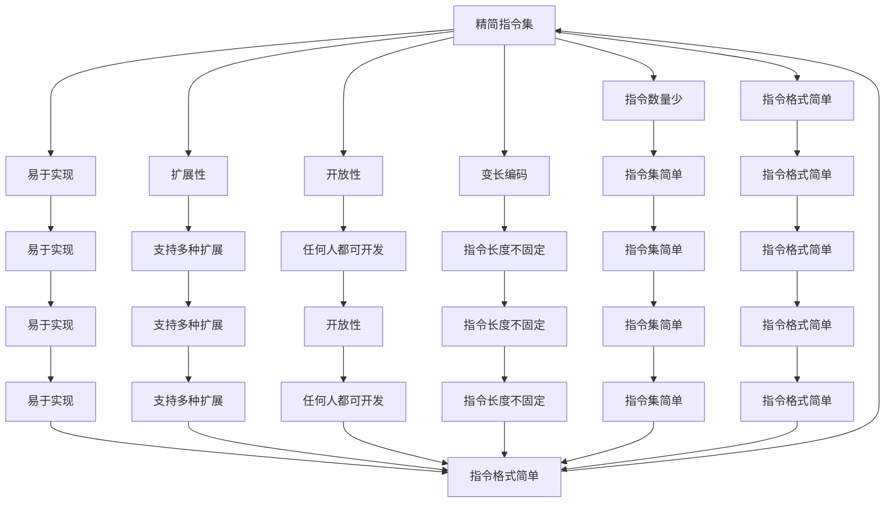

                 

## 1. 背景介绍

RISC-V是一种开源的指令集架构(ISA)，它提供了一个灵活且可定制的硬件设计平台。RISC-V被设计用于支持各种计算应用，包括桌面计算、物联网(IoT)、云计算和嵌入式系统等。RISC-V的创新性在于它为开发者提供了一个开源、自由使用的架构，这意味着开发者可以自由地使用、修改和分发RISC-V相关的代码和文档。

### 1.1 问题由来

随着计算技术的快速发展，对于新的、更加高效、更加灵活的指令集架构的需求日益增加。传统的基于x86和ARM的架构已经难以满足新的计算应用场景，如高性能计算、人工智能、物联网、边缘计算等。

### 1.2 问题核心关键点

RISC-V架构的兴起，在于其设计理念上的创新和实现上的灵活性。RISC-V架构的核心关键点包括：

- 开源和免费：RISC-V提供完全免费的开源授权，用户可以自由使用、修改和分发RISC-V相关的代码和文档。
- 灵活和可定制：RISC-V提供多种不同规格的指令集，以适应不同的应用场景和硬件设计需求。
- 低功耗和高性能：RISC-V的设计目标之一是提供低功耗、高性能的计算解决方案，适合各种计算设备。
- 社区驱动的开发：RISC-V社区由全球的开发者和硬件公司组成，共同推动RISC-V的发展和应用。

这些关键点使得RISC-V架构在竞争激烈的计算市场中占据了重要的位置。

## 2. 核心概念与联系

### 2.1 核心概念概述

RISC-V架构包括三种不同层次的指令集：RISC-V I、RISC-V II和RISC-V III。每种指令集适用于不同的应用场景。

- **RISC-V I**：适用于低功耗和嵌入式系统，其指令集简单，易于实现。
- **RISC-V II**：适用于高性能计算和高功耗应用，其指令集更加复杂，性能更强。
- **RISC-V III**：适用于极端高性能计算，如人工智能和大数据处理，其指令集更加复杂，可以提供更高的性能。

RISC-V架构的核心概念包括：

- 精简指令集：RISC-V采用精简指令集，指令数量少，指令格式简单，易于实现。
- 变长编码：RISC-V采用变长编码，指令长度不固定，提高了指令集的灵活性和扩展性。
- 扩展性：RISC-V架构支持多种不同的扩展指令集，开发者可以根据应用需求选择适合的扩展。
- 开放性：RISC-V架构完全开源，任何人都可以在此基础上进行自由开发和创新。

这些核心概念构成了RISC-V架构的基本框架，使其能够适应各种计算应用场景，并推动RISC-V生态系统的发展。

### 2.2 核心概念原理和架构的 Mermaid 流程图



## 3. 核心算法原理 & 具体操作步骤

### 3.1 算法原理概述

RISC-V架构的算法原理是基于精简指令集和变长编码的设计理念。精简指令集使得指令集简单，易于实现，变长编码则提高了指令集的灵活性和扩展性。

RISC-V架构的算法步骤主要包括以下几个关键环节：

1. 设计指令集：根据应用需求设计指令集，包括基本指令集和多种扩展指令集。
2. 实现硬件：根据指令集设计硬件逻辑，包括控制器、运算器和存储器等。
3. 验证和优化：对实现好的硬件进行验证和优化，确保其符合指令集规范和性能要求。
4. 开发工具链：开发和优化编译器、汇编器等工具链，支持不同平台的开发。

### 3.2 算法步骤详解

**步骤1：设计指令集**

RISC-V架构的设计团队根据应用需求设计不同的指令集，包括基本指令集和多种扩展指令集。基本指令集包括加、减、乘、除、跳转等基本操作，扩展指令集则包括向量、浮点、加密等高级操作。

**步骤2：实现硬件**

根据设计好的指令集，开发相应的硬件逻辑。硬件逻辑包括控制器、运算器和存储器等。控制器负责调度指令执行，运算器负责执行指令，存储器负责存储数据和程序。

**步骤3：验证和优化**

对实现好的硬件进行验证和优化，确保其符合指令集规范和性能要求。验证和优化包括功能验证、性能测试和功耗测试等。

**步骤4：开发工具链**

开发和优化编译器、汇编器等工具链，支持不同平台的开发。工具链包括编译器、调试器、模拟器等。

### 3.3 算法优缺点

RISC-V架构的优点包括：

- 开源和免费：RISC-V提供完全免费的开源授权，用户可以自由使用、修改和分发RISC-V相关的代码和文档。
- 灵活和可定制：RISC-V提供多种不同规格的指令集，以适应不同的应用场景和硬件设计需求。
- 低功耗和高性能：RISC-V的设计目标之一是提供低功耗、高性能的计算解决方案，适合各种计算设备。
- 社区驱动的开发：RISC-V社区由全球的开发者和硬件公司组成，共同推动RISC-V的发展和应用。

RISC-V架构的缺点包括：

- 生态系统较新：RISC-V架构相对较新，生态系统还未完全成熟，需要进一步发展和完善。
- 硬件设计复杂：RISC-V架构的设计和实现较为复杂，需要一定的硬件设计和开发经验。
- 软件生态有待完善：RISC-V架构的软件生态系统尚未完全成熟，需要更多的软件支持和优化。

### 3.4 算法应用领域

RISC-V架构适用于各种计算应用，包括桌面计算、物联网(IoT)、云计算和嵌入式系统等。RISC-V架构的应用领域包括：

- **桌面计算**：适用于个人电脑、服务器和工作站等高性能计算应用。
- **物联网(IoT)**：适用于智能家居、工业控制和医疗设备等嵌入式系统。
- **云计算**：适用于云服务器和数据中心等大规模计算应用。
- **嵌入式系统**：适用于移动设备、智能传感器和工业控制等低功耗计算应用。

## 4. 数学模型和公式 & 详细讲解 & 举例说明

### 4.1 数学模型构建

RISC-V架构的数学模型主要包括以下几个关键部分：

- **指令集**：RISC-V指令集分为三种不同规格：I、II和III。指令集包括基本指令集和多种扩展指令集。
- **硬件逻辑**：硬件逻辑包括控制器、运算器和存储器等。
- **验证和优化**：验证和优化包括功能验证、性能测试和功耗测试等。
- **工具链**：工具链包括编译器、调试器和模拟器等。

### 4.2 公式推导过程

**基本指令集**：

RISC-V架构的基本指令集包括加、减、乘、除、跳转等基本操作。以加法指令为例，其指令格式如下：

$$\text{ADD} \, \text{R1}, \text{R2}, \text{R3}$$

其中，$\text{R1}$、$\text{R2}$和$\text{R3}$分别为源寄存器、目标寄存器和常量寄存器。

**扩展指令集**：

RISC-V架构的扩展指令集包括向量、浮点和加密等高级操作。以向量指令为例，其指令格式如下：

$$\text{VADD} \, \text{V1}, \text{V2}, \text{V3}$$

其中，$\text{V1}$、$\text{V2}$和$\text{V3}$分别为向量寄存器。

### 4.3 案例分析与讲解

**RISC-V I**：

RISC-V I适用于低功耗和嵌入式系统，其指令集简单，易于实现。以加法指令为例，其指令格式如下：

$$\text{ADD} \, \text{R1}, \text{R2}, \text{R3}$$

其中，$\text{R1}$、$\text{R2}$和$\text{R3}$分别为源寄存器、目标寄存器和常量寄存器。

**RISC-V II**：

RISC-V II适用于高性能计算和高功耗应用，其指令集更加复杂，性能更强。以向量指令为例，其指令格式如下：

$$\text{VADD} \, \text{V1}, \text{V2}, \text{V3}$$

其中，$\text{V1}$、$\text{V2}$和$\text{V3}$分别为向量寄存器。

**RISC-V III**：

RISC-V III适用于极端高性能计算，如人工智能和大数据处理，其指令集更加复杂，可以提供更高的性能。以浮点指令为例，其指令格式如下：

$$\text{FADD} \, \text{R1}, \text{R2}, \text{R3}$$

其中，$\text{R1}$、$\text{R2}$和$\text{R3}$分别为源寄存器、目标寄存器和常量寄存器。

## 5. 项目实践：代码实例和详细解释说明

### 5.1 开发环境搭建

开发RISC-V架构需要对硬件和软件进行设计、实现和测试。以下是一个基本的开发环境搭建流程：

1. 安装RISC-V工具链：RISC-V工具链包括GCC、LLVM和Booting工具链等。
2. 设计硬件逻辑：使用Verilog或Chisel等硬件设计工具进行硬件逻辑设计。
3. 实现指令集：根据设计好的硬件逻辑，实现RISC-V指令集。
4. 进行验证和优化：使用模拟器进行功能验证和性能测试。
5. 开发工具链：开发和优化编译器、调试器和模拟器等工具链。

### 5.2 源代码详细实现

**Verilog代码实现**：

以下是使用Verilog语言实现RISC-V I加法指令的示例代码：

```verilog
module adder(input [31:0] op1, input [31:0] op2, output [31:0] result);
    assign result = op1 + op2;
endmodule
```

**Chisel代码实现**：

以下是使用Chisel语言实现RISC-V I加法指令的示例代码：

```scala
class adder extends Specialization("add", "add", IntBits(32)) {
    val op1: AdderInput
    val op2: AdderInput
    val result: AdderOutput
    ...
}
```

### 5.3 代码解读与分析

**Verilog代码**：

Verilog是一种硬件描述语言，用于设计数字电路。Verilog代码简单易懂，易于理解和修改。

**Chisel代码**：

Chisel是一种面向硬件的Scala库，用于设计数字电路。Chisel代码具有Scala语言的简洁性和可读性，同时也支持硬件描述。

## 6. 实际应用场景

### 6.1 桌面计算

RISC-V架构适用于高性能计算应用，如个人电脑、服务器和工作站等。以下是一个桌面计算的示例：

1. 使用RISC-V工具链进行编译和优化。
2. 使用RISC-V I指令集进行基础操作。
3. 使用RISC-V II指令集进行高级操作，如浮点和向量计算。
4. 使用RISC-V III指令集进行极端高性能计算，如人工智能和大数据处理。

### 6.2 物联网(IoT)

RISC-V架构适用于低功耗和嵌入式系统，如智能家居、工业控制和医疗设备等。以下是一个物联网(IoT)的示例：

1. 使用RISC-V工具链进行编译和优化。
2. 使用RISC-V I指令集进行基础操作，如传感器数据采集和处理。
3. 使用RISC-V II指令集进行高级操作，如图像处理和模式识别。
4. 使用RISC-V III指令集进行极端高性能计算，如实时数据分析和预测。

### 6.3 云计算

RISC-V架构适用于大规模计算应用，如云服务器和数据中心等。以下是一个云计算的示例：

1. 使用RISC-V工具链进行编译和优化。
2. 使用RISC-V I指令集进行基础操作，如数据存储和传输。
3. 使用RISC-V II指令集进行高级操作，如数据处理和分析。
4. 使用RISC-V III指令集进行极端高性能计算，如人工智能和大数据处理。

### 6.4 嵌入式系统

RISC-V架构适用于低功耗计算应用，如移动设备、智能传感器和工业控制等。以下是一个嵌入式系统的示例：

1. 使用RISC-V工具链进行编译和优化。
2. 使用RISC-V I指令集进行基础操作，如传感器数据采集和处理。
3. 使用RISC-V II指令集进行高级操作，如图像处理和模式识别。
4. 使用RISC-V III指令集进行极端高性能计算，如实时数据分析和预测。

## 7. 工具和资源推荐

### 7.1 学习资源推荐

为了帮助开发者系统掌握RISC-V架构的理论基础和实践技巧，这里推荐一些优质的学习资源：

1. RISC-V官方文档：RISC-V官方网站提供了完整的文档，包括架构规范、指令集、工具链等。
2. RISC-V开发者手册：RISC-V开发者手册提供了详细的硬件设计和软件实现指导。
3. RISC-V入门教程：RISC-V入门教程提供了基础的硬件和软件知识，适合初学者。
4. RISC-V实战项目：RISC-V实战项目提供了真实的开发案例，适合实践者。
5. RISC-V社区资源：RISC-V社区提供了大量的开发资源和社区支持，适合开发者。

通过对这些资源的学习实践，相信你一定能够快速掌握RISC-V架构的精髓，并用于解决实际的计算问题。

### 7.2 开发工具推荐

RISC-V架构的开发工具包括：

1. GCC：GCC是一个流行的C/C++编译器，支持RISC-V架构。
2. LLVM：LLVM是一个开源的优化编译器，支持RISC-V架构。
3. Booting工具链：Booting工具链是一个用于启动RISC-V硬件的工具链。
4. Chisel：Chisel是一个面向硬件的Scala库，用于设计数字电路。
5. Yosys：Yosys是一个开源的FPGA设计工具，支持RISC-V架构。

合理利用这些工具，可以显著提升RISC-V架构的开发效率，加快创新迭代的步伐。

### 7.3 相关论文推荐

RISC-V架构的研究方向包括硬件设计、软件实现和应用开发等。以下是几篇代表性的相关论文：

1. "A NewISA: RISC-V Architecture Design and Implementation"：这篇论文介绍了RISC-V架构的设计和实现。
2. "The RISC-V Instruction-Set Architecture"：这篇论文详细介绍了RISC-V架构的指令集规范。
3. "RISC-V Hardware Acceleration for Deep Learning"：这篇论文介绍了RISC-V架构在深度学习中的应用。
4. "The RISC-V Software Ecosystem"：这篇论文介绍了RISC-V架构的软件生态系统。
5. "The RISC-V Instruction-Set Architecture (2016)"：这篇论文详细介绍了RISC-V架构的规范和指令集。

这些论文代表了大规模计算领域的研究进展，提供了丰富的理论基础和实践指导。

## 8. 总结：未来发展趋势与挑战

### 8.1 研究成果总结

RISC-V架构的创新设计理念和灵活的可定制性，使其在计算应用中具有广泛的应用前景。RISC-V架构的生态系统和工具链也在不断发展和完善，为开发者提供了更全面的支持。

### 8.2 未来发展趋势

RISC-V架构的未来发展趋势包括：

1. 社区驱动的生态系统：RISC-V社区将继续推动RISC-V架构的发展和应用。
2. 高性能计算：RISC-V架构将继续支持高性能计算应用，如人工智能和大数据处理。
3. 低功耗计算：RISC-V架构将继续支持低功耗计算应用，如物联网和嵌入式系统。
4. 多样化的应用场景：RISC-V架构将继续支持多样化的应用场景，如桌面计算、云计算和嵌入式系统等。

### 8.3 面临的挑战

RISC-V架构面临的挑战包括：

1. 生态系统尚未完全成熟：RISC-V架构的生态系统还未完全成熟，需要进一步发展和完善。
2. 硬件设计复杂：RISC-V架构的设计和实现较为复杂，需要一定的硬件设计和开发经验。
3. 软件生态有待完善：RISC-V架构的软件生态系统尚未完全成熟，需要更多的软件支持和优化。

### 8.4 研究展望

RISC-V架构的研究展望包括：

1. 硬件优化：进一步优化硬件设计和实现，提高性能和能效。
2. 软件生态：完善软件生态系统，提供更多的工具和支持。
3. 应用创新：推动RISC-V架构在新的应用场景中的创新和应用。

总之，RISC-V架构作为一种开源、灵活和可定制的指令集架构，具有广阔的应用前景和发展潜力。未来，RISC-V架构将继续在计算应用中发挥重要作用，推动计算技术的发展和应用。

## 9. 附录：常见问题与解答

**Q1：RISC-V架构是否适用于所有计算应用？**

A: RISC-V架构适用于各种计算应用，包括桌面计算、物联网(IoT)、云计算和嵌入式系统等。但需要注意的是，RISC-V架构的设计和实现较为复杂，需要根据具体应用场景选择合适的指令集和扩展。

**Q2：RISC-V架构的性能如何？**

A: RISC-V架构的设计目标之一是提供低功耗、高性能的计算解决方案。RISC-V架构的性能与ARM和x86等传统架构相比，具有更高的能效和更低的延迟。

**Q3：RISC-V架构是否容易被实现？**

A: RISC-V架构的设计理念是精简和灵活，易于实现。RISC-V架构提供了多种不同规格的指令集，开发者可以根据具体应用需求选择合适的指令集进行设计实现。

**Q4：RISC-V架构的未来发展方向是什么？**

A: RISC-V架构的未来发展方向包括：社区驱动的生态系统、高性能计算、低功耗计算、多样化的应用场景等。未来，RISC-V架构将继续在计算应用中发挥重要作用，推动计算技术的发展和应用。

**Q5：RISC-V架构的生态系统现状如何？**

A: RISC-V架构的生态系统正在不断发展和完善。RISC-V社区由全球的开发者和硬件公司组成，共同推动RISC-V架构的发展和应用。RISC-V架构的生态系统包括硬件设计、软件实现和应用开发等。

**Q6：RISC-V架构的应用场景有哪些？**

A: RISC-V架构适用于各种计算应用，包括桌面计算、物联网(IoT)、云计算和嵌入式系统等。RISC-V架构的应用场景包括高性能计算、低功耗计算和多样化应用场景等。

总之，RISC-V架构作为一种开源、灵活和可定制的指令集架构，具有广阔的应用前景和发展潜力。未来，RISC-V架构将继续在计算应用中发挥重要作用，推动计算技术的发展和应用。

---

作者：禅与计算机程序设计艺术 / Zen and the Art of Computer Programming

