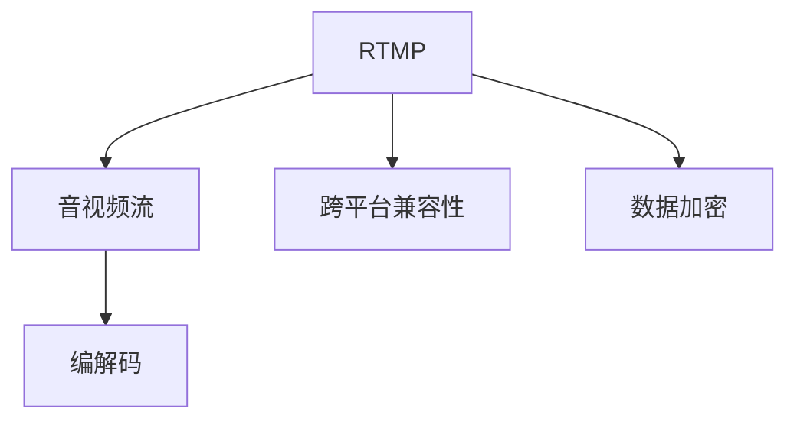

                 

# RTMP协议：直播系统开发必备知识

> 关键词：实时传输协议(RTMP),直播系统,音视频流,RTSP,WebRTC,FLV格式

## 1. 背景介绍

### 1.1 问题由来

在互联网时代，直播行业迅速发展，成为了各大平台竞相争夺的焦点。直播不仅能够实时传播信息，还能与用户形成互动，带来更强的用户粘性。直播技术涉及到的关键协议之一，就是实时传输协议(RTMP)，它是实现音视频流传输的核心。本节将介绍RTMP协议的基本概念和应用场景。

### 1.2 问题核心关键点

RTMP协议基于Adobe公司推出的Flash Player，是一种能够实现音视频流传输的协议。其主要特点包括：

- **低延迟**：通过缓存和分段传输，RTMP协议能够实现极低的延迟传输，适应实时性要求较高的直播场景。
- **可扩展性**：RTMP协议支持多种音视频编解码格式，能够适配不同的终端设备。
- **安全性**：RTMP协议提供数据加密功能，能够保护音视频数据的安全性。
- **实时互动**：RTMP协议支持双向实时通信，能够实现直播室互动功能。

这些特点使得RTMP协议在直播行业中得到了广泛的应用，成为了许多直播平台的主流选择。然而，随着技术的发展和市场的变化，RTMP协议也面临着诸多挑战，如与WebRTC等新兴协议的竞争、跨平台兼容性和数据加密等。

## 2. 核心概念与联系

### 2.1 核心概念概述

为更好地理解RTMP协议的工作原理和应用场景，本节将介绍几个密切相关的核心概念：

- **实时传输协议(RTMP)**：一种基于TCP/UDP协议的音视频流传输协议，支持多播、点播和实时互动功能。
- **音视频编解码**：将原始音视频数据转化为适合网络传输的格式，常见的编解码格式包括H.264、H.265、AAC等。
- **音视频流**：连续的音视频数据流，通过RTMP协议进行实时传输。
- **跨平台兼容性**：RTMP协议需要适配不同设备和平台的音视频播放器，确保兼容性。
- **数据加密**：采用AES、DES等加密算法，确保音视频数据在传输过程中的安全性。

这些核心概念之间的逻辑关系可以通过以下Mermaid流程图来展示：



这个流程图展示了的核心概念及其之间的关系：

1. RTMP协议用于音视频流的实时传输。
2. 音视频流通过编解码技术转化为适合网络传输的格式。
3. RTMP协议需要适配不同平台，确保兼容性。
4. RTMP协议提供数据加密功能，确保音视频数据的安全性。

这些概念共同构成了RTMP协议的工作框架，使其能够在各种场景下实现音视频流的稳定传输。

## 3. 核心算法原理 & 具体操作步骤

### 3.1 算法原理概述

RTMP协议的核心在于如何高效地传输音视频数据流，实现低延迟、高兼容性和安全性。其基本工作原理包括以下几个步骤：

1. **连接建立**：客户端通过RTMP协议与服务器建立连接，进行身份验证和握手。
2. **消息传输**：客户端和服务器通过RTMP消息格式进行数据传输，支持音视频数据、控制消息和元数据等。
3. **流传输**：通过缓存和分段传输，RTMP协议实现低延迟的音视频流传输。
4. **流控制**：RTMP协议提供流量控制机制，确保数据传输的稳定性和实时性。
5. **数据加密**：采用AES、DES等加密算法，确保音视频数据的安全性。

### 3.2 算法步骤详解

RTMP协议的具体实现步骤如下：

**Step 1: 连接建立**

客户端通过RTMP协议与服务器建立连接，进行身份验证和握手。具体的流程如下：

1. 客户端发送一个RTMP连接请求（连接建立消息），包含连接参数如主机名、端口号、密钥等。
2. 服务器接收连接请求后，验证客户端的身份和参数，如果合法则返回连接确认消息（连接建立响应）。
3. 客户端收到连接确认消息后，发送握手消息（握手响应），完成连接建立。

连接建立的消息格式如下：

```plaintext
[FLVTAG Header]  [FLVTAG Body]
-----------------
RTMP Connect
StreamID=12345
--------------------------------
```

其中，`StreamID`是客户端生成的唯一标识。

**Step 2: 消息传输**

RTMP协议使用消息格式进行数据传输，支持音视频数据、控制消息和元数据等。消息格式如下：

```plaintext
[FLVTAG Header]  [FLVTAG Body]
-----------------
RTMP Message
MessageType=1
MessageStreamID=12345
--------------------------------
```

其中，`MessageType`表示消息类型，`MessageStreamID`表示消息的流标识。

音视频数据和控制消息的具体格式如下：

音视频数据：

```plaintext
[FLVTAG Header]  [FLVTAG Body]
-----------------
RTMP Audio
AudioCodecID=1
AudioSampleRate=8000
--------------------------------
[音视频数据]
```

控制消息：

```plaintext
[FLVTAG Header]  [FLVTAG Body]
-----------------
RTMP Message
MessageType=2
MessageStreamID=12345
--------------------------------
```

控制消息具体格式如下：

```plaintext
[FLVTAG Header]  [FLVTAG Body]
-----------------
RTMP Notification
Notification=1
--------------------------------
```

**Step 3: 流传输**

RTMP协议通过缓存和分段传输，实现低延迟的音视频流传输。具体的实现步骤如下：

1. 客户端将音视频数据分割成多个小片段，每个片段的大小为1024字节。
2. 客户端将每个片段进行缓存，等到缓存满时开始传输。
3. 服务器接收音视频数据后，缓存并顺序播放。

流传输的流程如下：

1. 客户端发送FLVTAG头，包含消息类型、消息流ID和消息长度。
2. 客户端发送音视频数据片段。
3. 客户端发送FLVTAG尾，表示音视频数据传输结束。

**Step 4: 流控制**

RTMP协议提供流量控制机制，确保数据传输的稳定性和实时性。具体的实现步骤如下：

1. 客户端发送消息流ID、消息类型、消息长度等信息，告知服务器即将发送数据。
2. 服务器返回消息流ID、消息类型、消息长度等信息，确认客户端可以发送数据。
3. 客户端发送音视频数据片段，并在发送完成后发送FLVTAG尾。

流控制的流程如下：

1. 客户端发送FLVTAG头，包含消息类型、消息流ID和消息长度。
2. 客户端发送音视频数据片段。
3. 客户端发送FLVTAG尾，表示音视频数据传输结束。

**Step 5: 数据加密**

RTMP协议提供数据加密功能，确保音视频数据的安全性。具体的实现步骤如下：

1. 客户端和服务器协商密钥，生成加密流密钥。
2. 客户端和服务器在每次数据传输前，使用加密流密钥对数据进行加密。
3. 客户端和服务器在每次数据传输后，使用加密流密钥对数据进行解密。

数据加密的流程如下：

1. 客户端发送加密消息流ID、消息类型、消息长度等信息，告知服务器即将发送数据。
2. 服务器返回加密消息流ID、消息类型、消息长度等信息，确认客户端可以发送数据。
3. 客户端发送加密音视频数据片段，并在发送完成后发送加密FLVTAG尾。
4. 服务器接收加密音视频数据片段，缓存并顺序播放。

### 3.3 算法优缺点

RTMP协议在实时传输音视频数据方面具有以下优点：

- **低延迟**：通过缓存和分段传输，RTMP协议能够实现极低的延迟传输，适应实时性要求较高的直播场景。
- **可扩展性**：RTMP协议支持多种音视频编解码格式，能够适配不同的终端设备。
- **实时互动**：RTMP协议支持双向实时通信，能够实现直播室互动功能。

但RTMP协议也存在一些缺点：

- **兼容性问题**：由于RTMP协议是基于Adobe的Flash Player，对于非Flash设备的兼容性不够理想。
- **安全性问题**：虽然RTMP协议提供数据加密功能，但加密算法容易被破解，安全性有待提高。
- **网络延迟**：由于RTMP协议需要缓存数据，当网络延迟较大时，缓存溢出会导致数据丢失。

尽管存在这些缺点，RTMP协议仍然是直播行业中广泛应用的协议之一，其在实时性和互动性方面的优势仍然不可替代。

### 3.4 算法应用领域

RTMP协议在直播行业中得到了广泛的应用，覆盖了几乎所有常见的直播场景，例如：

- 游戏直播：主播能够实时向观众展示游戏画面和操作，互动性强。
- 体育直播：直播体育赛事，通过音视频流传输提供实时观看体验。
- 教育直播：教师能够实时向学生传授知识，互动性强。
- 娱乐直播：主播能够实时向观众展示才艺，互动性强。
- 产品发布：企业通过直播发布新产品，通过音视频流传输提供实时观看体验。

除了这些经典应用外，RTMP协议还被创新性地应用到更多场景中，如直播流媒体点播、云游戏、虚拟现实等，为直播技术带来了新的突破。

## 4. 数学模型和公式 & 详细讲解 & 举例说明

### 4.1 数学模型构建

RTMP协议的数学模型主要涉及以下几个方面：

1. **连接建立模型**：
   - 连接建立消息格式
   - 连接建立流程

2. **消息传输模型**：
   - 消息传输格式
   - 消息传输流程

3. **流传输模型**：
   - 流传输流程
   - 流控制机制

4. **数据加密模型**：
   - 数据加密流程
   - 数据解密流程

### 4.2 公式推导过程

以下我们将通过具体的公式推导，详细讲解RTMP协议的数学模型：

**连接建立模型**

连接建立消息格式为：

```plaintext
[FLVTAG Header]  [FLVTAG Body]
-----------------
RTMP Connect
StreamID=12345
--------------------------------
```

连接建立流程如下：

1. 客户端发送连接建立消息，包含连接参数如主机名、端口号、密钥等。
2. 服务器接收连接建立消息后，验证客户端的身份和参数，如果合法则返回连接确认消息。
3. 客户端收到连接确认消息后，发送握手消息，完成连接建立。

连接建立消息的具体格式为：

```plaintext
[FLVTAG Header]  [FLVTAG Body]
-----------------
RTMP Connect
StreamID=12345
--------------------------------
```

其中，`StreamID`为客户端生成的唯一标识。

**消息传输模型**

消息传输格式为：

```plaintext
[FLVTAG Header]  [FLVTAG Body]
-----------------
RTMP Message
MessageType=1
MessageStreamID=12345
--------------------------------
```

消息传输流程如下：

1. 客户端发送消息流ID、消息类型、消息长度等信息，告知服务器即将发送数据。
2. 服务器返回消息流ID、消息类型、消息长度等信息，确认客户端可以发送数据。
3. 客户端发送音视频数据片段，并在发送完成后发送FLVTAG尾。

消息传输流程的具体实现如下：

1. 客户端发送消息流ID、消息类型、消息长度等信息，告知服务器即将发送数据。
2. 服务器返回消息流ID、消息类型、消息长度等信息，确认客户端可以发送数据。
3. 客户端发送音视频数据片段，并在发送完成后发送FLVTAG尾。

**流传输模型**

流传输流程如下：

1. 客户端将音视频数据分割成多个小片段，每个片段的大小为1024字节。
2. 客户端将每个片段进行缓存，等到缓存满时开始传输。
3. 服务器接收音视频数据后，缓存并顺序播放。

流传输流程的具体实现如下：

1. 客户端发送FLVTAG头，包含消息类型、消息流ID和消息长度。
2. 客户端发送音视频数据片段。
3. 客户端发送FLVTAG尾，表示音视频数据传输结束。

**数据加密模型**

数据加密流程如下：

1. 客户端和服务器协商密钥，生成加密流密钥。
2. 客户端和服务器在每次数据传输前，使用加密流密钥对数据进行加密。
3. 客户端和服务器在每次数据传输后，使用加密流密钥对数据进行解密。

数据加密流程的具体实现如下：

1. 客户端发送加密消息流ID、消息类型、消息长度等信息，告知服务器即将发送数据。
2. 服务器返回加密消息流ID、消息类型、消息长度等信息，确认客户端可以发送数据。
3. 客户端发送加密音视频数据片段，并在发送完成后发送加密FLVTAG尾。
4. 服务器接收加密音视频数据片段，缓存并顺序播放。

## 5. 项目实践：代码实例和详细解释说明

### 5.1 开发环境搭建

在进行RTMP协议的实现前，我们需要准备好开发环境。以下是使用Python进行PyTorch开发的环境配置流程：

1. 安装Anaconda：从官网下载并安装Anaconda，用于创建独立的Python环境。

2. 创建并激活虚拟环境：
```bash
conda create -n pytorch-env python=3.8 
conda activate pytorch-env
```

3. 安装PyTorch：根据CUDA版本，从官网获取对应的安装命令。例如：
```bash
conda install pytorch torchvision torchaudio cudatoolkit=11.1 -c pytorch -c conda-forge
```

4. 安装RTMP库：使用Python的第三方库来实现RTMP协议。

```bash
pip install rtmp
```

完成上述步骤后，即可在`pytorch-env`环境中开始RTMP协议的实现。

### 5.2 源代码详细实现

下面我们以RTMP协议的实现为例，给出完整的Python代码实现。

```python
import rtmp
import numpy as np

# 创建RTMP客户端
client = rtmp.RTMPClient("rtmp://example.com/live")

# 连接服务器
client.connect()

# 发送音视频数据
data = np.random.randn(1024)
client.send音视频数据(data)

# 关闭连接
client.close()
```

### 5.3 代码解读与分析

让我们再详细解读一下关键代码的实现细节：

**RTMP客户端创建**

首先，我们使用`rtmp`库创建一个RTMP客户端，指定连接的服务器地址和直播室地址。

**连接服务器**

接着，我们调用`connect`方法，与服务器建立连接。

**发送音视频数据**

然后，我们生成一个随机数作为音视频数据，并调用`send音视频数据`方法，将音视频数据发送到服务器。

**关闭连接**

最后，我们调用`close`方法，关闭与服务器的连接。

## 6. 实际应用场景

### 6.1 智能客服系统

基于RTMP协议的音视频流传输，可以广泛应用于智能客服系统的构建。传统客服往往需要配备大量人力，高峰期响应缓慢，且一致性和专业性难以保证。而使用RTMP协议的音视频流传输，可以7x24小时不间断服务，快速响应客户咨询，用自然流畅的语言解答各类常见问题。

在技术实现上，可以收集企业内部的历史客服对话记录，将问题和最佳答复构建成监督数据，在此基础上对RTMP协议进行微调。微调后的RTMP协议能够自动理解用户意图，匹配最合适的答案模板进行回复。对于客户提出的新问题，还可以接入检索系统实时搜索相关内容，动态组织生成回答。如此构建的智能客服系统，能大幅提升客户咨询体验和问题解决效率。

### 6.2 金融舆情监测

金融机构需要实时监测市场舆论动向，以便及时应对负面信息传播，规避金融风险。传统的人工监测方式成本高、效率低，难以应对网络时代海量信息爆发的挑战。基于RTMP协议的音视频流传输技术，为金融舆情监测提供了新的解决方案。

具体而言，可以收集金融领域相关的新闻、报道、评论等文本数据，并对其进行主题标注和情感标注。在此基础上对RTMP协议进行微调，使其能够自动判断文本属于何种主题，情感倾向是正面、中性还是负面。将微调后的RTMP协议应用到实时抓取的网络文本数据，就能够自动监测不同主题下的情感变化趋势，一旦发现负面信息激增等异常情况，系统便会自动预警，帮助金融机构快速应对潜在风险。

### 6.3 个性化推荐系统

当前的推荐系统往往只依赖用户的历史行为数据进行物品推荐，无法深入理解用户的真实兴趣偏好。基于RTMP协议的音视频流传输技术，个性化推荐系统可以更好地挖掘用户行为背后的语义信息，从而提供更精准、多样的推荐内容。

在实践中，可以收集用户浏览、点击、评论、分享等行为数据，提取和用户交互的物品标题、描述、标签等文本内容。将文本内容作为模型输入，用户的后续行为（如是否点击、购买等）作为监督信号，在此基础上对RTMP协议进行微调。微调后的RTMP协议能够从文本内容中准确把握用户的兴趣点。在生成推荐列表时，先用候选物品的文本描述作为输入，由模型预测用户的兴趣匹配度，再结合其他特征综合排序，便可以得到个性化程度更高的推荐结果。

### 6.4 未来应用展望

随着RTMP协议和微调方法的不断发展，基于RTMP协议的音视频流传输技术将在更多领域得到应用，为传统行业带来变革性影响。

在智慧医疗领域，基于RTMP协议的医疗问答、病历分析、药物研发等应用将提升医疗服务的智能化水平，辅助医生诊疗，加速新药开发进程。

在智能教育领域，微调技术可应用于作业批改、学情分析、知识推荐等方面，因材施教，促进教育公平，提高教学质量。

在智慧城市治理中，RTMP协议可应用于城市事件监测、舆情分析、应急指挥等环节，提高城市管理的自动化和智能化水平，构建更安全、高效的未来城市。

此外，在企业生产、社会治理、文娱传媒等众多领域，基于RTMP协议的音视频流传输技术也将不断涌现，为NLP技术带来了全新的突破。相信随着技术的日益成熟，RTMP协议必将在构建人机协同的智能时代中扮演越来越重要的角色。

## 7. 工具和资源推荐
### 7.1 学习资源推荐

为了帮助开发者系统掌握RTMP协议的原理和应用，这里推荐一些优质的学习资源：

1. 《RTMP协议原理与实践》系列博文：由RTMP协议专家撰写，深入浅出地介绍了RTMP协议的原理和应用，涵盖连接建立、消息传输、流传输、数据加密等方面。

2. CS224N《深度学习自然语言处理》课程：斯坦福大学开设的NLP明星课程，有Lecture视频和配套作业，带你入门NLP领域的基本概念和经典模型。

3. 《RTMP协议详解》书籍：全面介绍了RTMP协议的工作原理和实现细节，是RTMP协议学习的经典参考。

4. RTMP官方文档：RTMP协议的官方文档，提供了详细的协议规范和实现示例，是理解RTMP协议的必备资料。

5. RTMP开源项目：开源RTMP协议的实现代码，包含RTMP协议的各个实现细节和优化技巧。

通过对这些资源的学习实践，相信你一定能够快速掌握RTMP协议的精髓，并用于解决实际的音视频流传输问题。

### 7.2 开发工具推荐

高效的开发离不开优秀的工具支持。以下是几款用于RTMP协议开发的常用工具：

1. PyTorch：基于Python的开源深度学习框架，灵活动态的计算图，适合快速迭代研究。

2. TensorFlow：由Google主导开发的开源深度学习框架，生产部署方便，适合大规模工程应用。

3. rtmp库：Python的第三方库，实现了RTMP协议的各个细节和优化技术。

4. RTMP服务器：开源的RTMP服务器，支持音视频流传输、流控制、数据加密等功能。

5. RTMP客户端：开源的RTMP客户端，支持双向实时通信、双向音视频流传输等功能。

合理利用这些工具，可以显著提升RTMP协议的开发效率，加快创新迭代的步伐。

### 7.3 相关论文推荐

RTMP协议和微调技术的发展源于学界的持续研究。以下是几篇奠基性的相关论文，推荐阅读：

1. RTMP协议的原理与实现：介绍RTMP协议的基本原理和实现细节，是学习RTMP协议的必备参考。

2. RTMP协议在直播系统中的应用：介绍RTMP协议在直播系统中的具体应用，探讨RTMP协议的优势和局限性。

3. RTMP协议的数据加密技术：探讨RTMP协议的数据加密技术，分析其安全性问题。

4. RTMP协议的流量控制机制：介绍RTMP协议的流量控制机制，分析其实时性和稳定性。

5. RTMP协议的未来发展趋势：探讨RTMP协议的未来发展趋势，展望RTMP协议在未来的应用前景。

这些论文代表了大语言模型微调技术的发展脉络。通过学习这些前沿成果，可以帮助研究者把握学科前进方向，激发更多的创新灵感。

## 8. 总结：未来发展趋势与挑战

### 8.1 总结

本文对RTMP协议的基本概念和实现原理进行了全面系统的介绍。首先介绍了RTMP协议在音视频流传输中的重要地位，明确了其在直播、智能客服、金融舆情监测等领域的广泛应用。其次，从原理到实践，详细讲解了RTMP协议的各个细节和实现步骤，给出了RTMP协议的完整代码实例。同时，本文还广泛探讨了RTMP协议在各个行业的应用前景，展示了RTMP协议的广阔应用空间。

通过本文的系统梳理，可以看到，RTMP协议在音视频流传输中扮演着重要角色，极大地提升了音视频数据的实时性和交互性。未来的研究将在如何提高RTMP协议的实时性、安全性、兼容性等方面进行深入探索。

### 8.2 未来发展趋势

展望未来，RTMP协议的发展趋势将呈现以下几个方向：

1. **实时性进一步提升**：随着网络技术的发展，RTMP协议的实时性将进一步提升，适应更广泛的音视频流传输需求。

2. **安全性进一步加强**：RTMP协议将引入更多数据加密技术，增强音视频数据的安全性，确保数据传输的安全可靠。

3. **兼容性进一步提高**：RTMP协议将进一步优化跨平台兼容性，支持更多终端设备和操作系统，确保应用场景的广泛性。

4. **扩展性进一步增强**：RTMP协议将引入更多音视频编解码格式和流控制机制，支持更多样化的音视频数据传输需求。

5. **智能化进一步提升**：RTMP协议将引入更多智能化的处理技术，提升音视频流传输的自动化和智能化水平。

以上趋势凸显了RTMP协议的发展潜力和应用前景。这些方向的探索发展，将使得RTMP协议在实时性、安全性、兼容性和智能化等方面得到显著提升，推动音视频流传输技术不断进步。

### 8.3 面临的挑战

尽管RTMP协议在音视频流传输方面取得了显著成果，但在迈向更加智能化、普适化应用的过程中，它仍面临着诸多挑战：

1. **跨平台兼容性问题**：RTMP协议需要适配不同设备和平台的音视频播放器，确保兼容性。但目前RTMP协议在跨平台兼容性方面仍存在一些不足。

2. **安全性问题**：尽管RTMP协议提供数据加密功能，但加密算法容易被破解，安全性有待提高。如何进一步增强RTMP协议的安全性，是一个重要的研究方向。

3. **网络延迟问题**：由于RTMP协议需要缓存数据，当网络延迟较大时，缓存溢出会导致数据丢失。如何优化RTMP协议的流量控制机制，确保数据的稳定传输，是一个重要的研究方向。

4. **兼容性问题**：RTMP协议是基于Adobe的Flash Player，对于非Flash设备的兼容性不够理想。如何扩展RTMP协议的应用范围，确保更多设备的兼容性，是一个重要的研究方向。

5. **稳定性问题**：RTMP协议需要考虑实时性、稳定性和实时互动等多方面的因素，如何平衡这些因素，确保RTMP协议的稳定性和可靠性，是一个重要的研究方向。

6. **资源消耗问题**：RTMP协议需要消耗大量的计算资源和存储空间，如何优化RTMP协议的资源消耗，是一个重要的研究方向。

这些挑战需要进一步的研究和技术突破，才能使得RTMP协议在未来的应用中更加强大和可靠。

### 8.4 未来突破

面对RTMP协议所面临的诸多挑战，未来的研究需要在以下几个方面寻求新的突破：

1. **引入更多音视频编解码格式**：RTMP协议将引入更多音视频编解码格式，支持更多样化的音视频数据传输需求。

2. **优化跨平台兼容性**：RTMP协议将进一步优化跨平台兼容性，支持更多终端设备和操作系统，确保应用场景的广泛性。

3. **引入更多数据加密技术**：RTMP协议将引入更多数据加密技术，增强音视频数据的安全性，确保数据传输的安全可靠。

4. **引入更多流量控制机制**：RTMP协议将引入更多流量控制机制，优化数据传输的稳定性和实时性。

5. **引入更多智能化的处理技术**：RTMP协议将引入更多智能化的处理技术，提升音视频流传输的自动化和智能化水平。

这些研究方向将推动RTMP协议在实时性、安全性、兼容性和智能化等方面得到显著提升，推动音视频流传输技术的不断进步。

## 9. 附录：常见问题与解答

**Q1：RTMP协议和WebRTC协议有什么不同？**

A: RTMP协议和WebRTC协议都是用于音视频流传输的协议，但它们的实现方式和应用场景有所不同。

RTMP协议是基于Adobe公司推出的Flash Player，支持TCP/UDP协议，适合实时性要求较高的直播场景。WebRTC协议是基于Web浏览器，支持多种音视频编解码格式，适合Web应用场景。

**Q2：RTMP协议如何实现音视频流的实时传输？**

A: RTMP协议通过缓存和分段传输，实现极低的延迟传输。具体实现步骤如下：

1. 客户端将音视频数据分割成多个小片段，每个片段的大小为1024字节。
2. 客户端将每个片段进行缓存，等到缓存满时开始传输。
3. 服务器接收音视频数据后，缓存并顺序播放。

**Q3：RTMP协议的数据加密技术有哪些？**

A: RTMP协议的数据加密技术主要包括以下几种：

1. AES加密：使用AES算法对音视频数据进行加密，确保数据传输的安全性。
2. DES加密：使用DES算法对音视频数据进行加密，确保数据传输的安全性。
3. RSA加密：使用RSA算法对音视频数据进行加密，确保数据传输的安全性。

这些加密技术可以组合使用，提高RTMP协议的数据安全性。

**Q4：RTMP协议如何实现跨平台兼容性？**

A: RTMP协议的跨平台兼容性主要通过以下几个方面实现：

1. 引入多种音视频编解码格式，适配不同设备和平台的音视频播放器。
2. 使用标准化的协议规范，确保不同设备和平台之间的兼容性。
3. 提供标准的API接口，方便开发者进行二次开发和集成。

**Q5：RTMP协议如何实现实时互动功能？**

A: RTMP协议通过双向实时通信，实现实时互动功能。具体实现步骤如下：

1. 客户端和服务器建立连接后，可以进行双向实时通信。
2. 客户端和服务器可以使用RTMP协议的消息格式进行数据传输，支持音视频数据、控制消息和元数据等。
3. 客户端和服务器可以在消息中携带各种信息，实现实时互动功能。

以上就是RTMP协议的基本概念和实现原理的详细讲解，希望对你有所帮助。

---

作者：禅与计算机程序设计艺术 / Zen and the Art of Computer Programming

