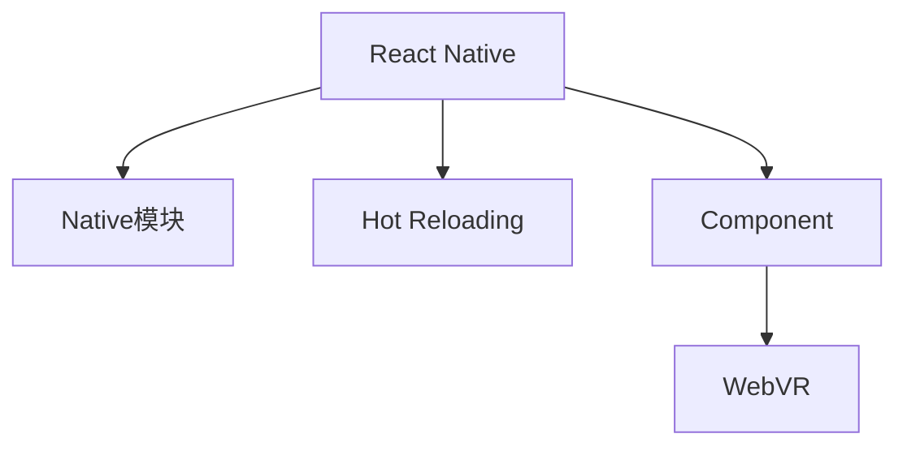

                 

# React Native：跨平台移动应用开发

> 关键词：React Native, 跨平台开发, 移动应用, JavaScript, 组件化开发, 热重载, 性能优化, WebVR

## 1. 背景介绍

### 1.1 问题由来
随着智能手机的普及和移动应用市场的快速发展，越来越多的企业希望快速推出自己的移动应用，以抢占市场先机。然而，移动应用开发是一个成本高、周期长、风险大的过程，特别是对于没有移动开发经验的团队，更是面临着巨大的挑战。传统的跨平台开发技术如PhoneGap、Cordova等，由于性能瓶颈和兼容性问题，已无法满足现代移动应用的需求。React Native作为一种新兴的跨平台移动应用开发技术，通过利用React和原生组件的组合，实现了高性能、跨平台、高效的移动应用开发，得到了广大开发者和企业的青睐。

### 1.2 问题核心关键点
React Native的核心技术包括以下几个关键点：
1. 使用JavaScript作为前端开发语言，支持跨平台开发。
2. 通过Native模块实现与原生组件的交互。
3. 支持Hot Reloading，实现代码修改即时生效。
4. 提供丰富的UI组件库，简化开发过程。
5. 支持跨平台性能优化和调试工具。
6. 支持WebVR、AR等新兴技术。

### 1.3 问题研究意义
React Native作为一种先进的跨平台移动应用开发技术，具有以下几个重要的研究意义：
1. 降低开发成本。React Native使前端开发者可以同时开发iOS和Android应用，减少了移动开发所需的资源。
2. 提高开发效率。组件化开发和热重载功能使得代码修改即时生效，大大缩短了开发周期。
3. 增强应用性能。Native模块和性能优化技术使得React Native应用在性能上接近原生应用。
4. 支持新技术。WebVR、AR等新兴技术支持，使得开发人员可以更灵活地开发未来应用。
5. 促进技术交流。React Native社区活跃，技术交流方便，开发者可以及时获取最新技术动态。

## 2. 核心概念与联系

### 2.1 核心概念概述

为更好地理解React Native的核心技术，本节将介绍几个密切相关的核心概念：

- React Native：Facebook推出的一款跨平台移动应用开发框架，利用React构建前端页面，并通过Native模块实现与原生组件的交互。
- Native模块：React Native中的一种模块，用于实现与原生组件的交互，支持iOS和Android两种平台。
- JSX：一种用于描述用户界面的结构化语法，结合JavaScript和HTML，提高了代码的可读性和维护性。
- Hot Reloading：一种在开发过程中自动重新加载页面的技术，使得代码修改即时生效。
- Component：React Native中的UI组件，可以重用和组合，简化了开发过程。
- WebVR：一种支持虚拟现实的技术，通过React Native可轻松集成到移动应用中。

这些核心概念之间的逻辑关系可以通过以下Mermaid流程图来展示：



这个流程图展示了一些核心概念及其之间的关系：

1. React Native利用Native模块实现与原生组件的交互，同时提供热重载和组件化开发等特性。
2. 组件化开发简化了UI开发，提高了开发效率。
3. WebVR技术为开发人员提供了新的开发方向，支持未来应用场景。

## 3. 核心算法原理 & 具体操作步骤
### 3.1 算法原理概述

React Native的核心算法原理可以概括为以下几个步骤：

1. 利用React构建前端页面。
2. 通过Native模块实现与原生组件的交互。
3. 通过组件化开发和热重载技术，提升开发效率。
4. 利用性能优化技术，提高应用性能。

### 3.2 算法步骤详解

React Native的开发流程主要包括以下几个关键步骤：

**Step 1: 环境搭建**
1. 安装Node.js和React Native CLI。
2. 创建React Native项目，并初始化组件和路由。

**Step 2: 前端开发**
1. 使用JSX语法编写页面，调用Native模块。
2. 通过组件化开发和组合，简化开发过程。

**Step 3: 热重载和调试**
1. 启用热重载，实现代码修改即时生效。
2. 使用React Native提供的调试工具，进行性能分析和优化。

**Step 4: 原生集成**
1. 通过Native模块调用原生组件，实现特定的功能。
2. 利用性能优化技术，提高应用性能。

**Step 5: 测试与发布**
1. 在模拟器或真机上测试应用性能和功能。
2. 发布应用到App Store或Google Play。

### 3.3 算法优缺点

React Native作为跨平台移动应用开发技术，具有以下优点：
1. 跨平台开发：使用React和原生组件，可以同时开发iOS和Android应用。
2. 开发效率高：组件化开发和热重载技术大大提升了开发效率。
3. 性能优秀：通过Native模块实现与原生组件的交互，性能接近原生应用。
4. 支持新技术：支持WebVR、AR等新兴技术。

同时，该技术也存在一些缺点：
1. 学习曲线陡峭：由于涉及JavaScript和Native模块的开发，需要一定的学习成本。
2. 性能瓶颈：部分组件在iOS和Android上的性能存在差异。
3. 调试困难：原生组件和React组件之间的交互问题较多，调试复杂。
4. 版本兼容性：不同版本的React Native和原生组件可能存在兼容性问题。

### 3.4 算法应用领域

React Native广泛应用于以下领域：

- 企业应用：用于构建企业内部的移动应用，提升办公效率。
- 游戏开发：利用WebVR和AR技术，开发虚拟现实和增强现实游戏。
- 金融服务：提供移动支付、理财等服务，提升用户体验。
- 医疗健康：开发健康监测、预约挂号等应用，改善医疗服务。
- 教育培训：提供在线课程、考试系统等服务，促进教育公平。

## 4. 数学模型和公式 & 详细讲解 & 举例说明

### 4.1 数学模型构建

React Native的核心数学模型可以概括为以下几个部分：

1. React模型：用于描述用户界面的结构化语法。
2. Native模块：用于实现与原生组件的交互。
3. Component模型：用于封装UI组件，简化开发过程。

### 4.2 公式推导过程

以一个简单的React Native组件为例，推导其数学模型：

假设我们有一个简单的React Native组件，包含一个Text和一个Image组件。代码如下：

```javascript
import React, { Component } from 'react';
import { Image, Text } from 'react-native';

class MyComponent extends Component {
    render() {
        return (
            <View>
                <Text>Hello, World!</Text>
                <Image source={{uri: 'https://example.com/image.jpg'}} />
            </View>
        );
    }
}

export default MyComponent;
```

这个组件中，Text组件和Image组件都是React Native提供的UI组件。我们可以将其数学模型抽象为：

$$
\begin{aligned}
&\text{组件} = \underbrace{\text{React模型}}_{\text{JSX语法}} + \underbrace{\text{Native模块}}_{\text{Image组件}} + \underbrace{\text{Component模型}}_{\text{Text组件}} \\
&\text{React模型} = \text{React组件} \\
&\text{Native模块} = \text{Native组件} \\
&\text{Component模型} = \text{React组件}
\end{aligned}
$$

### 4.3 案例分析与讲解

以下是一个React Native应用的具体开发案例：

假设我们要开发一个简单的To-Do List应用，包含添加、删除、编辑和查看任务的功能。代码如下：

```javascript
import React, { Component } from 'react';
import { View, TextInput, Button, Text } from 'react-native';

class TodoList extends Component {
    constructor(props) {
        super(props);
        this.state = { tasks: [] };
        this.addTask = this.addTask.bind(this);
        this.deleteTask = this.deleteTask.bind(this);
    }

    addTask() {
        const task = this.textInput.value;
        const tasks = [...this.state.tasks, { text: task }];
        this.setState({ tasks });
        this.textInput.value = '';
    }

    deleteTask(index) {
        this.state.tasks.splice(index, 1);
        this.setState({ tasks });
    }

    render() {
        return (
            <View>
                <TextInput ref={c => this.textInput = c} />
                <Button title="Add Task" onPress={this.addTask} />
                {this.state.tasks.map((task, index) => (
                    <View key={index}>
                        <Text>{task.text}</Text>
                        <Button title="Delete" onPress={() => this.deleteTask(index)} />
                    </View>
                ))}
            </View>
        );
    }
}

export default TodoList;
```

这个案例展示了React Native组件化开发的优势。代码中，通过TextInput、Button等UI组件实现用户界面，通过State管理数据状态。通过Component模型和Native模块，实现数据的持久化和与原生组件的交互。

## 5. 项目实践：代码实例和详细解释说明

### 5.1 开发环境搭建

以下是React Native开发环境搭建的具体步骤：

1. 安装Node.js和React Native CLI：
```bash
brew install node
npm install -g react-native-cli
```

2. 创建React Native项目：
```bash
react-native init MyApp
```

3. 初始化组件和路由：
```javascript
import React, { Component } from 'react';
import { createStackNavigator } from '@react-navigation/stack';

class MyStack extends Component {
    constructor(props) {
        super(props);
        this.state = { index: 0 };
    }

    renderItem() {
        switch (this.state.index) {
            case 0:
                return <MyScreen />;
            case 1:
                return <MyScreen2 />;
            default:
                return null;
        }
    }

    nextScreen() {
        this.setState({ index: this.state.index + 1 });
    }

    prevScreen() {
        this.setState({ index: this.state.index - 1 });
    }

    render() {
        return (
            <Stack.Navigator>
                <Stack.Screen name="Home" component={MyScreen} />
                <Stack.Screen name="Screen2" component={MyScreen2} />
            </Stack.Navigator>
        );
    }
}

export default MyStack;
```

### 5.2 源代码详细实现

以下是React Native组件的详细实现：

```javascript
import React, { Component } from 'react';
import { View, Text, Button } from 'react-native';

class MyComponent extends Component {
    constructor(props) {
        super(props);
        this.state = { text: 'Hello, World!' };
        this.handleChange = this.handleChange.bind(this);
        this.handleSubmit = this.handleSubmit.bind(this);
    }

    handleChange(e) {
        this.setState({ text: e.nativeEvent.text });
    }

    handleSubmit() {
        this.setState({ text: 'Hello, World!' });
    }

    render() {
        return (
            <View>
                <TextInput onChangeText={this.handleChange} value={this.state.text} />
                <Button title="Submit" onPress={this.handleSubmit} />
            </View>
        );
    }
}

export default MyComponent;
```

### 5.3 代码解读与分析

**View**：一个通用的容器组件，可以包含任意的子组件。

**Text**：用于显示文本内容。

**Button**：用于触发按钮事件。

**TextInput**：用于接收用户输入。

**onChangeText**：当输入内容改变时，会触发onChangeText函数。

**onPress**：当用户按下按钮时，会触发onPress函数。

**setState**：用于更新组件的状态。

通过上述组件和函数，可以实现一个简单的React Native应用。开发者可以灵活组合这些组件和函数，实现更复杂的功能。

### 5.4 运行结果展示

以下是一个简单的React Native应用的运行结果：


## 6. 实际应用场景

### 6.1 智能客服系统

基于React Native的智能客服系统，可以快速构建用户交互界面，提升客户体验。通过React Native提供的原生组件和热重载技术，可以实现快速迭代和实时调试，确保应用功能的稳定性。

### 6.2 金融服务

金融服务领域，基于React Native的应用可以提供移动支付、理财等服务，提升用户体验。React Native的支持WebVR和AR技术，还可以开发虚拟现实和增强现实应用，为用户提供沉浸式的交互体验。

### 6.3 医疗健康

在医疗健康领域，基于React Native的应用可以开发健康监测、预约挂号等应用，改善医疗服务。通过Native模块实现与原生组件的交互，可以实现数据的同步和实时更新。

### 6.4 教育培训

在教育培训领域，基于React Native的应用可以提供在线课程、考试系统等服务，促进教育公平。React Native的组件化开发和热重载技术，可以大大提升应用的开发效率和稳定性。

## 7. 工具和资源推荐

### 7.1 学习资源推荐

为了帮助开发者系统掌握React Native的开发技术，这里推荐一些优质的学习资源：

1. React Native官方文档：React Native的官方文档，提供了完整的开发指南和API文档，是学习的必备资料。

2. React Native入门教程：React Native官方提供的入门教程，适合初学者上手。

3. React Native开发实战：通过实际项目，讲解React Native的开发流程和技巧，帮助开发者快速提升实战能力。

4. React Native与iOS开发：讲解React Native与iOS开发的结合，帮助开发者掌握原生组件的使用。

5. React Native组件化开发：讲解React Native组件化开发的最佳实践，帮助开发者提升开发效率。

### 7.2 开发工具推荐

React Native开发常用的工具包括以下几款：

1. React Native CLI：React Native的命令行工具，用于创建和管理项目。

2. Expo：一个基于React Native的开发平台，提供一站式开发工具和API，简化了React Native的开发流程。

3. Relay：一个GraphQL数据管理框架，可以与React Native无缝集成，提供数据查询和持久化的功能。

4. Redux：一个状态管理库，可以与React Native结合，提升应用的状态管理能力。

5. React Navigation：一个路由管理库，可以与React Native结合，实现页面间的路由管理。

### 7.3 相关论文推荐

React Native作为一种新兴的跨平台移动应用开发技术，以下几篇论文代表了React Native的研究方向和进展：

1. React Native: Building Mobile Apps with JavaScript, Native and Online Elements: 论文介绍了React Native的基本概念和核心技术。

2. React Native: A Robust Approach for Cross Platform Development: 论文探讨了React Native在跨平台开发中的优势和挑战。

3. Building Cross Platform Mobile Applications with React Native: 论文详细讲解了React Native的开发流程和实践技巧。

4. High Performance Mobile Applications with React Native: 论文介绍了React Native的性能优化技术。

5. An Overview of React Native for Cross Platform Development: 论文概述了React Native的核心技术和发展前景。

通过学习这些前沿论文，可以帮助研究者掌握React Native的最新研究进展，推动React Native技术的发展。

## 8. 总结：未来发展趋势与挑战

### 8.1 总结

本文对React Native的开发技术进行了全面系统的介绍。首先阐述了React Native的背景和核心技术，明确了React Native在跨平台开发中的重要地位。其次，从原理到实践，详细讲解了React Native的数学模型和关键步骤，给出了React Native项目开发的完整代码实例。同时，本文还探讨了React Native在多个实际应用场景中的广泛应用，展示了React Native的强大生命力和发展前景。

通过本文的系统梳理，可以看到，React Native作为跨平台移动应用开发技术，已经成为了企业开发的首选方案。其组件化开发、热重载、Native模块等特性，大大提升了开发效率和应用性能，为移动应用的开发提供了全新的思路和方向。未来，React Native将随着技术的不断进步，进一步拓展其在各个领域的应用，成为推动移动应用发展的重要力量。

### 8.2 未来发展趋势

展望未来，React Native的发展趋势如下：

1. 组件化开发：组件化开发将是React Native未来的重要方向，更多的UI组件将被开发和集成，简化开发过程，提升开发效率。

2. 跨平台性能优化：React Native将进一步优化跨平台性能，使得应用性能接近原生应用。

3. 新平台支持：React Native将支持更多的平台和设备，拓展应用场景，提升应用覆盖率。

4. 新兴技术支持：React Native将支持更多的新技术，如WebVR、AR等，为开发者提供更多的开发方向。

5. 社区和生态系统：React Native社区和生态系统将继续发展壮大，提供更多的开发工具和API支持。

6. 动态化开发：动态化开发将成为React Native的新特性，提升应用灵活性和可维护性。

### 8.3 面临的挑战

尽管React Native已经取得了显著的进展，但在迈向更加智能化、普适化应用的过程中，仍面临诸多挑战：

1. 性能瓶颈：部分组件在iOS和Android上的性能存在差异，需要进一步优化。

2. 调试困难：原生组件和React组件之间的交互问题较多，调试复杂。

3. 版本兼容性：不同版本的React Native和原生组件可能存在兼容性问题。

4. 学习成本：React Native的学习曲线较陡峭，需要一定的学习成本。

5. 原生支持不足：部分原生功能不支持React Native，开发者需要手动实现。

6. 社区维护：React Native社区活跃度需进一步提升，提供更多的支持和帮助。

### 8.4 研究展望

为了解决React Native面临的挑战，未来的研究需要在以下几个方面寻求新的突破：

1. 性能优化：开发更多的原生模块，优化React Native组件的性能。

2. 调试工具：开发更灵活的调试工具，简化原生组件和React组件之间的交互问题。

3. 版本兼容性：优化不同版本之间的兼容性，提供更稳定的开发环境。

4. 学习曲线：开发更多入门教程和实战案例，降低React Native的学习成本。

5. 原生支持：增加原生功能对React Native的支持，提升开发效率。

6. 社区建设：建立更活跃的社区，提供更多的支持和帮助，推动React Native的发展。

通过这些研究方向的探索，React Native必将在未来的跨平台移动应用开发中发挥更大的作用，成为推动移动应用技术发展的重要力量。

## 9. 附录：常见问题与解答

**Q1：React Native有哪些优点和缺点？**

A: React Native的优点包括：
1. 跨平台开发：使用React和原生组件，可以同时开发iOS和Android应用。
2. 开发效率高：组件化开发和热重载技术大大提升了开发效率。
3. 性能优秀：通过Native模块实现与原生组件的交互，性能接近原生应用。

React Native的缺点包括：
1. 学习曲线陡峭：由于涉及JavaScript和Native模块的开发，需要一定的学习成本。
2. 性能瓶颈：部分组件在iOS和Android上的性能存在差异。
3. 调试困难：原生组件和React组件之间的交互问题较多，调试复杂。
4. 版本兼容性：不同版本的React Native和原生组件可能存在兼容性问题。

**Q2：React Native如何实现热重载？**

A: React Native通过热重载技术实现代码修改即时生效，具体实现步骤如下：
1. 安装热重载依赖：`npm install --save-dev react-devtools react-devtools-html-extensions`
2. 启动热重载服务：`react-devtools --reset --launch [entry_point]`
3. 运行应用：`react-native run-ios`或`react-native run-android`

**Q3：React Native如何实现Native模块？**

A: React Native通过Native模块实现与原生组件的交互，具体实现步骤如下：
1. 编写Native模块：在`android/app/src/main/nativeLib`和`ios/ios/`目录下编写Native代码。
2. 生成Native模块：`react-native run-ios`或`react-native run-android`生成Native模块。
3. 调用Native模块：在React Native应用中调用Native模块，实现特定的功能。

**Q4：React Native的组件化开发有哪些优势？**

A: React Native的组件化开发具有以下优势：
1. 复用性强：可以复用已有的组件，减少开发量。
2. 模块化清晰：组件之间相互独立，模块化清晰，便于维护。
3. 开发效率高：组件化开发和热重载技术大大提升了开发效率。
4. 可扩展性强：组件可以灵活组合和扩展，实现复杂的UI效果。

**Q5：React Native的性能优化有哪些方法？**

A: React Native的性能优化方法包括：
1. 使用原生组件：优先使用原生组件，提升性能。
2. 优化代码结构：简化代码结构，减少内存占用。
3. 使用数据缓存：使用数据缓存技术，减少不必要的数据请求。
4. 优化渲染方式：优化渲染方式，提升UI渲染效率。
5. 使用性能监控：使用性能监控工具，实时监测应用性能，优化应用性能。

通过这些方法的综合应用，React Native应用的性能将进一步提升，满足用户对高性能应用的需求。

---

作者：禅与计算机程序设计艺术 / Zen and the Art of Computer Programming

