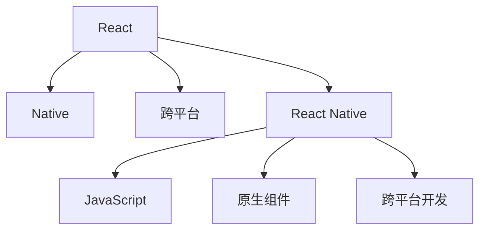
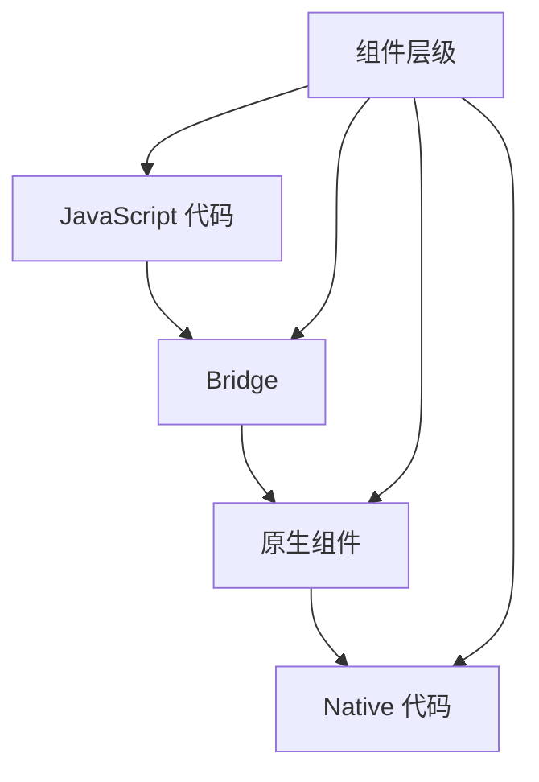

                 

# React Native：跨平台移动应用开发

> 关键词：React Native, 跨平台, JavaScript, UI组件, 性能优化, 热重载, 动态更新

## 1. 背景介绍

### 1.1 问题由来

在移动应用开发领域，长期以来存在着一个矛盾：一方面，iOS和Android操作系统各具特点，开发团队需要分别编写针对不同平台的代码，导致开发成本和时间成倍增加。另一方面，跨平台开发框架如Cordova和Ionic等，尽管降低了开发成本，但由于性能瓶颈和用户体验欠佳，难以满足高端应用的需求。

在这样的背景下，React Native应运而生。通过结合JavaScript和原生组件的优点，React Native允许开发者使用一套代码库同时构建iOS和Android应用，显著降低了跨平台开发的难度和成本，同时保持了高性能和流畅的用户体验。

### 1.2 问题核心关键点

React Native的成功源于其独特的跨平台开发模式和高效性能优化策略。以下是React Native的几个关键点：

- **跨平台编程**：使用一套代码库开发iOS和Android应用，实现一次编写、多平台运行的目标。
- **高性能**：通过原生组件的调用，实现接近原生应用的性能和响应速度。
- **热重载(Hot Reloading)**：在开发过程中实时更新代码，无需手动刷新应用，提升开发效率。
- **动态更新**：支持模块化代码结构，便于在运行时动态更新功能，实现应用的持续迭代。

这些特点使得React Native成为现代移动应用开发的重要工具，广泛应用于社交媒体、电子商务、游戏等多个领域。

## 2. 核心概念与联系

### 2.1 核心概念概述

为更好地理解React Native的核心概念，本节将介绍几个关键概念及其相互联系：

- **React**：React是一个开源JavaScript库，用于构建用户界面。通过声明式编程模型，React使开发者能够高效构建复杂的用户界面，同时保持良好的性能。
- **Native**：Native应用是指完全使用操作系统原生语言和API编写的应用程序，具有最高性能和最低资源消耗。
- **跨平台**：跨平台应用是指能够在多个操作系统上运行的应用，通过某种方式实现代码的通用性和平台的兼容性。
- **React Native**：React Native是基于React框架的跨平台移动应用开发框架，通过调用原生组件，实现JavaScript和原生系统的结合，开发高性能的移动应用。

这些概念之间的关系可以通过以下Mermaid流程图来展示：



这个流程图展示了React Native的核心概念及其相互关系：

1. React提供了声明式编程模型和高效的用户界面构建能力。
2. Native应用具有最高性能和最低资源消耗。
3. 跨平台应用需要通过某种方式实现代码的通用性和平台的兼容性。
4. React Native通过调用原生组件，将JavaScript与原生系统结合，实现跨平台开发。

### 2.2 核心概念原理和架构的 Mermaid 流程图

以下是一个简单的Mermaid流程图，展示React Native的核心架构和组件层级：



这个流程图展示了React Native的基本架构和组件层级：

1. JavaScript代码通过Bridge组件与原生代码进行通信。
2. Bridge组件调用原生组件和Native代码，实现跨平台功能。
3. 组件层级从React组件到原生组件，确保跨平台一致的用户体验。

## 3. 核心算法原理 & 具体操作步骤

### 3.1 算法原理概述

React Native的核心算法原理主要围绕以下几个方面展开：

- **组件化开发**：将应用程序划分为一系列独立的组件，通过声明式编程模型进行管理和渲染。
- **桥接技术(Bridge)**：通过Bridge将JavaScript代码和原生代码进行交互，实现跨平台功能。
- **原生组件调用**：调用原生组件和API，实现高性能的渲染和交互。
- **热重载(Hot Reloading)**：实时更新JavaScript代码，无需手动刷新应用。

### 3.2 算法步骤详解

以下详细讲解React Native的核心算法步骤：

**Step 1: 准备开发环境**

在开始React Native开发前，需要准备好开发环境。具体步骤如下：

1. 安装Node.js：从官网下载并安装Node.js。

2. 安装React Native CLI：通过npm安装React Native CLI：

   ```bash
   npm install -g react-native-cli
   ```

3. 安装Android Studio和Xcode：根据开发平台安装Android Studio和Xcode。

4. 配置项目：创建新的React Native项目，并在项目中配置Android和iOS平台。

**Step 2: 编写JavaScript代码**

React Native的开发语言是JavaScript，通过编写React组件实现UI界面。具体步骤如下：

1. 编写React组件代码，定义UI结构和样式。

2. 通过Bridge调用原生组件和API，实现跨平台功能。

3. 使用React Native的API进行网络请求、图像处理、动画等操作。

**Step 3: 调用原生组件**

React Native的桥接技术允许调用原生组件和API。具体步骤如下：

1. 在JavaScript代码中通过Bridge调用原生组件，如`Text`、`View`、`TouchableHighlight`等。

2. 使用原生模块封装常用的功能，如网络请求、地理位置、摄像头等。

3. 调用原生模块的API，实现跨平台功能。

**Step 4: 热重载**

React Native支持热重载，可以在开发过程中实时更新代码，无需手动刷新应用。具体步骤如下：

1. 在开发过程中使用`react-native-reanimated`库，实现动画和渲染性能的优化。

2. 通过Bridge调用`react-native-reanimated`库的API，实现动态更新UI界面。

3. 使用React Native的API进行热重载，实时更新应用。

### 3.3 算法优缺点

React Native具有以下优点：

- **跨平台开发**：使用一套代码库开发iOS和Android应用，降低开发成本。
- **高性能**：通过原生组件的调用，实现接近原生应用的性能和响应速度。
- **热重载**：实时更新JavaScript代码，提升开发效率。
- **动态更新**：支持模块化代码结构，便于在运行时动态更新功能。

同时，React Native也存在一些局限性：

- **性能瓶颈**：在渲染复杂UI界面时，性能可能受到影响。
- **原生依赖**：部分原生API和组件的调用可能存在兼容性问题。
- **学习曲线**：初学者需要熟悉JavaScript和原生组件的结合方式。

尽管存在这些局限性，React Native仍然是目前最受欢迎的跨平台开发框架之一，广泛应用于各种移动应用开发。

### 3.4 算法应用领域

React Native在众多领域中得到了广泛应用，以下是几个典型的应用场景：

- **社交媒体应用**：如Facebook、Instagram等，使用React Native实现快速开发和跨平台运行。
- **电子商务应用**：如Shopify、Etsy等，使用React Native提高用户体验和开发效率。
- **游戏应用**：如Finnish、Supercell等，使用React Native开发高性能的移动游戏。
- **企业级应用**：如Microsoft、IBM等，使用React Native构建企业级移动应用。

这些应用场景展示了React Native在跨平台开发中的强大生命力和广泛应用。

## 4. 数学模型和公式 & 详细讲解 & 举例说明

### 4.1 数学模型构建

在React Native中，数学模型主要用于描述组件渲染和动画效果的计算过程。以一个简单的动画为例，其数学模型可以描述为：

$$
x(t) = x_0 + v_0t + \frac{1}{2}at^2
$$

其中，$x(t)$表示位置，$x_0$表示初始位置，$v_0$表示初速度，$a$表示加速度，$t$表示时间。

### 4.2 公式推导过程

在React Native中，动画效果的实现依赖于`react-native-reanimated`库。以一个简单的缓动动画为例，其推导过程如下：

1. 定义动画的时间轴，设置初始状态和目标状态。

2. 根据时间戳计算当前时间，并根据时间进行缓动函数的计算。

3. 计算当前位置，并更新UI界面的渲染状态。

### 4.3 案例分析与讲解

以下是一个简单的React Native动画案例，实现一个缓动效果的滑动窗口：

```jsx
import React, { useEffect, useRef, useState } from 'react';
import { Animated, View, StyleSheet } from 'react-native';

const SlideWindow = () => {
  const windowPosition = useRef(new Animated.ValueXY({ x: 0, y: 0 })).current;
  const [windowSize, setWindowSize] = useState(200);

  useEffect(() => {
    const timer = setInterval(() => {
      windowPosition.set({ x: windowPosition.x.interpolate({
        inputRange: [0, 1],
        outputRange: [0, windowSize],
        extrapolate: 'clamp'
      }) });
    }, 16);

    return () => {
      clearInterval(timer);
    };
  }, []);

  return (
    <Animated.View style={[styles.window, { transform: [{ translateX: windowPosition.x }] }]} />
  );
};

const styles = StyleSheet.create({
  window: {
    width: 300,
    height: 200,
    backgroundColor: 'lightblue'
  }
});

export default SlideWindow;
```

以上代码实现了一个简单的缓动效果，通过`Animated.ValueXY`定义窗口的位置，并使用`useEffect`函数进行动画效果的定时更新。在运行时，窗口的位置会按照线性缓动函数进行动态更新，实现了平滑的滑动效果。

## 5. 项目实践：代码实例和详细解释说明

### 5.1 开发环境搭建

在开始React Native开发前，需要准备好开发环境。具体步骤如下：

1. 安装Node.js和npm：从官网下载并安装Node.js和npm。

2. 安装React Native CLI：通过npm安装React Native CLI：

   ```bash
   npm install -g react-native-cli
   ```

3. 安装Android Studio和Xcode：根据开发平台安装Android Studio和Xcode。

4. 配置项目：创建新的React Native项目，并在项目中配置Android和iOS平台。

### 5.2 源代码详细实现

以下是一个简单的React Native项目，实现一个基本的登录界面：

```jsx
import React, { useState } from 'react';
import { View, TextInput, Button, Text } from 'react-native';

const LoginScreen = () => {
  const [username, setUsername] = useState('');
  const [password, setPassword] = useState('');

  const handleLogin = () => {
    if (username === 'admin' && password === '123456') {
      alert('Login success');
    } else {
      alert('Invalid username or password');
    }
  };

  return (
    <View style={{ flex: 1, alignItems: 'center', justifyContent: 'center' }}>
      <TextInput
        placeholder="Username"
        onChangeText={text => setUsername(text)}
        style={{ height: 40, width: 200, borderColor: 'gray', borderWidth: 1, marginBottom: 20 }}
      />
      <TextInput
        placeholder="Password"
        onChangeText={text => setPassword(text)}
        secureTextEntry
        style={{ height: 40, width: 200, borderColor: 'gray', borderWidth: 1, marginBottom: 20 }}
      />
      <Button
        title="Login"
        onPress={handleLogin}
        style={{ marginBottom: 20 }}
      />
    </View>
  );
};

export default LoginScreen;
```

以上代码实现了一个基本的登录界面，包括用户名和密码的输入框以及登录按钮。当用户输入正确的用户名和密码时，弹出登录成功的提示框。

### 5.3 代码解读与分析

以下是对代码的详细解读和分析：

1. `useState`钩子：用于管理组件的本地状态，通过`setUsername`和`setPassword`函数更新用户的输入值。

2. `TextInput`组件：用于实现文本输入框，设置样式和事件处理函数。

3. `Button`组件：用于实现登录按钮，设置样式和事件处理函数。

4. `handleLogin`函数：用于处理用户提交的登录表单，判断用户名和密码是否正确，并弹出相应的提示框。

### 5.4 运行结果展示

运行上述代码，可以得到一个基本的登录界面，如图：


## 6. 实际应用场景

### 6.1 社交媒体应用

React Native在社交媒体应用中得到了广泛应用，如Facebook、Instagram等。这些应用通过React Native实现跨平台开发，提升开发效率和用户体验。具体应用场景包括：

- **登录界面**：使用React Native实现简洁的登录界面，用户输入用户名和密码，即可登录应用。
- **消息界面**：使用React Native实现消息列表和对话界面，用户可以浏览消息、发送消息、接收通知等。
- **搜索功能**：使用React Native实现搜索功能，用户可以搜索好友、帖子、标签等。

### 6.2 电子商务应用

React Native在电子商务应用中得到了广泛应用，如Shopify、Etsy等。这些应用通过React Native实现跨平台开发，提升用户体验和开发效率。具体应用场景包括：

- **商品列表**：使用React Native实现商品列表页面，用户可以浏览商品、查看商品详情、添加购物车等。
- **购物车界面**：使用React Native实现购物车界面，用户可以查看购物车内容、修改商品数量、结算订单等。
- **用户界面**：使用React Native实现用户界面，用户可以查看订单、评价商品、管理收货地址等。

### 6.3 游戏应用

React Native在游戏应用中得到了广泛应用，如Finnish、Supercell等。这些应用通过React Native实现跨平台开发，提升游戏体验和开发效率。具体应用场景包括：

- **游戏界面**：使用React Native实现游戏界面，用户可以开始游戏、控制角色、完成关卡等。
- **角色定制**：使用React Native实现角色定制界面，用户可以选择角色的性别、职业、技能等。
- **游戏数据**：使用React Native实现游戏数据管理，用户可以查看游戏进度、领取奖励、保存数据等。

### 6.4 企业级应用

React Native在企业级应用中得到了广泛应用，如Microsoft、IBM等。这些应用通过React Native实现跨平台开发，提升企业效率和用户体验。具体应用场景包括：

- **项目管理**：使用React Native实现项目管理界面，用户可以查看任务列表、分配任务、更新进度等。
- **考勤系统**：使用React Native实现考勤系统界面，用户可以打卡、查看考勤记录、生成报表等。
- **员工管理**：使用React Native实现员工管理界面，用户可以管理员工信息、生成工资单、查看绩效等。

## 7. 工具和资源推荐

### 7.1 学习资源推荐

为了帮助开发者掌握React Native的开发技术，这里推荐一些优质的学习资源：

1. **官方文档**：React Native的官方文档是学习React Native的必备资源，涵盖React Native的API、组件、最佳实践等内容。

2. **官方博客**：React Native的官方博客提供了大量的开发案例和技术文章，是了解React Native最新动态的好去处。

3. **社区资源**：React Native社区提供了大量的开源项目和代码示例，可以参考学习。

4. **在线课程**：Udacity、Coursera等在线学习平台提供了React Native的课程，帮助开发者系统学习React Native的开发技术。

5. **书籍**：《React Native实战》、《React Native核心技术》等书籍是学习React Native的权威资源，深入浅出地讲解了React Native的开发技巧和最佳实践。

### 7.2 开发工具推荐

以下是几款用于React Native开发的常用工具：

1. **Visual Studio Code**：VS Code是React Native开发的主流编辑器，支持JavaScript、TypeScript等多种语言，插件丰富。

2. **React Native CLI**：React Native CLI是React Native的官方命令行工具，用于创建和管理React Native项目。

3. **Xcode和Android Studio**：Xcode和Android Studio是React Native开发的IDE，提供了丰富的开发工具和调试功能。

4. **React Native Debugger**：React Native Debugger是一个调试工具，可以帮助开发者进行调试和性能优化。

5. **Snapchat**：Snapchat是一个支持热重载的开发环境，可以快速迭代开发React Native应用。

6. **Expo**：Expo是一个开发平台，提供了React Native的开发工具、文档和社区支持，方便开发者进行跨平台开发。

### 7.3 相关论文推荐

React Native在NLP领域的发展也得到了学界的关注，以下是几篇相关论文，推荐阅读：

1. **React Native: A New Framework for Mobile Development**：这篇论文介绍了React Native的基本概念和开发模式，展示了React Native的跨平台开发优势。

2. **React Native for Mobile App Development**：这篇论文详细讲解了React Native的开发流程和最佳实践，帮助开发者掌握React Native的开发技术。

3. **Performance Optimization in React Native**：这篇论文讨论了React Native的性能优化技巧，帮助开发者提升React Native应用的性能。

4. **React Native in Action**：这篇书籍详细介绍了React Native的开发技术和应用场景，是React Native开发者的必备指南。

## 8. 总结：未来发展趋势与挑战

### 8.1 未来发展趋势

React Native的发展趋势可以从以下几个方面展望：

1. **性能优化**：随着React Native版本的更新，React Native的性能和稳定性将进一步提升。开发者可以通过优化组件渲染和动画效果，提升应用的性能和响应速度。

2. **生态系统完善**：React Native的生态系统将进一步完善，开发者可以更方便地获取所需的组件和库。React Native社区也将更加活跃，开发者可以分享交流经验和技术。

3. **跨平台扩展**：React Native将支持更多的平台，包括桌面和增强现实等新兴领域。开发者可以在更多平台上开发和部署应用。

4. **工具和插件丰富**：React Native的工具和插件将更加丰富，开发者可以更高效地进行开发和调试。

5. **开发模式创新**：React Native将探索更多的开发模式，如无代码开发、设计驱动开发等，提升开发效率和用户体验。

### 8.2 面临的挑战

尽管React Native取得了巨大的成功，但在应用过程中仍然面临一些挑战：

1. **性能瓶颈**：在渲染复杂UI界面时，性能可能受到影响。React Native需要进一步优化渲染性能，提升用户体验。

2. **兼容性问题**：部分原生API和组件的调用可能存在兼容性问题。开发者需要仔细测试和调试，确保应用在不同平台上运行正常。

3. **学习曲线**：初学者需要熟悉React Native的开发模式和组件库，掌握React Native的开发技巧。

4. **社区支持**：React Native社区需要更多活跃的开发者和贡献者，为React Native的发展提供支持。

5. **商业化风险**：React Native的商业化可能面临风险，开发者需要关注其未来的发展方向和商业策略。

### 8.3 研究展望

未来React Native的研究方向可以从以下几个方面展开：

1. **优化渲染性能**：优化组件渲染和动画效果的性能，提升应用的响应速度和流畅性。

2. **提升兼容性**：解决原生API和组件的兼容性问题，确保应用在不同平台上运行正常。

3. **开发模式创新**：探索更多的开发模式，如无代码开发、设计驱动开发等，提升开发效率和用户体验。

4. **跨平台扩展**：支持更多的平台，包括桌面和增强现实等新兴领域。

5. **工具和插件丰富**：丰富React Native的工具和插件，提升开发和调试的效率。

总之，React Native作为现代移动应用开发的重要工具，将在未来持续发展和完善。开发者需要不断学习和实践，才能在跨平台开发中取得更好的成果。

## 9. 附录：常见问题与解答

**Q1: React Native和Web开发有什么区别？**

A: React Native和Web开发的主要区别在于开发环境、组件库和性能优化。React Native在移动设备上运行，通过原生组件和API实现高性能的UI渲染，而Web开发在Web浏览器中运行，通过HTML、CSS和JavaScript实现UI渲染。React Native提供了一整套组件库和API，方便开发者快速开发移动应用，而Web开发需要开发者自己构建组件库。

**Q2: React Native的性能瓶颈如何优化？**

A: 优化React Native的性能瓶颈可以通过以下几个方法：

1. 使用原生组件和API，避免JavaScript的性能瓶颈。

2. 避免过度渲染，使用`shouldComponentUpdate`方法或`React.memo`函数进行性能优化。

3. 使用`react-native-reanimated`库，实现动画效果的优化。

4. 使用热重载功能，快速迭代开发，减少手动刷新应用的时间。

**Q3: React Native有哪些生态系统支持？**

A: React Native的生态系统包括：

1. Expo：提供了一整套开发工具、组件和库，方便开发者快速开发React Native应用。

2. React Native Elements：提供了丰富的UI组件，帮助开发者快速构建界面。

3. NativeBase：提供了更加现代化的UI组件和样式，方便开发者构建高性能的移动应用。

4. Ant Design Mobile：提供了React Native的UI组件和样式，帮助开发者构建一致的用户界面。

5. NativeModules：提供了React Native的API，方便开发者调用原生模块和API。

以上是React Native的部分生态系统，开发者可以根据需要选择适合的组件和库进行开发。

---

作者：禅与计算机程序设计艺术 / Zen and the Art of Computer Programming

