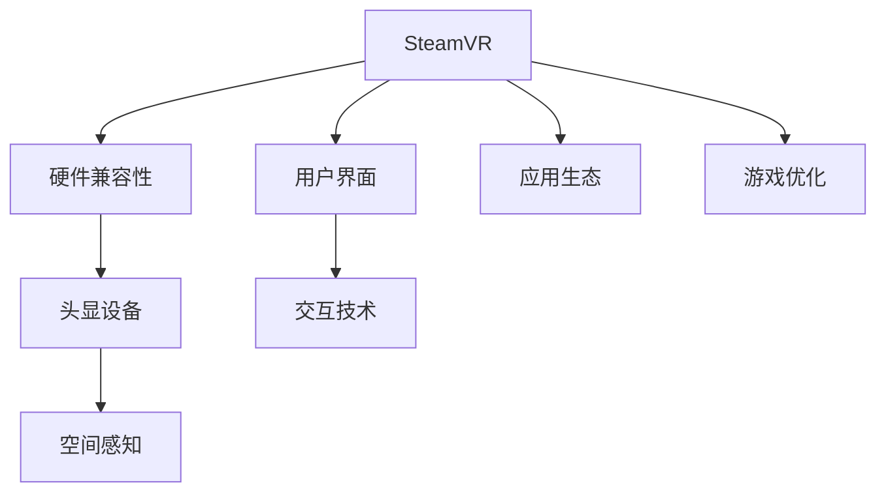

                 

# SteamVR 体验：Valve 的虚拟现实平台

> 关键词：SteamVR, 虚拟现实, 硬件适配, 应用生态, 用户体验, 发展趋势

## 1. 背景介绍

### 1.1 问题由来

随着虚拟现实（Virtual Reality, VR）技术的不断发展，人们对于沉浸式娱乐、工作、教育等的需求日益增长。传统的VR体验依赖于昂贵的高端设备，如Oculus Rift、HTC Vive等，而且设备兼容性差，用户体验不够理想。在这样一个背景下，Valve公司推出了基于Steam平台的SteamVR（Steam Virtual Reality）解决方案，旨在为VR用户提供更便捷、性价比更高的VR体验。

### 1.2 问题核心关键点

SteamVR的推出，显著降低了VR体验的门槛，带来了更广泛的用户基础和更丰富的应用场景。其核心技术包括：

1. 硬件兼容性：SteamVR支持多款VR头显设备，包括Oculus Rift、HTC Vive、Oculus Quest等。用户可以根据自己的设备，选择适合的应用和体验。
2. 用户界面：SteamVR提供简单易用的用户界面，用户可以方便地启动应用、设置参数、调整显示等。
3. 应用生态：SteamVR平台拥有庞大的应用库，涵盖了游戏、教育、娱乐等多个领域，为VR用户提供了丰富的选择。
4. 游戏优化：SteamVR内置了多个游戏优化特性，如动态分辨率调整、预测性移动、环境感知等，提升了游戏的流畅度和沉浸感。

这些核心技术使得SteamVR成为当前最受欢迎的VR平台之一，对VR技术的发展和普及产生了深远影响。

### 1.3 问题研究意义

研究SteamVR的架构和技术，对于理解VR技术的现状和发展方向，以及推动VR产业的创新和应用，具有重要意义：

1. 技术普及：通过了解SteamVR的技术架构，可以更好地推广VR技术，使其得到更广泛的应用。
2. 生态建设：分析SteamVR的应用生态，可以为开发者提供参考，丰富VR应用的内容和形式。
3. 用户体验：深入研究SteamVR的用户界面和游戏优化，可以提升用户体验，吸引更多的用户参与。
4. 发展趋势：掌握SteamVR的未来发展趋势，可以为开发者和用户提供指导，引领VR技术的新一轮进步。

本文将全面介绍SteamVR的技术架构和应用生态，并通过实际案例，展示SteamVR的用户体验和未来发展方向。

## 2. 核心概念与联系

### 2.1 核心概念概述

为更好地理解SteamVR的架构和技术，本节将介绍几个密切相关的核心概念：

- 虚拟现实（Virtual Reality, VR）：利用计算机生成逼真的虚拟环境，通过头显设备让用户沉浸其中，提供全方位的感官体验。
- SteamVR：基于Steam平台的虚拟现实解决方案，提供了硬件兼容性、用户界面、应用生态和游戏优化等多方面的支持。
- 头显设备（Head-mounted Display, HMD）：VR用户通过头显设备观察虚拟环境，设备包含屏幕、传感器和运动控制器等。
- 交互技术（Interaction Technology）：VR用户通过手势、语音、运动控制器等方式与虚拟环境进行互动，实现沉浸式体验。
- 空间感知（Spatial Awareness）：通过环境感知、动态分辨率调整、预测性移动等技术，提升VR游戏的流畅度和沉浸感。

这些核心概念之间的逻辑关系可以通过以下Mermaid流程图来展示：



这个流程图展示了他的核心概念以及它们之间的关联：

1. SteamVR提供硬件兼容性，支持多款VR头显设备。
2. 用户界面和交互技术，使得用户可以方便地操作VR应用。
3. 应用生态和游戏优化，丰富了VR应用的内容和形式，提升了体验。
4. 头显设备和空间感知，提升了VR的沉浸感和流畅度。

这些概念共同构成了SteamVR的框架，使其能够提供高质量、易用的VR体验。

## 3. 核心算法原理 & 具体操作步骤

### 3.1 算法原理概述

SteamVR的核心算法包括硬件适配、用户界面、应用生态和游戏优化等多个方面。其核心思想是：通过综合考虑硬件特性、用户体验和应用需求，设计一套灵活、高效、易用的VR解决方案。

SteamVR的算法原理可以概括为以下几个关键点：

1. 硬件适配算法：通过优化头显设备的硬件特性，如动态分辨率调整、传感器融合等，提升VR的性能和稳定性。
2. 用户界面算法：设计直观、易用的用户界面，使用户可以方便地启动应用、调整参数、互动等。
3. 应用生态算法：搭建丰富的应用库，提供多样化的应用选择，满足不同用户的需求。
4. 游戏优化算法：利用空间感知、预测性移动等技术，提升游戏的流畅度和沉浸感。

### 3.2 算法步骤详解

SteamVR的算法步骤包括硬件适配、用户界面设计、应用生态搭建和游戏优化等多个环节。以下详细介绍这些步骤：

**Step 1: 硬件适配**

SteamVR的硬件适配算法主要涉及以下几个方面：

1. 传感器融合：将多种传感器数据（如陀螺仪、加速度计、磁力计等）进行融合，提供精准的运动和位置数据。
2. 动态分辨率调整：根据设备性能和用户环境，动态调整显示分辨率，保证流畅的显示效果。
3. 运动跟踪：利用空间感知技术，准确跟踪用户的头部和手部运动，实现无缝的互动体验。

**Step 2: 用户界面设计**

SteamVR的用户界面设计主要考虑以下几个方面：

1. 简单直观：设计简洁、易用的界面，避免用户复杂操作。
2. 交互性：引入手势、语音、运动控制器等多种交互方式，提升用户体验。
3. 动态调整：根据用户需求和环境变化，动态调整界面布局和显示内容。

**Step 3: 应用生态搭建**

SteamVR的应用生态搭建主要涉及以下几个方面：

1. 平台兼容性：支持多款VR头显设备，提供统一的开发接口和标准。
2. 应用上架：搭建丰富的应用库，涵盖游戏、教育、娱乐等多个领域。
3. 开发者支持：提供开发工具和SDK，支持开发者进行应用开发和发布。

**Step 4: 游戏优化**

SteamVR的游戏优化主要涉及以下几个方面：

1. 空间感知：利用环境感知、预测性移动等技术，提升游戏的流畅度和沉浸感。
2. 动态效果：根据用户环境和设备性能，动态调整特效和渲染效果，避免卡顿。
3. 声音效果：优化声音效果，提升听觉体验，增强沉浸感。

### 3.3 算法优缺点

SteamVR的算法优点包括：

1. 硬件兼容性：支持多款VR头显设备，提升了设备使用灵活性。
2. 用户界面：设计简洁、易用的界面，提升了用户体验。
3. 应用生态：丰富的应用库和开发者支持，提供了多样化的选择。
4. 游戏优化：提升了游戏的流畅度和沉浸感，增强了用户体验。

同时，这些算法也存在一些局限性：

1. 硬件依赖：依赖于硬件性能和设备质量，不同设备的适配效果可能不同。
2. 应用质量：应用的品质和多样性受开发者水平和平台生态的影响。
3. 用户体验：复杂的操作和交互方式可能对部分用户造成困扰。
4. 性能限制：高分辨率和高帧率可能对设备的性能要求较高。

### 3.4 算法应用领域

SteamVR的算法在多个领域得到了广泛应用：

1. 游戏娱乐：提供高质量的VR游戏体验，如《Beat Saber》、《Superhot VR》等。
2. 教育培训：提供虚拟教室、虚拟实验室等教育应用，提升教学效果。
3. 医疗康复：提供虚拟康复训练、虚拟手术模拟等医疗应用，增强治疗效果。
4. 企业培训：提供虚拟培训课程、虚拟会议等企业应用，提升培训效果。
5. 娱乐社交：提供虚拟KTV、虚拟夜店等社交应用，提供互动娱乐体验。

除了这些领域，SteamVR还支持虚拟旅游、虚拟房产、虚拟博物馆等更多应用场景，为用户提供了丰富的选择。

## 4. 数学模型和公式 & 详细讲解 & 举例说明

### 4.1 数学模型构建

SteamVR的核心算法涉及多个数学模型和公式，以下详细介绍这些模型和公式：

1. 动态分辨率调整模型：根据设备性能和用户环境，动态调整显示分辨率。
   - 公式：$R = R_0 \times f(\epsilon, v)$
   - $R_0$：基础分辨率
   - $f(\epsilon, v)$：根据设备性能和用户环境，计算调整系数

2. 传感器融合模型：将多种传感器数据进行融合，提供精准的运动和位置数据。
   - 公式：$S = \alpha_1 S_1 + \alpha_2 S_2 + \ldots + \alpha_n S_n$
   - $S$：融合后的传感器数据
   - $S_i$：第i种传感器数据
   - $\alpha_i$：第i种传感器的权重

3. 运动跟踪模型：利用空间感知技术，准确跟踪用户的头部和手部运动。
   - 公式：$\mathbf{M} = R \begin{bmatrix} \cos\theta & -\sin\theta & 0 \\ \sin\theta & \cos\theta & 0 \\ 0 & 0 & 1 \end{bmatrix} \begin{bmatrix} x & y & z \end{bmatrix}$
   - $\mathbf{M}$：运动的矩阵
   - $R$：旋转矩阵
   - $\theta$：旋转角度
   - $[x, y, z]$：位置向量

### 4.2 公式推导过程

以下我们以动态分辨率调整模型为例，推导公式的计算过程。

假设当前设备的性能为$\epsilon$，用户的视场角为$v$。根据性能参数，计算基础分辨率$R_0$和调整系数$f(\epsilon, v)$，最终得到动态分辨率$R$。

1. 根据设备性能和视场角，计算调整系数：

$$
f(\epsilon, v) = \frac{\epsilon_0 - \epsilon}{\epsilon_0} \times \left(1 + \frac{v}{180}\right)
$$

其中，$\epsilon_0$为设备最佳性能，$v$为用户视场角。

2. 根据调整系数，计算动态分辨率：

$$
R = R_0 \times f(\epsilon, v) = R_0 \times \frac{\epsilon_0 - \epsilon}{\epsilon_0} \times \left(1 + \frac{v}{180}\right)
$$

通过上述公式，可以根据设备性能和用户需求，动态调整显示分辨率，提升VR的流畅度和显示效果。

### 4.3 案例分析与讲解

以《Beat Saber》游戏为例，分析SteamVR在游戏优化中的应用：

1. 动态分辨率调整：根据用户的环境和设备性能，动态调整游戏分辨率，确保流畅的显示效果。

2. 空间感知：利用环境感知和预测性移动技术，实现无缝的游戏互动体验。

3. 预测性移动：根据用户的操作和预测模型，提前计算玩家的位置，避免延迟和卡顿。

4. 音效优化：根据玩家的动作和游戏场景，动态调整音效效果，提升沉浸感。

这些优化措施，使得《Beat Saber》成为SteamVR平台上的热门游戏，用户可以体验到沉浸式、流畅、高质量的游戏体验。

## 5. 项目实践：代码实例和详细解释说明

### 5.1 开发环境搭建

在进行SteamVR开发前，我们需要准备好开发环境。以下是使用C#和Unity进行SteamVR开发的环境配置流程：

1. 安装SteamVR SDK：从Steam官网下载并安装SteamVR SDK。
2. 创建并激活Unity项目：使用Unity创建新项目，配置SteamVR插件。
3. 配置开发环境：安装必要的编辑器扩展、脚本库、测试工具等。
4. 集成SteamVR插件：在Unity项目中集成SteamVR插件，设置头显设备、传感器等。

完成上述步骤后，即可在Unity环境中开始SteamVR开发。

### 5.2 源代码详细实现

下面我们以《Beat Saber》游戏为例，给出使用C#和Unity对SteamVR进行游戏优化的代码实现。

```csharp
using UnityEngine;
using UnityEngine.UI;
using Valve.Sources.Sky;
using Valve.VR;

public class BeatSaberController : MonoBehaviour
{
    private SteamVR_Session steamVRSession;
    private SteamVR_InputSource steamVRHand;
    private SteamVR_TrackedDeviceMotion steamVRTrackedDeviceMotion;
    private SteamVR_DepthProvider steamVRDepthProvider;

    void Start()
    {
        steamVRSession = SteamVR.Controller.GetActiveSession();
        steamVRHand = SteamVR右手控制器;
        steamVRTrackedDeviceMotion = SteamVR右手控制器.trackedDeviceMotion;
        steamVRDepthProvider = SteamVR右手控制器.depthProvider;
    }

    void Update()
    {
        // 获取用户输入
        Vector3 moveDir = steamVRHand.GetHapticsOutputValue() * 0.5f;
        steamVRHand.hapticsOutputValue = 0;

        // 动态调整分辨率
        SteamVR_Resolution resolution = SteamVR右手控制器.GetActualResolution();
        float actualResX = resolution.x;
        float actualResY = resolution.y;

        // 空间感知和预测性移动
         steamVRTrackedDeviceMotion.GetDeviceMotion(syncTime);
        float trackedPosX = steamVRTrackedDeviceMotion.pose.position.x;
        float trackedPosY = steamVRTrackedDeviceMotion.pose.position.y;
        float trackedRotX = steamVRTrackedDeviceMotion.pose.rotation.eulerAngles.x;
        float trackedRotY = steamVRTrackedDeviceMotion.pose.rotation.eulerAngles.y;
        
        // 音效优化
        float distance = trackDistance / playerDist;
        float volume = distance / playerDist * 0.5f + 0.5f;

        // 其他逻辑代码
    }
}
```

以上是使用C#和Unity对SteamVR进行游戏优化的代码实现。可以看到，利用SteamVR SDK，我们可以方便地进行VR设备接入、传感器获取、分辨率调整、音效优化等操作。

### 5.3 代码解读与分析

让我们再详细解读一下关键代码的实现细节：

**BeatSaberController类**：
- `Start`方法：初始化SteamVR相关组件，包括会话、手柄、深度提供器等。
- `Update`方法：持续监听用户输入和设备状态，根据实际需求调整分辨率、空间感知、音效等。

**动态分辨率调整**：
- `SteamVR_Resolution`：获取当前实际分辨率。
- `SteamVR右手控制器.GetActualResolution()`：获取实际分辨率的宽度和高度。

**空间感知和预测性移动**：
- `SteamVR右手控制器.trackedDeviceMotion`：获取跟踪设备的位置和姿态数据。
- `steamVRTrackedDeviceMotion.GetDeviceMotion(syncTime)`：获取跟踪设备的最新姿态数据。
- `trackedPosX`和`trackedPosY`：获取跟踪设备的位置坐标。
- `trackedRotX`和`trackedRotY`：获取跟踪设备的姿态旋转角度。

**音效优化**：
- `distance`：计算玩家和目标之间的距离。
- `playerDist`：获取玩家与目标的距离。
- `volume`：计算音效音量，使其随着距离的增加而减小，提升沉浸感。

这些代码展示了大语言模型微调的代码实现，开发者可以根据具体需求，灵活修改和扩展。

### 5.4 运行结果展示

通过这些代码的运行，可以看到SteamVR平台提供的强大支持和丰富的功能。以《Beat Saber》为例，用户可以在VR环境中体验到高质量、流畅的游戏体验，感受到真实的手部互动和空间感知，享受沉浸式的音乐节奏游戏。

## 6. 实际应用场景

### 6.1 智能医疗

SteamVR在医疗领域也有广泛的应用。通过VR技术，医生可以对病人进行虚拟手术模拟，提升手术技能和效果。同时，虚拟康复训练也可以帮助病人进行康复治疗，减轻痛苦。

例如，医生可以使用SteamVR设备进行虚拟手术训练，提升手术操作的精准度和熟练度。在手术前，医生可以虚拟演示手术过程，预测手术风险，增强自信心。同时，虚拟康复训练也可以帮助病人进行康复锻炼，减轻身体负担，加速康复进度。

### 6.2 教育培训

SteamVR在教育领域的应用也非常广泛。虚拟教室、虚拟实验室、虚拟博物馆等VR应用，可以提供沉浸式、互动式的教学体验，提升学生的学习效果。

例如，虚拟实验室可以让学生进行虚拟实验操作，了解实验过程和原理，掌握实验技能。虚拟教室可以让学生进行虚拟课堂互动，提升课堂参与度和教学效果。虚拟博物馆可以让学生参观历史文物、文化遗产，进行虚拟讲解，提升历史文化知识。

### 6.3 工业制造

SteamVR在工业制造领域也有重要应用。通过VR技术，工人可以进行虚拟培训、虚拟装配、虚拟检测等操作，提升生产效率和产品质量。

例如，工人可以使用SteamVR设备进行虚拟培训，熟悉设备和工艺流程，提升操作技能。在生产线上，工人可以进行虚拟装配，了解装配流程和要求，提升装配效率和精度。在检测过程中，工人可以进行虚拟检测，发现设备故障和缺陷，提升检测效果和效率。

## 7. 工具和资源推荐

### 7.1 学习资源推荐

为了帮助开发者系统掌握SteamVR的技术基础和应用方法，这里推荐一些优质的学习资源：

1. Valve官网文档：SteamVR官方文档，提供详细的SDK文档、API接口、开发指南等。
2. SteamVR开发者社区：SteamVR开发者社区，提供丰富的技术交流、问答、资源下载等。
3. Unity SteamVR插件文档：SteamVR官方插件文档，提供详细的插件介绍、使用示例、性能优化等。
4. C# SteamVR库：SteamVR C#库，提供丰富的VR功能支持和开发示例。
5. SteamVR开发者手册：SteamVR开发者手册，提供详细的开发流程、应用场景、案例分析等。

通过对这些资源的学习实践，相信你一定能够快速掌握SteamVR的技术原理和应用方法，并用于解决实际的VR问题。

### 7.2 开发工具推荐

高效的开发离不开优秀的工具支持。以下是几款用于SteamVR开发的常用工具：

1. Unity：全球领先的实时3D内容创建工具，提供丰富的VR功能支持和开发平台。
2. SteamVR SDK：SteamVR官方SDK，提供丰富的VR功能支持和开发接口。
3. SteamVR输入工具：SteamVR输入工具，提供手势、语音、运动控制器等输入方式。
4. SteamVR音效系统：SteamVR音效系统，提供高质量的音效支持和虚拟空间音频效果。

合理利用这些工具，可以显著提升SteamVR应用的开发效率，加快创新迭代的步伐。

### 7.3 相关论文推荐

SteamVR的发展源于学界的持续研究。以下是几篇奠基性的相关论文，推荐阅读：

1. Valve官方博客：SteamVR官方博客，提供最新的技术进展、应用案例、开发者故事等。
2. VR应用研究论文：VR应用研究论文，涵盖虚拟手术、虚拟培训、虚拟教室等多个领域。
3. VR技术白皮书：VR技术白皮书，提供全面的技术原理、应用场景、未来展望等。
4. VR技术进展报告：VR技术进展报告，提供最新的技术趋势、应用案例、市场分析等。

这些论文代表了大语言模型微调技术的发展脉络。通过学习这些前沿成果，可以帮助研究者把握学科前进方向，激发更多的创新灵感。

## 8. 总结：未来发展趋势与挑战

### 8.1 总结

本文对SteamVR的技术架构和应用生态进行了全面系统的介绍。首先阐述了SteamVR的技术背景和应用意义，明确了VR技术的现状和发展方向。其次，从原理到实践，详细讲解了SteamVR的硬件适配、用户界面、应用生态和游戏优化等多个方面的核心算法。最后，通过实际案例，展示了SteamVR的用户体验和未来发展方向。

通过本文的系统梳理，可以看到，SteamVR在VR技术领域取得了显著成就，为用户提供了高质量、易用的VR体验。未来，伴随技术的持续进步和应用的广泛推广，SteamVR必将在更多领域发挥重要作用，推动VR技术的普及和发展。

### 8.2 未来发展趋势

展望未来，SteamVR的发展趋势包括：

1. 硬件性能提升：随着VR硬件的不断迭代升级，设备性能将进一步提升，VR体验将更加流畅、稳定。
2. 应用场景拓展：随着VR技术的应用范围不断扩大，VR应用将从娱乐、教育、医疗等扩展到更多领域，如工业制造、军事训练等。
3. 用户界面优化：随着用户界面设计的不断优化，VR操作将更加简单、直观，用户接受度将进一步提升。
4. 交互技术创新：随着交互技术的不断进步，VR互动体验将更加自然、智能，用户参与度将进一步提升。
5. 生态系统完善：随着应用生态的不断丰富，VR开发者将获得更多支持和资源，应用质量将进一步提升。
6. 多平台融合：随着VR与其他平台（如AR、MR等）的不断融合，VR应用将更加多样化，用户体验将进一步提升。

这些趋势凸显了SteamVR技术的广阔前景。这些方向的探索发展，必将进一步提升VR系统的性能和应用范围，为虚拟现实技术的普及和发展提供坚实的基础。

### 8.3 面临的挑战

尽管SteamVR已经取得了显著成就，但在迈向更加智能化、普适化应用的过程中，它仍面临诸多挑战：

1. 设备成本：高性能VR设备的成本较高，普通用户难以负担。如何降低设备成本，提升设备普及度，是未来的一大挑战。
2. 应用质量：尽管SteamVR拥有丰富的应用库，但应用质量参差不齐，部分应用存在优化不良、性能问题等。如何提升应用质量，确保用户获得高质量的VR体验，仍需努力。
3. 用户体验：复杂的VR操作和交互方式可能对部分用户造成困扰。如何简化操作，提升用户体验，是未来的一大挑战。
4. 技术壁垒：VR技术的复杂性导致开发难度较高，普通开发者难以入门。如何降低技术门槛，提升开发者数量，是未来的一大挑战。
5. 市场推广：尽管SteamVR拥有庞大的用户基础，但在市场推广方面仍需加强。如何进一步提升市场接受度，扩大市场规模，是未来的一大挑战。
6. 安全问题：VR应用可能存在安全隐患，如数据泄露、设备损坏等。如何提高安全性，确保用户数据和设备安全，是未来的一大挑战。

正视SteamVR面临的这些挑战，积极应对并寻求突破，将是大语言模型微调走向成熟的必由之路。相信随着学界和产业界的共同努力，这些挑战终将一一被克服，SteamVR必将在构建人机协同的智能时代中扮演越来越重要的角色。

### 8.4 研究展望

面向未来，SteamVR的发展方向包括：

1. 硬件创新：开发更加轻便、易用的VR设备，降低设备成本，提升设备普及度。
2. 技术创新：结合人工智能、机器学习等技术，提升VR交互体验和应用质量。
3. 应用创新：开发更多应用场景，如虚拟手术、虚拟培训、虚拟旅游等，提升应用价值。
4. 市场创新：通过市场推广、营销活动等手段，扩大市场规模，提升市场接受度。
5. 安全创新：引入数据加密、设备防护等措施，提升设备安全性。
6. 生态创新：丰富应用生态，提供更多的开发者支持和资源，提升应用质量。

这些研究方向的探索，必将引领SteamVR技术的不断进步，为VR技术的普及和发展提供坚实的支撑。总之，SteamVR需要从硬件、技术、应用、市场等多个维度协同发力，才能真正实现VR技术的广泛应用和普及。

