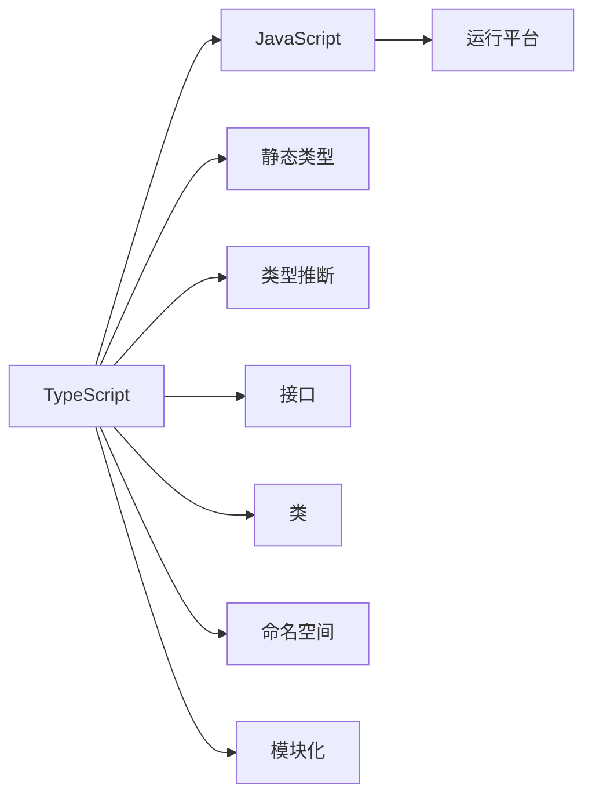

                 

# TypeScript：JavaScript的超集

> 关键词：TypeScript, JavaScript, 静态类型, 编译型, 开发效率, 兼容性, 可维护性

## 1. 背景介绍

### 1.1 问题由来
JavaScript作为一种动态类型语言，具有极高的灵活性和便捷性，但也存在一些难以解决的问题：
- **变量类型不明确**：容易产生类型错误，如未定义变量或错误类型。
- **代码可读性差**：由于没有类型信息，代码难以理解。
- **调试困难**：类型错误导致调试成本增加。
- **重构风险高**：动态类型的代码，重构成本较高，容易出错。

为了解决这些问题，TypeScript应运而生。TypeScript是一种静态类型语言，是JavaScript的超集，具备静态类型特性，同时兼容JavaScript，是业界广受认可的JavaScript未来演进方向。

## 2. 核心概念与联系

### 2.1 核心概念概述

TypeScript核心概念包括：

- **TypeScript**：一种静态类型语言，是JavaScript的超集。具备静态类型特性，如变量声明必须先定义类型，支持类型推断等。

- **JavaScript**：TypeScript的底层运行平台，TypeScript代码在运行时会被编译为JavaScript代码。

- **静态类型**：变量声明必须先定义类型，编译器在编译时会检查类型是否正确，有助于提高代码可读性、可维护性和可维护性。

- **类型推断**：编译器可以根据上下文自动推断变量的类型，减少手动声明类型的工作量。

- **接口(Interface)**：TypeScript提供了一种定义接口的方式，可以用来描述对象或函数的类型。

- **类(Class)**：类是一种面向对象编程的特性，TypeScript支持类继承和多态等面向对象编程特性。

- **命名空间(Namespace)**：命名空间可以用来命名一组相关的变量、函数和类型。

- **模块化(Modules)**：TypeScript支持ES6的模块化特性，通过`import`和`export`关键字进行模块定义和使用。

这些概念之间的逻辑关系可以通过以下Mermaid流程图来展示：



这个流程图展示了两者的关系，以及TypeScript的关键特性：

1. TypeScript是JavaScript的超集，具备JavaScript的全部特性。
2. TypeScript引入了静态类型系统，提高了代码的可读性、可维护性和可维护性。
3. TypeScript提供类型推断、接口、类、命名空间、模块化等特性，使开发更加灵活和高效。

## 3. 核心算法原理 & 具体操作步骤
### 3.1 算法原理概述

TypeScript的核心算法原理包括以下几个关键点：

- **静态类型检查**：编译器在编译时会检查类型是否正确，发现类型错误会给出提示，减少运行时错误。
- **类型推断**：编译器根据上下文自动推断变量的类型，减少了手动声明类型的工作量。
- **接口和类**：通过接口和类来描述对象和函数的类型，提高代码的可读性和可维护性。
- **命名空间和模块化**：通过命名空间和模块化来组织代码，提高了代码的可重用性和可扩展性。

### 3.2 算法步骤详解

1. **安装TypeScript编译器**：
   ```bash
   npm install -g typescript
   ```
   
2. **编写TypeScript代码**：
   ```typescript
   function add(a: number, b: number): number {
     return a + b;
   }
   
   const result = add(1, 2);
   console.log(result);
   ```

3. **编译TypeScript代码**：
   ```bash
   tsc main.ts
   ```

4. **运行JavaScript代码**：
   ```bash
   node main.js
   ```

### 3.3 算法优缺点

**优点**：

- **类型安全性**：通过静态类型检查，减少了运行时错误，提高了代码的可靠性。
- **可读性**：类型信息可以使代码更易读、易理解。
- **可维护性**：静态类型和接口可以使代码更容易维护和重构。
- **工具支持**：TypeScript社区提供了丰富的开发工具，如VS Code、WebStorm等。

**缺点**：

- **学习曲线陡峭**：需要学习新的类型系统，学习成本较高。
- **编译时间长**：TypeScript代码需要编译为JavaScript代码，编译时间较长。

### 3.4 算法应用领域

TypeScript主要应用于以下领域：

- **Web开发**：TypeScript被广泛用于前端开发，提高了代码的质量和可维护性。
- **Node.js开发**：TypeScript可以用于Node.js开发，提高了后端开发的效率和质量。
- **移动开发**：TypeScript可以用于React Native等移动开发框架。
- **服务器端渲染**：TypeScript可以用于服务器端渲染，提高了渲染效率和质量。
- **工具链**：TypeScript社区提供了丰富的工具链，如TypeScript Compiler、TSLint等，方便开发者使用。

## 4. 数学模型和公式 & 详细讲解  
### 4.1 数学模型构建

TypeScript的数学模型主要涉及以下几个方面：

- **变量声明**：`let`和`const`关键字用于声明变量，`let`声明的变量为可变，`const`声明的变量为不可变。
- **函数声明**：`function`关键字用于声明函数，函数可以有多个参数和返回值。
- **类型系统**：`type`关键字用于声明类型，`extends`关键字用于继承类型。

### 4.2 公式推导过程

以下是一个TypeScript函数的推导过程：

```typescript
function add(a: number, b: number): number {
  return a + b;
}
```

- `a`和`b`为函数参数，类型推断为`number`。
- `return`语句的返回值类型推断为`number`。
- 整个函数返回类型为`number`。

### 4.3 案例分析与讲解

以下是一个TypeScript类的推导过程：

```typescript
class Person {
  private name: string;
  private age: number;
  
  constructor(name: string, age: number) {
    this.name = name;
    this.age = age;
  }
  
  getName(): string {
    return this.name;
  }
  
  getAge(): number {
    return this.age;
  }
}

const person = new Person("Alice", 20);
console.log(person.getName());
console.log(person.getAge());
```

- `name`和`age`为类属性，类型为`string`和`number`。
- `constructor`方法用于初始化类属性。
- `getName`和`getAge`方法用于获取类属性，返回类型为`string`和`number`。

## 5. 项目实践：代码实例和详细解释说明
### 5.1 开发环境搭建

1. **安装Node.js和npm**：
   ```bash
   brew install node
   ```

2. **创建TypeScript项目**：
   ```bash
   tsc init
   ```

3. **编写TypeScript代码**：
   ```typescript
   function add(a: number, b: number): number {
     return a + b;
   }
   
   const result = add(1, 2);
   console.log(result);
   ```

4. **编译TypeScript代码**：
   ```bash
   tsc main.ts
   ```

5. **运行JavaScript代码**：
   ```bash
   node main.js
   ```

### 5.2 源代码详细实现

以下是一个TypeScript项目的实现：

```typescript
// 定义接口
interface Person {
  name: string;
  age: number;
}

// 定义类
class Person {
  private name: string;
  private age: number;
  
  constructor(name: string, age: number) {
    this.name = name;
    this.age = age;
  }
  
  getName(): string {
    return this.name;
  }
  
  getAge(): number {
    return this.age;
  }
}

// 使用类
const person = new Person("Alice", 20);
console.log(person.getName());
console.log(person.getAge());
```

### 5.3 代码解读与分析

以下是代码的详细解读：

- **接口定义**：`interface`关键字用于定义接口，`Person`接口包含`name`和`age`两个属性。
- **类定义**：`class`关键字用于定义类，`Person`类包含`name`和`age`两个属性和`getName`和`getAge`两个方法。
- **类实例化**：使用`new`关键字创建`Person`类的实例。
- **类方法调用**：调用`getName`和`getAge`方法获取属性值。

### 5.4 运行结果展示

运行结果如下：

```bash
Alice
20
```

## 6. 实际应用场景
### 6.1 项目案例

以下是一个实际应用场景：

- **项目背景**：一个电商网站需要处理大量的订单数据，包括用户信息、订单信息、支付信息等。为了提高代码的可读性和可维护性，决定使用TypeScript重构项目。
- **项目实现**：
  1. **定义接口**：定义用户、订单、支付等接口。
  2. **定义类**：定义用户、订单、支付等类。
  3. **使用类**：使用类进行订单处理、支付处理等业务逻辑的实现。
  4. **编译和运行**：使用TypeScript编译器编译TypeScript代码，并使用Node.js运行JavaScript代码。

通过使用TypeScript进行重构，提高了代码的可读性和可维护性，减少了类型错误和调试时间，提高了开发效率和项目质量。

### 6.2 未来应用展望

TypeScript作为JavaScript的超集，具备以下未来应用展望：

- **跨平台开发**：TypeScript可以用于Web、Node.js、移动端等平台的开发。
- **前端向后兼容**：TypeScript兼容JavaScript，可以逐步替换JavaScript代码，减少迁移成本。
- **生态系统完善**：TypeScript社区生态系统完善，提供了丰富的开发工具和库。

## 7. 工具和资源推荐
### 7.1 学习资源推荐

为了帮助开发者系统掌握TypeScript，以下是一些优质的学习资源：

1. **TypeScript官方文档**：TypeScript官方文档提供了详细的语言规范和API文档，是学习的必备资料。
2. **TypeScript深度学习**：TypeScript深度学习是一本关于TypeScript的书籍，详细介绍了TypeScript的各个特性。
3. **TypeScript教程**：TypeScript教程是一个免费的在线教程，适合初学者学习。
4. **TypeScript之道**：TypeScript之道是一本关于TypeScript的书籍，介绍了TypeScript的核心特性和应用场景。
5. **TypeScript实战**：TypeScript实战是一本关于TypeScript的书籍，提供了实际项目的实现案例。

通过对这些资源的学习实践，相信你一定能够快速掌握TypeScript的精髓，并用于解决实际的开发问题。

### 7.2 开发工具推荐

以下是几款用于TypeScript开发的常用工具：

1. **Visual Studio Code**：一个轻量级的编辑器，支持TypeScript语法高亮、智能提示等特性。
2. **WebStorm**：一个专业的IDE，支持TypeScript、React、Angular等框架。
3. **TypeScript Compiler**：TypeScript编译器，用于将TypeScript代码编译为JavaScript代码。
4. **TSLint**：一个静态代码分析工具，用于检查TypeScript代码的质量和规范。
5. **Jest**：一个测试框架，支持TypeScript测试用例的编写和运行。

合理利用这些工具，可以显著提升TypeScript开发的效率，加速项目的迭代和发布。

### 7.3 相关论文推荐

以下是几篇关于TypeScript的著名论文：

1. **TypeScript in the Wild**：一篇论文，介绍了TypeScript在实际项目中的应用案例。
2. **TypeScript Ecosystem**：一篇论文，介绍了TypeScript的生态系统、社区和工具。
3. **TypeScript as a Super Set of JavaScript**：一篇论文，详细介绍了TypeScript和JavaScript之间的关系和演进过程。

这些论文代表了大规模语言模型微调技术的发展脉络。通过学习这些前沿成果，可以帮助研究者把握学科前进方向，激发更多的创新灵感。

## 8. 总结：未来发展趋势与挑战
### 8.1 研究成果总结

TypeScript作为JavaScript的超集，具有以下研究成果：

1. **类型安全性**：通过静态类型检查，减少了运行时错误，提高了代码的可靠性。
2. **可读性**：类型信息可以使代码更易读、易理解。
3. **可维护性**：静态类型和接口可以使代码更容易维护和重构。
4. **工具支持**：TypeScript社区提供了丰富的开发工具，如VS Code、WebStorm等。

### 8.2 未来发展趋势

TypeScript的未来发展趋势包括：

1. **生态系统完善**：TypeScript社区生态系统完善，提供了丰富的开发工具和库。
2. **跨平台支持**：TypeScript可以用于Web、Node.js、移动端等平台的开发。
3. **前端向后兼容**：TypeScript兼容JavaScript，可以逐步替换JavaScript代码，减少迁移成本。
4. **性能优化**：TypeScript社区提供了性能优化工具，如TypeScript Compiler、TSLint等。

### 8.3 面临的挑战

TypeScript面临的挑战包括：

1. **学习曲线陡峭**：需要学习新的类型系统，学习成本较高。
2. **编译时间长**：TypeScript代码需要编译为JavaScript代码，编译时间较长。

### 8.4 研究展望

未来的研究展望包括：

1. **跨平台开发**：TypeScript可以用于Web、Node.js、移动端等平台的开发。
2. **前端向后兼容**：TypeScript兼容JavaScript，可以逐步替换JavaScript代码，减少迁移成本。
3. **生态系统完善**：TypeScript社区生态系统完善，提供了丰富的开发工具和库。
4. **性能优化**：TypeScript社区提供了性能优化工具，如TypeScript Compiler、TSLint等。

总之，TypeScript具备静态类型、可读性、可维护性等优点，是JavaScript的未来演进方向。TypeScript的生态系统不断完善，未来将广泛应用于各个领域。

## 9. 附录：常见问题与解答

**Q1：TypeScript与JavaScript的区别是什么？**

A: TypeScript是JavaScript的超集，具备JavaScript的全部特性。TypeScript引入了静态类型系统，可以通过编译器在编译时检查类型错误，提高了代码的可靠性和可维护性。

**Q2：TypeScript的编译时间是否比JavaScript长？**

A: TypeScript代码需要编译为JavaScript代码，编译时间较长。但是TypeScript提供了性能优化工具，如TypeScript Compiler、TSLint等，可以显著缩短编译时间。

**Q3：如何减少TypeScript的学习成本？**

A: 可以参考官方文档、在线教程和书籍，逐步学习TypeScript的各个特性。可以从简单的项目开始，逐步增加复杂度，逐步掌握TypeScript。

**Q4：TypeScript如何进行类型推断？**

A: TypeScript可以进行类型推断，编译器根据上下文自动推断变量的类型。可以使用`let`和`const`关键字声明变量，编译器会根据变量的初始值推断类型。

**Q5：TypeScript如何进行接口定义？**

A: TypeScript可以使用`interface`关键字定义接口，接口中可以定义属性和方法。定义接口后，可以在类和函数中使用接口，提高代码的可读性和可维护性。

---

作者：禅与计算机程序设计艺术 / Zen and the Art of Computer Programming

