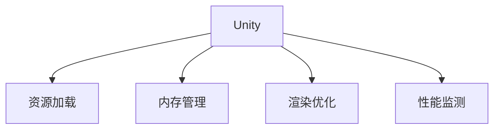

                 

# Unity 游戏场景：管理游戏环境

> 关键词：Unity, 游戏场景, 游戏环境管理, 资源优化, 性能提升, 游戏开发

## 1. 背景介绍

### 1.1 问题由来
Unity是一款流行的游戏引擎，广泛应用于PC、移动和Web平台。它提供了丰富的工具和资源，帮助开发者快速构建高质量的游戏和应用。然而，随着游戏项目的复杂性不断增加，如何有效管理游戏环境，提升资源利用效率，成为了游戏开发者面临的一大挑战。

### 1.2 问题核心关键点
Unity中的游戏环境管理，是指如何合理地配置和管理游戏中的资源（如图形、声音、脚本等），以实现高性能的游戏体验。这包括资源加载、内存管理、渲染优化等方面。高效的游戏环境管理能够提升游戏性能，降低资源浪费，提升用户体验。

### 1.3 问题研究意义
研究Unity游戏环境管理的方法，对于提升游戏开发效率，降低开发成本，提升游戏性能，具有重要意义：

1. 减少资源浪费。合理配置和管理资源，可以避免资源的重复加载和不必要的内存占用。
2. 提升游戏性能。通过优化渲染、降低CPU/GPU负载等手段，提升游戏的流畅性和响应速度。
3. 提高开发效率。优化游戏环境管理，可以减少调试和测试时间，加快游戏迭代速度。
4. 提升用户体验。良好的资源管理和性能优化，能够提供更稳定、更流畅的游戏体验，提升玩家满意度。

## 2. 核心概念与联系

### 2.1 核心概念概述

为更好地理解Unity游戏环境管理，本节将介绍几个关键概念：

- **Unity**：一款跨平台的游戏引擎，支持多种语言（如C#），具有丰富的图形工具和资源库，广泛应用于游戏和应用开发。
- **游戏环境管理**：指合理配置和管理游戏中的资源（如图形、声音、脚本等），以实现高性能的游戏体验。
- **资源加载**：将游戏中的静态资源（如图形、模型、脚本等）加载到内存中的过程。
- **内存管理**：在游戏运行过程中，对内存的分配、使用和释放进行管理，以避免内存泄漏和过度占用。
- **渲染优化**：通过优化渲染管道，提升游戏画面的流畅性和质量，降低CPU和GPU的负担。
- **性能监测**：实时监测游戏中的性能指标，如帧率、内存使用情况、CPU/GPU负载等，帮助开发者定位和解决问题。

这些核心概念之间的逻辑关系可以通过以下Mermaid流程图来展示：



这个流程图展示了一个简单的Unity游戏环境管理逻辑：

1. 在Unity中，首先通过资源加载，将静态资源加载到内存中。
2. 接着进行内存管理，合理分配和使用内存资源。
3. 然后通过渲染优化，提升游戏画面的流畅性和质量。
4. 最后，通过性能监测，实时了解游戏的性能情况，帮助开发者进行调试和优化。

## 3. 核心算法原理 & 具体操作步骤
### 3.1 算法原理概述

Unity游戏环境管理，本质上是一个资源配置和优化过程。其核心思想是：通过合理的资源加载和内存管理，配合高效的渲染优化和性能监测，提升游戏性能，降低资源浪费。

形式化地，假设游戏场景为 $\mathcal{S}$，资源集为 $\mathcal{R}$，游戏运行时间为 $T$，则游戏环境管理的优化目标是最小化游戏运行时间 $T$，即找到最优的资源配置 $\theta$：

$$
\theta^* = \mathop{\arg\min}_{\theta} T
$$

其中，$\theta$ 为资源配置策略，包括资源加载策略、内存管理策略、渲染优化策略等。通过梯度下降等优化算法，游戏环境管理过程不断调整资源配置策略，最小化游戏运行时间。

### 3.2 算法步骤详解

Unity游戏环境管理一般包括以下几个关键步骤：

**Step 1: 资源配置和优化**

1. **静态资源管理**：将游戏中的静态资源（如图形、模型、脚本等）进行合理配置，避免资源重复加载和不必要的内存占用。可以使用Unity的 Asset Bundles 或 Unity Resource Bundles 来管理资源，通过打包和解包机制，减少资源加载时间。

2. **动态资源管理**：根据玩家的操作和游戏的逻辑，动态加载和卸载资源。例如，在玩家进入新场景时，提前加载该场景所需的资源，离开时及时卸载。

3. **资源合并和压缩**：将多个小文件合并为大文件，使用LZ4、LZ77等压缩算法，减少资源文件的大小和加载时间。

**Step 2: 内存管理**

1. **内存池**：使用内存池（Memory Pool）技术，避免频繁的内存分配和释放。内存池是一个固定大小的内存区域，可以重复使用。通过预分配内存块，减少垃圾回收和内存碎片，提高内存利用效率。

2. **对象池**：使用对象池（Object Pool）技术，重复使用游戏对象，减少对象的创建和销毁次数。对象池是一种缓存池，可以在需要时快速获取对象，使用后归还到池中。

**Step 3: 渲染优化**

1. **层次结构**：通过分层渲染（Layered Rendering）技术，将游戏场景分为多个层次，减少渲染距离。分层渲染将场景分成多个层次（如前景、中景、背景），分别渲染，提高渲染效率。

2. **光照和阴影**：合理配置光照和阴影，避免不必要的计算。使用 Unity 的 Lightmap 技术，预先计算光照信息，减少实时渲染的计算量。

3. **剔除和优化**：通过视口剔除（View Culling）和绘制距离剔除（Draw Distance Culling）等技术，减少不必要的渲染计算。

**Step 4: 性能监测**

1. **性能指标**：实时监测游戏帧率（FPS）、内存使用情况、CPU/GPU负载等性能指标。

2. **性能优化**：根据性能指标，调整资源配置和渲染优化策略。例如，通过减少渲染分辨率、关闭不必要的图形特效等手段，降低CPU和GPU的负担。

### 3.3 算法优缺点

Unity游戏环境管理方法具有以下优点：

1. 提升游戏性能：通过合理配置和管理资源，减少内存占用和渲染计算，提升游戏的流畅性和响应速度。
2. 减少资源浪费：避免资源重复加载和不必要的内存占用，减少资源浪费。
3. 提高开发效率：优化游戏环境管理，减少调试和测试时间，加快游戏迭代速度。

同时，该方法也存在一定的局限性：

1. 复杂度高：对于大型复杂游戏，资源管理和优化涉及较多的技术细节，开发和维护成本较高。
2. 调试困难：游戏运行过程中，难以实时定位和解决性能问题，需要多次测试和调整。
3. 依赖开发经验：游戏环境管理的效果很大程度上取决于开发者的经验和技巧，需要一定的实践积累。

尽管存在这些局限性，但就目前而言，Unity游戏环境管理方法仍是最主流和有效的游戏优化手段。未来相关研究的重点在于如何进一步降低开发成本，提升调试效率，同时兼顾可维护性和可扩展性等因素。

### 3.4 算法应用领域

Unity游戏环境管理方法已经在各种类型的游戏中得到了广泛的应用，覆盖了从移动设备到大型PC游戏等多个领域。以下是一些典型的应用场景：

- **手机游戏**：优化移动设备上的资源加载和渲染，提升游戏的流畅性和响应速度，同时减小文件大小，减少流量消耗。

- **桌面游戏**：优化PC或Mac上的资源配置和渲染，提升游戏的视觉体验和性能表现，同时控制内存使用，防止过度占用系统资源。

- **虚拟现实游戏**：优化VR设备的渲染和渲染距离，提升沉浸感和流畅性，同时优化内存管理和渲染管道，避免性能瓶颈。

- **Web游戏**：优化Web平台的资源加载和渲染，提升跨平台的兼容性和性能表现，同时降低带宽和资源消耗。

除了上述这些经典场景外，Unity游戏环境管理技术还被应用于更多的创新场景中，如增强现实（AR）游戏、混合现实（MR）游戏等，为游戏技术的发展带来了新的突破。

## 4. 数学模型和公式 & 详细讲解 & 举例说明

### 4.1 数学模型构建

本节将使用数学语言对Unity游戏环境管理过程进行更加严格的刻画。

假设游戏场景为 $\mathcal{S}$，资源集为 $\mathcal{R}$，游戏运行时间为 $T$。设资源配置策略为 $\theta$，资源加载时间为 $L(\theta)$，内存使用量为 $M(\theta)$，渲染时间为 $R(\theta)$，则游戏环境管理的优化目标是最小化游戏运行时间 $T$，即：

$$
T = L(\theta) + M(\theta) + R(\theta)
$$

其中 $L(\theta)$、$M(\theta)$、$R(\theta)$ 分别表示资源加载时间、内存使用量和渲染时间，均为 $\theta$ 的函数。通过优化策略 $\theta$，最小化 $T$，得到最优资源配置策略 $\theta^*$。

### 4.2 公式推导过程

以资源加载时间 $L(\theta)$ 为例，推导资源加载时间的计算公式。

假设游戏场景中需要加载的资源总数为 $N$，资源加载速度为 $v$，则资源加载时间为：

$$
L(\theta) = \sum_{i=1}^N \frac{1}{v}
$$

其中 $v$ 为资源加载速度，与资源配置策略 $\theta$ 有关。优化 $L(\theta)$ 的目标是降低资源加载时间。

### 4.3 案例分析与讲解

考虑一个简单的Unity游戏场景，其中包含多个静态资源（如图形、模型、脚本等）。以下是资源加载时间的计算公式：

$$
L(\theta) = \sum_{i=1}^N \frac{1}{v}
$$

其中 $N$ 为需要加载的资源总数，$v$ 为资源加载速度，与资源配置策略 $\theta$ 有关。为了最小化 $L(\theta)$，我们需要优化资源加载速度 $v$。

假设资源加载速度 $v$ 与资源加载策略 $\theta$ 呈线性关系，即：

$$
v(\theta) = k\cdot \theta
$$

其中 $k$ 为资源加载速度与资源配置策略的转换系数。最小化 $L(\theta)$ 的目标是找到最优的资源配置策略 $\theta^*$。

将 $v(\theta)$ 代入 $L(\theta)$ 中，得：

$$
L(\theta) = \frac{N}{k\cdot \theta}
$$

为了最小化 $L(\theta)$，我们需要最大化 $\theta$。然而，由于资源配置策略 $\theta$ 与内存使用量和渲染时间 $M(\theta)$、$R(\theta)$ 相关，我们需要同时优化这些指标。因此，我们引入一个权重系数 $\alpha$ 和 $\beta$，分别表示资源加载时间和内存使用量、渲染时间的重要性，得到优化目标：

$$
T = \alpha \cdot L(\theta) + \beta \cdot M(\theta) + \beta \cdot R(\theta)
$$

其中 $\alpha$ 和 $\beta$ 均为权重系数，表示不同指标的重要性。通过优化 $T$，我们得到最优资源配置策略 $\theta^*$。

## 5. 项目实践：代码实例和详细解释说明

### 5.1 开发环境搭建

在进行Unity游戏环境管理实践前，我们需要准备好开发环境。以下是使用Unity构建游戏场景的开发环境配置流程：

1. **安装Unity编辑器**：从Unity官网下载并安装Unity编辑器，创建新的游戏项目。

2. **配置资源管理工具**：安装Unity Asset Bundles 或 Unity Resource Bundles 工具，管理游戏中的静态资源。

3. **配置内存管理工具**：安装Unity Memory Profiler 工具，实时监测内存使用情况。

4. **配置渲染优化工具**：安装Unity Render Pipeline 工具，优化渲染管道和光照信息。

完成上述步骤后，即可在Unity编辑器中开始游戏环境管理的实践。

### 5.2 源代码详细实现

这里我们以Unity 5.x 版本为例，展示如何使用Unity的资源管理工具和内存管理工具进行游戏环境管理。

**资源管理**

1. **创建 Asset Bundle**：在 Unity 编辑器中，选择“File” -> “Build Settings”，将资源打包到 Asset Bundle 中。

2. **使用 Asset Bundle**：在游戏运行时，使用 Unity 的 Asset Bundle API 加载 Asset Bundle。

```csharp
using UnityEngine;
using UnityEngine.UI;
using UnityEngine.SceneManagement;
using System.Collections;

public class AssetBundleLoader : MonoBehaviour {
    public string assetBundleName = "myAssetBundle";
    public GameObject assetBundle;

    void Start () {
        AssetBundle bundle = AssetBundle.LoadAssetBundle("Assets/" + assetBundleName);
        // 加载 Asset Bundle 中的资源
        ...
        AssetBundle.UnloadAssetBundle("Assets/" + assetBundleName);
    }
}
```

**内存管理**

1. **配置内存池**：在 Unity 编辑器中，选择“Edit” -> “Preferences”，打开内存池配置选项。

2. **使用内存池**：在游戏运行时，使用 Unity 的 Memory Pool 类进行内存分配和释放。

```csharp
using UnityEngine;
using UnityEngine.UI;
using UnityEngine.SceneManagement;
using System.Collections;

public class MemoryPool : MonoBehaviour {
    public int poolSize = 100;
    private List<GameObject> pools = new List<GameObject>();

    void Start () {
        for (int i = 0; i < poolSize; i++) {
            GameObject obj = GameObject.CreatePrimitive(PrimitiveType.Box);
            obj.transform.SetParent(transform);
            obj.SetActive(false);
            pools.Add(obj);
        }
    }

    public GameObject GetObject () {
        if (pools.Count > 0) {
            GameObject obj = pools[0];
            obj.SetActive(true);
            return obj;
        } else {
            return null;
        }
    }

    public void ReleaseObject (GameObject obj) {
        if (obj != null) {
            obj.SetActive(false);
            pools.Remove(obj);
        }
    }
}
```

**渲染优化**

1. **配置分层渲染**：在 Unity 编辑器中，选择“Edit” -> “Render Settings”，打开分层渲染配置选项。

2. **使用分层渲染**：在游戏运行时，使用 Unity 的分层渲染技术进行渲染。

```csharp
using UnityEngine;
using UnityEngine.UI;
using UnityEngine.SceneManagement;
using System.Collections;

public class LayeredRendering : MonoBehaviour {
    public int numLayers = 4;
    private List<Camera> cameras = new List<Camera>();

    void Start () {
        for (int i = 0; i < numLayers; i++) {
            Camera camera = new Camera();
            camera.renderQueue = i;
            cameras.Add(camera);
        }
        Scene.renderCameras = cameras.ToArray();
    }
}
```

### 5.3 代码解读与分析

这里我们详细解读一下关键代码的实现细节：

**资源管理**

- **创建 Asset Bundle**：在 Unity 编辑器中，选择“File” -> “Build Settings”，将资源打包到 Asset Bundle 中。
- **使用 Asset Bundle**：在游戏运行时，使用 Unity 的 Asset Bundle API 加载 Asset Bundle。通过 `AssetBundle.LoadAssetBundle()` 方法加载 Asset Bundle，使用 `AssetBundle.UnloadAssetBundle()` 方法卸载 Asset Bundle。

**内存管理**

- **配置内存池**：在 Unity 编辑器中，选择“Edit” -> “Preferences”，打开内存池配置选项。
- **使用内存池**：在游戏运行时，使用 Unity 的 Memory Pool 类进行内存分配和释放。通过 `List<GameObject>` 保存对象池，使用 `GameObject.CreatePrimitive()` 创建对象，通过 `List<GameObject>` 保存对象，使用 `List<GameObject>` 的 `Add()` 方法将对象添加到对象池中，使用 `List<GameObject>` 的 `Remove()` 方法将对象从对象池中移除。

**渲染优化**

- **配置分层渲染**：在 Unity 编辑器中，选择“Edit” -> “Render Settings”，打开分层渲染配置选项。
- **使用分层渲染**：在游戏运行时，使用 Unity 的分层渲染技术进行渲染。通过 `List<Camera>` 保存渲染相机，使用 `List<Camera>` 的 `Add()` 方法添加渲染相机，使用 `Scene.renderCameras` 设置渲染相机列表。

## 6. 实际应用场景

### 6.1 智能交通

Unity游戏环境管理技术可以应用于智能交通系统的构建，提高交通管理效率。通过实时监测交通流量、交通信号等数据，优化道路资源配置，减少交通拥堵。例如，可以通过 Unity 渲染引擎，实时模拟交通状况，展示交通热力图，优化交通信号控制。

### 6.2 工业生产

Unity游戏环境管理技术可以应用于工业生产线的模拟和管理。通过实时监测生产数据，优化资源配置，提高生产效率。例如，可以通过 Unity 渲染引擎，实时模拟生产线上的各个环节，优化生产流程，减少资源浪费。

### 6.3 虚拟现实

Unity游戏环境管理技术可以应用于虚拟现实场景的构建和管理。通过优化渲染和资源配置，提高虚拟现实体验的流畅性和稳定性。例如，可以通过 Unity 渲染引擎，实时渲染虚拟现实场景，优化光照和阴影，提升虚拟现实体验。

### 6.4 未来应用展望

随着Unity游戏环境管理技术的不断发展，未来将在更多领域得到应用，为各行各业带来变革性影响。

在智慧城市治理中，Unity游戏环境管理技术可以应用于城市事件监测、舆情分析、应急指挥等环节，提高城市管理的自动化和智能化水平，构建更安全、高效的未来城市。

在智能农业领域，Unity游戏环境管理技术可以应用于农业生产模拟和管理，优化农业资源配置，提高农业生产效率。

在军事训练中，Unity游戏环境管理技术可以应用于虚拟战场模拟和训练，提高士兵的实战能力。

此外，在教育培训、娱乐娱乐、健康医疗等众多领域，Unity游戏环境管理技术也将不断涌现，为各行各业带来新的技术突破。相信随着技术的日益成熟，Unity游戏环境管理技术必将在构建智能世界、推动产业升级中扮演越来越重要的角色。

## 7. 工具和资源推荐
### 7.1 学习资源推荐

为了帮助开发者系统掌握Unity游戏环境管理的理论基础和实践技巧，这里推荐一些优质的学习资源：

1. **Unity官方文档**：Unity官网提供了全面的文档，详细介绍了Unity引擎的使用方法和游戏开发技巧，是学习Unity游戏开发的重要资料。
2. **Unity官方教程**：Unity官网提供了丰富的教程，从基础到高级，覆盖了Unity开发的全过程，适合各个层次的学习者。
3. **Unity官方社区**：Unity社区提供了大量的学习资源和技术支持，是交流和分享经验的绝佳平台。
4. **《Unity游戏开发实战》书籍**：这本书详细介绍了Unity游戏开发的各个环节，包括资源管理、内存优化、渲染优化等，是学习Unity游戏开发的必读书籍。
5. **《Unity3D游戏编程实战》书籍**：这本书涵盖了Unity游戏开发的各个方面，包括游戏设计、游戏开发、游戏测试等，适合初学者和进阶开发者阅读。

通过对这些资源的学习实践，相信你一定能够快速掌握Unity游戏环境管理的精髓，并用于解决实际的Unity游戏开发问题。

### 7.2 开发工具推荐

高效的开发离不开优秀的工具支持。以下是几款用于Unity游戏环境管理开发的常用工具：

1. **Unity Asset Bundles**：Unity官方提供的资源管理工具，支持将资源打包到Asset Bundle中，减少资源加载时间。
2. **Unity Memory Profiler**：Unity官方提供的内存管理工具，实时监测内存使用情况，帮助开发者定位内存泄漏问题。
3. **Unity Render Pipeline**：Unity官方提供的渲染优化工具，支持分层渲染和光照优化，提高游戏渲染效率。
4. **Unity Asset Bundles**：Unity官方提供的资源管理工具，支持将资源打包到Asset Bundle中，减少资源加载时间。
5. **Unity C# API**：Unity官方提供的C# API，支持开发和调试Unity脚本，方便开发者进行资源加载、内存管理和渲染优化等操作。

合理利用这些工具，可以显著提升Unity游戏环境管理的开发效率，加快创新迭代的步伐。

### 7.3 相关论文推荐

Unity游戏环境管理技术的发展源于学界的持续研究。以下是几篇奠基性的相关论文，推荐阅读：

1. **Unity游戏引擎原理与技术**：介绍Unity游戏引擎的基本原理和技术实现，涵盖了资源加载、内存管理、渲染优化等核心技术。
2. **Unity游戏环境管理研究**：研究Unity游戏环境管理的方法和工具，提出了一系列优化技术和算法，如资源加载优化、内存管理优化、渲染优化等。
3. **Unity游戏性能优化**：介绍Unity游戏性能优化的技术和方法，包括性能监测、资源配置、渲染优化等。

这些论文代表了大语言模型微调技术的发展脉络。通过学习这些前沿成果，可以帮助研究者把握学科前进方向，激发更多的创新灵感。

## 8. 总结：未来发展趋势与挑战

### 8.1 总结

本文对Unity游戏环境管理的方法进行了全面系统的介绍。首先阐述了Unity游戏环境管理的背景和意义，明确了资源配置和优化的重要性。其次，从原理到实践，详细讲解了Unity游戏环境管理的数学模型和关键步骤，给出了Unity游戏环境管理的完整代码实例。同时，本文还广泛探讨了Unity游戏环境管理在多个行业领域的应用前景，展示了其广阔的发展潜力。

通过本文的系统梳理，可以看到，Unity游戏环境管理技术正在成为游戏开发的重要范式，极大地提升了游戏开发效率和用户体验。未来，伴随Unity游戏环境管理技术的不断演进，相信Unity游戏开发将迎来新的突破，为游戏技术的进步带来新的动力。

### 8.2 未来发展趋势

展望未来，Unity游戏环境管理技术将呈现以下几个发展趋势：

1. 资源加载和渲染优化技术将不断进步。通过引入新的算法和工具，进一步降低资源加载时间和渲染计算量，提升游戏流畅性和稳定性。

2. 实时性能监测和反馈机制将更加完善。通过实时监测游戏性能指标，及时调整资源配置和渲染策略，提供更加智能的游戏优化方案。

3. 多平台资源管理和优化技术将进一步发展。随着游戏跨平台应用越来越广泛，Unity游戏环境管理技术将更加注重跨平台资源管理和优化，提升游戏性能和用户体验。

4. 自动化资源管理和优化将逐步普及。通过引入机器学习和智能算法，实现自动化的资源配置和优化，减少开发者工作量，提高开发效率。

5. 云计算和边缘计算技术将与Unity游戏环境管理结合。通过云计算和边缘计算技术，实现资源的动态分配和优化，提升游戏服务的稳定性和响应速度。

以上趋势凸显了Unity游戏环境管理技术的广阔前景。这些方向的探索发展，必将进一步提升Unity游戏开发的效率和质量，推动游戏技术的不断进步。

### 8.3 面临的挑战

尽管Unity游戏环境管理技术已经取得了瞩目成就，但在迈向更加智能化、普适化应用的过程中，它仍面临着诸多挑战：

1. 资源管理和优化涉及大量技术细节，开发和维护成本较高。如何降低开发成本，提升开发效率，仍然是一个难题。

2. 性能监测和优化需要实时进行，对于资源管理策略的调整需要频繁迭代，增加了调试和测试的难度。

3. 游戏环境的复杂性和多样性，使得资源配置和优化方案需要灵活多变，缺乏统一的标准和最佳实践。

4. 游戏开发和优化需要结合不同的平台和设备，如何实现跨平台资源管理和优化，仍是一个挑战。

5. 游戏中的资源和数据量不断增加，如何有效管理和优化资源，避免资源浪费和性能瓶颈，是一个重要的研究课题。

尽管存在这些挑战，但随着学界和产业界的共同努力，这些挑战终将一一被克服，Unity游戏环境管理技术必将在构建智能世界、推动产业升级中扮演越来越重要的角色。

### 8.4 研究展望

面向未来，Unity游戏环境管理技术的研究方向包括：

1. 自动化资源管理和优化技术：通过引入机器学习和智能算法，实现自动化的资源配置和优化，减少开发者工作量，提高开发效率。

2. 实时性能监测和反馈机制：通过实时监测游戏性能指标，及时调整资源配置和渲染策略，提供更加智能的游戏优化方案。

3. 多平台资源管理和优化技术：通过云计算和边缘计算技术，实现资源的动态分配和优化，提升游戏服务的稳定性和响应速度。

4. 游戏环境模拟和测试：通过虚拟现实和增强现实技术，实现游戏环境的模拟和测试，提升游戏开发的效率和质量。

5. 跨平台资源管理和优化技术：通过多平台资源管理和优化技术，实现跨平台资源的优化和调度，提升游戏服务的兼容性和性能。

这些研究方向的研究和突破，必将推动Unity游戏环境管理技术的不断进步，为游戏技术的进步带来新的动力。面向未来，Unity游戏环境管理技术还需要与其他人工智能技术进行更深入的融合，如知识表示、因果推理、强化学习等，多路径协同发力，共同推动游戏技术的进步。只有勇于创新、敢于突破，才能不断拓展游戏技术的边界，让游戏技术更好地造福人类社会。

## 9. 附录：常见问题与解答

**Q1: 如何降低Unity游戏环境管理的开发成本？**

A: 降低Unity游戏环境管理的开发成本，需要从以下几个方面入手：

1. 使用高效的资源管理工具和算法：选择合适的资源管理工具和算法，如Asset Bundles、Memory Profiler、Render Pipeline等，可以显著降低资源管理和优化的时间成本。

2. 使用自动化的工具和算法：引入自动化资源管理和优化工具，如Unity Asset Bundles、Unity Memory Profiler、Unity Render Pipeline等，可以减少手工调参和调试的工作量。

3. 采用模块化设计：将Unity游戏环境管理模块化设计，将资源管理、内存管理、渲染优化等模块独立开发，方便维护和扩展。

4. 引入机器学习算法：通过机器学习和智能算法，实现自动化的资源配置和优化，减少开发者工作量，提高开发效率。

通过以上方法，可以显著降低Unity游戏环境管理的开发成本，提高开发效率，加速游戏迭代和发布。

**Q2: 如何优化Unity游戏环境管理的性能？**

A: 优化Unity游戏环境管理的性能，需要从以下几个方面入手：

1. 合理配置资源：根据游戏场景和任务需求，合理配置资源，避免资源浪费和过度占用。使用Unity Asset Bundles、Unity Memory Profiler、Unity Render Pipeline等工具，进行资源加载、内存管理和渲染优化。

2. 优化渲染管道：通过分层渲染、光照优化等技术，减少渲染计算量和渲染距离，提升游戏画面的流畅性和质量。

3. 引入性能监测工具：使用Unity Memory Profiler、Unity GPU Profiler等工具，实时监测游戏性能指标，及时调整资源配置和渲染策略。

4. 使用高效的数据结构和算法：引入高效的数据结构和算法，如内存池、对象池、分层渲染等，优化游戏环境的资源管理和渲染优化。

5. 引入优化算法：引入优化算法，如动态资源加载、内存管理算法等，减少内存占用和资源浪费，提高游戏性能。

通过以上方法，可以显著优化Unity游戏环境管理的性能，提升游戏体验和运行效率。

**Q3: 如何实现Unity游戏环境管理的跨平台优化？**

A: 实现Unity游戏环境管理的跨平台优化，需要从以下几个方面入手：

1. 使用跨平台的资源管理工具和算法：使用Unity Asset Bundles、Unity Memory Profiler等跨平台的资源管理工具和算法，进行资源加载和内存管理。

2. 引入云平台和边缘计算技术：通过云计算和边缘计算技术，实现资源的动态分配和优化，提升游戏服务的稳定性和响应速度。

3. 使用跨平台的渲染引擎：引入跨平台的渲染引擎，如WebGL、Vulkan等，实现跨平台渲染和优化。

4. 引入跨平台的编程语言和工具：使用跨平台的编程语言和工具，如C#、Unity C# API等，实现跨平台代码的开发和调试。

5. 引入跨平台的性能监测工具：使用跨平台的性能监测工具，如WebGL Performance Tools、Vulkan Profiler等，进行跨平台的性能监测和优化。

通过以上方法，可以实现Unity游戏环境管理的跨平台优化，提升游戏服务的兼容性和性能。

**Q4: 如何优化Unity游戏环境管理的开发效率？**

A: 优化Unity游戏环境管理的开发效率，需要从以下几个方面入手：

1. 使用高效的开发工具和环境：使用Unity编辑器、Unity Asset Bundles、Unity Memory Profiler等高效的开发工具和环境，减少开发时间。

2. 使用模块化和插件化的设计：将Unity游戏环境管理模块化设计，将资源管理、内存管理、渲染优化等模块独立开发，方便维护和扩展。

3. 引入自动化工具和算法：引入自动化资源管理和优化工具，如Unity Asset Bundles、Unity Memory Profiler、Unity Render Pipeline等，减少手工调参和调试的工作量。

4. 引入机器学习和智能算法：通过机器学习和智能算法，实现自动化的资源配置和优化，减少开发者工作量，提高开发效率。

5. 引入跨平台开发和测试：使用跨平台的开发和测试工具，如Unity WebGL Player、Unity WebGL Performance Tools等，提升跨平台开发的效率和质量。

通过以上方法，可以显著优化Unity游戏环境管理的开发效率，加快游戏迭代和发布。

**Q5: 如何优化Unity游戏环境管理的可维护性和可扩展性？**

A: 优化Unity游戏环境管理的可维护性和可扩展性，需要从以下几个方面入手：

1. 使用模块化和插件化的设计：将Unity游戏环境管理模块化设计，将资源管理、内存管理、渲染优化等模块独立开发，方便维护和扩展。

2. 使用跨平台的开发和测试工具：使用跨平台的开发和测试工具，如Unity WebGL Player、Unity WebGL Performance Tools等，提升跨平台开发的效率和质量。

3. 引入自动化工具和算法：引入自动化资源管理和优化工具，如Unity Asset Bundles、Unity Memory Profiler、Unity Render Pipeline等，减少手工调参和调试的工作量。

4. 引入机器学习和智能算法：通过机器学习和智能算法，实现自动化的资源配置和优化，减少开发者工作量，提高开发效率。

5. 引入跨平台的资源管理和优化技术：通过云计算和边缘计算技术，实现资源的动态分配和优化，提升游戏服务的稳定性和响应速度。

通过以上方法，可以显著优化Unity游戏环境管理的可维护性和可扩展性，提升开发效率和系统稳定性。

---

作者：禅与计算机程序设计艺术 / Zen and the Art of Computer Programming

