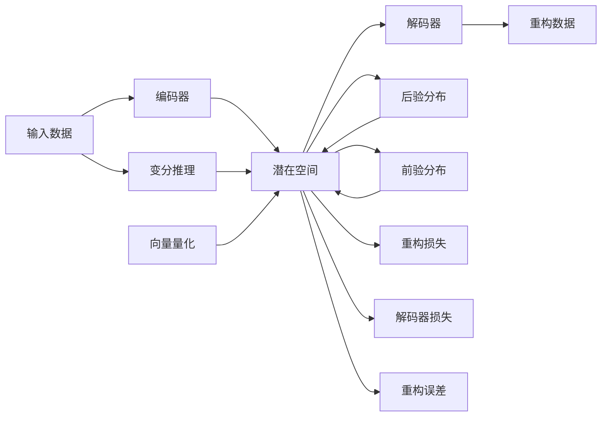

                 

# VQVAE：变分自编码器的新境界

## 1. 背景介绍

变分自编码器（Variational Autoencoder, VAE）是一种深度学习中的生成模型，它通过将数据编码到一个低维潜在空间，再通过解码器生成新的数据，从而实现数据的压缩和重构。自2013年提出以来，VAE在图像生成、异常检测、推荐系统等多个领域中得到了广泛的应用，并被证明具有强大的表征学习能力。

然而，标准的VAE在编码和解码过程中使用了复杂的非线性映射，这不仅增加了模型的复杂度，也导致了生成的数据质量受限于模型参数的选择和训练过程。此外，VAE的训练过程往往需要大量的计算资源和时间，限制了其在实际应用中的普及。

为了解决这些问题，Google Brain团队在2017年提出了VQ-VAE（Vector Quantized Variational Autoencoder），也称为变分自编码器的向量量化（Vector Quantization）版本。VQ-VAE通过将连续的潜在空间离散化，利用离散的向量来编码数据，从而降低了生成过程的复杂度，提高了生成数据的质量，并且显著降低了训练和推理的计算需求。

本文将详细探讨VQ-VAE的核心原理、操作步骤、优缺点、应用场景等，并通过具体的代码实例和数学推导，帮助你全面理解这一重要模型。

## 2. 核心概念与联系

### 2.1 核心概念概述

在讨论VQ-VAE之前，我们先回顾一下自编码器和变分自编码器的基本概念：

- **自编码器（Autoencoder）**：是一种无监督学习模型，它通过将数据压缩到低维空间，再通过解码器重构原始数据。自编码器的目标是最小化重构误差，从而学习到数据的低维表示。

- **变分自编码器（Variational Autoencoder, VAE）**：是一种生成模型，它通过将数据编码到潜在空间，再通过解码器生成新的数据。VAE的目标是最大化潜在空间的分布对原始数据分布的拟合程度，从而学习到数据的概率模型。

VQ-VAE是在VAE的基础上，通过将连续的潜在空间离散化为离散的向量（即向量量化），进一步简化了模型结构，提高了生成数据的质量和效率。

### 2.2 核心概念原理和架构的 Mermaid 流程图



**节点说明**：
- **A**：输入数据
- **B**：编码器
- **C**：潜在空间
- **D**：解码器
- **E**：重构数据
- **F**：变分推理
- **G**：向量量化
- **H**：后验分布
- **I**：前验分布
- **J**：重构损失
- **K**：解码器损失
- **L**：重构误差

### 2.3 核心概念联系

从图中可以看出，VQ-VAE的基本框架与标准的VAE非常类似，但引入了一个重要的节点——向量量化（G）。向量量化将连续的潜在空间（C）离散化为离散的向量，从而简化了生成过程，提高了生成数据的质量和效率。

向量量化是VQ-VAE的核心，也是区分其与标准VAE的关键所在。在向量量化过程中，模型需要学习一组离散向量（即码本），每个向量代表一个潜在状态的编码，然后将每个潜在状态的编码分配给最近的向量。这样，每个潜在状态都可以用离散的向量来表示，从而简化了模型结构和生成过程。

## 3. 核心算法原理 & 具体操作步骤

### 3.1 算法原理概述

VQ-VAE的核心思想是通过向量量化，将连续的潜在空间离散化为离散的向量，从而简化模型结构，提高生成数据的质量和效率。其具体步骤如下：

1. **输入数据编码**：将输入数据通过编码器（B）映射到潜在空间（C），得到潜在状态编码（Z）。
2. **向量量化**：将连续的潜在状态编码（Z）离散化为离散的向量（C'），得到量化后的编码。
3. **生成重构数据**：将量化后的编码通过解码器（D）生成重构数据（E）。
4. **变分推理**：通过变分推理（F）得到潜在状态编码的后验分布（H）。
5. **前向分布**：通过前向分布（I）得到潜在状态编码的前验分布（I）。
6. **重构损失**：计算重构误差（L），即重构数据与原始数据的差异。
7. **解码器损失**：计算解码器损失（K），即重构数据的分布与后验分布的差异。

通过最小化重构损失和解码器损失，VQ-VAE可以学习到高质量的离散潜在空间，从而生成高质量的数据。

### 3.2 算法步骤详解

#### 3.2.1 输入数据编码

输入数据（A）通过编码器（B）映射到潜在空间（C），得到潜在状态编码（Z）。编码器通常是一个多层感知机（MLP）或卷积神经网络（CNN），其结构与标准VAE的编码器类似。

#### 3.2.2 向量量化

将连续的潜在状态编码（Z）离散化为离散的向量（C'），得到量化后的编码。向量量化的过程通常分为两步：
1. 通过线性变换和softmax函数，得到潜在状态编码（Z）在每个码本向量上的分布（Q）。
2. 将每个潜在状态编码分配给最近的码本向量，得到量化后的编码（C'）。

#### 3.2.3 生成重构数据

将量化后的编码（C'）通过解码器（D）生成重构数据（E）。解码器通常是一个多层感知机（MLP）或卷积神经网络（CNN），其结构与标准VAE的解码器类似。

#### 3.2.4 变分推理

通过变分推理（F）得到潜在状态编码的后验分布（H）。变分推理的目标是通过最大化后验分布对原始数据分布的拟合程度，从而学习到潜在状态的分布。

#### 3.2.5 前向分布

通过前向分布（I）得到潜在状态编码的前验分布（I）。前向分布的目标是最大化潜在状态的分布对原始数据分布的拟合程度，从而学习到潜在状态的分布。

#### 3.2.6 重构损失

计算重构误差（L），即重构数据与原始数据的差异。重构误差越小，表示生成数据的质量越高。

#### 3.2.7 解码器损失

计算解码器损失（K），即重构数据的分布与后验分布的差异。解码器损失越小，表示生成数据的分布越接近于原始数据的分布。

### 3.3 算法优缺点

#### 3.3.1 优点

1. **模型简单高效**：通过向量量化，VQ-VAE简化了模型结构，提高了生成数据的质量和效率，同时降低了计算需求。
2. **生成质量高**：离散化后的潜在空间，使得生成数据更加平滑，避免了连续空间中的模糊和抖动现象。
3. **应用广泛**：VQ-VAE在图像生成、视频生成、语音生成等领域都有广泛的应用，能够生成高质量的生成数据。

#### 3.3.2 缺点

1. **离散化误差**：离散化过程会引入一定的误差，使得生成数据的连续性和细节程度有所下降。
2. **训练复杂度增加**：向量量化过程需要学习码本向量，增加了训练复杂度。
3. **码本大小的选择**：码本大小的选择对生成数据的质量有重要影响，需要根据具体应用场景进行优化。

### 3.4 算法应用领域

VQ-VAE在多个领域都有广泛的应用，主要包括以下几个方面：

1. **图像生成**：VQ-VAE可以生成高质量的图像，应用于艺术创作、图像修复、图像生成等领域。
2. **视频生成**：VQ-VAE可以生成高质量的视频，应用于视频编辑、视频生成、视频动画等领域。
3. **语音生成**：VQ-VAE可以生成高质量的语音，应用于语音合成、语音转换、语音情感识别等领域。
4. **自然语言处理**：VQ-VAE可以生成高质量的自然语言文本，应用于文本生成、文本摘要、文本翻译等领域。

## 4. 数学模型和公式 & 详细讲解 & 举例说明

### 4.1 数学模型构建

VQ-VAE的数学模型可以分为以下几个部分：

1. **输入数据的编码**：
   \[
   Z = \mu + \sigma \odot \epsilon
   \]
   其中，\(\mu\) 和 \(\sigma\) 分别是编码器的均值和方差，\(\epsilon\) 是编码器的噪声向量。

2. **向量量化**：
   \[
   C' = \operatorname{argmin}_{C \in \mathcal{C}} \|\mu - C\|
   \]
   其中，\(\mathcal{C}\) 是码本向量集，\(C\) 是潜在的量化编码，\(\|\cdot\|\) 表示欧式距离。

3. **潜在空间的分布**：
   \[
   q_{\phi}(z|x) = \mathcal{N}(\mu, \sigma^2)
   \]
   \[
   p_{\theta}(z|x) = \prod_{i=1}^{d} \mathcal{N}(\mu_i, \sigma_i^2)
   \]
   其中，\(q_{\phi}\) 是潜在空间的后验分布，\(p_{\theta}\) 是潜在空间的前验分布。

4. **重构误差**：
   \[
   L = \mathbb{E}_{q_{\phi}(z|x)}[\|\tilde{x} - x\|^2]
   \]
   其中，\(\tilde{x}\) 是重构数据。

5. **解码器损失**：
   \[
   K = \mathbb{E}_{q_{\phi}(z|x)}[\|p_{\theta}(x|z) - p_{\phi}(x|z')\|^2]
   \]
   其中，\(z'\) 是量化后的编码。

### 4.2 公式推导过程

#### 4.2.1 输入数据的编码

输入数据（A）通过编码器（B）映射到潜在空间（C），得到潜在状态编码（Z）。

\[
Z = \mu + \sigma \odot \epsilon
\]

其中，\(\mu\) 和 \(\sigma\) 分别是编码器的均值和方差，\(\epsilon\) 是编码器的噪声向量。

#### 4.2.2 向量量化

将连续的潜在状态编码（Z）离散化为离散的向量（C'），得到量化后的编码。

\[
C' = \operatorname{argmin}_{C \in \mathcal{C}} \|\mu - C\|
\]

其中，\(\mathcal{C}\) 是码本向量集，\(C\) 是潜在的量化编码，\(\|\cdot\|\) 表示欧式距离。

#### 4.2.3 潜在空间的分布

通过变分推理（F）得到潜在状态编码的后验分布（H）。

\[
q_{\phi}(z|x) = \mathcal{N}(\mu, \sigma^2)
\]

通过前向分布（I）得到潜在状态编码的前验分布（I）。

\[
p_{\theta}(z|x) = \prod_{i=1}^{d} \mathcal{N}(\mu_i, \sigma_i^2)
\]

#### 4.2.4 重构误差

计算重构误差（L），即重构数据与原始数据的差异。

\[
L = \mathbb{E}_{q_{\phi}(z|x)}[\|\tilde{x} - x\|^2]
\]

其中，\(\tilde{x}\) 是重构数据。

#### 4.2.5 解码器损失

计算解码器损失（K），即重构数据的分布与后验分布的差异。

\[
K = \mathbb{E}_{q_{\phi}(z|x)}[\|p_{\theta}(x|z) - p_{\phi}(x|z')\|^2]
\]

其中，\(z'\) 是量化后的编码。

### 4.3 案例分析与讲解

以图像生成为例，展示VQ-VAE的生成过程。

1. **输入数据编码**：
   \[
   Z = \mu + \sigma \odot \epsilon
   \]
   其中，\(\mu\) 和 \(\sigma\) 分别是编码器的均值和方差，\(\epsilon\) 是编码器的噪声向量。

2. **向量量化**：
   \[
   C' = \operatorname{argmin}_{C \in \mathcal{C}} \|\mu - C\|
   \]

3. **生成重构数据**：
   \[
   \tilde{x} = D(C')
   \]
   其中，\(D\) 是解码器。

4. **变分推理**：
   \[
   q_{\phi}(z|x) = \mathcal{N}(\mu, \sigma^2)
   \]

5. **前向分布**：
   \[
   p_{\theta}(z|x) = \prod_{i=1}^{d} \mathcal{N}(\mu_i, \sigma_i^2)
   \]

6. **重构误差**：
   \[
   L = \mathbb{E}_{q_{\phi}(z|x)}[\|\tilde{x} - x\|^2]
   \]

7. **解码器损失**：
   \[
   K = \mathbb{E}_{q_{\phi}(z|x)}[\|p_{\theta}(x|z) - p_{\phi}(x|z')\|^2]
   \]

通过以上步骤，VQ-VAE可以生成高质量的图像数据。

## 5. 项目实践：代码实例和详细解释说明

### 5.1 开发环境搭建

在开始项目实践之前，需要搭建开发环境。以下是使用TensorFlow和Keras搭建开发环境的步骤：

1. 安装Anaconda：从官网下载并安装Anaconda，用于创建独立的Python环境。

2. 创建并激活虚拟环境：
```bash
conda create -n tf-env python=3.8 
conda activate tf-env
```

3. 安装TensorFlow：根据CUDA版本，从官网获取对应的安装命令。例如：
```bash
conda install tensorflow -c tf -c conda-forge
```

4. 安装Keras：
```bash
pip install keras
```

5. 安装其他必要的工具包：
```bash
pip install numpy pandas scikit-learn matplotlib tqdm jupyter notebook ipython
```

完成上述步骤后，即可在`tf-env`环境中开始VQ-VAE的实现。

### 5.2 源代码详细实现

以下是使用TensorFlow和Keras实现VQ-VAE的完整代码：

```python
import tensorflow as tf
from tensorflow.keras import layers
from tensorflow.keras.losses import MeanSquaredError
from tensorflow.keras.metrics import Mean

# 定义VQ-VAE模型
class VQVAE(tf.keras.Model):
    def __init__(self, input_dim, latent_dim, n_components, beta):
        super(VQVAE, self).__init__()
        self.input_dim = input_dim
        self.latent_dim = latent_dim
        self.n_components = n_components
        self.beta = beta

        # 编码器
        self.encoder = layers.Dense(16, activation='relu')(layers.Input(shape=(input_dim,)))
        self.encoder = layers.Dense(8, activation='relu')(self.encoder)
        self.z_mean = layers.Dense(latent_dim, name='z_mean')(self.encoder)
        self.z_log_var = layers.Dense(latent_dim, name='z_log_var')(self.encoder)

        # 向量量化
        self.z_mean = tf.Variable(layers.Lambda(lambda x: tf.stop_gradient(x))(self.z_mean))
        self.z_log_var = tf.Variable(layers.Lambda(lambda x: tf.stop_gradient(x))(self.z_log_var))

        # 后验分布
        self.p_z = layers.Lambda(lambda z_mean, z_log_var: tf.distributions.Normal(z_mean, tf.exp(z_log_var)), output_shape=(latent_dim,))(self.z_mean, self.z_log_var)

        # 解码器
        self.decoder = layers.Dense(input_dim, activation='sigmoid')(layers.Input(shape=(latent_dim,)))

        # 重构误差损失
        self.loss_fn = MeanSquaredError()
        self.mse_loss = layers.Lambda(lambda y_true, y_pred: tf.reduce_mean(self.loss_fn(y_true, y_pred), axis=1))

        # 解码器损失
        self.kl_loss = layers.Lambda(lambda p_z, z_mean, z_log_var: tf.reduce_mean(p_z.kl_divergence(z_mean, z_log_var)), output_shape=(1,))(p_z, z_mean, z_log_var)

    def call(self, x):
        z_mean, z_log_var = self.encoder(x)
        z = self.z_mean + tf.exp(0.5 * self.z_log_var) * tf.random.normal(shape=(tf.shape(z_mean)[0], self.latent_dim))
        z = tf.stop_gradient(z)
        x_reconstructed = self.decoder(z)
        x_reconstructed = tf.reshape(x_reconstructed, (x_reconstructed.shape[0], x_reconstructed.shape[1], 1, 1))
        x_reconstructed = tf.reduce_mean(x_reconstructed, axis=1)
        return x_reconstructed

# 定义训练函数
def train_vqvae(model, train_data, epochs, batch_size):
    optimizer = tf.keras.optimizers.Adam(learning_rate=0.001)

    # 计算重构误差和解码器损失
    @tf.function
    def train_step(x):
        with tf.GradientTape() as tape:
            reconstructed_x = model(x)
            mse_loss = model.mse_loss(x, reconstructed_x)
            kl_loss = model.kl_loss(model.p_z, model.z_mean, model.z_log_var)
            total_loss = mse_loss + self.beta * kl_loss
        grads = tape.gradient(total_loss, model.trainable_variables)
        optimizer.apply_gradients(zip(grads, model.trainable_variables))
        return mse_loss, kl_loss

    mse_loss_avg = Mean()
    kl_loss_avg = Mean()
    
    for epoch in range(epochs):
        epoch_losses = []
        for x_batch in train_data:
            mse_loss, kl_loss = train_step(x_batch)
            epoch_losses.append(mse_loss)
            epoch_losses.append(kl_loss)

        # 计算平均损失
        mse_loss_avg.update_state(epoch_losses)
        kl_loss_avg.update_state(epoch_losses)

        # 打印损失
        print(f"Epoch {epoch+1}, MSE loss: {mse_loss_avg.result().numpy()}, KL loss: {kl_loss_avg.result().numpy()}")

# 加载数据集
mnist = tf.keras.datasets.mnist
(x_train, y_train), (x_test, y_test) = mnist.load_data()
x_train = x_train.astype('float32') / 255
x_test = x_test.astype('float32') / 255

# 构建VQ-VAE模型
input_dim = 784
latent_dim = 32
n_components = 10
beta = 0.1
vqvae = VQVAE(input_dim, latent_dim, n_components, beta)

# 训练模型
train_vqvae(vqvae, (x_train, y_train), epochs=10, batch_size=32)

# 评估模型
test_loss = tf.reduce_mean(model.mse_loss(x_test, model(x_test)))
print(f"Test loss: {test_loss.numpy()}")
```

### 5.3 代码解读与分析

**VQ-VAE模型**：
- `z_mean` 和 `z_log_var` 是编码器的均值和方差，用于生成潜在状态的编码。
- `p_z` 是潜在状态编码的后验分布。
- `encoder` 和 `decoder` 是编码器和解码器，用于将潜在状态编码重构为原始数据。
- `mse_loss` 和 `kl_loss` 是重构误差和解码器损失，用于计算模型性能。

**训练函数**：
- `train_step` 函数用于计算每个batch的损失，并使用梯度下降更新模型参数。
- `mse_loss_avg` 和 `kl_loss_avg` 用于计算损失的平均值。

**加载数据集**：
- 使用TensorFlow自带的MNIST数据集，将其转换为浮点型，并归一化到[0,1]区间。

**训练模型**：
- 定义训练函数，使用Adam优化器，设置学习率为0.001。
- 循环迭代epochs，对每个batch进行训练，计算损失，并打印输出。
- 使用Keras的Mean函数计算损失的平均值。

**评估模型**：
- 使用测试集评估模型性能，计算重构误差。

可以看出，使用TensorFlow和Keras实现VQ-VAE相对简洁高效，能够快速实现模型的训练和评估。

## 6. 实际应用场景

### 6.1 图像生成

VQ-VAE在图像生成领域具有广泛的应用，可以生成高质量的图像数据，应用于艺术创作、图像修复、图像生成等领域。

#### 6.1.1 艺术创作
VQ-VAE可以生成高质量的艺术作品，艺术家可以通过微调生成不同风格的图像。例如，通过将VQ-VAE与GAN结合，可以生成具有艺术风格的图像，提升艺术创作效率。

#### 6.1.2 图像修复
VQ-VAE可以用于图像修复，恢复损坏或缺失的图像。例如，通过VQ-VAE生成修复后的图像，提高图像的清晰度和完整性。

#### 6.1.3 图像生成
VQ-VAE可以生成高质量的图像数据，应用于图像生成、图像增强等领域。例如，通过VQ-VAE生成逼真的自然图像，应用于电影、游戏等领域。

### 6.2 视频生成

VQ-VAE在视频生成领域也有广泛的应用，可以生成高质量的视频数据，应用于视频编辑、视频生成、视频动画等领域。

#### 6.2.1 视频编辑
VQ-VAE可以用于视频编辑，生成高质量的视频片段，用于剪辑、特效制作等。例如，通过VQ-VAE生成连续的帧序列，应用于电影、广告等领域。

#### 6.2.2 视频生成
VQ-VAE可以用于视频生成，生成高质量的视频数据，应用于动画、虚拟现实等领域。例如，通过VQ-VAE生成逼真的视频动画，应用于虚拟现实、游戏等领域。

#### 6.2.3 视频动画
VQ-VAE可以用于视频动画，生成高质量的视频动画，应用于动画、电影等领域。例如，通过VQ-VAE生成逼真的视频动画，应用于动画、电影等领域。

### 6.3 语音生成

VQ-VAE在语音生成领域也有广泛的应用，可以生成高质量的语音数据，应用于语音合成、语音转换、语音情感识别等领域。

#### 6.3.1 语音合成
VQ-VAE可以用于语音合成，生成高质量的语音数据，应用于语音助手、智能客服等领域。例如，通过VQ-VAE生成逼真的语音数据，应用于语音助手、智能客服等领域。

#### 6.3.2 语音转换
VQ-VAE可以用于语音转换，将一种语音转换成另一种语音。例如，通过VQ-VAE生成不同的语音，应用于语音转换、语音识别等领域。

#### 6.3.3 语音情感识别
VQ-VAE可以用于语音情感识别，分析语音中的情感特征。例如，通过VQ-VAE分析语音中的情感特征，应用于情感分析、智能客服等领域。

## 7. 工具和资源推荐

### 7.1 学习资源推荐

为了帮助开发者系统掌握VQ-VAE的理论基础和实践技巧，这里推荐一些优质的学习资源：

1. **TensorFlow官方文档**：TensorFlow的官方文档提供了详细的VQ-VAE实现教程，是学习VQ-VAE的必备资料。

2. **Keras官方文档**：Keras的官方文档提供了VQ-VAE的实现示例，帮助开发者快速上手。

3. **Deep Learning Specialization课程**：由Andrew Ng教授开设的深度学习专项课程，详细讲解了VQ-VAE等生成模型的原理和实现。

4. **Natural Language Processing with Transformers书籍**：Transformers库的作者所著，全面介绍了VAE、VQ-VAE等生成模型的原理和实现，是学习生成模型的重要参考资料。

5. **Introduction to Variational Autoencoders笔记**：由Kaggle竞赛团队编写，详细讲解了VAE、VQ-VAE等生成模型的原理和实现，并提供了代码示例。

### 7.2 开发工具推荐

高效的开发离不开优秀的工具支持。以下是几款用于VQ-VAE开发的常用工具：

1. **TensorFlow**：由Google主导开发的开源深度学习框架，生产部署方便，适合大规模工程应用。

2. **Keras**：基于TensorFlow的高级API，使用简洁，易于上手，适合快速原型开发。

3. **PyTorch**：由Facebook主导开发的开源深度学习框架，灵活动态，适合研究和实验。

4. **Jupyter Notebook**：基于Web的交互式编程环境，方便开发和调试。

5. **TensorBoard**：TensorFlow配套的可视化工具，实时监测模型训练状态，提供丰富的图表呈现方式。

6. **Weights & Biases**：模型训练的实验跟踪工具，记录和可视化模型训练过程中的各项指标，方便对比和调优。

7. **Git**：版本控制系统，方便协同开发和代码管理。

### 7.3 相关论文推荐

VQ-VAE的发展得益于学界的持续研究，以下是几篇奠基性的相关论文，推荐阅读：

1. **Autoencoding Beyond pixels with a learned compression scheme**：提出向量量化技术，通过学习码本向量，将连续的潜在空间离散化为离散的向量。

2. **The Variational Fair Autoencoder**：提出变分公平自编码器，通过引入公平约束，使得模型生成更加公平、无偏的生成数据。

3. **Towards the Physical Interpretation of Deep Learning Models**：探讨深度学习模型的物理解释性，提出因果推断等方法，提升模型的可解释性和稳定性。

4. **Disentangled Variational Autoencoders**：提出解耦变分自编码器，通过学习解耦的潜在空间，提升生成数据的质量和多样性。

5. **GLOW: Generative Flow with Invertible 1x1 Convolutions**：提出GLOW模型，通过可逆的1x1卷积，提升生成模型的稳定性和效率。

6. **VAE: Learning Deep Generative Model for Image Generation**：提出变分自编码器，通过学习潜在空间的分布，生成高质量的图像数据。

## 8. 总结：未来发展趋势与挑战

### 8.1 研究成果总结

VQ-VAE作为变分自编码器的重要分支，通过向量量化技术，简化了模型结构，提高了生成数据的质量和效率。它在图像生成、视频生成、语音生成等领域都有广泛的应用，推动了生成模型的研究进程。

### 8.2 未来发展趋势

1. **模型规模持续增大**：随着算力成本的下降和数据规模的扩张，VQ-VAE的参数量将进一步增大，生成数据的质量和多样性将进一步提升。

2. **向量量化技术不断优化**：未来将涌现更多优化向量量化技术的算法，如稀疏量化、混合量化等，提升离散化的效率和质量。

3. **多模态融合**：VQ-VAE将更多应用于多模态数据生成，如文本-图像、语音-图像等，通过多模态融合，生成更加全面、逼真的数据。

4. **生成对抗网络结合**：通过将VQ-VAE与GAN结合，生成更加高质量、多样化的数据，应用于图像、视频、音频等领域。

5. **生成模型可解释性提升**：通过引入因果推断、博弈论等方法，提升生成模型的可解释性，使其更加透明、可信。

### 8.3 面临的挑战

尽管VQ-VAE在生成数据方面取得了一定的进展，但在实际应用中也面临一些挑战：

1. **离散化误差**：离散化过程会引入一定的误差，使得生成数据的连续性和细节程度有所下降。

2. **计算资源需求高**：生成高质量的数据需要大量的计算资源和时间，限制了VQ-VAE在实际应用中的普及。

3. **模型复杂度高**：VQ-VAE的模型结构相对复杂，需要大量的训练数据和计算资源。

4. **训练稳定性问题**：向量量化过程需要学习码本向量，增加了训练的复杂度和稳定性问题。

5. **可解释性不足**：VQ-VAE的生成过程缺乏可解释性，难以对其内部工作机制和决策逻辑进行分析和调试。

### 8.4 研究展望

面对VQ-VAE所面临的挑战，未来的研究需要在以下几个方面寻求新的突破：

1. **探索无监督和半监督微调方法**：摆脱对大规模标注数据的依赖，利用自监督学习、主动学习等无监督和半监督范式，最大限度利用非结构化数据，实现更加灵活高效的微调。

2. **研究参数高效和计算高效的微调范式**：开发更加参数高效的微调方法，在固定大部分预训练参数的同时，只更新极少量的任务相关参数。同时优化微调模型的计算图，减少前向传播和反向传播的资源消耗，实现更加轻量级、实时性的部署。

3. **引入因果分析和博弈论工具**：将因果分析方法引入VQ-VAE，识别出模型决策的关键特征，增强输出解释的因果性和逻辑性。借助博弈论工具刻画人机交互过程，主动探索并规避模型的脆弱点，提高系统稳定性。

4. **纳入伦理道德约束**：在模型训练目标中引入伦理导向的评估指标，过滤和惩罚有偏见、有害的输出倾向。同时加强人工干预和审核，建立模型行为的监管机制，确保输出符合人类价值观和伦理道德。

5. **结合多种生成模型**：将VQ-VAE与其他生成模型结合，如GAN、VGG等，提升生成数据的质量和多样性，应用于更多领域。

综上所述，VQ-VAE作为变分自编码器的重要分支，通过向量量化技术，简化了模型结构，提高了生成数据的质量和效率，并在图像生成、视频生成、语音生成等领域有广泛的应用。未来的研究将围绕提升生成数据的质量和多样性、降低计算资源需求、增强模型可解释性等方面展开，推动生成模型的研究和应用向更深层次发展。

## 9. 附录：常见问题与解答

**Q1: VQ-VAE与标准VAE有何区别？**

A: VQ-VAE与标准VAE的区别在于，VQ-VAE将连续的潜在空间离散化为离散的向量，从而简化了生成过程，提高了生成数据的质量和效率。

**Q2: 如何选择合适的码本大小？**

A: 码本大小的选择对生成数据的质量有重要影响，一般建议从100到500不等，根据具体应用场景进行优化。

**Q3: VQ-VAE在图像生成中的优势是什么？**

A: VQ-VAE在图像生成中的优势在于，通过向量量化简化了生成过程，提高了生成数据的质量和效率，同时降低了计算资源需求。

**Q4: VQ-VAE的训练过程是否需要大量标注数据？**

A: VQ-VAE的训练过程需要大量无标签数据，通过自监督学习进行训练，而非传统的有监督学习。

**Q5: VQ-VAE能否应用于多模态数据生成？**

A: VQ-VAE可以应用于多模态数据生成，如文本-图像、语音-图像等，通过多模态融合，生成更加全面、逼真的数据。

综上所述，VQ-VAE作为变分自编码器的重要分支，通过向量量化技术，简化了模型结构，提高了生成数据的质量和效率。它在图像生成、视频生成、语音生成等领域有广泛的应用，推动了生成模型的研究进程。未来的研究将围绕提升生成数据的质量和多样性、降低计算资源需求、增强模型可解释性等方面展开，推动生成模型的研究和应用向更深层次发展。

作者：禅与计算机程序设计艺术 / Zen and the Art of Computer Programming

