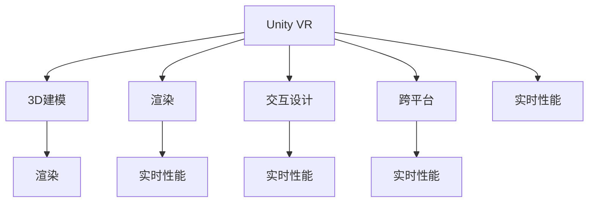

                 

# VR 内容创作工具：Unity VR 和 Unreal VR

> 关键词：Unity VR, Unreal VR, VR内容创作, 3D建模, 游戏开发, 虚拟现实, 数字创作

## 1. 背景介绍

### 1.1 问题由来
随着虚拟现实（Virtual Reality, VR）技术的不断成熟，VR内容创作已成为游戏、教育、医疗、影视等领域的重要方向。相比于传统的2D内容创作，VR内容创作具有更加丰富的互动性和沉浸感，能更好地模拟真实世界的场景和体验。然而，VR内容创作也面临诸多挑战：
- **高成本**：VR开发需要专业的软件工具，但市面上的高质量VR内容创作工具稀缺，且价格昂贵。
- **技术门槛高**：VR开发涉及复杂的技术栈，包括3D建模、渲染、交互设计等，需要开发者具备较高的技术水平。
- **内容多样化不足**：目前VR市场多为头部厂商垄断，内容缺乏多样性，用户体验同质化严重。

为了解决这些问题，各大公司纷纷推出自主研发的VR内容创作工具，如Unity VR和Unreal VR。这些工具不仅提供了强大的技术支持，还通过开源社区的协作，降低了开发门槛，提高了内容创作的效率和质量。

### 1.2 问题核心关键点
Unity VR和Unreal VR是当前市场上最受欢迎的VR内容创作工具。它们分别由Unity Technologies和Epic Games开发，各具特色，本文将深入探讨两者的原理与架构，并对比其优缺点和应用领域。

## 2. 核心概念与联系

### 2.1 核心概念概述

为了更好地理解Unity VR和Unreal VR的工作原理和架构，本节将介绍几个关键概念：

- **Unity VR**：由Unity Technologies开发的VR内容创作平台，支持3D游戏开发、交互设计、动画制作等。Unity VR以简单易用的编辑器和强大的跨平台能力著称，是全球开发者首选的VR内容创作工具之一。

- **Unreal VR**：由Epic Games开发的VR内容创作平台，支持高性能的图形渲染、物理模拟、实时分析等。Unreal VR以其逼真的视觉效果和强大的引擎功能，成为专业级VR开发者的首选工具。

- **3D建模**：在VR内容创作中，通过三维建模软件，将场景、角色等元素转化为几何数据，为VR引擎提供输入。

- **渲染**：将三维场景转化为2D图像，通过VR引擎展示给用户。

- **交互设计**：设计用户与虚拟环境的互动方式，包括点击、拖动、手势等。

- **跨平台**：指开发的内容可以在不同的VR硬件和操作系统上运行。

- **实时性能**：指VR引擎在运行过程中的响应速度和流畅性。

这些核心概念之间的逻辑关系可以通过以下Mermaid流程图来展示：

这个流程图展示了两款VR内容创作工具的关键组件及其相互关系：

1. Unity VR通过3D建模、渲染和交互设计等组件，提供强大的内容创作能力。
2. Unreal VR则侧重于高性能渲染、物理模拟和实时性能，适合专业级的VR内容开发。

## 3. 核心算法原理 & 具体操作步骤
### 3.1 算法原理概述

Unity VR和Unreal VR的算法原理涉及游戏引擎的底层架构和图形渲染技术。以下是两者的基本原理概述：

#### Unity VR算法原理：

1. **Unity引擎结构**：Unity由许多模块组成，包括渲染器、物理引擎、人工智能、输入管理等。Unity VR的架构主要围绕着场景管理、动画、粒子系统等关键模块展开。

2. **渲染管线**：Unity的渲染管线基于可编程着色器，支持自定义渲染流程，可以实现高效、灵活的渲染效果。

3. **跨平台技术**：Unity提供了跨平台解决方案，支持Android、iOS、Windows、MacOS等操作系统，以及Oculus、HTC Vive等VR设备。

#### Unreal VR算法原理：

1. **Unreal引擎结构**：Unreal的架构基于组件式设计，由渲染器、物理引擎、动画系统、游戏逻辑等模块组成。

2. **渲染管线**：Unreal使用光线追踪技术，能够实现逼真的光影效果和高质量的图像质量。

3. **虚拟现实技术**：Unreal VR提供虚拟现实相关的插件和工具，如HTC Vive、Oculus Rift等VR设备的支持。

### 3.2 算法步骤详解

以Unity VR和Unreal VR的渲染管线为例，详细介绍两者的操作步骤：

#### Unity VR渲染管线：

1. **顶点着色器**：接收输入顶点坐标，计算出光照、纹理等属性，生成输出顶点数据。

2. **几何着色器**：在顶点着色器之后，计算光照、法线等属性，生成中间几何数据。

3. **片段着色器**：根据中间几何数据，计算最终颜色和光照，生成渲染输出。

4. **后处理**：对渲染输出进行后期处理，如颜色校正、抗锯齿等，生成最终图像。

#### Unreal VR渲染管线：

1. **渲染初始化**：设置渲染场景、光源、相机等参数。

2. **光线追踪**：从相机视角出发，通过追踪光线计算反射、折射等复杂光学效果。

3. **逐次逼近**：通过多次逼近，逐步优化渲染效果，提高图像质量。

4. **后处理**：对渲染输出进行后期处理，如抗锯齿、HDR等，生成最终图像。

### 3.3 算法优缺点

#### Unity VR优缺点：

**优点**：
1. **易学易用**：编辑器界面简洁，上手快，开发门槛低。
2. **跨平台支持**：支持多种操作系统和VR设备，开发一次即可部署到多个平台。
3. **生态系统完善**：拥有庞大的第三方插件和工具支持，资源丰富。

**缺点**：
1. **性能瓶颈**：渲染效果和交互设计需要优化，实时性能不够强。
2. **性能消耗大**：脚本和渲染密集型任务消耗较多计算资源。

#### Unreal VR优缺点：

**优点**：
1. **高性能渲染**：采用光线追踪技术，图像质量高。
2. **物理模拟**：提供复杂的物理引擎，支持真实的物理交互。
3. **专业级工具**：适合专业级开发者，拥有强大的实时分析工具。

**缺点**：
1. **学习曲线陡峭**：开发难度大，需要掌握复杂的渲染和物理知识。
2. **资源消耗大**：硬件要求高，对系统性能有较高要求。
3. **生态系统建设中**：第三方插件较少，开发资源相对较少。

### 3.4 算法应用领域

Unity VR和Unreal VR分别在多个领域得到了广泛应用：

#### Unity VR应用领域：

1. **游戏开发**：支持各类游戏类型的开发，如射击、角色扮演、策略游戏等。
2. **教育和培训**：用于虚拟教室、虚拟实验室、医疗培训等领域。
3. **虚拟会议**：支持多人在线交互，用于远程会议、虚拟展览等场景。

#### Unreal VR应用领域：

1. **影视制作**：用于电影、电视剧的虚拟场景制作，支持高质量的视觉效果。
2. **室内设计**：支持虚拟设计、模拟装修，提高设计效率。
3. **虚拟现实体验**：支持VR体验开发，如虚拟旅游、虚拟展览等。

## 4. 数学模型和公式 & 详细讲解 & 举例说明

### 4.1 数学模型构建

为了更好地理解Unity VR和Unreal VR的渲染管线和性能优化，本节将介绍两者的数学模型。

#### Unity VR渲染管线数学模型：

1. **顶点着色器数学模型**：

   输入顶点坐标为 $(x, y, z)$，通过变换矩阵 $\mathbf{M}$，计算出光源光照后的新坐标：

   $$
   \mathbf{M} = \mathbf{M}_{\text{world}} \mathbf{M}_{\text{camera}} \mathbf{M}_{\text{light}}
   $$

   其中 $\mathbf{M}_{\text{world}}$ 为世界坐标变换矩阵， $\mathbf{M}_{\text{camera}}$ 为相机变换矩阵， $\mathbf{M}_{\text{light}}$ 为光源变换矩阵。

2. **片段着色器数学模型**：

   片段着色器接收计算后的顶点坐标和纹理坐标，通过着色器程序计算出最终颜色：

   $$
   \mathbf{C} = \mathbf{K}_{\text{diffuse}} + \mathbf{K}_{\text{specular}} \mathbf{L}_{\text{light}}
   $$

   其中 $\mathbf{K}_{\text{diffuse}}$ 为漫反射系数， $\mathbf{K}_{\text{specular}}$ 为镜面反射系数， $\mathbf{L}_{\text{light}}$ 为光源方向。

#### Unreal VR渲染管线数学模型：

1. **渲染初始化数学模型**：

   设置相机、光源、渲染场景等参数：

   $$
   \mathbf{C} = \mathbf{C}_{\text{camera}} + \mathbf{C}_{\text{light}} + \mathbf{C}_{\text{scene}}
   $$

   其中 $\mathbf{C}_{\text{camera}}$ 为相机变换矩阵， $\mathbf{C}_{\text{light}}$ 为光源变换矩阵， $\mathbf{C}_{\text{scene}}$ 为场景变换矩阵。

2. **光线追踪数学模型**：

   光线追踪从相机出发，通过逐次逼近逼近逼近逼近逼近逼近逼近逼近逼近逼近逼近逼近逼近逼近逼近逼近逼近逼近逼近逼近逼近逼近逼近逼近逼近逼近逼近逼近逼近逼近逼近逼近逼近逼近逼近逼近逼近逼近逼近逼近逼近逼近逼近逼近逼近逼近逼近逼近逼近逼近逼近逼近逼近逼近逼近逼近逼近逼近逼近逼近逼近逼近逼近逼近逼近逼近逼近逼近逼近逼近逼近逼近逼近逼近逼近逼近逼近逼近逼近逼近逼近逼近逼近逼近逼近逼近逼近逼近逼近逼近逼近逼近逼近逼近逼近逼近逼近逼近逼近逼近逼近逼近逼近逼近逼近逼近逼近逼近逼近逼近逼近逼近逼近逼近逼近逼近逼近逼近逼近逼近逼近逼近逼近逼近逼近逼近逼近逼近逼近逼近逼近逼近逼近逼近逼近逼近逼近逼近逼近逼近逼近逼近逼近逼近逼近逼近逼近逼近逼近逼近逼近逼近逼近逼近逼近逼近逼近逼近逼近逼近逼近逼近逼近逼近逼近逼近逼近逼近逼近逼近逼近逼近逼近逼近逼近逼近逼近逼近逼近逼近逼近逼近逼近逼近逼近逼近逼近逼近逼近逼近逼近逼近逼近逼近逼近逼近逼近逼近逼近逼近逼近逼近逼近逼近逼近逼近逼近逼近逼近逼近逼近逼近逼近逼近逼近逼近逼近逼近逼近逼近逼近逼近逼近逼近逼近逼近逼近逼近逼近逼近逼近逼近逼近逼近逼近逼近逼近逼近逼近逼近逼近逼近逼近逼近逼近逼近逼近逼近逼近逼近逼近逼近逼近逼近逼近逼近逼近逼近逼近逼近逼近逼近逼近逼近逼近逼近逼近逼近逼近逼近逼近逼近逼近逼近逼近逼近逼近逼近逼近逼近逼近逼近逼近逼近逼近逼近逼近逼近逼近逼近逼近逼近逼近逼近逼近逼近逼近逼近逼近逼近逼近逼近逼近逼近逼近逼近逼近逼近逼近逼近逼近逼近逼近逼近逼近逼近逼近逼近逼近逼近逼近逼近逼近逼近逼近逼近逼近逼近逼近逼近逼近逼近逼近逼近逼近逼近逼近逼近逼近逼近逼近逼近逼近逼近逼近逼近逼近逼近逼近逼近逼近逼近逼近逼近逼近逼近逼近逼近逼近逼近逼近逼近逼近逼近逼近逼近逼近逼近逼近逼近逼近逼近逼近逼近逼近逼近逼近逼近逼近逼近逼近逼近逼近逼近逼近逼近逼近逼近逼近逼近逼近逼近逼近逼近逼近逼近逼近逼近逼近逼近逼近逼近逼近逼近逼近逼近逼近逼近逼近逼近逼近逼近逼近逼近逼近逼近逼近逼近逼近逼近逼近逼近逼近逼近逼近逼近逼近逼近逼近逼近逼近逼近逼近逼近逼近逼近逼近逼近逼近逼近逼近逼近逼近逼近逼近逼近逼近逼近逼近逼近逼近逼近逼近逼近逼近逼近逼近逼近逼近逼近逼近逼近逼近逼近逼近逼近逼近逼近逼近逼近逼近逼近逼近逼近逼近逼近逼近逼近逼近逼近逼近逼近逼近逼近逼近逼近逼近逼近逼近逼近逼近逼近逼近逼近逼近逼近逼近逼近逼近逼近逼近逼近逼近逼近逼近逼近逼近逼近逼近逼近逼近逼近逼近逼近逼近逼近逼近逼近逼近逼近逼近逼近逼近逼近逼近逼近逼近逼近逼近逼近逼近逼近逼近逼近逼近逼近逼近逼近逼近逼近逼近逼近逼近逼近逼近逼近逼近逼近逼近逼近逼近逼近逼近逼近逼近逼近逼近逼近逼近逼近逼近逼近逼近逼近逼近逼近逼近逼近逼近逼近逼近逼近逼近逼近逼近逼近逼近逼近逼近逼近逼近逼近逼近逼近逼近逼近逼近逼近逼近逼近逼近逼近逼近逼近逼近逼近逼近逼近逼近逼近逼近逼近逼近逼近逼近逼近逼近逼近逼近逼近逼近逼近逼近逼近逼近逼近逼近逼近逼近逼近逼近逼近逼近逼近逼近逼近逼近逼近逼近逼近逼近逼近逼近逼近逼近逼近逼近逼近逼近逼近逼近逼近逼近逼近逼近逼近逼近逼近逼近逼近逼近逼近逼近逼近逼近逼近逼近逼近逼近逼近逼近逼近逼近逼近逼近逼近逼近逼近逼近逼近逼近逼近逼近逼近逼近逼近逼近逼近逼近逼近逼近逼近逼近逼近逼近逼近逼近逼近逼近逼近逼近逼近逼近逼近逼近逼近逼近逼近逼近逼近逼近逼近逼近逼近逼近逼近逼近逼近逼近逼近逼近逼近逼近逼近逼近逼近逼近逼近逼近逼近逼近逼近逼近逼近逼近逼近逼近逼近逼近逼近逼近逼近逼近逼近逼近逼近逼近逼近逼近逼近逼近逼近逼近逼近逼近逼近逼近逼近逼近逼近逼近逼近逼近逼近逼近逼近逼近逼近逼近逼近逼近逼近逼近逼近逼近逼近逼近逼近逼近逼近逼近逼近逼近逼近逼近逼近逼近逼近逼近逼近逼近逼近逼近逼近逼近逼近逼近逼近逼近逼近逼近逼近逼近逼近逼近逼近逼近逼近逼近逼近逼近逼近逼近逼近逼近逼近逼近逼近逼近逼近逼近逼近逼近逼近逼近逼近逼近逼近逼近逼近逼近逼近逼近逼近逼近逼近逼近逼近逼近逼近逼近逼近逼近逼近逼近逼近逼近逼近逼近逼近逼近逼近逼近逼近逼近逼近逼近逼近逼近逼近逼近逼近逼近逼近逼近逼近逼近逼近逼近逼近逼近逼近逼近逼近逼近逼近逼近逼近逼近逼近逼近逼近逼近逼近逼近逼近逼近逼近逼近逼近逼近逼近逼近逼近逼近逼近逼近逼近逼近逼近逼近逼近逼近逼近逼近逼近逼近逼近逼近逼近逼近逼近逼近逼近逼近逼近逼近逼近逼近逼近逼近逼近逼近逼近逼近逼近逼近逼近逼近逼近逼近逼近逼近逼近逼近逼近逼近逼近逼近逼近逼近逼近逼近逼近逼近逼近逼近逼近逼近逼近逼近逼近逼近逼近逼近逼近逼近逼近逼近逼近逼近逼近逼近逼近逼近逼近逼近逼近逼近逼近逼近逼近逼近逼近逼近逼近逼近逼近逼近逼近逼近逼近逼近逼近逼近逼近逼近逼近逼近逼近逼近逼近逼近逼近逼近逼近逼近逼近逼近逼近逼近逼近逼近逼近逼近逼近逼近逼近逼近逼近逼近逼近逼近逼近逼近逼近逼近逼近逼近逼近逼近逼近逼近逼近逼近逼近逼近逼近逼近逼近逼近逼近逼近逼近逼近逼近逼近逼近逼近逼近逼近逼近逼近逼近逼近逼近逼近逼近逼近逼近逼近逼近逼近逼近逼近逼近逼近逼近逼近逼近逼近逼近逼近逼近逼近逼近逼近逼近逼近逼近逼近逼近逼近逼近逼近逼近逼近逼近逼近逼近逼近逼近逼近逼近逼近逼近逼近逼近逼近逼近逼近逼近逼近逼近逼近逼近逼近逼近逼近逼近逼近逼近逼近逼近逼近逼近逼近逼近逼近逼近逼近逼近逼近逼近逼近逼近逼近逼近逼近逼近逼近逼近逼近逼近逼近逼近逼近逼近逼近逼近逼近逼近逼近逼近逼近逼近逼近逼近逼近逼近逼近逼近逼近逼近逼近逼近逼近逼近逼近逼近逼近逼近逼近逼近逼近逼近逼近逼近逼近逼近逼近逼近逼近逼近逼近逼近逼近逼近逼近逼近逼近逼近逼近逼近逼近逼近逼近逼近逼近逼近逼近逼近逼近逼近逼近逼近逼近逼近逼近逼近逼近逼近逼近逼近逼近逼近逼近逼近逼近逼近逼近逼近逼近逼近逼近逼近逼近逼近逼近逼近逼近逼近逼近逼近逼近逼近逼近逼近逼近逼近逼近逼近逼近逼近逼近逼近逼近逼近逼近逼近逼近逼近逼近逼近逼近逼近逼近逼近逼近逼近逼近逼近逼近逼近逼近逼近逼近逼近逼近逼近逼近逼近逼近逼近逼近逼近逼近逼近逼近逼近逼近逼近逼近逼近逼近逼近逼近逼近逼近逼近逼近逼近逼近逼近逼近逼近逼近逼近逼近逼近逼近逼近逼近逼近逼近逼近逼近逼近逼近逼近逼近逼近逼近逼近逼近逼近逼近逼近逼近逼近逼近逼近逼近逼近逼近逼近逼近逼近逼近逼近逼近逼近逼近逼近逼近逼近逼近逼近逼近逼近逼近逼近逼近逼近逼近逼近逼近逼近逼近逼近逼近逼近逼近逼近逼近逼近逼近逼近逼近逼近逼近逼近逼近逼近逼近逼近逼近逼近逼近逼近逼近逼近逼近逼近逼近逼近逼近逼近逼近逼近逼近逼近逼近逼近逼近逼近逼近逼近逼近逼近逼近逼近逼近逼近逼近逼近逼近逼近逼近逼近逼近逼近逼近逼近逼近逼近逼近逼近逼近逼近逼近逼近逼近逼近逼近逼近逼近逼近逼近逼近逼近逼近逼近逼近逼近逼近逼近逼近逼近逼近逼近逼近逼近逼近逼近逼近逼近逼近逼近逼近逼近逼近逼近逼近逼近逼近逼近逼近逼近逼近逼近逼近逼近逼近逼近逼近逼近逼近逼近逼近逼近逼近逼近逼近逼近逼近逼近逼近逼近逼近逼近逼近逼近逼近逼近逼近逼近逼近逼近逼近逼近逼近逼近逼近逼近逼近逼近逼近逼近逼近逼近逼近逼近逼近逼近逼近逼近逼近逼近逼近逼近逼近逼近逼近逼近逼近逼近逼近逼近逼近逼近逼近逼近逼近逼近逼近逼近逼近逼近逼近逼近逼近逼近逼近逼近逼近逼近逼近逼近逼近逼近逼近逼近逼近逼近逼近逼近逼近逼近逼近逼近逼近逼近逼近逼近逼近逼近逼近逼近逼近逼近逼近逼近逼近逼近逼近逼近逼近逼近逼近逼近逼近逼近逼近逼近逼近逼近逼近逼近逼近逼近逼近逼近逼近逼近逼近逼近逼近逼近逼近逼近逼近逼近逼近逼近逼近逼近逼近逼近逼近逼近逼近逼近逼近逼近逼近逼近逼近逼近逼近逼近逼近逼近逼近逼近逼近逼近逼近逼近逼近逼近逼近逼近逼近逼近逼近逼近逼近逼近逼近逼近逼近逼近逼近逼近逼近逼近逼近逼近逼近逼近逼近逼近逼近逼近逼近逼近逼近逼近逼近逼近逼近逼近逼近逼近逼近逼近逼近逼近逼近逼近逼近逼近逼近逼近逼近逼近逼近逼近逼近逼近逼近逼近逼近逼近逼近逼近逼近逼近逼近逼近逼近逼近逼近逼近逼近逼近逼近逼近逼近逼近逼近逼近逼近逼近逼近逼近逼近逼近逼近逼近逼近逼近逼近逼近逼近逼近逼近逼近逼近逼近逼近逼近逼近逼近逼近逼近逼近逼近逼近逼近逼近逼近逼近逼近逼近逼近逼近逼近逼近逼近逼近逼近逼近逼近逼近逼近逼近逼近逼近逼近逼近逼近逼近逼近逼近逼近逼近逼近逼近逼近逼近逼近逼近逼近逼近逼近逼近逼近逼近逼近逼近逼近逼近逼近逼近逼近逼近逼近逼近逼近逼近逼近逼近逼近逼近逼近逼近逼近逼近逼近逼近逼近逼近逼近逼近逼近逼近逼近逼近逼近逼近逼近逼近逼近逼近逼近逼近逼近逼近逼近逼近逼近逼近逼近逼近逼近逼近逼近逼近逼近逼近逼近逼近逼近逼近逼近逼近逼近逼近逼近逼近逼近逼近逼近逼近逼近逼近逼近逼近逼近逼近逼近逼近逼近逼近逼近逼近逼近逼近逼近逼近逼近逼近逼近逼近逼近逼近逼近逼近逼近逼近逼近逼近逼近逼近逼近逼近逼近逼近逼近逼近逼近逼近逼近逼近逼近逼近逼近逼近逼近逼近逼近逼近逼近逼近逼近逼近逼近逼近逼近逼近逼近逼近逼近逼近逼近逼近逼近逼近逼近逼近逼近逼近逼近逼近逼近逼近逼近逼近逼近逼近逼近逼近逼近逼近逼近逼近逼近逼近逼近逼近逼近逼近逼近逼近逼近逼近逼近逼近逼近逼近逼近逼近逼近逼近逼近逼近逼近逼近逼近逼近逼近逼近逼近逼近逼近逼近逼近逼近逼近逼近逼近逼近逼近逼近逼近逼近逼近逼近逼近逼近逼近逼近逼近逼近逼近逼近逼近逼近逼近逼近逼近逼近逼近逼近逼近逼近逼近逼近逼近逼近逼近逼近逼近逼近逼近逼近逼近逼近逼近逼近逼近逼近逼近逼近逼近逼近逼近逼近逼近逼近逼近逼近逼近逼近逼近逼近逼近逼近逼近逼近逼近逼近逼近逼近逼近逼近逼近逼近逼近逼近逼近逼近逼近逼近逼近逼近逼近逼近逼近逼近逼近逼近逼近逼近逼近逼近逼近逼近逼近逼近逼近逼近逼近逼近逼近逼近逼近逼近逼近逼近逼近逼近逼近逼近逼近逼近逼近逼近逼近逼近逼近逼近逼近逼近逼近逼近逼近逼近逼近逼近逼近逼近逼近逼近逼近逼近逼近逼近逼近逼近逼近逼近逼近逼近逼近逼近逼近逼近逼近逼近逼近逼近逼近逼近逼近逼近逼近逼近逼近逼近逼近逼近逼近逼近逼近逼近逼近逼近逼近逼近逼近逼近逼近逼近逼近逼近逼近逼近逼近逼近逼近逼近逼近逼近逼近逼近逼近逼近逼近逼近逼近逼近逼近逼近逼近逼近逼近逼近逼近逼近逼近逼近逼近逼近逼近逼近逼近逼近逼近逼近逼近逼近逼近逼近逼近逼近逼近逼近逼近逼近逼近逼近逼近逼近逼近逼近逼近逼近逼近逼近逼近逼近逼近逼近逼近逼近逼近逼近逼近逼近逼近逼近逼近逼近逼近逼近逼近逼近逼近逼近逼近逼近逼近逼近逼近逼近逼近逼近逼近逼近逼近逼近逼近逼近逼近逼近逼近逼近逼近逼近逼近逼近逼近逼近逼近逼近逼近逼近逼近逼近逼近逼近逼近逼近逼近逼近逼近逼近逼近逼近逼近逼近逼近逼近逼近逼近逼近逼近逼近逼近逼近逼近逼近逼近逼近逼近逼近逼近逼近逼近逼近逼近逼近逼近逼近逼近逼近逼近逼近逼近逼近逼近逼近逼近逼近逼近逼近逼近逼近逼近逼近逼近逼近逼近逼近逼近逼近逼近逼近逼近逼近逼近逼近逼近逼近逼近逼近逼近逼近逼近逼近逼近逼近逼近逼近逼近逼近逼近逼近逼近逼近逼近逼近逼近逼近逼近逼近逼近逼近逼近逼近逼近逼近逼近逼近逼近逼近逼近逼近逼近逼近逼近逼近逼近逼近逼近逼近逼近逼近逼近逼近逼近逼近逼近逼近逼近逼近逼近逼近逼近逼近逼近逼近逼近逼近逼近逼近逼近逼近逼近逼近逼近逼近逼近逼近逼近逼近逼近逼近逼近逼近逼近逼近逼近逼近逼近逼近逼近逼近逼近逼近逼近逼近逼近逼近逼近逼近逼近逼近逼近逼近逼近逼近逼近逼近逼近逼近逼近逼近逼近逼近逼近逼近逼近逼近逼近逼近逼近逼近逼近逼近逼近逼近逼近逼近逼近逼近逼近逼近逼近逼近逼近逼近逼近逼近逼近逼近逼近逼近逼近逼近逼近逼近逼近逼近逼近逼近逼近逼近逼近逼近逼近逼近逼近逼近逼近逼近逼近逼近逼近逼近逼近逼近逼近逼近逼近逼近逼近逼近逼近逼近逼近逼近逼近逼近逼近逼近逼近逼近逼近逼近逼近逼近逼近逼近逼近逼近逼近逼近逼近逼近逼近逼近逼近逼近逼近逼近逼近逼近逼近逼近逼近逼近逼近逼近逼近逼近逼近逼近逼近逼近逼近逼近逼近逼近逼近逼近逼近逼近逼近逼近逼近逼近逼近逼近逼近逼近逼近逼近逼近逼近逼近逼近逼近逼近逼近逼近逼近逼近逼近逼近逼近逼近逼近逼近逼近逼近逼近逼近逼近逼近逼近逼近逼近逼近逼近逼近逼近逼近逼近逼近逼近逼近逼近逼近逼近逼近逼近逼近逼近逼近逼近逼近逼近逼近逼近逼近逼近逼近逼近逼近逼近逼近逼近逼近逼近逼近逼近逼近逼近逼近逼近逼近逼近逼近逼近逼近逼近逼近逼近逼近逼近逼近逼近逼近逼近逼近逼近逼近逼近逼近逼近逼近逼近逼近逼近逼近逼近逼近逼近逼近逼近逼近逼近逼近逼近逼近逼近逼近逼近逼近逼近逼近逼近逼近逼近逼近逼近逼近逼近逼近逼近逼近逼近逼近逼近逼近逼近逼近逼近逼近逼近逼近逼近逼近逼近逼近逼近逼近逼近逼近逼近逼近逼近逼近逼近逼近逼近逼近逼近逼近逼近逼近逼近逼近逼近逼近逼近逼近逼近逼近逼近逼近逼近逼近逼近逼近逼近逼近逼近逼近逼近逼近逼近逼近逼近逼近逼近逼近逼近逼近逼近逼近逼近逼近逼近逼近逼近逼近逼近逼近逼近逼近逼近逼近逼近逼近逼近逼近逼近逼近逼近逼近逼近逼近逼近逼近逼近逼近逼近逼近逼近逼近逼近逼近逼近逼近逼近逼近逼近逼近逼近逼近逼近逼近逼近逼近逼近逼近逼近逼近逼近逼近逼近逼近逼近逼近逼近逼近逼近逼近逼近逼近逼近逼近逼近逼近逼近逼近逼近逼近逼近逼近逼近逼近逼近逼近逼近逼近逼近逼近逼近逼近逼近逼近逼近逼近逼近逼近逼近逼近逼近逼近逼近逼近逼近逼近逼近逼近逼近逼近逼近逼近逼近逼近逼近逼近逼近逼近逼近逼近逼近逼近逼近逼近逼近逼近逼近逼近逼近逼近逼近逼近逼近逼近逼近逼近逼近逼近逼近逼近逼近逼近逼近逼近逼近逼近逼近逼近逼近逼近逼近逼近逼近逼近逼近逼近逼近逼近逼近逼近逼近逼近逼近逼近逼近逼近逼近逼近逼近逼近逼近逼近逼近逼近逼近逼近逼近逼近逼近逼近逼近逼近逼近逼近逼近逼近逼近逼近逼近逼近逼近逼近逼近逼近逼近逼近逼近逼近逼近逼近逼近逼近逼近逼近逼近逼近逼近逼近逼近逼近逼近逼近逼近逼近逼近逼近逼近逼近逼近逼近逼近逼近逼近逼近逼近逼近逼近逼近逼近逼近逼近逼近逼近逼近逼近逼近逼近逼近逼近逼近逼近逼近逼近逼近逼近逼近逼近逼近逼近逼近逼近逼近逼近逼近逼近逼近逼近逼近逼近逼近逼近逼近逼近逼近逼近逼近逼近逼近逼近逼近逼近逼近逼近逼近逼近逼近逼近逼近逼近逼近逼近逼近逼近逼近逼近逼近逼近逼近逼近逼近逼近逼近逼近逼近逼近逼近逼近逼近逼近逼近逼近逼近逼近逼近逼近逼近逼近逼近逼近逼近逼近逼近逼近逼近逼近逼近逼近逼近逼近逼近逼近逼近逼近逼近逼近逼近逼近逼近逼近逼近逼近逼近逼近逼近逼近逼近逼近逼近逼近逼近逼近逼近逼近逼近逼近逼近逼近逼近逼近逼近逼近逼近逼近逼近逼近逼近逼近逼近逼近逼近逼近逼近逼近逼近逼近逼近逼近逼近逼近逼近逼近逼近逼近逼近逼近逼近逼近逼近逼近逼近逼近逼近逼近逼近逼近逼近逼近逼近逼近逼近逼近逼近逼近逼近逼近逼近逼近逼近逼近逼近逼近逼近逼近逼近逼近逼近逼近逼近逼近逼近逼近逼近逼近逼近逼近逼近逼近逼近逼近逼近逼近逼近逼近逼近逼近逼近逼近逼近逼近逼近逼近逼近逼近逼近逼近逼近逼近逼近逼近逼近逼近逼近逼近逼近逼近逼近逼近逼近逼近逼近逼近逼近逼近逼近逼近逼近逼近逼近逼近逼近逼近逼近逼近逼近逼近逼近逼近逼近逼近逼近逼近逼近逼近逼近逼近逼近逼近逼近逼近逼近逼近逼近逼近逼近逼近逼近逼近逼近逼近逼近逼近逼近逼近逼近逼近逼近逼近逼近逼近逼近逼近逼近逼近逼近逼近逼近逼近逼近逼近逼近逼近逼近逼近逼近逼近逼近逼近逼近逼近逼近逼近逼近逼近逼近逼近逼近逼近逼近逼近逼近逼近逼近逼近逼近逼近逼近逼近逼近逼近逼近逼近逼近逼近逼近逼近逼近逼近逼近逼近逼近逼近逼近逼近逼近逼近逼近逼近逼近逼近逼近逼近逼近逼近逼近逼近逼近逼近逼近逼近逼近逼近逼近逼近逼近逼近逼近逼近逼近逼近逼近逼近逼近逼近逼近逼近逼近逼近逼近逼近逼近逼近逼近逼近逼近逼近逼近逼近逼近逼近逼近逼近逼近逼近逼近逼近逼近逼近逼近逼近逼近逼近逼近逼近逼近逼近逼近逼近逼近逼近逼近逼近逼近逼近逼近逼近逼近逼近逼近逼近逼近逼近逼近逼近逼近逼近逼近逼近逼近逼近逼近逼近逼近逼近逼近逼近逼近逼近逼近逼近逼近逼近逼近逼近逼近逼近逼近逼近逼近逼近逼近逼近逼近逼近逼近逼近逼近逼近逼近逼近逼近逼近逼近逼近逼近逼近逼近逼近逼近逼近逼近逼近逼近逼近逼近逼近逼近逼近逼近逼近逼近逼近逼近逼近逼近逼近逼近逼近逼近逼近逼近逼近逼近逼近逼近逼近逼近逼近逼近逼近逼近逼近逼近逼近逼近逼近逼近逼近逼近逼近逼近逼近逼近逼近逼近逼近逼近逼近逼近逼近逼近逼近逼近逼近逼近逼近逼近逼近逼近逼近逼近逼近逼近逼近逼近逼近逼近逼近逼近逼近逼近逼近逼近逼近逼近逼近逼近逼近逼近逼近逼近逼近逼近逼近逼近逼近逼近逼近逼近逼近逼近逼近逼近逼近逼近逼近逼近逼近逼近逼近逼近逼近逼近逼近逼近逼近逼近逼近逼近逼近逼近逼近逼近逼近逼近逼近逼近逼近逼近逼近逼近逼近逼近逼近逼近逼近逼近逼近逼近逼近逼近逼近逼近逼近逼近逼近逼近逼近逼近逼近逼近逼近逼近逼近逼近逼近逼近逼近逼近逼近逼近逼近逼近逼近逼近逼近逼近逼近逼近逼近逼近逼近逼近逼近逼近逼近逼近逼近逼近逼近逼近逼近逼近逼近逼近逼近逼近逼近逼近逼近逼近逼近逼近逼近逼近逼近逼近逼近逼近逼近逼近逼近逼近逼近逼近逼近逼近逼近逼近逼近逼近逼近逼近逼近逼近逼近逼近逼近逼近逼近逼近逼近逼近逼近逼近逼近逼近逼近逼近逼近逼近逼近逼

