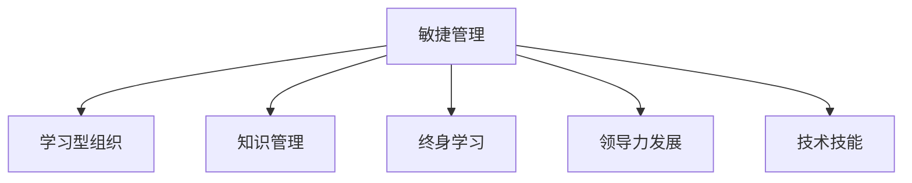

                 

# VUCA时代管理者的学习策略

> 关键词：VUCA, 敏捷管理, 学习型组织, 知识管理, 终身学习, 领导力发展, 技术技能

## 1. 背景介绍

在当前快速变化的市场环境中，企业面临的不确定性因素（Volatility, Uncertainty, Complexity, Ambiguity）越来越多。VUCA（Volatile, Unpredictable, Complex, Ambiguous）概念由通用电气前CEO杰克·韦尔奇提出，已经成为描述现代企业经营环境的普遍说法。在这样的环境下，传统的管理模式和技能已经难以适应新形势，管理者需要不断学习和适应新环境。

### 1.1 问题由来

在VUCA时代，市场和技术的快速变化要求管理者具备更快的反应速度和更强的适应能力。传统的管理培训和发展方式已经无法满足现代企业的需求。例如，2015年发布的《全球管理教育30年报告》显示，全球管理人员的平均从业年限为9.4年，而企业能稳定增长的平均寿命仅为8-12年，这对管理人员提出了新的挑战。

### 1.2 问题核心关键点

VUCA时代对管理者的核心要求包括以下几点：

- **敏捷反应能力**：管理者需要快速适应市场变化，迅速作出决策。
- **多元技能**：除传统管理技能外，还需要具备技术、创新、跨文化沟通等多元技能。
- **持续学习**：VUCA环境的变化无常要求管理者持续更新知识，保持学习状态。
- **领导力发展**：在复杂多变的环境中，管理者需要具备更强的领导力，引领团队走向成功。

## 2. 核心概念与联系

### 2.1 核心概念概述

为更好地理解如何在VUCA时代进行管理者学习策略的制定，本节将介绍几个关键概念：

- **敏捷管理(Agile Management)**：以迭代和增量方式进行项目管理和产品开发的敏捷方法论，强调快速反应和灵活调整。
- **学习型组织(Learning Organization)**：通过持续学习和知识共享，不断提升组织能力的组织形态。
- **知识管理(Knowledge Management)**：对组织内知识进行收集、整合、传播和应用的过程，促进组织创新和学习。
- **终身学习(Lifelong Learning)**：在职业生涯的各个阶段不断学习和提升个人技能的理念。
- **领导力发展(Leadership Development)**：通过培训、实践、反思等方式提升管理者的领导能力。
- **技术技能(Technical Skills)**：除了软技能，管理者还应具备一定的技术技能，理解最新的技术趋势和应用。

这些概念之间的逻辑关系可以通过以下Mermaid流程图来展示：



这个流程图展示敏捷管理对其他概念的影响：

- 敏捷管理通过迭代和增量开发，推动组织持续学习和知识管理。
- 敏捷管理中的快速反馈和调整机制，与终身学习的持续更新相得益彰。
- 敏捷管理中的跨职能团队协作，促进了领导力发展和技术技能的提升。

这些概念共同构成了VUCA时代管理者的学习策略框架，使其能够在复杂多变的环境中保持高效和灵活。

## 3. 核心算法原理 & 具体操作步骤
### 3.1 算法原理概述

VUCA时代管理者的学习策略，本质上是一个敏捷的、以人为中心的学习过程。其核心思想是：通过敏捷管理方法，使学习成为组织的核心驱动力，促进知识共享和应用，提升领导力，同时确保管理者具备必要的技术技能，以适应快速变化的市场环境。

形式化地，假设管理者在学习过程中，需要不断评估自己的能力状态 $C(t)$，其中 $t$ 表示时间。学习过程的目标是找到最优的能力状态 $C^*$，使得在特定的时间 $T$ 内，管理者的能力状态最大化：

$$
C^* = \mathop{\arg\max}_{C(t)} \int_0^T \text{Effectiveness}(C(t)) dt
$$

其中 $\text{Effectiveness}(C(t))$ 表示管理者的能力状态对组织有效性的影响，通常由多个指标组成，如创新能力、决策速度、团队合作等。

### 3.2 算法步骤详解

基于敏捷管理的VUCA时代管理者学习策略，一般包括以下几个关键步骤：

**Step 1: 确定学习目标**
- 根据组织的战略目标和市场环境，明确管理者需要具备的关键能力。
- 设计学习路径，确保学习目标与组织需求对齐。

**Step 2: 构建敏捷学习循环**
- 采用敏捷管理方法，将学习过程分解为多个短周期的迭代，每个周期包含计划、执行、反馈和调整四个阶段。
- 使用Scrum、Kanban等敏捷框架，进行任务管理和进度跟踪。

**Step 3: 制定个性化学习计划**
- 根据管理者的个体需求和能力水平，设计个性化的学习计划。
- 使用学习管理系统(LMS)记录和管理学习进程。

**Step 4: 应用知识和工作结合**
- 将学习到的知识立即应用于实际工作中，实现学以致用。
- 通过项目和任务来实践新知识，增强记忆和理解。

**Step 5: 持续反馈和改进**
- 定期收集和分析反馈，评估学习效果和实际工作表现。
- 根据反馈结果调整学习计划和实施方式，持续改进学习策略。

### 3.3 算法优缺点

敏捷学习的优点包括：
1. 灵活性高：适应快速变化的环境，快速调整学习策略。
2. 持续改进：通过反馈循环，不断提升学习效果。
3. 增强参与度：采用迭代和反馈机制，增强管理者的参与感和主人翁意识。

缺点则包括：
1. 时间投入：频繁的迭代和调整需要大量时间和精力。
2. 管理复杂度：敏捷框架的引入增加了管理复杂度，需要管理者具备更高的组织能力。
3. 资源需求：敏捷学习需要投入更多的资源，如培训、工具和技术支持等。

### 3.4 算法应用领域

敏捷学习策略在多个领域中都得到了广泛应用，例如：

- 企业变革管理：通过敏捷学习，快速适应企业转型和组织变革。
- 人才发展与晋升：帮助员工快速成长，提升专业技能和领导力。
- 项目管理和执行：通过敏捷学习方法，提高项目交付速度和质量。
- 知识管理与创新：促进知识传播和应用，提升组织创新能力。

## 4. 数学模型和公式 & 详细讲解
### 4.1 数学模型构建

为了更精确地分析VUCA时代管理者的学习效果，我们构建了一个简单化的数学模型。假设学习目标为 $T$ 个关键能力指标 $k_i$，每个指标的当前能力状态为 $c_i(t)$，目标能力状态为 $c_i^*$。学习过程的周期为 $T$，每个周期内学习速率 $r_i(t)$ 随时间变化。则管理者在 $T$ 个周期后的总体能力状态 $C(T)$ 可表示为：

$$
C(T) = \sum_{i=1}^T \int_{t_0}^{T} r_i(t) c_i(t) dt
$$

其中 $r_i(t)$ 为第 $i$ 个能力指标的学习速率，可由多种因素决定，如培训强度、实际应用频率等。

### 4.2 公式推导过程

为了方便推导，我们简化模型，假设学习速率 $r_i(t)$ 为常数，则能力状态的时间积分变为面积积分，简化公式为：

$$
C(T) = \sum_{i=1}^T r_i c_i \Delta t
$$

其中 $\Delta t$ 为每个周期的时长。

在实际应用中，我们需要考虑多种因素对学习速率的影响，如学习强度、应用频率、反馈机制等。公式进一步扩展为：

$$
C(T) = \sum_{i=1}^T r_i(t) c_i(t) dt = \sum_{i=1}^T \frac{c_i^* - c_i(t)}{\Delta t} \Delta t
$$

该公式表明，通过合理调整学习速率和周期时长，可以最大化管理者的学习效果。

### 4.3 案例分析与讲解

考虑一个项目经理，需要提升其在敏捷管理、团队领导和项目执行三个关键能力。根据当前能力状态和目标能力状态，计算每个能力指标的学习速率，并将结果代入公式，可以求得整个学习周期后的总体能力提升情况。

假设项目经理目前敏捷管理能力为 $c_1 = 0.5$，目标为 $c_1^* = 1.0$，学习速率为 $r_1 = 0.1$，周期时长 $\Delta t = 1$ 周，则每个周期内的学习速率为：

$$
r_1(t) = \frac{c_1^* - c_1(t)}{\Delta t} = \frac{1.0 - 0.5}{1} = 0.5
$$

将 $r_1$ 和 $c_1$ 代入公式，得到：

$$
C(T) = 0.5 \times 0.5 \times T = 0.25T
$$

即在 $T$ 个周期后，项目经理的敏捷管理能力提升了 $0.25T$，达到了 $0.5 + 0.25T$ 的水平。类似地，可以计算其他关键能力指标的学习效果。

## 5. 项目实践：代码实例和详细解释说明
### 5.1 开发环境搭建

在进行敏捷学习管理系统的开发前，我们需要准备好开发环境。以下是使用Python进行Flask开发的环境配置流程：

1. 安装Anaconda：从官网下载并安装Anaconda，用于创建独立的Python环境。

2. 创建并激活虚拟环境：
```bash
conda create -n agile-env python=3.8 
conda activate agile-env
```

3. 安装Flask：根据Flask官网文档，使用以下命令进行安装。
```bash
pip install flask
```

4. 安装Flask-RESTful：用于构建RESTful API接口，方便与其他系统集成。
```bash
pip install flask-restful
```

5. 安装SQLAlchemy：用于数据库交互，Flask默认支持，无需额外安装。

6. 安装Flask-Login和Flask-WTF：用于用户认证和表单处理，便于构建定制化的学习管理系统。
```bash
pip install flask-login flask-wtf
```

完成上述步骤后，即可在`agile-env`环境中开始开发。

### 5.2 源代码详细实现

下面以一个简化的学习管理系统为例，给出使用Flask构建敏捷学习循环的PyTorch代码实现。

首先，定义学习管理系统所需的模型：

```python
from flask import Flask, render_template, redirect, url_for, request
from flask_login import LoginManager, UserMixin, login_user, logout_user, login_required, current_user
from flask_sqlalchemy import SQLAlchemy
from flask_wtf import FlaskForm
from wtforms import StringField, PasswordField, SubmitField, IntegerField
from wtforms.validators import DataRequired

app = Flask(__name__)
app.config['SECRET_KEY'] = 'my_secret_key'
app.config['SQLALCHEMY_DATABASE_URI'] = 'sqlite:///app.db'
db = SQLAlchemy(app)
login_manager = LoginManager()
login_manager.init_app(app)

class User(db.Model, UserMixin):
    id = db.Column(db.Integer, primary_key=True)
    username = db.Column(db.String(50), unique=True, nullable=False)
    password_hash = db.Column(db.String(60), nullable=False)
    email = db.Column(db.String(120), unique=True, nullable=False)
    
    def __repr__(self):
        return f'<User {self.username}>'

class UserForm(FlaskForm):
    username = StringField('Username', validators=[DataRequired()])
    password = PasswordField('Password', validators=[DataRequired()])
    email = StringField('Email', validators=[DataRequired()])
    submit = SubmitField('Submit')
    
@login_manager.user_loader
def load_user(user_id):
    return User.query.get(int(user_id))

@app.route('/')
@login_required
def index():
    return render_template('index.html')
    
@app.route('/login', methods=['GET', 'POST'])
def login():
    form = UserForm()
    if form.validate_on_submit():
        user = User.query.filter_by(username=form.username.data).first()
        if user:
            if check_password_hash(user.password_hash, form.password.data):
                login_user(user)
                return redirect(url_for('index'))
    return render_template('login.html', title='Login', form=form)
    
@app.route('/logout')
@login_required
def logout():
    logout_user()
    return redirect(url_for('index'))

@app.route('/settings', methods=['GET', 'POST'])
@login_required
def settings():
    form = UserForm()
    if form.validate_on_submit():
        current_user.username = form.username.data
        current_user.password_hash = generate_password_hash(form.password.data)
        current_user.email = form.email.data
        db.session.commit()
        return redirect(url_for('index'))
    return render_template('settings.html', title='Settings', form=form)
    
@app.route('/profile', methods=['GET', 'POST'])
@login_required
def profile():
    return render_template('profile.html', title='Profile')

@app.route('/profile/update', methods=['GET', 'POST'])
@login_required
def profile_update():
    return render_template('profile_update.html', title='Profile Update')

@app.route('/learn', methods=['GET', 'POST'])
@login_required
def learn():
    return render_template('learn.html', title='Learn')

@app.route('/learn/update', methods=['GET', 'POST'])
@login_required
def learn_update():
    return render_template('learn_update.html', title='Learn Update')
```

然后，定义敏捷学习循环的逻辑：

```python
class LearningCycle(db.Model):
    id = db.Column(db.Integer, primary_key=True)
    user_id = db.Column(db.Integer, db.ForeignKey('user.id'), nullable=False)
    cycle_name = db.Column(db.String(50), nullable=False)
    start_date = db.Column(db.DateTime, nullable=False)
    end_date = db.Column(db.DateTime, nullable=False)
    status = db.Column(db.String(20), nullable=False)
    
    def __repr__(self):
        return f'<LearningCycle {self.cycle_name}>'

class LearningCycleForm(FlaskForm):
    cycle_name = StringField('Cycle Name', validators=[DataRequired()])
    start_date = DateTimeField('Start Date', validators=[DataRequired()])
    end_date = DateTimeField('End Date', validators=[DataRequired()])
    status = StringField('Status', validators=[DataRequired()])
    submit = SubmitField('Submit')
    
@app.route('/learning_cycles', methods=['GET', 'POST'])
@login_required
def learning_cycles():
    form = LearningCycleForm()
    if form.validate_on_submit():
        cycle = LearningCycle(user_id=current_user.id, cycle_name=form.cycle_name.data, start_date=form.start_date.data, end_date=form.end_date.data, status=form.status.data)
        db.session.add(cycle)
        db.session.commit()
        return redirect(url_for('index'))
    learning_cycles = LearningCycle.query.filter_by(user_id=current_user.id).all()
    return render_template('learning_cycles.html', title='Learning Cycles', learning_cycles=learning_cycles)
```

最后，定义学习计划和任务管理的逻辑：

```python
class LearningPlan(db.Model):
    id = db.Column(db.Integer, primary_key=True)
    cycle_id = db.Column(db.Integer, db.ForeignKey('learning_cycles.id'), nullable=False)
    plan_name = db.Column(db.String(50), nullable=False)
    start_date = db.Column(db.DateTime, nullable=False)
    end_date = db.Column(db.DateTime, nullable=False)
    status = db.Column(db.String(20), nullable=False)
    
    def __repr__(self):
        return f'<LearningPlan {self.plan_name}>'

class LearningPlanForm(FlaskForm):
    plan_name = StringField('Plan Name', validators=[DataRequired()])
    start_date = DateTimeField('Start Date', validators=[DataRequired()])
    end_date = DateTimeField('End Date', validators=[DataRequired()])
    status = StringField('Status', validators=[DataRequired()])
    submit = SubmitField('Submit')
    
class Task(db.Model):
    id = db.Column(db.Integer, primary_key=True)
    plan_id = db.Column(db.Integer, db.ForeignKey('learning_plans.id'), nullable=False)
    task_name = db.Column(db.String(50), nullable=False)
    description = db.Column(db.Text, nullable=False)
    due_date = db.Column(db.DateTime, nullable=False)
    status = db.Column(db.String(20), nullable=False)
    
    def __repr__(self):
        return f'<Task {self.task_name}>'

class TaskForm(FlaskForm):
    task_name = StringField('Task Name', validators=[DataRequired()])
    description = TextAreaField('Description', validators=[DataRequired()])
    due_date = DateTimeField('Due Date', validators=[DataRequired()])
    status = StringField('Status', validators=[DataRequired()])
    submit = SubmitField('Submit')
    
@app.route('/tasks', methods=['GET', 'POST'])
@login_required
def tasks():
    learning_plan_id = request.args.get('plan_id')
    if learning_plan_id:
        plan = LearningPlan.query.get(learning_plan_id)
        if plan:
            form = TaskForm()
            if form.validate_on_submit():
                task = Task(plan_id=plan.id, task_name=form.task_name.data, description=form.description.data, due_date=form.due_date.data, status=form.status.data)
                db.session.add(task)
                db.session.commit()
                plan.status = 'In Progress'
                db.session.commit()
                return redirect(url_for('tasks', plan_id=plan.id))
    learning_plan_id = request.args.get('plan_id')
    if learning_plan_id:
        plan = LearningPlan.query.get(learning_plan_id)
        if plan:
            tasks = Task.query.filter_by(plan_id=plan.id).all()
            return render_template('tasks.html', title='Tasks', tasks=tasks, plan=plan)
    return redirect(url_for('learning_cycles'))

@app.route('/task/update', methods=['GET', 'POST'])
@login_required
def task_update():
    task_id = request.args.get('id')
    if task_id:
        task = Task.query.get(int(task_id))
        if task:
            form = TaskForm()
            if form.validate_on_submit():
                task.task_name = form.task_name.data
                task.description = form.description.data
                task.due_date = form.due_date.data
                task.status = form.status.data
                db.session.commit()
                return redirect(url_for('tasks', plan_id=task.plan_id))
    return redirect(url_for('tasks'))
```

### 5.3 代码解读与分析

让我们再详细解读一下关键代码的实现细节：

**User类**：
- 定义了用户的基本信息，包括用户名、密码、邮箱等。

**UserForm类**：
- 用于用户登录、注册和更新信息的界面表单。

**LearningCycle类**：
- 定义了敏捷学习循环的基本信息，包括循环名称、开始和结束时间、状态等。

**LearningCycleForm类**：
- 用于创建和管理学习循环的界面表单。

**LearningPlan类**：
- 定义了学习计划的基本信息，包括计划名称、开始和结束时间、状态等。

**LearningPlanForm类**：
- 用于创建和管理学习计划的界面表单。

**Task类**：
- 定义了学习任务的基本信息，包括任务名称、描述、截止日期、状态等。

**TaskForm类**：
- 用于创建和管理学习任务的界面表单。

**login_manager.user_loader**：
- 定义了用户认证的回调函数，用于在用户登录时自动加载用户对象。

**app.route装饰器**：
- 定义了各路由的URL和处理函数，包括首页、登录、设置、用户资料、学习循环、学习计划、学习任务等。

**render_template和redirect函数**：
- 用于渲染模板和跳转到其他页面。

在实际开发中，我们可以进一步扩展和优化这些功能，如增加用户权限管理、支持任务依赖关系、实现学习进度分析等，以构建更加完整的敏捷学习管理系统。

## 6. 实际应用场景
### 6.1 敏捷团队管理

敏捷学习管理系统在敏捷团队管理中具有重要应用。敏捷方法论强调快速响应和持续改进，敏捷学习管理系统通过敏捷学习循环，帮助团队不断适应变化，提升协作效率和创新能力。

在敏捷学习管理系统中，团队成员可以在一个学习循环内共同学习新技能，分享学习心得。通过设置明确的学习计划和任务，团队成员可以协同完成任务，实现知识共享和应用。这种学习方式不仅提升了个体的能力，也增强了团队的凝聚力和战斗力。

### 6.2 企业内部培训

敏捷学习管理系统在企业内部培训中也得到了广泛应用。传统的企业培训往往以单向灌输为主，缺乏互动和反馈。而敏捷学习管理系统通过个性化的学习路径和持续反馈机制，能够更好地满足员工的学习需求，提高培训效果。

在敏捷学习管理系统中，企业可以根据员工的角色和职责，设计个性化的学习计划，涵盖新员工入职培训、老员工技能提升、领导力培训等多个方面。通过设置具体任务和目标，员工可以在工作之余完成学习，将学习成果迅速应用于实际工作，实现学以致用。

### 6.3 行业知识共享

敏捷学习管理系统在行业知识共享中也发挥了重要作用。通过将知识管理与敏捷学习相结合，企业可以构建知识库和知识社区，促进跨部门、跨领域的知识交流和创新。

在敏捷学习管理系统中，企业可以将已有的知识和经验整理成文档、课程等形式，上传到知识库中，供员工学习和应用。通过设置知识分享任务和讨论区，员工可以在线交流和分享知识，形成知识网络，促进创新和改进。

## 7. 工具和资源推荐
### 7.1 学习资源推荐

为了帮助开发者系统掌握敏捷学习管理系统的设计和实现，这里推荐一些优质的学习资源：

1. **《敏捷管理实践指南》**：由国际敏捷联盟（PMI）发布，介绍了敏捷方法论的基本原则和实践指南，是学习敏捷管理的入门读物。

2. **Coursera《敏捷项目管理》课程**：由美国项目管理协会（PMI）开设，涵盖了敏捷管理的核心概念和最佳实践，适合系统学习敏捷项目管理。

3. **《Scrum指南》**：由Scrum Alliance发布，介绍了Scrum框架的基本流程和实践细节，是Scrum应用的权威指南。

4. **JIRA官方文档**：JIRA作为敏捷项目管理工具的杰出代表，其官方文档详细介绍了敏捷项目管理的各个环节，是敏捷项目管理的重要参考。

5. **Atlassian《敏捷管理实践手册》**：Atlassian作为敏捷管理工具的领先厂商，其发布的实践手册详细介绍了敏捷管理在项目管理、团队协作等方面的应用。

通过对这些资源的学习实践，相信你一定能够快速掌握敏捷学习管理系统的设计和实现，并用于解决实际的敏捷项目管理问题。

### 7.2 开发工具推荐

高效的开发离不开优秀的工具支持。以下是几款用于敏捷学习管理系统开发的常用工具：

1. **JIRA**：敏捷项目管理工具，支持任务跟踪、缺陷管理、报告生成等功能，是敏捷管理的理想选择。

2. **Trello**：卡片管理工具，支持看板、列表、任务拖放等功能，适合团队协作和管理。

3. **Confluence**：知识管理工具，支持文档编写、知识库管理等功能，是构建知识共享平台的不二之选。

4. **GitLab**：持续集成和部署工具，支持代码管理、问题跟踪、自动化测试等功能，是敏捷开发的重要工具。

5. **Slack**：即时通讯工具，支持消息发布、频道创建、文件共享等功能，适合敏捷团队沟通和协作。

6. **Zoom**：视频会议工具，支持屏幕共享、录制回放等功能，适合远程敏捷团队协作。

合理利用这些工具，可以显著提升敏捷学习管理系统的开发效率，加快创新迭代的步伐。

### 7.3 相关论文推荐

敏捷学习管理系统的研究涉及多个领域，以下是几篇奠基性的相关论文，推荐阅读：

1. **《敏捷开发实践：原则、模式与实施》**：Martin Fowler的经典之作，详细介绍了敏捷开发的原理和实践方法，是敏捷开发的必读之作。

2. **《敏捷项目管理的成功之道》**：Scrum Alliance的著作，介绍了敏捷项目管理的核心思想和实践细节，适合深入理解敏捷项目管理。

3. **《敏捷学习与组织创新》**：Xavier Kircher的研究论文，探讨了敏捷学习在组织创新中的作用，为敏捷学习管理系统的应用提供了理论基础。

4. **《知识管理与组织创新》**：Tomlorr Wllm的研究论文，介绍了知识管理对组织创新的影响，为构建知识共享平台提供了参考。

这些论文代表了大语言模型微调技术的发展脉络。通过学习这些前沿成果，可以帮助研究者把握学科前进方向，激发更多的创新灵感。

## 8. 总结：未来发展趋势与挑战
### 8.1 研究成果总结

敏捷学习管理系统在大语言模型微调技术中的应用，已经在多个行业得到了验证。敏捷方法论和知识管理的结合，为传统管理模式注入了新的活力。通过敏捷学习管理系统，管理者和团队可以更加灵活地适应变化，提升组织的学习能力和创新能力，推动企业持续发展。

### 8.2 未来发展趋势

展望未来，敏捷学习管理系统的发展趋势包括以下几个方面：

1. **智能推荐系统**：通过机器学习和大数据技术，智能推荐系统可以根据管理者的学习偏好和历史表现，提供个性化的学习计划和任务。

2. **知识图谱整合**：将知识图谱与敏捷学习管理系统相结合，通过知识推理和推荐，进一步提升学习效果。

3. **区块链技术**：利用区块链技术，确保学习记录的可追溯性和可信度，提高知识管理的透明度和安全性。

4. **多模态学习**：结合视频、音频等多模态数据，增强学习体验和效果。

5. **跨组织协作**：通过平台整合和标准化，支持跨组织、跨部门的知识共享和协作。

### 8.3 面临的挑战

尽管敏捷学习管理系统在许多方面都具有优势，但在应用过程中仍面临以下挑战：

1. **技术复杂度**：敏捷学习管理系统的设计和实现需要具备一定的技术基础和开发经验。

2. **数据隐私和安全**：学习管理系统需要处理大量用户数据，数据隐私和安全问题需要得到充分保障。

3. **学习效果评估**：如何有效评估学习效果，量化学习成果，是未来需要解决的关键问题。

4. **文化适应性**：不同的企业文化和管理方式对敏捷学习管理系统的接受程度不同，需要灵活调整。

5. **成本投入**：敏捷学习管理系统需要投入大量资源，包括人力、时间和资金，如何平衡投入与产出是重要考量。

### 8.4 研究展望

面对敏捷学习管理系统面临的挑战，未来的研究需要在以下几个方面寻求新的突破：

1. **简化技术架构**：探索更简单、易于实现的技术架构，降低技术门槛。

2. **优化用户体验**：提升系统的易用性和用户界面，增强用户体验。

3. **引入AI技术**：结合AI和大数据技术，提升学习效果和知识管理能力。

4. **跨组织协作**：探索跨组织协作的机制和标准化，提升平台可扩展性和适用性。

5. **数据隐私保护**：探索数据隐私保护的新技术和新策略，确保用户数据安全。

通过这些研究方向的探索，敏捷学习管理系统必将在未来得到更加广泛的应用，成为敏捷管理和知识管理的重要工具，助力企业迈向更高的发展层次。

## 9. 附录：常见问题与解答

**Q1：敏捷学习管理系统是否适用于所有类型的企业？**

A: 敏捷学习管理系统适合在快速变化、需要持续创新和改进的企业中应用。对于较为稳定的企业，传统的管理方式可能更为适用。

**Q2：如何选择合适的敏捷学习框架？**

A: 选择敏捷学习框架需要考虑企业的文化、管理方式和团队特性。Scrum、Kanban和极端编程（XP）等敏捷框架各有优劣，需要根据具体情况选择。

**Q3：敏捷学习管理系统如何与企业现有的IT系统集成？**

A: 敏捷学习管理系统通常通过API接口与企业现有的IT系统集成，如JIRA、Confluence等。通过标准化的接口设计和文档编写，可以方便地实现集成。

**Q4：敏捷学习管理系统在企业内部培训中的应用案例有哪些？**

A: 敏捷学习管理系统在企业内部培训中得到了广泛应用。例如，某科技公司通过敏捷学习管理系统，为全体员工设计了为期一年的学习计划，涵盖了新技术、管理知识和软技能等多个方面，显著提升了员工的学习效果和工作能力。

**Q5：如何评估敏捷学习管理系统的效果？**

A: 评估敏捷学习管理系统的效果需要从多个维度进行，包括学习计划的完成率、任务执行情况、知识共享数量、员工满意度等。通过数据分析和问卷调查，可以全面评估系统的效果，并不断优化改进。

通过这些问答，可以更好地理解敏捷学习管理系统在VUCA时代的应用场景和实际效果。敏捷学习管理系统通过敏捷方法和知识管理相结合，推动组织不断学习和改进，提升适应能力和创新能力。未来，随着技术的不断进步和应用场景的拓展，敏捷学习管理系统必将在更多领域发挥重要作用。

