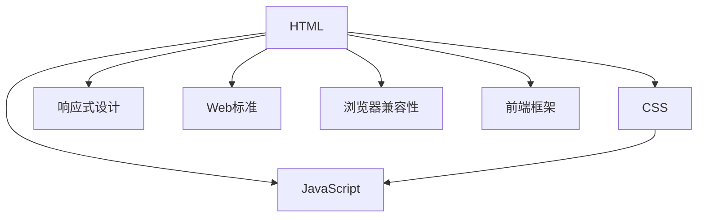

                 

# Web 前端开发：HTML、CSS 和 JavaScript

> 关键词：Web前端开发, HTML, CSS, JavaScript, 响应式设计, Web标准, 浏览器兼容性, 前端框架

## 1. 背景介绍

### 1.1 问题由来

随着互联网的迅猛发展，Web前端开发成为了连接用户和后端服务的关键技术。随着HTML5、CSS3、JavaScript等技术的不断进步，Web开发进入了一个全新的时代，开发者的工作重心也从静态页面开发转移到了动态、交互、响应式等更复杂的方向。

同时，随着移动设备的普及和功能增强，Web前端开发面临着新的挑战。如何在不同的设备上提供一致的用户体验，如何优化网页性能，如何提升交互体验，如何保证浏览器兼容性，这些都是前端开发者需要面对的问题。

## 2. 核心概念与联系

### 2.1 核心概念概述

本节将介绍Web前端开发中的一些核心概念，并说明它们之间的联系：

- HTML：定义Web页面结构，包括文本、图像、链接等基本元素。
- CSS：定义Web页面的样式，包括布局、颜色、字体等。
- JavaScript：实现Web页面的交互和动态效果，包括表单验证、动画、AJAX等。

### 2.2 核心概念原理和架构的 Mermaid 流程图



这个流程图展示了HTML、CSS和JavaScript在Web前端开发中的关系：

- HTML提供了页面结构，是所有样式和交互的基础。
- CSS定义了页面样式，负责布局和渲染。
- JavaScript实现了页面的交互和动态效果。
- 响应式设计是指在不同设备和屏幕尺寸下，页面能够自适应调整布局和样式，以提供一致的用户体验。
- Web标准是指遵循国际标准的Web开发规范，确保在不同浏览器中一致性。
- 浏览器兼容性是指确保Web页面在不同浏览器和版本中正确渲染和运行。
- 前端框架则是一系列工具和库的集合，提供了一系列常用的组件和功能，简化了开发流程。

## 3. 核心算法原理 & 具体操作步骤

### 3.1 算法原理概述

Web前端开发中，常见的算法和操作包括：

- DOM树构建与渲染
- CSS选择器和布局
- JavaScript事件处理和DOM操作
- AJAX异步数据传输

### 3.2 算法步骤详解

#### 3.2.1 DOM树构建与渲染

1. **DOM树构建**：
   - HTML文件经过解析，转换成DOM树，也就是一颗文档对象模型树。每个节点代表文档中的元素，如`<div>`、`<a>`等。
   - 浏览器将DOM树渲染到屏幕上，最终展示给用户。

2. **渲染优化**：
   - 浏览器使用了多种优化技术，如重绘和回流，减少不必要的渲染次数。
   - 利用CSS动画和JavaScript动画，提升交互体验。

#### 3.2.2 CSS选择器和布局

1. **选择器**：
   - CSS提供了多种选择器，如类选择器(`.class`)、ID选择器(`#id`)、属性选择器(`[attribute]`)等。
   - 选择器用于选中符合条件的HTML元素，并应用样式。

2. **布局**：
   - CSS布局可以使用盒模型(`box-model`)、浮动(`float`)、定位(`position`)等技术。
   - 通过不同的布局技术，可以实现响应式布局，适应不同的设备和屏幕大小。

#### 3.2.3 JavaScript事件处理和DOM操作

1. **事件处理**：
   - JavaScript可以为HTML元素添加事件处理程序，如点击、鼠标移动、键盘输入等。
   - 事件处理程序会在事件触发时执行，可以用于表单验证、动画效果等。

2. **DOM操作**：
   - JavaScript可以动态地操作DOM树，如添加、删除、修改元素。
   - 通过DOM操作，可以实现页面动态效果的实现，如轮播图、滚动条等。

#### 3.2.4 AJAX异步数据传输

1. **AJAX**：
   - AJAX是异步JavaScript和XML的缩写，可以实现无需刷新页面，动态更新部分页面内容的效果。
   - AJAX使用XMLHttpRequest对象，与服务器进行数据交互。

2. **数据模型**：
   - 数据模型是指如何组织和展示数据，常用的数据模型包括表格、列表、树等。
   - 数据模型决定了页面结构的复杂性和维护成本。

### 3.3 算法优缺点

#### 3.3.1 优点

1. **动态性**：JavaScript使Web页面具有动态性，可以实现复杂的交互效果。
2. **响应式设计**：通过响应式布局，可以适应不同的设备和屏幕大小，提升用户体验。
3. **性能优化**：现代浏览器优化了DOM渲染和CSS布局，提高了页面加载速度。
4. **跨平台**：HTML、CSS和JavaScript可以跨平台运行，支持多种设备。

#### 3.3.2 缺点

1. **安全性问题**：JavaScript代码直接运行在用户浏览器中，容易被恶意利用。
2. **兼容性问题**：不同浏览器和版本对JavaScript的支持不一致，需要进行兼容性处理。
3. **性能瓶颈**：复杂的JavaScript代码和动画效果，可能会影响页面性能。
4. **维护成本高**：随着Web应用越来越复杂，代码维护成本也会随之增加。

### 3.4 算法应用领域

Web前端开发在多个领域有广泛应用，包括：

- **电子商务**：实现商品展示、购物车、支付等页面。
- **社交网络**：实现用户登录、消息推送、评论等功能。
- **在线教育**：实现课程展示、互动问答、作业提交等。
- **金融理财**：实现股票行情、交易系统、数据分析等。
- **医疗健康**：实现在线问诊、病历记录、健康管理等。

## 4. 数学模型和公式 & 详细讲解 & 举例说明

### 4.1 数学模型构建

本节将通过数学模型来描述Web前端开发的某些方面，包括DOM树渲染、CSS布局、JavaScript事件处理等。

#### 4.1.1 DOM树渲染

1. **渲染模型**：
   - DOM树渲染模型可以描述为：页面渲染函数，接受HTML文件，返回渲染后的DOM树。
   - 渲染函数需要考虑HTML标签、属性、样式等信息。

2. **渲染公式**：
   - 渲染公式可以表示为：`render(DOM_tree) = parse(html_file)`

#### 4.1.2 CSS布局

1. **布局模型**：
   - CSS布局模型可以描述为：页面布局函数，接受CSS样式，返回布局后的DOM树。
   - 布局函数需要考虑选择器、布局属性、盒模型等信息。

2. **布局公式**：
   - 布局公式可以表示为：`layout(DOM_tree, styles) = apply(styles, DOM_tree)`

#### 4.1.3 JavaScript事件处理

1. **事件处理模型**：
   - 事件处理模型可以描述为：事件处理函数，接受DOM树和事件类型，返回处理结果。
   - 事件处理函数需要考虑事件类型、事件处理程序、DOM操作等信息。

2. **事件处理公式**：
   - 事件处理公式可以表示为：`handle_event(DOM_tree, event_type, callback)`

### 4.2 公式推导过程

#### 4.2.1 DOM树渲染

1. **解析过程**：
   - HTML文件经过解析，转换成DOM树，需要进行标签解析、属性解析、样式解析等。
   - 解析过程可以使用递归算法或栈算法实现。

2. **渲染过程**：
   - 渲染过程需要进行DOM树的遍历，将DOM树中的元素渲染到屏幕上。
   - 渲染过程可以使用递归算法或迭代算法实现。

#### 4.2.2 CSS布局

1. **选择器解析**：
   - 选择器解析需要将CSS样式解析成对应的DOM节点集合。
   - 选择器解析可以使用正则表达式或解析器实现。

2. **布局计算**：
   - 布局计算需要计算DOM节点的坐标、大小等信息。
   - 布局计算可以使用矩阵变换、向量运算等算法实现。

#### 4.2.3 JavaScript事件处理

1. **事件监听**：
   - 事件监听需要将DOM节点和事件类型关联起来，进行事件绑定。
   - 事件监听可以使用DOM API或JavaScript库实现。

2. **事件处理**：
   - 事件处理需要执行事件处理程序，并进行DOM操作。
   - 事件处理可以使用回调函数或Promise实现。

### 4.3 案例分析与讲解

#### 4.3.1 案例分析

1. **轮播图实现**：
   - 使用JavaScript实现轮播图，需要实现动态更新DOM树、动画效果等。
   - 轮播图可以使用DOM操作、CSS动画、JavaScript动画等技术实现。

2. **购物车实现**：
   - 使用JavaScript实现购物车，需要实现添加、删除、修改商品、结算等功能。
   - 购物车可以使用DOM操作、AJAX异步数据传输等技术实现。

## 5. 项目实践：代码实例和详细解释说明

### 5.1 开发环境搭建

#### 5.1.1 安装开发环境

1. **Node.js和npm**：
   - Node.js是JavaScript运行环境，支持JavaScript在服务器端运行。
   - npm是Node.js的包管理工具，可以安装和管理第三方库和框架。

2. **IDE和代码编辑器**：
   - VS Code、Atom、Sublime Text等代码编辑器，支持语法高亮、代码补全等功能。
   - 编辑器需要安装JavaScript和TypeScript插件，支持开发JavaScript和TypeScript代码。

3. **Web浏览器**：
   - 现代浏览器如Chrome、Firefox、Edge等，支持最新的Web标准和API。
   - 浏览器需要配置为开发者模式，方便调试和测试。

### 5.2 源代码详细实现

#### 5.2.1 HTML代码示例

```html
<!DOCTYPE html>
<html>
<head>
    <meta charset="UTF-8">
    <title>轮播图</title>
    <style>
        #slider {
            width: 500px;
            height: 300px;
            overflow: hidden;
        }
        #slider ul {
            list-style: none;
            margin: 0;
            padding: 0;
            display: flex;
            animation: slide 10s infinite;
        }
        #slider li {
            width: 500px;
            height: 300px;
            background-size: cover;
            background-position: center center;
        }
        @keyframes slide {
            from { left: 0; }
            to { left: -500px; }
        }
    </style>
</head>
<body>
    <div id="slider">
        <ul>
            <li style="background-image: url('img1.jpg');"></li>
            <li style="background-image: url('img2.jpg');"></li>
            <li style="background-image: url('img3.jpg');"></li>
        </ul>
    </div>
    <script src="script.js"></script>
</body>
</html>
```

#### 5.2.2 CSS代码示例

```css
#slider {
    width: 500px;
    height: 300px;
    overflow: hidden;
}
#slider ul {
    list-style: none;
    margin: 0;
    padding: 0;
    display: flex;
    animation: slide 10s infinite;
}
#slider li {
    width: 500px;
    height: 300px;
    background-size: cover;
    background-position: center center;
}
@keyframes slide {
    from { left: 0; }
    to { left: -500px; }
}
```

#### 5.2.3 JavaScript代码示例

```javascript
document.addEventListener('DOMContentLoaded', function() {
    var slider = document.getElementById('slider');
    var ul = document.createElement('ul');
    for (var i = 0; i < 3; i++) {
        var li = document.createElement('li');
        li.style.backgroundImage = 'url(img' + (i+1) + '.jpg)';
        ul.appendChild(li);
    }
    slider.appendChild(ul);
});
```

### 5.3 代码解读与分析

#### 5.3.1 代码解读

1. **HTML代码**：
   - HTML代码定义了轮播图的基本结构和样式。
   - `<ul>`元素用于容纳图片列表，`<style>`元素用于定义样式。

2. **CSS代码**：
   - CSS代码定义了轮播图的布局和动画效果。
   - `#slider`元素用于容纳图片列表，`<ul>`元素用于定义图片列表，`li`元素用于定义单个图片。

3. **JavaScript代码**：
   - JavaScript代码用于动态创建图片列表，并将其添加到轮播图中。
   - `document.getElementById`方法用于获取DOM元素，`createElement`方法用于创建新元素，`appendChild`方法用于添加子元素。

#### 5.3.2 代码分析

1. **DOM树构建**：
   - 轮播图的DOM树由HTML和CSS定义，包括轮播容器、图片列表、图片等元素。
   - 浏览器将HTML和CSS解析成DOM树，并进行布局和渲染。

2. **CSS布局**：
   - CSS使用Flex布局和动画效果，实现了轮播图的滑动效果。
   - CSS布局计算了图片列表的位置和大小，确保了轮播图的响应式设计。

3. **JavaScript事件处理**：
   - JavaScript代码实现了动态创建图片列表的功能。
   - JavaScript通过DOM操作，动态更新了轮播图中的图片。

### 5.4 运行结果展示

#### 5.4.1 运行结果

运行上述代码，可以看到一个轮播图在页面中滚动展示图片。轮播图在动画效果下平滑切换图片，用户体验良好。

## 6. 实际应用场景

### 6.1 实际应用场景分析

#### 6.1.1 轮播图应用场景

1. **电子商务网站**：
   - 在产品展示页面，使用轮播图展示多张图片，提升用户浏览体验。
   - 轮播图可以自动切换图片，提供连贯的浏览体验。

2. **新闻网站**：
   - 在新闻页面，使用轮播图展示多篇文章，提升信息展示效果。
   - 轮播图可以展示最新文章或热门文章，吸引用户阅读。

#### 6.1.2 购物车应用场景

1. **电商平台**：
   - 在购物车页面，使用JavaScript实现动态添加、删除商品功能。
   - 购物车可以通过AJAX异步更新商品列表，减少页面刷新次数。

2. **在线商店**：
   - 在订单页面，使用JavaScript实现结算功能，自动计算价格、折扣等。
   - 购物车可以实时展示订单状态和商品信息，提升用户体验。

## 7. 工具和资源推荐

### 7.1 学习资源推荐

#### 7.1.1 书籍推荐

1. **《JavaScript高级程序设计》**：
   - 一本经典的JavaScript书籍，涵盖JavaScript语言基础和高级特性。
   - 适合初学者和中级开发者阅读。

2. **《CSS揭秘》**：
   - 一本关于CSS布局和样式的实用指南，涵盖最新的CSS3特性。
   - 适合前端开发者阅读。

3. **《HTML5权威指南》**：
   - 一本关于HTML5的权威指南，涵盖HTML5标签、属性、API等。
   - 适合Web开发者阅读。

#### 7.1.2 在线课程推荐

1. **MDN Web文档**：
   - MDN Web文档提供了全面的Web开发教程，涵盖HTML、CSS、JavaScript等技术。
   - 适合Web开发者自学使用。

2. **Udacity前端开发课程**：
   - Udacity提供了全面的前端开发课程，涵盖HTML、CSS、JavaScript等技术。
   - 适合Web开发者系统学习。

3. **Coursera前端开发课程**：
   - Coursera提供了多门前端开发课程，涵盖Web标准、DOM操作、事件处理等技术。
   - 适合Web开发者提升技能。

### 7.2 开发工具推荐

#### 7.2.1 IDE推荐

1. **Visual Studio Code**：
   - Visual Studio Code是一款流行的开源代码编辑器，支持多种编程语言。
   - 支持代码高亮、自动补全、调试等功能。

2. **Atom**：
   - Atom是另一款流行的代码编辑器，支持多种编程语言。
   - 支持插件扩展、代码高亮、版本控制等功能。

3. **Sublime Text**：
   - Sublime Text是一款功能强大的代码编辑器，支持多种编程语言。
   - 支持代码高亮、自动补全、宏命令等功能。

#### 7.2.2 在线开发工具推荐

1. **CodeSandbox**：
   - CodeSandbox是一个在线JavaScript开发工具，支持实时预览和测试。
   - 适合前端开发者快速原型开发。

2. **JSFiddle**：
   - JSFiddle是一个在线JavaScript沙箱，支持实时测试和演示。
   - 适合前端开发者测试代码。

3. **JSBin**：
   - JSBin是一个在线JavaScript编辑器，支持实时测试和协作。
   - 适合前端开发者协作开发。

### 7.3 相关论文推荐

#### 7.3.1 论文推荐

1. **《Web标准和最佳实践》**：
   - 一篇关于Web标准和最佳实践的论文，涵盖Web开发规范和实践。
   - 适合Web开发者阅读，了解Web标准和最佳实践。

2. **《Web前端开发效率提升技术》**：
   - 一篇关于Web前端开发效率提升技术的论文，涵盖工具和技巧。
   - 适合Web开发者提升开发效率，优化代码质量。

3. **《Web前端性能优化技术》**：
   - 一篇关于Web前端性能优化技术的论文，涵盖性能优化技巧。
   - 适合Web开发者提升性能，优化用户体验。

## 8. 总结：未来发展趋势与挑战

### 8.1 未来发展趋势

#### 8.1.1 前端框架和技术的发展

1. **React**：
   - React是一款流行的JavaScript库，用于构建用户界面。
   - React使用组件化开发，提升代码可维护性。

2. **Vue**：
   - Vue是一款流行的JavaScript框架，用于构建单页应用。
   - Vue使用响应式数据模型，提升开发效率。

3. **Angular**：
   - Angular是一款流行的JavaScript框架，用于构建大型的单页应用。
   - Angular提供全面的开发工具和功能，提升开发效率。

#### 8.1.2 Web标准和技术的演进

1. **HTML6**：
   - HTML6是下一代的HTML标准，引入新的标签和API。
   - HTML6将提升Web页面的语义化和交互性。

2. **CSS4**：
   - CSS4是下一代的CSS标准，引入新的样式属性和布局技术。
   - CSS4将提升Web页面的视觉效果和布局能力。

3. **WebAssembly**：
   - WebAssembly是下一代Web平台，支持高性能计算和代码优化。
   - WebAssembly将提升Web应用的性能和用户体验。

#### 8.1.3 前端技术的融合

1. **Web与移动端融合**：
   - Web与移动端融合技术，如React Native、Ionic等，使得Web和移动端开发更加无缝。
   - Web与移动端融合将提升开发效率和用户体验。

2. **Web与物联网融合**：
   - Web与物联网融合技术，如WebSockets、MQTT等，使得Web和物联网设备无缝交互。
   - Web与物联网融合将提升Web应用的功能和场景。

3. **Web与人工智能融合**：
   - Web与人工智能融合技术，如TensorFlow.js、Microsoft Cognitive Services等，使得Web应用具备智能能力。
   - Web与人工智能融合将提升Web应用的智能化水平。

### 8.2 未来发展趋势

#### 8.2.1 动态性和交互性提升

1. **交互式UI**：
   - 交互式UI技术，如React、Vue等，将提升Web应用的动态性和交互性。
   - 交互式UI将提升用户的使用体验和操作效率。

2. **动画效果**：
   - 动画效果技术，如CSS动画、JavaScript动画等，将提升Web应用的视觉效果和体验。
   - 动画效果将增强Web应用的品牌感和吸引力。

3. **表单验证**：
   - 表单验证技术，如HTML5表单验证、JavaScript表单验证等，将提升Web应用的可靠性和安全性。
   - 表单验证将提升Web应用的错误处理能力和用户体验。

#### 8.2.2 性能和安全性优化

1. **代码优化**：
   - 代码优化技术，如代码压缩、代码分割、懒加载等，将提升Web应用的性能。
   - 代码优化将提升Web应用的加载速度和用户体验。

2. **安全性优化**：
   - 安全性优化技术，如XSS攻击防护、CSRF攻击防护等，将提升Web应用的安全性。
   - 安全性优化将提升Web应用的可靠性和安全性。

3. **响应式设计**：
   - 响应式设计技术，如CSS3布局、Flex布局等，将提升Web应用的适应性和用户体验。
   - 响应式设计将提升Web应用的多设备兼容性和适应性。

### 8.3 面临的挑战

#### 8.3.1 兼容性问题

1. **浏览器兼容性**：
   - Web前端开发者需要考虑不同浏览器和版本的兼容性。
   - 浏览器兼容性将影响Web应用的跨浏览器适配。

2. **平台兼容性**：
   - Web前端开发者需要考虑不同平台和设备的兼容性。
   - 平台兼容性将影响Web应用的多设备适配。

#### 8.3.2 性能瓶颈

1. **页面加载速度**：
   - Web应用的页面加载速度直接影响用户体验。
   - 页面加载速度将影响Web应用的访问量和用户留存率。

2. **内存占用**：
   - Web应用的页面内存占用直接影响用户体验。
   - 内存占用将影响Web应用的性能和响应速度。

3. **网络延迟**：
   - Web应用的响应延迟直接影响用户体验。
   - 网络延迟将影响Web应用的实时性和流畅性。

#### 8.3.3 安全性问题

1. **XSS攻击**：
   - XSS攻击将导致Web应用的数据泄露和业务中断。
   - XSS攻击将影响Web应用的安全性和可靠性。

2. **CSRF攻击**：
   - CSRF攻击将导致Web应用的身份劫持和数据篡改。
   - CSRF攻击将影响Web应用的安全性和可靠性。

3. **SQL注入攻击**：
   - SQL注入攻击将导致Web应用的数据泄露和业务中断。
   - SQL注入攻击将影响Web应用的安全性和可靠性。

### 8.4 研究展望

#### 8.4.1 持续研究和创新

1. **前端框架创新**：
   - 前端框架的创新将提升Web应用的开发效率和用户体验。
   - 前端框架的创新将引领Web应用的技术发展方向。

2. **Web标准演进**：
   - Web标准的演进将提升Web应用的跨浏览器和跨平台适配能力。
   - Web标准的演进将提升Web应用的可靠性和安全性。

3. **技术融合**：
   - 技术融合将提升Web应用的智能化和多功能性。
   - 技术融合将提升Web应用的市场竞争力和用户价值。

## 9. 附录：常见问题与解答

**Q1: 什么是Web前端开发？**

A: Web前端开发是指通过HTML、CSS和JavaScript等技术，实现Web页面的功能和交互效果。Web前端开发是Web应用开发的重要环节，负责用户界面的设计和交互逻辑的实现。

**Q2: 如何提升Web应用的页面加载速度？**

A: 提升Web应用的页面加载速度，可以采取以下措施：

1. 优化图片和资源加载：压缩图片，使用懒加载，合并资源等。
2. 使用CDN加速：将静态资源通过CDN加速，提升加载速度。
3. 优化代码和DOM结构：减少DOM节点和计算量，使用缓存等。
4. 使用HTTP/2协议：HTTP/2协议支持多路复用、服务器推送等特性，提升页面加载速度。

**Q3: 什么是响应式设计？**

A: 响应式设计是指Web应用能够自适应不同的设备和屏幕尺寸，提供一致的用户体验。响应式设计使用CSS3布局和Flex布局等技术，实现页面布局的动态调整和适配。

**Q4: 什么是Web标准？**

A: Web标准是指遵循国际标准的Web开发规范，确保Web应用的跨浏览器和跨平台适配能力。Web标准包括HTML、CSS、JavaScript等技术标准，确保Web应用的语义化和可访问性。

**Q5: 什么是WebAssembly？**

A: WebAssembly是下一代Web平台，支持高性能计算和代码优化。WebAssembly提供更快的执行速度和更小的文件体积，提升Web应用的性能和用户体验。

**Q6: 什么是前端框架？**

A: 前端框架是指一组工具和库的集合，用于简化Web应用的开发流程，提升开发效率和代码质量。常见的前端框架包括React、Vue、Angular等。

**Q7: 什么是XSS攻击？**

A: XSS攻击（跨站脚本攻击）是指攻击者通过Web页面注入恶意脚本，获取用户敏感信息或控制用户浏览器。XSS攻击可以导致Web应用的数据泄露和业务中断。

**Q8: 什么是CSRF攻击？**

A: CSRF攻击（跨站请求伪造）是指攻击者通过用户已登录的账户，进行恶意操作。CSRF攻击可以导致Web应用的身份劫持和数据篡改。

**Q9: 什么是SQL注入攻击？**

A: SQL注入攻击是指攻击者通过Web页面注入SQL代码，获取敏感数据或控制数据库。SQL注入攻击可以导致Web应用的数据泄露和业务中断。

---

作者：禅与计算机程序设计艺术 / Zen and the Art of Computer Programming

