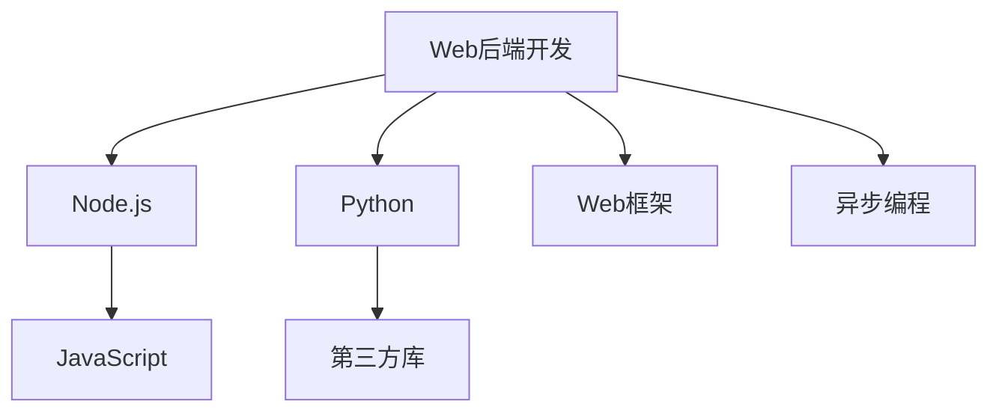

                 

# Web 后端开发：Node.js 和 Python

> 关键词：Web 后端开发, Node.js, Python, 服务器端编程, 全栈开发, 框架选择

## 1. 背景介绍

### 1.1 问题由来

随着Web技术的迅猛发展，网站的用户体验越来越复杂，服务端功能需求也在不断增加。传统的Web后端开发已经难以满足用户需求的快速变化，需要更为灵活、高效的技术手段。Node.js和Python作为两种流行且功能强大的编程语言，成为了Web后端开发的重要选择。本文将详细介绍Node.js和Python在Web后端开发中的应用，分析其优缺点，并探讨两种语言的未来发展趋势。

### 1.2 问题核心关键点

Node.js和Python是两种功能强大的编程语言，分别基于JavaScript和Python语言构建。Node.js是一个运行在服务器端的环境，使得JavaScript可以在服务器端进行运行。Python则是一个广泛使用的高级编程语言，提供了丰富的库和框架，适用于多种应用场景。两种语言在Web后端开发中都有广泛的应用，其核心关键点如下：

1. **Node.js**：高性能、事件驱动、非阻塞I/O操作、跨平台、JavaScript生态系统丰富。
2. **Python**：简洁易读、社区支持强大、丰富的第三方库、面向对象编程语言。

## 2. 核心概念与联系

### 2.1 核心概念概述

为了更好地理解Node.js和Python在Web后端开发中的应用，本节将介绍几个密切相关的核心概念：

- **Web后端开发**：指构建Web应用的后端部分，包括服务器端的逻辑处理、数据存储、业务逻辑实现等。
- **Node.js**：一个基于Chrome V8引擎的JavaScript运行环境，可以运行在服务器端，提供非阻塞I/O、事件驱动等特性。
- **Python**：一种高级编程语言，以其简洁易读、丰富的库和框架著称，适用于多种应用场景。
- **Web框架**：用于简化Web应用开发的工具，如Node.js的Express、Python的Django和Flask等。
- **异步编程**：一种编程范式，允许程序在不等待I/O操作完成的情况下继续执行其他任务。

这些核心概念之间的逻辑关系可以通过以下Mermaid流程图来展示：



这个流程图展示了两大语言在Web后端开发中的核心概念及其之间的关系：

1. Web后端开发利用Node.js和Python语言构建后端逻辑。
2. Node.js使用JavaScript作为核心语言，通过JavaScript生态系统扩展功能。
3. Python利用其丰富的第三方库和框架，支持多种应用场景。
4. Web框架简化了Web应用开发过程，提高开发效率。
5. 异步编程提高了Web应用的处理效率和响应速度。

## 3. 核心算法原理 & 具体操作步骤
### 3.1 算法原理概述

Node.js和Python在Web后端开发中主要采用异步编程模型，以提高应用的性能和响应速度。异步编程模型允许程序在等待I/O操作完成时执行其他任务，避免了阻塞I/O操作带来的性能问题。

### 3.2 算法步骤详解

以下是Node.js和Python在Web后端开发中的具体步骤：

#### Node.js开发步骤：

1. **准备开发环境**：
   - 安装Node.js环境。
   - 安装npm（Node.js包管理器）。
   - 安装Express框架。

2. **创建项目和初始化**：
   - 创建一个新的Node.js项目。
   - 使用npm初始化项目，安装项目依赖。

3. **编写后端代码**：
   - 使用Express框架创建路由和控制器。
   - 处理HTTP请求和响应。
   - 使用Node.js内置模块或第三方库进行数据库操作。

4. **测试和部署**：
   - 编写测试用例。
   - 在测试环境中运行测试。
   - 部署应用到生产环境。

#### Python开发步骤：

1. **准备开发环境**：
   - 安装Python环境。
   - 安装虚拟环境管理工具。
   - 安装Django或Flask框架。

2. **创建项目和初始化**：
   - 创建一个新的Python项目。
   - 使用虚拟环境管理工具创建虚拟环境。
   - 使用框架的命令行工具初始化项目。

3. **编写后端代码**：
   - 使用Django或Flask创建路由和视图函数。
   - 处理HTTP请求和响应。
   - 使用Python内置模块或第三方库进行数据库操作。

4. **测试和部署**：
   - 编写测试用例。
   - 在测试环境中运行测试。
   - 部署应用到生产环境。

### 3.3 算法优缺点

Node.js和Python在Web后端开发中各有优缺点：

#### Node.js的优点：

1. **高性能**：Node.js采用事件驱动、非阻塞I/O模型，能够处理高并发请求。
2. **跨平台**：Node.js可以在多个操作系统上运行，支持Windows、Linux和Mac OS等平台。
3. **JavaScript生态系统丰富**：Node.js利用了JavaScript的丰富生态系统，可以快速开发功能。
4. **易学易用**：Node.js开发环境简单易用，上手难度低。

#### Node.js的缺点：

1. **单线程**：Node.js采用单线程模型，虽然非阻塞I/O提高了性能，但也限制了并发处理的线程数。
2. **回调地狱**：由于异步编程依赖回调函数，代码结构复杂，容易出现回调地狱问题。
3. **内存泄漏**：Node.js中的内存管理复杂，容易出现内存泄漏问题。

#### Python的优点：

1. **简洁易读**：Python语法简洁易读，易于理解和学习。
2. **社区支持强大**：Python拥有强大的社区支持，丰富的第三方库和框架。
3. **面向对象编程**：Python支持面向对象编程，代码结构清晰。
4. **科学计算能力**：Python在科学计算和数据分析领域有广泛应用。

#### Python的缺点：

1. **性能问题**：Python解释器运行速度较慢，处理高并发请求时性能较差。
2. **GIL锁**：Python的GIL锁限制了多线程并发处理，影响了性能。
3. **内存占用**：Python程序在运行时占用的内存较多，需要优化内存管理。

### 3.4 算法应用领域

Node.js和Python在Web后端开发中有广泛的应用领域：

#### Node.js应用领域：

1. **高并发场景**：Node.js适用于需要处理高并发请求的应用，如在线游戏、实时聊天等。
2. **实时应用**：Node.js适用于实时数据处理和流式传输，如WebSocket、长连接等。
3. **API服务**：Node.js适用于构建API服务，快速响应客户端请求。

#### Python应用领域：

1. **数据处理**：Python在数据处理和科学计算领域有广泛应用，适用于数据挖掘、数据分析等任务。
2. **机器学习**：Python拥有丰富的机器学习库，如Scikit-Learn、TensorFlow等，适用于机器学习模型开发。
3. **Web应用**：Python适用于构建Web应用，如Django、Flask等框架支持多种Web应用开发。

## 4. 数学模型和公式 & 详细讲解 & 举例说明

### 4.1 数学模型构建

在Web后端开发中，常用的数学模型包括线性回归、决策树、神经网络等。这里以线性回归模型为例，介绍其数学构建过程。

假设有一个线性回归模型 $y=f(x;\theta)$，其中 $x$ 为输入特征向量，$y$ 为输出标签，$\theta$ 为模型参数。线性回归模型的目标是找到一组参数 $\theta$，使得模型输出尽可能接近真实标签。

### 4.2 公式推导过程

线性回归模型的损失函数为均方误差损失函数（Mean Squared Error, MSE）：

$$
L(\theta)=\frac{1}{n}\sum_{i=1}^{n}(y_i-f(x_i;\theta))^2
$$

其中 $n$ 为样本数量，$y_i$ 为第 $i$ 个样本的真实标签，$f(x_i;\theta)$ 为模型对第 $i$ 个样本的预测输出。

为了最小化损失函数，需要对模型参数 $\theta$ 进行优化。常用的优化算法包括梯度下降法、随机梯度下降法等。以梯度下降法为例，其更新公式为：

$$
\theta_{t+1}=\theta_t-\alpha\nabla_{\theta}L(\theta)
$$

其中 $\alpha$ 为学习率，$\nabla_{\theta}L(\theta)$ 为损失函数对参数 $\theta$ 的梯度。

### 4.3 案例分析与讲解

以线性回归模型为例，说明其在Web后端开发中的应用。

假设有一个预测房价的应用，输入特征包括房屋面积、地理位置等，输出为房价。可以使用线性回归模型来预测房价。在实际应用中，可以使用Python的Scikit-Learn库来实现线性回归模型。

## 5. 项目实践：代码实例和详细解释说明

### 5.1 开发环境搭建

#### Node.js环境搭建：

1. 下载并安装Node.js。
2. 安装npm。
3. 安装Express框架。

```bash
npm install express --save
```

#### Python环境搭建：

1. 下载并安装Python。
2. 安装虚拟环境管理工具（如virtualenv）。
3. 安装Django或Flask框架。

```bash
pip install django
```

### 5.2 源代码详细实现

#### Node.js实现：

创建一个新的Node.js项目，安装Express框架，编写后端代码：

```javascript
const express = require('express');
const app = express();

app.get('/', (req, res) => {
  res.send('Hello, World!');
});

app.listen(3000, () => {
  console.log('Server is running on http://localhost:3000');
});
```

#### Python实现：

创建一个新的Python项目，安装Django框架，编写后端代码：

```python
from django.http import HttpResponse
from django.urls import path

def index(request):
    return HttpResponse('Hello, World!')

urlpatterns = [
    path('', index),
]

if __name__ == '__main__':
    from django.core.wsgi import get_wsgi_application
    application = get_wsgi_application()
    application.run()
```

### 5.3 代码解读与分析

#### Node.js代码解读：

1. 引入Express框架。
2. 创建Express应用实例。
3. 创建路由和控制器，处理HTTP请求。
4. 启动服务器并监听端口。

#### Python代码解读：

1. 定义路由和视图函数。
2. 处理HTTP请求和响应。
3. 运行Django应用实例。

### 5.4 运行结果展示

#### Node.js运行结果：

启动Node.js应用，访问http://localhost:3000，可以看到“Hello, World!”输出。

#### Python运行结果：

启动Python应用，访问http://127.0.0.1:8000/，可以看到“Hello, World!”输出。

## 6. 实际应用场景

### 6.1 Web应用开发

Node.js和Python广泛应用于Web应用开发中。Node.js适用于构建实时性要求高的应用，如实时聊天、在线游戏等。Python适用于构建科学计算和数据分析应用，如数据挖掘、机器学习等。

### 6.2 数据处理

Python在数据处理和科学计算领域有广泛应用，适用于数据挖掘、数据分析等任务。Node.js虽然不是主要的数据处理语言，但也可以利用第三方库进行数据处理。

### 6.3 机器学习

Python拥有丰富的机器学习库，如Scikit-Learn、TensorFlow等，适用于机器学习模型开发。Node.js虽然不是主要的机器学习语言，但也可以利用第三方库进行机器学习应用开发。

### 6.4 未来应用展望

未来，Node.js和Python在Web后端开发中将继续发挥重要作用。Node.js将在高并发、实时应用领域继续保持优势，而Python将在科学计算和数据分析领域继续扩展其应用范围。

## 7. 工具和资源推荐

### 7.1 学习资源推荐

为了帮助开发者系统掌握Node.js和Python在Web后端开发中的应用，这里推荐一些优质的学习资源：

1. **Node.js官方文档**：
   - 详细介绍了Node.js的API和使用方法。
   - 提供了丰富的示例和教程。

2. **Python官方文档**：
   - 详细介绍了Python的API和使用方法。
   - 提供了丰富的示例和教程。

3. **Node.js教程**：
   - 提供了Node.js从入门到进阶的详细教程。
   - 适合初学者和进阶开发者。

4. **Python教程**：
   - 提供了Python从入门到进阶的详细教程。
   - 适合初学者和进阶开发者。

5. **Express文档**：
   - 详细介绍了Express框架的使用方法。
   - 提供了丰富的示例和教程。

6. **Django文档**：
   - 详细介绍了Django框架的使用方法。
   - 提供了丰富的示例和教程。

### 7.2 开发工具推荐

以下是几款用于Node.js和Python开发的常用工具：

1. **Visual Studio Code**：
   - 一款轻量级、易用的代码编辑器，支持Node.js和Python开发。
   - 提供了丰富的插件和扩展。

2. **PyCharm**：
   - 一款专业的Python开发工具，提供了丰富的功能和插件。
   - 支持Python开发的各种框架和库。

3. **Atom**：
   - 一款轻量级、可定制的代码编辑器，支持Node.js和Python开发。
   - 提供了丰富的插件和扩展。

4. **Jupyter Notebook**：
   - 一款交互式代码编辑器，支持Python和JavaScript开发。
   - 提供了丰富的功能和示例。

### 7.3 相关论文推荐

以下是几篇奠基性的相关论文，推荐阅读：

1. **Node.js: The Developer's Server-Side JavaScript**：
   - 详细介绍了Node.js的设计和实现。
   - 提供了丰富的示例和教程。

2. **Python: The World's Most Popular Programming Language**：
   - 详细介绍了Python的设计和实现。
   - 提供了丰富的示例和教程。

3. **The ExpressJS Guide**：
   - 详细介绍了Express框架的使用方法。
   - 提供了丰富的示例和教程。

4. **The Django Book**：
   - 详细介绍了Django框架的使用方法。
   - 提供了丰富的示例和教程。

5. **Deep Learning with Python**：
   - 详细介绍了Python在深度学习中的应用。
   - 提供了丰富的示例和教程。

## 8. 总结：未来发展趋势与挑战

### 8.1 总结

本文对Node.js和Python在Web后端开发中的应用进行了全面系统的介绍。首先阐述了Node.js和Python在Web后端开发中的研究背景和意义，明确了两种语言在Web后端开发中的核心关键点。其次，从原理到实践，详细讲解了Node.js和Python在Web后端开发中的应用过程，给出了完整的代码实现。同时，本文还探讨了两种语言的实际应用场景和未来发展趋势，提供了相关的学习资源和开发工具。

通过本文的系统梳理，可以看到，Node.js和Python在Web后端开发中有着广泛的应用，是当前Web开发中不可或缺的技术手段。Node.js和Python在处理高并发、实时应用、数据处理、机器学习等方面有着明显的优势，未来将继续在Web开发中发挥重要作用。

### 8.2 未来发展趋势

展望未来，Node.js和Python在Web后端开发中将呈现以下几个发展趋势：

1. **全栈开发**：Node.js和Python将更多地应用于全栈开发，提供完整的Web应用解决方案。
2. **异步编程**：异步编程将成为Web开发的标准模式，提高应用的性能和响应速度。
3. **微服务架构**：Node.js和Python将更多地应用于微服务架构，提供灵活、可扩展的Web应用开发模式。
4. **人工智能**：Node.js和Python将在人工智能领域有更广泛的应用，如机器学习、自然语言处理等。
5. **实时数据处理**：Node.js和Python将更多地应用于实时数据处理，提高数据处理的效率和可靠性。

### 8.3 面临的挑战

尽管Node.js和Python在Web后端开发中已经取得了瞩目成就，但在迈向更加智能化、普适化应用的过程中，它们仍面临着诸多挑战：

1. **性能瓶颈**：Node.js和Python在处理高并发、实时数据处理时，性能仍有提升空间。
2. **内存管理**：Node.js和Python在运行时占用的内存较多，需要优化内存管理。
3. **框架选择**：选择合适的Web框架和库是开发成功的重要因素，开发者需要掌握多个框架和库的特点和使用方法。
4. **社区支持**：虽然Node.js和Python有强大的社区支持，但随着应用场景的不断扩展，需要更多的社区支持和扩展。
5. **安全性**：Node.js和Python的安全性问题需要持续关注和解决。

### 8.4 研究展望

面对Node.js和Python在Web后端开发中面临的种种挑战，未来的研究需要在以下几个方面寻求新的突破：

1. **优化性能**：通过改进异步编程模型和优化内存管理，提高Node.js和Python的性能和响应速度。
2. **框架创新**：开发新的Web框架和库，提供更灵活、可扩展的Web应用开发模式。
3. **人工智能融合**：将Node.js和Python与人工智能技术进行深度融合，提升应用的智能化水平。
4. **社区建设**：加强社区建设，提供更多的技术支持和扩展，推动Node.js和Python在Web开发中的普及应用。
5. **安全性保障**：加强安全性保障，提高Node.js和Python的安全性和可靠性。

这些研究方向的探索，必将引领Node.js和Python在Web后端开发中迈向更高的台阶，为Web应用开发提供更加灵活、高效、安全的解决方案。总之，Node.js和Python在Web后端开发中将继续发挥重要作用，为Web应用的开发和创新提供强大的技术支持。

## 9. 附录：常见问题与解答

**Q1：Node.js和Python在Web后端开发中各自的优势和劣势是什么？**

A: Node.js的优势在于高性能、跨平台、JavaScript生态系统丰富。劣势在于单线程、回调地狱、内存泄漏等问题。Python的优势在于简洁易读、社区支持强大、面向对象编程。劣势在于性能问题、GIL锁、内存占用较多等问题。

**Q2：Node.js和Python在Web后端开发中应该如何选择框架和库？**

A: 选择框架和库需要考虑应用场景、性能需求、开发者经验等因素。对于实时性要求高的应用，可以选择Node.js。对于数据处理和科学计算应用，可以选择Python。在选择框架时，可以参考社区评价、文档教程、示例代码等因素，选择适合自己的框架和库。

**Q3：Node.js和Python在Web后端开发中如何进行性能优化？**

A: 性能优化可以从多个方面入手，如改进异步编程模型、优化内存管理、使用缓存技术等。对于Node.js，可以使用事件驱动、非阻塞I/O等技术提高性能。对于Python，可以使用异步编程、优化内存管理、使用缓存技术等方法提高性能。

**Q4：Node.js和Python在Web后端开发中如何进行安全性保障？**

A: 安全性保障需要从多个方面入手，如输入验证、安全编码、加密技术等。对于Node.js，可以使用各种安全库和工具，如Helmet、bcrypt等。对于Python，可以使用各种安全库和工具，如Django的安全功能、bcrypt等。

**Q5：Node.js和Python在Web后端开发中如何进行社区扩展？**

A: 社区扩展需要从多个方面入手，如参与开源项目、发布技术文章、参与社区活动等。对于Node.js，可以参与NPM社区、Node.js社区等。对于Python，可以参与PyPI社区、Python社区等。在社区中积极参与，贡献代码、发布文章、分享经验，可以为社区建设贡献力量。

---

作者：禅与计算机程序设计艺术 / Zen and the Art of Computer Programming

