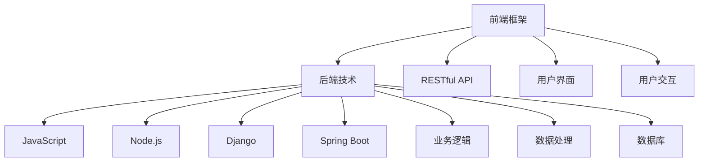

                 

# Web全栈开发：前端框架与后端技术融合

> 关键词：Web全栈开发, 前端框架, 后端技术, 融合, RESTful API, JavaScript, Node.js, React, Angular, Vue.js, Express, Django, Spring Boot, Microservices

## 1. 背景介绍

### 1.1 问题由来

随着互联网应用的日益复杂化，Web开发不再仅仅涉及前端交互和后端数据处理，而是需要跨学科的知识和技能。传统的前端和后端分离开发模式，难以满足现代Web应用对性能、可维护性和用户交互体验的要求。因此，Web全栈开发成为新一代开发者的必备技能，将前端框架和后端技术紧密融合，实现高效、可靠、直观的Web应用开发。

### 1.2 问题核心关键点

Web全栈开发的核心在于掌握前后端技术的融合与协同，具体关键点包括：
1. 选择合适的全栈框架和技术栈。
2. 设计合理的项目架构和组件结构。
3. 前后端数据的无缝对接与传递。
4. 用户交互和界面设计的统一与协调。
5. 前后端代码的自动部署与维护。

## 2. 核心概念与联系

### 2.1 核心概念概述

为更好地理解Web全栈开发，本节将介绍几个关键概念：

- **Web全栈开发**：指将前端开发和后端开发融合在同一个技术栈中，从前端界面设计、用户交互到后端数据处理、业务逻辑实现，全链路都在同一套开发工具下完成。
- **前端框架**：如React、Angular、Vue.js等，负责实现用户界面和交互逻辑。
- **后端技术**：如Node.js、Java、Python等，用于实现业务逻辑和数据处理。
- **RESTful API**：遵循REST原则设计的网络接口，便于前后端数据交换与调用。
- **JavaScript**：作为前端开发和后端Node.js的重要语言。
- **Node.js**：基于事件驱动的非阻塞I/O模型，适合实现高并发的后端服务。
- **Express**：基于Node.js的Web框架，快速搭建Web应用。
- **Django**：Python的Web框架，拥有丰富的第三方库和工具。
- **Spring Boot**：Java的微服务框架，支持分布式架构和快速开发。

这些概念之间的逻辑关系可以通过以下Mermaid流程图来展示：



这个流程图展示了几大关键概念之间的联系：

1. 前端框架负责构建用户界面和交互逻辑，为用户提供直观的操作体验。
2. 后端技术实现业务逻辑和数据处理，负责数据的存储与检索。
3. RESTful API用于前后端的接口定义和数据交换。
4. JavaScript是前端和后端开发中广泛使用的编程语言。
5. Node.js、Django、Spring Boot等后端技术框架为后端服务提供了基础支持。

这些概念共同构成了Web全栈开发的核心框架，使其能够高效、可靠地实现各类Web应用。通过理解这些概念，我们可以更好地把握Web全栈开发的技术基础和实现流程。

## 3. 核心算法原理 & 具体操作步骤
### 3.1 算法原理概述

Web全栈开发的核心算法原理，主要围绕着如何高效地实现前后端数据的无缝对接与传递，以及如何设计统一的开发架构和组件结构。具体来说，包括以下几个方面：

- **数据模型映射**：将前端的数据模型映射到后端的数据库模型，实现数据的持久化与更新。
- **状态管理与同步**：通过状态管理框架，如Redux、Vuex等，在前端实现组件间的数据共享与状态同步。
- **接口定义与调用**：定义RESTful API，通过前后端接口调用，实现数据的交换与处理。
- **组件复用与模板引擎**：利用组件复用技术，如React组件、Angular Component、Vue.js Component等，提高开发效率和代码复用性。
- **代码分离与集成**：将前端代码与后端代码分离，通过自动化构建工具，如Webpack、Gulp等，实现前端与后端的快速集成与部署。

### 3.2 算法步骤详解

Web全栈开发的步骤一般包括以下几个关键步骤：

**Step 1: 选择全栈框架和技术栈**
- 根据项目需求，选择合适的全栈框架，如React、Angular、Vue.js等。
- 选择合适的后端技术，如Node.js、Java、Python等。
- 根据项目规模和复杂度，选择合适的中间件和数据库。

**Step 2: 设计项目架构和组件结构**
- 确定项目整体架构，如分层架构、MVC架构、微服务架构等。
- 设计组件结构和组件间的数据传递方式。
- 确定接口的定义方式，如RESTful API、GraphQL等。

**Step 3: 实现前后端数据对接**
- 将前端数据模型映射到后端数据库模型，定义数据模型关系。
- 实现数据持久化与更新的逻辑，确保数据的完整性和一致性。
- 设计并实现RESTful API，前后端接口进行数据交换。

**Step 4: 实现用户交互与界面设计**
- 使用前端框架构建用户界面和交互逻辑。
- 使用UI设计工具，如Sketch、Figma等，设计用户界面。
- 实现用户交互效果，如表单验证、动画效果等。

**Step 5: 实现业务逻辑与数据处理**
- 使用后端技术实现业务逻辑，处理用户请求和响应。
- 实现数据的查询、插入、更新、删除等操作。
- 使用缓存、数据库索引等技术，提高数据处理效率。

**Step 6: 实现自动化构建与部署**
- 使用构建工具，如Webpack、Gulp等，实现前后端的自动化构建。
- 使用容器化技术，如Docker、Kubernetes等，实现应用的自动化部署。
- 集成持续集成(CI)和持续部署(CD)系统，实现代码的自动测试与部署。

**Step 7: 实现前后端数据同步**
- 使用状态管理框架，如Redux、Vuex等，在前端实现组件间的数据同步。
- 使用消息队列，如RabbitMQ、Kafka等，实现前后端数据的异步通信与同步。

以上是Web全栈开发的一般流程。在实际应用中，还需要根据具体项目需求，对各个环节进行优化设计，如改进接口调用方式，优化数据模型设计，采用组件复用技术等，以进一步提升开发效率和系统性能。

### 3.3 算法优缺点

Web全栈开发具有以下优点：
1. 提高开发效率：前后端集成在同一个技术栈下，能够快速构建和部署应用。
2. 简化开发流程：前后端代码分离，提高了代码的可维护性和可复用性。
3. 提升用户体验：统一的用户界面和交互逻辑，提供了更好的用户体验。
4. 增强安全性：前后端统一的身份认证和授权机制，提高了系统的安全性。

同时，Web全栈开发也存在一定的局限性：
1. 技术栈选择限制：选择全栈框架和技术栈时，需要综合考虑前端和后端的开发经验和技术能力。
2. 性能问题：全栈应用在处理高并发和高数据量时，可能会面临性能瓶颈。
3. 学习成本高：全栈开发需要掌握前后端技术，对开发者的技术栈要求较高。
4. 工具链复杂：全栈开发需要使用多款工具和库，工具链配置和管理较为复杂。

尽管存在这些局限性，但就目前而言，Web全栈开发仍然是大势所趋，其高效、统一的特点使得其在Web应用开发中具有重要的应用价值。未来相关研究的方向将更多地关注如何提升性能、降低学习成本和工具链复杂度，同时兼顾前后端的协同开发。

### 3.4 算法应用领域

Web全栈开发在多个领域都有广泛的应用，例如：

- **电子商务**：构建在线商店、购物车、订单管理等功能，通过全栈开发，实现高效的用户体验和订单处理。
- **内容管理系统**：如WordPress、Drupal等，使用全栈开发构建界面美观、功能丰富的内容管理系统。
- **社交网络**：如Facebook、Twitter等，通过全栈开发实现用户界面和即时通信功能。
- **企业应用**：如ERP系统、CRM系统等，通过全栈开发，构建高效的企业信息管理系统。
- **物联网**：通过全栈开发，实现物联网设备的监控和管理。

除了上述这些经典应用外，Web全栈开发还被创新性地应用到更多场景中，如智能家居、智慧城市、金融科技等，为各行各业带来了新的技术突破。随着Web技术的发展，相信全栈开发将在更多领域得到应用，进一步推动互联网技术的发展。

## 4. 数学模型和公式 & 详细讲解  
### 4.1 数学模型构建

在Web全栈开发中，常常涉及多种数学模型，如线性回归、逻辑回归、深度学习等。本节将介绍几个常见的数学模型及其构建方法。

假设我们要建立一个简单的线性回归模型，用于预测用户评分，其数学模型为：

$$
\hat{y} = \theta_0 + \theta_1 x_1 + \theta_2 x_2 + \ldots + \theta_n x_n
$$

其中，$y$ 为预测的用户评分，$x_1, x_2, \ldots, x_n$ 为特征变量，$\theta_0, \theta_1, \theta_2, \ldots, \theta_n$ 为模型参数。

我们将以上模型应用到Web全栈开发中的用户评分预测任务。具体来说，可以通过后端技术，如Python的Django框架，实现模型的训练和预测。步骤如下：

1. 收集用户评分数据，定义训练集和测试集。
2. 使用Django的机器学习库，如Scikit-learn，进行模型训练。
3. 将训练好的模型部署到后端服务，进行评分预测。
4. 在前端界面展示预测结果。

### 4.2 公式推导过程

以下是线性回归模型的推导过程。

设训练集为 $D=\{(x_i, y_i)\}_{i=1}^N$，其中 $x_i=(x_{i1}, x_{i2}, \ldots, x_{in})$ 为特征向量，$y_i$ 为标签。

线性回归模型的损失函数为：

$$
L(\theta) = \frac{1}{2N}\sum_{i=1}^N (y_i - (\theta_0 + \theta_1 x_{i1} + \theta_2 x_{i2} + \ldots + \theta_n x_{in}))^2
$$

通过梯度下降算法，求解最优的参数 $\theta$：

$$
\theta = \mathop{\arg\min}_{\theta} L(\theta)
$$

具体计算公式如下：

$$
\theta_0 = \frac{1}{N} \sum_{i=1}^N y_i
$$

$$
\theta_j = \frac{1}{N} \sum_{i=1}^N (x_{ij} - \bar{x}_j)(y_i - \bar{y})
$$

其中，$\bar{x}_j$ 和 $\bar{y}$ 分别为特征向量和标签的均值。

以上公式通过求解最小二乘法，得到了线性回归模型的最优参数 $\theta$。通过将模型部署到后端服务，结合前端界面展示，便可以实现用户评分预测的Web全栈开发。

### 4.3 案例分析与讲解

以下是一个简单的用户评分预测案例，展示如何通过Web全栈开发实现模型的训练和部署。

**Step 1: 数据准备**
- 收集用户评分数据，定义训练集和测试集。
- 使用Python的数据处理库，如Pandas，进行数据清洗和特征工程。

**Step 2: 模型训练**
- 使用Django的机器学习库，如Scikit-learn，进行线性回归模型的训练。
- 定义损失函数和优化算法，如均方误差损失函数和随机梯度下降算法。
- 使用交叉验证技术，评估模型的泛化能力。

**Step 3: 模型部署**
- 将训练好的模型保存为Pickle文件，部署到后端服务。
- 使用Django的视图函数，定义API接口，接受前端请求，并返回预测结果。

**Step 4: 前端展示**
- 使用JavaScript编写前端代码，构建用户界面。
- 通过AJAX技术，调用后端API接口，获取预测结果。
- 在前端界面展示预测结果，如评分、图表等。

**Step 5: 测试与优化**
- 使用Django的测试框架，进行前后端代码的单元测试和功能测试。
- 使用JMeter等性能测试工具，评估Web应用性能。
- 根据测试结果，优化代码和算法，提升系统性能和稳定性。

通过以上步骤，我们可以将线性回归模型成功地应用于Web全栈开发中的用户评分预测任务，展示了全栈开发的高效与便捷。

## 5. 项目实践：代码实例和详细解释说明
### 5.1 开发环境搭建

在进行Web全栈开发实践前，我们需要准备好开发环境。以下是使用Python进行Django开发的环境配置流程：

1. 安装Anaconda：从官网下载并安装Anaconda，用于创建独立的Python环境。

2. 创建并激活虚拟环境：
```bash
conda create -n django-env python=3.8 
conda activate django-env
```

3. 安装Django和其他依赖库：
```bash
pip install django scikit-learn pandas numpy
```

4. 安装各种工具包：
```bash
pip install matplotlib numpy pandas scikit-learn jupyter notebook ipython
```

完成上述步骤后，即可在`django-env`环境中开始开发实践。

### 5.2 源代码详细实现

这里我们以用户评分预测任务为例，给出使用Django和Scikit-learn进行Web全栈开发的PyTorch代码实现。

首先，定义模型和训练函数：

```python
from sklearn.linear_model import LinearRegression
from sklearn.model_selection import train_test_split
from sklearn.metrics import mean_squared_error
import pandas as pd
from django.shortcuts import render
from django.http import JsonResponse

# 定义模型
model = LinearRegression()

# 加载数据
data = pd.read_csv('data.csv')

# 划分训练集和测试集
X_train, X_test, y_train, y_test = train_test_split(data.drop('rating', axis=1), data['rating'], test_size=0.2, random_state=42)

# 训练模型
model.fit(X_train, y_train)

# 评估模型
train_score = model.score(X_train, y_train)
test_score = model.score(X_test, y_test)
mse_train = mean_squared_error(y_train, model.predict(X_train))
mse_test = mean_squared_error(y_test, model.predict(X_test))

def train_model(request):
    # 训练模型并返回评估指标
    return JsonResponse({
        'train_score': train_score,
        'test_score': test_score,
        'mse_train': mse_train,
        'mse_test': mse_test
    })
```

接着，定义视图函数和路由：

```python
from django.urls import path
from . import views

urlpatterns = [
    path('train/', views.train_model, name='train_model'),
]

```

最后，启动Django服务器并测试：

```bash
python manage.py runserver
```

在浏览器中访问`http://localhost:8000/train/`，即可看到训练模型并返回评估指标的JSON数据。

### 5.3 代码解读与分析

让我们再详细解读一下关键代码的实现细节：

**LinearRegression类**：
- 使用Scikit-learn库中的线性回归模型，进行评分预测。

**train_test_split函数**：
- 将数据集划分为训练集和测试集，采用80/20的划分比例，保证模型在测试集上的泛化能力。

**mean_squared_error函数**：
- 计算模型预测与真实标签之间的均方误差，评估模型预测的准确性。

**render和JsonResponse函数**：
- 使用Django的渲染和响应函数，将训练结果展示在前端界面上。

**train_model函数**：
- 训练模型并返回评估指标，使用Django的JsonResponse函数，将结果以JSON格式返回给前端。

**views模块**：
- 定义视图函数，使用Django的路由系统，将请求路由到对应的函数处理。

通过以上代码，我们可以看到Django和Scikit-learn结合使用的简单实现。Django提供了强大的Web框架和路由系统，Scikit-learn提供了丰富的机器学习算法和评估指标，两者结合，能够高效地实现Web全栈开发中的机器学习应用。

## 6. 实际应用场景
### 6.1 智能客服系统

基于Web全栈开发技术的智能客服系统，可以高效地实现前后端的无缝对接和数据传递。智能客服系统可以7x24小时不间断服务，快速响应客户咨询，用自然流畅的语言解答各类常见问题。

在技术实现上，可以收集企业内部的历史客服对话记录，将问题和最佳答复构建成监督数据，在此基础上对全栈开发模型进行微调。微调后的模型能够自动理解用户意图，匹配最合适的答案模板进行回复。对于客户提出的新问题，还可以接入检索系统实时搜索相关内容，动态组织生成回答。如此构建的智能客服系统，能大幅提升客户咨询体验和问题解决效率。

### 6.2 金融舆情监测

金融机构需要实时监测市场舆论动向，以便及时应对负面信息传播，规避金融风险。传统的人工监测方式成本高、效率低，难以应对网络时代海量信息爆发的挑战。基于Web全栈开发技术的金融舆情监测系统，可以高效地实现数据采集和分析，实时监测不同主题下的情感变化趋势，一旦发现负面信息激增等异常情况，系统便会自动预警，帮助金融机构快速应对潜在风险。

### 6.3 个性化推荐系统

当前的推荐系统往往只依赖用户的历史行为数据进行物品推荐，无法深入理解用户的真实兴趣偏好。基于Web全栈开发技术的个性化推荐系统，可以更好地挖掘用户行为背后的语义信息，从而提供更精准、多样的推荐内容。

在实践中，可以收集用户浏览、点击、评论、分享等行为数据，提取和用户交互的物品标题、描述、标签等文本内容。将文本内容作为模型输入，用户的后续行为（如是否点击、购买等）作为监督信号，在此基础上全栈开发模型进行微调。微调后的模型能够从文本内容中准确把握用户的兴趣点。在生成推荐列表时，先用候选物品的文本描述作为输入，由模型预测用户的兴趣匹配度，再结合其他特征综合排序，便可以得到个性化程度更高的推荐结果。

### 6.4 未来应用展望

随着Web全栈开发技术的不断发展，基于全栈开发技术的Web应用将在更多领域得到应用，为传统行业带来变革性影响。

在智慧医疗领域，基于全栈开发技术的医疗问答、病历分析、药物研发等应用将提升医疗服务的智能化水平，辅助医生诊疗，加速新药开发进程。

在智能教育领域，全栈开发技术可应用于作业批改、学情分析、知识推荐等方面，因材施教，促进教育公平，提高教学质量。

在智慧城市治理中，全栈开发技术可应用于城市事件监测、舆情分析、应急指挥等环节，提高城市管理的自动化和智能化水平，构建更安全、高效的未来城市。

此外，在企业生产、社会治理、文娱传媒等众多领域，基于全栈开发技术的Web应用也将不断涌现，为各行各业带来新的技术突破。随着全栈开发技术的不断演进，相信Web全栈开发必将在更广阔的应用领域大放异彩，深刻影响人类的生产生活方式。

## 7. 工具和资源推荐
### 7.1 学习资源推荐

为了帮助开发者系统掌握Web全栈开发的技术基础和实践技巧，这里推荐一些优质的学习资源：

1. Django官方文档：包含详细的开发指南和示例代码，适合初学者和进阶开发者。
2. Scikit-learn官方文档：介绍机器学习算法的详细使用方法和API接口，适合数据科学和机器学习领域的学习者。
3. React官方文档：介绍前端开发框架React的基本概念和使用方法，适合Web前端开发的学习者。
4. Vue.js官方文档：介绍前端开发框架Vue.js的基本概念和使用方法，适合Web前端开发的学习者。
5. Node.js官方文档：介绍后端开发框架Node.js的基本概念和使用方法，适合JavaScript开发者的学习者。
6. Django官方在线课程：提供系统的视频教程和练习任务，适合初学者快速上手。
7. React官方在线课程：提供系统的视频教程和练习任务，适合Web前端开发的学习者。
8. Vue.js官方在线课程：提供系统的视频教程和练习任务，适合Web前端开发的学习者。
9. Node.js官方在线课程：提供系统的视频教程和练习任务，适合JavaScript开发者的学习者。

通过对这些资源的学习实践，相信你一定能够快速掌握Web全栈开发的核心技术和实现方法。

### 7.2 开发工具推荐

高效的开发离不开优秀的工具支持。以下是几款用于Web全栈开发开发的常用工具：

1. Django：Python的Web框架，拥有丰富的第三方库和工具，适合后端开发。
2. Scikit-learn：Python的机器学习库，提供了多种机器学习算法和评估指标，适合数据分析和机器学习开发。
3. React：基于JavaScript的前端开发框架，适合Web前端开发。
4. Vue.js：基于JavaScript的前端开发框架，适合Web前端开发。
5. Node.js：基于JavaScript的后端开发框架，适合高并发的Web应用开发。
6. Weights & Biases：模型训练的实验跟踪工具，可以记录和可视化模型训练过程中的各项指标，方便对比和调优。
7. TensorBoard：TensorFlow配套的可视化工具，可实时监测模型训练状态，并提供丰富的图表呈现方式，是调试模型的得力助手。
8. JMeter：性能测试工具，可评估Web应用的性能和稳定性。

合理利用这些工具，可以显著提升Web全栈开发任务的开发效率，加快创新迭代的步伐。

### 7.3 相关论文推荐

Web全栈开发技术的发展源于学界的持续研究。以下是几篇奠基性的相关论文，推荐阅读：

1. "The Django Project: A Revolutionary Web Development Framework for Python"：Django的介绍和使用方法，适合Web开发的学习者。
2. "Scikit-learn: Machine Learning in Python"：Scikit-learn的介绍和使用方法，适合数据科学和机器学习领域的学习者。
3. "Reactive design patterns"：React的介绍和使用方法，适合Web前端开发的学习者。
4. "Vue.js 2.0 Documentation"：Vue.js的介绍和使用方法，适合Web前端开发的学习者。
5. "Node.js Developer Guide"：Node.js的介绍和使用方法，适合JavaScript开发者的学习者。
6. "Django for Beginners"：Django的介绍和使用方法，适合初学者快速上手。
7. "React for Beginners"：React的介绍和使用方法，适合Web前端开发的学习者。
8. "Vue.js for Beginners"：Vue.js的介绍和使用方法，适合Web前端开发的学习者。
9. "Node.js for Beginners"：Node.js的介绍和使用方法，适合JavaScript开发者的学习者。

这些论文代表了大语言模型微调技术的发展脉络。通过学习这些前沿成果，可以帮助研究者把握学科前进方向，激发更多的创新灵感。

## 8. 总结：未来发展趋势与挑战

### 8.1 总结

本文对Web全栈开发技术进行了全面系统的介绍。首先阐述了Web全栈开发的核心概念和技术基础，明确了前后端融合的开发模式和实践流程。其次，从原理到实践，详细讲解了全栈开发的核心算法和操作步骤，给出了全栈开发任务开发的完整代码实例。同时，本文还广泛探讨了全栈开发技术在多个行业领域的应用前景，展示了全栈开发的高效与便捷。

通过本文的系统梳理，可以看到，Web全栈开发技术正在成为Web应用开发的重要范式，极大地提高了Web应用的开发效率和性能。全栈开发技术的高效、统一的特点使得其在Web应用开发中具有重要的应用价值。未来相关研究的方向将更多地关注如何提升性能、降低学习成本和工具链复杂度，同时兼顾前后端的协同开发。

### 8.2 未来发展趋势

展望未来，Web全栈开发技术将呈现以下几个发展趋势：

1. 技术栈更加丰富。随着全栈开发技术的不断演进，将出现更多兼容前后端开发的框架和库，如Next.js、Nest.js等，提供更灵活的全栈开发解决方案。
2. 微服务架构普及。全栈开发将更多地采用微服务架构，实现系统解耦和灵活扩展。
3. 性能优化更加注重。全栈开发应用将采用更多的性能优化技术，如缓存、异步编程、资源复用等，提升系统响应速度和并发能力。
4. 自动化开发工具普及。基于DevOps的理念，自动化构建、测试、部署等工具将更加普及，提升开发效率和代码质量。
5. 前后端代码分离更加精细。采用微前端技术，实现代码分离，提高开发和维护效率。
6. 前端框架更加灵活。未来将出现更多前端框架，如Svelte、Elm等，提供更高效、更灵活的开发体验。

以上趋势凸显了Web全栈开发技术的广阔前景。这些方向的探索发展，必将进一步提升Web全栈开发系统的性能和应用范围，为互联网技术的发展带来新的突破。

### 8.3 面临的挑战

尽管Web全栈开发技术已经取得了显著的进展，但在迈向更加智能化、普适化应用的过程中，它仍面临着诸多挑战：

1. 技术栈选择限制：选择全栈框架和技术栈时，需要综合考虑前端和后端的开发经验和技术能力。
2. 性能问题：全栈应用在处理高并发和高数据量时，可能会面临性能瓶颈。
3. 学习成本高：全栈开发需要掌握前后端技术，对开发者的技术栈要求较高。
4. 工具链复杂：全栈开发需要使用多款工具和库，工具链配置和管理较为复杂。
5. 代码分离与集成：采用微前端技术时，如何实现前后端代码的无缝对接和集成，仍是一个需要解决的问题。

尽管存在这些挑战，但Web全栈开发技术的优势依然显著，其高效、统一的特点使得其在Web应用开发中具有重要的应用价值。未来相关研究需要在性能优化、学习成本降低、工具链简化、代码分离与集成等方面进行不断探索和优化。

### 8.4 研究展望

面向未来，Web全栈开发技术需要在以下几个方面寻求新的突破：

1. 探索无监督和半监督全栈开发方法。摆脱对大规模标注数据的依赖，利用自监督学习、主动学习等无监督和半监督范式，最大限度利用非结构化数据，实现更加灵活高效的全栈开发。
2. 研究参数高效和计算高效的微全栈开发范式。开发更加参数高效的微全栈开发方法，在固定大部分预训练参数的同时，只更新极少量的任务相关参数。同时优化全栈开发模型的计算图，减少前向传播和反向传播的资源消耗，实现更加轻量级、实时性的部署。
3. 融合因果和对比学习范式。通过引入因果推断和对比学习思想，增强全栈开发模型建立稳定因果关系的能力，学习更加普适、鲁棒的语言表征，从而提升模型泛化性和抗干扰能力。
4. 引入更多先验知识。将符号化的先验知识，如知识图谱、逻辑规则等，与神经网络模型进行巧妙融合，引导全栈开发过程学习更准确、合理的语言模型。同时加强不同模态数据的整合，实现视觉、语音等多模态信息与文本信息的协同建模。
5. 结合因果分析和博弈论工具。将因果分析方法引入全栈开发模型，识别出模型决策的关键特征，增强输出解释的因果性和逻辑性。借助博弈论工具刻画人机交互过程，主动探索并规避模型的脆弱点，提高系统稳定性。
6. 纳入伦理道德约束。在全栈开发模型的训练目标中引入伦理导向的评估指标，过滤和惩罚有偏见、有害的输出倾向。同时加强人工干预和审核，建立模型行为的监管机制，确保输出符合人类价值观和伦理道德。

这些研究方向的探索，必将引领Web全栈开发技术迈向更高的台阶，为构建安全、可靠、可解释、可控的智能系统铺平道路。面向未来，Web全栈开发技术还需要与其他人工智能技术进行更深入的融合，如知识表示、因果推理、强化学习等，多路径协同发力，共同推动自然语言理解和智能交互系统的进步。只有勇于创新、敢于突破，才能不断拓展全栈开发技术的边界，让智能技术更好地造福人类社会。

## 9. 附录：常见问题与解答

**Q1：Web全栈开发是否适用于所有Web应用？**

A: Web全栈开发在大多数Web应用上都能取得不错的效果，特别是对于数据量较小的任务。但对于一些特定领域的任务，如医学、法律等，仅仅依靠通用语料预训练的模型可能难以很好地适应。此时需要在特定领域语料上进一步预训练，再进行全栈开发，才能获得理想效果。此外，对于一些需要时效性、个性化很强的任务，如对话、推荐等，全栈开发方法也需要针对性的改进优化。

**Q2：采用全栈开发时如何选择合适的技术栈？**

A: 选择全栈框架和技术栈时，需要综合考虑前端和后端的开发经验和技术能力。可以根据项目需求和团队资源，选择适合的框架和技术栈。对于初学者，可以从简单的技术栈开始，如Django和React，逐步学习和积累经验。对于有一定经验的开发者，可以选择复杂的技术栈，如Next.js和Spring Boot，实现更高性能和更灵活的开发。

**Q3：全栈开发过程中需要注意哪些性能优化问题？**

A: 全栈开发过程中，需要注意以下几个性能优化问题：
1. 使用缓存技术，如Redis，减少数据库的查询次数。
2. 使用异步编程，如Node.js的异步非阻塞I/O模型，提升响应速度。
3. 使用资源复用技术，如Apache Kafka，实现数据的异步生产和消费。
4. 使用CDN加速静态资源，如图片、CSS、JS等。
5. 使用负载均衡技术，如Nginx，实现高并发下的性能优化。

通过以上优化措施，可以显著提升全栈开发应用的性能和稳定性。

**Q4：全栈开发中如何实现前后端数据的无缝对接与传递？**

A: 全栈开发中，前后端数据的无缝对接与传递可以通过以下几种方式实现：
1. RESTful API：定义前后端的接口规范，使用HTTP协议进行数据交换。
2. GraphQL：使用GraphQL查询语言，动态定义前后端的数据结构。
3. WebSocket：使用WebSocket协议，实现实时数据的双向通信。
4. Redis：使用Redis消息队列，实现异步数据的传递和同步。

通过以上方式，可以实现全栈开发应用中前后端数据的高效传递和协同开发。

**Q5：全栈开发中如何实现组件复用和模块化设计？**

A: 全栈开发中，可以通过以下方式实现组件复用和模块化设计：
1. 组件复用技术：如React组件、Angular Component、Vue.js Component等，提高开发效率和代码复用性。
2. 模块化设计：将项目拆分为多个模块，如前后端模块、业务模块、数据模块等，便于管理和维护。
3. 服务化封装：将前后端代码封装为独立的服务模块，便于集成和部署。

通过以上方式，可以实现全栈开发应用中组件复用和模块化设计，提升开发效率和系统稳定性。

---

作者：禅与计算机程序设计艺术 / Zen and the Art of Computer Programming

