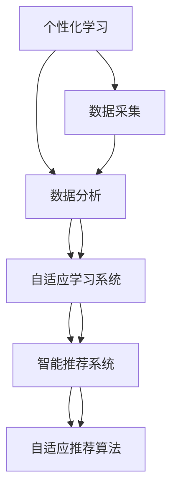

                 

# 个性化学习：人类计算如何改变教育

> 关键词：个性化学习,教育技术,人类计算,数据科学,智能教育,深度学习

## 1. 背景介绍

### 1.1 问题由来

教育一直是人类社会发展的重要推动力。但传统的教育模式往往“千人一面”，难以适应个体差异，导致教育效果参差不齐。随着信息技术的迅猛发展，尤其是大数据和人工智能技术的进步，个性化学习正在逐步改变这一现状，为教育的未来带来新的希望。

个性化学习旨在通过数据分析和算法设计，为每个学生量身定制个性化的学习方案，提升学习效率和效果。它可以通过智能推荐、自适应学习系统、数据分析等技术手段，根据学生的学习行为、兴趣、能力等特点，动态调整教学内容、节奏和方法，实现因材施教。

### 1.2 问题核心关键点

个性化学习的大致框架可以归纳为：
1. **数据采集**：收集学生的学习行为、成绩、反馈等数据，作为个性化学习的基础。
2. **数据分析**：对采集到的数据进行预处理、特征提取和建模分析，挖掘学生的个性化特征。
3. **算法设计**：基于学习理论，设计个性化推荐算法，实现自适应学习。
4. **学习实施**：利用算法生成个性化学习路径和资源，辅助学生自主学习。
5. **效果评估**：通过实验和反馈，持续优化个性化学习系统。

在以上框架中，数据采集和分析、算法设计和实施、效果评估和优化是三个关键环节。本文将围绕这三个环节展开，全面探讨如何通过数据科学和人工智能技术实现个性化学习。

## 2. 核心概念与联系

### 2.1 核心概念概述

为更好地理解个性化学习，本节将介绍几个密切相关的核心概念：

- **个性化学习**：根据学生的个体差异，量身定制学习计划、内容和方式，提升学习效果的一种教育模式。
- **自适应学习系统**：利用数据分析和机器学习技术，动态调整教学内容和策略，实现个性化教学的系统。
- **智能推荐系统**：通过分析用户的行为和偏好，推荐个性化的学习资源和学习路径的系统。
- **自适应推荐算法**：在智能推荐系统中，根据用户历史行为和实时反馈，动态调整推荐策略的算法。
- **数据科学**：运用统计学、数据挖掘和数据分析等方法，从大规模数据中提取有用信息，支持决策制定的学科。
- **人工智能**：通过机器学习和深度学习等技术手段，实现问题求解和智能决策的系统。
- **人类计算**：通过大规模人群协作，利用人的智慧进行计算和问题解决的方式。

这些核心概念之间的逻辑关系可以通过以下Mermaid流程图来展示：



这个流程图展示了个性化学习的核心概念及其之间的关系：

1. 个性化学习通过数据采集和分析，挖掘学生的个性化特征。
2. 数据分析结果用于设计自适应学习系统，动态调整教学内容。
3. 自适应学习系统通过智能推荐系统，为学生推荐个性化学习资源。
4. 智能推荐系统利用自适应推荐算法，实时调整推荐策略。

## 3. 核心算法原理 & 具体操作步骤
### 3.1 算法原理概述

个性化学习的基本原理是通过数据分析和算法设计，发现学生在学习过程中的行为模式和特征，据此生成个性化的学习路径和资源。核心算法通常包括以下几个步骤：

1. **数据预处理**：清洗和格式化原始数据，去除噪音，提取有用特征。
2. **模型训练**：使用机器学习或深度学习算法，训练学生特征和推荐策略的模型。
3. **推荐实现**：根据模型输出，生成个性化的学习资源推荐。
4. **效果评估**：使用反馈数据，评估推荐系统的准确性和效果，持续优化模型。

### 3.2 算法步骤详解

#### 3.2.1 数据预处理

数据预处理是个性化学习的第一步。其目的是对原始数据进行清洗和转换，提取有用特征。具体步骤如下：

1. **数据清洗**：去除异常值和缺失值，处理重复数据。
2. **数据转换**：将原始数据转换为适合算法处理的格式，如时间序列、分类数据等。
3. **特征提取**：从原始数据中提取有用的特征，如学生的学习时长、学习频率、测试成绩等。

#### 3.2.2 模型训练

模型训练是个性化学习的核心步骤。其目的是通过学习学生的特征，预测推荐策略。具体步骤如下：

1. **选择模型**：选择合适的机器学习或深度学习模型，如决策树、随机森林、协同过滤、神经网络等。
2. **数据分割**：将数据集划分为训练集、验证集和测试集，防止过拟合。
3. **模型训练**：在训练集上训练模型，使用交叉验证等方法优化超参数。
4. **模型评估**：在验证集上评估模型的准确性和泛化能力，调整模型参数。

#### 3.2.3 推荐实现

推荐实现是个性化学习的关键步骤。其目的是根据学生的特征，生成个性化的学习资源推荐。具体步骤如下：

1. **输入特征**：将学生的特征输入推荐模型。
2. **计算相似度**：计算学生与其他学生或资源的相似度。
3. **生成推荐**：根据相似度，生成推荐资源列表。
4. **实时调整**：根据实时反馈，动态调整推荐策略。

#### 3.2.4 效果评估

效果评估是个性化学习的最后一步。其目的是评估推荐系统的准确性和效果，持续优化模型。具体步骤如下：

1. **收集反馈**：收集学生的学习反馈和效果数据。
2. **分析数据**：分析反馈数据，评估推荐系统的准确性和效果。
3. **调整策略**：根据分析结果，调整推荐策略和模型参数。
4. **循环迭代**：持续收集反馈数据，进行迭代优化。

### 3.3 算法优缺点

个性化学习的算法具有以下优点：
1. **高效精准**：通过大规模数据分析，个性化学习能够精准推荐适合学生的学习资源。
2. **动态调整**：自适应学习系统能够动态调整教学内容和策略，适应学生的学习节奏。
3. **个性化支持**：个性化学习能够根据学生的特征和偏好，量身定制学习方案。
4. **持续优化**：通过反馈数据，个性化学习能够不断优化推荐策略，提升学习效果。

同时，个性化学习也存在一些局限性：
1. **数据隐私**：个性化学习需要收集和处理大量学生数据，可能涉及隐私问题。
2. **算法复杂**：个性化学习涉及复杂的机器学习和深度学习算法，对技术要求较高。
3. **资源依赖**：个性化学习需要大量的计算资源和存储空间，对硬件设施要求较高。
4. **数据质量**：个性化学习的效果依赖于数据的质量和多样性，低质量数据可能导致推荐不准确。

尽管存在这些局限性，但就目前而言，个性化学习已经成为教育领域的一个重要趋势，为提升教育质量和效率提供了新的手段。

### 3.4 算法应用领域

个性化学习已经在多个教育领域得到了广泛应用，如：

- **基础教育**：利用数据分析和智能推荐，提升中小学的个性化教学效果。
- **高等教育**：为大学生提供个性化的课程推荐和学习路径规划。
- **职业教育**：根据学生的职业兴趣和能力，推荐适合的培训资源和项目。
- **在线教育**：通过智能推荐系统，为在线课程选择和课程完成提供个性化支持。
- **企业培训**：利用自适应学习系统，为员工提供个性化的培训资源和路径。

除了上述这些经典领域外，个性化学习还被创新性地应用到更多场景中，如可穿戴设备监测学习行为、虚拟现实实验室进行模拟实验、智能学习助手解答学习问题等，为教育技术带来了新的突破。

## 4. 数学模型和公式 & 详细讲解 & 举例说明
### 4.1 数学模型构建

本节将使用数学语言对个性化学习的推荐算法进行更加严格的刻画。

记学生特征为 $X$，推荐资源为 $Y$。假设推荐任务为 $T$，则推荐目标为最小化预测误差：

$$
\min_{\theta} \frac{1}{N} \sum_{i=1}^N \ell(f_{\theta}(x_i), y_i)
$$

其中 $f_{\theta}(x)$ 为推荐模型的预测函数，$\ell$ 为损失函数，$\theta$ 为模型参数。

### 4.2 公式推导过程

以下我们以协同过滤算法为例，推导其基本数学模型和推荐公式。

假设学生集合为 $U$，资源集合为 $I$，学生对资源的评分矩阵为 $R$。协同过滤算法的目标是预测学生对未评分资源的评分，从而生成推荐列表。

协同过滤算法包括基于用户的协同过滤和基于项目的协同过滤两种方法。这里我们以基于用户的协同过滤为例进行推导。

假设用户 $u$ 对资源 $i$ 的评分 $r_{ui}$ 已知的资源集合为 $N_{ui}$，则协同过滤算法的推荐公式为：

$$
\hat{r}_{iu} = \hat{\theta}^T \phi(x_u)
$$

其中 $\hat{\theta}$ 为模型参数，$\phi(x_u)$ 为特征提取函数，$x_u$ 为学生 $u$ 的特征向量。

### 4.3 案例分析与讲解

**案例分析：某在线教育平台的学生个性化推荐系统**

某在线教育平台通过分析学生的学习行为和成绩，设计了个性化推荐系统。系统将学生的学习时长、成绩、学习兴趣等信息作为输入特征，使用协同过滤算法进行推荐。

具体步骤如下：

1. **数据采集**：平台收集学生的学习行为数据，如学习时长、学习频率、测试成绩等。
2. **数据预处理**：对数据进行清洗和转换，提取有用的特征。
3. **模型训练**：使用协同过滤算法，训练学生特征和推荐策略的模型。
4. **推荐实现**：根据模型输出，生成个性化的学习资源推荐。
5. **效果评估**：使用学生的学习反馈和效果数据，评估推荐系统的准确性和效果，持续优化模型。

## 5. 项目实践：代码实例和详细解释说明
### 5.1 开发环境搭建

在进行个性化学习项目实践前，我们需要准备好开发环境。以下是使用Python进行Scikit-learn开发的Python环境配置流程：

1. 安装Anaconda：从官网下载并安装Anaconda，用于创建独立的Python环境。

2. 创建并激活虚拟环境：
```bash
conda create -n personalized-learning python=3.8 
conda activate personalized-learning
```

3. 安装Scikit-learn：
```bash
pip install scikit-learn
```

4. 安装各类工具包：
```bash
pip install numpy pandas scikit-learn matplotlib tqdm jupyter notebook ipython
```

完成上述步骤后，即可在`personalized-learning`环境中开始个性化学习项目实践。

### 5.2 源代码详细实现

下面我们以协同过滤算法为例，给出使用Scikit-learn库进行个性化学习的PyTorch代码实现。

首先，定义数据处理函数：

```python
from sklearn.datasets import load_breast_cancer
from sklearn.model_selection import train_test_split
from sklearn.metrics import mean_squared_error
from sklearn.decomposition import TruncatedSVD
import numpy as np

def load_data():
    data = load_breast_cancer()
    X = data.data
    y = data.target
    X_train, X_test, y_train, y_test = train_test_split(X, y, test_size=0.2, random_state=42)
    return X_train, X_test, y_train, y_test
```

然后，定义协同过滤算法的推荐函数：

```python
class CollaborativeFiltering:
    def __init__(self, n_components=50, alpha=0.01, max_iter=100):
        self.n_components = n_components
        self.alpha = alpha
        self.max_iter = max_iter
        
    def fit(self, X_train, y_train):
        self.U, self.s = self._svd(X_train, y_train)
    
    def predict(self, X_test):
        return self.U @ self.s @ self.s.T @ X_test
    
    def _svd(self, X_train, y_train):
        U, s, V = svd(X_train, full_matrices=False)
        return U, s
    
    def _regularization(self, U):
        return (U**2).sum() + self.alpha * (U**2).sum(axis=1) @ (1 / np.abs(U**2)).sum(axis=1)
    
    def fit_transform(self, X_train, y_train):
        U, s = self._svd(X_train, y_train)
        s = np.diag(s)
        self.U = U
        self.s = s
        return self
```

最后，启动推荐系统：

```python
from sklearn.metrics import mean_squared_error
from sklearn.decomposition import TruncatedSVD

X_train, X_test, y_train, y_test = load_data()

svd = CollaborativeFiltering(n_components=50, alpha=0.01, max_iter=100)
svd.fit_transform(X_train, y_train)

X_pred = svd.predict(X_test)
mse = mean_squared_error(y_test, X_pred)
print(f"Mean Squared Error: {mse}")
```

以上就是使用Scikit-learn库进行协同过滤算法的个性化学习推荐系统的完整代码实现。可以看到，Scikit-learn库提供了方便的工具和算法接口，使得个性化学习项目的开发变得简洁高效。

### 5.3 代码解读与分析

让我们再详细解读一下关键代码的实现细节：

**load_data函数**：
- 使用Scikit-learn的`load_breast_cancer`函数加载乳腺癌数据集，并划分为训练集和测试集。
- 返回训练集和测试集的特征和标签。

**CollaborativeFiltering类**：
- 定义了协同过滤算法的基本结构和参数，包括奇异值分解(SVD)的维度、正则化系数、迭代次数等。
- `fit`方法：在训练集上训练SVD模型，计算用户-资源相似度矩阵。
- `predict`方法：根据训练好的模型，生成个性化推荐。
- `_svd`方法：内部封装了SVD算法的实现，计算用户-资源相似度矩阵。
- `_regularization`方法：计算正则化项，防止过拟合。
- `fit_transform`方法：将训练集数据进行奇异值分解，并计算用户-资源相似度矩阵，用于后续预测。

**启动推荐系统**：
- 加载数据集。
- 实例化协同过滤算法，设置SVD参数。
- 训练模型，并进行奇异值分解。
- 使用训练好的模型，对测试集进行预测。
- 计算预测结果和真实标签之间的均方误差，评估推荐系统的效果。

可以看到，Scikit-learn库提供的算法接口和工具，大大简化了个性化学习项目的开发过程。开发者可以更专注于算法的实现和性能优化。

当然，工业级的系统实现还需考虑更多因素，如模型的保存和部署、超参数的自动搜索、更灵活的任务适配层等。但核心的个性化推荐算法基本与此类似。

## 6. 实际应用场景
### 6.1 个性化学习系统

个性化学习系统已经广泛应用于教育领域，帮助学生实现高效自主学习。传统的一对多教学模式难以满足个体差异，个性化学习系统则能够根据每个学生的学习特征，动态调整教学内容和策略，提升学习效果。

在技术实现上，可以设计自适应学习系统，收集学生的学习行为和反馈数据，基于协同过滤等算法进行个性化推荐。学习系统能够实时调整学习路径和资源，引导学生进行自主学习。

### 6.2 企业培训

企业在员工培训中也需要根据员工的需求和能力，提供个性化的培训资源和路径。个性化学习系统可以根据员工的历史学习记录和反馈，推荐适合的培训课程和项目，提高培训效果。

在技术实现上，可以设计自适应学习系统，收集员工的培训数据和反馈，使用协同过滤等算法进行个性化推荐。培训系统能够动态调整培训内容和节奏，适应员工的个性化需求。

### 6.3 智能教育平台

智能教育平台通过数据分析和算法设计，提供个性化的课程推荐和学习路径规划。平台能够根据学生的学习行为和反馈，动态调整课程内容和节奏，提升学习效果。

在技术实现上，可以设计自适应学习系统，收集学生的学习行为和反馈数据，基于协同过滤等算法进行个性化推荐。教育平台能够实时调整课程内容和节奏，引导学生进行自主学习。

### 6.4 未来应用展望

随着个性化学习技术的不断成熟，未来将有更多行业受益于个性化学习。

在智慧医疗领域，个性化学习可以为患者提供个性化的诊疗方案和治疗路径。智能医疗平台能够根据患者的疾病特征和历史诊疗记录，推荐适合的诊疗方案和治疗路径，提升治疗效果。

在智能娱乐领域，个性化学习可以为用户提供个性化的娱乐体验。智能推荐系统能够根据用户的兴趣爱好，推荐适合的电影、音乐、书籍等娱乐内容，提升用户体验。

在智能家居领域，个性化学习可以为家庭成员提供个性化的家居控制方案。智能家居系统能够根据家庭成员的生活习惯和偏好，推荐适合的家居控制方案，提升生活质量。

总之，个性化学习技术的应用领域将不断拓展，为各行各业带来新的机遇和挑战。未来，个性化学习技术将更加普及，为人们提供更加智能、高效、个性化的服务和体验。

## 7. 工具和资源推荐
### 7.1 学习资源推荐

为了帮助开发者系统掌握个性化学习技术，这里推荐一些优质的学习资源：

1. **机器学习课程**：斯坦福大学开设的机器学习课程，系统介绍了机器学习的基本概念和算法，适合初学者入门。
2. **深度学习课程**：Coursera上的深度学习课程，深入讲解了深度学习的基本原理和应用。
3. **Python编程课程**：Python官方文档和相关书籍，提供了Python编程的基础知识和实战案例。
4. **个性化学习框架**：推荐使用Scikit-learn和TensorFlow等机器学习库，提供了丰富的算法和工具，方便开发和应用。
5. **在线学习平台**：Coursera、edX、Udacity等在线学习平台，提供了大量个性化学习的课程和项目，适合学习实践。

通过对这些资源的学习实践，相信你一定能够快速掌握个性化学习技术的精髓，并用于解决实际的教育问题。

### 7.2 开发工具推荐

高效的开发离不开优秀的工具支持。以下是几款用于个性化学习开发的常用工具：

1. **Python**：Python语言简洁高效，拥有丰富的机器学习和数据科学库，适合个性化学习项目开发。
2. **Scikit-learn**：Scikit-learn提供了简单易用的机器学习算法接口，支持快速搭建个性化学习系统。
3. **TensorFlow**：TensorFlow是Google开发的深度学习框架，提供了强大的计算图和模型训练能力，适合复杂的个性化学习项目。
4. **Jupyter Notebook**：Jupyter Notebook是一个交互式开发环境，支持Python和多种机器学习库，适合个性化学习项目的快速迭代和实验。
5. **PyTorch**：PyTorch是Facebook开发的深度学习框架，提供了灵活的动态计算图和丰富的优化器，适合个性化学习项目的开发和应用。

合理利用这些工具，可以显著提升个性化学习项目的开发效率，加快创新迭代的步伐。

### 7.3 相关论文推荐

个性化学习的研究源于学界的持续研究。以下是几篇奠基性的相关论文，推荐阅读：

1. **个性化学习算法**：Zachary Lipton等人提出的个性化推荐算法，探索了基于协同过滤和矩阵分解的个性化学习。
2. **深度学习在教育中的应用**：Yoshua Bengio等人提出的深度学习在教育中的应用，探讨了深度学习在个性化学习中的潜力和挑战。
3. **自适应学习系统**：Ruth F. Hazzard等人提出的自适应学习系统，设计了基于模型的自适应学习框架，支持个性化学习。
4. **学习分析技术**：ChristianIDall等人提出的学习分析技术，探索了如何通过数据分析支持个性化学习。
5. **智能推荐系统**：Amit Poria等人提出的智能推荐系统，设计了基于协同过滤和内容过滤的推荐算法，支持个性化学习。

这些论文代表了个性化学习技术的发展脉络。通过学习这些前沿成果，可以帮助研究者把握学科前进方向，激发更多的创新灵感。

## 8. 总结：未来发展趋势与挑战
### 8.1 总结

本文对个性化学习技术进行了全面系统的介绍。首先阐述了个性化学习的基本框架和核心概念，明确了个性化学习在提升教育效果、优化企业培训等方面的独特价值。其次，从数据采集、分析、模型训练、推荐实现、效果评估等方面，详细讲解了个性化学习的基本原理和操作步骤。同时，本文还广泛探讨了个性化学习在教育、企业培训、智能教育平台等诸多领域的应用前景，展示了个性化学习技术的广阔前景。此外，本文精选了个性化学习技术的各类学习资源，力求为读者提供全方位的技术指引。

通过本文的系统梳理，可以看到，个性化学习技术正在成为教育领域的一个重要趋势，为提升教育质量和效率提供了新的手段。未来，伴随数据科学和人工智能技术的持续进步，个性化学习必将在更多领域得到应用，为各行各业带来新的机遇和挑战。

### 8.2 未来发展趋势

展望未来，个性化学习技术将呈现以下几个发展趋势：

1. **数据融合与跨平台应用**：未来个性化学习将更加注重数据融合，将不同平台、不同来源的数据进行整合，提升推荐的准确性和鲁棒性。
2. **自适应学习系统的普及**：随着技术的发展，自适应学习系统将更加普及，提升个性化学习的效果。
3. **多模态学习**：个性化学习将探索多模态数据的融合，如文本、图像、语音等，提升学习效果的全面性。
4. **知识图谱的引入**：个性化学习将引入知识图谱，利用图结构进行更深入的特征提取和推理，提升推荐效果。
5. **实时推荐**：个性化学习将实现实时推荐，利用大数据技术进行实时分析，提升推荐的及时性。
6. **个性化学习系统的可扩展性**：未来个性化学习系统将更加注重可扩展性，支持大规模数据处理和实时计算。

以上趋势凸显了个性化学习技术的广阔前景。这些方向的探索发展，必将进一步提升个性化学习的效果和应用范围，为各行各业带来新的机遇和挑战。

### 8.3 面临的挑战

尽管个性化学习技术已经取得了瞩目成就，但在迈向更加智能化、普适化应用的过程中，它仍面临着诸多挑战：

1. **数据隐私**：个性化学习需要收集和处理大量学生数据，可能涉及隐私问题。如何保护数据隐私，确保数据安全，将是未来需要解决的重要问题。
2. **算法复杂性**：个性化学习涉及复杂的机器学习和深度学习算法，对技术要求较高。如何降低算法复杂性，提升模型效率，将是未来需要解决的重要问题。
3. **数据质量**：个性化学习的效果依赖于数据的质量和多样性，低质量数据可能导致推荐不准确。如何提高数据质量，确保数据多样性，将是未来需要解决的重要问题。
4. **资源依赖**：个性化学习需要大量的计算资源和存储空间，对硬件设施要求较高。如何降低资源依赖，提升系统效率，将是未来需要解决的重要问题。
5. **模型泛化性**：个性化学习模型在不同数据集上的泛化性较低，可能导致推荐效果不稳定。如何提高模型泛化性，确保模型适应不同场景，将是未来需要解决的重要问题。

正视个性化学习面临的这些挑战，积极应对并寻求突破，将是个性化学习技术走向成熟的必由之路。相信随着学界和产业界的共同努力，这些挑战终将一一被克服，个性化学习必将在构建人机协同的智能时代中扮演越来越重要的角色。

### 8.4 研究展望

面对个性化学习所面临的种种挑战，未来的研究需要在以下几个方面寻求新的突破：

1. **探索无监督和半监督学习**：摆脱对大规模标注数据的依赖，利用自监督学习、主动学习等无监督和半监督范式，最大限度利用非结构化数据，实现更加灵活高效的个性化学习。
2. **开发计算高效的算法**：开发更加参数高效的算法，在固定大部分预训练参数的同时，只更新极少量的任务相关参数。同时优化算法计算图，减少前向传播和反向传播的资源消耗，实现更加轻量级、实时性的部署。
3. **引入因果分析和博弈论工具**：将因果分析方法引入个性化学习，识别出学习过程的关键特征，增强推荐决策的因果性和逻辑性。借助博弈论工具刻画人机交互过程，主动探索并规避学习过程的脆弱点，提高系统稳定性。
4. **引入外部知识库和规则库**：将符号化的先验知识，如知识图谱、逻辑规则等，与神经网络模型进行巧妙融合，引导个性化学习过程学习更准确、合理的知识表示。
5. **结合因果分析和博弈论工具**：将因果分析方法引入个性化学习，识别出学习过程的关键特征，增强推荐决策的因果性和逻辑性。借助博弈论工具刻画人机交互过程，主动探索并规避学习过程的脆弱点，提高系统稳定性。
6. **纳入伦理道德约束**：在个性化学习中，如何处理用户隐私、数据安全和伦理问题，确保模型的公平性、透明性和可解释性，将是未来需要解决的重要问题。

这些研究方向将引领个性化学习技术迈向更高的台阶，为构建安全、可靠、可解释、可控的个性化学习系统铺平道路。面向未来，个性化学习技术还需要与其他人工智能技术进行更深入的融合，如知识表示、因果推理、强化学习等，多路径协同发力，共同推动个性化学习的进步。只有勇于创新、敢于突破，才能不断拓展个性化学习的边界，让智能技术更好地造福人类社会。

## 9. 附录：常见问题与解答

**Q1：个性化学习是否适用于所有学生？**

A: 个性化学习旨在根据学生的学习特征和兴趣，提供个性化的学习资源和路径，但并不适用于所有学生。对于年龄较小的学生，由于认知和情感发展尚不成熟，个性化的学习路径和内容可能需要适度调整。此外，对于一些需要集中注意力和持久耐力的任务，如编程、数学等，过度的个性化可能导致学习负担加重。因此，个性化学习需要根据学生的具体情况，灵活调整学习路径和内容。

**Q2：如何评估个性化学习的效果？**

A: 个性化学习的效果评估通常包括以下几个方面：

1. **学习效率**：评估学生完成学习任务所需的时间和次数，衡量个性化学习是否提升了学习效率。
2. **学习效果**：通过测试和考试等手段，评估学生对学习内容的掌握情况，衡量个性化学习是否提升了学习效果。
3. **学习满意度**：通过调查问卷和反馈机制，评估学生对个性化学习系统的满意度和认同度，衡量个性化学习是否提升了学习体验。
4. **学习适应性**：通过分析学习行为和数据，评估个性化学习系统是否能够适应学生的需求变化，衡量个性化学习的适应性和灵活性。
5. **学习公平性**：通过分析不同学生之间的学习效果差异，评估个性化学习系统是否能够提供公平的学习机会，衡量个性化学习的公平性。

通过综合评估以上几个方面，可以全面了解个性化学习的效果，并进行持续优化。

**Q3：个性化学习是否需要教师的参与？**

A: 个性化学习系统可以自主推荐学习资源和路径，但教师的参与仍然是必要的。教师可以监督学生的学习过程，解答学生的疑惑，提供个性化的指导和反馈。教师的参与可以弥补个性化学习系统的局限性，提升学习效果和质量。

**Q4：个性化学习系统如何应对学生反馈？**

A: 个性化学习系统通常设计有反馈机制，用于收集学生的学习反馈和效果数据。系统可以根据学生的反馈，调整推荐策略和模型参数，提升推荐效果。具体步骤如下：

1. **收集反馈**：通过调查问卷、在线反馈、行为数据等手段，收集学生的学习反馈和效果数据。
2. **分析数据**：对反馈数据进行分析，评估个性化学习系统的效果和不足。
3. **调整策略**：根据分析结果，调整推荐策略和模型参数，优化个性化学习系统。
4. **持续优化**：持续收集反馈数据，进行循环迭代优化，提升个性化学习系统的准确性和效果。

**Q5：如何保护个性化学习系统中的数据隐私？**

A: 保护个性化学习系统中的数据隐私是确保系统安全运行的重要措施。具体措施包括：

1. **数据匿名化**：对学生数据进行匿名化处理，保护学生隐私。
2. **访问控制**：设计严格的访问控制机制，限制数据访问权限，防止数据泄露。
3. **数据加密**：对存储和传输的数据进行加密处理，防止数据被非法获取和篡改。
4. **数据备份和恢复**：定期备份数据，防止数据丢失，确保数据恢复。
5. **安全审计**：定期进行安全审计，发现和修复潜在的安全漏洞，确保数据安全。

通过以上措施，可以有效保护个性化学习系统中的数据隐私，确保系统的安全运行。

---

作者：禅与计算机程序设计艺术 / Zen and the Art of Computer Programming

