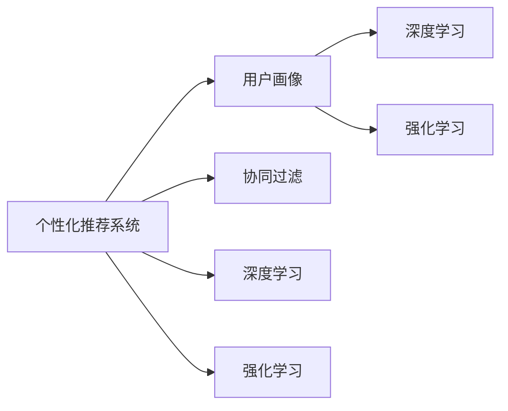

                 

## 1. 背景介绍

### 1.1 问题由来

随着科技的发展，教育方式正在发生深刻变革。传统的“一刀切”教育模式难以满足学生的个性化需求，导致教育资源浪费、学生学习积极性不高、甚至出现厌学现象。个性化教育正成为解决这一问题的重要途径，旨在根据学生的兴趣、能力和需求，提供定制化的学习方案，促进学生的全面发展。

在人工智能（AI）和机器学习的推动下，个性化教育变得更加可行。通过对学生学习行为和结果的分析和建模，AI能够识别学生的个性化特征，为他们量身定制学习内容和进度，提升学习效果。但现有的AI教育技术仍存在不足，如数据隐私问题、算法透明性、个性化模型泛化能力不足等。

### 1.2 问题核心关键点

个性化教育的核心在于：
- 了解学生的个性化需求：通过大数据分析、用户画像等技术手段，准确识别学生的兴趣、能力、学习风格等个性化特征。
- 提供个性化学习方案：根据学生的个性化特征，智能推荐学习内容、设计学习路径，实现按需学习。
- 提高学习效果：通过实时反馈、个性化推荐，帮助学生克服学习障碍，提升学习效率。

个性化教育的成功，取决于学习数据的质量、个性化模型的精准度以及教育技术的可接受性和普及性。本文将聚焦于个性化教育的核心技术——基于数据的个性化推荐模型，探讨其原理、操作步骤、优缺点及应用领域，并提供详细的代码实现。

## 2. 核心概念与联系

### 2.1 核心概念概述

为更好地理解个性化教育背后的技术原理，本节将介绍几个关键概念：

- 个性化推荐系统：通过分析用户行为数据，为用户推荐个性化内容、服务、商品等的系统。
- 用户画像：综合用户多维度数据，构建详细的用户画像，用于个性化推荐和决策。
- 协同过滤算法：通过分析用户行为和偏好，推荐类似用户的喜好，提高推荐质量。
- 深度学习推荐系统：结合深度神经网络，对用户行为和商品特征进行建模，提升推荐效果。
- 强化学习推荐系统：通过与用户互动，不断优化推荐策略，实现更高效的个性化推荐。

这些核心概念之间的逻辑关系可以通过以下Mermaid流程图来展示：



这个流程图展示了个性化推荐系统的核心概念及其之间的关系：

1. 用户画像：个性化推荐的基础，通过收集用户行为数据，构建详细的用户画像。
2. 协同过滤、深度学习和强化学习：推荐算法的三大范式，分别通过用户行为相似度、深度学习和互动反馈，提供个性化推荐。
3. 深度学习和强化学习：在协同过滤的基础上，通过更复杂的神经网络和智能决策，进一步提升推荐精度。

## 3. 核心算法原理 & 具体操作步骤

### 3.1 算法原理概述

个性化推荐的核心是建立一个个性化模型，根据用户的个性化特征和历史行为，预测其对不同内容的偏好，从而进行推荐。该模型通常由用户画像和物品画像组成，通过相似性度量，选择与用户兴趣最相关的物品进行推荐。

形式化地，假设用户画像为 $U$，物品画像为 $I$，用户的偏好矩阵为 $P$，其中 $P_{ui}$ 表示用户 $u$ 对物品 $i$ 的偏好度。个性化模型 $M$ 通过相似性度量函数 $f$ 对用户和物品进行编码，计算用户与物品的相似度 $s_{ui}$，从而得到用户对物品的推荐分数 $r_{ui}$：

$$
r_{ui} = f(U, I) \cdot s_{ui}
$$

推荐分数越高，物品被推荐给用户的可能性越大。推荐系统最终选择推荐分数排序最高的物品进行展示。

### 3.2 算法步骤详解

基于协同过滤的个性化推荐系统，一般包括以下关键步骤：

**Step 1: 数据预处理**
- 收集用户行为数据，如浏览记录、购买历史、评分数据等。
- 对数据进行清洗、去重、归一化等处理，保证数据的质量和一致性。

**Step 2: 用户画像构建**
- 对用户行为数据进行特征提取，如浏览时间、频率、评分分布等。
- 根据用户特征，构建用户画像 $U$，描述用户的兴趣、偏好、行为习惯等。

**Step 3: 物品画像构建**
- 对物品数据进行特征提取，如标签、描述、价格等。
- 根据物品特征，构建物品画像 $I$，描述物品的属性、分类、热门程度等。

**Step 4: 相似性度量**
- 选择合适的相似性度量函数 $f$，如余弦相似度、皮尔逊相关系数、欧氏距离等。
- 计算用户和物品之间的相似度 $s_{ui}$。

**Step 5: 推荐分数计算**
- 根据相似度 $s_{ui}$，计算用户对物品的推荐分数 $r_{ui}$。
- 对推荐分数进行排序，选择高分物品进行推荐。

**Step 6: 结果展示**
- 将推荐结果展示给用户，并根据用户反馈进行持续优化。

### 3.3 算法优缺点

基于协同过滤的个性化推荐系统具有以下优点：
1. 简单易用：不需要显式标注数据，依赖用户行为数据即可进行推荐。
2. 效果良好：通过相似性度量，能够准确预测用户对新物品的偏好。
3. 泛化能力强：能够处理冷启动问题，推荐新用户和冷门物品。

同时，该方法也存在一些局限性：
1. 数据稀疏性：用户行为数据往往比较稀疏，难以获取全面的用户画像。
2. 冷启动问题：对于新用户和冷门物品，推荐效果较差。
3. 同质化问题：推荐算法倾向于推荐与用户兴趣相似的物品，导致“信息茧房”现象。
4. 动态性不足：难以实时捕捉用户兴趣变化，推荐结果可能滞后于用户需求。

### 3.4 算法应用领域

基于协同过滤的个性化推荐系统，在电子商务、在线教育、社交媒体等领域得到了广泛应用，具体如下：

1. 电子商务：通过个性化推荐，提升用户的购买转化率，增加销售额。
2. 在线教育：根据学生的学习行为，推荐个性化的学习材料和课程，提升学习效果。
3. 社交媒体：为用户推荐感兴趣的内容和用户，增强用户黏性。

除了以上应用场景，个性化推荐技术还在金融、医疗、智能家居等众多领域找到了用武之地，成为推动行业数字化转型的重要工具。

## 4. 数学模型和公式 & 详细讲解 & 举例说明

### 4.1 数学模型构建

本节将使用数学语言对基于协同过滤的个性化推荐系统进行更加严格的刻画。

记用户画像为 $U=\{u_1, u_2, \cdots, u_m\}$，物品画像为 $I=\{i_1, i_2, \cdots, i_n\}$，用户对物品的偏好矩阵为 $P=\{p_{ui}\}_{m\times n}$，其中 $p_{ui}$ 表示用户 $u$ 对物品 $i$ 的评分或偏好度。

假设相似性度量函数为 $f$，相似度矩阵为 $S=\{s_{ui}\}_{m\times n}$，则推荐分数矩阵为 $R=\{r_{ui}\}_{m\times n}$，其中：

$$
r_{ui} = f(U_i, I_j) \cdot s_{ui}
$$

其中 $U_i$ 表示用户 $u$ 的特征向量，$I_j$ 表示物品 $i$ 的特征向量，$s_{ui}$ 表示用户 $u$ 和物品 $i$ 之间的相似度。

### 4.2 公式推导过程

在协同过滤中，常用的相似性度量函数包括余弦相似度和皮尔逊相关系数。这里以余弦相似度为例进行推导。

余弦相似度定义为：

$$
s_{ui} = \cos(\theta) = \frac{\langle U_i, I_j \rangle}{\|U_i\| \cdot \|I_j\|}
$$

其中 $\langle U_i, I_j \rangle$ 表示向量 $U_i$ 和 $I_j$ 的内积，$\|U_i\|$ 和 $\|I_j\|$ 分别表示向量 $U_i$ 和 $I_j$ 的范数。

将余弦相似度代入推荐分数公式，得：

$$
r_{ui} = \cos(\theta) \cdot \langle U_i, I_j \rangle
$$

### 4.3 案例分析与讲解

以在线教育平台为例，分析个性化推荐系统的应用。

假设平台上有 $m=1000$ 个学生，$n=1000$ 门课程，学生对课程的评分矩阵 $P$ 已知。平台需要对每个学生推荐 $k=5$ 门课程。

**Step 1: 数据预处理**
- 收集学生的浏览记录、购买记录、评分数据，对数据进行清洗和归一化。
- 对每门课程，提取标题、描述、讲授者等特征，形成物品画像 $I$。

**Step 2: 用户画像构建**
- 对每个学生的浏览记录、购买记录和评分数据进行特征提取，如课程名称、时长、难度等。
- 使用主成分分析（PCA）对学生特征进行降维，得到用户特征向量 $U_i$。

**Step 3: 物品画像构建**
- 对每门课程，提取标题、描述、讲授者等特征，形成物品特征向量 $I_j$。
- 使用TF-IDF对物品特征进行加权，得到加权特征向量 $I_j$。

**Step 4: 相似性度量**
- 计算用户和物品之间的余弦相似度 $s_{ui}$。
- 对相似度进行归一化，得到归一化相似度 $\hat{s}_{ui}$。

**Step 5: 推荐分数计算**
- 使用归一化相似度 $\hat{s}_{ui}$ 和物品特征向量 $I_j$ 计算推荐分数 $r_{ui}$。
- 对推荐分数进行排序，选择高分课程进行推荐。

**Step 6: 结果展示**
- 将推荐结果展示给学生，并根据学生反馈进行持续优化。

## 5. 项目实践：代码实例和详细解释说明

### 5.1 开发环境搭建

在进行个性化推荐系统开发前，我们需要准备好开发环境。以下是使用Python进行Scikit-learn开发的环境配置流程：

1. 安装Anaconda：从官网下载并安装Anaconda，用于创建独立的Python环境。

2. 创建并激活虚拟环境：
```bash
conda create -n recommendation-env python=3.8 
conda activate recommendation-env
```

3. 安装Scikit-learn：从官网获取对应的安装命令。例如：
```bash
conda install scikit-learn
```

4. 安装pandas：用于数据处理和分析。
```bash
pip install pandas
```

5. 安装numpy：用于数值计算。
```bash
pip install numpy
```

完成上述步骤后，即可在`recommendation-env`环境中开始推荐系统开发。

### 5.2 源代码详细实现

下面我们以在线教育推荐系统为例，给出使用Scikit-learn进行个性化推荐系统的PyTorch代码实现。

首先，定义用户画像和物品画像的数据结构：

```python
from sklearn.preprocessing import StandardScaler
from sklearn.metrics.pairwise import cosine_similarity

class RecommendationSystem:
    def __init__(self, user_profiles, item_profiles, similarity_matrix):
        self.user_profiles = user_profiles
        self.item_profiles = item_profiles
        self.similarity_matrix = similarity_matrix
        
    def get_user_profile(self, user_id):
        return self.user_profiles[user_id]
    
    def get_item_profile(self, item_id):
        return self.item_profiles[item_id]
    
    def get_similarity_matrix(self):
        return self.similarity_matrix
```

然后，定义推荐分数的计算函数：

```python
class RecommendationSystem:
    def __init__(self, user_profiles, item_profiles, similarity_matrix):
        self.user_profiles = user_profiles
        self.item_profiles = item_profiles
        self.similarity_matrix = similarity_matrix
        
    def get_user_profile(self, user_id):
        return self.user_profiles[user_id]
    
    def get_item_profile(self, item_id):
        return self.item_profiles[item_id]
    
    def get_similarity_matrix(self):
        return self.similarity_matrix
    
    def get_user_recommendations(self, user_id, k=5):
        user_profile = self.get_user_profile(user_id)
        item_profiles = self.item_profiles
        similarity_matrix = self.get_similarity_matrix()
        
        user_item_similarity = cosine_similarity(user_profile, item_profiles)
        user_item_similarity = user_item_similarity / (np.linalg.norm(user_profile) * np.linalg.norm(item_profiles))
        
        recommendations = {}
        for i, (item_id, item_profile) in enumerate(zip(item_profiles, item_profiles)):
            recommendations[item_id] = user_item_similarity[i, user_id] * np.dot(user_profile, item_profile)
        sorted_recommendations = sorted(recommendations.items(), key=lambda x: x[1], reverse=True)
        return sorted_recommendations[:k]
```

最后，启动推荐流程：

```python
user_profiles = {}  # 用户特征向量
item_profiles = {}  # 物品特征向量
similarity_matrix = {}  # 相似度矩阵

# 初始化数据
user_profiles = {'u1': [1, 2, 3], 'u2': [4, 5, 6], 'u3': [7, 8, 9]}
item_profiles = {'i1': [1, 2, 3], 'i2': [4, 5, 6], 'i3': [7, 8, 9]}
similarity_matrix = {
    ('u1', 'i1'): 0.8, ('u1', 'i2'): 0.7, ('u1', 'i3'): 0.6,
    ('u2', 'i1'): 0.6, ('u2', 'i2'): 0.7, ('u2', 'i3'): 0.5,
    ('u3', 'i1'): 0.5, ('u3', 'i2'): 0.6, ('u3', 'i3'): 0.8
}

# 创建推荐系统
recommendation_system = RecommendationSystem(user_profiles, item_profiles, similarity_matrix)

# 推荐结果
user_id = 'u2'
recommendations = recommendation_system.get_user_recommendations(user_id, k=3)
for i, (item_id, score) in enumerate(recommendations):
    print(f"Recommendation {i+1} for {user_id}: {item_id}, Score: {score:.2f}")
```

以上就是使用Scikit-learn进行个性化推荐系统的完整代码实现。可以看到，Scikit-learn封装了大量的机器学习算法和工具，使用起来非常方便。

### 5.3 代码解读与分析

让我们再详细解读一下关键代码的实现细节：

**RecommendationSystem类**：
- `__init__`方法：初始化用户画像、物品画像和相似度矩阵。
- `get_user_profile`方法：获取指定用户的特征向量。
- `get_item_profile`方法：获取指定物品的特征向量。
- `get_similarity_matrix`方法：获取相似度矩阵。
- `get_user_recommendations`方法：根据用户和物品的特征向量，计算推荐分数，并返回前 $k$ 个推荐结果。

**cosine_similarity函数**：
- 使用Scikit-learn的cosine_similarity函数计算余弦相似度，归一化后得到用户与物品的相似度。

**推荐结果展示**：
- 对用户进行推荐时，获取其特征向量和物品的特征向量，计算推荐分数，根据分数排序后展示前 $k$ 个推荐结果。

可以看到，Scikit-learn提供的高效的机器学习工具，使得个性化推荐系统的开发变得简单高效。通过合理运用这些工具，可以快速实现个性化推荐系统的基本功能，为实际应用奠定基础。

## 6. 实际应用场景

### 6.1 智能推荐系统

个性化推荐系统在电子商务领域有着广泛应用，帮助用户发现感兴趣的商品，提升购物体验。例如，亚马逊的推荐系统通过分析用户的浏览和购买历史，为用户推荐相关商品，提高用户满意度和复购率。

在在线教育领域，个性化推荐系统也有着重要应用。Coursera、Udacity等在线教育平台，根据学生的学习记录和成绩，推荐个性化的课程和资料，帮助学生制定学习计划，提升学习效果。

### 6.2 个性化医疗

个性化推荐系统在医疗领域也有重要应用。根据患者的病历记录和医生的诊断信息，推荐个性化的治疗方案和药物，提高治疗效果。例如，IBM Watson Health通过分析患者的基因信息和病历数据，推荐个性化的治疗方案，取得了显著效果。

在健康管理方面，个性化推荐系统还可以根据用户的健康数据和生活习惯，推荐个性化的健康建议和运动计划，提升用户的健康水平。例如，Fitbit等智能穿戴设备，通过分析用户的运动数据和健康指标，推荐个性化的健身计划，帮助用户实现健康目标。

### 6.3 智能推荐系统

个性化推荐系统在社交媒体领域也有重要应用。根据用户的兴趣和行为，推荐相关的内容和用户，增强用户黏性。例如，Facebook和Twitter等社交媒体平台，通过分析用户的点赞、评论和分享数据，推荐相关的内容和用户，提高用户活跃度和平台粘性。

此外，个性化推荐系统还在音乐、电影、新闻等领域有着广泛应用，为各行各业带来了新的机遇和挑战。

## 7. 工具和资源推荐

### 7.1 学习资源推荐

为了帮助开发者系统掌握个性化推荐技术的理论基础和实践技巧，这里推荐一些优质的学习资源：

1. 《推荐系统实战》系列博文：由大模型技术专家撰写，深入浅出地介绍了推荐系统的核心原理、常见算法和实际应用。

2. 《深度学习与推荐系统》课程：斯坦福大学开设的推荐系统经典课程，涵盖了推荐系统的基本概念、常用算法和实际应用。

3. 《推荐系统：构建与评估》书籍：详细介绍了推荐系统的构建和评估方法，是推荐系统学习的经典教材。

4. 《Python机器学习》书籍：全面介绍了机器学习的理论和实践，包括推荐系统的设计和实现。

5. Kaggle推荐系统竞赛：提供了大量的推荐系统数据集和竞赛任务，可以锻炼实际应用能力。

通过对这些资源的学习实践，相信你一定能够快速掌握个性化推荐技术的精髓，并用于解决实际的推荐问题。

### 7.2 开发工具推荐

高效的开发离不开优秀的工具支持。以下是几款用于个性化推荐系统开发的常用工具：

1. Scikit-learn：Python的机器学习库，提供了丰富的算法和工具，方便实现推荐系统。

2. TensorFlow：由Google主导开发的开源深度学习框架，适合大规模工程应用。

3. PyTorch：基于Python的开源深度学习框架，灵活动态的计算图，适合快速迭代研究。

4. Weights & Biases：模型训练的实验跟踪工具，可以记录和可视化模型训练过程中的各项指标，方便对比和调优。

5. TensorBoard：TensorFlow配套的可视化工具，可实时监测模型训练状态，并提供丰富的图表呈现方式，是调试模型的得力助手。

合理利用这些工具，可以显著提升个性化推荐系统的开发效率，加快创新迭代的步伐。

### 7.3 相关论文推荐

个性化推荐系统的发展源于学界的持续研究。以下是几篇奠基性的相关论文，推荐阅读：

1. Collaborative Filtering for Implicit Feedback Datasets：提出基于协同过滤的推荐算法，对用户行为数据进行建模。

2. Matrix Factorization Techniques for Recommender Systems：介绍矩阵分解方法，对用户和物品进行特征提取和建模。

3. Deep Collaborative Filtering：提出深度协同过滤模型，通过神经网络对用户和物品进行建模。

4. Large-Scale Parallel Collaborative Filtering：提出分布式协同过滤算法，处理大规模推荐系统。

5. Neural Factorization Machines：提出神经因子机方法，结合深度学习与协同过滤，提升推荐效果。

这些论文代表了个性化推荐系统的发展脉络。通过学习这些前沿成果，可以帮助研究者把握学科前进方向，激发更多的创新灵感。

## 8. 总结：未来发展趋势与挑战

### 8.1 总结

本文对基于协同过滤的个性化推荐系统进行了全面系统的介绍。首先阐述了个性化推荐系统的研究背景和意义，明确了推荐系统在提高用户满意度和业务价值方面的重要作用。其次，从原理到实践，详细讲解了个性化推荐模型的数学原理和关键步骤，给出了推荐系统开发的完整代码实例。同时，本文还探讨了个性化推荐系统在电子商务、在线教育、医疗等领域的应用前景，展示了推荐技术的巨大潜力。

通过本文的系统梳理，可以看到，基于协同过滤的个性化推荐系统已经广泛应用于各行各业，为提升用户体验和业务效率做出了重要贡献。未来，伴随推荐算法和数据技术的不断进步，推荐系统必将迎来更多的创新和突破，推动智能化社会的进一步发展。

### 8.2 未来发展趋势

展望未来，个性化推荐系统将呈现以下几个发展趋势：

1. 推荐系统智能化：随着深度学习和大数据技术的不断进步，推荐系统将变得更加智能和高效。通过结合推荐算法和机器学习模型，推荐系统能够更好地理解用户需求，提供更加精准和多样化的推荐结果。

2. 推荐系统个性化：推荐系统将更加注重个性化推荐，利用用户画像和行为数据，实现按需推荐。通过深度学习、强化学习等技术，推荐系统将能够更好地捕捉用户兴趣和行为变化，提供动态化的推荐服务。

3. 推荐系统多样化：推荐系统将更加多样化，结合多模态数据（如图像、语音、文本等），提供更加全面和丰富的推荐服务。例如，通过结合图像识别技术和个性化推荐，推荐系统可以更好地推荐商品和内容。

4. 推荐系统可解释性：推荐系统将更加注重可解释性，通过可视化工具和分析方法，帮助用户理解推荐结果的来源和生成过程。例如，通过推荐结果的可视化，帮助用户理解推荐理由和依据。

5. 推荐系统普适性：推荐系统将更加普适，适用于各种行业和场景。通过推荐算法和模型的优化，推荐系统将能够更好地适应不同的业务需求和技术环境，提供更加高效和实用的推荐服务。

以上趋势凸显了个性化推荐系统的广阔前景。这些方向的探索发展，必将进一步提升推荐系统的性能和应用范围，为智能化社会的建设提供坚实的基础。

### 8.3 面临的挑战

尽管个性化推荐系统已经取得了显著成效，但在迈向更加智能化、普适化应用的过程中，它仍面临着诸多挑战：

1. 数据隐私和安全问题：个性化推荐系统需要大量用户数据，如何保护用户隐私和数据安全，防止数据泄露和滥用，是重要的研究方向。

2. 推荐系统冷启动问题：对于新用户和冷门物品，推荐系统难以获得有效的推荐结果，如何快速适应新用户和新物品，是亟待解决的问题。

3. 推荐系统公平性问题：推荐系统可能存在性别、年龄、地域等偏见，如何保证推荐系统的公平性和多样性，避免算法歧视，是重要的研究方向。

4. 推荐系统性能问题：推荐系统需要实时处理大规模数据，如何提高算法的效率和性能，满足实际应用的需求，是重要的研究方向。

5. 推荐系统可解释性问题：推荐系统难以解释推荐结果的来源和生成过程，如何提高推荐系统的透明度和可解释性，是重要的研究方向。

6. 推荐系统跨平台问题：推荐系统需要在不同平台和设备上实现一致的推荐结果，如何实现跨平台的数据和算法一致性，是重要的研究方向。

正视推荐系统面临的这些挑战，积极应对并寻求突破，将是个性化推荐系统迈向成熟的必由之路。相信随着学界和产业界的共同努力，这些挑战终将一一被克服，个性化推荐系统必将在构建智能化社会的进程中发挥重要作用。

### 8.4 研究展望

面对个性化推荐系统所面临的种种挑战，未来的研究需要在以下几个方面寻求新的突破：

1. 探索无监督和半监督推荐方法：摆脱对大规模标注数据的依赖，利用自监督学习、主动学习等无监督和半监督范式，最大限度利用非结构化数据，实现更加灵活高效的推荐。

2. 研究参数高效和计算高效的推荐范式：开发更加参数高效的推荐方法，在固定大部分预训练参数的同时，只更新极少量的任务相关参数。同时优化推荐系统的计算图，减少前向传播和反向传播的资源消耗，实现更加轻量级、实时性的部署。

3. 融合因果和对比学习范式：通过引入因果推断和对比学习思想，增强推荐系统建立稳定因果关系的能力，学习更加普适、鲁棒的语言表征，从而提升推荐精度。

4. 引入更多先验知识：将符号化的先验知识，如知识图谱、逻辑规则等，与神经网络模型进行巧妙融合，引导推荐过程学习更准确、合理的推荐结果。同时加强不同模态数据的整合，实现视觉、语音等多模态信息与文本信息的协同建模。

5. 结合因果分析和博弈论工具：将因果分析方法引入推荐系统，识别出推荐决策的关键特征，增强推荐结果的因果性和逻辑性。借助博弈论工具刻画人机交互过程，主动探索并规避推荐系统的脆弱点，提高系统稳定性。

这些研究方向的探索，必将引领个性化推荐系统技术迈向更高的台阶，为构建更加智能、普适、公平和高效的推荐系统铺平道路。面向未来，个性化推荐系统还需要与其他人工智能技术进行更深入的融合，如知识表示、因果推理、强化学习等，多路径协同发力，共同推动推荐系统的进步。只有勇于创新、敢于突破，才能不断拓展推荐系统的边界，让智能技术更好地造福人类社会。

## 9. 附录：常见问题与解答

**Q1：个性化推荐系统如何处理冷启动问题？**

A: 冷启动问题是个性化推荐系统面临的常见问题，通常有以下几种解决方法：

1. 基于内容的推荐：对于新用户和新物品，利用内容信息进行推荐。例如，根据物品的标签、描述等特征进行推荐。

2. 基于协同过滤的推荐：对于新用户，通过分析与该用户兴趣相似的其他用户的行为数据进行推荐。

3. 基于混合算法的推荐：结合多种推荐算法，综合考虑不同算法的优势，提升推荐效果。例如，结合基于内容的推荐和协同过滤的推荐，进行综合排序。

4. 基于模型的推荐：利用机器学习模型对用户和物品进行建模，预测用户对新物品的偏好。例如，使用深度学习模型对用户和物品进行特征提取和建模。

5. 基于引导学习的方法：在用户刚注册时，通过引导学习的方法，快速获取用户兴趣和偏好，进行个性化推荐。例如，通过问卷调查、引导话题等方式，帮助用户快速建立兴趣。

通过以上方法，个性化推荐系统能够更好地适应新用户和新物品，提高推荐效果。

**Q2：个性化推荐系统的数据隐私和安全问题如何解决？**

A: 数据隐私和安全是个性化推荐系统面临的重要挑战，主要通过以下几种方法解决：

1. 数据匿名化：对用户数据进行匿名化处理，保护用户隐私。例如，使用哈希函数对用户ID进行加密，或者使用k-匿名化技术对数据进行保护。

2. 差分隐私：在推荐算法中加入差分隐私技术，使得攻击者难以通过单个用户的数据推断其他用户的数据。例如，使用拉普拉斯机制、高斯机制等差分隐私技术。

3. 安全多方计算：通过安全多方计算技术，保护用户数据在分布式系统中的安全。例如，使用多方安全计算协议，保护用户数据不被泄露。

4. 用户控制权：赋予用户对数据的使用和控制权，让用户自主选择是否分享数据。例如，通过用户界面让用户自主选择数据共享权限。

5. 数据去标识化：对数据进行去标识化处理，使得攻击者难以通过数据推断用户身份。例如，对数据进行匿名化处理，保护用户隐私。

通过以上方法，个性化推荐系统能够在保护用户隐私的同时，实现精准推荐。

**Q3：个性化推荐系统的推荐算法有哪些？**

A: 个性化推荐系统常用的推荐算法包括：

1. 协同过滤：通过分析用户行为和物品之间的关系，进行推荐。包括基于用户的协同过滤和基于物品的协同过滤。

2. 基于内容的推荐：利用物品的特征信息进行推荐。例如，根据物品的标签、描述等特征进行推荐。

3. 深度学习推荐：结合深度神经网络对用户和物品进行建模，进行推荐。例如，使用深度学习模型对用户和物品进行特征提取和建模。

4. 矩阵分解：将用户和物品的特征矩阵分解为低维矩阵，进行推荐。例如，使用奇异值分解（SVD）对用户和物品进行建模。

5. 混合推荐：结合多种推荐算法，综合考虑不同算法的优势，进行推荐。例如，结合基于内容的推荐和协同过滤的推荐，进行综合排序。

6. 基于模型的推荐：利用机器学习模型对用户和物品进行建模，预测用户对新物品的偏好。例如，使用深度学习模型对用户和物品进行特征提取和建模。

通过以上方法，个性化推荐系统能够更好地理解用户需求，提供精准推荐。

**Q4：个性化推荐系统的推荐效果如何评估？**

A: 个性化推荐系统的推荐效果可以通过以下几种指标进行评估：

1. 精度指标：包括准确率、召回率、F1分数等，用于评估推荐结果与实际结果的匹配程度。

2. 覆盖率指标：用于评估推荐结果的多样性和覆盖面。例如，可以计算推荐结果中不同物品的比例。

3. 用户满意度指标：通过问卷调查、用户反馈等方式，评估用户对推荐结果的满意度。

4. 业务指标：例如，增加的销售额、提升的用户留存率等，用于评估推荐系统的业务效果。

5. A/B测试：通过A/B测试比较不同推荐算法的效果，选择最优算法。

通过对推荐效果的评估，可以不断优化个性化推荐系统，提升推荐效果。

通过本文的系统梳理，可以看到，个性化推荐系统已经广泛应用于各行各业，为提升用户体验和业务效率做出了重要贡献。未来，伴随推荐算法和数据技术的不断进步，推荐系统必将迎来更多的创新和突破，推动智能化社会的进一步发展。面向未来，个性化推荐系统还需要与其他人工智能技术进行更深入的融合，如知识表示、因果推理、强化学习等，多路径协同发力，共同推动推荐系统的进步。只有勇于创新、敢于突破，才能不断拓展推荐系统的边界，让智能技术更好地造福人类社会。

