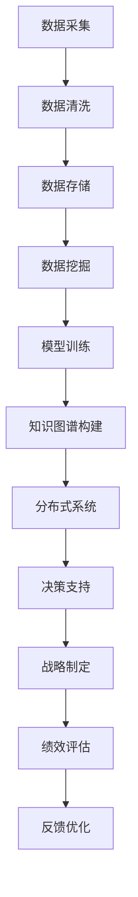

                 

# 丰富模型思维:增强管理者洞悉力

> 关键词：管理者洞悉力,组织学习,模型思维,知识图谱,分布式系统,数据科学

## 1. 背景介绍

### 1.1 问题由来
在当前复杂多变的商业环境中，企业面临的挑战日益增多，不确定性因素也在不断增加。如何在这种环境下，管理者能够保持敏锐的洞察力，快速响应市场变化，作出正确的战略决策，成为了一个重大问题。传统的人力分析和管理方法已经难以满足企业的需求，迫切需要引入新的工具和方法，帮助管理者更好地理解组织动态，预判市场变化。

### 1.2 问题核心关键点
为了应对这种挑战，管理者需要在组织内部建立一套完善的洞悉力体系。该体系的核心思想是通过系统地收集、整理、分析组织内外的数据，结合最新的数据科学和人工智能技术，构建一个能够实时响应、灵活调整、准确预测的决策支持系统。本文将探讨如何通过模型思维，提升管理者的洞悉力，帮助其在信息时代下更好地应对复杂环境。

### 1.3 问题研究意义
通过对模型思维和洞悉力体系的深入研究，管理者可以更好地利用数据和计算资源，提升组织的学习能力和决策效率。具体来说，模型思维能够帮助管理者建立系统化的思考框架，洞察组织运行中的关键因素，从而制定出更为科学合理的战略计划。同时，洞悉力体系能够在数据驱动的基础上，提供实时、准确的信息支持，增强管理者的决策信心。

本文聚焦于如何通过模型思维，提升管理者的洞悉力，帮助其在复杂环境中做出更为精准的决策。

## 2. 核心概念与联系

### 2.1 核心概念概述

在深入探讨模型思维和洞悉力之前，需要首先介绍几个关键概念：

- **模型思维**：指通过构建和分析数据模型，理解组织运行规律，洞察内部关键因素的思维方式。模型思维强调将复杂问题抽象为数学模型，通过数据的统计分析和机器学习，得到科学的洞见。

- **洞悉力**：指管理者在了解组织运行情况的基础上，结合最新的数据科学和人工智能技术，对组织未来的发展趋势和市场变化进行预判和决策的能力。

- **组织学习**：指通过组织内部的知识共享和创新实践，积累和传递成功经验，提升组织整体能力的过程。组织学习强调通过不断的实践和反思，推动组织向更高的水平发展。

- **知识图谱**：指将组织内外的知识进行结构化、系统化整理，形成知识节点之间相互关联的网络，帮助管理者更好地理解组织运行的内在逻辑和外部关联。

- **分布式系统**：指在复杂环境中，通过多台计算机协同工作，实现任务并行处理、数据共享和资源调配的系统。分布式系统能够提高处理能力，增强系统的稳定性和可扩展性。

### 2.2 核心概念原理和架构的 Mermaid 流程图(Mermaid 流程节点中不要有括号、逗号等特殊字符)



上述流程图展示了从数据采集到战略制定的全过程，体现了模型思维和洞悉力体系的各个环节和关键技术。

## 3. 核心算法原理 & 具体操作步骤

### 3.1 算法原理概述

模型思维和洞悉力体系的构建，本质上是将组织数据转化为可操作的模型和洞见的过程。这一过程涉及多个步骤，包括数据采集、清洗、存储、挖掘、训练和知识图谱构建等。在每个步骤中，都需要通过算法模型进行分析和处理，形成系统的决策支持体系。

### 3.2 算法步骤详解

以下是构建模型思维和洞悉力体系的关键步骤：

**Step 1: 数据采集**
- 通过传感器、问卷调查、业务系统等多种方式，收集组织内部和外部的相关数据。数据类型可以包括文本、数值、图像等多种形式。

**Step 2: 数据清洗**
- 对采集到的数据进行去重、去噪、格式转换等处理，确保数据的质量和一致性。清洗后的数据应具备完整性、准确性和可用性。

**Step 3: 数据存储**
- 将清洗后的数据进行结构化存储，可以使用关系型数据库、NoSQL数据库等多种方式。同时，需建立数据备份和恢复机制，确保数据安全。

**Step 4: 数据挖掘**
- 通过数据挖掘算法，从原始数据中提取有用的信息和模式。常见的数据挖掘算法包括聚类、分类、回归等。

**Step 5: 模型训练**
- 将挖掘到的数据转化为训练集，利用机器学习算法进行模型训练。常用的模型包括线性回归、逻辑回归、决策树、随机森林等。

**Step 6: 知识图谱构建**
- 将模型训练结果和组织知识进行整合，构建知识图谱，形成组织运行的关键节点和关系链。

**Step 7: 分布式系统部署**
- 将构建好的模型和知识图谱部署到分布式系统中，实现多节点协同处理和数据共享。

**Step 8: 决策支持**
- 利用构建好的模型和知识图谱，提供实时的决策支持，帮助管理者洞察组织运行规律，预判市场变化。

**Step 9: 战略制定**
- 根据决策支持结果，结合组织目标和外部环境，制定科学的战略计划。

**Step 10: 绩效评估**
- 对战略计划的实施效果进行评估，反馈到模型和知识图谱中进行优化和调整。

### 3.3 算法优缺点

模型思维和洞悉力体系在提升管理者的洞悉力方面，具有以下优点：
1. 系统性：通过数据模型系统化地分析组织运行规律，帮助管理者从多个维度理解问题。
2. 实时性：通过分布式系统实现数据的实时处理和更新，管理者能够及时掌握最新信息。
3. 精准性：利用先进的机器学习算法，模型能够提供更为精准的洞见和预测。
4. 可操作性：将模型结果转化为可视化工具和报表，方便管理者理解和应用。

同时，该体系也存在一些局限性：
1. 数据质量要求高：模型结果的质量高度依赖于数据的质量，数据缺失、噪声等问题会影响模型的准确性。
2. 技术门槛较高：模型构建和分析需要一定的数据科学和机器学习知识，普通管理者难以独立完成。
3. 模型解释性不足：部分机器学习模型，尤其是深度学习模型，难以解释其内部机制和决策逻辑。

### 3.4 算法应用领域

模型思维和洞悉力体系已经在多个领域得到了广泛应用，包括但不限于：

- **企业战略管理**：通过模型分析市场趋势和竞争态势，制定科学合理的战略规划。
- **供应链管理**：利用数据模型和知识图谱，优化供应链各个环节的协同效率，提升整体运营水平。
- **人力资源管理**：通过员工行为数据和绩效评估模型，优化人力资源配置和员工激励机制。
- **产品开发**：结合市场反馈和用户行为数据，构建产品迭代模型，快速响应市场需求。
- **财务管理**：利用财务数据分析模型，优化成本控制和投资决策。

这些领域的应用表明，模型思维和洞悉力体系在提升管理者的决策能力方面，具有广泛的应用前景。

## 4. 数学模型和公式 & 详细讲解 & 举例说明

### 4.1 数学模型构建

本节将使用数学语言对模型思维和洞悉力体系的构建过程进行严格刻画。

假设组织有 $N$ 个关键指标 $x_1,x_2,...,x_N$，每个指标的历史数据构成 $M$ 个时间点的样本集 $\{(x_i,y_i)\}_{i=1}^M$，其中 $y_i$ 表示在第 $i$ 个时间点组织运行状态的好坏。构建模型思维和洞悉力体系的数学模型如下：

- **数据采集模型**：将组织内部和外部的数据采集到系统中，形成数据集 $\mathcal{D} = \{(x_i,y_i)\}_{i=1}^M$。

- **数据清洗模型**：对采集到的数据进行清洗，得到高质量的数据集 $\mathcal{D}'$。

- **数据存储模型**：将清洗后的数据存储在数据库 $\mathcal{DB}$ 中，实现数据的长期保存和高效查询。

- **数据挖掘模型**：利用数据挖掘算法 $\mathcal{DM}$，从数据集 $\mathcal{D}'$ 中提取关键模式和关联关系，得到挖掘结果 $\mathcal{R}$。

- **模型训练模型**：利用机器学习算法 $\mathcal{ML}$，对挖掘结果 $\mathcal{R}$ 进行模型训练，得到模型 $\mathcal{M}$。

- **知识图谱构建模型**：将模型 $\mathcal{M}$ 和组织知识 $\mathcal{K}$ 进行整合，构建知识图谱 $\mathcal{KG}$。

- **分布式系统模型**：将知识图谱 $\mathcal{KG}$ 部署到分布式系统 $\mathcal{DS}$ 中，实现并行处理和数据共享。

- **决策支持模型**：利用模型 $\mathcal{M}$ 和知识图谱 $\mathcal{KG}$，提供实时的决策支持，帮助管理者洞察组织运行规律。

- **战略制定模型**：结合组织目标和外部环境，利用模型 $\mathcal{M}$ 和知识图谱 $\mathcal{KG}$，制定科学的战略计划 $\mathcal{SP}$。

- **绩效评估模型**：对战略计划 $\mathcal{SP}$ 的实施效果进行评估，得到绩效指标 $\mathcal{PI}$。

- **反馈优化模型**：根据绩效指标 $\mathcal{PI}$ 和实际效果，反馈到模型 $\mathcal{M}$ 和知识图谱 $\mathcal{KG}$ 中进行优化和调整。

### 4.2 公式推导过程

以线性回归模型为例，推导模型的训练过程和性能评估公式。

假设组织运行状态 $y_i$ 与关键指标 $x_1,x_2,...,x_N$ 之间存在线性关系，可以表示为：

$$
y_i = \alpha + \sum_{j=1}^N \beta_j x_{ij}
$$

其中 $\alpha$ 为截距，$\beta_j$ 为指标 $x_j$ 的系数。线性回归模型的训练目标是找到最优的参数 $\theta = (\alpha,\beta_1,...,\beta_N)$，使得模型能够最小化预测误差。

训练目标函数为：

$$
\mathcal{L}(\theta) = \frac{1}{M}\sum_{i=1}^M (y_i - \alpha - \sum_{j=1}^N \beta_j x_{ij})^2
$$

利用梯度下降算法，求解最优参数 $\theta$ 的过程如下：

1. 初始化参数 $\theta_0$。
2. 计算梯度 $\frac{\partial \mathcal{L}(\theta)}{\partial \theta_k}$，$k=0,...,N$。
3. 更新参数 $\theta \leftarrow \theta - \eta \nabla_{\theta}\mathcal{L}(\theta)$，其中 $\eta$ 为学习率。
4. 重复步骤2和3，直至模型收敛或达到预设的迭代次数。

模型训练后，利用测试集进行性能评估，计算均方误差（MSE）：

$$
MSE = \frac{1}{M}\sum_{i=1}^M (y_i - \hat{y}_i)^2
$$

其中 $\hat{y}_i$ 为模型预测的运行状态。

### 4.3 案例分析与讲解

假设一家电商平台利用模型思维和洞悉力体系，对用户购买行为进行分析，优化库存管理和销售策略。

**数据采集**：
- 采集用户购买记录、浏览历史、评价评论等数据，形成原始数据集。

**数据清洗**：
- 对采集到的数据进行去重、去噪、格式转换等处理，得到高质量数据集。

**数据存储**：
- 将清洗后的数据存储在关系型数据库中，建立用户行为数据仓库。

**数据挖掘**：
- 利用聚类算法，将用户分为不同行为群体，挖掘用户购买行为的关键模式。

**模型训练**：
- 利用线性回归模型，预测用户购买行为的概率，得到模型参数。

**知识图谱构建**：
- 将用户行为数据和商品属性数据进行整合，构建用户-商品关联图谱。

**分布式系统部署**：
- 将知识图谱部署到分布式系统中，实现多节点协同处理和数据共享。

**决策支持**：
- 利用模型和知识图谱，预测用户购买行为，指导库存管理和商品推荐。

**战略制定**：
- 结合市场趋势和用户行为数据，制定库存管理和销售策略。

**绩效评估**：
- 对库存和销售策略的效果进行评估，反馈到模型和知识图谱中进行优化。

通过上述步骤，电商平台能够实时监控用户行为，动态调整库存和销售策略，提升运营效率和用户体验。

## 5. 项目实践：代码实例和详细解释说明

### 5.1 开发环境搭建

在进行模型思维和洞悉力体系构建的实践前，需要准备好开发环境。以下是使用Python进行PyTorch开发的环境配置流程：

1. 安装Anaconda：从官网下载并安装Anaconda，用于创建独立的Python环境。

2. 创建并激活虚拟环境：
```bash
conda create -n pytorch-env python=3.8 
conda activate pytorch-env
```

3. 安装PyTorch：根据CUDA版本，从官网获取对应的安装命令。例如：
```bash
conda install pytorch torchvision torchaudio cudatoolkit=11.1 -c pytorch -c conda-forge
```

4. 安装Pandas、Numpy、Matplotlib等库：
```bash
pip install pandas numpy matplotlib scikit-learn scikit-optimize
```

完成上述步骤后，即可在`pytorch-env`环境中开始项目实践。

### 5.2 源代码详细实现

下面以线性回归模型为例，给出使用PyTorch进行数据挖掘和模型训练的PyTorch代码实现。

首先，定义数据处理函数：

```python
import pandas as pd
from sklearn.model_selection import train_test_split
import numpy as np

def load_data():
    # 加载原始数据集
    data = pd.read_csv('data.csv')

    # 数据清洗：去重、去噪、格式转换
    data = data.drop_duplicates()
    data = data.fillna(method='ffill')
    data = data.dropna()
    data = data.drop(['id'], axis=1)

    # 数据分割：训练集和测试集
    X_train, X_test, y_train, y_test = train_test_split(
        data.drop(['y'], axis=1), 
        data['y'], 
        test_size=0.2, 
        random_state=42)

    return X_train, X_test, y_train, y_test
```

然后，定义模型和优化器：

```python
from torch.utils.data import TensorDataset, DataLoader
from torch import nn, optim
import torch.nn.functional as F

class LinearRegression(nn.Module):
    def __init__(self, n_features):
        super(LinearRegression, self).__init__()
        self.linear = nn.Linear(n_features, 1)

    def forward(self, x):
        return self.linear(x)

# 训练函数
def train_model(model, data_loader, optimizer, num_epochs):
    model.train()
    loss_fn = nn.MSELoss()
    for epoch in range(num_epochs):
        for batch in data_loader:
            x, y = batch
            y_pred = model(x)
            loss = loss_fn(y_pred, y)
            optimizer.zero_grad()
            loss.backward()
            optimizer.step()

    return model
```

接着，定义训练和评估函数：

```python
# 训练函数
def train_model(model, data_loader, optimizer, num_epochs):
    model.train()
    loss_fn = nn.MSELoss()
    for epoch in range(num_epochs):
        for batch in data_loader:
            x, y = batch
            y_pred = model(x)
            loss = loss_fn(y_pred, y)
            optimizer.zero_grad()
            loss.backward()
            optimizer.step()

    return model

# 评估函数
def evaluate_model(model, test_data_loader):
    model.eval()
    loss_fn = nn.MSELoss()
    with torch.no_grad():
        for batch in test_data_loader:
            x, y = batch
            y_pred = model(x)
            loss = loss_fn(y_pred, y)
            print(f"MSE: {loss:.3f}")

    return loss
```

最后，启动训练流程并在测试集上评估：

```python
# 数据加载
X_train, X_test, y_train, y_test = load_data()

# 模型初始化
model = LinearRegression(X_train.shape[1])

# 定义优化器
optimizer = optim.SGD(model.parameters(), lr=0.01)

# 数据加载器
train_loader = DataLoader(X_train, y_train, batch_size=32)
test_loader = DataLoader(X_test, y_test, batch_size=32)

# 训练模型
model = train_model(model, train_loader, optimizer, num_epochs=100)

# 评估模型
evaluate_model(model, test_loader)
```

以上就是使用PyTorch进行线性回归模型训练的完整代码实现。可以看到，通过利用Pandas和Sklearn等库，数据预处理和分割变得简洁高效。同时，借助PyTorch的自动微分和优化器，模型训练过程也变得非常简单。

### 5.3 代码解读与分析

让我们再详细解读一下关键代码的实现细节：

**数据处理函数**：
- `load_data`方法：加载原始数据集，并进行数据清洗和分割，形成训练集和测试集。

**模型定义**：
- `LinearRegression`类：定义线性回归模型，利用`nn.Linear`进行线性变换。

**训练函数**：
- `train_model`方法：定义训练函数，利用SGD优化器进行梯度更新。

**评估函数**：
- `evaluate_model`方法：定义评估函数，计算测试集上的均方误差（MSE）。

**训练流程**：
- 首先加载数据集，定义模型和优化器。
- 创建训练和测试数据加载器。
- 在训练集上迭代训练模型，调整参数。
- 在测试集上评估模型性能。

可以看到，借助PyTorch和Pandas等工具，数据处理和模型训练变得非常高效。开发者可以将更多精力放在模型优化和业务逻辑上，而不必过多关注底层实现细节。

当然，工业级的系统实现还需考虑更多因素，如模型裁剪、量化加速、服务化封装等。但核心的模型思维和洞悉力体系的构建，基本与此类似。

## 6. 实际应用场景

### 6.1 智能客服系统

利用模型思维和洞悉力体系，智能客服系统可以通过分析用户历史行为数据，构建用户画像和行为预测模型，实现个性化的智能回复和问题解决。

在技术实现上，可以收集用户的历史对话记录、浏览行为、投诉记录等数据，构建用户画像，利用聚类算法和回归模型，预测用户可能遇到的问题和需求。在对话时，智能客服系统可以根据用户画像和预测结果，提供个性化的回答和推荐。

### 6.2 供应链管理

供应链管理是模型思维和洞悉力体系的重要应用场景之一。通过分析订单、库存、物流等数据，构建供应链网络模型，预测需求和供应链风险，优化供应链各环节的协同效率。

具体而言，可以收集订单数据、库存数据、物流数据等，构建供应链网络图谱，利用图神经网络（GNN）进行数据分析，预测需求和物流延误等风险。同时，利用优化算法和强化学习，调整供应链各环节的资源配置和库存策略，提升供应链的整体运营效率。

### 6.3 金融风险管理

金融领域面临的高风险性和不确定性，使得模型思维和洞悉力体系的应用尤为重要。通过分析金融数据，构建风险评估模型，预测市场风险和投资回报，指导投资决策。

具体而言，可以收集金融市场数据、公司财务数据、宏观经济数据等，构建多维度数据集。利用机器学习算法，构建风险评估模型，预测市场波动和金融风险。同时，利用知识图谱技术，整合外部数据，提升模型的准确性和鲁棒性。

### 6.4 未来应用展望

随着模型思维和洞悉力体系的发展，未来的应用场景将更加广泛，具体如下：

1. **智慧城市**：通过分析交通、能源、环境等数据，构建智慧城市运行模型，优化城市资源配置和管理。

2. **医疗健康**：利用患者历史数据和基因信息，构建健康预测模型，提升疾病预防和医疗服务的精准度。

3. **智能制造**：通过分析生产数据和设备状态，构建制造系统优化模型，提升生产效率和设备利用率。

4. **环境保护**：利用环境监测数据，构建环境污染预测模型，提前预警和应对环境问题。

5. **智能物流**：通过分析订单、配送数据，构建物流优化模型，提升配送效率和客户满意度。

以上应用场景表明，模型思维和洞悉力体系在提升企业决策能力、优化资源配置等方面具有重要价值。随着技术的不断发展，该体系的应用将更加深入和广泛，推动各个行业向智能化、数字化转型。

## 7. 工具和资源推荐

### 7.1 学习资源推荐

为了帮助开发者系统掌握模型思维和洞悉力体系的理论基础和实践技巧，这里推荐一些优质的学习资源：

1. 《数据科学导论》系列博文：由知名数据科学家撰写，深入浅出地介绍了数据科学和机器学习的核心概念和实践方法。

2. CS229《机器学习》课程：斯坦福大学开设的机器学习经典课程，有Lecture视频和配套作业，帮助你全面掌握机器学习算法和理论。

3. 《深度学习》书籍：Deep Learning Books网站，提供大量深度学习相关书籍资源，涵盖理论、算法、应用等多个方面。

4. TensorFlow官方文档：TensorFlow配套的详细文档，提供丰富的示例和API文档，帮助你快速上手TensorFlow。

5. PyTorch官方文档：PyTorch配套的详细文档，提供丰富的示例和API文档，帮助你快速上手PyTorch。

6. Kaggle竞赛平台：Kaggle提供大量数据集和机器学习竞赛，帮助你通过实际项目练习和提升。

通过对这些资源的学习实践，相信你一定能够快速掌握模型思维和洞悉力体系的精髓，并用于解决实际的业务问题。

### 7.2 开发工具推荐

高效的开发离不开优秀的工具支持。以下是几款用于模型思维和洞悉力体系构建开发的常用工具：

1. Python：开源的编程语言，支持丰富的数据处理和机器学习库，是数据科学和人工智能的主流工具。

2. PyTorch：基于Python的开源深度学习框架，支持动态计算图和自动微分，适合快速迭代研究。

3. TensorFlow：由Google主导开发的开源深度学习框架，生产部署方便，适合大规模工程应用。

4. Scikit-learn：基于Python的机器学习库，支持多种经典机器学习算法，适用于快速原型开发。

5. Weights & Biases：模型训练的实验跟踪工具，可以记录和可视化模型训练过程中的各项指标，方便对比和调优。

6. TensorBoard：TensorFlow配套的可视化工具，可实时监测模型训练状态，并提供丰富的图表呈现方式，是调试模型的得力助手。

7. Apache Spark：分布式计算框架，支持大规模数据处理和机器学习任务，适合企业级应用。

合理利用这些工具，可以显著提升模型思维和洞悉力体系的开发效率，加快创新迭代的步伐。

### 7.3 相关论文推荐

模型思维和洞悉力体系的发展源于学界的持续研究。以下是几篇奠基性的相关论文，推荐阅读：

1. "A Survey on Deep Learning Approaches for Complex Systems" by G. Doshi-Velez和C. Kim，IEEE TNNLS，2017。

2. "Knowledge Graphs and Their Role in Big Data" by M. Balu，IEEE Big Data，2018。

3. "Large-Scale Image Recognition with DNNs" by A. Krizhevsky等，NIPS，2012。

4. "On the Importance of Initialization and Momentum in Deep Learning" by K. He等，ICML，2015。

5. "Deep Residual Learning for Image Recognition" by K. He等，CVPR，2016。

6. "A Survey of Data Mining and Statistical Learning Techniques and Algorithms" by J. Han等，IEEE TCSVT，2020。

这些论文代表了大模型思维和洞悉力体系的研究前沿，帮助你掌握最新的理论和实践方法。

## 8. 总结：未来发展趋势与挑战

### 8.1 总结

本文对模型思维和洞悉力体系进行了全面系统的介绍。首先阐述了模型思维和洞悉力体系的研究背景和意义，明确了其在提升管理者洞悉力方面的独特价值。其次，从原理到实践，详细讲解了模型思维和洞悉力体系的数学模型和操作步骤，给出了模型思维和洞悉力体系构建的完整代码实例。同时，本文还探讨了模型思维和洞悉力体系在多个领域的应用场景，展示了其广泛的应用前景。

通过本文的系统梳理，可以看到，模型思维和洞悉力体系在提升管理者的决策能力方面，具有重要价值。模型思维能够帮助管理者建立系统化的思考框架，洞察组织运行规律，预判市场变化。而洞悉力体系则能够在数据驱动的基础上，提供实时、准确的信息支持，增强管理者的决策信心。未来，随着数据科学和人工智能技术的不断发展，模型思维和洞悉力体系的应用将更加广泛，推动组织向更高水平的智能化转型。

### 8.2 未来发展趋势

展望未来，模型思维和洞悉力体系将呈现以下几个发展趋势：

1. **数据源的多样化**：未来将有更多类型的数据源被引入模型思维和洞悉力体系中，包括社交媒体数据、物联网数据、基因数据等。这些数据将丰富模型的输入，提高决策的准确性。

2. **模型的复杂化**：随着深度学习算法的发展，模型思维和洞悉力体系将引入更加复杂的深度学习模型，如神经网络、卷积神经网络、生成对抗网络等。这些模型能够处理更加复杂的数据，提供更为精准的洞见。

3. **知识图谱的智能化**：未来的知识图谱将具备更强的智能推理能力，通过结合自然语言处理技术，提升知识图谱的理解和应用能力。同时，知识图谱也将与其他系统进行更紧密的集成，增强决策支持效果。

4. **实时处理能力的提升**：通过引入分布式系统和云计算技术，模型思维和洞悉力体系的实时处理能力将大幅提升，能够及时响应组织运行中的变化和市场动态。

5. **跨领域知识的整合**：未来的模型思维和洞悉力体系将更好地整合跨领域知识，如业务知识、领域知识、专家知识等，提供更为全面和准确的决策支持。

6. **模型的可解释性**：未来的模型思维和洞悉力体系将更加注重模型的可解释性，通过引入可解释性算法和可视化工具，帮助管理者更好地理解模型的内部机制和决策逻辑。

### 8.3 面临的挑战

尽管模型思维和洞悉力体系已经取得了瞩目成就，但在迈向更加智能化、普适化应用的过程中，它仍面临着诸多挑战：

1. **数据质量要求高**：模型结果的高度依赖于数据质量，数据缺失、噪声等问题会影响模型的准确性。如何提高数据采集和清洗的效率和效果，是未来的重要研究方向。

2. **技术门槛较高**：模型思维和洞悉力体系的构建需要一定的数据科学和机器学习知识，普通管理者难以独立完成。如何降低技术门槛，推广模型思维和洞悉力体系的应用，是未来的重要任务。

3. **模型解释性不足**：部分机器学习模型，尤其是深度学习模型，难以解释其内部机制和决策逻辑。如何提高模型的可解释性，增强决策的透明性和可信任度，是未来的重要挑战。

4. **资源消耗大**：模型思维和洞悉力体系涉及大量的数据处理和模型训练，资源消耗较大。如何提高资源利用效率，降低计算成本，是未来的重要研究方向。

5. **安全和隐私问题**：模型思维和洞悉力体系涉及大量的数据处理和分析，存在数据安全和隐私保护的风险。如何设计合理的安全和隐私保护机制，是未来的重要任务。

6. **跨领域应用难度大**：不同领域的数据和业务逻辑差异较大，如何设计通用的模型思维和洞悉力体系，适用于多个领域，是未来的重要挑战。

### 8.4 研究展望

面对模型思维和洞悉力体系所面临的挑战，未来的研究需要在以下几个方面寻求新的突破：

1. **数据融合技术**：发展多源数据融合技术，将不同类型的数据进行统一处理和分析，提高数据质量，增强决策支持能力。

2. **模型优化技术**：发展高效的模型压缩和加速技术，降低计算成本，提升模型实时处理能力。

3. **知识图谱技术**：发展智能化的知识图谱构建和推理技术，提升知识图谱的理解和应用能力，增强决策支持效果。

4. **可解释性算法**：发展可解释性算法和可视化工具，提高模型的可解释性，增强决策的透明性和可信任度。

5. **分布式系统技术**：发展高效分布式系统技术，提高数据处理和模型训练的效率，增强系统可扩展性。

6. **跨领域应用技术**：发展跨领域应用技术，设计通用的模型思维和洞悉力体系，适用于多个领域，推动模型思维和洞悉力体系的应用普及。

通过这些方向的探索发展，模型思维和洞悉力体系必将迎来新的突破，为组织决策提供更为精准、可靠、高效的支持，推动组织向更高水平的智能化转型。

## 9. 附录：常见问题与解答

**Q1：模型思维和洞悉力体系是否适用于所有组织？**

A: 模型思维和洞悉力体系在大多数组织中都能取得不错的效果，特别是对于数据量较大的组织。但对于一些数据资源较少的组织，可能存在数据采集和清洗的困难。因此，需要根据具体组织的实际情况，灵活设计数据采集和清洗方案，确保数据质量和完整性。

**Q2：如何选择合适的机器学习算法？**

A: 选择合适的机器学习算法需要考虑数据类型、任务需求和计算资源等因素。常见的算法包括线性回归、逻辑回归、决策树、随机森林、支持向量机等。建议先进行简单的基线测试，比较不同算法的表现，再根据实际需求选择最优算法。

**Q3：数据清洗过程中需要注意哪些问题？**

A: 数据清洗过程中需要注意以下问题：
1. 去重：去除重复的数据记录，避免对模型产生误导。
2. 去噪：去除数据中的噪声和异常值，保证数据的质量和一致性。
3. 格式转换：将不同格式的数据转换为统一的格式，便于后续处理和分析。
4. 完整性：确保数据集的完整性，避免数据丢失。

**Q4：模型训练过程中需要注意哪些问题？**

A: 模型训练过程中需要注意以下问题：
1. 学习率：选择合适的学习率，避免过拟合和欠拟合。
2. 正则化：使用L2正则、Dropout等技术，防止模型过拟合。
3. 超参数调优：通过交叉验证等方法，找到最优的超参数组合。
4. 模型裁剪和量化：对模型进行裁剪和量化，减少内存和计算资源的消耗。
5. 模型验证：在训练过程中，定期在验证集上进行评估，监控模型性能。

**Q5：如何提高模型的可解释性？**

A: 提高模型可解释性的方法包括：
1. 可视化工具：利用可视化工具，如TensorBoard，可视化模型的内部机制和参数变化。
2. 特征重要性分析：通过特征重要性分析，理解模型对各个特征的依赖程度。
3. 可解释性算法：引入可解释性算法，如LIME、SHAP等，解释模型的决策逻辑。
4. 模型简化：通过简化模型结构，降低模型复杂度，提高可解释性。

这些问题的解答，为模型思维和洞悉力体系的实践提供了重要的指导，帮助你更好地应对实际应用中的挑战。

---

作者：禅与计算机程序设计艺术 / Zen and the Art of Computer Programming

