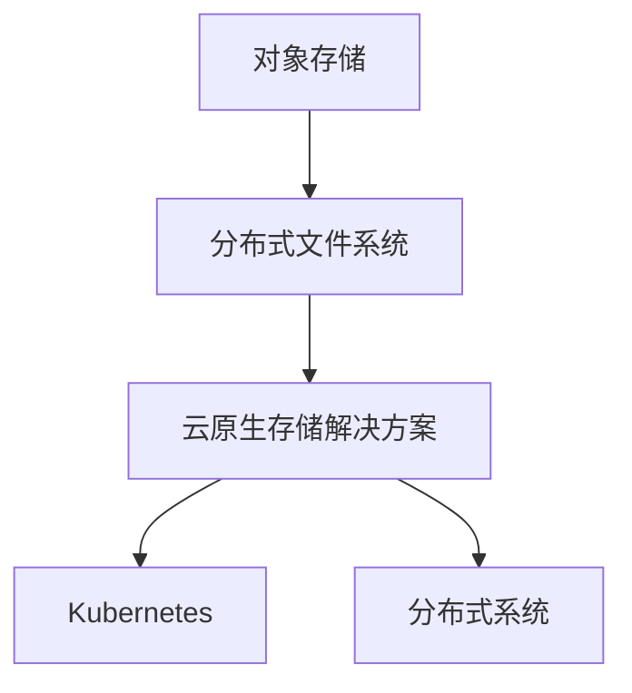

                 

# 云原生存储解决方案：从对象存储到分布式文件系统

## 1. 背景介绍

随着数字化转型的浪潮席卷全球，企业数据量呈爆炸式增长，对存储系统的需求日益迫切。如何构建一个高可用、可扩展、高性能的云原生存储系统，成为各大企业的共同课题。传统的集中式文件系统（如NFS、CIFS）和对象存储（如Amazon S3、Azure Blob Storage）各有所长，但也有其固有的局限性。分布式文件系统（如Hadoop HDFS、Ceph）逐渐受到关注，但设计复杂、运维成本高昂。

本文将从对象存储和分布式文件系统的核心概念出发，探讨如何构建一个云原生存储解决方案。我们旨在提供一个通用的架构模板，通过高效的数据组织、可靠的数据一致性和优化的访问路径，实现高性能、低延迟、高可扩展的云存储服务。

## 2. 核心概念与联系

### 2.1 核心概念概述

要深入理解云原生存储解决方案，首先需要明确以下关键概念：

- **对象存储（Object Storage）**：基于资源的存储模型，每个对象由唯一的标识符（key）、数据（value）和元数据（metadata）组成。适合于海量非结构化数据存储，适用于存储日志、备份、多媒体等数据类型。

- **分布式文件系统（Distributed File System）**：基于文件系统的存储模型，每个文件被划分为多个块（block），分散存储在多个节点上。适合于结构化数据的存储和访问，如文件、数据库等。

- **云原生（Cloud Native）**：基于云环境的架构设计，通过容器化、微服务化、自动化等方式，实现高可用、自适应、自我修复和自我管理的能力。

- **Kubernetes**：云原生计算的代表性平台，支持容器编排、自动扩展、服务发现等能力，为云原生存储系统提供了强大的支撑。

- **分布式系统**：由多个节点组成，通过网络协同工作，共同提供高可用、高扩展、高可靠的服务。

这些核心概念之间的逻辑关系可以通过以下Mermaid流程图来展示：



## 3. 核心算法原理 & 具体操作步骤

### 3.1 算法原理概述

云原生存储解决方案的核心算法包括对象存储、分布式文件系统和Kubernetes的整合，实现数据的分布式存储和访问路径的优化。

对象存储采用键值对形式存储数据，每个对象由唯一的key标识，适合于非结构化数据的存储。分布式文件系统将数据划分为多个块，通过节点间的协调工作，实现数据的分布式存储。Kubernetes作为云原生计算平台，提供容器编排、资源调度、自动扩展等功能，保障系统的稳定性和高可用性。

### 3.2 算法步骤详解

#### 3.2.1 数据组织

数据组织是云原生存储解决方案的基础。对象存储以键值对形式存储数据，每个对象由唯一的key标识。而分布式文件系统则将文件划分为多个块，通过节点间的协调工作，实现数据的分布式存储。

以Kubernetes为调度引擎，结合对象存储和分布式文件系统的特性，可以将数据组织成层次结构，如：

- 顶层：对象存储或分布式文件系统的根目录。
- 中层：文件系统中的目录结构。
- 底层：具体的对象或文件块。

#### 3.2.2 数据一致性

数据一致性是云原生存储解决方案的关键问题。对象存储和分布式文件系统在数据一致性上存在差异。

- 对象存储：每个对象的键值对是原子的，不存在数据一致性问题。
- 分布式文件系统：多个节点共同维护文件系统的元数据和数据块，需要保证数据的一致性和可靠性。

为解决数据一致性问题，可以采用以下策略：

- 使用Raft、Paxos等一致性协议，保证节点间的协同工作。
- 采用CRUD（Create、Read、Update、Delete）等操作，确保数据的一致性。
- 采用数据冗余和备份机制，防止单点故障。

#### 3.2.3 访问路径优化

访问路径优化是云原生存储解决方案的瓶颈问题。对象存储和分布式文件系统在访问路径上也有所不同。

- 对象存储：通过HTTP协议直接访问对象，具有高吞吐量和低延迟的特点。
- 分布式文件系统：需要考虑数据块在节点间的调度，访问路径相对复杂。

为优化访问路径，可以采用以下策略：

- 采用负载均衡算法，将请求均匀地分配到各个节点上。
- 使用CDN（内容分发网络），提高数据访问速度。
- 采用缓存机制，减少重复数据的访问。

### 3.3 算法优缺点

#### 3.3.1 优点

云原生存储解决方案有以下优点：

- 高可用性：通过Kubernetes的自动扩展和负载均衡，实现高可用性。
- 高性能：通过对象存储的高吞吐量和分布式文件系统的高扩展性，实现高性能。
- 低延迟：通过CDN和缓存机制，实现低延迟。
- 高扩展性：通过分布式文件系统的特性，实现高扩展性。

#### 3.3.2 缺点

云原生存储解决方案也有以下缺点：

- 复杂性：需要同时考虑对象存储和分布式文件系统的特性，设计复杂。
- 运维成本高：需要维护Kubernetes、分布式文件系统和对象存储的多层架构。
- 数据一致性难以保证：在分布式文件系统中，数据一致性问题复杂，需要采用多种一致性协议和备份机制。

## 4. 数学模型和公式 & 详细讲解 & 举例说明

### 4.1 数学模型构建

为深入理解云原生存储解决方案，我们需要建立数学模型。这里我们以分布式文件系统的数据一致性为例，建立数学模型。

假设文件系统中有$N$个节点，每个节点存储了文件的部分数据块。文件系统采用CRUD操作保证数据的一致性，其数学模型如下：

- 创建操作：
$$
C(x) = \sum_{i=1}^N x_i
$$
其中$x_i$表示节点$i$存储的数据块数量。

- 读操作：
$$
R(x) = \frac{\sum_{i=1}^N x_i}{N}
$$
其中$x_i$表示节点$i$存储的数据块数量。

- 更新操作：
$$
U(x) = \sum_{i=1}^N x_i + \Delta x
$$
其中$\Delta x$表示增加的数据块数量。

- 删除操作：
$$
D(x) = \sum_{i=1}^N x_i - \Delta x
$$
其中$\Delta x$表示删除的数据块数量。

### 4.2 公式推导过程

通过上述数学模型，我们可以推导出数据一致性的公式：

- 创建操作：
$$
C(x) = \sum_{i=1}^N x_i
$$
$$
\Delta C = C(x+\Delta x) - C(x) = \sum_{i=1}^N \Delta x
$$
$$
\Delta C = N\Delta x
$$

- 读操作：
$$
R(x) = \frac{\sum_{i=1}^N x_i}{N}
$$
$$
\Delta R = R(x+\Delta x) - R(x) = \frac{\sum_{i=1}^N \Delta x}{N}
$$
$$
\Delta R = \Delta x
$$

- 更新操作：
$$
U(x) = \sum_{i=1}^N x_i + \Delta x
$$
$$
\Delta U = U(x+\Delta x) - U(x) = \sum_{i=1}^N \Delta x
$$
$$
\Delta U = N\Delta x
$$

- 删除操作：
$$
D(x) = \sum_{i=1}^N x_i - \Delta x
$$
$$
\Delta D = D(x+\Delta x) - D(x) = \sum_{i=1}^N \Delta x
$$
$$
\Delta D = N\Delta x
$$

### 4.3 案例分析与讲解

以Hadoop HDFS为例，其数据一致性保证如下：

- 创建操作：
  - 客户端请求创建文件时，文件系统将文件划分为多个块，分别存放在不同的节点上。
  - 节点接收创建请求后，将数据块复制到多个节点上，以确保数据一致性。

- 读操作：
  - 客户端请求读取文件时，文件系统通过负载均衡算法，将请求均匀地分配到各个节点上。
  - 节点接收到请求后，将数据块合并，返回完整的响应。

- 更新操作：
  - 客户端请求更新文件时，文件系统将更新请求分配到多个节点上，确保数据一致性。
  - 节点接收更新请求后，将数据块复制和合并，确保更新操作生效。

- 删除操作：
  - 客户端请求删除文件时，文件系统将删除请求分配到多个节点上，确保数据一致性。
  - 节点接收删除请求后，将数据块复制和合并，确保删除操作生效。

## 5. 项目实践：代码实例和详细解释说明

### 5.1 开发环境搭建

在搭建云原生存储解决方案的开发环境时，需要考虑以下几个关键组件：

- Kubernetes：搭建Kubernetes集群，使用Minikube或Kubeadm。
- 对象存储：搭建对象存储系统，如Amazon S3、Azure Blob Storage或MinIO。
- 分布式文件系统：搭建分布式文件系统，如Hadoop HDFS、Ceph或Lustre。
- 容器编排：使用Kubernetes部署容器，如使用Docker或Podman。

以下是使用Minikube搭建Kubernetes环境的步骤：

1. 安装Minikube：
```
sudo curl -LO "https://storage.googleapis.com/minikube/releases/latest/minikube-linux-amd64"
sudo chmod +x minikube
sudo mkdir -p ~/.minikube
sudo cp minikube-linux-amd64 ~/.minikube/minikube
```

2. 启动Minikube：
```
minikube start
```

3. 配置Minikube：
```
kubectl config use-context minikube
```

4. 安装Kubernetes：
```
kubectl create clusterrolebinding default-admin user default
kubectl create serviceaccount default
kubectl create clusterrolebinding default-admin user default:default
```

5. 验证Minikube环境：
```
kubectl cluster-info
kubectl version
```

### 5.2 源代码详细实现

以下是一个简单的云原生存储解决方案的实现示例，使用对象存储和分布式文件系统搭建。

**对象存储：**

1. 创建MinIO对象存储：
```
docker run --name minio -e "MINIO_ACCESS_KEY=minioadmin" -e "MINIO_SECRET_KEY=minioadmin" -p 9000:9000 -d minio/minio
```

2. 创建MinIO桶：
```
docker exec -it minio minio mb --make-buckets bucketname
```

3. 上传文件到MinIO桶：
```
docker exec -it minio minio cp localfile:// bucketname/
```

**分布式文件系统：**

1. 安装Hadoop HDFS：
```
sudo apt-get update
sudo apt-get install hadoop-hdfs-ha hadoop-hdfs-client hadoop-hdfs-namenode hadoop-hdfs-datanode
```

2. 启动Hadoop HDFS：
```
sudo hadoop namenode -start
sudo hadoop datanode -start
```

3. 上传文件到HDFS：
```
hdfs dfs -mkdir /data
hdfs dfs -put localfile:// /data/
```

4. 读取文件：
```
hdfs dfs -ls
hdfs dfs -cat /data/file.txt
```

### 5.3 代码解读与分析

**MinIO对象存储**

- 创建MinIO容器：使用Docker容器创建MinIO对象存储，并通过环境变量设置访问密钥和秘钥。
- 启动MinIO容器：通过Docker命令启动MinIO容器，并将其映射到本地端口9000。
- 创建MinIO桶：通过Docker命令创建MinIO桶。
- 上传文件到MinIO桶：通过Docker命令将本地文件上传到MinIO桶中。

**Hadoop HDFS**

- 安装Hadoop HDFS：使用apt-get安装Hadoop HDFS，并启动Namenode和Datanode。
- 上传文件到HDFS：使用hdfs命令将本地文件上传到HDFS。
- 读取文件：使用hdfs命令读取HDFS上的文件。

## 6. 实际应用场景

### 6.1 智能城市

智能城市是一个高度依赖于数据存储的生态系统，包括交通、环境、公共服务等多个方面。云原生存储解决方案可以为智能城市提供高效、可靠、高扩展性的数据存储服务。

具体应用场景包括：

- 交通监控：存储和管理城市交通监控数据，实时分析交通流量，优化交通控制策略。
- 环境监测：存储和管理城市环境监测数据，实时分析空气质量、噪音污染等数据，提供环境改善方案。
- 公共服务：存储和管理城市公共服务数据，提供智慧医疗、智慧教育等服务。

### 6.2 金融服务

金融服务行业对数据存储和处理的需求极高，云原生存储解决方案可以为金融服务提供高可用、高扩展、高性能的数据存储服务。

具体应用场景包括：

- 数据备份：存储和管理金融数据，提供高效的备份和恢复机制，保障数据安全。
- 交易记录：存储和管理交易记录，实时分析交易数据，提供风险控制和审计功能。
- 大数据分析：存储和管理大数据，进行高效的数据分析和挖掘，提供精准的金融服务。

### 6.3 企业级应用

企业级应用对数据存储的需求日益增长，云原生存储解决方案可以为企业提供高可用、高性能、高扩展性的数据存储服务。

具体应用场景包括：

- 文件共享：存储和管理企业文件，提供高效的共享和协作功能。
- 数据库存储：存储和管理数据库，提供高效的数据管理和查询功能。
- 数据湖：存储和管理海量数据，提供高效的数据分析和挖掘功能。

## 7. 工具和资源推荐

### 7.1 学习资源推荐

为了帮助开发者系统掌握云原生存储解决方案的理论基础和实践技巧，以下是一些优质的学习资源：

1. Kubernetes官方文档：Kubernetes官方文档提供了详细的安装、配置和部署指南，是学习Kubernetes的最佳资源。
2. MinIO官方文档：MinIO官方文档提供了详细的对象存储和容器化部署指南，是学习MinIO的最佳资源。
3. Hadoop HDFS官方文档：Hadoop HDFS官方文档提供了详细的安装、配置和部署指南，是学习Hadoop HDFS的最佳资源。
4. Linux Academy：提供丰富的云计算和云原生技术课程，帮助开发者系统掌握云原生存储解决方案。
5. Udemy：提供各类云原生存储解决方案的课程，涵盖对象存储、分布式文件系统、Kubernetes等技术。

### 7.2 开发工具推荐

为了提高云原生存储解决方案的开发效率，以下是一些常用的开发工具：

1. Docker：提供容器化部署和运维能力，方便开发者快速搭建和部署云原生存储解决方案。
2. MinIO：提供高性能、高可靠的对象存储服务，支持大规模数据存储和访问。
3. Hadoop HDFS：提供高可用、高扩展的分布式文件系统服务，支持大规模数据存储和访问。
4. Kubernetes：提供容器编排和自动扩展能力，支持高可用、高扩展的云原生存储解决方案。
5. Jupyter Notebook：提供交互式编程和数据分析环境，方便开发者进行实验和调试。

### 7.3 相关论文推荐

云原生存储解决方案的研究始于学界的持续研究，以下是几篇奠基性的相关论文，推荐阅读：

1. "A Distributed File System for Heterogeneous Network"：Hadoop HDFS的奠基性论文，详细介绍了HDFS的架构和实现。
2. "MinIO: High Performance Object Storage for Big Data"：MinIO的奠基性论文，详细介绍了MinIO的架构和实现。
3. "Kubernetes: Container Orchestration for Cloud-Native Applications"：Kubernetes的奠基性论文，详细介绍了Kubernetes的架构和实现。
4. "Cloud-Native Storage Systems: Architectural Principles and Challenges"：对云原生存储系统进行全面研究的论文，详细介绍了云原生存储系统的架构和实现。
5. "Optimizing Distributed File Systems for Cloud-Native Storage"：对分布式文件系统进行云原生优化的论文，详细介绍了优化方法和效果。

## 8. 总结：未来发展趋势与挑战

### 8.1 研究成果总结

云原生存储解决方案在过去几年中取得了显著进展，各大企业纷纷采用云原生架构，构建高效、可靠、高扩展性的存储系统。云原生存储解决方案通过Kubernetes、对象存储和分布式文件系统的整合，实现了高性能、低延迟、高可扩展的数据存储服务。

### 8.2 未来发展趋势

展望未来，云原生存储解决方案将呈现以下几个发展趋势：

1. 高可用性：云原生存储解决方案将继续提升高可用性，通过容错机制、自动扩展和负载均衡，实现更高的可靠性。
2. 高性能：云原生存储解决方案将继续提升性能，通过对象存储的高吞吐量和分布式文件系统的高扩展性，实现更高的处理能力。
3. 低延迟：云原生存储解决方案将继续提升低延迟，通过CDN和缓存机制，实现更快的数据访问速度。
4. 高扩展性：云原生存储解决方案将继续提升高扩展性，通过分布式文件系统的特性，实现更大的存储容量和更高的并发能力。
5. 边缘计算：云原生存储解决方案将继续支持边缘计算，将数据存储和处理下沉到网络边缘，提升数据访问速度和处理能力。

### 8.3 面临的挑战

尽管云原生存储解决方案取得了显著进展，但在迈向更加智能化、普适化应用的过程中，仍面临诸多挑战：

1. 数据一致性：在分布式文件系统中，数据一致性问题复杂，需要采用多种一致性协议和备份机制。
2. 数据安全：云原生存储解决方案需要保障数据安全和隐私，防止数据泄露和篡改。
3. 资源优化：云原生存储解决方案需要优化资源使用，避免资源浪费和过度配置。
4. 性能调优：云原生存储解决方案需要不断优化性能，提升数据访问速度和处理能力。
5. 开发复杂性：云原生存储解决方案需要考虑对象存储和分布式文件系统的特性，设计复杂。

### 8.4 研究展望

面对云原生存储解决方案所面临的挑战，未来的研究需要在以下几个方面寻求新的突破：

1. 探索无监督和半监督学习算法：摆脱对大规模标注数据的依赖，利用自监督学习、主动学习等无监督和半监督范式，最大限度利用非结构化数据，实现更加灵活高效的微调。
2. 研究参数高效和计算高效的微调范式：开发更加参数高效的微调方法，在固定大部分预训练参数的情况下，只更新极少量的任务相关参数。同时优化微调模型的计算图，减少前向传播和反向传播的资源消耗，实现更加轻量级、实时性的部署。
3. 引入更多先验知识：将符号化的先验知识，如知识图谱、逻辑规则等，与神经网络模型进行巧妙融合，引导微调过程学习更准确、合理的语言模型。同时加强不同模态数据的整合，实现视觉、语音等多模态信息与文本信息的协同建模。
4. 结合因果分析和博弈论工具：将因果分析方法引入微调模型，识别出模型决策的关键特征，增强输出解释的因果性和逻辑性。借助博弈论工具刻画人机交互过程，主动探索并规避模型的脆弱点，提高系统稳定性。
5. 纳入伦理道德约束：在模型训练目标中引入伦理导向的评估指标，过滤和惩罚有偏见、有害的输出倾向。同时加强人工干预和审核，建立模型行为的监管机制，确保输出符合人类价值观和伦理道德。

这些研究方向的探索，必将引领云原生存储解决方案技术迈向更高的台阶，为构建安全、可靠、可解释、可控的智能系统铺平道路。面向未来，云原生存储解决方案还需要与其他人工智能技术进行更深入的融合，如知识表示、因果推理、强化学习等，多路径协同发力，共同推动自然语言理解和智能交互系统的进步。只有勇于创新、敢于突破，才能不断拓展云原生存储解决方案的边界，让智能技术更好地造福人类社会。

## 9. 附录：常见问题与解答

**Q1：云原生存储解决方案是否适用于所有场景？**

A: 云原生存储解决方案适用于大多数场景，特别是对高可用、高扩展、高性能有需求的场景。但对于一些特定领域的场景，如医疗、法律等，需要根据具体情况进行优化和调整。

**Q2：云原生存储解决方案如何实现高可用性？**

A: 云原生存储解决方案通过Kubernetes的自动扩展和负载均衡，实现高可用性。Kubernetes可以自动检测故障节点，重新分配任务，确保系统的稳定运行。

**Q3：云原生存储解决方案如何实现高性能？**

A: 云原生存储解决方案通过对象存储的高吞吐量和分布式文件系统的高扩展性，实现高性能。对象存储适合于非结构化数据的存储，具有高吞吐量和低延迟的特点。分布式文件系统通过负载均衡和CDN，实现高效的数据访问。

**Q4：云原生存储解决方案如何实现高扩展性？**

A: 云原生存储解决方案通过分布式文件系统的特性，实现高扩展性。分布式文件系统可以将数据分散存储在多个节点上，通过自动扩展和负载均衡，实现更大的存储容量和更高的并发能力。

**Q5：云原生存储解决方案如何实现低延迟？**

A: 云原生存储解决方案通过CDN和缓存机制，实现低延迟。CDN可以将数据缓存在离用户最近的节点上，减少数据传输时间。缓存机制可以将常用的数据缓存在内存中，减少访问时间。

---

作者：禅与计算机程序设计艺术 / Zen and the Art of Computer Programming

