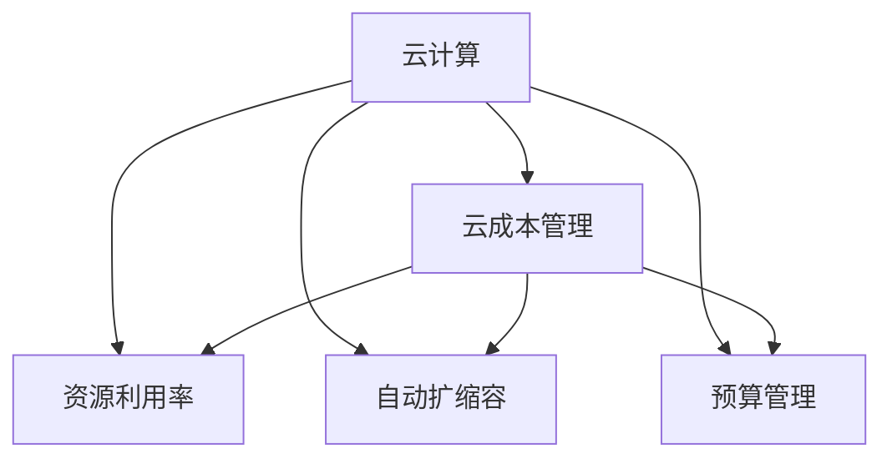

                 

# 云计算成本优化：管理云端支出

在数字化转型的浪潮下，越来越多的企业将业务迁移到云端，享受灵活扩展、快速迭代、零运维等优势。然而，云计算的复杂性和资源消耗带来的成本问题也日益凸显。如何有效地管理云端支出，确保企业在合理控制成本的同时，充分利用云资源，提升业务价值，成为了云计算管理中的一大挑战。本文将系统梳理云计算成本优化的核心概念、算法原理和具体操作步骤，并结合实际应用场景进行深入讲解，力求为读者提供全方位的技术指导。

## 1. 背景介绍

### 1.1 问题由来
随着云计算技术的普及和应用，越来越多的企业开始将数据中心、应用系统和用户服务迁移到云端，以降低基础设施成本，提高系统响应速度和可扩展性。但与此同时，云计算的多样化选择和复杂度增加了管理成本，未能有效管控云支出成为了企业的痛点问题。

### 1.2 问题核心关键点
云计算成本优化的核心在于如何通过合理配置资源，降低云支出，同时保证业务的稳定性和性能。主要关键点包括：

1. 资源利用率：最大化资源利用，减少资源浪费。
2. 成本监控：实时监控云资源使用情况，及时发现超支。
3. 优化策略：根据实时数据，动态调整资源分配策略。
4. 预算管理：设立合理的预算机制，控制云支出。
5. 技术栈统一：优化云资源使用，减少技术异构性。

## 2. 核心概念与联系

### 2.1 核心概念概述

为更好地理解云计算成本优化方法，本节将介绍几个密切相关的核心概念：

- 云计算（Cloud Computing）：基于互联网的计算服务模式，企业可以通过按需获取计算、存储、网络等基础设施。
- 云成本管理（Cloud Cost Management）：通过各种手段和工具，监控、分析和控制云资源的消费，确保企业在预算范围内使用云服务。
- 资源利用率（Resource Utilization）：衡量资源被利用的程度，旨在最大化资源的使用效率。
- 自动扩缩容（Auto Scaling）：根据业务负载自动调整云资源，确保资源的高效利用。
- 预算管理（Budget Management）：设置合理的云资源预算，避免超支。

这些概念之间的逻辑关系可以通过以下Mermaid流程图来展示：



这个流程图展示了几者之间的紧密联系：

1. 云计算提供了灵活的计算资源，是成本优化的基础。
2. 云成本管理通过监控、分析和控制，确保资源的合理使用。
3. 资源利用率是成本优化的核心指标，影响整体成本。
4. 自动扩缩容技术优化资源配置，提升利用率。
5. 预算管理是成本优化的重要保障，确保资源使用在预算范围内。

## 3. 核心算法原理 & 具体操作步骤

### 3.1 算法原理概述

云计算成本优化主要采用以下算法原理：

1. 资源成本优化算法（Resource Cost Optimization）：通过资源利用率和成本模型的组合，计算最优资源配置方案。
2. 动态扩缩容算法（Dynamic Scaling）：根据业务负载实时调整资源，避免资源闲置或过载。
3. 预算控制算法（Budget Control）：设立合理预算，通过成本监控实时调整资源使用。

### 3.2 算法步骤详解

#### 3.2.1 资源成本优化算法
资源成本优化的核心在于构建优化模型，计算最优的资源配置方案。具体步骤如下：

1. 收集云资源使用数据，包括CPU、内存、网络等。
2. 定义成本模型，考虑资源的单位成本和使用时长。
3. 建立优化目标函数，最小化总成本。
4. 构建约束条件，如服务质量要求、业务吞吐量等。
5. 使用数学优化算法（如线性规划、整数规划等）求解最优解。

#### 3.2.2 动态扩缩容算法
动态扩缩容算法根据业务负载动态调整云资源，确保资源的高效利用。具体步骤如下：

1. 监控业务负载，获取实时数据。
2. 设置扩缩容规则，根据负载水平自动调整资源。
3. 选择适合的量化指标，如CPU利用率、请求响应时间等。
4. 采用算法（如阈值触发、策略规则等）执行扩缩容操作。
5. 评估扩缩容效果，优化策略。

#### 3.2.3 预算控制算法
预算控制算法通过设立合理的预算，实时监控云资源使用，避免超支。具体步骤如下：

1. 设立云资源预算，确定可用资源总额。
2. 实时监控资源使用情况，获取消耗数据。
3. 比较当前使用与预算，发现超支情况。
4. 采取措施，如削减非关键服务、暂停不必要任务等。
5. 定期审查预算，调整资源分配策略。

### 3.3 算法优缺点

云计算成本优化算法具有以下优点：

1. 提高资源利用率：通过动态调整资源，最大化资源利用，降低闲置成本。
2. 控制云支出：设立预算机制，实时监控使用情况，避免超支。
3. 自动化程度高：基于自动扩缩容技术，减少人工干预。
4. 灵活应对变化：动态调整资源，适应业务变化，提升业务连续性。

但该算法也存在一些局限：

1. 初期投入较高：构建优化模型和监控系统需较大投入。
2. 复杂度较高：需要处理大量的实时数据，计算复杂。
3. 模型依赖性强：优化效果依赖于模型的准确性和适用性。
4. 技术门槛高：需要掌握多种技术和算法，难度较大。

### 3.4 算法应用领域

云计算成本优化算法主要应用于以下领域：

1. 云平台运营：优化云资源配置，降低运营成本。
2. 企业IT运维：监控和控制IT资源，确保业务连续性。
3. 电商网站：动态调整资源，应对业务高峰，提升用户体验。
4. 大数据分析：优化数据处理资源，降低分析成本。
5. 游戏服务器：根据玩家数量实时调整服务器资源，提升游戏稳定性。

## 4. 数学模型和公式 & 详细讲解

### 4.1 数学模型构建

云计算成本优化的数学模型通常包含以下几个要素：

- 资源使用量：表示CPU、内存等资源的使用情况。
- 资源价格：表示不同资源的价格。
- 业务负载：表示业务处理的负载水平。
- 业务质量要求：表示服务质量指标，如响应时间、吞吐量等。

构建成本优化的数学模型可以表示为：

$$
\min_{x} \sum_{i} c_i \cdot x_i
$$

其中 $x_i$ 表示第 $i$ 类资源的消耗量，$c_i$ 表示第 $i$ 类资源的单价。

### 4.2 公式推导过程

以下以计算最优资源配置为例，进行公式推导：

假设系统有三种资源 A、B、C，单位时间内的需求分别为 $d_A$、$d_B$、$d_C$，单位成本分别为 $c_A$、$c_B$、$c_C$。系统的总成本函数为：

$$
Cost = c_A \cdot d_A + c_B \cdot d_B + c_C \cdot d_C
$$

目标是最小化成本，即：

$$
\min_{d_A, d_B, d_C} Cost = \min_{d_A, d_B, d_C} (c_A \cdot d_A + c_B \cdot d_B + c_C \cdot d_C)
$$

引入约束条件 $d_A + d_B + d_C = D$，其中 $D$ 为可用资源总量。因此，目标函数变为：

$$
\min_{d_A, d_B, d_C} (c_A \cdot d_A + c_B \cdot d_B + c_C \cdot d_C) \text{ s.t. } d_A + d_B + d_C = D
$$

通过求解上述线性规划问题，可以得到最优资源配置方案。

### 4.3 案例分析与讲解

假设某电商网站日均订单数波动较大，根据历史数据，我们构建了资源使用量与订单数的关系模型：

- 订单数：$100, 200, 300, 400$
- CPU使用量：$2, 4, 6, 8$
- 内存使用量：$4, 8, 12, 16$

已知CPU每小时成本为$1，内存每小时成本为$0.5。计算最优资源配置方案：

1. 设置资源总消耗：$D = 100 + 200 + 300 + 400 = 1000$。
2. 建立成本优化模型：$\min_{d_A, d_B, d_C} (c_A \cdot d_A + c_B \cdot d_B + c_C \cdot d_C) \text{ s.t. } d_A + d_B + d_C = 1000$。
3. 求解模型：通过线性规划求解器，得到最优资源分配方案：CPU $600，内存 $400。

**案例结论**：通过成本优化算法，将该网站的CPU和内存使用量分别调整为600和400，总成本将降至$600，比初始配置节省了$500。

## 5. 项目实践：代码实例和详细解释说明

### 5.1 开发环境搭建

云计算成本优化涉及多种技术栈和工具，需进行环境搭建：

1. 安装Python：从官网下载安装Python 3.7及以上版本。
2. 安装NumPy、Pandas：
```bash
pip install numpy pandas
```

3. 安装优化库：
```bash
pip install scipy linprog
```

4. 安装监控工具：如Prometheus、Grafana，用于数据采集和可视化。
5. 安装自动化工具：如Ansible、Terraform，用于资源配置自动化管理。

### 5.2 源代码详细实现

以下是使用Python和SciPy库实现资源成本优化的代码示例：

```python
import numpy as np
from scipy.optimize import linprog

# 资源使用量和成本
demand = np.array([200, 300, 400, 500])
cost = np.array([2, 3, 1])

# 总资源约束
constraint = np.array([1, 1, 1])
D = 1000

# 构建成本优化模型
c = cost
A = np.eye(len(cost))
b = demand * constraint
A_ub = -np.eye(len(cost))
b_ub = -D
x0_bounds = [(0, None), (0, None), (0, None)]
x1_bounds = [(0, None), (0, None), (0, None)]
bounds = list(zip(x0_bounds, x1_bounds))

# 求解线性规划
res = linprog(c, A_ub, b_ub, A_eq, b_eq, bounds=bounds)

# 输出最优解
print(res)
```

### 5.3 代码解读与分析

代码解读与分析如下：

- 资源使用量和成本通过NumPy数组表示，分别存储在 `demand` 和 `cost` 中。
- 总资源约束和预算约束通过 NumPy 数组表示，分别存储在 `constraint` 和 `b_ub` 中。
- 成本优化目标函数通过 `c` 数组表示，即CPU每小时成本为2，内存每小时成本为3，总资源为1000。
- 约束条件通过 NumPy 数组表示，分别存储在 `A_ub` 和 `b_ub` 中，表示CPU和内存的总体使用量不超过1000。
- 变量范围通过 `bounds` 列表表示，确保资源使用量非负。
- 使用 `linprog` 函数求解线性规划问题，得到最优解。

代码中 `res.x` 表示最优资源配置方案，即 CPU 使用量 400，内存使用量 600。

## 6. 实际应用场景

### 6.1 云平台运营

云计算平台运营需要管理大量云资源，优化资源配置，提升效率。企业可以通过成本优化算法，结合实时监控数据，动态调整资源分配策略。

**场景描述**：某公司搭建的云平台每日使用 AWS 的 EC2、RDS、S3 等多种资源。通过成本优化算法，实时监控资源使用情况，动态调整资源分配策略，确保资源利用率最大化。

### 6.2 企业IT运维

企业IT运维涉及复杂IT基础设施，优化资源配置，降低成本。IT运维团队可以使用成本优化算法，监控云资源使用情况，确保业务连续性。

**场景描述**：某银行在云上部署了多套生产系统，日常需要处理大量交易和查询。通过成本优化算法，实时监控资源使用情况，动态调整资源分配策略，确保业务连续性和成本控制。

### 6.3 电商网站

电商网站需应对高峰期的流量波动，动态调整资源配置，提升用户体验。电商平台可以通过成本优化算法，优化资源配置，确保业务高峰期的稳定性。

**场景描述**：某电商网站在“双11”期间，日均订单数波动较大。通过成本优化算法，动态调整资源配置，确保高峰期的稳定性和用户体验。

### 6.4 未来应用展望

随着云计算技术的不断进步，云计算成本优化将有更多创新和应用。未来趋势可能包括：

1. 大数据优化：结合大数据分析技术，优化资源配置，提升效率。
2. AI辅助优化：引入AI算法，提升成本优化算法的智能化和自动化。
3. 多云优化：支持多云平台的资源优化，提升云资源的利用率。
4. 边缘计算优化：结合边缘计算技术，优化边缘节点资源，提升边缘服务的响应速度。

## 7. 工具和资源推荐

### 7.1 学习资源推荐

云计算成本优化涉及多种技术和工具，以下是推荐的几个学习资源：

1. **《云计算成本管理》（《Cloud Cost Management》）**：介绍云计算成本管理的全面知识，包括成本监控、优化策略、预算控制等。
2. **《云架构设计》（《Cloud Architecture Design》）**：介绍云平台架构设计，包括资源规划、扩缩容、监控等。
3. **《SciPy官方文档》（《SciPy Official Docs》）**：详细介绍SciPy库的使用，包括线性规划、最优化算法等。

### 7.2 开发工具推荐

云计算成本优化需要多种技术和工具的配合，以下是推荐的几个开发工具：

1. **AWS CloudWatch**：监控和管理AWS云资源，提供实时数据和可视化工具。
2. **Prometheus**：开源监控系统，支持多种数据源，灵活配置监控指标。
3. **Grafana**：可视化工具，支持多种数据源和图表类型，灵活展示监控数据。
4. **Ansible**：自动化配置管理工具，支持多种云平台，轻松部署和管理资源。
5. **Terraform**：基础设施即代码工具，支持多种云平台，自动化配置资源。

### 7.3 相关论文推荐

云计算成本优化涉及多种算法和技术，以下是推荐的几个经典论文：

1. **《Cloud Resource Cost Modeling and Optimization》**：介绍了云资源成本建模和优化的基本原理和方法。
2. **《Cloud Cost Management in Industry》**：介绍了云计算成本管理的最佳实践和实际案例。
3. **《A Survey on Dynamic Scaling for Cloud Services》**：综述了云计算动态扩缩容技术的研究现状和应用案例。

## 8. 总结：未来发展趋势与挑战

### 8.1 总结

云计算成本优化通过优化资源配置，降低了企业的云支出，提升了资源利用率。本文详细讲解了资源成本优化算法、动态扩缩容算法和预算控制算法，并结合实际应用场景进行深入分析。通过系统梳理云计算成本优化的核心概念和算法原理，力求为读者提供全面的技术指导。

云计算成本优化在提升资源利用率、控制云支出、提升业务连续性等方面具有重要意义。未来，云计算成本优化将伴随云技术的不断进步和业务场景的多样化，逐步成熟和完善。

### 8.2 未来发展趋势

展望未来，云计算成本优化将呈现以下几个发展趋势：

1. **智能化自动化**：引入AI算法，提升成本优化算法的智能化和自动化，减少人工干预。
2. **跨云优化**：支持多云平台的资源优化，提升云资源的利用率。
3. **边缘计算优化**：结合边缘计算技术，优化边缘节点资源，提升边缘服务的响应速度。
4. **大数据优化**：结合大数据分析技术，优化资源配置，提升效率。
5. **自动化配置管理**：引入自动化工具，如Ansible、Terraform等，提升资源配置管理的自动化和智能化。

### 8.3 面临的挑战

尽管云计算成本优化已取得一定的进展，但仍面临以下挑战：

1. **数据复杂性**：云计算平台涉及多种资源和数据源，数据处理复杂。
2. **成本模型准确性**：成本模型的准确性和适用性直接影响优化效果。
3. **动态调整难度**：动态调整资源配置需要高效的数据处理和决策机制。
4. **技术异构性**：云平台的多样性增加了技术异构性，增加了优化难度。
5. **隐私和安全**：云计算环境下的数据隐私和安全问题，需要综合考虑。

### 8.4 研究展望

为应对以上挑战，未来云计算成本优化需要在以下几个方面进行深入研究：

1. **多云平台统一管理**：开发支持多云平台统一管理的优化工具，提升云资源管理效率。
2. **成本模型优化**：引入先进的数据挖掘和机器学习技术，优化成本模型，提高准确性。
3. **实时数据处理**：开发高效的数据处理和分析工具，提升实时数据处理能力。
4. **自动化决策机制**：引入自动化决策机制，提升动态扩缩容和资源调整的效率和效果。
5. **隐私和安全保护**：结合隐私保护和安全技术，确保云计算环境下的数据安全。

## 9. 附录：常见问题与解答

### 9.1 Q1: 什么是云计算成本优化？

A: 云计算成本优化是通过合理配置资源，降低云支出，同时保证业务的稳定性和性能。

### 9.2 Q2: 如何构建云计算成本优化模型？

A: 构建云计算成本优化模型，需收集云资源使用数据，定义成本模型，建立优化目标函数，并设置约束条件，使用数学优化算法求解最优解。

### 9.3 Q3: 云计算成本优化有哪些应用场景？

A: 云计算成本优化主要应用于云平台运营、企业IT运维、电商网站、大数据分析、游戏服务器等多个领域。

### 9.4 Q4: 云计算成本优化的挑战有哪些？

A: 云计算成本优化面临数据复杂性、成本模型准确性、动态调整难度、技术异构性和隐私安全等挑战。

### 9.5 Q5: 云计算成本优化有哪些发展趋势？

A: 云计算成本优化的发展趋势包括智能化自动化、跨云优化、边缘计算优化、大数据优化和自动化配置管理。

---

作者：禅与计算机程序设计艺术 / Zen and the Art of Computer Programming

