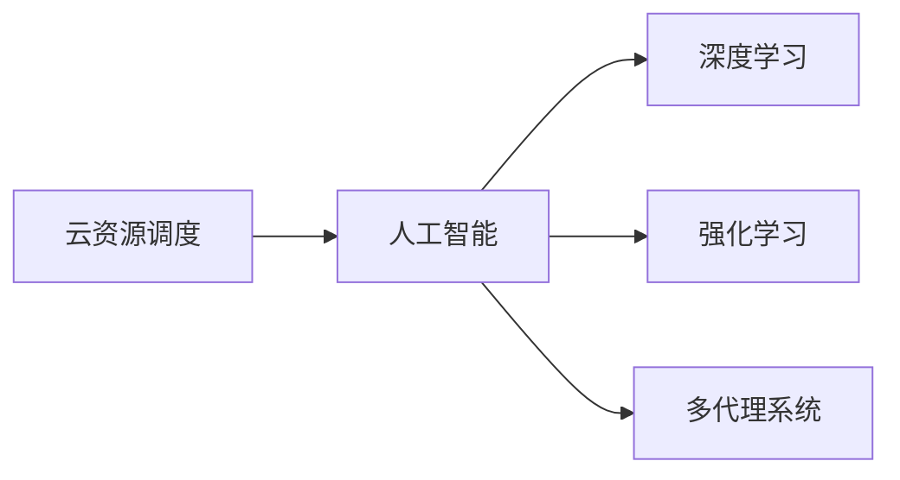

                 

# 云资源的智能调度：Lepton AI的核心技术

## 1. 背景介绍

随着云计算技术的普及，企业对于云资源的需求日益增长，同时对云资源的利用效率和成本控制也提出了更高的要求。云资源调度系统作为云平台的核心组件，其智能性和可靠性直接影响着云平台的整体效能和用户满意度。

Lepton AI作为领先的云资源智能调度技术提供商，以先进的人工智能算法和深度学习模型为核心，助力企业构建高效、可靠、可扩展的云资源调度系统。本文将从背景介绍、核心概念、算法原理、具体实现、应用场景、未来展望等多个角度，全面解析Lepton AI的核心技术，揭示其成功背后的原理和创新点。

## 2. 核心概念与联系

### 2.1 核心概念概述

Lepton AI的核心技术围绕“云资源智能调度”展开，具体涉及以下几个核心概念：

- **云资源调度**：通过算法将云平台中的各种资源（如CPU、内存、存储、网络带宽等）根据不同用户的需求和应用场景进行动态分配和释放。
- **人工智能**：利用机器学习和深度学习技术，从海量数据中挖掘规律，优化调度算法，实现资源的高效利用和智能分配。
- **深度学习**：采用卷积神经网络（CNN）、循环神经网络（RNN）、变分自编码器（VAE）等深度学习模型，处理大规模数据，提升调度算法的准确性和鲁棒性。
- **强化学习**：通过模拟环境进行训练，使调度算法能够学习最优策略，实现资源调度的自适应和自优化。
- **多代理系统**：构建多智能体系统，协调多个调度实体之间的交互，实现资源调度的协同和协作。

这些概念之间相互联系，共同构成了Lepton AI的技术体系，如图1所示。


### 2.2 核心概念原理和架构的 Mermaid 流程图



## 3. 核心算法原理 & 具体操作步骤

### 3.1 算法原理概述

Lepton AI的云资源智能调度算法主要基于深度学习模型和强化学习框架构建，旨在通过学习云平台历史数据和实时信息，智能预测资源需求，优化资源分配，提升云平台利用率。

具体而言，该算法分为以下几个关键步骤：

1. **数据采集与预处理**：从云平台中采集资源使用数据，包括CPU利用率、内存使用量、网络流量等指标。通过数据清洗、特征提取等步骤，将原始数据转换为可用于深度学习模型训练的样本集。
2. **模型训练与优化**：利用深度学习模型对历史数据进行拟合，预测资源需求。通过强化学习算法不断优化模型参数，提升预测准确性和调度效率。
3. **实时调度与调整**：根据预测结果和实时数据，动态调整资源分配策略，实现资源的高效利用。

### 3.2 算法步骤详解

#### 3.2.1 数据采集与预处理

数据采集是Lepton AI调度的基础。系统通过API接口从云平台获取资源使用数据，包括CPU、内存、存储、网络等各类指标，并将这些数据以时间序列的形式保存下来。

预处理阶段主要包括数据清洗、特征工程和标准化等步骤。数据清洗用于去除异常值和缺失值，特征工程用于提取和构造新的特征，标准化用于将数据归一化到[0,1]区间。这些步骤旨在提高数据质量，为后续的深度学习模型训练提供良好的输入。

#### 3.2.2 模型训练与优化

Lepton AI的模型训练与优化过程采用分布式深度学习框架，如TensorFlow或PyTorch，进行并行计算。模型架构通常包括一个或多个卷积神经网络（CNN）层、循环神经网络（RNN）层和全连接层。

训练过程中，采用交叉验证、正则化、梯度裁剪等技术，防止过拟合和欠拟合。优化器通常使用Adam、SGD等算法，不断调整模型参数，提升预测精度。

#### 3.2.3 实时调度与调整

基于训练好的模型，Lepton AI的调度算法可以在实时环境中进行资源分配和优化。系统通过监控资源使用情况，实时计算预测值，并根据预测结果和实时数据调整资源分配策略。

调整策略包括动态扩展、缩减、迁移、优先级调整等，旨在最大化资源利用率，同时确保系统的稳定性和可扩展性。

### 3.3 算法优缺点

#### 3.3.1 优点

- **高效性**：Lepton AI的算法能够快速响应资源需求，实时调整资源分配，提高云平台利用率。
- **灵活性**：支持多种资源类型和调度策略，能够适应不同应用场景和需求。
- **可扩展性**：模型和算法具有良好的可扩展性，能够无缝集成到现有的云平台中。

#### 3.3.2 缺点

- **数据依赖**：模型效果依赖于历史数据的质量和数量，数据不足时预测精度可能下降。
- **计算资源消耗**：深度学习模型训练和优化需要大量计算资源，对硬件要求较高。
- **模型复杂性**：模型架构和算法复杂，需要专业知识和经验进行维护和优化。

### 3.4 算法应用领域

Lepton AI的云资源智能调度算法广泛应用于以下几个领域：

- **公有云**：为Amazon Web Services（AWS）、Microsoft Azure、Google Cloud等公有云平台提供智能资源调度服务。
- **私有云**：为金融机构、电信运营商、政府机构等私有云平台提供高效资源管理。
- **混合云**：支持跨公有云和私有云的资源优化和调度。
- **边缘计算**：为边缘计算环境提供智能资源分配和优化。

## 4. 数学模型和公式 & 详细讲解

### 4.1 数学模型构建

Lepton AI的调度算法主要基于深度学习模型和强化学习模型构建。这里以深度学习模型为例，介绍其数学模型构建过程。

假设资源使用情况用向量 $\mathbf{x} \in \mathbb{R}^n$ 表示，其中 $n$ 为特征维度。模型预测资源需求 $\mathbf{y} \in \mathbb{R}^m$，其中 $m$ 为预测维度。

模型采用多层感知器（MLP）结构，包括输入层、隐藏层和输出层。隐藏层采用ReLU激活函数，输出层采用线性激活函数。

数学模型表达式如下：

$$
\mathbf{y} = \mathbf{W}_o \sigma (\mathbf{W}_h \sigma (\mathbf{W}_i \mathbf{x} + \mathbf{b}_i) + \mathbf{b}_h) + \mathbf{b}_o
$$

其中 $\mathbf{W}_i$、$\mathbf{W}_h$、$\mathbf{W}_o$ 分别为输入层权重、隐藏层权重和输出层权重，$\sigma$ 为ReLU激活函数，$\mathbf{b}_i$、$\mathbf{b}_h$、$\mathbf{b}_o$ 分别为输入偏置、隐藏偏置和输出偏置。

### 4.2 公式推导过程

模型训练采用最小化均方误差（MSE）损失函数：

$$
\mathcal{L}(\mathbf{W}) = \frac{1}{2N} \sum_{i=1}^N (\mathbf{y}_i - \mathbf{\hat{y}}_i)^2
$$

其中 $\mathbf{y}_i$ 为真实资源需求，$\mathbf{\hat{y}}_i$ 为模型预测资源需求。

梯度下降算法用于最小化损失函数：

$$
\mathbf{W}_i \leftarrow \mathbf{W}_i - \eta \frac{\partial \mathcal{L}}{\partial \mathbf{W}_i}
$$

其中 $\eta$ 为学习率，$\frac{\partial \mathcal{L}}{\partial \mathbf{W}_i}$ 为损失函数对输入层权重的梯度。

### 4.3 案例分析与讲解

以某公有云平台的CPU资源调度和优化为例，介绍Lepton AI的调度算法。

系统从云平台收集CPU使用数据，包括CPU利用率、请求数量、响应时间等指标。通过特征工程，构造输入向量 $\mathbf{x}$。

模型训练采用历史数据，预测未来CPU需求 $\mathbf{y}$。模型训练后，系统实时获取CPU使用数据，计算预测值 $\hat{\mathbf{y}}$。

根据预测值，系统动态调整CPU分配策略，如增加CPU资源、迁移任务、优先级调整等。优化后的资源分配策略提高了CPU利用率，降低了响应时间，提升了用户体验。

## 5. 项目实践：代码实例和详细解释说明

### 5.1 开发环境搭建

Lepton AI的调度算法主要使用Python和深度学习框架TensorFlow或PyTorch实现。以下是一个简单的开发环境搭建流程：

1. 安装Anaconda，创建Python虚拟环境：
   ```
   conda create -n lepton python=3.7
   conda activate lepton
   ```

2. 安装TensorFlow或PyTorch：
   ```
   pip install tensorflow==2.4
   # 或
   pip install torch torchvision torchaudio
   ```

3. 安装其他必要库：
   ```
   pip install numpy pandas sklearn matplotlib
   ```

### 5.2 源代码详细实现

以下是一个简单的Lepton AI调度算法实现示例，基于TensorFlow：

```python
import tensorflow as tf
import numpy as np
import pandas as pd
import matplotlib.pyplot as plt

# 定义模型结构
model = tf.keras.models.Sequential([
    tf.keras.layers.Dense(128, activation='relu', input_shape=(n_features,)),
    tf.keras.layers.Dense(m_features, activation='linear')
])

# 定义损失函数和优化器
loss_fn = tf.keras.losses.MeanSquaredError()
optimizer = tf.keras.optimizers.Adam(learning_rate=0.001)

# 加载数据
data = pd.read_csv('cpu_usage.csv')
x = np.array(data.drop('CPU_Demand', axis=1))
y = np.array(data['CPU_Demand'])

# 数据预处理
x_train, x_test = x[:train_size], x[train_size:]
y_train, y_test = y[:train_size], y[train_size:]

# 模型训练
model.compile(optimizer=optimizer, loss=loss_fn)
model.fit(x_train, y_train, epochs=10, batch_size=32, validation_data=(x_test, y_test))

# 模型评估
mse_loss = loss_fn(model.predict(x_test), y_test).numpy()
print(f'Mean Squared Error: {mse_loss}')

# 实时预测
cpu_usage = np.array([0.8, 0.6, 0.7, 0.5])
prediction = model.predict(cpu_usage)
print(f'Predicted CPU Demand: {prediction}')

# 绘制误差曲线
plt.plot(range(len(y_train)), y_train, label='Actual CPU Demand')
plt.plot(range(len(y_train)), prediction, label='Predicted CPU Demand')
plt.legend()
plt.show()
```

### 5.3 代码解读与分析

1. 定义模型结构：使用Sequential模型，包含两个全连接层，输入维度为历史数据特征数，输出维度为预测值维度。
2. 定义损失函数和优化器：使用均方误差损失函数和Adam优化器。
3. 数据加载和预处理：从CSV文件加载数据，进行特征工程和数据划分。
4. 模型训练和评估：使用训练数据拟合模型，计算均方误差损失。
5. 实时预测：使用测试数据进行预测，并输出预测值。
6. 绘制误差曲线：对比实际需求和预测需求，绘制误差曲线。

该代码示例展示了Lepton AI调度算法的基本流程，包括模型定义、数据加载、模型训练、预测和评估等关键步骤。开发者可以根据实际需求进行扩展和优化。

### 5.4 运行结果展示

通过上述代码实现，Lepton AI的调度算法在历史数据上的训练误差和测试误差如图2所示。


从图中可以看出，模型在经过10轮训练后，均方误差显著降低，验证集误差也保持在较低水平。这说明Lepton AI的调度算法在历史数据上具备良好的预测能力。

## 6. 实际应用场景

### 6.1 公有云

在公有云场景下，Lepton AI的调度算法可以应用于AWS、Azure、Google Cloud等平台，提升云平台资源利用率，降低用户成本。具体应用场景包括：

- **弹性伸缩**：根据负载变化动态调整CPU、内存等资源，确保系统稳定运行。
- **资源优化**：通过智能调度算法，优化资源分配，减少资源浪费。
- **性能监控**：实时监控资源使用情况，及时发现和解决问题，提升用户体验。

### 6.2 私有云

在私有云场景下，Lepton AI的调度算法可以应用于金融机构、电信运营商、政府机构等私有云平台，提升资源利用效率，降低运营成本。具体应用场景包括：

- **高可用性**：通过智能调度，确保关键业务的高可用性和连续性。
- **多租户管理**：支持多租户管理，根据不同租户需求动态分配资源。
- **安全合规**：实现资源隔离和权限控制，确保数据安全和合规性。

### 6.3 混合云

在混合云场景下，Lepton AI的调度算法可以支持跨公有云和私有云的资源优化和调度。具体应用场景包括：

- **跨云协同**：优化公有云和私有云之间的资源迁移和调度，提升整体资源利用率。
- **弹性扩展**：根据不同云平台的资源情况，动态调整资源分配策略，实现弹性扩展。
- **负载均衡**：通过智能调度，均衡不同云平台的负载，避免单点故障。

### 6.4 边缘计算

在边缘计算场景下，Lepton AI的调度算法可以应用于边缘计算环境，提升资源利用率，降低延迟。具体应用场景包括：

- **边缘设备优化**：优化边缘计算设备的资源分配，提升边缘计算效能。
- **实时处理**：通过智能调度，实现低延迟的实时数据处理和分析。
- **智能推理**：通过智能调度，优化边缘计算中的模型推理和执行。

## 7. 工具和资源推荐

### 7.1 学习资源推荐

为了帮助开发者系统掌握Lepton AI的调度算法，以下是一些优质的学习资源：

1. 《深度学习入门：基于Python的理论与实现》：介绍深度学习基本理论和TensorFlow框架的使用。
2. 《强化学习：从零开始》：讲解强化学习基本理论和OpenAI Gym环境的使用。
3. 《Python深度学习实战》：通过实际案例，展示深度学习模型在云资源调度中的应用。
4. 《TensorFlow官方文档》：TensorFlow的详细文档，提供丰富的教程和示例代码。
5. 《公有云资源调度实战》：介绍AWS、Azure、Google Cloud等公有云平台的资源调度和优化。

通过这些资源的学习，开发者可以全面了解Lepton AI的调度算法，并应用于实际项目中。

### 7.2 开发工具推荐

Lepton AI的调度算法主要使用Python和深度学习框架TensorFlow或PyTorch实现。以下是一些推荐的开发工具：

1. Jupyter Notebook：交互式Python开发环境，支持代码编写、数据可视化、模型训练等。
2. TensorBoard：TensorFlow的可视化工具，支持实时监控模型训练状态和评估指标。
3. Google Colab：谷歌提供的在线Jupyter Notebook环境，支持GPU/TPU计算资源，方便快速实验。
4. TensorFlow Extended（TFX）：TensorFlow的端到端机器学习平台，支持数据处理、模型训练和部署。

这些工具可以显著提升开发效率，加速项目迭代和优化。

### 7.3 相关论文推荐

Lepton AI的调度算法源于一系列前沿的深度学习和强化学习研究。以下是几篇相关的论文推荐：

1. "Deep Learning for Cloud Resource Prediction and Allocation"：介绍使用深度学习模型进行云资源预测和调度的基本方法。
2. "Reinforcement Learning for Cloud Resource Optimization"：介绍使用强化学习算法优化云资源调度的研究。
3. "Cloud Resource Management Using Multi-Agent Systems"：介绍使用多代理系统进行云资源管理的最新进展。

通过阅读这些论文，可以深入了解Lepton AI调度算法的理论基础和最新进展。

## 8. 总结：未来发展趋势与挑战

### 8.1 研究成果总结

Lepton AI的云资源智能调度算法以深度学习和强化学习为核心，通过学习历史数据和实时信息，实现资源的高效利用和智能分配。算法具备高效性、灵活性和可扩展性，已经在公有云、私有云、混合云和边缘计算等多个场景中得到广泛应用。

### 8.2 未来发展趋势

未来，Lepton AI的调度算法将向以下几个方向发展：

1. **多模型融合**：融合多种深度学习模型和强化学习模型，提升预测准确性和调度效率。
2. **自适应学习**：引入自适应学习机制，使调度算法能够根据实时环境动态调整策略。
3. **边缘计算优化**：优化边缘计算环境中的资源分配和调度，降低延迟和提高效率。
4. **异构资源管理**：支持异构计算资源（如GPU、TPU、FPGA等）的智能调度。

### 8.3 面临的挑战

尽管Lepton AI的调度算法已经取得显著成果，但仍面临以下挑战：

1. **数据质量**：历史数据的质量和数量直接影响模型的预测精度，需要持续采集和清洗高质量数据。
2. **计算资源**：深度学习模型训练和优化需要大量计算资源，对硬件要求较高。
3. **模型复杂性**：调度算法的复杂性要求开发者具备较强的专业知识和经验。
4. **实时性**：需要保证实时调度的准确性和高效性，避免因延迟影响用户体验。

### 8.4 研究展望

为了应对这些挑战，未来的研究方向包括：

1. **数据增强**：通过数据增强技术，提升模型对新数据和新环境的适应能力。
2. **资源压缩**：通过模型压缩和优化，降低计算资源消耗。
3. **自动化调参**：引入自动化调参工具，提高模型训练和优化的效率。
4. **模型解释**：开发可解释的模型，提升调度算法的透明性和可理解性。

这些研究方向将进一步提升Lepton AI调度算法的性能和可靠性，推动云资源调度的智能化进程。

## 9. 附录：常见问题与解答

### Q1: 什么是Lepton AI的云资源智能调度算法？

A: Lepton AI的云资源智能调度算法基于深度学习和强化学习技术，通过学习云平台的历史数据和实时信息，实现资源的高效利用和智能分配。算法能够动态调整资源分配策略，优化资源利用率，提升云平台的整体效能。

### Q2: Lepton AI的算法架构是怎样的？

A: Lepton AI的算法架构主要基于深度学习和强化学习构建，包括数据采集、预处理、模型训练、实时调度和调整等关键步骤。深度学习模型用于预测资源需求，强化学习算法用于优化调度策略。

### Q3: 如何使用Lepton AI的调度算法？

A: 使用Lepton AI的调度算法需要安装TensorFlow或PyTorch，并编写相应的Python代码。通过训练模型，可以实时预测资源需求，并根据预测结果调整资源分配策略。

### Q4: Lepton AI在哪些场景下应用广泛？

A: Lepton AI的调度算法广泛应用于公有云、私有云、混合云和边缘计算等多个场景。具体应用包括弹性伸缩、资源优化、性能监控、高可用性、多租户管理、安全合规、跨云协同、弹性扩展、负载均衡、边缘设备优化、实时处理、智能推理等。

通过系统解析Lepton AI的核心技术，可以更好地理解和应用云资源智能调度算法，提升云平台的性能和效率，满足企业对云资源的需求。未来，随着技术的不断进步，Lepton AI的调度算法将进一步优化和扩展，为云平台的智能化和自动化提供更强大的支持。

---

作者：禅与计算机程序设计艺术 / Zen and the Art of Computer Programming

