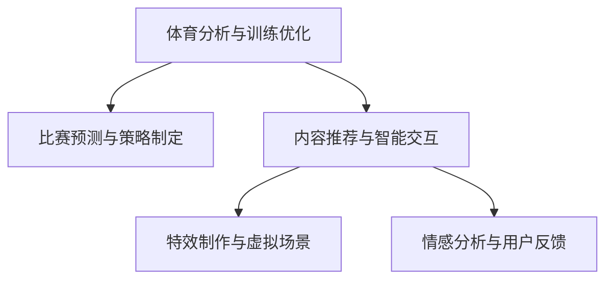

                 

# 人工智能在体育和娱乐中的应用

## 1. 背景介绍

随着科技的飞速发展，人工智能(AI)技术在体育和娱乐领域的应用越来越广泛，成为推动行业创新和发展的关键动力。AI在体育领域主要应用于运动表现分析、训练优化、比赛预测等方面，而在娱乐领域，则主要用于内容推荐、智能交互、特效制作等。本文将对人工智能在体育和娱乐中的应用进行全面介绍，涵盖其核心概念、原理及具体案例，并展望未来发展趋势。

## 2. 核心概念与联系

### 2.1 核心概念概述

为更好地理解人工智能在体育和娱乐中的应用，本节将介绍几个关键概念：

- **体育分析与训练优化**：利用AI对运动员的技术动作、生理状态、心理素质进行分析，指导训练计划，优化训练方法，提升运动员的综合实力。
- **比赛预测与策略制定**：通过机器学习模型对比赛数据进行深度挖掘，预测比赛结果，为教练和运动员制定策略提供数据支持。
- **内容推荐与智能交互**：根据用户的兴趣和行为数据，利用推荐系统算法为用户推荐个性化的体育和娱乐内容，提升用户体验。
- **特效制作与虚拟场景**：使用AI生成特效，如动作捕捉、虚拟教练、实时渲染等，丰富体育和娱乐的视觉体验。
- **情感分析与用户反馈**：通过自然语言处理技术分析用户评论、社交媒体反馈等数据，获取情感倾向，优化产品和服务。

这些核心概念之间的逻辑关系可以通过以下Mermaid流程图来展示：



这个流程图展示人工智能在体育和娱乐领域的应用：

1. 体育领域中，AI分析运动员表现，制定训练策略，预测比赛结果，为战术部署提供数据支持。
2. 娱乐领域中，AI推荐个性化内容，提升用户互动体验，生成特效，增强视觉冲击力，并分析用户反馈，优化产品。

## 3. 核心算法原理 & 具体操作步骤

### 3.1 算法原理概述

人工智能在体育和娱乐中的应用主要依赖于以下几个算法原理：

- **机器学习与深度学习**：通过对大量数据的学习，发现数据间的内在关系，进行预测和决策。
- **自然语言处理(NLP)**：理解和处理人类语言的能力，用于情感分析、用户反馈处理等。
- **计算机视觉(CV)**：识别和分析视觉数据的算法，用于运动捕捉、特效制作等。
- **强化学习**：通过试错过程不断优化决策策略，用于训练优化和策略制定。
- **推荐系统算法**：利用用户行为数据，推荐个性化内容，提升用户体验。

这些算法原理相互配合，共同构成了人工智能在体育和娱乐领域的应用框架。

### 3.2 算法步骤详解

以下将详细介绍人工智能在体育和娱乐中的核心算法步骤：

#### 3.2.1 体育分析与训练优化

**Step 1: 数据采集与预处理**
- 收集运动员的训练数据、比赛数据、生理数据等，并对数据进行清洗、标准化处理。

**Step 2: 特征提取**
- 使用机器学习算法从数据中提取运动员的技术特征、生理指标等。

**Step 3: 模型训练**
- 利用深度学习模型（如CNN、RNN、LSTM等）对提取的特征进行训练，得到运动员表现预测模型。

**Step 4: 训练优化**
- 根据预测结果和实际表现，调整训练计划和策略，优化训练方法。

**Step 5: 结果评估与迭代**
- 评估训练优化效果，根据评估结果不断迭代优化模型和训练计划。

#### 3.2.2 比赛预测与策略制定

**Step 1: 数据收集与清洗**
- 收集历史比赛数据、球队信息、球员数据等，并进行清洗和处理。

**Step 2: 特征工程**
- 选择和构造比赛预测的特征，如球队实力、历史交锋记录、球员状态等。

**Step 3: 模型训练**
- 使用机器学习或深度学习模型对特征进行训练，预测比赛结果。

**Step 4: 策略制定**
- 根据预测结果和实际情况，制定球队战术、球员使用策略等。

**Step 5: 结果评估与调整**
- 评估预测效果和策略执行结果，不断调整预测模型和策略。

#### 3.2.3 内容推荐与智能交互

**Step 1: 用户行为数据收集**
- 收集用户观看行为数据、互动数据等。

**Step 2: 用户画像构建**
- 利用机器学习算法构建用户画像，识别用户兴趣和偏好。

**Step 3: 推荐算法训练**
- 使用协同过滤、基于内容的推荐、深度学习推荐等算法训练推荐模型。

**Step 4: 推荐内容生成**
- 根据用户画像和推荐模型，生成个性化的体育和娱乐内容推荐。

**Step 5: 智能交互设计**
- 设计智能交互界面，提升用户体验。

#### 3.2.4 特效制作与虚拟场景

**Step 1: 数据采集与处理**
- 收集需要制作特效的场景数据，进行预处理。

**Step 2: 模型训练**
- 使用计算机视觉算法训练特效生成模型，如动作捕捉、实时渲染等。

**Step 3: 特效制作与渲染**
- 利用训练好的模型生成特效，并进行实时渲染。

**Step 4: 虚拟场景构建**
- 将特效与虚拟场景结合，构建沉浸式体验。

**Step 5: 测试与优化**
- 测试特效和虚拟场景效果，根据反馈进行优化。

#### 3.2.5 情感分析与用户反馈

**Step 1: 数据收集与预处理**
- 收集用户评论、社交媒体数据等，并进行清洗和处理。

**Step 2: 特征提取**
- 使用NLP技术从文本数据中提取情感特征。

**Step 3: 情感分析**
- 利用情感分析模型对提取的特征进行分析，得到情感倾向。

**Step 4: 用户反馈处理**
- 根据情感分析结果，调整产品和服务，优化用户体验。

### 3.3 算法优缺点

人工智能在体育和娱乐中的应用，具有以下优点：

1. **效率提升**：利用AI自动化处理大量数据，优化训练和策略制定，提高效率。
2. **精准预测**：通过数据驱动的模型，实现比赛的精准预测，辅助决策。
3. **个性化服务**：利用推荐系统提供个性化内容，提升用户体验。
4. **视觉体验丰富**：使用AI生成特效和虚拟场景，增强视觉冲击力。
5. **数据驱动**：通过数据分析优化训练和策略，科学决策。

同时，这些应用也存在一些缺点：

1. **数据依赖性高**：需要大量高质量的数据支持，数据采集和清洗工作量大。
2. **模型复杂度高**：需要复杂模型和算法，对计算资源要求高。
3. **解释性不足**：AI模型的决策过程复杂，缺乏可解释性。
4. **安全风险**：涉及用户隐私和数据安全问题，需要严格的数据保护措施。
5. **技术门槛高**：需要专业的AI技术人才，对开发和应用门槛高。

### 3.4 算法应用领域

人工智能在体育和娱乐中的应用领域广泛，具体如下：

1. **体育分析与训练优化**：适用于足球、篮球、羽毛球等体育项目，涵盖技术动作分析、体能训练、伤病预防等方面。
2. **比赛预测与策略制定**：适用于NBA、欧洲足球联赛等职业体育赛事，提供预测分析和战术指导。
3. **内容推荐与智能交互**：适用于视频平台、在线游戏、社交媒体等平台，提供个性化内容推荐和智能交互体验。
4. **特效制作与虚拟场景**：适用于电影、游戏、虚拟现实等应用，增强视觉和互动效果。
5. **情感分析与用户反馈**：适用于社交媒体、用户评论等场景，提升产品和服务质量。

## 4. 数学模型和公式 & 详细讲解 & 举例说明

### 4.1 数学模型构建

本节将使用数学语言对人工智能在体育和娱乐中的应用进行更严格的刻画。

**4.1.1 体育分析与训练优化**
假设收集到的运动员数据为 $X$，特征工程后得到的特征向量为 $X'$，训练得到的模型为 $f$，训练优化过程可表示为：
$$
\theta = \mathop{\arg\min}_{\theta} \mathcal{L}(f(X'), Y)
$$
其中 $\mathcal{L}$ 为损失函数，$Y$ 为实际表现。

**4.1.2 比赛预测与策略制定**
假设收集到的比赛数据为 $D$，模型训练得到的特征为 $X_D$，比赛预测模型为 $f$，策略制定过程可表示为：
$$
\hat{y} = f(X_D)
$$
其中 $\hat{y}$ 为预测结果，$X_D$ 为比赛数据特征。

**4.1.3 内容推荐与智能交互**
假设用户行为数据为 $U$，用户画像为 $P$，推荐模型为 $f$，推荐内容为 $C$，智能交互界面设计为 $I$，推荐过程可表示为：
$$
C = f(P, U)
$$
其中 $C$ 为推荐内容，$U$ 为用户行为数据，$P$ 为用户画像。

**4.1.4 特效制作与虚拟场景**
假设特效数据为 $E$，特效模型为 $f$，虚拟场景数据为 $S$，特效生成过程可表示为：
$$
E' = f(E)
$$
其中 $E'$ 为生成特效，$E$ 为特效数据。

**4.1.5 情感分析与用户反馈**
假设用户评论数据为 $C$，情感分析模型为 $f$，情感倾向为 $E$，情感分析过程可表示为：
$$
E = f(C)
$$
其中 $E$ 为情感倾向，$C$ 为用户评论数据。

### 4.2 公式推导过程

以体育分析与训练优化为例，详细推导其数学模型：

**Step 1: 数据采集与预处理**
假设采集到的运动员数据为 $X = (x_1, x_2, ..., x_n)$，预处理后得到的特征向量为 $X' = (x_1', x_2', ..., x_n')$。

**Step 2: 特征提取**
假设通过特征提取算法得到的特征向量为 $X' = (x_1', x_2', ..., x_n')$，其中 $x_i' = g(x_i)$，$g$ 为特征提取函数。

**Step 3: 模型训练**
假设模型训练得到的参数为 $\theta$，训练过程可表示为：
$$
\theta = \mathop{\arg\min}_{\theta} \mathcal{L}(f(X'), Y)
$$
其中 $\mathcal{L}$ 为损失函数，$Y = (y_1, y_2, ..., y_n)$ 为实际表现。

**Step 4: 训练优化**
假设训练优化过程中，每次迭代更新参数为 $\Delta \theta$，更新过程可表示为：
$$
\theta = \theta - \eta \nabla_{\theta} \mathcal{L}(f(X'), Y)
$$
其中 $\eta$ 为学习率，$\nabla_{\theta} \mathcal{L}$ 为损失函数对模型参数的梯度。

### 4.3 案例分析与讲解

以体育分析与训练优化为例，详细讲解其应用案例：

假设某篮球队希望通过AI技术优化其训练计划。首先，从比赛视频和训练数据中收集运动员的技术动作、身体指标等数据，构建数据集 $X$。然后，使用特征提取算法 $g$ 对数据进行预处理，得到特征向量 $X'$。接着，训练深度学习模型 $f$，如卷积神经网络(CNN)，得到模型参数 $\theta$。最后，根据模型预测结果与实际表现的差异，调整训练计划和策略，优化训练方法。

## 5. 项目实践：代码实例和详细解释说明

### 5.1 开发环境搭建

在进行AI在体育和娱乐中的应用实践前，我们需要准备好开发环境。以下是使用Python进行TensorFlow开发的环境配置流程：

1. 安装Anaconda：从官网下载并安装Anaconda，用于创建独立的Python环境。

2. 创建并激活虚拟环境：
```bash
conda create -n ai-env python=3.8 
conda activate ai-env
```

3. 安装TensorFlow：根据CUDA版本，从官网获取对应的安装命令。例如：
```bash
conda install tensorflow -c tf
```

4. 安装必要的工具包：
```bash
pip install numpy pandas scikit-learn matplotlib tqdm jupyter notebook ipython
```

完成上述步骤后，即可在`ai-env`环境中开始项目实践。

### 5.2 源代码详细实现

这里以篮球比赛预测为例，给出使用TensorFlow进行AI比赛预测的Python代码实现。

首先，定义比赛预测数据处理函数：

```python
import tensorflow as tf
import numpy as np

def process_data(file_path):
    with open(file_path, 'r') as f:
        lines = f.readlines()
        headers = lines[0].strip().split(',')
        features = [line.strip().split(',') for line in lines[1:]]
        features = np.array(features, dtype=np.float32)
    return headers, features
```

然后，定义比赛预测模型：

```python
def build_model(input_shape):
    model = tf.keras.Sequential([
        tf.keras.layers.Dense(256, activation='relu', input_shape=input_shape),
        tf.keras.layers.Dense(128, activation='relu'),
        tf.keras.layers.Dense(1, activation='sigmoid')
    ])
    model.compile(optimizer=tf.keras.optimizers.Adam(0.001),
                  loss='binary_crossentropy',
                  metrics=['accuracy'])
    return model
```

接着，定义训练和评估函数：

```python
def train_model(model, train_data, validation_data, epochs=10):
    model.fit(train_data[0], train_data[1], epochs=epochs, batch_size=32, validation_data=validation_data, verbose=1)

def evaluate_model(model, test_data):
    loss, accuracy = model.evaluate(test_data[0], test_data[1], verbose=1)
    print(f'Test loss: {loss:.4f}')
    print(f'Test accuracy: {accuracy:.4f}')
```

最后，启动训练流程并在测试集上评估：

```python
data_path = 'basketball_data.csv'
train_data, test_data = process_data(data_path)

headers = train_data[0]
input_shape = train_data[1].shape[1]
model = build_model(input_shape)

print(f'Building model with {input_shape} inputs...')

train_model(model, train_data, validation_data=test_data, epochs=10)

print(f'Evaluating model on test data...')
evaluate_model(model, test_data)
```

以上就是使用TensorFlow对篮球比赛进行预测的完整代码实现。可以看到，TensorFlow提供了丰富的API，可以方便地构建、训练和评估模型。

### 5.3 代码解读与分析

让我们再详细解读一下关键代码的实现细节：

**process_data函数**：
- 定义了一个读取CSV文件并处理数据的函数，从文件中读取比赛数据，并将其转换为NumPy数组。

**build_model函数**：
- 定义了一个使用Keras构建的线性回归模型，包括三个全连接层。

**train_model函数**：
- 使用模型的fit方法进行模型训练，指定训练数据、验证数据、学习率、损失函数、优化器等参数。

**evaluate_model函数**：
- 使用模型的evaluate方法评估模型在测试集上的性能，输出损失和准确率。

**训练流程**：
- 首先，定义数据路径，从CSV文件中读取训练数据和测试数据。
- 然后，构建模型，输出模型输入维度。
- 接着，使用train_model函数进行模型训练，指定训练数据、验证数据和训练轮数。
- 最后，使用evaluate_model函数在测试集上评估模型性能。

可以看到，TensorFlow的强大封装使得模型构建、训练和评估过程变得简洁高效。开发者可以将更多精力放在数据处理、模型改进等高层逻辑上，而不必过多关注底层的实现细节。

当然，工业级的系统实现还需考虑更多因素，如模型的保存和部署、超参数的自动搜索、更灵活的任务适配层等。但核心的AI应用逻辑基本与此类似。

## 6. 实际应用场景

### 6.1 智能视频分析

智能视频分析是指通过AI技术对体育比赛视频进行实时分析，自动识别运动员的表现、动作等，为教练和观众提供即时反馈。具体而言，可以使用计算机视觉技术进行动作捕捉、姿势分析、表情识别等，实时生成数据可视化报告。

在足球比赛分析中，可以通过视频分析技术识别球员的跑位、传球、射门等动作，计算其表现评分，帮助教练制定训练计划和比赛策略。例如，可以使用YOLO目标检测模型识别球员位置和动作，再通过姿态估计算法计算跑位距离和速度，从而评估球员的表现。

### 6.2 虚拟教练

虚拟教练是指利用AI技术构建的教练机器人，能够通过自然语言理解和交互，提供个性化的训练指导和建议。虚拟教练可以实时分析运动员的训练数据，提出针对性的训练计划和建议。

例如，某运动员在进行力量训练时，可以与虚拟教练进行互动，描述自己的感受和需求，虚拟教练将根据其表现和需求，推荐相应的训练动作和强度，并给出实时反馈和调整建议。虚拟教练还可以根据运动员的训练效果，动态调整训练计划，提供更为个性化的指导。

### 6.3 智能推荐系统

智能推荐系统利用AI技术为用户推荐个性化的体育和娱乐内容，提升用户体验。推荐系统可以基于用户的兴趣和行为数据，结合体育赛事、电影、音乐等多元化内容，提供精准的推荐。

例如，某视频平台可以根据用户观看的视频类型、互动行为等数据，构建用户画像，使用协同过滤或深度学习推荐算法，为用户推荐可能感兴趣的体育赛事、电影、音乐等。同时，还可以根据用户的反馈数据，不断优化推荐算法，提升推荐效果。

### 6.4 未来应用展望

随着AI技术的不断进步，未来体育和娱乐领域的应用将更加广泛和深入。以下是几个未来的应用趋势：

1. **实时数据处理**：AI技术将实现对实时数据的快速处理和分析，如实况转播、赛事直播等。
2. **个性化体验**：通过AI技术，提供更为个性化的体育和娱乐体验，如虚拟教练、智能推荐等。
3. **自动化内容制作**：利用AI技术自动生成体育和娱乐内容，如比赛解说、虚拟场景等。
4. **增强现实(AR)和虚拟现实(VR)**：结合AI和AR/VR技术，提供沉浸式体验，如虚拟观众席、交互式游戏等。
5. **智能化管理**：利用AI技术实现体育赛事和娱乐活动的智能化管理，如赛事调度、资源分配等。

## 7. 工具和资源推荐

### 7.1 学习资源推荐

为了帮助开发者系统掌握人工智能在体育和娱乐领域的应用，这里推荐一些优质的学习资源：

1. **《TensorFlow实战》系列书籍**：详细介绍了TensorFlow的使用方法和实战案例，涵盖体育和娱乐领域的应用。
2. **Coursera《机器学习》课程**：由斯坦福大学教授Andrew Ng主讲，涵盖机器学习、深度学习的基础知识和实践应用，适合入门学习。
3. **DeepLearning.ai《深度学习专项课程》**：由谷歌Brain团队和Andrew Ng合作，涵盖深度学习在图像、语音、自然语言处理等领域的实战应用。
4. **arXiv预印本网站**：最新的人工智能研究成果和论文，涵盖体育和娱乐领域的应用。
5. **Kaggle竞赛平台**：大量体育和娱乐领域的数据集和竞赛，提供实践机会。

通过对这些资源的学习实践，相信你一定能够快速掌握人工智能在体育和娱乐领域的应用精髓，并用于解决实际的业务问题。

### 7.2 开发工具推荐

高效的开发离不开优秀的工具支持。以下是几款用于人工智能在体育和娱乐领域开发的常用工具：

1. TensorFlow：由谷歌主导开发的开源深度学习框架，生产部署方便，适合大规模工程应用。
2. PyTorch：基于Python的开源深度学习框架，灵活动态的计算图，适合快速迭代研究。
3. Jupyter Notebook：交互式的Python开发环境，适合数据处理和模型训练。
4. Weights & Biases：模型训练的实验跟踪工具，可以记录和可视化模型训练过程中的各项指标，方便对比和调优。
5. Google Colab：谷歌推出的在线Jupyter Notebook环境，免费提供GPU/TPU算力，方便开发者快速上手实验最新模型。

合理利用这些工具，可以显著提升人工智能在体育和娱乐领域的应用开发效率，加快创新迭代的步伐。

### 7.3 相关论文推荐

人工智能在体育和娱乐领域的应用源于学界的持续研究。以下是几篇奠基性的相关论文，推荐阅读：

1. **《AI for Sports: Opportunities and Challenges》**：探讨AI在体育领域的应用，包括比赛预测、训练优化、伤病预防等。
2. **《AI for Entertainment: Applications in Media and Games》**：分析AI在娱乐领域的应用，涵盖推荐系统、智能交互、特效制作等。
3. **《Deep Learning for Sports Analytics》**：介绍使用深度学习技术进行体育数据分析和训练优化的方法。
4. **《AI in Virtual Reality for Sports and Entertainment》**：讨论AI在虚拟现实中的应用，如何提升体育和娱乐的沉浸式体验。
5. **《Sentiment Analysis for Sports and Entertainment》**：利用NLP技术进行情感分析，提升用户体验和产品服务质量。

这些论文代表了大语言模型微调技术的发展脉络。通过学习这些前沿成果，可以帮助研究者把握学科前进方向，激发更多的创新灵感。

## 8. 总结：未来发展趋势与挑战

### 8.1 研究成果总结

本文对人工智能在体育和娱乐中的应用进行了全面系统的介绍。首先阐述了AI技术在体育和娱乐领域的研究背景和意义，明确了AI在这些领域的独特价值。其次，从原理到实践，详细讲解了体育分析与训练优化、比赛预测与策略制定、内容推荐与智能交互、特效制作与虚拟场景、情感分析与用户反馈等核心算法的步骤和实现过程。最后，本文还探讨了AI在体育和娱乐领域的应用案例和未来发展趋势，提供了丰富的学习资源和开发工具推荐。

通过本文的系统梳理，可以看到，人工智能在体育和娱乐领域的应用正在成为这些行业创新和发展的关键动力，为体育和娱乐的智能化、个性化、沉浸式体验提供了新的技术路径。

### 8.2 未来发展趋势

展望未来，人工智能在体育和娱乐领域的应用将呈现以下几个发展趋势：

1. **智能化水平提升**：随着技术的不断进步，体育和娱乐领域的智能化水平将显著提升，如实时数据处理、个性化体验、自动化内容制作等。
2. **跨领域融合**：AI技术将与其他领域的技术进行深度融合，如体育与医疗、娱乐与教育等，提供更加全面、多元化的应用。
3. **数据驱动**：AI应用将更加依赖于数据的积累和分析，数据质量将成为决定AI应用效果的关键因素。
4. **人机协同**：AI与人类在体育和娱乐领域的协同工作将更加紧密，提升系统性能和用户体验。
5. **伦理和安全**：随着AI应用的普及，伦理和安全问题将逐渐凸显，如何在保障用户隐私和数据安全的前提下，提供可靠的应用，将是重要的研究方向。

### 8.3 面临的挑战

尽管AI在体育和娱乐领域的应用取得了显著成效，但在迈向更加智能化、普适化应用的过程中，它仍面临着诸多挑战：

1. **数据依赖性高**：需要大量高质量的数据支持，数据采集和清洗工作量大。
2. **模型复杂度高**：需要复杂模型和算法，对计算资源要求高。
3. **解释性不足**：AI模型的决策过程复杂，缺乏可解释性。
4. **安全风险**：涉及用户隐私和数据安全问题，需要严格的数据保护措施。
5. **技术门槛高**：需要专业的AI技术人才，对开发和应用门槛高。

### 8.4 研究展望

面对AI在体育和娱乐领域所面临的挑战，未来的研究需要在以下几个方面寻求新的突破：

1. **无监督学习和自适应学习**：探索不依赖标注数据的学习方法，提高模型的鲁棒性和泛化能力。
2. **跨领域知识融合**：将符号化的先验知识与神经网络模型进行融合，提升模型的决策能力和可解释性。
3. **实时数据处理和存储优化**：研究高效的数据处理和存储技术，提升系统的实时响应能力。
4. **用户隐私保护**：开发隐私保护技术，如差分隐私、联邦学习等，保障用户数据安全。
5. **模型可解释性和鲁棒性**：研究模型可解释性和鲁棒性的优化方法，提升模型的透明度和可信度。

这些研究方向将引领人工智能在体育和娱乐领域的应用进入新的阶段，为构建更加智能化、可靠、安全的体育和娱乐系统奠定基础。面向未来，人工智能技术需要在算法、数据、伦理等多方面进行协同创新，才能充分发挥其在体育和娱乐领域的潜力，推动行业向更高层次发展。

## 9. 附录：常见问题与解答

**Q1：人工智能在体育和娱乐中的应用是否存在偏见问题？**

A: 是的，人工智能在体育和娱乐领域的应用也存在偏见问题。例如，在比赛预测中，模型可能受到训练数据偏见的影响，对某些球队或运动员的预测结果有偏差。在内容推荐中，模型也可能偏向于推荐用户习惯性消费的内容，忽视其他优秀内容。因此，需要在算法设计和数据处理中引入公平性约束，消除偏见，提升AI应用的公正性。

**Q2：人工智能在体育和娱乐中的应用是否侵犯用户隐私？**

A: 人工智能在体育和娱乐领域的应用，如智能推荐、情感分析等，通常需要收集用户的隐私数据。如何保护用户隐私，是一个重要的问题。首先，需要明确数据的收集和使用目的，确保用户知情同意。其次，采用数据匿名化、差分隐私等技术，保护用户数据的安全性。最后，建立严格的数据访问控制机制，防止数据滥用。

**Q3：人工智能在体育和娱乐中的应用是否存在过拟合问题？**

A: 是的，人工智能在体育和娱乐领域的应用也存在过拟合问题。例如，在训练模型时，如果数据集过小或数据分布不均匀，模型可能会过拟合训练数据，导致在实际应用中表现不佳。因此，需要在模型训练和评估中引入正则化技术，如L2正则、Dropout等，避免过拟合。同时，还需要对模型进行交叉验证，确保其在不同数据集上的泛化性能。

**Q4：人工智能在体育和娱乐中的应用是否存在伦理道德问题？**

A: 是的，人工智能在体育和娱乐领域的应用，可能涉及到伦理道德问题。例如，在情感分析中，模型可能会误判用户情绪，导致负面影响。在虚拟教练中，模型可能提供不合适的建议，影响运动员的训练效果。因此，需要在算法设计和应用部署中引入伦理导向，确保AI应用的道德性和安全性。

通过这些问题的探讨，可以看出人工智能在体育和娱乐领域的应用需要在技术、伦理、安全等多方面进行全面考虑，才能充分发挥其在提升用户体验、优化业务流程等方面的潜力。

---

作者：禅与计算机程序设计艺术 / Zen and the Art of Computer Programming

