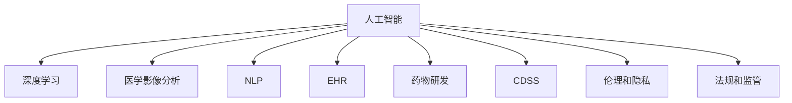

                 

# 人工智能在医疗保健中的应用

## 1. 背景介绍

### 1.1 问题由来
医疗保健是现代社会的重要领域，涵盖诊断、治疗、预防、管理等环节，直接关乎人民健康和社会福祉。传统医疗系统中，依赖人工进行数据处理、图像分析、病例诊断等工作，存在耗时长、错误率高、成本高等问题。近年来，随着人工智能技术的发展，人工智能(AI)开始广泛渗透到医疗保健的各个环节，显著提升了医疗服务的效率和质量，推动了医疗行业数字化转型的进程。

人工智能在医疗保健中的应用范围广泛，涉及医学影像分析、病理学诊断、电子病历管理、药物研发、临床决策支持等多个领域。通过深度学习、自然语言处理、计算机视觉等前沿技术，AI正在逐步改变医疗行业的传统模式，带来革命性的创新。

### 1.2 问题核心关键点
人工智能在医疗保健中的应用，关键在于如何有效地将AI技术融入实际医疗场景，并产生实际的诊疗效果。具体而言，需要关注以下几个核心点：

- **数据质量**：医疗数据具有多样性、复杂性和敏感性，如何获取高质量、标注完整的医疗数据，是AI医疗应用的前提。
- **算法模型**：如何选择适合的AI算法模型，以适应医疗数据的特性，并实现精准的疾病预测、诊断和治疗建议。
- **临床验证**：AI模型在实际临床环境中的效果如何，需要通过大样本数据的验证和对比研究，才能确定其可靠性。
- **伦理和隐私**：AI在医疗应用中，涉及患者的隐私和伦理问题，如何保障数据安全和使用透明性，是必须认真对待的问题。
- **监管和法规**：AI在医疗中的应用受到严格监管和法规约束，如何合规应用AI技术，避免法律风险，是医疗机构和研究者需考虑的重要课题。

## 2. 核心概念与联系

### 2.1 核心概念概述

为了更好地理解人工智能在医疗保健中的应用，本节将介绍几个关键概念及其联系：

- **人工智能(AI)**：通过计算机模拟人类智能，包括学习、推理、自我修正等功能，旨在完成复杂任务。
- **深度学习(Deep Learning)**：一种基于神经网络的机器学习技术，通过多层次的特征提取和映射，解决非线性、高维度数据问题。
- **医学影像分析(Medical Imaging Analysis)**：利用AI技术对医学影像进行自动识别、分类、分割和分析，辅助诊断和治疗。
- **自然语言处理(Natural Language Processing, NLP)**：处理和分析人类语言，实现文本的自动理解和生成，支持电子病历管理、问答系统等。
- **电子病历系统(Electronic Health Record, EHR)**：数字化存储和管理患者的医疗信息，便于信息共享和分析。
- **药物研发(Pharmaceutical Drug Development)**：利用AI技术加速药物发现、设计和优化，提升新药研发效率。
- **临床决策支持系统(Clinical Decision Support System, CDSS)**：通过数据分析和智能推荐，辅助医生进行临床决策，减少误诊和漏诊。
- **伦理和隐私**：确保AI在医疗应用中的数据使用透明，遵循伦理原则，保护患者隐私。
- **法规和监管**：遵循相关法律和行业标准，确保AI应用合规，避免法律风险。

这些核心概念之间的逻辑关系可以通过以下Mermaid流程图来展示：



这个流程图展示了大语言模型的核心概念及其之间的关系：

1. 人工智能作为AI医疗应用的基石，涵盖了深度学习、医学影像分析、自然语言处理等多个子领域。
2. 深度学习是AI中的核心技术，主要用于医学影像分析、药物研发等领域。
3. 医学影像分析利用深度学习进行图像识别和分析，辅助诊断和治疗。
4. 自然语言处理技术支持电子病历管理、问答系统等。
5. 电子病历系统是数据管理和存储的基础，支持数据共享和分析。
6. 药物研发通过AI技术加速药物发现和设计，提升研发效率。
7. 临床决策支持系统利用AI辅助医生决策，提高诊疗准确性。
8. 伦理和隐私是AI在医疗应用中必须遵守的原则，确保数据使用透明和保护患者隐私。
9. 法规和监管确保AI应用的合法性和合规性。

这些概念共同构成了AI在医疗保健中的应用框架，为其在实际场景中的应用提供了理论基础。

## 3. 核心算法原理 & 具体操作步骤
### 3.1 算法原理概述

人工智能在医疗保健中的应用，本质上是通过AI算法模型对医疗数据进行分析和处理，辅助医生进行诊断和治疗决策。其核心原理可以概括为以下几个方面：

- **数据准备**：收集和处理医疗数据，确保数据的完整性和准确性。
- **模型训练**：选择合适的AI模型，利用医疗数据进行训练，优化模型参数。
- **模型验证**：在验证数据集上评估模型性能，确保模型泛化能力。
- **临床应用**：将训练好的模型应用于实际临床场景，辅助医生进行诊断和治疗。

具体而言，常见的AI算法模型包括：

1. **卷积神经网络(Convolutional Neural Networks, CNN)**：用于医学影像分析，提取图像特征，进行分类和分割。
2. **循环神经网络(Recurrent Neural Networks, RNN)**：用于自然语言处理，处理序列数据，进行文本分类、情感分析等。
3. **长短期记忆网络(Long Short-Term Memory, LSTM)**：用于处理时间序列数据，如电子病历数据，进行预测和分析。
4. **生成对抗网络(Generative Adversarial Networks, GAN)**：用于图像生成和增强，如医学图像的增强和重建。

### 3.2 算法步骤详解

基于人工智能在医疗保健中的应用，以下是具体的算法步骤：

**Step 1: 数据收集和预处理**
- 收集医疗数据，包括电子病历、医学影像、实验室数据等。
- 对数据进行清洗和标注，确保数据的质量和一致性。
- 将数据划分为训练集、验证集和测试集，用于模型训练和评估。

**Step 2: 模型选择和设计**
- 根据具体任务选择合适的AI算法模型，如CNN、RNN、LSTM等。
- 设计模型架构，包括输入、隐藏层、输出层等。
- 确定超参数，如学习率、批量大小、迭代次数等。

**Step 3: 模型训练**
- 将训练数据输入模型，前向传播计算损失函数。
- 反向传播计算参数梯度，根据设定的优化算法更新模型参数。
- 在验证集上评估模型性能，根据评估结果调整模型参数。
- 重复上述过程直至模型收敛。

**Step 4: 模型验证和优化**
- 在测试集上评估模型性能，对比微调前后的效果。
- 对模型进行调优，如增加正则化、调整超参数等，提升模型性能。
- 对模型进行临床验证，确保其可靠性。

**Step 5: 模型部署和应用**
- 将训练好的模型部署到实际医疗系统中，如电子病历系统、影像诊断系统等。
- 对医生进行培训，使其掌握模型使用方法。
- 收集新数据，定期重新训练和微调模型，保证模型性能。

### 3.3 算法优缺点

人工智能在医疗保健中的应用，具有以下优点：
1. **提升诊疗效率**：通过自动化的数据分析和处理，显著缩短诊疗时间，提高诊疗效率。
2. **减少误诊和漏诊**：利用AI技术进行疾病预测和诊断，提高诊断的准确性，减少误诊和漏诊率。
3. **辅助决策支持**：提供辅助诊断和治疗建议，帮助医生进行更科学、合理的临床决策。
4. **个性化医疗**：通过分析患者数据，实现个性化诊疗方案，提升患者治疗效果。
5. **数据驱动的优化**：利用AI技术优化医疗流程，减少资源浪费，提高医疗资源利用率。

同时，这些应用也存在一定的局限性：
1. **数据依赖性强**：AI模型的效果依赖于数据的质量和数量，数据获取和标注成本较高。
2. **模型复杂度高**：大模型需要大量的计算资源和时间，训练和推理成本较高。
3. **算法透明性不足**：AI模型通常是"黑盒"系统，难以解释其决策逻辑，影响医生对结果的信任。
4. **伦理和隐私问题**：AI在医疗应用中涉及患者隐私和伦理问题，数据使用和保护需严格监管。
5. **法规和监管约束**：AI在医疗中的应用受到严格法规约束，需遵循相关法律和行业标准。

尽管存在这些局限性，但人工智能在医疗保健中的应用前景广阔，未来还需进一步突破技术瓶颈，提升算法透明性和数据治理水平。

### 3.4 算法应用领域

人工智能在医疗保健中的应用，覆盖了多个领域，具体包括：

- **医学影像分析**：利用AI技术进行医学影像的自动识别、分类和分割，辅助放射科医生进行诊断和治疗。
- **自然语言处理**：通过NLP技术处理和分析医疗文本数据，如电子病历、病历记录等，辅助病历管理和疾病诊断。
- **电子病历系统**：利用AI技术优化电子病历数据的存储和管理，支持数据共享和分析，提高医疗信息利用率。
- **药物研发**：利用AI技术加速药物发现、设计和优化，提升新药研发效率，减少研发成本。
- **临床决策支持系统**：通过AI技术辅助医生进行临床决策，提供诊断和治疗建议，提高诊疗准确性。
- **基因组学**：利用AI技术分析基因组数据，进行疾病风险预测和个性化治疗方案设计。
- **智能穿戴设备**：通过智能穿戴设备收集患者健康数据，利用AI技术进行健康监测和疾病预测。
- **远程医疗**：利用AI技术进行远程诊断和治疗，提升医疗服务的可及性和覆盖面。

## 4. 数学模型和公式 & 详细讲解  
### 4.1 数学模型构建

基于人工智能在医疗保健中的应用，本节将使用数学语言对模型构建和训练过程进行更加严格的刻画。

设医疗数据集为 $D=\{(x_i,y_i)\}_{i=1}^N, x_i \in \mathcal{X}, y_i \in \mathcal{Y}$，其中 $\mathcal{X}$ 为输入空间，$\mathcal{Y}$ 为输出空间。定义模型 $M_{\theta}$ 在输入 $x$ 上的预测结果为 $\hat{y}=M_{\theta}(x)$，其中 $\theta$ 为模型参数。

在医学影像分析中，模型 $M_{\theta}$ 通常是一个卷积神经网络(CNN)，其结构为：
$$
M_{\theta} = \text{Conv}_1 \rightarrow \text{Pool}_1 \rightarrow \text{Conv}_2 \rightarrow \text{Pool}_2 \rightarrow \cdots \rightarrow \text{Conv}_n \rightarrow \text{Softmax}
$$

其中 $\text{Conv}_i$ 为卷积层，$\text{Pool}_i$ 为池化层，$\text{Softmax}$ 为输出层。模型的损失函数通常为交叉熵损失：
$$
\ell(M_{\theta}(x),y) = -\log\sum_j p_{ij} = -y_i\log p_{i1} - (1-y_i)\log p_{i2}
$$

其中 $p_{ij}$ 为模型在输入 $x_i$ 下对输出 $y_i$ 的概率预测。在训练过程中，模型的目标是最小化经验风险：
$$
\mathcal{L}(\theta) = \frac{1}{N}\sum_{i=1}^N \ell(M_{\theta}(x_i),y_i)
$$

通过梯度下降等优化算法，不断更新模型参数 $\theta$，最小化损失函数 $\mathcal{L}$，使得模型输出逼近真实标签。

### 4.2 公式推导过程

在医学影像分析中，我们以卷积神经网络为例，推导损失函数和梯度更新的计算公式。

设输入图像 $x \in \mathbb{R}^d$，输出类别 $y \in \{1,2,\cdots,K\}$。定义模型 $M_{\theta}$ 在输入 $x$ 上的输出为 $\hat{y}=M_{\theta}(x) \in \mathbb{R}^K$。模型的损失函数为交叉熵损失：
$$
\ell(M_{\theta}(x),y) = -\log p_{i1} - y_i\log p_{i2}
$$

其中 $p_{i1}$ 和 $p_{i2}$ 分别为模型在输入 $x$ 下对输出 $y=1$ 和 $y=0$ 的概率预测。

在训练过程中，模型的目标是最小化经验风险：
$$
\mathcal{L}(\theta) = \frac{1}{N}\sum_{i=1}^N \ell(M_{\theta}(x_i),y_i)
$$

利用梯度下降等优化算法，不断更新模型参数 $\theta$，最小化损失函数 $\mathcal{L}$，使得模型输出逼近真实标签。

### 4.3 案例分析与讲解

以下以医学影像分析为例，分析模型的训练和评估过程。

**Step 1: 数据准备**
- 收集医学影像数据集，包括标注的病灶图像和健康图像。
- 将图像数据转换为张量形式，并进行标准化处理。
- 将数据划分为训练集、验证集和测试集。

**Step 2: 模型构建**
- 定义CNN模型的架构，包括卷积层、池化层、全连接层等。
- 定义损失函数为交叉熵损失，使用Adam优化器进行训练。
- 设置超参数，如学习率、批量大小、迭代次数等。

**Step 3: 模型训练**
- 将训练集输入模型，前向传播计算损失函数。
- 反向传播计算参数梯度，根据Adam优化器更新模型参数。
- 在验证集上评估模型性能，根据评估结果调整模型参数。
- 重复上述过程直至模型收敛。

**Step 4: 模型验证和优化**
- 在测试集上评估模型性能，对比微调前后的效果。
- 对模型进行调优，如增加正则化、调整超参数等，提升模型性能。
- 对模型进行临床验证，确保其可靠性。

## 5. 项目实践：代码实例和详细解释说明
### 5.1 开发环境搭建

在进行人工智能在医疗保健中的应用实践前，我们需要准备好开发环境。以下是使用Python进行TensorFlow和Keras开发的环境配置流程：

1. 安装Anaconda：从官网下载并安装Anaconda，用于创建独立的Python环境。

2. 创建并激活虚拟环境：
```bash
conda create -n pytorch-env python=3.8 
conda activate pytorch-env
```

3. 安装TensorFlow：根据CUDA版本，从官网获取对应的安装命令。例如：
```bash
conda install tensorflow -c tf-nightly -c conda-forge
```

4. 安装Keras：
```bash
pip install keras
```

5. 安装各类工具包：
```bash
pip install numpy pandas scikit-learn matplotlib tqdm jupyter notebook ipython
```

完成上述步骤后，即可在`pytorch-env`环境中开始项目实践。

### 5.2 源代码详细实现

下面我们以医学影像分析为例，给出使用TensorFlow和Keras对CNN模型进行训练的PyTorch代码实现。

首先，定义数据处理函数：

```python
import tensorflow as tf
from tensorflow.keras.preprocessing.image import ImageDataGenerator

# 定义数据生成器
train_datagen = ImageDataGenerator(rescale=1./255, shear_range=0.2, zoom_range=0.2, horizontal_flip=True)
test_datagen = ImageDataGenerator(rescale=1./255)

# 加载数据集
train_dataset = train_datagen.flow_from_directory('train', target_size=(256, 256), batch_size=32, class_mode='binary')
test_dataset = test_datagen.flow_from_directory('test', target_size=(256, 256), batch_size=32, class_mode='binary')
```

然后，定义模型和损失函数：

```python
from tensorflow.keras.models import Sequential
from tensorflow.keras.layers import Conv2D, MaxPooling2D, Flatten, Dense

# 定义模型
model = Sequential([
    Conv2D(32, (3,3), activation='relu', input_shape=(256, 256, 3)),
    MaxPooling2D((2,2)),
    Conv2D(64, (3,3), activation='relu'),
    MaxPooling2D((2,2)),
    Flatten(),
    Dense(128, activation='relu'),
    Dense(1, activation='sigmoid')
])

# 定义损失函数和优化器
loss_fn = tf.keras.losses.BinaryCrossentropy()
optimizer = tf.keras.optimizers.Adam(learning_rate=0.001)

# 编译模型
model.compile(optimizer=optimizer, loss=loss_fn, metrics=['accuracy'])
```

接着，定义训练和评估函数：

```python
import numpy as np

# 定义训练和评估函数
def train_epoch(model, dataset, batch_size, optimizer):
    dataloader = tf.data.Dataset.from_generator(dataset, (np.ndarray, np.ndarray))
    model.fit(dataloader, epochs=1, steps_per_epoch=10, validation_data=None, callbacks=None)

def evaluate(model, dataset, batch_size):
    dataloader = tf.data.Dataset.from_generator(dataset, (np.ndarray, np.ndarray))
    model.evaluate(dataloader, batch_size=batch_size)
```

最后，启动训练流程并在测试集上评估：

```python
epochs = 10
batch_size = 32

for epoch in range(epochs):
    train_epoch(model, train_dataset, batch_size, optimizer)
    
    print(f"Epoch {epoch+1}, train loss: {loss_fn(model.predict(train_dataset)):.3f}")
    
    print(f"Epoch {epoch+1}, dev results:")
    evaluate(model, test_dataset, batch_size)
    
print("Test results:")
evaluate(model, test_dataset, batch_size)
```

以上就是使用TensorFlow和Keras对CNN模型进行医学影像分析任务训练的完整代码实现。可以看到，得益于TensorFlow的强大封装，我们可以用相对简洁的代码完成CNN模型的加载和训练。

### 5.3 代码解读与分析

让我们再详细解读一下关键代码的实现细节：

**数据处理函数**：
- `ImageDataGenerator`类：用于生成图像数据，支持数据增强和归一化处理。
- `flow_from_directory`方法：从文件夹中自动加载图像数据，并进行标注处理。

**模型定义**：
- `Sequential`类：定义序列模型，逐层添加卷积层、池化层、全连接层等。
- `Conv2D`层：定义卷积层，进行特征提取。
- `MaxPooling2D`层：定义池化层，进行特征降维。
- `Flatten`层：将特征图展平，输入全连接层。
- `Dense`层：定义全连接层，进行分类。

**损失函数和优化器**：
- `BinaryCrossentropy`类：定义二分类交叉熵损失函数。
- `Adam`优化器：使用Adam优化算法，更新模型参数。

**训练和评估函数**：
- `train_epoch`函数：定义训练函数，进行前向传播、反向传播和参数更新。
- `evaluate`函数：定义评估函数，进行模型性能的计算和输出。

**训练流程**：
- 定义总的epoch数和batch size，开始循环迭代。
- 每个epoch内，先在训练集上训练，输出loss。
- 在验证集上评估，输出分类指标。
- 所有epoch结束后，在测试集上评估，给出最终测试结果。

可以看到，TensorFlow和Keras使得CNN模型的训练和评估过程变得简洁高效。开发者可以将更多精力放在数据处理、模型改进等高层逻辑上，而不必过多关注底层的实现细节。

当然，工业级的系统实现还需考虑更多因素，如模型的保存和部署、超参数的自动搜索、更灵活的任务适配层等。但核心的微调范式基本与此类似。

## 6. 实际应用场景
### 6.1 智能诊断系统

智能诊断系统是人工智能在医疗保健中的重要应用之一，能够辅助医生进行疾病诊断和预测。基于深度学习的智能诊断系统，通过分析患者症状、体征、实验室数据等，提供初步诊断和治疗建议，提高诊疗效率和准确性。

在技术实现上，可以收集大量历史病历数据，标注疾病的类型和严重程度。在此基础上对预训练模型进行微调，使其能够从患者的症状和体征中，识别出潜在的疾病，并给出相应的诊断建议。智能诊断系统可以部署在医院、诊所、家庭等多种场景中，为患者提供便捷、高效的诊断服务。

### 6.2 电子病历系统

电子病历系统是医疗信息管理的核心，通过数字化存储和处理患者健康数据，支持医生进行病历记录、查询和分析。基于深度学习的电子病历系统，可以自动识别和抽取患者信息，生成电子病历，减少医生手工录入的时间和工作量。

在技术实现上，可以利用自然语言处理技术对电子病历进行文本分析和处理，如自动病历摘要、疾病分类、药物剂量等。通过微调模型，提高电子病历系统的智能化水平，使其能够更好地辅助医生进行诊疗。

### 6.3 个性化治疗方案

基于深度学习的个性化治疗方案，通过分析患者的基因组数据、病历记录、生活习惯等，制定个性化的治疗方案，提高治疗效果。通过微调模型，提高对患者数据的理解和分析能力，实现精准的医疗干预。

在技术实现上，可以利用基因组学数据、蛋白质组学数据等，对患者进行全面的基因分析。通过微调模型，提取和分析基因特征，预测疾病风险，设计个性化的治疗方案。个性化治疗方案可以显著提高患者的治疗效果和生活质量，减少医疗资源的浪费。

### 6.4 智能穿戴设备

智能穿戴设备通过实时监测患者的健康数据，如心率、血压、血糖等，利用深度学习技术进行健康分析和预警。基于深度学习的智能穿戴设备，可以自动分析健康数据，识别异常情况，提供及时的医疗建议。

在技术实现上，可以利用时间序列分析技术对健康数据进行建模，预测患者的健康状况。通过微调模型，提高健康数据的分析和处理能力，实现精准的健康管理和预警。智能穿戴设备可以广泛应用于家庭、社区、医院等多种场景中，为患者提供便捷、个性化的健康服务。

### 6.5 远程医疗

远程医疗利用深度学习技术，通过图像识别、语音识别等技术，进行远程诊断和治疗。基于深度学习的远程医疗系统，可以通过视频、语音等渠道，提供实时的诊断和治疗服务。

在技术实现上，可以利用深度学习技术进行图像和语音分析，如医学影像分析、语音识别等。通过微调模型，提高远程医疗系统的智能化水平，实现高质量的远程诊断和治疗。远程医疗可以解决偏远地区医疗资源不足的问题，为患者提供便捷、高效的医疗服务。

## 7. 工具和资源推荐
### 7.1 学习资源推荐

为了帮助开发者系统掌握人工智能在医疗保健中的应用理论基础和实践技巧，这里推荐一些优质的学习资源：

1. 《Deep Learning for Healthcare》书籍：全面介绍深度学习在医疗保健中的应用，涵盖医学影像分析、电子病历管理、个性化治疗等多个方面。

2. 《Clinical Decision Support Systems: The Art of Medical Expert Systems》书籍：介绍临床决策支持系统的原理和应用，支持医生的临床决策。

3. 《AI for Healthcare》课程：斯坦福大学开设的AI课程，涵盖医疗图像分析、医疗问答系统、健康数据分析等多个主题。

4. 《NLP for Healthcare》课程：斯坦福大学开设的NLP课程，涵盖医疗文本分析、病历记录管理、情感分析等多个主题。

5. 《Towards a Science of Medicine》课程：Coursera上麻省理工学院的课程，涵盖医学知识、基因组学、个性化治疗等多个主题。

通过对这些资源的学习实践，相信你一定能够快速掌握人工智能在医疗保健中的应用精髓，并用于解决实际的医疗问题。
###  7.2 开发工具推荐

高效的开发离不开优秀的工具支持。以下是几款用于人工智能在医疗保健中的应用开发的常用工具：

1. TensorFlow：基于Python的开源深度学习框架，灵活动态的计算图，适合快速迭代研究。
2. Keras：高层API，简单易用，支持多种深度学习模型和优化算法。
3. PyTorch：基于Python的开源深度学习框架，灵活高效，适合动态计算图和模型研究。
4. Jupyter Notebook：交互式开发环境，支持代码和文档的混合编辑，适合研究和实验。
5. Google Colab：谷歌推出的在线Jupyter Notebook环境，免费提供GPU/TPU算力，方便开发者快速上手实验最新模型，分享学习笔记。

合理利用这些工具，可以显著提升人工智能在医疗保健中的应用开发的效率，加快创新迭代的步伐。

### 7.3 相关论文推荐

人工智能在医疗保健中的应用源于学界的持续研究。以下是几篇奠基性的相关论文，推荐阅读：

1. "Deep learning for chest x-ray classification"：提出深度卷积神经网络用于医学影像分类任务，提高了诊断准确率。
2. "AI in radiology: a review"：综述了AI在医学影像分析中的应用，包括卷积神经网络、循环神经网络等。
3. "Natural language processing in healthcare: applications and benefits of an advanced information system"：介绍NLP在医疗领域的应用，如电子病历管理、医疗问答系统等。
4. "Machine learning in precision medicine"：提出机器学习在个性化医疗中的应用，通过分析基因组数据、病历记录等，设计个性化的治疗方案。
5. "Artificial intelligence in healthcare: past, present, and future"：综述了AI在医疗领域的发展历程和未来趋势，涵盖多个应用领域。

这些论文代表了大语言模型在医疗保健中的应用的发展脉络。通过学习这些前沿成果，可以帮助研究者把握学科前进方向，激发更多的创新灵感。

## 8. 总结：未来发展趋势与挑战
### 8.1 总结

本文对人工智能在医疗保健中的应用进行了全面系统的介绍。首先阐述了人工智能在医疗保健中的应用背景和意义，明确了其在医学影像分析、电子病历管理、个性化治疗等多个领域的应用前景。其次，从原理到实践，详细讲解了深度学习模型的训练和优化过程，给出了完整的代码实例。同时，本文还广泛探讨了智能诊断系统、电子病历系统、个性化治疗方案等多个实际应用场景，展示了AI在医疗保健中的巨大潜力。此外，本文精选了AI在医疗保健中的应用的学习资源和开发工具，力求为读者提供全方位的技术指引。

通过本文的系统梳理，可以看到，人工智能在医疗保健中的应用前景广阔，正逐步改变传统医疗模式，提升诊疗效率和效果。未来，随着深度学习、自然语言处理等技术的发展，AI在医疗保健中的应用将更加深入和广泛，为患者带来更多便捷和高效的医疗服务。

### 8.2 未来发展趋势

展望未来，人工智能在医疗保健中的应用将呈现以下几个发展趋势：

1. **数据驱动的优化**：通过深度学习技术，不断优化医疗数据处理和分析，提高诊断和治疗的准确性。
2. **跨领域的应用**：AI技术将在更多领域得到应用，如医疗影像、电子病历、个性化治疗、健康管理等，提升医疗服务的全面性和个性化。
3. **模型的多样化**：基于不同任务的特性，开发更多多样化的AI模型，如深度卷积神经网络、递归神经网络、生成对抗网络等。
4. **系统的协同化**：AI技术将与其他技术协同工作，如自然语言处理、知识图谱、物联网等，构建更智能化的医疗系统。
5. **隐私和伦理的重视**：随着AI在医疗中的应用增加，数据隐私和伦理问题将受到更多重视，需制定严格的法规和标准。

以上趋势凸显了人工智能在医疗保健中的未来发展方向。这些方向的探索发展，必将进一步提升医疗服务的智能化水平，推动医疗行业数字化转型的进程。

### 8.3 面临的挑战

尽管人工智能在医疗保健中的应用前景广阔，但在迈向更加智能化、普适化应用的过程中，它仍面临诸多挑战：

1. **数据获取和标注**：高质量医疗数据的获取和标注成本较高，如何高效地获取和标注数据，是AI医疗应用的前提。
2. **模型复杂度**：大模型需要大量的计算资源和时间，训练和推理成本较高，需优化模型的计算效率。
3. **模型的透明性**：AI模型的决策过程通常是"黑盒"系统，难以解释其决策逻辑，影响医生对结果的信任。
4. **伦理和隐私**：AI在医疗应用中涉及患者隐私和伦理问题，数据使用和保护需严格监管。
5. **法规和监管**：AI在医疗中的应用受到严格法规约束，需遵循相关法律和行业标准，避免法律风险。

尽管存在这些挑战，但人工智能在医疗保健中的应用前景广阔，未来还需进一步突破技术瓶颈，提升算法透明性和数据治理水平。

### 8.4 研究展望

面对人工智能在医疗保健中面临的挑战，未来的研究需要在以下几个方面寻求新的突破：

1. **无监督和半监督学习**：摆脱对大规模标注数据的依赖，利用自监督学习、主动学习等无监督和半监督范式，最大限度利用非结构化数据。
2. **模型压缩和优化**：开发更加参数高效的模型，在固定大部分预训练参数的同时，只更新极少量的任务相关参数。同时优化模型的计算图，减少前向传播和反向传播的资源消耗。
3. **因果学习和对抗训练**：引入因果推断和对抗训练思想，增强模型的鲁棒性和泛化能力，提高诊断和治疗的准确性。
4. **伦理和隐私保护**：在AI模型中引入伦理导向的评估指标，过滤和惩罚有偏见、有害的输出倾向，保护患者隐私。
5. **法规和标准制定**：制定严格的数据隐私保护法规和标准，确保AI在医疗中的应用合规，避免法律风险。

这些研究方向的探索，必将引领人工智能在医疗保健中的应用走向更高的台阶，为构建安全、可靠、可解释、可控的智能医疗系统铺平道路。面向未来，人工智能在医疗保健中的应用还需与其他技术进行更深入的融合，如自然语言处理、知识图谱、物联网等，多路径协同发力，共同推动医疗行业的数字化转型。

## 9. 附录：常见问题与解答

**Q1：人工智能在医疗保健中的应用是否涉及患者隐私和伦理问题？**

A: 是的，人工智能在医疗保健中的应用涉及患者隐私和伦理问题。AI模型需要大量的医疗数据进行训练，这些数据往往包含患者的个人信息和病历记录，需要严格保护。同时，AI模型的决策过程通常是"黑盒"系统，难以解释其决策逻辑，可能会影响医生的信任。因此，在使用AI进行医疗应用时，需遵循严格的隐私保护和伦理原则，确保数据使用透明和保护患者隐私。

**Q2：如何保证人工智能在医疗应用中的可靠性？**

A: 人工智能在医疗应用中的可靠性需要通过大量的临床验证和对比研究来确定。需要收集大样本数据，对AI模型进行测试和评估，确保其泛化能力和鲁棒性。同时，需引入多领域专家进行评审，确保模型的决策符合医学常识和伦理标准。

**Q3：人工智能在医疗应用中面临的主要技术挑战是什么？**

A: 人工智能在医疗应用中面临的主要技术挑战包括：

1. 数据获取和标注：高质量医疗数据的获取和标注成本较高，需采用自动化标注、主动学习等方法，提高标注效率。
2. 模型复杂度：大模型需要大量的计算资源和时间，需优化模型的计算效率，如模型压缩、参数共享等。
3. 模型的透明性：AI模型的决策过程通常是"黑盒"系统，难以解释其决策逻辑，需引入可解释性技术，如 causal reasoning、对抗训练等。
4. 伦理和隐私：AI在医疗应用中涉及患者隐私和伦理问题，需制定严格的数据隐私保护法规和标准，确保数据使用透明和保护患者隐私。
5. 法规和监管：AI在医疗中的应用受到严格法规约束，需遵循相关法律和行业标准，避免法律风险。

这些挑战需通过技术创新和制度建设，逐步解决，才能使AI在医疗保健中的应用更加可靠和安全。

---

作者：禅与计算机程序设计艺术 / Zen and the Art of Computer Programming

