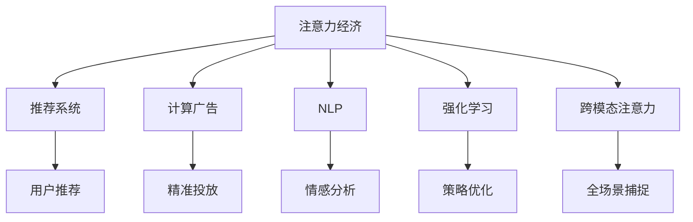

                 

# 人工智能在注意力经济中的应用

> 关键词：人工智能,注意力经济,注意力机制,推荐系统,自然语言处理,NLP,计算广告,强化学习

## 1. 背景介绍

### 1.1 问题由来

随着互联网和移动互联网的飞速发展，信息爆炸的浪潮让人们的注意力成为稀缺资源。在信息海洋中，如何吸引和保持用户的注意力，并转化为实际价值，成为各互联网公司争相探索的重要课题。

在这个背景下，"注意力经济"应运而生，通过对用户注意力的捕捉和利用，帮助企业实现精准营销、个性化推荐、广告投放等，从而实现商业价值最大化。人工智能技术，特别是深度学习、自然语言处理(NLP)、强化学习等，在注意力经济中扮演了核心角色，极大地提升了注意力捕获和转换的效率和效果。

### 1.2 问题核心关键点

人工智能在注意力经济中的应用，主要体现在以下几个方面：

1. **推荐系统**：通过深度学习和协同过滤等算法，为用户推荐可能感兴趣的内容或产品，最大化用户停留时间和转化率。

2. **计算广告**：基于用户行为数据和注意力模型，精准定位潜在客户，提高广告投放效果和ROI。

3. **自然语言处理(NLP)**：通过对用户生成内容的情感分析、意图识别等，了解用户需求，优化内容推荐。

4. **强化学习**：通过模仿学习、用户行为模拟等，不断优化推荐算法和广告投放策略，实现自我进化。

5. **跨模态注意力**：将图像、音频等多模态数据与文本结合，捕捉用户的全场景注意力，提升互动体验。

这些关键点共同构成了人工智能在注意力经济中的核心应用场景，通过技术创新和算法优化，帮助企业在信息爆炸的时代，更好地捕捉用户注意力，实现商业价值。

## 2. 核心概念与联系

### 2.1 核心概念概述

为更好地理解人工智能在注意力经济中的应用，本节将介绍几个密切相关的核心概念：

- **注意力经济**：通过捕捉和利用用户注意力，实现商业价值最大化的经济形态。
- **注意力机制**：一种计算模型，用于衡量和分配计算资源，特别是指在处理序列数据时，如何关注并处理关键信息。
- **推荐系统**：基于用户行为和物品属性，推荐可能感兴趣的内容或产品的系统。
- **计算广告**：通过算法优化，精准定位用户，提升广告投放效果的经济模式。
- **自然语言处理(NLP)**：利用机器学习技术，处理和理解自然语言，为注意力经济提供文本分析支持。
- **强化学习**：通过奖励和惩罚机制，学习最优策略的算法框架，广泛应用在推荐系统和广告优化中。
- **跨模态注意力**：将不同模态的信息融合，捕捉用户的全场景注意力，提升用户体验。

这些核心概念之间的逻辑关系可以通过以下Mermaid流程图来展示：



这个流程图展示了大语言模型在注意力经济中的核心概念及其之间的关系：

1. 注意力经济通过对推荐系统、计算广告、NLP、强化学习、跨模态注意力等技术的综合应用，实现商业价值的最大化。
2. 推荐系统、计算广告等通过算法优化和数据驱动，提高用户注意力转化率。
3. NLP技术通过文本分析，理解用户需求和行为，为推荐和广告提供数据支撑。
4. 强化学习通过模仿学习，不断优化策略，提升系统效率和效果。
5. 跨模态注意力融合多模态数据，捕捉用户全场景注意力，提升互动体验。

这些概念共同构成了人工智能在注意力经济中的应用框架，使其能够更好地捕捉用户注意力，实现商业价值。

## 3. 核心算法原理 & 具体操作步骤
### 3.1 算法原理概述

人工智能在注意力经济中的应用，本质上是一种计算和数据驱动的优化过程。其核心思想是：利用人工智能技术，通过对用户行为数据的建模，优化推荐和广告策略，最大化用户注意力和转化率。

形式化地，假设目标用户集合为 $U$，物品集合为 $I$，注意力模型为 $M$，推荐算法为 $R$，计算广告算法为 $A$。则注意力经济的目标可以表述为：

$$
\max_{M,R,A} \sum_{u \in U} \sum_{i \in I} \alpha_{u,i} r_{u,i} + \beta p_{u,i}
$$

其中 $\alpha_{u,i}$ 为物品 $i$ 对用户 $u$ 的注意力权重，$r_{u,i}$ 为推荐或广告投放带来的转化收益，$p_{u,i}$ 为用户对物品 $i$ 的点击率。

通过优化上述目标函数，人工智能技术可以最大化用户注意力和转化率，从而实现商业价值最大化。

### 3.2 算法步骤详解

人工智能在注意力经济中的应用，主要包括以下几个关键步骤：

**Step 1: 数据准备**
- 收集用户行为数据，如点击、浏览、购买等。
- 整理用户属性数据，如性别、年龄、兴趣等。
- 获取物品属性数据，如标题、描述、价格等。
- 选择合适的注意力模型和算法，如CTR预估、深度学习推荐系统、强化学习策略等。

**Step 2: 模型训练与优化**
- 对用户行为数据进行预处理和特征工程。
- 使用机器学习模型（如线性回归、随机森林、深度神经网络等）对用户行为进行建模。
- 对推荐和广告算法进行训练和优化，迭代调整模型参数。
- 使用A/B测试等手段评估模型效果，调整策略。

**Step 3: 推荐与投放**
- 使用训练好的模型进行物品推荐或广告投放。
- 实时监控和反馈用户行为数据，动态调整模型参数。
- 利用强化学习等技术进行策略优化，提升模型效果。

**Step 4: 效果评估与迭代**
- 使用A/B测试、离线评估等方法，评估模型效果。
- 根据评估结果，不断优化模型和算法，提升用户注意力和转化率。
- 引入新的数据和特征，进行模型再训练和优化。

### 3.3 算法优缺点

人工智能在注意力经济中的应用，具有以下优点：

1. **精准度提升**：通过深度学习和协同过滤等技术，推荐和广告投放能够更加精准，提高转化率。
2. **用户体验优化**：通过实时监控和反馈，动态调整推荐和投放策略，提升用户体验。
3. **效率提升**：自动化机器学习模型和算法，极大提升了数据处理和模型训练的效率。
4. **多模态融合**：跨模态注意力技术，融合图像、音频等多模态数据，捕捉用户全场景注意力。

同时，该方法也存在一些局限性：

1. **数据隐私**：收集和处理大量用户数据，存在隐私泄露的风险。
2. **算法复杂**：深度学习和强化学习等模型，训练复杂且计算资源消耗较大。
3. **过拟合风险**：在标注数据不足的情况下，存在过拟合的风险。
4. **模型解释性**：深度学习模型的黑盒特性，难以解释其内部决策逻辑。

尽管存在这些局限性，但就目前而言，人工智能在注意力经济中的应用仍然是最主流的方法。未来相关研究的重点在于如何进一步降低算法对数据的依赖，提高算法的解释性和泛化能力，同时兼顾隐私保护等因素。

### 3.4 算法应用领域

人工智能在注意力经济中的应用，涵盖了广告、推荐、客服等多个领域，具体如下：

1. **广告投放优化**：通过深度学习和大数据分析，实现精准用户定位和广告投放，提升广告投放效果和ROI。
2. **内容推荐系统**：基于用户行为数据和物品属性，推荐用户可能感兴趣的内容，提高用户满意度和留存率。
3. **智能客服**：利用自然语言处理技术，实现用户意图识别和自然语言理解，提升客服效率和体验。
4. **用户行为分析**：通过大数据分析，挖掘用户行为模式，指导产品优化和市场推广。
5. **数据驱动决策**：利用机器学习技术，构建数据驱动的决策系统，辅助企业运营和战略制定。

这些应用领域展示了人工智能在注意力经济中的广泛应用前景，为各行业带来了显著的商业价值提升。

## 4. 数学模型和公式 & 详细讲解 & 举例说明
### 4.1 数学模型构建

人工智能在注意力经济中的应用，涉及到多个领域的数学模型和公式。这里以推荐系统为例，简要介绍其数学模型构建过程。

假设推荐系统中有 $I$ 个物品，每个物品有 $d$ 个特征，即 $i \in I, x_i \in \mathbb{R}^d$。对于每个用户 $u$，假设其历史行为数据为 $h_u \in \mathbb{R}^m$，其中 $m$ 为用户行为数据的维度。推荐系统通过计算物品和用户之间的相似度 $s_{u,i}$，确定物品 $i$ 对用户 $u$ 的推荐概率 $p_{u,i}$。

推荐系统的目标是最大化用户对推荐物品的点击率。假设用户对物品 $i$ 的点击率为 $p_{u,i}$，则推荐系统的目标函数为：

$$
\max_{s_{u,i}} \sum_{u \in U} \sum_{i \in I} p_{u,i} \log r_{u,i}
$$

其中 $r_{u,i}$ 为物品 $i$ 的点击率，一般由用户行为数据和物品特征共同决定。

### 4.2 公式推导过程

以协同过滤推荐系统为例，其公式推导过程如下：

假设用户 $u$ 对物品 $i$ 的评分 $r_{u,i}$ 可以表示为 $r_{u,i} = x_u \cdot x_i$，其中 $x_u$ 和 $x_i$ 为用户 $u$ 和物品 $i$ 的特征表示。则物品 $i$ 对用户 $u$ 的相似度 $s_{u,i}$ 可以表示为：

$$
s_{u,i} = \frac{\text{dot}(x_u, x_i)}{\|x_u\| \cdot \|x_i\|}
$$

其中 $\text{dot}(x_u, x_i)$ 为向量 $x_u$ 和 $x_i$ 的点积。

将相似度 $s_{u,i}$ 代入推荐概率 $p_{u,i}$，得到：

$$
p_{u,i} = \sigma(\text{dot}(x_u, x_i))
$$

其中 $\sigma(\cdot)$ 为Sigmoid函数，用于将相似度映射到 $[0,1]$ 区间。

通过最大化上述目标函数，推荐系统可以学习到用户对物品的评分模型，从而实现推荐。

### 4.3 案例分析与讲解

以YouTube视频推荐系统为例，解释其在注意力经济中的应用：

1. **数据收集**：收集用户历史观看数据、点赞、收藏等行为，以及视频特征（如时长、标签）。
2. **特征工程**：将用户行为数据和视频特征进行编码和归一化，构建特征向量 $x_u$ 和 $x_i$。
3. **模型训练**：使用协同过滤等算法，训练相似度模型 $s_{u,i}$。
4. **推荐输出**：对新视频 $i$ 计算其对用户 $u$ 的推荐概率 $p_{u,i}$，根据推荐概率排序推荐视频。
5. **反馈迭代**：收集用户观看反馈数据，更新模型参数，提高推荐效果。

通过上述过程，YouTube视频推荐系统能够实现精准的视频推荐，提升用户观看体验和留存率，最大化用户注意力和广告收入。

## 5. 项目实践：代码实例和详细解释说明
### 5.1 开发环境搭建

在进行注意力经济相关的项目实践前，我们需要准备好开发环境。以下是使用Python进行TensorFlow和TensorBoard开发的Python环境配置流程：

1. 安装Anaconda：从官网下载并安装Anaconda，用于创建独立的Python环境。

2. 创建并激活虚拟环境：
```bash
conda create -n attention-env python=3.8 
conda activate attention-env
```

3. 安装TensorFlow：根据CUDA版本，从官网获取对应的安装命令。例如：
```bash
conda install tensorflow-gpu -c pytorch -c conda-forge
```

4. 安装TensorBoard：
```bash
pip install tensorboard
```

5. 安装各类工具包：
```bash
pip install numpy pandas scikit-learn matplotlib tqdm jupyter notebook ipython
```

完成上述步骤后，即可在`attention-env`环境中开始注意力经济相关的项目实践。

### 5.2 源代码详细实现

下面我们以YouTube视频推荐系统为例，给出使用TensorFlow实现推荐系统的代码实现。

首先，定义推荐系统的数据处理函数：

```python
import tensorflow as tf
from tensorflow.keras.layers import Input, Dense, Dot, Activation
from tensorflow.keras.models import Model

def create_model():
    # 定义用户和物品特征
    user_input = Input(shape=(m,))
    item_input = Input(shape=(d,))
    # 定义相似度模型
    dot_layer = Dot(axes=[1, 1])
    dot_output = dot_layer([user_input, item_input])
    # 定义输出层和激活函数
    output = Activation('sigmoid')(dot_output)
    # 定义模型
    model = Model(inputs=[user_input, item_input], outputs=output)
    # 编译模型
    model.compile(optimizer='adam', loss='binary_crossentropy')
    return model
```

然后，定义数据生成函数：

```python
from sklearn.datasets import make_classification
import numpy as np

def generate_data(num_users=1000, num_items=1000, num_features=10, num_epochs=100, batch_size=32):
    # 生成随机用户和物品特征
    X_u, y_u = make_classification(n_samples=num_users, n_features=num_features, n_classes=2)
    X_i, y_i = make_classification(n_samples=num_items, n_features=num_features, n_classes=2)
    # 构建特征向量
    X_u = np.concatenate([X_u, np.ones((num_users, 1))], axis=1)
    X_i = np.concatenate([X_i, np.ones((num_items, 1))], axis=1)
    # 划分训练集和测试集
    X_train_u, X_test_u, y_train_u, y_test_u = train_test_split(X_u, y_u, test_size=0.2, random_state=42)
    X_train_i, X_test_i, y_train_i, y_test_i = train_test_split(X_i, y_i, test_size=0.2, random_state=42)
    # 构建训练和测试集
    train_data = np.concatenate([X_train_u, X_train_i], axis=0)
    train_labels = np.concatenate([y_train_u, y_train_i], axis=0)
    test_data = np.concatenate([X_test_u, X_test_i], axis=0)
    test_labels = np.concatenate([y_test_u, y_test_i], axis=0)
    # 数据生成器
    train_generator = tf.data.Dataset.from_tensor_slices((train_data, train_labels))
    train_generator = train_generator.shuffle(buffer_size=10000).batch(batch_size)
    test_generator = tf.data.Dataset.from_tensor_slices((test_data, test_labels))
    test_generator = test_generator.shuffle(buffer_size=10000).batch(batch_size)
    return train_generator, test_generator
```

接着，定义模型训练和评估函数：

```python
def train(model, train_generator, epochs, batch_size):
    model.fit(train_generator, epochs=epochs, batch_size=batch_size, validation_data=test_generator)
    
def evaluate(model, test_generator):
    test_loss, test_acc = model.evaluate(test_generator)
    print(f"Test loss: {test_loss:.4f}")
    print(f"Test acc: {test_acc:.4f}")
```

最后，启动训练流程并在测试集上评估：

```python
epochs = 10
batch_size = 32

# 创建模型
model = create_model()

# 生成数据
train_generator, test_generator = generate_data()

# 训练模型
train(model, train_generator, epochs, batch_size)

# 评估模型
evaluate(model, test_generator)
```

以上就是使用TensorFlow实现YouTube视频推荐系统的完整代码实现。可以看到，通过TensorFlow的强大封装，我们能够快速搭建推荐系统的框架，并利用TensorBoard进行可视化调试和评估。

### 5.3 代码解读与分析

让我们再详细解读一下关键代码的实现细节：

**create_model函数**：
- 定义用户和物品特征输入层，并构建相似度模型。
- 将相似度输出层通过Sigmoid函数映射到 $[0,1]$ 区间。
- 定义模型，并编译。

**generate_data函数**：
- 生成随机用户和物品特征数据，构建特征向量。
- 将用户特征向量和物品特征向量拼接，构成输入。
- 划分训练集和测试集。
- 定义数据生成器，用于批量读取数据。

**train和evaluate函数**：
- 使用TensorFlow的fit方法训练模型，并指定训练集和测试集。
- 使用evaluate方法评估模型性能，输出测试集的loss和acc。

通过上述代码实现，能够直观地看到深度学习在注意力经济中的应用，以及通过TensorFlow等框架进行推荐系统开发的流程。

当然，实际项目中还需要考虑更多的因素，如模型裁剪、量化加速、服务化封装等。但核心的推荐流程基本与此类似。

## 6. 实际应用场景
### 6.1 智能推荐系统

智能推荐系统是人工智能在注意力经济中的重要应用之一。通过深度学习和协同过滤等算法，为用户推荐可能感兴趣的内容或产品，提升用户满意度和留存率。

在具体实现中，智能推荐系统需要考虑以下几个关键点：

1. **特征工程**：对用户行为数据和物品属性进行编码和归一化，提取有意义的特征。
2. **模型选择**：选择合适的推荐算法，如协同过滤、矩阵分解、深度学习等。
3. **训练与优化**：使用机器学习模型对推荐算法进行训练和优化，提升推荐效果。
4. **效果评估**：通过A/B测试等手段，评估推荐效果，调整策略。

例如，Netflix和Amazon等公司，通过智能推荐系统，能够精准地为用户推荐电影、书籍、商品等，提升用户粘性和购买率，实现商业价值最大化。

### 6.2 计算广告

计算广告通过深度学习和大数据分析，实现精准用户定位和广告投放，提升广告投放效果和ROI。

计算广告主要涉及以下几个关键步骤：

1. **数据收集**：收集用户行为数据、兴趣标签等，构建用户画像。
2. **特征工程**：对用户画像和广告数据进行编码和归一化，提取有意义的特征。
3. **模型训练**：使用机器学习模型对广告投放策略进行训练和优化。
4. **效果评估**：通过A/B测试等手段，评估广告效果，调整策略。

例如，谷歌通过计算广告技术，能够精准地将广告投放给潜在客户，提高广告点击率和转化率，提升广告主的ROI。

### 6.3 智能客服

智能客服通过自然语言处理技术，实现用户意图识别和自然语言理解，提升客服效率和体验。

智能客服主要涉及以下几个关键步骤：

1. **数据收集**：收集用户对话数据、历史查询记录等。
2. **特征工程**：对对话数据进行文本预处理和特征提取。
3. **模型训练**：使用机器学习模型对用户意图进行训练和优化。
4. **效果评估**：通过人工评估等手段，评估客服效果，调整策略。

例如，阿里巴巴通过智能客服系统，能够快速响应用户咨询，提升客户满意度和品牌忠诚度。

### 6.4 用户行为分析

用户行为分析通过大数据分析，挖掘用户行为模式，指导产品优化和市场推广。

用户行为分析主要涉及以下几个关键步骤：

1. **数据收集**：收集用户行为数据，如点击、浏览、购买等。
2. **特征工程**：对行为数据进行编码和归一化，提取有意义的特征。
3. **模型训练**：使用机器学习模型对用户行为进行训练和优化。
4. **效果评估**：通过业务指标等手段，评估分析效果，调整策略。

例如，京东通过用户行为分析，能够深入了解用户需求和行为模式，优化商品推荐，提升销售效果。

### 6.5 数据驱动决策

数据驱动决策通过机器学习技术，构建数据驱动的决策系统，辅助企业运营和战略制定。

数据驱动决策主要涉及以下几个关键步骤：

1. **数据收集**：收集企业运营数据、市场数据等。
2. **特征工程**：对数据进行编码和归一化，提取有意义的特征。
3. **模型训练**：使用机器学习模型对决策变量进行训练和优化。
4. **效果评估**：通过业务指标等手段，评估决策效果，调整策略。

例如，亚马逊通过数据驱动决策系统，能够实时监控和优化供应链管理，提升运营效率和市场响应速度。

## 7. 工具和资源推荐
### 7.1 学习资源推荐

为了帮助开发者系统掌握人工智能在注意力经济中的应用，这里推荐一些优质的学习资源：

1. **《Deep Learning》课程**：由Coursera开设的深度学习入门课程，系统介绍了深度学习的基本概念和常用算法，适合初学者学习。

2. **《推荐系统》课程**：由斯坦福大学开设的推荐系统课程，涵盖了协同过滤、矩阵分解、深度学习等多种推荐算法，适合进阶学习。

3. **《计算广告》书籍**：详细介绍了计算广告的原理和实现方法，适合广告从业者学习。

4. **《自然语言处理》书籍**：全面介绍了自然语言处理的基本概念和常用技术，适合NLP从业者学习。

5. **《强化学习》书籍**：介绍了强化学习的原理和应用，适合学习智能推荐系统、广告优化等应用场景。

通过对这些资源的学习实践，相信你一定能够快速掌握人工智能在注意力经济中的核心应用，并用于解决实际的业务问题。

### 7.2 开发工具推荐

高效的开发离不开优秀的工具支持。以下是几款用于注意力经济开发常用的工具：

1. **TensorFlow**：由Google主导开发的深度学习框架，支持分布式计算，适合大规模模型训练。

2. **PyTorch**：由Facebook主导开发的深度学习框架，灵活易用，适合研究和小规模模型训练。

3. **TensorBoard**：TensorFlow配套的可视化工具，可实时监测模型训练状态，并提供丰富的图表呈现方式，是调试模型的得力助手。

4. **Jupyter Notebook**：交互式编程环境，方便代码调试和可视化。

5. **JupyterLab**：Jupyter Notebook的扩展，提供更加丰富的功能和更好的用户体验。

6. **Anaconda**：创建和管理Python环境的工具，方便项目管理。

合理利用这些工具，可以显著提升注意力经济项目的开发效率，加快创新迭代的步伐。

### 7.3 相关论文推荐

人工智能在注意力经济中的应用，得益于众多学者的持续研究。以下是几篇奠基性的相关论文，推荐阅读：

1. **《Collaborative Filtering for Implicit Feedback Datasets》**：介绍了协同过滤推荐算法的基本原理和应用。

2. **《The Promise of Predictive Analytics in Customer Experience》**：探讨了利用机器学习提升客户体验的方法。

3. **《Deep Personalization with Neural Networks》**：介绍了深度学习在个性化推荐系统中的应用。

4. **《Deep Reinforcement Learning for Personalized Product Recommendations》**：展示了强化学习在推荐系统中的应用。

5. **《Personalizing Entertainment Recommendations》**：介绍了基于用户行为的个性化推荐方法。

这些论文代表了大语言模型在注意力经济中的核心应用方向，展示了其广泛的应用前景。

## 8. 总结：未来发展趋势与挑战
### 8.1 研究成果总结

本文对人工智能在注意力经济中的应用进行了全面系统的介绍。首先，阐述了注意力经济的概念和重要性，明确了人工智能技术在其中的核心作用。其次，从原理到实践，详细讲解了推荐系统、计算广告、智能客服等核心应用场景，给出了具体的代码实现和案例分析。同时，本文还探讨了人工智能在注意力经济中的广泛应用前景，展示了其在广告、推荐、客服等多个领域的应用潜力。

通过本文的系统梳理，可以看到，人工智能在注意力经济中的应用，正在不断深入和扩展，通过深度学习、自然语言处理、强化学习等技术，提高了用户注意力和转化率，推动了各行业的数字化转型升级。未来，随着技术的不断演进和应用场景的不断拓展，人工智能在注意力经济中的应用将会更加广泛和深入。

### 8.2 未来发展趋势

展望未来，人工智能在注意力经济中的应用，将呈现以下几个发展趋势：

1. **跨模态融合**：将图像、音频等多模态数据与文本结合，捕捉用户全场景注意力，提升用户体验。

2. **个性化推荐**：通过深度学习和协同过滤等算法，实现更加精准和个性化的推荐，提高用户满意度和留存率。

3. **智能客服**：利用自然语言处理技术，实现更加自然和智能的客服交互，提升客户体验和品牌忠诚度。

4. **计算广告**：通过深度学习和大数据分析，实现精准用户定位和广告投放，提升广告投放效果和ROI。

5. **数据驱动决策**：利用机器学习技术，构建数据驱动的决策系统，辅助企业运营和战略制定。

这些趋势展示了人工智能在注意力经济中的广泛应用前景，为各行业带来了显著的商业价值提升。

### 8.3 面临的挑战

尽管人工智能在注意力经济中的应用已经取得了瞩目成就，但在迈向更加智能化、普适化应用的过程中，仍面临诸多挑战：

1. **数据隐私**：收集和处理大量用户数据，存在隐私泄露的风险。如何在保护隐私的同时，提升模型效果，是一个重要问题。

2. **算法复杂**：深度学习和强化学习等模型，训练复杂且计算资源消耗较大。如何提高算法的效率和效果，是未来的研究方向。

3. **模型解释性**：深度学习模型的黑盒特性，难以解释其内部决策逻辑。如何增强模型的可解释性和透明度，是研究重点。

4. **数据质量**：数据质量和多样性不足，导致模型泛化性能差。如何提升数据质量，增强模型泛化能力，是关键问题。

5. **模型鲁棒性**：模型在面对新数据时，容易发生灾难性遗忘。如何提高模型的鲁棒性，保持长远的稳定性能，是一个重要挑战。

尽管存在这些挑战，但随着技术的不断进步和数据量的不断积累，这些问题有望逐步得到解决，人工智能在注意力经济中的应用将会更加广泛和深入。

### 8.4 研究展望

面对人工智能在注意力经济中所面临的挑战，未来的研究需要在以下几个方面寻求新的突破：

1. **数据隐私保护**：采用差分隐私等技术，保护用户隐私，同时提升模型效果。

2. **模型可解释性**：引入可解释性技术，增强模型的可解释性和透明度，便于用户理解和信任。

3. **算法效率提升**：开发更加高效的深度学习算法和优化方法，提升模型训练和推理效率。

4. **模型鲁棒性增强**：利用对抗训练等技术，提高模型的鲁棒性和泛化能力，避免灾难性遗忘。

5. **跨模态融合技术**：将图像、音频等多模态数据与文本结合，提升用户注意力捕捉的全面性和精准性。

这些研究方向将为人工智能在注意力经济中的应用提供新的动力，推动技术向更高效、更智能、更普适的方向发展。

## 9. 附录：常见问题与解答
### 附录1: 数据隐私问题

**Q1：如何保护用户数据隐私？**

A: 数据隐私保护是人工智能应用中的重要问题，特别是在注意力经济中，用户行为数据和注意力数据尤为敏感。以下是一些保护用户数据隐私的常用方法：

1. **差分隐私**：在模型训练过程中，加入噪声扰动，保护用户隐私的同时，不显著影响模型效果。

2. **联邦学习**：将模型在用户端训练，通过加密手段传输模型参数，保护用户数据隐私。

3. **匿名化**：对用户数据进行匿名化处理，去除或模糊化敏感信息，保护用户隐私。

4. **访问控制**：对数据访问进行严格控制，只有授权人员才能访问敏感数据。

5. **数据加密**：对数据进行加密处理，确保数据在传输和存储过程中不被窃取。

### 附录2: 算法复杂性问题

**Q2：如何降低算法复杂性？**

A: 深度学习和强化学习等模型的计算资源消耗较大，训练复杂。以下是一些降低算法复杂性的常用方法：

1. **模型裁剪**：去除不必要的层和参数，减小模型尺寸，加快推理速度。

2. **量化加速**：将浮点模型转为定点模型，压缩存储空间，提高计算效率。

3. **分布式训练**：使用分布式计算框架，加速模型训练过程。

4. **模型并行**：使用模型并行技术，提高计算效率，加速模型训练。

5. **算法优化**：优化算法本身，减少计算量，提高效率。

### 附录3: 模型可解释性问题

**Q3：如何增强模型的可解释性？**

A: 深度学习模型的黑盒特性，难以解释其内部决策逻辑。以下是一些增强模型可解释性的常用方法：

1. **特征可视化**：通过特征可视化技术，直观展示模型的特征重要性，帮助理解模型决策。

2. **模型可视化**：使用可视化工具，展示模型结构和参数分布，帮助理解模型内部工作机制。

3. **解释生成**：利用解释生成技术，自动生成模型决策的解释，便于用户理解和信任。

4. **可解释模型**：开发可解释模型，如决策树、线性模型等，增强模型的可解释性和透明度。

### 附录4: 数据质量问题

**Q4：如何提升数据质量？**

A: 数据质量和多样性不足，导致模型泛化性能差。以下是一些提升数据质量的常用方法：

1. **数据增强**：通过对原始数据进行扩充和增强，增加数据多样性和数量。

2. **数据清洗**：对数据进行清洗和去噪，提高数据质量。

3. **数据采集**：通过多渠道数据采集，增加数据多样性。

4. **数据标注**：对数据进行标注，提高数据质量和标注质量。

5. **数据融合**：将不同来源的数据进行融合，增加数据多样性。

### 附录5: 模型鲁棒性问题

**Q5：如何提高模型鲁棒性？**

A: 模型在面对新数据时，容易发生灾难性遗忘。以下是一些提高模型鲁棒性的常用方法：

1. **迁移学习**：利用迁移学习技术，将已有模型知识迁移到新任务中，提高模型鲁棒性。

2. **对抗训练**：引入对抗样本，提高模型鲁棒性和泛化能力。

3. **自适应学习**：通过自适应学习技术，动态调整模型参数，提高模型鲁棒性。

4. **模型融合**：将多个模型进行融合，提高模型鲁棒性和泛化能力。

5. **数据增强**：通过对原始数据进行扩充和增强，提高模型鲁棒性。

这些附录问题与解答，展示了人工智能在注意力经济中的应用过程中，可能面临的一些常见挑战，以及相应的解决方案。通过对这些问题的深入探讨，相信在未来的研究与实践中，人工智能在注意力经济中的应用将更加成熟和高效。

---

作者：禅与计算机程序设计艺术 / Zen and the Art of Computer Programming

