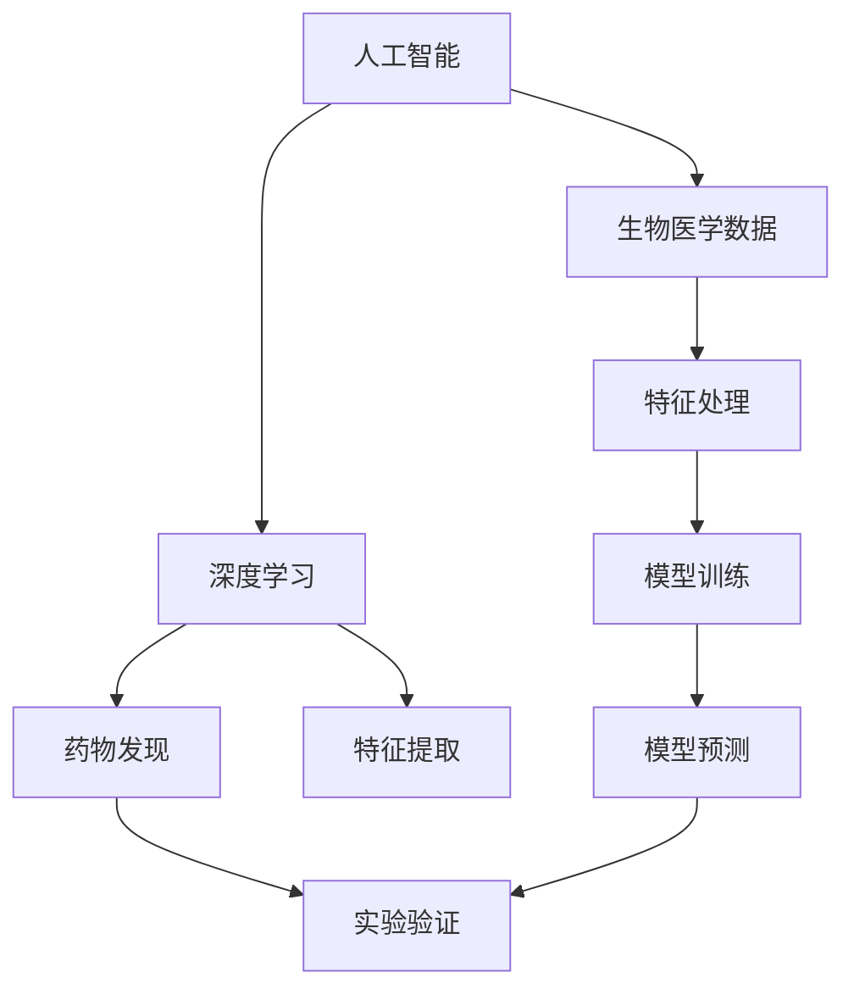

                 

# 人工智能在生物医学和药物发现中的应用

> 关键词：人工智能,生物医学,药物发现,深度学习,数据科学,生物信息学

## 1. 背景介绍

### 1.1 问题由来

在过去几十年里，人工智能（AI）技术在各行各业中不断取得突破，尤其是在生物医学和药物发现领域，AI技术的应用已经极大地推动了科学研究和临床实践的进步。随着基因组学、蛋白质组学和分子生物学等技术的发展，生物医学领域积累了大量的数据，为AI技术提供了丰富的研究素材。药物发现是生物医学领域的重要环节，旨在从已知药物中筛选出潜在的新药或优化现有药物的结构和性能，以满足临床需求。传统的药物发现过程耗时漫长，成本高昂，成功率低，AI技术的引入为这一过程带来了革命性的变化。

### 1.2 问题核心关键点

AI在生物医学和药物发现中的应用主要包括以下几个关键点：

- **数据驱动**：利用机器学习模型从海量生物医学数据中提取有价值的信息，推动新药发现和临床决策。
- **算法优化**：通过深度学习、强化学习等算法优化药物筛选、设计、临床试验设计和结果分析等环节。
- **跨学科融合**：结合计算机科学、生物信息学、统计学等学科的知识，实现医学信息的全面挖掘和利用。
- **伦理与隐私**：在利用AI技术时，需关注数据隐私、伦理问题和法律合规性，确保技术的透明和公正使用。

## 2. 核心概念与联系

### 2.1 核心概念概述

为了更好地理解AI在生物医学和药物发现中的应用，我们首先介绍几个关键概念：

- **人工智能（AI）**：指模拟人类智能过程的技术，包括机器学习、深度学习、自然语言处理等子领域。
- **深度学习（DL）**：一种特殊形式的机器学习，通过多层次神经网络处理复杂数据。
- **生物医学数据**：包括基因组序列、蛋白质结构、临床试验数据等，用于生物医学研究和药物发现。
- **药物发现**：从已知化合物或生物分子中筛选出具有潜在药理活性的化合物，进行临床试验验证的过程。

这些概念之间存在紧密的联系。深度学习模型利用生物医学数据进行训练，从中提取有用的特征和模式，用于药物发现和预测。药物发现过程需要大量实验数据和计算资源，AI技术能够加速数据处理和模式识别，提高发现新药的效率和成功率。

### 2.2 核心概念原理和架构的 Mermaid 流程图



这个流程图展示了AI、深度学习、生物医学数据、药物发现和实验验证之间的联系和相互作用。

## 3. 核心算法原理 & 具体操作步骤

### 3.1 算法原理概述

AI在生物医学和药物发现中的应用主要基于深度学习模型的特征提取和模式识别能力。深度学习模型，特别是卷积神经网络（CNN）和循环神经网络（RNN），已经在图像识别、语音识别和自然语言处理等领域取得了显著进展。将这些技术应用到生物医学和药物发现领域，能够从海量数据中提取有用的特征和模式，辅助药物设计和筛选。

### 3.2 算法步骤详解

基于深度学习的药物发现流程主要包括以下几个步骤：

1. **数据收集与预处理**：
   - 收集生物医学数据，包括基因组序列、蛋白质结构、化合物化学结构、临床试验数据等。
   - 对数据进行清洗、去噪、归一化等预处理，确保数据质量和一致性。

2. **特征提取与表示学习**：
   - 利用深度学习模型对生物医学数据进行特征提取，如使用卷积神经网络（CNN）提取图像数据特征，使用循环神经网络（RNN）提取序列数据特征。
   - 利用预训练的词嵌入模型（如BERT、GPT等）对文本数据进行表示学习，提取文本特征。

3. **模型训练与优化**：
   - 利用收集到的数据训练深度学习模型，优化模型参数。
   - 采用反向传播算法进行模型优化，如梯度下降、Adam等。

4. **药物筛选与设计**：
   - 利用训练好的模型对化合物库进行筛选，预测化合物与目标蛋白的亲和力。
   - 根据筛选结果，设计新的化合物结构，进行实验验证。

5. **临床试验设计与结果分析**：
   - 利用模型对临床试验数据进行分析，优化试验设计和结果解释。
   - 根据试验结果，优化药物配方和剂型，进行下一阶段的临床验证。

### 3.3 算法优缺点

深度学习在药物发现中的应用具有以下优点：

- **高效性**：能够快速处理海量生物医学数据，提取有用特征，提高新药筛选的效率。
- **鲁棒性**：在处理噪声数据和异常情况时表现良好，能够提取数据中的本质模式。
- **可解释性**：部分深度学习模型（如可解释性高的模型）能够提供特征重要性和决策依据。

然而，深度学习在药物发现中也存在一些缺点：

- **高计算需求**：深度学习模型的训练和推理需要大量计算资源和硬件设备。
- **数据需求高**：需要大量的高质量生物医学数据支持模型训练，数据获取和预处理成本较高。
- **模型复杂性**：深度学习模型的结构和参数设置较为复杂，需要专业知识进行优化。
- **泛化能力有限**：深度学习模型在特定数据集上的表现可能较好，但在新数据集上的泛化能力有限。

### 3.4 算法应用领域

AI在生物医学和药物发现中的应用广泛，具体包括以下几个方面：

1. **药物筛选与优化**：
   - 利用深度学习模型对化合物库进行大规模筛选，提高新药发现的成功率。
   - 通过优化药物分子结构和性质，提升药物活性和选择性。

2. **靶点识别与药物设计**：
   - 利用深度学习模型分析蛋白质结构数据，识别潜在的药物靶点。
   - 结合计算机模拟和计算化学技术，设计新的药物分子。

3. **临床试验设计与分析**：
   - 利用深度学习模型对临床试验数据进行分析，优化试验设计和结果解释。
   - 预测药物在临床试验中的反应和副作用，指导试验设计。

4. **药物基因组学与个性化治疗**：
   - 利用深度学习模型分析基因组数据，识别与药物反应相关的基因变异。
   - 结合个性化基因信息，优化药物配方和治疗方案。

## 4. 数学模型和公式 & 详细讲解 & 举例说明

### 4.1 数学模型构建

在药物发现中，深度学习模型的数学模型通常包括输入层、隐藏层和输出层。以卷积神经网络（CNN）为例，其数学模型可表示为：

$$
h = \sigma(\sum_{i=1}^{C} W_i x_i + b_i)
$$

其中，$x_i$表示输入层的数据，$W_i$和$b_i$为隐藏层的权重和偏置，$\sigma$为激活函数。输出层通常为回归或分类模型，用于预测药物与靶点的亲和力或活性。

### 4.2 公式推导过程

以二分类问题为例，假设训练集为$(x_1, y_1), \ldots, (x_N, y_N)$，其中$y_i \in \{0, 1\}$，表示化合物与靶点的亲和力（1）或非亲和力（0）。目标是最小化损失函数：

$$
L = -\frac{1}{N} \sum_{i=1}^{N} (y_i \log \hat{y_i} + (1-y_i) \log (1-\hat{y_i}))
$$

其中，$\hat{y_i}$表示模型对第$i$个样本的预测结果。使用梯度下降算法优化模型参数，每次迭代更新权重和偏置：

$$
W_i \leftarrow W_i - \eta \frac{\partial L}{\partial W_i}, \quad b_i \leftarrow b_i - \eta \frac{\partial L}{\partial b_i}
$$

其中，$\eta$为学习率，通常从较小的值开始，逐步减小。

### 4.3 案例分析与讲解

以DeepMind开发的AlphaFold为例，该模型利用深度学习对蛋白质结构进行预测。AlphaFold的数学模型包括多个卷积层和残差网络层，用于提取蛋白质序列的局部和全局特征。训练过程中，使用均方误差（MSE）作为损失函数，目标是最小化预测结构与真实结构的差异。AlphaFold的成功证明了深度学习在蛋白质结构预测中的强大能力，推动了生物医学研究的发展。

## 5. 项目实践：代码实例和详细解释说明

### 5.1 开发环境搭建

为了进行深度学习模型的开发和训练，需要搭建相应的开发环境。以下是Python环境下搭建深度学习开发环境的流程：

1. **安装Python**：
   - 从官网下载并安装最新版本的Python。
   - 将Python添加到系统环境变量中。

2. **安装深度学习框架**：
   - 安装TensorFlow或PyTorch，可以使用Anaconda或pip安装。
   - 安装相关依赖库，如numpy、scikit-learn、pandas等。

3. **搭建虚拟环境**：
   - 使用conda或virtualenv创建虚拟环境。
   - 在虚拟环境中安装所需的Python库和依赖。

4. **安装GPU驱动和CUDA**：
   - 如果使用GPU进行模型训练和推理，需要安装相应的GPU驱动和CUDA。
   - 检查是否成功安装，并测试GPU性能。

### 5.2 源代码详细实现

以下是一个简单的药物筛选模型实现示例，使用卷积神经网络（CNN）进行化合物与靶点亲和力的预测：

```python
import tensorflow as tf
from tensorflow.keras import layers, models

# 构建卷积神经网络模型
model = models.Sequential([
    layers.Conv2D(32, (3, 3), activation='relu', input_shape=(32, 32, 1)),
    layers.MaxPooling2D((2, 2)),
    layers.Flatten(),
    layers.Dense(64, activation='relu'),
    layers.Dense(1, activation='sigmoid')
])

# 编译模型
model.compile(optimizer='adam', loss='binary_crossentropy', metrics=['accuracy'])

# 训练模型
model.fit(train_images, train_labels, epochs=10, batch_size=32, validation_data=(val_images, val_labels))
```

上述代码实现了使用CNN进行化合物与靶点亲和力预测的模型训练。其中，`train_images`和`train_labels`表示训练集，`val_images`和`val_labels`表示验证集。模型训练过程中，使用`Adam`优化器和二分类交叉熵损失函数进行优化。

### 5.3 代码解读与分析

在上述代码中，我们首先定义了卷积神经网络（CNN）的结构，包括卷积层、池化层、全连接层和输出层。然后，使用`compile`方法编译模型，指定优化器和损失函数。最后，通过`fit`方法对模型进行训练，并在验证集上进行评估。

## 6. 实际应用场景

### 6.1 药物筛选

药物筛选是药物发现的重要环节，AI技术在此过程中扮演着关键角色。通过深度学习模型对化合物库进行大规模筛选，可以快速识别具有潜在活性的化合物，显著提高新药发现的成功率。

以赛诺菲-安万特公司的LUMINUS平台为例，该平台利用深度学习模型对化合物进行高通量筛选，实现了每年数百万个化合物的筛选，发现了一系列新药。LUMINUS平台的成功证明了深度学习在药物筛选中的高效性和准确性。

### 6.2 靶点识别

靶点识别是药物设计的重要步骤，AI技术在此过程中也发挥着重要作用。利用深度学习模型对蛋白质结构数据进行分析和预测，可以识别潜在的药物靶点，为药物设计提供重要参考。

以DeepMind开发的AlphaFold为例，该模型利用深度学习对蛋白质结构进行预测，显著提高了蛋白质结构预测的准确性，为药物设计提供了新的思路和方法。

### 6.3 临床试验设计与分析

临床试验设计与分析是药物开发的重要环节，AI技术在此过程中可以优化试验设计和结果解释。利用深度学习模型对临床试验数据进行分析，可以优化试验方案，提高试验效率和成功率。

以LUMINUS平台为例，该平台利用深度学习模型对临床试验数据进行分析，优化试验设计和结果解释，提高了临床试验的效率和成功率。

### 6.4 未来应用展望

随着AI技术的不断进步，其在生物医学和药物发现中的应用前景将更加广阔。未来的AI技术将在以下几个方面取得突破：

1. **跨模态数据融合**：将基因组学、蛋白质组学、代谢组学等多模态数据进行融合，实现全面系统的药物发现。
2. **个性化医疗**：利用AI技术对患者基因信息进行分析，制定个性化的治疗方案，提高治疗效果。
3. **药物基因组学**：利用AI技术分析基因组数据，发现与药物反应相关的基因变异，推动基因组医学的发展。
4. **药物再利用**：利用AI技术重新评估现有药物在新领域的应用前景，加速新药开发。

## 7. 工具和资源推荐

### 7.1 学习资源推荐

为了深入学习和掌握AI在生物医学和药物发现中的应用，以下是一些推荐的学习资源：

1. **《深度学习与生物医学》**：介绍了深度学习在生物医学和药物发现中的应用，涵盖了数据收集、特征提取、模型训练和结果分析等环节。
2. **《生物信息学导论》**：介绍了生物信息学的基本概念和核心技术，包括DNA序列分析、蛋白质结构预测等。
3. **Coursera《机器学习》课程**：斯坦福大学开设的机器学习课程，涵盖了机器学习的基本概念和算法，适合初学者入门。
4. **Kaggle竞赛**：利用Kaggle竞赛平台，参与药物发现和基因组学等领域的机器学习竞赛，积累实践经验。

### 7.2 开发工具推荐

以下是在深度学习开发中常用的工具和平台：

1. **TensorFlow**：由Google开发的深度学习框架，支持分布式训练和推理，适合大规模数据处理。
2. **PyTorch**：由Facebook开发的深度学习框架，支持动态计算图，易于使用和调试。
3. **TensorFlow Hub**：提供了多种预训练模型和工具库，方便快速搭建深度学习模型。
4. **GitHub**：代码托管平台，方便分享和协作开发深度学习项目。
5. **Google Colab**：免费的Jupyter Notebook环境，支持GPU计算，方便实验和分享。

### 7.3 相关论文推荐

以下是一些经典的研究论文，推荐阅读：

1. **AlphaFold: A Scalable and Accurate Prediction of Protein Structures**：DeepMind开发的AlphaFold，利用深度学习对蛋白质结构进行预测，显著提高了预测准确性。
2. **LUMINUS: High-Throughput Small-Molecule Screening with Deep Learning**：赛诺菲-安万特公司的LUMINUS平台，利用深度学习对化合物库进行大规模筛选，推动了药物发现的发展。
3. **Patient-Level Predictive Modeling of Drug Efficacy and Toxicity for Early-Phase Clinical Trials**：利用深度学习模型对临床试验数据进行分析和预测，优化试验设计和结果解释。
4. **Deep Learning for Drug Discovery**：综述了深度学习在药物发现中的应用，涵盖了药物筛选、靶点识别、临床试验分析等多个环节。

## 8. 总结：未来发展趋势与挑战

### 8.1 研究成果总结

AI在生物医学和药物发现中的应用已经取得了显著进展，深度学习模型在药物筛选、靶点识别、临床试验分析等多个环节表现出色。通过深度学习模型对生物医学数据进行分析和预测，加速了新药发现和临床试验的进程，提高了药物研发的效率和成功率。

### 8.2 未来发展趋势

未来，AI在生物医学和药物发现中的应用将更加广泛和深入。随着AI技术的不断进步，将在以下几个方面取得突破：

1. **跨模态数据融合**：将多模态数据进行融合，实现全面系统的药物发现和分析。
2. **个性化医疗**：利用AI技术对患者基因信息进行分析，制定个性化的治疗方案，提高治疗效果。
3. **药物基因组学**：利用AI技术分析基因组数据，发现与药物反应相关的基因变异，推动基因组医学的发展。
4. **药物再利用**：利用AI技术重新评估现有药物在新领域的应用前景，加速新药开发。

### 8.3 面临的挑战

尽管AI在生物医学和药物发现中的应用已经取得了显著进展，但在实际应用中仍面临诸多挑战：

1. **数据获取和质量**：需要获取大量的高质量生物医学数据，数据获取和预处理成本较高。
2. **模型复杂性**：深度学习模型结构和参数设置较为复杂，需要专业知识进行优化。
3. **伦理和隐私**：在数据收集和分析过程中，需关注数据隐私和伦理问题，确保数据的透明和公正使用。
4. **计算资源需求**：深度学习模型训练和推理需要大量计算资源和硬件设备。

### 8.4 研究展望

未来，需要进一步研究和解决上述挑战，推动AI在生物医学和药物发现中的应用。研究方向包括：

1. **数据收集与预处理**：开发高效的数据收集和预处理技术，降低数据获取和预处理的成本。
2. **模型优化**：研究和优化深度学习模型的结构和参数设置，提高模型的效率和性能。
3. **伦理与隐私**：制定数据隐私和伦理相关的法律法规，确保数据的安全和透明使用。
4. **计算资源优化**：研究和开发高效的计算资源优化技术，降低计算资源需求，提高模型训练和推理效率。

## 9. 附录：常见问题与解答

### 常见问题

**Q1：深度学习模型在药物发现中的作用是什么？**

A: 深度学习模型在药物发现中主要作用如下：
- 大规模筛选化合物库，提高新药发现的成功率。
- 分析蛋白质结构数据，识别潜在的药物靶点。
- 对临床试验数据进行分析，优化试验设计和结果解释。

**Q2：AI在药物发现中需要哪些数据？**

A: AI在药物发现中主要需要以下几种数据：
- 化合物库数据：包括化合物的结构、性质、活性和用途等信息。
- 蛋白质结构数据：包括蛋白质序列、结构、功能等信息。
- 临床试验数据：包括患者的临床数据、治疗效果等信息。
- 基因组数据：包括患者的基因序列、基因变异等信息。

**Q3：如何选择合适的深度学习模型进行药物发现？**

A: 选择合适的深度学习模型需要考虑以下几个方面：
- 数据类型：根据数据类型选择适合的数据处理方式，如图像数据使用卷积神经网络（CNN），序列数据使用循环神经网络（RNN）。
- 任务类型：根据任务类型选择适合的模型，如药物筛选任务可以选择分类模型，靶点识别任务可以选择回归模型。
- 计算资源：根据计算资源选择合适的模型，如计算资源充足可以选择更深、更复杂的模型。

**Q4：AI在药物发现中面临哪些挑战？**

A: AI在药物发现中面临以下挑战：
- 数据获取和质量：需要获取大量的高质量生物医学数据，数据获取和预处理成本较高。
- 模型复杂性：深度学习模型结构和参数设置较为复杂，需要专业知识进行优化。
- 伦理和隐私：在数据收集和分析过程中，需关注数据隐私和伦理问题，确保数据的透明和公正使用。
- 计算资源需求：深度学习模型训练和推理需要大量计算资源和硬件设备。

### 解答

**A1**: 深度学习模型在药物发现中主要作用如下：
- 大规模筛选化合物库，提高新药发现的成功率。
- 分析蛋白质结构数据，识别潜在的药物靶点。
- 对临床试验数据进行分析，优化试验设计和结果解释。

**A2**: AI在药物发现中主要需要以下几种数据：
- 化合物库数据：包括化合物的结构、性质、活性和用途等信息。
- 蛋白质结构数据：包括蛋白质序列、结构、功能等信息。
- 临床试验数据：包括患者的临床数据、治疗效果等信息。
- 基因组数据：包括患者的基因序列、基因变异等信息。

**A3**: 选择合适的深度学习模型需要考虑以下几个方面：
- 数据类型：根据数据类型选择适合的数据处理方式，如图像数据使用卷积神经网络（CNN），序列数据使用循环神经网络（RNN）。
- 任务类型：根据任务类型选择适合的模型，如药物筛选任务可以选择分类模型，靶点识别任务可以选择回归模型。
- 计算资源：根据计算资源选择合适的模型，如计算资源充足可以选择更深、更复杂的模型。

**A4**: AI在药物发现中面临以下挑战：
- 数据获取和质量：需要获取大量的高质量生物医学数据，数据获取和预处理成本较高。
- 模型复杂性：深度学习模型结构和参数设置较为复杂，需要专业知识进行优化。
- 伦理和隐私：在数据收集和分析过程中，需关注数据隐私和伦理问题，确保数据的透明和公正使用。
- 计算资源需求：深度学习模型训练和推理需要大量计算资源和硬件设备。

---

作者：禅与计算机程序设计艺术 / Zen and the Art of Computer Programming

