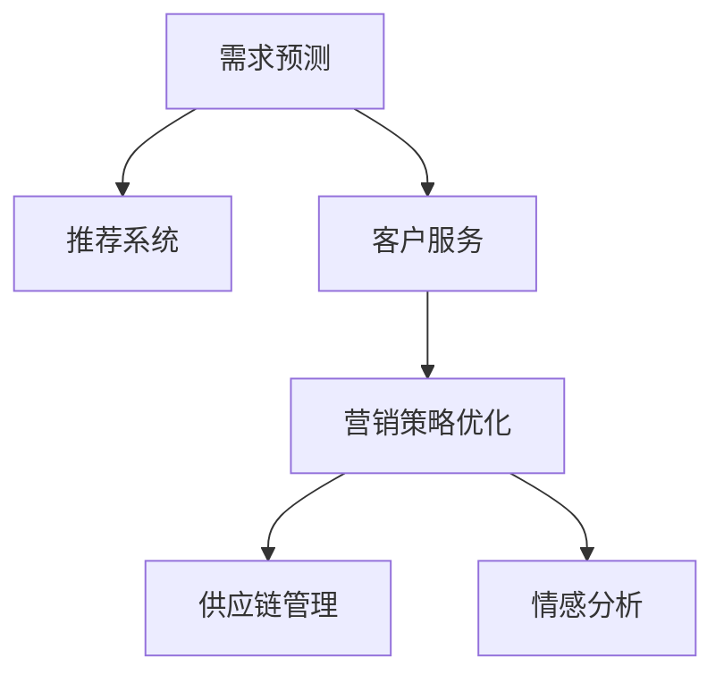

                 

# 人工智能在零售和电子商务中的应用

> 关键词：人工智能, 机器学习, 深度学习, 推荐系统, 自然语言处理, 电子商务, 零售, 数据驱动决策

## 1. 背景介绍

随着互联网技术的不断发展和普及，零售和电子商务行业正经历着前所未有的变革。大数据、云计算、物联网等新技术的应用，使得线上线下零售渠道得以无缝融合，消费者的购物体验得到了极大提升。然而，在数字化的浪潮下，传统零售企业面临着线上竞争加剧、消费者需求多变、市场环境不确定性增加等诸多挑战。在这一背景下，人工智能（AI）技术逐渐成为驱动零售和电子商务行业发展的核心引擎。

### 1.1 问题由来
零售和电子商务行业的核心业务包括以下几个方面：
1. **需求预测**：准确预测未来一段时间内消费者需求的变化趋势，以便提前调整库存、安排生产、优化物流等。
2. **推荐系统**：根据消费者的历史行为和偏好，为其推荐个性化的商品，提升购物体验和转化率。
3. **客户服务**：通过智能客服、聊天机器人等技术，实现24/7无间断的客户支持，提升用户满意度。
4. **营销策略优化**：利用数据分析技术，精准制定营销策略，提升广告投放效果和ROI。
5. **供应链管理**：通过预测分析、智能调度等技术，优化供应链流程，降低成本，提高效率。

传统上，这些业务活动主要依赖人工分析和经验判断，效率低、成本高、误差大。随着AI技术的兴起，尤其是深度学习和机器学习算法的发展，零售和电子商务企业得以利用大量数据，训练智能模型，实现高效、精准的业务决策。

### 1.2 问题核心关键点
1. **数据驱动**：AI技术能够从海量数据中提取有价值的信息，提供数据支持的决策依据。
2. **个性化服务**：通过分析消费者的历史行为和偏好，AI能够提供量身定制的商品和服务。
3. **实时响应**：AI能够实时处理和分析数据，快速响应市场变化。
4. **跨领域融合**：AI技术可以应用于多个领域，如供应链管理、客户服务、营销策略等，实现业务流程的全面优化。

这些关键点展示了AI技术在零售和电子商务行业的重要性和潜力。通过深入理解和应用AI技术，零售和电子商务企业可以显著提升运营效率、降低成本、提高客户满意度和市场竞争力。

## 2. 核心概念与联系

### 2.1 核心概念概述

为更好地理解AI在零售和电子商务中的应用，本节将介绍几个密切相关的核心概念：

- **需求预测**：利用历史销售数据、市场趋势、季节性变化等因素，预测未来一段时间内消费者的需求量。
- **推荐系统**：根据用户的历史行为和偏好，为其推荐相关商品，提升购物体验和转化率。
- **客户服务**：通过智能客服、聊天机器人等技术，实现自动化的客户支持和问题解答。
- **营销策略优化**：利用数据分析技术，识别目标用户群体，精准制定营销策略，提高广告投放效果和ROI。
- **供应链管理**：通过预测分析、智能调度等技术，优化供应链流程，降低成本，提高效率。
- **情感分析**：利用自然语言处理技术，分析用户评论、社交媒体等数据，了解用户情感和反馈。

这些核心概念之间的逻辑关系可以通过以下Mermaid流程图来展示：



这个流程图展示了AI技术在零售和电子商务行业中的几个关键应用场景，以及它们之间的相互关联和支持。

## 3. 核心算法原理 & 具体操作步骤

### 3.1 算法原理概述

AI在零售和电子商务中的应用，通常依赖于以下几个核心算法：

1. **回归算法**：用于需求预测，通过历史数据训练模型，预测未来的需求量。
2. **协同过滤**：用于推荐系统，根据用户的历史行为和偏好，推荐相关商品。
3. **决策树和随机森林**：用于客户服务，通过分类模型识别用户问题并自动回答。
4. **聚类算法**：用于营销策略优化，识别不同用户群体并制定个性化营销策略。
5. **强化学习**：用于供应链管理，优化库存和物流调度。
6. **情感分析算法**：用于情感分析，通过自然语言处理技术，分析用户情感和反馈。

这些算法通过深度学习和机器学习技术，从海量数据中提取有价值的信息，实现智能决策和优化。

### 3.2 算法步骤详解

以需求预测为例，介绍核心算法的具体操作步骤：

**Step 1: 数据收集与处理**
- 收集历史销售数据、市场趋势、季节性变化等数据。
- 数据清洗和预处理，去除异常值和噪声。

**Step 2: 模型训练**
- 选择适合的回归算法，如线性回归、决策树回归、随机森林回归等。
- 划分训练集和测试集，使用训练集数据训练模型。
- 调整模型超参数，如学习率、正则化系数等。

**Step 3: 模型评估**
- 使用测试集数据评估模型性能，计算均方误差（MSE）、平均绝对误差（MAE）等指标。
- 根据评估结果调整模型，如增加特征、优化算法等。

**Step 4: 预测与决策**
- 将新数据输入训练好的模型，预测未来的需求量。
- 根据预测结果，优化库存、安排生产、优化物流等决策。

### 3.3 算法优缺点

AI在零售和电子商务中的应用，具有以下优点：
1. **高效性**：能够快速处理和分析大量数据，提供实时决策支持。
2. **准确性**：基于历史数据训练的模型，能够提供较为准确的预测和推荐结果。
3. **个性化**：通过分析用户行为和偏好，提供个性化的购物体验和推荐。
4. **成本低**：相比人工决策，AI技术能够降低人力成本，提高运营效率。

同时，这些算法也存在一些缺点：
1. **数据依赖**：模型的效果高度依赖于数据的质量和数量。
2. **模型复杂度**：一些复杂的算法模型可能需要较高的计算资源。
3. **可解释性**：部分AI模型如深度学习模型，难以提供透明的决策过程和解释。
4. **过拟合风险**：过度依赖于历史数据可能导致模型对新数据的泛化能力不足。

### 3.4 算法应用领域

AI技术在零售和电子商务中的应用，广泛涉及以下几个领域：

1. **电商平台**：用于商品推荐、价格优化、库存管理等。
2. **物流公司**：用于路径规划、配送调度、仓储管理等。
3. **零售商**：用于需求预测、客户服务、营销策略优化等。
4. **金融公司**：用于风险评估、客户服务、欺诈检测等。
5. **生产制造**：用于需求预测、质量控制、供应链优化等。

这些应用领域展示了AI技术在零售和电子商务行业的广泛应用和深远影响。通过AI技术，企业能够在各个环节实现智能化、高效化、个性化和数据驱动的运营。

## 4. 数学模型和公式 & 详细讲解

### 4.1 数学模型构建

在零售和电子商务中，常用的数学模型包括回归模型、分类模型、聚类模型、推荐模型等。这里以线性回归模型为例，介绍其数学模型的构建过程。

假设历史销售数据为 $(x_1, y_1), (x_2, y_2), \ldots, (x_n, y_n)$，其中 $x_i$ 为自变量，$y_i$ 为因变量。线性回归模型假设因变量 $y$ 与自变量 $x$ 之间存在线性关系，模型表达式为：

$$
y = \theta_0 + \theta_1 x + \epsilon
$$

其中 $\theta_0$ 和 $\theta_1$ 为模型参数，$\epsilon$ 为随机误差项。线性回归模型的目标是最小化预测值与实际值之间的误差，即均方误差（MSE）：

$$
MSE = \frac{1}{n} \sum_{i=1}^n (y_i - \hat{y}_i)^2
$$

其中 $\hat{y}_i = \theta_0 + \theta_1 x_i$ 为预测值。

### 4.2 公式推导过程

根据最小二乘法原理，线性回归模型的参数 $\theta_0$ 和 $\theta_1$ 可以通过以下公式求解：

$$
\theta_0 = \frac{\sum_{i=1}^n (y_i - \bar{y}) + \sum_{i=1}^n (\bar{x} - x_i)}{\sum_{i=1}^n (x_i - \bar{x})^2}
$$

$$
\theta_1 = \frac{\sum_{i=1}^n (x_i - \bar{x})(y_i - \bar{y})}{\sum_{i=1}^n (x_i - \bar{x})^2}
$$

其中 $\bar{x}$ 和 $\bar{y}$ 分别为自变量和因变量的均值。

### 4.3 案例分析与讲解

以某电商平台的商品销量预测为例，假设收集了过去一年的每日销售额数据，其中包含日期、节假日、促销活动等信息。利用这些数据，训练一个线性回归模型，预测未来的每日销售额。具体步骤如下：

1. 数据预处理：对日期进行特征工程，提取年、月、日、星期几、节假日等特征。
2. 数据分割：将数据分为训练集和测试集。
3. 模型训练：使用训练集数据，训练线性回归模型。
4. 模型评估：在测试集上评估模型性能，计算MSE等指标。
5. 预测与优化：利用训练好的模型，预测未来一段时期的销售额，并根据预测结果调整库存和促销策略。

## 5. 项目实践：代码实例和详细解释说明

### 5.1 开发环境搭建

在进行AI应用实践前，我们需要准备好开发环境。以下是使用Python进行Scikit-learn开发的环境配置流程：

1. 安装Anaconda：从官网下载并安装Anaconda，用于创建独立的Python环境。

2. 创建并激活虚拟环境：
```bash
conda create -n ai-env python=3.8 
conda activate ai-env
```

3. 安装Scikit-learn：
```bash
conda install scikit-learn
```

4. 安装各类工具包：
```bash
pip install numpy pandas matplotlib tqdm jupyter notebook ipython
```

完成上述步骤后，即可在`ai-env`环境中开始AI应用的开发。

### 5.2 源代码详细实现

我们以线性回归模型为例，给出使用Scikit-learn进行需求预测的Python代码实现。

```python
from sklearn.linear_model import LinearRegression
from sklearn.metrics import mean_squared_error
import pandas as pd
import numpy as np

# 加载数据
data = pd.read_csv('sales_data.csv')

# 特征工程
data['year'] = data['date'].dt.year
data['month'] = data['date'].dt.month
data['weekday'] = data['date'].dt.dayofweek
data['is_holiday'] = np.where(data['date'].dt.day_name().str.contains('Holiday'), 1, 0)
data['is_promotion'] = np.where(data['promotion'], 1, 0)

# 数据预处理
X = data[['year', 'month', 'weekday', 'is_holiday', 'is_promotion']]
y = data['sales']

# 模型训练
model = LinearRegression()
model.fit(X, y)

# 模型评估
test_data = pd.read_csv('test_sales_data.csv')
X_test = test_data[['year', 'month', 'weekday', 'is_holiday', 'is_promotion']]
y_test = test_data['sales']
y_pred = model.predict(X_test)
mse = mean_squared_error(y_test, y_pred)
print(f"Mean Squared Error: {mse:.2f}")

# 预测与优化
future_data = pd.read_csv('future_sales_data.csv')
future_X = future_data[['year', 'month', 'weekday', 'is_holiday', 'is_promotion']]
future_y_pred = model.predict(future_X)
print(f"Future Sales Prediction: {future_y_pred}")
```

### 5.3 代码解读与分析

让我们再详细解读一下关键代码的实现细节：

**数据预处理**：
- 使用Pandas库读取数据集，并进行特征工程，提取年、月、日、星期几、节假日和促销活动等特征。

**模型训练**：
- 使用Scikit-learn库的LinearRegression类，训练线性回归模型。
- 将历史数据作为输入特征 $X$，销售额作为输出变量 $y$，训练模型。

**模型评估**：
- 加载测试集数据，使用训练好的模型进行预测。
- 使用均方误差（MSE）评估模型性能，MSE越小表示模型预测越准确。

**预测与优化**：
- 加载未来数据集，使用训练好的模型进行预测。
- 输出未来销售额的预测结果，用于指导库存、生产、促销等决策。

## 6. 实际应用场景

### 6.1 智能推荐系统

智能推荐系统是AI在零售和电子商务中的核心应用之一。通过分析用户的浏览记录、购买历史和行为特征，推荐系统能够为每个用户推荐个性化的商品，提升用户体验和购物转化率。

以电商平台的商品推荐为例，推荐系统通常采用协同过滤算法，根据用户的历史行为和偏好，推荐相关商品。推荐系统可以集成到网站首页、商品详情页、购物车等位置，实时更新推荐内容，提高用户粘性。

### 6.2 客户服务机器人

客户服务机器人是AI在零售和电子商务中提升客户满意度的重要工具。通过自然语言处理技术，机器人能够理解和回答用户的问题，解决用户咨询，提升客户服务效率。

客户服务机器人通常基于规则引擎和深度学习技术实现。在用户输入问题后，机器人能够自动分析问题，匹配最合适的解决方案，并生成自然语言回答。客户服务机器人可以集成到网站、APP、微信等平台，实现24/7无间断的服务支持。

### 6.3 营销策略优化

营销策略优化是AI在零售和电子商务中实现精准营销的关键手段。通过分析用户行为数据，AI模型能够识别不同用户群体，并制定个性化的营销策略，提高广告投放效果和ROI。

营销策略优化通常采用聚类算法和分类算法实现。通过对用户数据进行聚类，识别出不同用户群体，再针对每个群体制定个性化的营销策略，如邮件营销、社交媒体广告等。营销策略优化可以帮助企业提升广告投放精准度，提高广告转化率。

### 6.4 未来应用展望

随着AI技术的不断进步，未来AI在零售和电子商务中的应用将更加广泛和深入。以下是一些未来应用展望：

1. **智能仓储管理**：通过AI技术实现智能仓储管理，优化库存分配、调度和存储，降低仓储成本。
2. **智能物流配送**：利用AI优化物流配送路径和调度，提升配送效率，降低配送成本。
3. **个性化广告投放**：结合AI和大数据分析技术，实现精准的广告投放，提升广告效果和ROI。
4. **智能营销策略**：通过AI模型分析用户数据，识别潜在用户群体，制定个性化的营销策略，提升用户转化率。
5. **实时价格优化**：利用AI技术实时分析市场需求和价格变化，动态调整商品价格，提升销售量和利润率。

## 7. 工具和资源推荐

### 7.1 学习资源推荐

为了帮助开发者系统掌握AI在零售和电子商务中的应用，这里推荐一些优质的学习资源：

1. **《Python深度学习》**：由Francois Chollet所著，全面介绍了深度学习的基本概念和应用实践，包括TensorFlow和Keras等框架的使用。

2. **《机器学习实战》**：由Peter Harrington所著，提供了大量实战案例，帮助读者快速上手机器学习算法和应用。

3. **Kaggle平台**：全球最大的数据科学竞赛平台，提供大量公开数据集和比赛项目，有助于开发者提升实战能力。

4. **Google AI教育平台**：谷歌推出的AI教育平台，提供丰富的AI课程和实践项目，覆盖多个AI领域。

5. **Coursera平台**：全球知名的在线教育平台，提供多个AI相关课程，包括深度学习、机器学习等。

6. **Scikit-learn官方文档**：Scikit-learn的官方文档，提供了详细的使用指南和实战案例，适合初学者和进阶开发者。

通过这些资源的学习实践，相信你一定能够快速掌握AI在零售和电子商务中的应用，并用于解决实际的商业问题。

### 7.2 开发工具推荐

高效的开发离不开优秀的工具支持。以下是几款用于AI应用开发的常用工具：

1. **Jupyter Notebook**：开源的交互式计算环境，支持Python、R等语言，方便开发者进行代码编写和数据可视化。

2. **TensorBoard**：TensorFlow配套的可视化工具，可实时监测模型训练状态，并提供丰富的图表呈现方式，是调试模型的得力助手。

3. **PyTorch**：由Facebook开发的深度学习框架，支持动态计算图，适合快速迭代研究。

4. **Scikit-learn**：基于Python的机器学习库，提供了丰富的机器学习算法和工具，适合快速原型开发。

5. **Keras**：由Francois Chollet开发的深度学习框架，提供高级API，简化深度学习模型的开发。

6. **H2O.ai**：面向企业的数据科学平台，提供了便捷的数据分析和机器学习工具，支持多种编程语言和框架。

合理利用这些工具，可以显著提升AI应用的开发效率，加快创新迭代的步伐。

### 7.3 相关论文推荐

AI在零售和电子商务中的应用，近年来引起了广泛关注。以下是几篇奠基性的相关论文，推荐阅读：

1. **《深度学习在电商推荐系统中的应用》**：介绍了深度学习在电商推荐系统中的应用，包括协同过滤、深度神经网络等算法。

2. **《智能客服机器人：理论与实践》**：综述了智能客服机器人的研究进展和实践应用，提供了大量实用的开发建议。

3. **《营销策略优化：基于聚类分析的个性化推荐》**：介绍了聚类算法在营销策略优化中的应用，提供了实用的案例和代码实现。

4. **《智能仓储管理的AI实践》**：介绍了AI技术在智能仓储管理中的应用，提供了详细的算法和实现方案。

5. **《智能物流配送的AI解决方案》**：介绍了AI技术在智能物流配送中的应用，提供了实用的算法和优化方案。

6. **《实时价格优化的AI技术》**：介绍了AI技术在实时价格优化中的应用，提供了详细的算法和实现方案。

这些论文代表了大规模AI应用的发展脉络，通过学习这些前沿成果，可以帮助研究者把握学科前进方向，激发更多的创新灵感。

## 8. 总结：未来发展趋势与挑战

### 8.1 总结

本文对AI在零售和电子商务中的应用进行了全面系统的介绍。首先阐述了AI技术在零售和电子商务行业中的重要性和潜力，明确了AI技术在需求预测、推荐系统、客户服务、营销策略优化、供应链管理等方面的应用价值。其次，从原理到实践，详细讲解了回归算法、协同过滤、分类算法、聚类算法等核心算法的具体操作步骤，给出了具体的代码实现和分析。同时，本文还广泛探讨了AI技术在零售和电子商务领域的广泛应用，展示了AI技术在多个场景中的潜力和挑战。

通过本文的系统梳理，可以看到，AI技术在零售和电子商务行业中具有巨大的应用前景和发展潜力。伴随AI技术的不断进步，AI在零售和电子商务中的应用将更加深入和广泛，为行业带来新的变革和机遇。

### 8.2 未来发展趋势

展望未来，AI在零售和电子商务中的应用将呈现以下几个发展趋势：

1. **智能化水平提升**：随着AI技术的不断进步，未来的零售和电子商务将更加智能化，能够实时处理和分析大量数据，提供更加精准和高效的决策支持。

2. **跨领域融合**：AI技术将与其他技术如物联网、区块链、5G等融合，形成更加综合的解决方案，提升整体运营效率和服务质量。

3. **个性化服务增强**：基于大数据和AI技术，未来的零售和电子商务将能够提供更加个性化的服务，提升用户体验和满意度。

4. **实时响应能力增强**：通过AI技术，未来的零售和电子商务将具备更强的实时响应能力，能够快速应对市场变化和用户需求。

5. **数据驱动决策**：AI技术将进一步提升数据驱动决策的能力，帮助企业更好地理解市场和用户，制定更加精准的战略和策略。

6. **技术创新加速**：伴随AI技术的不断进步，未来的零售和电子商务将涌现更多的创新应用和场景，为行业带来新的突破和发展。

以上趋势凸显了AI技术在零售和电子商务行业的广阔前景。这些方向的探索发展，必将进一步提升零售和电子商务的智能化水平，为行业带来新的变革和机遇。

### 8.3 面临的挑战

尽管AI在零售和电子商务中的应用已经取得了显著进展，但在迈向更加智能化、高效化的过程中，仍面临着诸多挑战：

1. **数据质量问题**：数据的质量和完整性直接影响到AI模型的效果，数据的缺失、噪声和偏差可能导致模型性能下降。

2. **模型复杂性**：部分AI模型如深度学习模型，其内部工作机制和参数优化难以解释，导致模型的可解释性和可解释性不足。

3. **计算资源需求**：AI模型通常需要大量的计算资源，特别是在处理大规模数据时，硬件资源需求较大，可能导致成本上升。

4. **模型泛化能力**：过度依赖于历史数据可能导致模型对新数据的泛化能力不足，影响模型的长期稳定性。

5. **隐私和安全问题**：AI模型在处理用户数据时，可能存在隐私泄露和数据安全问题，需要采取相应的保护措施。

6. **法规和伦理问题**：AI技术的应用需要遵循相关法规和伦理标准，确保技术的公平性和透明度。

这些挑战需要业界共同努力，通过技术创新和政策支持，逐步克服和解决。只有克服了这些挑战，AI技术才能真正在零售和电子商务中发挥其应有的作用。

### 8.4 研究展望

面对AI在零售和电子商务中面临的挑战，未来的研究需要在以下几个方面寻求新的突破：

1. **数据质量提升**：提高数据收集和处理的自动化水平，确保数据的质量和完整性。

2. **模型可解释性增强**：开发可解释性强的AI模型，增强模型的透明度和可信度。

3. **计算效率优化**：优化AI模型的计算图，降低计算资源消耗，实现轻量级部署。

4. **模型泛化能力增强**：结合自适应学习算法，提高AI模型的泛化能力和长期稳定性。

5. **隐私和安全保护**：采用隐私保护技术和数据加密技术，确保用户数据的安全性和隐私性。

6. **法规和伦理规范**：建立AI技术的法规和伦理规范，确保技术的应用符合社会价值观和伦理标准。

这些研究方向将有助于解决AI在零售和电子商务中面临的挑战，推动AI技术的持续发展和应用。相信随着AI技术的不断进步和完善，AI在零售和电子商务中的应用将更加广泛和深入，为行业带来新的变革和机遇。

## 9. 附录：常见问题与解答

**Q1: AI在零售和电子商务中的应用有哪些关键点？**

A: AI在零售和电子商务中的应用关键点包括数据驱动、个性化服务、实时响应和跨领域融合。数据驱动决策能够提供精准的预测和推荐；个性化服务能够提升用户体验和满意度；实时响应能够快速应对市场变化和用户需求；跨领域融合能够提升整体运营效率和服务质量。

**Q2: 如何构建智能推荐系统？**

A: 智能推荐系统通常采用协同过滤算法，根据用户的历史行为和偏好，推荐相关商品。构建智能推荐系统的关键步骤包括：数据收集与处理、特征工程、模型训练、模型评估和预测。具体实现时，可以使用Python的Scikit-learn库，结合TensorFlow等深度学习框架，进行模型训练和优化。

**Q3: 智能客服机器人如何实现？**

A: 智能客服机器人通常基于自然语言处理技术，通过规则引擎和深度学习技术实现。在用户输入问题后，机器人能够自动分析问题，匹配最合适的解决方案，并生成自然语言回答。实现智能客服机器人需要结合自然语言处理、机器学习、计算机视觉等技术，开发相应的算法和模型。

**Q4: 如何优化营销策略？**

A: 营销策略优化通常采用聚类算法和分类算法实现。通过对用户数据进行聚类，识别出不同用户群体，再针对每个群体制定个性化的营销策略，如邮件营销、社交媒体广告等。优化营销策略需要结合数据挖掘、机器学习等技术，开发相应的算法和模型，进行数据分析和策略制定。

**Q5: 智能仓储管理如何实现？**

A: 智能仓储管理通常采用智能仓储系统和物联网技术实现。通过传感器、标签等设备，实时监控和管理库存、调度和存储。结合AI技术，优化库存分配、调度和存储，降低仓储成本。实现智能仓储管理需要结合物联网、传感器、机器学习等技术，开发相应的算法和模型，进行数据采集和处理。

通过以上问题的回答，可以看到，AI在零售和电子商务中的应用涉及多个技术领域，需要跨学科的合作和深入研究。相信随着技术的不断进步和应用实践的不断深入，AI在零售和电子商务中的应用将更加广泛和深入，为行业带来新的变革和机遇。

---

作者：禅与计算机程序设计艺术 / Zen and the Art of Computer Programming

