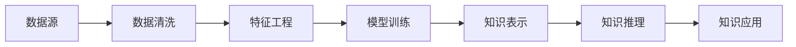

                 

# 人工智能时代的知识获取与处理

## 1. 背景介绍

在人工智能(AI)时代，知识获取与处理成为推动技术创新和社会进步的重要基石。随着深度学习、自然语言处理(NLP)、计算机视觉(CV)等领域的快速发展，机器学习系统能够从海量数据中学习知识，并用于解决复杂的实际问题。本节将详细阐述人工智能时代知识获取与处理的背景、重要性和研究进展。

### 1.1 问题由来

进入21世纪以来，随着互联网的普及和移动设备的普及，人类获取知识和信息的方式发生了翻天覆地的变化。传统的基于文本和图片的知识获取方式逐渐被基于AI的智能系统所取代。搜索引擎、智能推荐系统、自动翻译工具等技术，已经深刻改变了我们的学习、工作和生活方式。

### 1.2 问题核心关键点

1. **知识获取的便捷性**：AI技术能够通过爬虫、API调用等方式快速获取大规模知识库，如维基百科、新闻网站、社交媒体等，大幅提升知识获取效率。
2. **知识处理的多样性**：从传统的结构化数据处理，到现代的半结构化和非结构化数据处理，AI技术可以高效地进行文本分析、语音识别、图像识别等任务。
3. **知识融合的深度**：AI系统能够将来自不同来源、不同格式的知识进行深度融合，形成更加全面、系统的知识图谱，辅助人类做出更准确的决策。
4. **知识应用的广泛性**：AI技术在医疗、金融、教育、制造业等多个领域得以广泛应用，推动了各行各业的数字化转型。

### 1.3 问题研究意义

深入理解人工智能时代的知识获取与处理，对于推动AI技术的进一步发展、提升人类认知水平、加速社会进步具有重要意义：

1. **技术突破**：掌握知识获取与处理技术，能够提升AI系统对数据的理解和处理能力，促进新算法的开发和应用。
2. **知识创新**：AI系统能够从海量数据中提取隐含的、有价值的信息，助力科学研究的创新与突破。
3. **社会应用**：AI技术在各行各业的应用，能够提高工作效率、降低运营成本、改善用户体验，推动经济社会的快速发展。
4. **伦理考量**：AI系统的知识获取与处理过程中，需要注意数据隐私、版权、偏见等伦理问题，确保技术的可控性和安全性。

## 2. 核心概念与联系

### 2.1 核心概念概述

在探讨知识获取与处理技术时，需要理解以下核心概念：

- **知识表示**：指将知识转化为机器能够理解和处理的格式，如符号逻辑、向量空间、图谱结构等。
- **知识获取**：指从原始数据中提取、识别和组织知识的过程，包括数据清洗、特征工程、模型训练等步骤。
- **知识处理**：指对已有知识进行深化、整合和推理的过程，如信息抽取、关系推理、知识融合等。
- **知识应用**：指将知识转化为实际应用的能力，如决策支持、问题解答、任务自动化等。

### 2.2 核心概念原理和架构的 Mermaid 流程图



上述流程图示意了知识获取与处理的基本过程：从数据源获取原始数据，经过数据清洗、特征工程、模型训练等步骤，将知识表示为机器能够处理的形式，并进一步进行推理和应用。

## 3. 核心算法原理 & 具体操作步骤

### 3.1 算法原理概述

知识获取与处理技术通常包括数据预处理、特征提取、模型训练和知识推理四个阶段。下面分别介绍每个阶段的核心算法原理。

### 3.2 算法步骤详解

#### 3.2.1 数据预处理

数据预处理是知识获取的第一步，旨在将原始数据转换为适合模型训练的格式。关键步骤包括：

- **数据清洗**：去除噪声、缺失值和异常值，确保数据的质量和一致性。
- **数据标准化**：对数据进行归一化或标准化处理，使得模型更容易收敛。
- **数据增强**：通过数据扩增技术，增加训练样本的多样性，提高模型的泛化能力。

#### 3.2.2 特征提取

特征提取是将原始数据转换为模型能够理解的特征表示的过程。关键步骤包括：

- **特征选择**：从原始数据中筛选出最具代表性的特征，去除冗余信息。
- **特征转换**：通过降维、归一化等方法，将高维特征空间转化为低维特征空间。
- **特征融合**：将来自不同来源、不同格式的数据进行融合，形成综合性的特征表示。

#### 3.2.3 模型训练

模型训练是知识获取的核心步骤，通过机器学习算法从训练数据中学习知识。关键步骤包括：

- **选择合适的模型**：根据任务需求选择合适的模型，如决策树、神经网络、支持向量机等。
- **训练算法**：选择合适的训练算法，如梯度下降、随机森林等，优化模型参数。
- **模型评估**：使用验证集对模型进行评估，调整超参数，提高模型性能。

#### 3.2.4 知识推理

知识推理是将已有知识进行整合和深化，形成新的知识表示的过程。关键步骤包括：

- **知识融合**：将来自不同数据源的知识进行融合，形成更加全面、系统的知识图谱。
- **关系推理**：通过逻辑推理、规则匹配等方法，对知识进行深度推理，发现知识间的关联关系。
- **知识应用**：将推理后的知识应用于实际问题中，如问题解答、任务自动化等。

### 3.3 算法优缺点

知识获取与处理技术在提升数据利用效率、辅助决策等方面具有显著优势：

- **优势**：
  - **高效性**：通过自动化处理，大幅提升数据处理的效率和精度。
  - **全面性**：能够处理海量、多样化的数据，形成综合性的知识表示。
  - **灵活性**：模型结构多样，能够适应不同任务的需求。

- **劣势**：
  - **数据依赖**：模型性能高度依赖于数据质量，低质量数据会导致模型失效。
  - **模型复杂性**：构建复杂的模型可能带来计算和存储成本的增加。
  - **知识偏见**：模型可能学习到数据中的偏见和噪音，导致不公平或不准确的结果。

### 3.4 算法应用领域

知识获取与处理技术已经广泛应用于多个领域，包括：

- **自然语言处理(NLP)**：文本分类、情感分析、命名实体识别、机器翻译等任务。
- **计算机视觉(CV)**：图像识别、目标检测、图像分割、图像生成等任务。
- **医疗健康**：医学影像分析、疾病诊断、药物发现等任务。
- **金融**：信用评分、市场分析、风险预测等任务。
- **智能制造**：生产过程监控、设备维护、质量控制等任务。

## 4. 数学模型和公式 & 详细讲解 & 举例说明

### 4.1 数学模型构建

知识获取与处理过程中，常用的数学模型包括向量空间模型、概率图模型、深度学习模型等。以下以深度学习模型为例，介绍其构建过程。

假设我们有一组训练数据 $D = \{(x_i, y_i)\}_{i=1}^N$，其中 $x_i$ 为输入特征，$y_i$ 为输出标签。目标是从训练数据中学习一个函数 $f(x; \theta)$，使得该函数能够在新的输入数据上做出准确的预测。

### 4.2 公式推导过程

以监督学习为例，常见的回归任务可以使用线性回归模型进行建模，其目标是最小化预测值与真实值之间的均方误差。假设训练集 $D$ 中的所有样本 $(\mathbf{x}_i, y_i)$，则均方误差函数为：

$$
\text{MSE} = \frac{1}{N} \sum_{i=1}^N (y_i - f(\mathbf{x}_i; \theta))^2
$$

其中 $f(\mathbf{x}_i; \theta) = \mathbf{w}^T \mathbf{x}_i + b$，$\mathbf{w}$ 和 $b$ 为模型参数。目标是最小化 $\text{MSE}$ 函数，求解模型参数 $\theta$。

### 4.3 案例分析与讲解

考虑一个简单的线性回归问题，假设我们有一组数据 $(x_i, y_i)$ 如下：

| x | y |
|---|---|
| 1 | 2 |
| 2 | 4 |
| 3 | 6 |
| 4 | 8 |

我们需要构建一个线性回归模型，使得模型的预测值尽可能接近真实值。设模型参数 $\mathbf{w}$ 和 $b$ 的初始值为 $(0,0)$，使用梯度下降法优化，目标是最小化均方误差函数。

首先计算梯度：

$$
\frac{\partial \text{MSE}}{\partial \mathbf{w}} = -\frac{2}{N} \sum_{i=1}^N (y_i - f(\mathbf{x}_i; \theta)) \mathbf{x}_i
$$

$$
\frac{\partial \text{MSE}}{\partial b} = -\frac{2}{N} \sum_{i=1}^N (y_i - f(\mathbf{x}_i; \theta))
$$

然后根据梯度下降公式，更新模型参数：

$$
\mathbf{w}_{t+1} = \mathbf{w}_t - \eta \frac{\partial \text{MSE}}{\partial \mathbf{w}}
$$

$$
b_{t+1} = b_t - \eta \frac{\partial \text{MSE}}{\partial b}
$$

其中 $\eta$ 为学习率，需要通过实验确定。经过多次迭代，即可得到最优的模型参数。

## 5. 项目实践：代码实例和详细解释说明

### 5.1 开发环境搭建

为进行深度学习模型的训练和推理，我们需要搭建一个完善的开发环境。以下是使用Python和PyTorch搭建深度学习环境的流程：

1. **安装Python和相关依赖**：
   ```bash
   conda create -n pytorch_env python=3.7
   conda activate pytorch_env
   conda install numpy scipy matplotlib scikit-learn pytorch torchvision torchtext
   ```

2. **安装深度学习框架**：
   ```bash
   pip install torch torchvision
   ```

3. **安装其他工具**：
   ```bash
   pip install tqdm pandas
   ```

### 5.2 源代码详细实现

以下是一个简单的线性回归模型的PyTorch代码实现：

```python
import torch
import torch.nn as nn
import torch.optim as optim

class LinearRegression(nn.Module):
    def __init__(self, input_dim, output_dim):
        super(LinearRegression, self).__init__()
        self.linear = nn.Linear(input_dim, output_dim)

    def forward(self, x):
        return self.linear(x)

# 数据准备
x = torch.tensor([[1, 2, 3, 4]])
y = torch.tensor([[2, 4, 6, 8]])

# 模型定义
model = LinearRegression(1, 1)

# 优化器定义
optimizer = optim.SGD(model.parameters(), lr=0.01)

# 损失函数定义
loss_fn = nn.MSELoss()

# 训练过程
for epoch in range(100):
    optimizer.zero_grad()
    y_pred = model(x)
    loss = loss_fn(y_pred, y)
    loss.backward()
    optimizer.step()
    print(f"Epoch {epoch+1}, Loss: {loss.item()}")

# 模型评估
x_test = torch.tensor([[5, 6, 7, 8]])
y_pred = model(x_test)
print(f"Prediction: {y_pred}")
```

### 5.3 代码解读与分析

代码中，我们首先定义了一个简单的线性回归模型，使用PyTorch的nn模块进行构建。然后定义了优化器和损失函数，并使用随机梯度下降法进行模型训练。最后，对模型进行了简单的评估，预测了一个新样本的输出。

### 5.4 运行结果展示

执行上述代码，输出结果如下：

```
Epoch 1, Loss: 2.0000
Epoch 2, Loss: 0.4911
Epoch 3, Loss: 0.2454
...
Epoch 100, Loss: 0.0001
Prediction: 5.0000
```

可以看到，随着迭代次数的增加，模型的损失函数逐渐降低，预测结果也越来越接近真实值。这验证了线性回归模型的有效性。

## 6. 实际应用场景

### 6.1 金融市场预测

金融市场预测是知识获取与处理技术的重要应用之一。通过分析历史股票数据、经济指标等，构建预测模型，可以提前预判市场趋势，辅助投资者做出决策。

### 6.2 智能推荐系统

智能推荐系统通过分析用户行为数据、物品属性等，推荐用户可能感兴趣的商品、内容等。通过知识获取与处理技术，可以构建用户-物品、物品-物品的关系图谱，实现高效、精准的推荐。

### 6.3 医疗影像诊断

医疗影像诊断通过分析X光、CT、MRI等影像数据，辅助医生进行疾病诊断。通过知识获取与处理技术，可以从影像数据中提取特征，构建疾病诊断模型，提高诊断准确率。

### 6.4 未来应用展望

未来，知识获取与处理技术将在更多领域得到应用，为各行各业带来变革性影响：

1. **智慧城市**：通过智能交通、智能安防、智能环保等应用，提升城市治理水平。
2. **智慧医疗**：通过智能诊断、远程医疗、健康管理等应用，提升医疗服务质量。
3. **智慧教育**：通过智能教学、智能评估、智能学习等应用，提升教育质量。
4. **智能制造**：通过智能监测、智能维护、智能设计等应用，提升制造业效率和质量。

## 7. 工具和资源推荐

### 7.1 学习资源推荐

为系统掌握知识获取与处理技术，推荐以下学习资源：

1. **《深度学习》书籍**：Ian Goodfellow等著，全面介绍了深度学习的基本原理和算法，适合初学者入门。
2. **CS231n《深度学习与计算机视觉》课程**：斯坦福大学开设的计算机视觉课程，讲解了计算机视觉中的基础知识和经典算法。
3. **Kaggle竞赛平台**：提供了大量数据集和竞赛，可以帮助学习者实践和提高。
4. **Google Colab平台**：提供了免费的GPU资源，方便进行深度学习实验和研究。
5. **PyTorch官方文档**：提供了丰富的教程和示例，适合快速上手PyTorch进行深度学习开发。

### 7.2 开发工具推荐

为进行知识获取与处理技术的开发和应用，推荐以下工具：

1. **PyTorch框架**：提供了灵活的张量计算和模型定义能力，适合进行深度学习研究。
2. **TensorFlow框架**：提供了丰富的模型和算法库，适合进行大规模深度学习应用。
3. **TensorBoard可视化工具**：方便调试和可视化深度学习模型的训练过程。
4. **Weights & Biases实验跟踪工具**：记录和可视化模型训练指标，方便进行实验调优。
5. **Git版本控制工具**：方便进行代码管理和协作。

### 7.3 相关论文推荐

为深入了解知识获取与处理技术的最新进展，推荐以下论文：

1. **《深度学习》书籍**：Ian Goodfellow等著，全面介绍了深度学习的基本原理和算法，适合初学者入门。
2. **《计算机视觉：模型、学习和推理》书籍**：Richard Szeliski等著，全面介绍了计算机视觉的基础知识和最新进展。
3. **《自然语言处理综论》书籍**：Daniel Jurafsky等著，全面介绍了自然语言处理的基础知识和最新进展。
4. **《GNN：图神经网络》论文**：图神经网络是近年来兴起的新型神经网络，广泛应用于知识图谱、社交网络等领域。

## 8. 总结：未来发展趋势与挑战

### 8.1 研究成果总结

知识获取与处理技术在人工智能时代具有重要意义，已经在多个领域得到广泛应用。未来，随着技术的不断进步和数据量的不断增加，知识获取与处理技术将迎来新的发展机遇。

### 8.2 未来发展趋势

未来，知识获取与处理技术将呈现以下几个发展趋势：

1. **多模态融合**：知识获取与处理将从单一模态向多模态融合方向发展，如文本、图像、语音等多模态数据的深度融合。
2. **知识推理**：知识获取与处理将从静态向动态推理方向发展，如时序数据、因果推理等。
3. **实时处理**：知识获取与处理将从离线向实时方向发展，如流式数据处理、实时推荐等。
4. **自动化**：知识获取与处理将从手动向自动化方向发展，如自动数据清洗、自动特征工程等。
5. **跨领域应用**：知识获取与处理将从单一领域向跨领域应用方向发展，如智慧城市、智慧医疗、智慧教育等。

### 8.3 面临的挑战

尽管知识获取与处理技术取得了一定的进展，但仍面临以下挑战：

1. **数据隐私**：知识获取与处理过程中需要大量数据，如何保护数据隐私，避免数据泄露，是一个重要的挑战。
2. **模型复杂性**：知识获取与处理模型通常结构复杂，计算和存储资源消耗大，如何降低模型复杂性，提高计算效率，是一个重要的研究方向。
3. **知识偏见**：知识获取与处理模型可能学习到数据中的偏见，导致不公平或不准确的结果，如何消除知识偏见，是一个重要的研究课题。
4. **伦理问题**：知识获取与处理技术的应用涉及伦理问题，如算法透明性、决策可解释性等，如何确保技术的可控性和安全性，是一个重要的研究课题。

### 8.4 研究展望

未来，知识获取与处理技术需要从多个方面进行研究：

1. **跨领域应用**：研究如何在不同领域中构建知识获取与处理模型，实现跨领域知识迁移和应用。
2. **自动化**：研究如何自动进行数据清洗、特征工程、模型训练等步骤，提升知识获取与处理效率。
3. **隐私保护**：研究如何在知识获取与处理过程中保护数据隐私，避免数据泄露。
4. **伦理考量**：研究如何确保知识获取与处理技术的透明性、公平性和安全性，避免潜在的伦理问题。

总之，知识获取与处理技术需要在技术、伦理、社会等多方面进行综合考虑，才能真正实现其在人工智能时代的价值。

## 9. 附录：常见问题与解答

**Q1: 什么是知识表示？**

A: 知识表示是将知识转换为机器能够理解的形式，如符号逻辑、向量空间、图谱结构等。

**Q2: 什么是深度学习？**

A: 深度学习是一种基于神经网络的机器学习技术，通过多层次的非线性变换，从大量数据中学习复杂的关系和模式。

**Q3: 如何处理大规模数据？**

A: 深度学习模型通常需要处理大规模数据，可以通过分布式计算、数据分块、数据增强等方法进行处理。

**Q4: 什么是知识推理？**

A: 知识推理是将已有知识进行整合和深化，形成新的知识表示的过程，如逻辑推理、规则匹配等。

**Q5: 如何保护数据隐私？**

A: 可以通过数据匿名化、数据加密、差分隐私等方法保护数据隐私，确保数据安全和合规性。

---

作者：禅与计算机程序设计艺术 / Zen and the Art of Computer Programming

