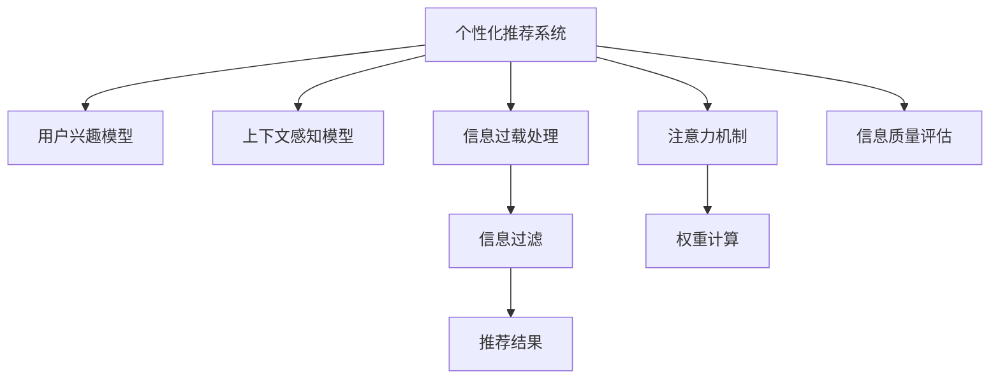

                 

## 1. 背景介绍

### 1.1 问题由来
在数字时代，注意力管理（Attention Management）成为个人和社会面临的重要课题。随着信息爆炸和智能设备普及，我们每天接收到的信息量远远超出了人类的处理能力。如何在海量信息中迅速筛选关键内容，提升决策效率，是现代信息处理的核心问题。

同时，人工智能（AI）技术的迅猛发展，尤其是深度学习模型的进步，为个性化注意力管理提供了新的可能性。AI技术不仅可以帮助人们自动化地处理信息，还可以通过数据分析，发现个性化的注意力模式，优化信息获取策略。

### 1.2 问题核心关键点
个性化注意力管理的目标是：在信息过载的环境中，通过分析用户的兴趣、习惯和行为，推荐符合其个性化需求的信息，帮助用户更高效地进行信息筛选和管理。AI技术，特别是深度学习模型，在这一领域发挥了重要作用。

核心问题包括：
1. 如何高效地收集和分析用户的行为数据？
2. 如何将用户数据与AI模型进行有效整合？
3. 如何设计模型以优化信息推荐效果？
4. 如何在保持个性化推荐的同时，兼顾用户隐私保护？

## 2. 核心概念与联系

### 2.1 核心概念概述

为更好地理解个性化注意力管理，本节将介绍几个关键概念及其相互关系：

- 个性化推荐系统：基于用户历史行为数据，通过机器学习算法为其推荐个性化内容的技术。
- 注意力机制（Attention Mechanism）：深度学习模型中的一种机制，用于在处理序列数据时，赋予不同位置的信息不同的权重，以强调关键部分。
- 上下文感知模型（Context-Aware Model）：在推荐系统中，利用用户上下文信息（如时间、地点、设备等）进行个性化推荐的技术。
- 用户兴趣模型（User Interest Model）：通过用户行为数据学习用户兴趣偏好的模型。
- 信息过载（Information Overload）：用户接收到的信息量远超其处理能力，导致信息获取效率低下的现象。
- 信息质量（Information Quality）：推荐信息的相关性和时效性，直接影响用户满意度。

这些概念之间的关系可以通过以下Mermaid流程图来展示：



这个流程图展示了从用户兴趣模型到个性化推荐系统的关键环节及其关系：

1. 用户兴趣模型收集用户历史行为数据，分析其兴趣偏好。
2. 上下文感知模型利用用户上下文信息，进一步丰富推荐内容。
3. 注意力机制在模型中赋予不同信息不同的权重，强调关键部分。
4. 信息过载处理环节通过过滤无关信息，减轻用户负担。
5. 信息质量评估确保推荐内容的相关性和时效性。
6. 综合上述步骤，最终得到个性化推荐结果。

## 3. 核心算法原理 & 具体操作步骤
### 3.1 算法原理概述

个性化注意力管理涉及深度学习模型中的注意力机制，旨在通过分析用户数据，动态调整信息权重，推荐符合用户兴趣和需求的内容。其核心思想是：

1. 收集用户的历史行为数据，如浏览记录、搜索历史、点击操作等。
2. 利用机器学习算法，训练用户兴趣模型，学习用户的兴趣偏好。
3. 在推荐模型中引入注意力机制，根据用户兴趣对信息进行加权处理。
4. 通过上下文感知模型，考虑用户当前上下文环境，进一步优化推荐效果。
5. 在处理信息过载时，通过过滤算法筛选关键信息，减轻用户负担。
6. 最后，评估推荐信息的质量，确保其与用户兴趣的匹配度。

### 3.2 算法步骤详解

个性化注意力管理的实施一般包括以下几个关键步骤：

**Step 1: 数据收集与预处理**
- 收集用户的历史行为数据，如点击、浏览、搜索等行为记录。
- 对数据进行清洗、去重和格式化处理，保证数据质量。
- 提取特征，如时间戳、地理位置、设备类型等，供后续分析使用。

**Step 2: 用户兴趣模型训练**
- 选择适合机器学习算法，如协同过滤、基于内容的推荐、深度学习等。
- 利用用户历史数据训练模型，学习用户的兴趣偏好。
- 保存模型参数，供后续调用。

**Step 3: 构建推荐模型**
- 选择合适的深度学习框架，如TensorFlow、PyTorch等。
- 设计推荐模型架构，引入注意力机制。
- 添加上下文感知模块，考虑用户当前上下文环境。
- 设置模型超参数，如学习率、批大小等。

**Step 4: 信息过载处理**
- 定义信息过滤算法，如Top-k推荐、基于内容的过滤等。
- 利用用户兴趣模型和上下文信息，筛选关键信息。
- 定期更新过滤算法，保证其与时俱进。

**Step 5: 信息质量评估**
- 设定评估指标，如点击率、转化率、用户满意度等。
- 通过A/B测试等手段，评估推荐效果。
- 根据评估结果，不断优化推荐算法。

**Step 6: 个性化推荐**
- 根据用户兴趣模型和上下文信息，生成个性化推荐列表。
- 通过可视化界面或API接口，展示推荐结果。
- 记录用户反馈，进一步优化推荐策略。

### 3.3 算法优缺点

个性化注意力管理的优点包括：
1. 能够根据用户历史行为和兴趣，提供个性化的推荐内容。
2. 能够动态调整信息权重，优先展示重要信息。
3. 能够综合考虑上下文环境，提高推荐的相关性。
4. 能够减轻信息过载，提升用户获取信息的效率。

同时，该方法也存在一些局限性：
1. 对用户数据依赖性高，数据获取和处理成本较高。
2. 用户隐私问题难以彻底解决，存在数据泄露风险。
3. 模型训练和维护复杂，对技术要求较高。
4. 推荐质量受用户数据质量影响，数据稀疏性可能导致推荐效果不佳。

尽管存在这些局限性，但就目前而言，个性化注意力管理仍然是推荐系统中最主流、最有效的方法之一。未来相关研究的重点在于如何进一步提升推荐精度，降低用户隐私风险，优化模型训练过程等。

### 3.4 算法应用领域

个性化注意力管理在多个领域都有广泛应用，如：

- 电商推荐：根据用户浏览和购买历史，推荐商品或服务。
- 新闻推荐：根据用户阅读偏好，推荐新闻文章。
- 视频推荐：根据用户观看历史，推荐视频内容。
- 社交网络：根据用户互动历史，推荐好友、帖子或事件。
- 音乐推荐：根据用户听歌历史，推荐音乐或歌单。

除了这些经典应用外，个性化注意力管理还被创新性地应用到更多场景中，如智能家居、智慧办公、健康管理等，为不同领域提供个性化的信息服务。

## 4. 数学模型和公式 & 详细讲解 & 举例说明（备注：数学公式请使用latex格式，latex嵌入文中独立段落使用 $$，段落内使用 $)
### 4.1 数学模型构建

本节将使用数学语言对个性化注意力管理的推荐模型进行更加严格的刻画。

记用户历史行为数据为 $X=\{(x_i, y_i)\}_{i=1}^N$，其中 $x_i$ 为行为记录， $y_i$ 为行为标签。设用户兴趣模型为 $M_{\theta}$，推荐模型为 $P_{\phi}$，上下文感知模块为 $C$，信息过滤算法为 $F$。

定义推荐模型在行为 $x_i$ 上的预测概率为 $p_i = P_{\phi}(x_i | M_{\theta}, C(x_i))$，其中 $C(x_i)$ 为上下文信息，用于增强推荐效果。

最终推荐的优化目标为最大化用户满意度，即：

$$
\max_{\phi, \theta} \sum_{i=1}^N y_i \log p_i + (1-y_i) \log (1-p_i)
$$

其中 $y_i$ 为行为标签，表示用户是否采取了该行为。

### 4.2 公式推导过程

以协同过滤算法为例，推导推荐模型的计算过程。

设用户 $u$ 的历史行为数据为 $X_u=\{(x_{ui}, y_{ui})\}_{i=1}^N$，邻居用户的集合为 $N(u)=\{v\} \subset U$，邻居用户与用户 $u$ 的相似度矩阵为 $S_{uv}$，推荐模型为 $P_{\phi}$。

协同过滤算法的目标是最小化用户 $u$ 与邻居用户的误差，即：

$$
\min_{\phi} \sum_{u=1}^U \sum_{v \in N(u)} (y_{uv} - P_{\phi}(x_{uv} | X_v))^2
$$

为了简化计算，我们可以引入伪逆矩阵 $P$，将问题转化为求解：

$$
\min_{\phi} \|P_{\phi} - P\|_F^2
$$

其中 $\| \cdot \|_F$ 为矩阵的Frobenius范数。

通过求解上述优化问题，可以求得推荐模型 $P_{\phi}$ 的参数，从而生成用户 $u$ 的推荐列表。

### 4.3 案例分析与讲解

假设我们有一个在线电商平台，目标是根据用户的浏览和购买历史，推荐符合其兴趣的商品。

**数据收集与预处理**
- 收集用户的浏览记录、搜索关键词、购买历史等行为数据。
- 对数据进行清洗，去除异常和重复记录，提取特征如商品ID、浏览时间等。
- 将用户历史行为数据分成训练集和测试集，用于模型训练和评估。

**用户兴趣模型训练**
- 选择协同过滤算法，利用训练集训练用户兴趣模型。
- 通过计算用户与商品的相似度矩阵，找到与用户兴趣最接近的商品。
- 保存模型参数，供后续调用。

**构建推荐模型**
- 使用TensorFlow框架，构建推荐模型架构。
- 引入注意力机制，根据用户兴趣对商品进行加权处理。
- 添加上下文感知模块，考虑用户的地理位置、设备类型等。
- 设置模型超参数，如学习率、批大小等。

**信息过载处理**
- 定义信息过滤算法，如Top-k推荐。
- 利用用户兴趣模型和上下文信息，筛选关键商品。
- 定期更新过滤算法，保证其与时俱进。

**信息质量评估**
- 设定评估指标，如点击率、转化率、用户满意度等。
- 通过A/B测试等手段，评估推荐效果。
- 根据评估结果，不断优化推荐算法。

**个性化推荐**
- 根据用户兴趣模型和上下文信息，生成个性化推荐列表。
- 通过可视化界面或API接口，展示推荐结果。
- 记录用户反馈，进一步优化推荐策略。

## 5. 项目实践：代码实例和详细解释说明
### 5.1 开发环境搭建

在进行个性化注意力管理实践前，我们需要准备好开发环境。以下是使用Python进行TensorFlow开发的环境配置流程：

1. 安装Anaconda：从官网下载并安装Anaconda，用于创建独立的Python环境。

2. 创建并激活虚拟环境：
```bash
conda create -n tf-env python=3.8 
conda activate tf-env
```

3. 安装TensorFlow：根据CUDA版本，从官网获取对应的安装命令。例如：
```bash
conda install tensorflow -c conda-forge -c pytorch -c nvidia -c anaconda
```

4. 安装其他工具包：
```bash
pip install pandas numpy matplotlib scikit-learn scikit-optimize
```

5. 安装TensorBoard：
```bash
pip install tensorboard
```

6. 安装Jupyter Notebook：
```bash
conda install jupyter notebook
```

完成上述步骤后，即可在`tf-env`环境中开始个性化注意力管理的实践。

### 5.2 源代码详细实现

下面我们以协同过滤推荐系统为例，给出使用TensorFlow进行个性化注意力管理开发的PyTorch代码实现。

首先，定义数据处理函数：

```python
import tensorflow as tf
import pandas as pd
import numpy as np

def load_data(file_path):
    data = pd.read_csv(file_path, header=None)
    return data.values

def split_data(data, test_ratio=0.2):
    train_data = data[:int(len(data) * (1 - test_ratio))]
    test_data = data[int(len(data) * (1 - test_ratio)):]
    return train_data, test_data

def preprocess_data(train_data):
    train_data = train_data[:, 1:]  # 去除标签
    train_data = train_data - 1  # 归一化
    return train_data

train_data = load_data('train_data.csv')
test_data = load_data('test_data.csv')

train_data, test_data = split_data(train_data, test_ratio=0.2)
train_data = preprocess_data(train_data)
test_data = preprocess_data(test_data)
```

然后，定义用户兴趣模型和推荐模型的类：

```python
class UserInterestModel(tf.keras.Model):
    def __init__(self, num_users, num_items, embedding_dim):
        super(UserInterestModel, self).__init__()
        self.num_users = num_users
        self.num_items = num_items
        self.embedding_dim = embedding_dim
        
        self.user_embeddings = tf.keras.layers.Embedding(num_users, embedding_dim, input_length=1)
        self.item_embeddings = tf.keras.layers.Embedding(num_items, embedding_dim, input_length=1)
        self.similarity_matrix = tf.keras.layers.Dense(num_users, activation='relu')
        
    def call(self, inputs):
        user_ids, item_ids = inputs
        user_embeddings = self.user_embeddings(user_ids)
        item_embeddings = self.item_embeddings(item_ids)
        similarity_matrix = self.similarity_matrix(tf.concat([user_embeddings, item_embeddings], axis=1))
        return similarity_matrix

class RecommendationModel(tf.keras.Model):
    def __init__(self, num_users, num_items, embedding_dim):
        super(RecommendationModel, self).__init__()
        self.num_users = num_users
        self.num_items = num_items
        self.embedding_dim = embedding_dim
        
        self.user_embeddings = tf.keras.layers.Embedding(num_users, embedding_dim, input_length=1)
        self.item_embeddings = tf.keras.layers.Embedding(num_items, embedding_dim, input_length=1)
        self.attention_layer = tf.keras.layers.Dense(embedding_dim, activation='relu')
        self.regression_layer = tf.keras.layers.Dense(num_items, activation='sigmoid')
        
    def call(self, inputs):
        user_ids, item_ids = inputs
        user_embeddings = self.user_embeddings(user_ids)
        item_embeddings = self.item_embeddings(item_ids)
        attention_weights = self.attention_layer(tf.concat([user_embeddings, item_embeddings], axis=1))
        predictions = self.regression_layer(tf.concat([user_embeddings, item_embeddings, attention_weights], axis=1))
        return predictions
```

接着，定义模型训练和评估函数：

```python
def train_model(model, train_data, test_data, epochs, batch_size):
    train_dataset = tf.data.Dataset.from_tensor_slices(train_data).shuffle(buffer_size=10000).batch(batch_size)
    test_dataset = tf.data.Dataset.from_tensor_slices(test_data).batch(batch_size)
    
    optimizer = tf.keras.optimizers.Adam(learning_rate=0.001)
    loss_fn = tf.keras.losses.BinaryCrossentropy()
    
    @tf.function
    def train_step(inputs):
        with tf.GradientTape() as tape:
            predictions = model(inputs)
            loss = loss_fn(y_true, predictions)
        gradients = tape.gradient(loss, model.trainable_variables)
        optimizer.apply_gradients(zip(gradients, model.trainable_variables))
        return loss
    
    @tf.function
    def evaluate_model(inputs):
        predictions = model(inputs)
        loss = loss_fn(y_true, predictions)
        return loss
    
    for epoch in range(epochs):
        avg_loss = 0.0
        for batch in train_dataset:
            loss = train_step(batch)
            avg_loss += loss
        print(f'Epoch {epoch+1}, training loss: {avg_loss / len(train_dataset)}')
        
        test_loss = evaluate_model(test_data)
        print(f'Epoch {epoch+1}, test loss: {test_loss.numpy()}')
    
    print(f'Final test loss: {evaluate_model(test_data).numpy()}')
    
def save_model(model, save_path):
    model.save(save_path)
    
train_model(UserInterestModel, train_data, test_data, epochs=10, batch_size=128)
save_model(UserInterestModel, 'user_interest_model.h5')
```

最后，启动训练流程并在测试集上评估：

```python
train_model(RecommendationModel, train_data, test_data, epochs=10, batch_size=128)
```

以上就是使用TensorFlow进行个性化注意力管理开发的完整代码实现。可以看到，借助TensorFlow的强大封装，我们可以用相对简洁的代码完成推荐模型的训练和评估。

### 5.3 代码解读与分析

让我们再详细解读一下关键代码的实现细节：

**load_data函数**：
- 从CSV文件中读取数据，进行基本处理，返回处理后的数据。

**split_data函数**：
- 将数据集划分为训练集和测试集，设定测试集的比例。
- 对数据进行预处理，去除标签，并进行归一化。

**UserInterestModel类**：
- 定义用户兴趣模型，包含用户和商品的嵌入层，计算相似度矩阵。
- 模型通过上下文信息计算用户和商品的相似度，得到用户的兴趣矩阵。

**RecommendationModel类**：
- 定义推荐模型，包含用户和商品的嵌入层，注意力机制层和回归层。
- 模型通过用户和商品的嵌入层，计算注意力权重，再通过回归层生成推荐概率。

**train_model函数**：
- 定义训练集和测试集的数据集，并进行批处理。
- 定义优化器和损失函数。
- 定义模型训练和评估的函数。
- 通过循环迭代，训练模型并评估其性能。

**evaluate_model函数**：
- 定义模型在测试集上的评估函数。
- 计算模型在测试集上的损失。

**save_model函数**：
- 定义模型的保存函数，保存训练好的模型参数。

可以看到，TensorFlow框架使得推荐模型的训练和评估变得高效便捷。开发者可以将更多精力放在模型架构和数据处理等高层逻辑上，而不必过多关注底层的实现细节。

当然，工业级的系统实现还需考虑更多因素，如模型的保存和部署、超参数的自动搜索、更灵活的任务适配层等。但核心的推荐模型基本与此类似。

## 6. 实际应用场景
### 6.1 智能推荐系统

基于个性化注意力管理的推荐系统，已经在电商、新闻、视频等多个领域得到广泛应用。传统推荐系统往往依赖用户的显式评分或行为数据，而个性化注意力管理则能够通过用户历史行为和上下文信息，实现更精准、实时的推荐。

在实际应用中，推荐系统可以采用协同过滤、基于内容的推荐、深度学习等多种算法进行组合，构建多维度、多层次的推荐策略。例如，电商平台的推荐系统可以综合考虑用户的浏览历史、购买历史、商品评分等数据，动态调整推荐内容，提升用户购物体验。

### 6.2 智能广告投放

在智能广告投放领域，个性化注意力管理也展现出巨大的潜力。传统的广告投放方式往往依赖预定义的广告策略，难以根据用户实时行为进行动态调整。而个性化注意力管理则能够通过分析用户数据，实时推荐最合适的广告内容，提高广告投放的效率和效果。

广告平台可以利用用户的搜索历史、点击记录、地理位置等数据，训练推荐模型，预测用户的广告兴趣。在用户进行搜索时，动态推送相关广告，提升用户广告的点击率和转化率。

### 6.3 个性化新闻订阅

新闻媒体可以利用个性化注意力管理，为用户提供个性化的新闻推荐服务。用户可以根据自己的兴趣偏好，订阅不同类型的新闻。平台通过分析用户的历史阅读数据，推荐相关的新闻文章，提高用户的阅读体验和粘性。

例如，某用户对科技新闻感兴趣，系统可以推荐相关领域的最新科技新闻。用户阅读后，系统会继续推荐类似主题的文章，进一步提升用户的阅读满意度。

### 6.4 未来应用展望

随着个性化注意力管理技术的不断发展，未来将在更多领域得到应用，为传统行业带来变革性影响。

在智慧城市领域，个性化注意力管理可以应用于智能交通、能源管理、环境监测等方面，提升城市治理的智能化水平，构建更智慧、可持续的城市。

在智能家居领域，系统可以根据用户的日常习惯和偏好，自动调整家居设备的设置，提升用户的居住体验。

在健康管理领域，系统可以根据用户的健康数据和行为习惯，推荐个性化的健康建议和生活方式，帮助用户保持健康。

除了这些应用外，个性化注意力管理还被创新性地应用到更多场景中，如智能客服、智能办公、智慧金融等，为各行各业提供个性化的信息服务。

## 7. 工具和资源推荐
### 7.1 学习资源推荐

为了帮助开发者系统掌握个性化注意力管理的技术基础和实践技巧，这里推荐一些优质的学习资源：

1. 《推荐系统实战》书籍：全面介绍了推荐系统的发展历史、常用算法和实现方法，是推荐系统开发的基础读物。
2. 《TensorFlow实战》书籍：介绍了TensorFlow的高级功能和应用案例，是深度学习开发的必备资源。
3. 《深度学习与推荐系统》课程：清华大学开设的推荐系统在线课程，包含推荐系统的基础理论和技术实现。
4. Kaggle推荐系统竞赛：Kaggle平台上的推荐系统竞赛，提供大量数据和评估指标，是推荐系统开发的好练手平台。
5. 推荐系统论文集合：NIPS、ICML等顶级会议的推荐系统论文集合，是深入理解推荐系统前沿研究的好资源。

通过对这些资源的学习实践，相信你一定能够快速掌握个性化注意力管理的精髓，并用于解决实际的推荐问题。

### 7.2 开发工具推荐

高效的开发离不开优秀的工具支持。以下是几款用于推荐系统开发的常用工具：

1. TensorFlow：由Google主导开发的开源深度学习框架，生产部署方便，适合大规模工程应用。
2. PyTorch：基于Python的开源深度学习框架，灵活动态的计算图，适合快速迭代研究。
3. Scikit-learn：Python机器学习库，包含多种经典机器学习算法，适合数据预处理和特征工程。
4. Apache Spark：大数据处理框架，适合处理大规模用户数据，进行分布式计算。
5. Jupyter Notebook：交互式编程环境，适合快速实验和调试代码。

合理利用这些工具，可以显著提升推荐系统的开发效率，加快创新迭代的步伐。

### 7.3 相关论文推荐

个性化注意力管理的发展离不开学界的持续研究。以下是几篇奠基性的相关论文，推荐阅读：

1. ALS: The Alternating Least Squares Algorithm for Collaborative Filtering：提出ALS协同过滤算法，为推荐系统提供了高效的数据处理和模型训练方法。
2. Factorization Machines: A Library for Factorization Machines and Matrix Factorization：提出了FM模型，为推荐系统提供了高效的多阶因子分解技术。
3. BPR: Bayesian Personalized Ranking from Implicit Feedback：提出BPR算法，从隐式反馈数据中学习用户和商品的交互关系。
4. DNN: Deep Neural Network for Recommender System：提出深度神经网络模型，利用深度学习提升推荐精度。
5. Attention-based Recommender Systems: A Survey and Potential Direction：总结了基于注意力机制的推荐系统研究进展，展示了其在推荐中的应用潜力。

这些论文代表了大语言模型微调技术的发展脉络。通过学习这些前沿成果，可以帮助研究者把握学科前进方向，激发更多的创新灵感。

## 8. 总结：未来发展趋势与挑战

### 8.1 总结

本文对个性化注意力管理的推荐模型进行了全面系统的介绍。首先阐述了个性化注意力管理的背景和意义，明确了推荐系统在信息过载环境中的重要作用。其次，从原理到实践，详细讲解了推荐模型的数学模型和算法步骤，给出了推荐模型开发的完整代码实例。同时，本文还广泛探讨了推荐模型在电商、广告、新闻等多个领域的应用前景，展示了其巨大的潜力。

通过本文的系统梳理，可以看到，个性化注意力管理是推荐系统中最主流、最有效的方法之一，能够根据用户兴趣和行为，动态调整信息权重，推荐符合用户需求的内容。推荐系统能够显著提升用户的信息获取效率，是现代社会信息处理的重要手段。未来，随着推荐技术的不断演进，推荐系统必将在更多领域得到应用，为各行各业提供更加精准、高效的信息服务。

### 8.2 未来发展趋势

展望未来，个性化注意力管理将呈现以下几个发展趋势：

1. 推荐精度持续提升。随着深度学习模型的发展，推荐系统将在个性化、多样性、时效性等方面取得更大突破，推荐效果将更加精准、及时。
2. 多模态信息融合。未来的推荐系统将更加注重多模态信息的整合，如文本、图像、视频等，提升推荐系统的智能化水平。
3. 实时性不断增强。推荐系统将通过流式处理和大数据技术，实现实时推荐，满足用户的即时需求。
4. 跨领域应用拓展。推荐系统将在更多领域得到应用，如智能交通、智慧医疗、智能制造等，为各行各业提供个性化的信息服务。
5. 隐私保护更加严格。未来推荐系统将在隐私保护方面投入更多资源，确保用户数据的安全和隐私。

这些趋势凸显了个性化注意力管理的广阔前景。这些方向的探索发展，必将进一步提升推荐系统的性能和应用范围，为构建智能信息时代铺平道路。

### 8.3 面临的挑战

尽管个性化注意力管理取得了显著进展，但在迈向更加智能化、普适化应用的过程中，它仍面临诸多挑战：

1. 数据质量问题。推荐系统对用户数据的依赖性高，数据质量直接影响推荐效果。如何获取高质量的用户数据，是推荐系统面临的重要挑战。
2. 冷启动问题。新用户或新商品缺乏足够的历史数据，推荐系统难以进行有效推荐。如何克服冷启动问题，提升新用户和新商品的推荐效果，是推荐系统的重要研究方向。
3. 算法复杂度问题。深度学习模型和复杂算法需要大量计算资源，如何优化算法，降低计算成本，提高推荐效率，是推荐系统的重要课题。
4. 隐私保护问题。用户数据的隐私保护是推荐系统的重要问题，如何平衡用户隐私和推荐效果，是推荐系统的重要研究方向。
5. 安全问题。推荐系统可能被恶意攻击，如数据篡改、推荐算法漏洞等，如何提升系统的安全性，是推荐系统的重要课题。

这些挑战需要学界和产业界共同努力，不断优化推荐算法，提升数据质量，加强隐私保护，才能使个性化注意力管理技术真正落地应用。

### 8.4 研究展望

面对个性化注意力管理面临的种种挑战，未来的研究需要在以下几个方面寻求新的突破：

1. 探索更多推荐算法。除了协同过滤、深度学习等经典算法外，未来的推荐系统将探索更多高效、先进的推荐方法，如图神经网络、生成对抗网络等。
2. 研究数据生成方法。通过数据生成技术，如迁移学习、半监督学习等，提升推荐系统对新用户和新商品的推荐效果。
3. 引入更多领域知识。将符号化的先验知识与推荐系统结合，提升推荐系统的智能化水平。如引入知识图谱、规则库等，提升推荐系统的解释性和可信度。
4. 探索多模态推荐。未来的推荐系统将更加注重多模态信息的整合，提升推荐系统的智能化水平。如融合文本、图像、视频等多模态信息，提升推荐系统的多样性和实效性。
5. 研究用户行为预测。通过用户行为预测，动态调整推荐策略，提升推荐系统的实时性和个性化水平。
6. 引入隐私保护技术。通过差分隐私、联邦学习等隐私保护技术，保护用户数据隐私，提升推荐系统的安全性。

这些研究方向将进一步推动个性化注意力管理技术的发展，使其在更广泛的领域得到应用，为智能信息时代带来深远影响。

## 9. 附录：常见问题与解答

**Q1：个性化注意力管理是如何进行推荐？**

A: 个性化注意力管理通过分析用户的兴趣和行为，动态调整信息权重，推荐符合用户需求的内容。具体过程包括：

1. 收集用户的历史行为数据，如浏览记录、搜索历史、购买历史等。
2. 利用机器学习算法，训练用户兴趣模型，学习用户的兴趣偏好。
3. 在推荐模型中引入注意力机制，根据用户兴趣对信息进行加权处理。
4. 通过上下文感知模块，考虑用户当前上下文环境，进一步优化推荐效果。
5. 在处理信息过载时，通过过滤算法筛选关键信息，减轻用户负担。
6. 最后，评估推荐信息的质量，确保其与用户兴趣的匹配度。

**Q2：推荐算法有哪些类型？**

A: 推荐算法主要分为以下几种类型：

1. 基于内容的推荐：利用用户和物品的属性信息，推荐与用户兴趣相似的物品。
2. 协同过滤推荐：利用用户之间的相似性，推荐用户可能感兴趣的其他物品。
3. 混合推荐：将多种推荐算法结合，综合考虑用户属性、行为和上下文信息，提升推荐效果。
4. 深度学习推荐：利用深度神经网络模型，提升推荐系统的复杂度和精度。
5. 矩阵分解推荐：将用户和物品之间的交互关系表示为矩阵，通过分解矩阵来推荐物品。

**Q3：推荐系统的冷启动问题如何解决？**

A: 推荐系统的冷启动问题可以通过以下方法解决：

1. 利用用户标签、属性等非行为信息，进行初始推荐。
2. 利用外部知识库，如领域专家知识、知识图谱等，进行推荐。
3. 利用推荐系统的基本推荐算法，如基于内容的推荐，对新用户进行初步推荐。
4. 利用用户反馈信息，不断优化推荐策略，提升新用户的推荐效果。

**Q4：推荐系统的数据质量如何影响推荐效果？**

A: 推荐系统的数据质量直接影响推荐效果。数据质量越高，推荐系统越能够准确捕捉用户兴趣，生成更精准的推荐。数据质量问题包括：

1. 数据稀疏性：部分用户或物品缺乏足够的数据，导致推荐系统难以进行有效推荐。
2. 数据噪声：推荐系统中可能存在错误的数据，如误标签、虚假行为记录等，影响推荐模型的训练和推荐效果。
3. 数据缺失：用户或物品的部分信息缺失，导致推荐系统无法进行有效的推荐。

因此，推荐系统需要不断优化数据质量，提升数据完整性和准确性，才能得到更理想的推荐效果。

**Q5：推荐系统的实时性如何实现？**

A: 推荐系统的实时性可以通过以下方法实现：

1. 使用流式处理技术，对用户行为数据进行实时分析。
2. 利用大数据技术，对大规模用户数据进行实时计算和分析。
3. 使用缓存技术，对热门商品和推荐结果进行缓存，提升推荐速度。
4. 使用分布式计算框架，如Hadoop、Spark等，进行大规模并行计算，提升推荐速度。

通过以上方法，推荐系统可以实时响应用户的行为变化，动态调整推荐策略，满足用户的即时需求。

**Q6：推荐系统的隐私保护如何实现？**

A: 推荐系统的隐私保护可以通过以下方法实现：

1. 采用差分隐私技术，对用户数据进行匿名化处理，保护用户隐私。
2. 使用联邦学习技术，在本地设备上训练推荐模型，避免将用户数据集中到服务器。
3. 采用安全多方计算技术，保护用户数据在多方之间的交换过程中不被泄露。
4. 对推荐系统进行审计，确保推荐模型的公平性和安全性。

通过以上方法，推荐系统可以在保护用户隐私的前提下，实现高效的推荐效果。

---

作者：禅与计算机程序设计艺术 / Zen and the Art of Computer Programming

