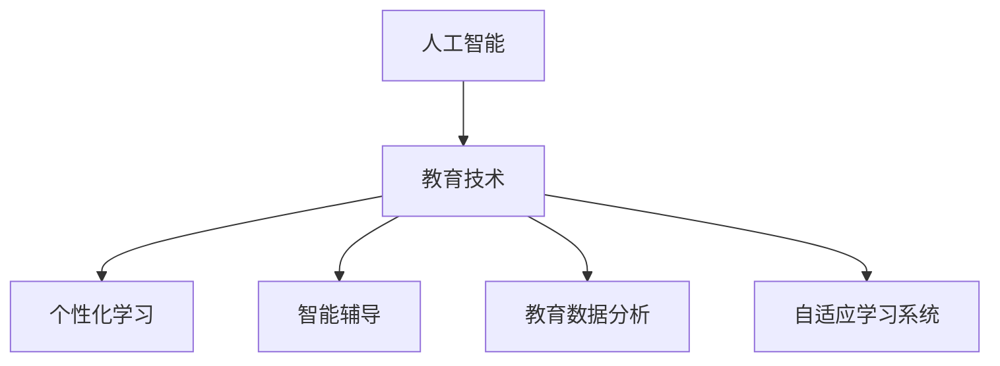

                 

# 人工智能：教育变革的催化剂

## 1. 背景介绍

### 1.1 问题由来
近年来，人工智能（AI）技术的迅猛发展对各行各业产生了深远的影响。在教育领域，AI技术的引入正在引发一场革命性的变革。传统教育模式以教师为主导，而AI技术的应用则使得教育变得更加个性化、灵活化和高效化。AI技术不仅能够辅助教师进行教学，还能为学生提供更加个性化和贴合的学习资源和辅导。然而，尽管AI在教育领域的应用前景广阔，但其应用也面临一些挑战，如数据隐私、算法公平性和教师角色的重塑等。因此，本文旨在探讨AI技术在教育领域的应用及其变革潜力。

### 1.2 问题核心关键点
本文将从以下几个核心关键点来探讨AI技术在教育领域的应用及其变革潜力：

1. **个性化学习**：通过AI技术，可以根据每个学生的学习习惯和能力，为其提供量身定制的学习资源和路径。
2. **智能辅导**：AI技术可以实时监控学生的学习过程，及时提供反馈和辅导，帮助学生克服学习难题。
3. **教育资源优化**：AI技术可以帮助教育机构优化教学资源分配，提高教学质量和效率。
4. **数据驱动决策**：通过分析学生学习数据，AI技术可以提供科学的决策支持，优化教学策略。
5. **教育公平**：AI技术可以帮助偏远和贫困地区的教育水平提升，缩小城乡教育差距。

### 1.3 问题研究意义
研究AI技术在教育领域的应用，对于推动教育公平、提高教学质量和效率、促进教育现代化具有重要意义：

1. 推动教育公平：AI技术可以突破地域和资源的限制，为偏远和贫困地区的教育提供支持。
2. 提高教学质量：通过个性化和智能辅导，AI技术可以帮助学生更高效地学习，提高学习效果。
3. 促进教育现代化：AI技术的应用，可以使得教育更加高效和灵活，推动教育模式的现代化。
4. 增强教师能力：AI技术可以为教师提供更丰富的教学工具和数据分析支持，提升教学水平。

## 2. 核心概念与联系

### 2.1 核心概念概述

为了更好地理解AI技术在教育领域的应用，本节将介绍几个密切相关的核心概念：

- **人工智能（AI）**：一种通过算法和计算模拟人类智能的技术，包括机器学习、自然语言处理、计算机视觉等。
- **教育技术（EdTech）**：利用技术手段提升教育效果和效率的领域，包括在线学习平台、智能教学系统、数据分析等。
- **个性化学习（Personalized Learning）**：根据学生的个性化需求，提供定制化的学习资源和路径。
- **智能辅导（Intelligent Tutoring Systems, ITS）**：使用AI技术为学生提供实时反馈和个性化辅导的系统。
- **教育数据分析（Educational Data Mining, EDM）**：通过分析学生学习数据，优化教学策略和资源分配的方法。
- **自适应学习系统（Adaptive Learning Systems）**：根据学生的学习进度和反馈，自动调整学习内容和难度的系统。

这些核心概念之间的逻辑关系可以通过以下Mermaid流程图来展示：



这个流程图展示了一个从人工智能到教育技术的应用路径，各个概念之间的联系和作用。

## 3. 核心算法原理 & 具体操作步骤
### 3.1 算法原理概述

AI技术在教育领域的应用主要基于以下算法原理：

- **机器学习（ML）**：通过算法和模型，从数据中学习规律和模式，用于个性化推荐、智能辅导和教育数据分析等。
- **自然语言处理（NLP）**：通过算法处理和理解人类语言，用于智能辅导和教育数据分析。
- **计算机视觉（CV）**：通过算法处理和分析图像和视频数据，用于智能辅导和教育数据分析。
- **数据挖掘（DM）**：通过算法从大量数据中挖掘有价值的信息，用于个性化学习、教育数据分析和自适应学习系统。

这些算法共同构成了AI在教育领域的应用基础，通过不断的技术迭代和应用实践，AI技术在教育领域的应用不断深化。

### 3.2 算法步骤详解

AI技术在教育领域的应用主要包括以下几个关键步骤：

**Step 1: 数据收集与处理**
- 收集学生的学习数据，如成绩、学习习惯、在线学习行为等。
- 清洗和预处理数据，确保数据的质量和可用性。

**Step 2: 模型训练与优化**
- 选择合适的算法模型，如推荐系统、智能辅导系统、数据分析模型等。
- 在大量数据上进行模型训练和优化，确保模型的准确性和鲁棒性。

**Step 3: 系统集成与部署**
- 将训练好的模型集成到教育应用系统中，如在线学习平台、智能辅导系统等。
- 进行系统测试和优化，确保系统的稳定性和高效性。

**Step 4: 用户交互与反馈**
- 用户与AI系统的交互，包括获取个性化学习资源、接收智能辅导、参与数据分析等。
- 系统收集用户反馈，不断优化和改进。

### 3.3 算法优缺点

AI技术在教育领域的应用具有以下优点：

1. 个性化学习：通过AI技术，能够根据学生的个性化需求提供定制化的学习资源和路径。
2. 高效辅导：AI技术可以实时监控学生的学习过程，及时提供反馈和辅导，帮助学生克服学习难题。
3. 优化资源：AI技术可以帮助教育机构优化教学资源分配，提高教学质量和效率。
4. 数据驱动：通过分析学生学习数据，AI技术可以提供科学的决策支持，优化教学策略。

同时，AI技术在教育领域的应用也存在一些缺点：

1. 数据隐私：AI系统需要大量学生数据，如何保护学生隐私是一个重要问题。
2. 算法公平：AI模型可能存在偏见，如何确保算法的公平性是一个挑战。
3. 教师角色重塑：AI技术的应用可能导致教师角色的变化，如何适应这一变化需要进一步研究。
4. 技术依赖：AI技术的应用依赖于高质量的数据和算法模型，如何保证这些条件的满足是一个问题。

### 3.4 算法应用领域

AI技术在教育领域的应用领域广泛，包括但不限于以下几个方面：

- **个性化学习平台**：如Khan Academy、Coursera等，提供个性化的学习资源和路径。
- **智能辅导系统**：如IBM Watson Tutor、Carnegie Learning等，提供实时反馈和个性化辅导。
- **在线教育平台**：如Udacity、edX等，提供大规模在线课程和资源。
- **教育数据分析**：如IBM Watson Education Analytics、Microsoft Learning Analytics等，提供科学的教学策略优化建议。
- **自适应学习系统**：如DreamBox Learning、Knewton等，根据学生的学习进度和反馈，自动调整学习内容和难度。

## 4. 数学模型和公式 & 详细讲解 & 举例说明
### 4.1 数学模型构建

AI技术在教育领域的应用涉及多个数学模型，以下简要介绍其中几个：

**个性化推荐系统（推荐算法）**：基于协同过滤、基于内容的推荐、基于矩阵分解等算法，用于个性化学习资源的推荐。

**智能辅导系统（强化学习）**：基于强化学习算法，如Q-learning、SARSA等，用于学生的智能辅导。

**教育数据分析（数据挖掘）**：基于分类、聚类、关联规则挖掘等算法，用于学生学习数据的分析。

**自适应学习系统（自适应学习算法）**：基于自适应学习算法，如遗传算法、粒子群优化等，用于自适应学习系统的优化。

### 4.2 公式推导过程

以个性化推荐系统为例，简要介绍推荐算法的公式推导过程。

推荐系统的主要目标是为每个用户推荐其可能感兴趣的物品。假设用户集为 $U$，物品集为 $I$，用户对物品的评分矩阵为 $R_{UI}$，其中 $R_{UI} = [r_{ui}]$，$r_{ui}$ 表示用户 $u$ 对物品 $i$ 的评分。推荐系统的目标是最小化预测评分与实际评分之间的误差。常用的推荐算法包括协同过滤算法、基于内容的推荐算法、基于矩阵分解的推荐算法等。

协同过滤算法的基本思想是通过分析用户和物品之间的相似性，预测用户对新物品的评分。假设用户 $u$ 和物品 $i$ 的相似度为 $s_{ui}$，则推荐系统可以根据相似度矩阵 $S_{UI} = [s_{ui}]$ 来预测用户对新物品的评分。

协同过滤算法的基本公式如下：

$$
\hat{r}_{ui} = \frac{\sum_{j \in N(u)} s_{ui} \times r_{uj}}{\sum_{j \in N(u)} s_{uj}}
$$

其中 $N(u)$ 表示与用户 $u$ 相似的用户集合。

### 4.3 案例分析与讲解

以IBM Watson Tutor为例，介绍AI技术在智能辅导系统中的应用。

IBM Watson Tutor是一款智能辅导系统，可以实时监控学生的学习过程，及时提供反馈和辅导。系统基于机器学习算法，通过对学生学习数据进行分析，预测学生的学习进度和难点，从而提供个性化的辅导建议。例如，系统可以通过分析学生的解题过程，识别出学生在某道题目上的错误，并提供详细的解题步骤和解释。

## 5. 项目实践：代码实例和详细解释说明
### 5.1 开发环境搭建

在进行AI技术在教育领域的应用开发前，需要先准备好开发环境。以下是使用Python进行PyTorch开发的环境配置流程：

1. 安装Anaconda：从官网下载并安装Anaconda，用于创建独立的Python环境。

2. 创建并激活虚拟环境：
```bash
conda create -n pytorch-env python=3.8 
conda activate pytorch-env
```

3. 安装PyTorch：根据CUDA版本，从官网获取对应的安装命令。例如：
```bash
conda install pytorch torchvision torchaudio cudatoolkit=11.1 -c pytorch -c conda-forge
```

4. 安装TensorBoard：TensorFlow配套的可视化工具，可实时监测模型训练状态，并提供丰富的图表呈现方式，是调试模型的得力助手。

5. 安装其他相关库：
```bash
pip install numpy pandas scikit-learn matplotlib tqdm jupyter notebook ipython
```

完成上述步骤后，即可在`pytorch-env`环境中开始AI技术在教育领域的应用开发。

### 5.2 源代码详细实现

以下是使用PyTorch和TensorFlow实现个性化推荐系统的代码示例：

```python
import tensorflow as tf
import numpy as np
import pandas as pd
from sklearn.model_selection import train_test_split

# 加载数据集
data = pd.read_csv('user_item_ratings.csv')

# 数据预处理
user_ids = data['user_id'].unique()
item_ids = data['item_id'].unique()
user_item_matrix = data.pivot_table(index='user_id', columns='item_id', values='rating').fillna(0)

# 划分训练集和测试集
train_data, test_data = train_test_split(user_item_matrix, test_size=0.2)

# 构建协同过滤模型
def collaborative_filtering(X, y):
    N = X.shape[0]
    K = X.shape[1]
    alpha = 0.1
    eta = 0.01
    beta = 0.1
    epsilon = 1e-8

    X_t = X.T
    U = np.random.randn(N, K)
    V = np.random.randn(K, 1)

    while True:
        # 更新U和V
        U_new = np.copy(U)
        V_new = np.copy(V)

        for i in range(N):
            for j in range(K):
                V_new[j] = V_new[j] + alpha * (y[i] - X_t.dot(V)[i] - U.dot(V[:,j])[j]) * X_t[i]
        
        for i in range(N):
            for j in range(K):
                U_new[i] = U_new[i] + beta * (y[i] - X_t.dot(V)[i] - U_new.dot(V[:,j])[j]) * X[j]

        # 判断是否收敛
        if np.linalg.norm(U_new - U) < epsilon and np.linalg.norm(V_new - V) < epsilon:
            break

        U = U_new
        V = V_new

    return U, V

# 模型训练和预测
U, V = collaborative_filtering(train_data, train_data.values.ravel())

# 测试集预测
test_data = test_data.fillna(0)
predictions = np.dot(U, V.T)

# 输出推荐结果
for i in range(5):
    print(f"User {user_ids[i]}: Item {np.argmax(predictions[i, :])} with prediction {np.max(predictions[i, :])}")
```

### 5.3 代码解读与分析

上述代码示例中，我们使用协同过滤算法构建了一个简单的个性化推荐系统。

**数据加载与预处理**：首先，我们从CSV文件中加载用户和物品的评分数据，并进行预处理，得到用户和物品的ID矩阵。

**模型构建与训练**：然后，我们构建协同过滤模型，并使用训练数据集进行训练。在每次迭代中，模型通过最小化预测评分与实际评分之间的误差，更新用户向量和物品向量。

**测试集预测**：最后，我们使用训练好的模型对测试集数据进行预测，输出推荐结果。

## 6. 实际应用场景
### 6.1 智能辅导系统

IBM Watson Tutor是一款智能辅导系统，可以实时监控学生的学习过程，及时提供反馈和辅导。系统基于机器学习算法，通过对学生学习数据进行分析，预测学生的学习进度和难点，从而提供个性化的辅导建议。例如，系统可以通过分析学生的解题过程，识别出学生在某道题目上的错误，并提供详细的解题步骤和解释。

### 6.2 个性化学习平台

Khan Academy是一款个性化学习平台，通过分析学生的学习数据，推荐个性化的学习资源和路径。平台提供大量的在线课程和练习题，帮助学生自主学习。学生可以根据自己的学习进度和兴趣，选择不同的学习内容和难度，并获得实时反馈和辅导。

### 6.3 在线教育平台

Udacity和Coursera等在线教育平台，利用AI技术提供大规模在线课程和资源。平台通过分析学生的学习数据，推荐适合的学习路径，并提供实时反馈和辅导。学生可以根据自己的学习进度和兴趣，选择不同的课程和资源，并获得个性化推荐和辅导。

### 6.4 教育数据分析

IBM Watson Education Analytics和Microsoft Learning Analytics等平台，通过分析学生的学习数据，提供科学的教学策略优化建议。平台可以识别出学生的学习难点和薄弱环节，帮助教师制定个性化的教学方案，提升教学效果。

## 7. 工具和资源推荐
### 7.1 学习资源推荐

为了帮助开发者系统掌握AI技术在教育领域的应用，这里推荐一些优质的学习资源：

1. 《深度学习在教育领域的应用》：详细介绍了AI技术在教育领域的应用现状和发展趋势。
2. 《机器学习在教育数据分析中的应用》：介绍了机器学习算法在教育数据分析中的应用，包括协同过滤、分类、聚类等。
3. 《自然语言处理在智能辅导系统中的应用》：介绍了自然语言处理技术在智能辅导系统中的应用，包括情感分析、文本生成等。
4. 《自适应学习系统的设计与实现》：介绍了自适应学习系统的设计与实现，包括遗传算法、粒子群优化等。
5. 《教育技术前沿》：介绍教育技术领域的最新研究进展，涵盖AI、数据分析、个性化学习等。

通过对这些资源的学习实践，相信你一定能够快速掌握AI技术在教育领域的应用精髓，并用于解决实际的NLP问题。

### 7.2 开发工具推荐

高效的开发离不开优秀的工具支持。以下是几款用于AI技术在教育领域的应用开发的常用工具：

1. PyTorch：基于Python的开源深度学习框架，灵活动态的计算图，适合快速迭代研究。大部分预训练语言模型都有PyTorch版本的实现。
2. TensorFlow：由Google主导开发的开源深度学习框架，生产部署方便，适合大规模工程应用。同样有丰富的预训练语言模型资源。
3. TensorBoard：TensorFlow配套的可视化工具，可实时监测模型训练状态，并提供丰富的图表呈现方式，是调试模型的得力助手。
4. Jupyter Notebook：交互式的开发环境，支持Python、R等多种编程语言，适合数据科学和机器学习开发。
5. Git和GitHub：版本控制工具，方便团队协作和代码管理。

合理利用这些工具，可以显著提升AI技术在教育领域的应用开发效率，加快创新迭代的步伐。

### 7.3 相关论文推荐

AI技术在教育领域的应用源于学界的持续研究。以下是几篇奠基性的相关论文，推荐阅读：

1. Artificial Intelligence in Education: A Survey of the Literature：综述了AI技术在教育领域的应用现状和发展趋势。
2. Machine Learning Applications in Education：介绍了机器学习算法在教育领域的应用，包括推荐系统、智能辅导等。
3. Natural Language Processing in Educational Data Mining：介绍了自然语言处理技术在教育数据分析中的应用，包括情感分析、文本生成等。
4. Adaptive Learning Systems：介绍了自适应学习系统的设计和实现，包括遗传算法、粒子群优化等。
5. Ethical Considerations in AI-based Educational Technologies：探讨了AI技术在教育领域应用的伦理问题，包括隐私保护、算法公平等。

这些论文代表了大语言模型微调技术的发展脉络。通过学习这些前沿成果，可以帮助研究者把握学科前进方向，激发更多的创新灵感。

## 8. 总结：未来发展趋势与挑战
### 8.1 总结

本文对AI技术在教育领域的应用进行了全面系统的介绍。首先阐述了AI技术在教育领域的应用现状和发展趋势，明确了AI技术在教育领域的重要价值。其次，从原理到实践，详细讲解了AI技术在教育领域的应用方法和关键步骤，给出了AI技术在教育领域的应用完整代码实例。同时，本文还广泛探讨了AI技术在教育领域的应用前景，展示了AI技术在教育领域的应用潜力。

通过本文的系统梳理，可以看到，AI技术在教育领域的应用正在成为教育变革的重要催化剂。AI技术的应用不仅能够提升教学质量和效率，还能够为学生提供更加个性化和贴合的学习资源和辅导，促进教育公平和现代化。未来，伴随AI技术的持续演进，AI技术在教育领域的应用将更加深入和广泛。

### 8.2 未来发展趋势

展望未来，AI技术在教育领域的应用将呈现以下几个发展趋势：

1. 个性化学习：AI技术将进一步推动个性化学习的发展，为每个学生提供量身定制的学习资源和路径。
2. 智能辅导：AI技术将更加深入地应用于智能辅导系统，提供更加实时和个性化的辅导。
3. 教育资源优化：AI技术将帮助教育机构更好地优化教学资源分配，提高教学质量和效率。
4. 数据驱动决策：AI技术将进一步推动教育数据分析的应用，提供科学的决策支持。
5. 教育公平：AI技术将进一步推动教育公平，为偏远和贫困地区的教育提供支持。

### 8.3 面临的挑战

尽管AI技术在教育领域的应用前景广阔，但在迈向更加智能化、普适化应用的过程中，仍面临以下挑战：

1. 数据隐私：AI系统需要大量学生数据，如何保护学生隐私是一个重要问题。
2. 算法公平：AI模型可能存在偏见，如何确保算法的公平性是一个挑战。
3. 教师角色重塑：AI技术的应用可能导致教师角色的变化，如何适应这一变化需要进一步研究。
4. 技术依赖：AI技术的应用依赖于高质量的数据和算法模型，如何保证这些条件的满足是一个问题。
5. 伦理问题：AI技术的应用需要考虑伦理问题，如隐私保护、算法公平等。

### 8.4 研究展望

面对AI技术在教育领域应用所面临的挑战，未来的研究需要在以下几个方面寻求新的突破：

1. 隐私保护：研究如何保护学生隐私，确保AI系统的数据安全。
2. 算法公平：研究如何确保AI算法的公平性，消除算法偏见。
3. 教师角色重塑：研究如何适应AI技术的应用，提升教师能力和职业发展。
4. 数据质量：研究如何提高教育数据的采集和处理质量，确保AI系统的训练数据可靠。
5. 伦理保障：研究如何保障AI技术的伦理使用，确保系统的公正性和透明性。

这些研究方向将进一步推动AI技术在教育领域的应用，确保AI技术在教育领域的应用既能带来变革性影响，又能保障学生、教师和社会的利益。

## 9. 附录：常见问题与解答
**Q1：AI技术在教育领域的应用是否会取代教师？**

A: AI技术在教育领域的应用是为了辅助教师进行教学，而不是取代教师。AI技术可以提供个性化的学习资源和实时反馈，帮助教师更好地理解学生的学习需求，提升教学效果。然而，教师的角色依然是不可或缺的，特别是在情感支持、道德教育等方面，教师的优势难以被AI技术完全替代。

**Q2：AI技术在教育领域的应用是否会加剧教育不平等？**

A: AI技术在教育领域的应用具有推动教育公平的潜力，但也可能加剧教育不平等。如何确保AI系统的公平性和可访问性是一个重要问题。需要确保AI系统在偏远和贫困地区的应用，以及为不同背景的学生提供公平的学习机会。

**Q3：AI技术在教育领域的应用是否需要高昂的成本？**

A: 虽然AI技术在教育领域的应用需要一定的技术投入，但随着技术的不断进步和开源社区的发展，AI技术的应用成本正在逐渐降低。此外，AI技术的应用可以显著提高教育质量和效率，长远来看，可以有效降低教育成本。

**Q4：AI技术在教育领域的应用是否会带来数据隐私问题？**

A: AI技术在教育领域的应用需要大量学生数据，如何保护学生隐私是一个重要问题。需要确保数据的匿名化和加密处理，确保数据的安全性和合法性。

**Q5：AI技术在教育领域的应用是否会带来算法的偏见问题？**

A: AI算法可能存在偏见，如何确保算法的公平性是一个挑战。需要对AI算法进行定期审查和优化，确保算法的公平性和公正性。

---

作者：禅与计算机程序设计艺术 / Zen and the Art of Computer Programming

