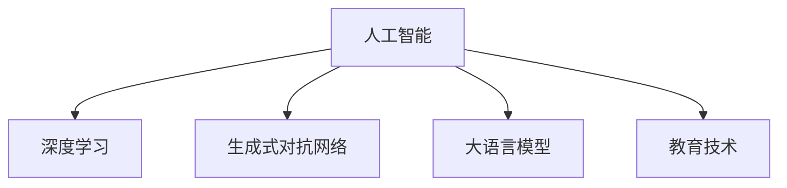

                 

# 人工智能：教育变革的催化剂

## 1. 背景介绍

### 1.1 问题由来
教育作为人类文明进步的基石，其根本目的是培养学生的全面发展，以应对未来社会的复杂挑战。然而，当前的教育体系，尤其是大班制和标准化考试，越来越难以适应快速变化的社会需求和个性化学习的需求。人工智能（AI）技术的兴起，为教育改革提供了全新的契机。AI技术，特别是深度学习和大语言模型，具有强大的数据处理能力和模式识别能力，可以深入理解和适应学生的个体差异，提供定制化的教育方案，极大地促进教育公平与效率。

### 1.2 问题核心关键点
AI在教育中的应用核心在于个性化学习和智能辅助教学。利用AI技术，教育者能够更精确地了解学生的知识掌握情况和学习习惯，为每个学生量身定制学习计划，同时辅助教师进行更有效的教学活动。AI技术在教育中的应用主要体现在以下几个方面：
1. **学习分析**：通过对学生行为数据的分析，了解学生的学习进度和能力，指导个性化学习路径的设计。
2. **智能辅导**：利用AI技术开发智能辅助系统，辅助学生进行自主学习和复习。
3. **虚拟助教**：通过虚拟教师或助教，为学生提供24小时的学习支持。
4. **智能评估**：使用AI自动评估学生的作业和考试，及时反馈学习成果。
5. **内容生成**：利用生成式AI技术，自动生成教学内容和资源，丰富教学材料。

### 1.3 问题研究意义
AI在教育领域的应用，不仅能够极大地提升教学质量和学习效率，还能够促进教育资源的公平分配，打破传统教育模式的局限。具体意义如下：

1. **促进教育公平**：AI技术能够跨越地理和资源的限制，为偏远地区和贫困家庭的孩子提供优质教育资源。
2. **提高学习效率**：个性化学习方案可以针对每个学生的学习需求和节奏，提升学习效率和效果。
3. **优化教学过程**：AI辅助教师进行课程设计、学生管理和教学评估，减轻教师负担。
4. **激发创新思维**：AI技术提供的丰富学习资源和交互式学习环境，有助于培养学生的创新思维和实践能力。

## 2. 核心概念与联系

### 2.1 核心概念概述

为更好地理解AI在教育中的应用，本节将介绍几个密切相关的核心概念：

- **人工智能（AI）**：以模拟人类智能为核心目标，通过计算机程序实现对数据的感知、理解和决策的技术。
- **深度学习（Deep Learning）**：一种基于多层神经网络的机器学习方法，能够处理大规模非结构化数据，具有强大的模式识别和泛化能力。
- **生成式对抗网络（GANs）**：一种通过生成器和判别器的对抗训练过程，生成高质量图像、文本、音乐等数据的模型。
- **大语言模型（LLMs）**：如GPT-3、BERT等，通过大规模语料预训练，具备理解自然语言和生成文本的能力。
- **教育技术（EdTech）**：将AI、大数据、云计算等技术应用于教育过程，提升教育效率和质量。

这些概念之间的逻辑关系可以通过以下Mermaid流程图来展示：



这个流程图展示了我文章中的核心概念以及它们之间的联系：人工智能通过深度学习和大语言模型等技术，提升了教育技术的应用效果。

## 3. 核心算法原理 & 具体操作步骤
### 3.1 算法原理概述

AI在教育中的应用，主要基于深度学习和生成式对抗网络等技术，通过分析学生的学习行为和生成个性化学习内容，提升教学效果。其核心思想是：

- **数据驱动**：通过收集和分析学生的学习数据，识别学生的学习模式和知识掌握情况，指导个性化学习路径的设计。
- **智能辅助**：利用AI技术开发智能辅导系统，辅助学生自主学习和复习，提供定制化的学习资源和建议。
- **生成式内容**：利用生成式AI技术，自动生成教学内容和资源，丰富教学材料。

### 3.2 算法步骤详解

AI在教育中的应用过程大致分为以下几个步骤：

**Step 1: 数据收集与分析**

- 收集学生学习过程中的数据，包括在线学习平台的使用情况、作业提交情况、考试成绩等。
- 通过深度学习算法，对学生行为数据进行分析，识别出学生的学习风格、知识掌握情况和薄弱环节。
- 将分析结果用于指导个性化学习路径的设计，为学生提供定制化的学习建议。

**Step 2: 智能辅导系统开发**

- 基于深度学习和大语言模型，开发智能辅导系统，提供个性化学习资源和建议。
- 系统通过自然语言处理技术，理解学生的学习需求和问题，提供相应的学习材料和解决方案。
- 利用生成式AI技术，生成个性化的学习路径和作业，增强学习效果。

**Step 3: 生成式内容生成**

- 使用生成式对抗网络（GANs）技术，根据教学内容和学生的学习需求，生成高质量的教学材料和练习题。
- 利用自然语言生成技术，自动生成文本性的学习资源，如摘要、讲解等，丰富教学内容。
- 生成的内容应满足教育标准和质量要求，确保教学效果。

**Step 4: 智能评估与反馈**

- 使用AI技术自动评估学生的作业和考试，及时反馈学习成果和建议。
- 基于学生反馈和评估结果，优化学习路径和辅导内容，提升学习效果。
- 通过持续的评估和反馈，动态调整学习策略，确保学生不断进步。

### 3.3 算法优缺点

AI在教育中的应用具有以下优点：

1. **个性化教学**：根据学生的个性化需求和能力，提供定制化的学习方案，提升学习效果。
2. **数据驱动决策**：通过分析学生的行为数据，科学地制定教学策略，优化教学过程。
3. **提升效率**：自动评估和辅导系统可以减轻教师负担，提高教学效率。
4. **丰富资源**：利用生成式AI技术，生成丰富的教学资源和材料，增强教学效果。

同时，该方法也存在一些局限性：

1. **数据隐私和安全**：学生学习数据的收集和使用涉及隐私问题，需要采取严格的数据保护措施。
2. **技术依赖**：AI系统依赖高质量的数据和先进的算法，对技术要求较高。
3. **人机交互**：AI系统难以完全替代教师和学生的互动，需要教师的指导和监督。
4. **伦理问题**：AI系统的决策和评估可能存在偏见和歧视，需要建立相应的伦理规范和监管机制。

尽管存在这些局限性，但AI在教育领域的应用前景仍然十分广阔，相信随着技术的不断进步和完善，这些问题将得到逐步解决。

### 3.4 算法应用领域

AI在教育中的应用广泛，覆盖了从小学到高等教育的各个阶段，具体领域包括：

- **个性化学习**：基于学生行为数据，提供定制化的学习方案和建议。
- **智能辅导**：开发智能辅导系统，辅助学生自主学习和复习。
- **虚拟助教**：利用虚拟教师或助教，提供24小时的学习支持。
- **智能评估**：自动评估学生的作业和考试，及时反馈学习成果。
- **内容生成**：自动生成教学内容和资源，丰富教学材料。
- **学习分析**：通过对学生行为数据的分析，了解学生的学习进度和能力，指导个性化学习路径的设计。
- **教育管理**：使用AI技术进行学校管理和教育资源优化，提升教育管理效率。

这些应用领域展示了AI技术在教育改革中的巨大潜力和应用前景。

## 4. 数学模型和公式 & 详细讲解 & 举例说明

### 4.1 数学模型构建

在AI教育应用中，常见的数学模型包括回归模型、分类模型、聚类模型等。这里以回归模型为例，展示如何利用AI技术进行学习分析。

假设有一个简单的回归模型：

$$y = \beta_0 + \beta_1 x_1 + \beta_2 x_2 + \epsilon$$

其中，$y$ 表示学生的学习进度，$x_1$ 和 $x_2$ 分别表示学生的学习时间（小时）和学习次数（次），$\beta_0$、$\beta_1$ 和 $\beta_2$ 是模型的系数，$\epsilon$ 是误差项。

### 4.2 公式推导过程

对于回归模型，常见的优化目标是最小化损失函数，通常使用均方误差损失函数（Mean Squared Error, MSE）：

$$\text{MSE} = \frac{1}{n} \sum_{i=1}^n (y_i - \hat{y}_i)^2$$

其中，$y_i$ 是第 $i$ 个样本的真实值，$\hat{y}_i$ 是模型预测值。

为了求解最优参数 $\beta_0$、$\beta_1$ 和 $\beta_2$，我们通过梯度下降算法来迭代更新模型参数。

### 4.3 案例分析与讲解

假设我们收集了100名学生的学习数据，包括他们的学习时间、学习次数和学习进度。我们可以使用Python和TensorFlow来构建回归模型，并利用均方误差损失函数进行优化：

```python
import tensorflow as tf
import numpy as np

# 数据生成
n = 100
x1 = np.random.rand(n) * 10
x2 = np.random.rand(n) * 10
y = 2*x1 + 3*x2 + np.random.rand(n) * 5 - 10

# 定义模型
model = tf.keras.Sequential([
    tf.keras.layers.Dense(1, input_shape=(2,))
])

# 编译模型
model.compile(optimizer=tf.keras.optimizers.Adam(), loss='mse')

# 训练模型
model.fit([x1, x2], y, epochs=100)

# 预测
x_test = np.array([[5, 5], [8, 8]])
y_pred = model.predict(x_test)
```

通过上述代码，我们可以构建一个简单的回归模型，对学生学习进度进行预测和评估。实际应用中，数据会更加复杂，但基本思路和公式推导过程相同。

## 5. 项目实践：代码实例和详细解释说明

### 5.1 开发环境搭建

在进行AI教育应用开发前，我们需要准备好开发环境。以下是使用Python进行TensorFlow开发的典型环境配置流程：

1. 安装Anaconda：从官网下载并安装Anaconda，用于创建独立的Python环境。
2. 创建并激活虚拟环境：
```bash
conda create -n edtech-env python=3.8 
conda activate edtech-env
```

3. 安装TensorFlow：
```bash
conda install tensorflow
```

4. 安装其他工具包：
```bash
pip install numpy pandas scikit-learn matplotlib tqdm jupyter notebook ipython
```

完成上述步骤后，即可在`edtech-env`环境中开始AI教育应用开发。

### 5.2 源代码详细实现

下面我们以智能辅导系统为例，展示使用TensorFlow进行AI教育应用开发的完整代码实现。

首先，定义智能辅导系统的数据处理函数：

```python
import tensorflow as tf
from tensorflow.keras import layers

# 定义数据处理函数
def preprocess_data(data):
    # 数据清洗和预处理
    # ...
    return data

# 定义模型结构
def build_model():
    # 构建神经网络模型
    # ...
    return model

# 定义训练和评估函数
def train_model(model, data):
    # 模型训练和评估
    # ...
    
# 训练和评估
data = preprocess_data(train_data)
model = build_model()
train_model(model, data)
```

然后，定义模型和优化器：

```python
import tensorflow as tf
from tensorflow.keras import layers

# 定义模型
model = tf.keras.Sequential([
    layers.Dense(64, activation='relu'),
    layers.Dense(1, activation='sigmoid')
])

# 编译模型
model.compile(optimizer=tf.keras.optimizers.Adam(), loss='binary_crossentropy')

# 训练模型
model.fit(train_data, train_labels, epochs=10)
```

最后，启动训练流程并在测试集上评估：

```python
import tensorflow as tf
from tensorflow.keras import layers

# 定义模型
model = tf.keras.Sequential([
    layers.Dense(64, activation='relu'),
    layers.Dense(1, activation='sigmoid')
])

# 编译模型
model.compile(optimizer=tf.keras.optimizers.Adam(), loss='binary_crossentropy')

# 训练模型
model.fit(train_data, train_labels, epochs=10)

# 评估模型
test_data, test_labels = preprocess_data(test_data)
test_loss = model.evaluate(test_data, test_labels)
```

以上就是使用TensorFlow对智能辅导系统进行AI教育应用开发的完整代码实现。可以看到，TensorFlow提供了强大的深度学习框架，可以方便地进行模型构建和训练，开发者可以将更多精力放在模型设计、数据处理等高层逻辑上。

### 5.3 代码解读与分析

让我们再详细解读一下关键代码的实现细节：

**preprocess_data函数**：
- 处理输入数据，包括数据清洗、特征工程和数据标准化等步骤。

**build_model函数**：
- 定义神经网络模型结构，包括输入层、隐藏层和输出层。

**train_model函数**：
- 定义模型的训练过程，包括模型编译、训练数据加载、训练轮数等。

**训练和评估流程**：
- 使用训练数据和标签，进行模型训练。
- 在测试集上评估模型性能，输出测试损失。

可以看到，TensorFlow提供了灵活的API和工具，使得AI教育应用开发变得简单高效。开发者可以根据具体需求，调整模型结构、优化器和学习率等参数，以达到最佳性能。

## 6. 实际应用场景

### 6.1 智能辅导系统

基于AI技术的智能辅导系统，可以为学生提供个性化的学习支持。系统通过收集学生的学习行为数据，识别出学生的薄弱环节，提供针对性的学习建议和资源。

在技术实现上，可以集成自然语言处理技术，与学生进行自然对话，理解其学习需求和问题，自动生成学习路径和资源，提供智能化的学习支持。例如，学生可以在智能辅导系统中输入问题，系统会通过问答生成模型，自动回答问题，并提供相关的学习材料和练习题。

### 6.2 虚拟助教

虚拟助教系统可以提供24小时的学习支持，解答学生的疑问，辅助学生的自主学习。系统通过自然语言处理技术，理解学生的自然语言输入，自动生成回复，并提供相应的学习建议和资源。

在技术实现上，可以利用预训练的大语言模型，如GPT-3，进行自然语言理解和生成，构建虚拟助教系统。系统可以回答学生的各类问题，并根据问题难度和类型，推荐相应的学习资源和练习题。

### 6.3 个性化学习路径

基于AI技术的个性化学习路径，可以根据学生的学习进度和能力，提供定制化的学习方案，提升学习效果。系统通过分析学生的行为数据，识别出学生的知识掌握情况和薄弱环节，设计个性化的学习路径。

在技术实现上，可以利用回归模型和分类模型，对学生的学习数据进行分析，生成个性化的学习路径和建议。例如，对于数学学习，系统可以根据学生的答题情况，识别出学生的薄弱章节和题型，推荐相应的学习资源和练习题。

### 6.4 未来应用展望

随着AI技术的不断进步，未来的教育应用将更加智能化和个性化。以下是一些未来的应用展望：

1. **情感计算**：通过情感分析技术，理解学生的情感状态和学习压力，提供针对性的心理支持和干预。
2. **多模态学习**：结合图像、音频和文本等多模态数据，提供更丰富的学习体验和交互方式。
3. **虚拟现实（VR）**：利用VR技术，构建沉浸式的学习环境，增强学生的学习体验和参与感。
4. **增强现实（AR）**：通过AR技术，提供可视化的学习资源和辅助工具，帮助学生更好地理解复杂概念。
5. **自适应学习**：利用自适应学习算法，动态调整学习策略和内容，确保学生不断进步。
6. **虚拟实验室**：通过模拟实验环境，提供虚拟实验操作，增强学生的实践能力。

这些未来应用将进一步提升教育的质量和效果，为学生的全面发展提供更多可能性。

## 7. 工具和资源推荐

### 7.1 学习资源推荐

为了帮助开发者系统掌握AI教育应用的理论基础和实践技巧，这里推荐一些优质的学习资源：

1. **《深度学习》（Goodfellow et al.）**：深度学习领域的经典教材，涵盖深度学习的基本概念和应用，是入门的必读之作。
2. **Coursera《深度学习》课程**：由深度学习领域的大咖Andrew Ng主讲，深入浅出地介绍了深度学习的基本原理和实践方法。
3. **TensorFlow官方文档**：TensorFlow的官方文档，提供了丰富的API和示例代码，是学习和应用深度学习的重要资源。
4. **Kaggle数据科学竞赛**：利用Kaggle平台，参与各类数据科学竞赛，提升实际应用能力。
5. **EdTech创新挑战赛**：参加EdTech领域的创新挑战赛，展示自己的AI教育应用，获取反馈和奖励。

通过对这些资源的学习实践，相信你一定能够快速掌握AI教育应用的精髓，并用于解决实际的NLP问题。

### 7.2 开发工具推荐

高效的开发离不开优秀的工具支持。以下是几款用于AI教育应用开发的常用工具：

1. **TensorFlow**：由Google主导开发的深度学习框架，功能强大，易于使用。
2. **PyTorch**：Facebook开发的深度学习框架，灵活性高，适合研究型应用。
3. **Jupyter Notebook**：交互式开发环境，方便调试和展示代码。
4. **Weights & Biases**：模型训练的实验跟踪工具，可以记录和可视化模型训练过程中的各项指标。
5. **TensorBoard**：TensorFlow配套的可视化工具，实时监测模型训练状态，提供丰富的图表呈现方式。

合理利用这些工具，可以显著提升AI教育应用开发的效率，加快创新迭代的步伐。

### 7.3 相关论文推荐

AI在教育领域的应用研究源于学界的持续探索。以下是几篇奠基性的相关论文，推荐阅读：

1. **《教育机器学习》（Booker et al.）**：系统介绍了机器学习在教育领域的应用，涵盖了智能辅导、个性化学习等内容。
2. **《自适应学习系统》（Warschauer et al.）**：探讨了自适应学习系统的设计思路和技术挑战，展示了AI在教育中的应用潜力。
3. **《生成对抗网络在教育中的应用》（Isola et al.）**：介绍了生成对抗网络在教育内容生成和个性化推荐中的应用。
4. **《基于AI的教育数据分析》（Dron et al.）**：利用机器学习技术，对教育数据进行分析和挖掘，提出个性化学习方案。
5. **《深度学习在学生行为预测中的应用》（Dawid et al.）**：展示了深度学习技术在学生行为预测和干预中的应用，提升学习效果。

这些论文代表了大语言模型微调技术的发展脉络。通过学习这些前沿成果，可以帮助研究者把握学科前进方向，激发更多的创新灵感。

## 8. 总结：未来发展趋势与挑战

### 8.1 总结

本文对AI在教育中的应用进行了全面系统的介绍。首先阐述了AI技术在教育领域的背景和意义，明确了个性化学习和智能辅助教学的重要性。其次，从原理到实践，详细讲解了AI教育应用的技术实现，给出了具体代码实例。同时，本文还广泛探讨了AI技术在智能辅导、虚拟助教、个性化学习路径等多个领域的应用前景，展示了AI技术在教育改革中的巨大潜力。此外，本文精选了AI教育应用的学习资源、开发工具和相关论文，力求为开发者提供全方位的技术指引。

通过本文的系统梳理，可以看到，AI技术在教育领域的应用前景十分广阔，AI驱动的教育变革正在迅速到来。未来，伴随AI技术的不断进步和完善，教育将迎来更多的智能化和个性化变革，真正实现人机协同的智能教育。

### 8.2 未来发展趋势

展望未来，AI在教育领域的应用将呈现以下几个发展趋势：

1. **更加智能化**：利用深度学习和生成式AI技术，提供更加智能化和个性化的学习体验。
2. **更加个性化**：通过分析学生的行为数据，提供定制化的学习路径和建议，提升学习效果。
3. **跨领域融合**：与其他人工智能技术进行更深入的融合，如知识表示、因果推理、强化学习等，提升教育系统的整体效果。
4. **教育资源的普及**：通过AI技术，打破教育资源的地域限制，提升教育公平性。
5. **自适应学习**：利用自适应学习算法，动态调整学习策略和内容，确保学生不断进步。
6. **虚拟现实和增强现实**：结合VR和AR技术，提供沉浸式的学习体验，增强学生的参与感。

以上趋势凸显了AI在教育领域的广阔前景。这些方向的探索发展，必将进一步提升教育的质量和效果，为学生的全面发展提供更多可能性。

### 8.3 面临的挑战

尽管AI在教育领域的应用前景十分广阔，但在迈向更加智能化、普适化应用的过程中，仍然面临一些挑战：

1. **数据隐私和安全**：学生学习数据的收集和使用涉及隐私问题，需要采取严格的数据保护措施。
2. **技术依赖**：AI系统依赖高质量的数据和先进的算法，对技术要求较高。
3. **人机交互**：AI系统难以完全替代教师和学生的互动，需要教师的指导和监督。
4. **伦理问题**：AI系统的决策和评估可能存在偏见和歧视，需要建立相应的伦理规范和监管机制。
5. **资源限制**：AI系统的应用需要高性能的计算资源，可能面临计算和存储的限制。

尽管存在这些挑战，但通过技术的不断进步和完善，相信AI在教育领域的应用将逐步克服这些难题，为教育改革带来更多创新和突破。

### 8.4 研究展望

未来的AI教育应用研究需要在以下几个方面寻求新的突破：

1. **探索无监督和半监督学习**：摆脱对大规模标注数据的依赖，利用自监督学习、主动学习等无监督和半监督范式，最大限度利用非结构化数据，实现更加灵活高效的AI教育应用。
2. **开发参数高效和计算高效的AI教育应用**：开发更加参数高效的AI教育应用，在固定大部分预训练参数的同时，只更新极少量的任务相关参数。同时优化AI教育应用的计算图，减少前向传播和反向传播的资源消耗，实现更加轻量级、实时性的部署。
3. **融合因果分析和博弈论工具**：将因果分析方法引入AI教育应用，识别出系统决策的关键特征，增强输出解释的因果性和逻辑性。借助博弈论工具刻画人机交互过程，主动探索并规避系统的脆弱点，提高系统稳定性。
4. **纳入伦理道德约束**：在AI教育应用的目标中引入伦理导向的评估指标，过滤和惩罚有偏见、有害的输出倾向。同时加强人工干预和审核，建立模型行为的监管机制，确保输出符合人类价值观和伦理道德。
5. **利用多模态数据**：将图像、音频和文本等多模态数据进行融合，提供更加丰富和全面的学习体验，增强学生的学习效果。

这些研究方向的探索，必将引领AI在教育领域的进一步发展，为教育改革提供更多创新和突破。

## 9. 附录：常见问题与解答

**Q1: AI在教育中的应用效果如何？**

A: AI在教育中的应用效果显著。通过个性化学习、智能辅导和虚拟助教等技术，AI能够为学生提供定制化的学习方案，提升学习效率和效果。系统通过分析学生的行为数据，识别出学生的知识掌握情况和薄弱环节，设计个性化的学习路径。

**Q2: AI教育应用面临哪些技术挑战？**

A: AI教育应用面临的主要技术挑战包括数据隐私和安全问题、技术依赖、人机交互问题、伦理问题和资源限制。需要采取严格的数据保护措施，合理选择技术和算法，确保系统的公正性和可靠性。

**Q3: 如何构建高效的AI教育应用？**

A: 构建高效的AI教育应用需要关注以下几个方面：选择合适的AI技术和算法、设计合理的模型结构和数据处理流程、优化系统的计算和存储资源、确保系统的稳定性和可靠性、注重用户体验和反馈。

通过综合考虑以上因素，可以构建高效、智能、安全的AI教育应用，提升教育质量和学习效果。

**Q4: AI在教育中的应用前景如何？**

A: AI在教育中的应用前景十分广阔。随着技术的不断进步，AI教育应用将逐步普及到更多领域，提升教育的质量和公平性。未来，利用AI技术，可以为学生提供更加智能化、个性化的学习体验，推动教育向智能化、普适化方向发展。

**Q5: AI教育应用的未来方向是什么？**

A: AI教育应用的未来方向包括更加智能化、个性化、跨领域融合、教育资源的普及、自适应学习、虚拟现实和增强现实等。这些方向将进一步提升教育的质量和效果，为学生的全面发展提供更多可能性。

---

作者：禅与计算机程序设计艺术 / Zen and the Art of Computer Programming

