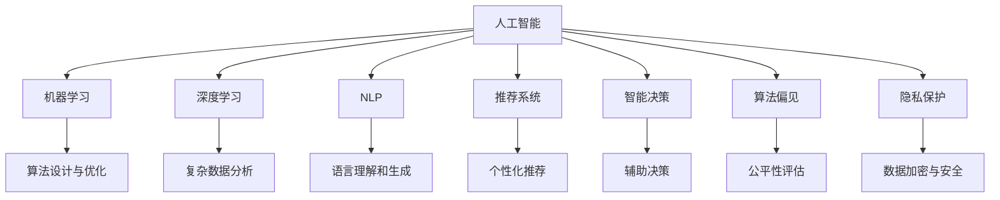

                 

# 人工智能：社会影响与思考

> 关键词：人工智能,社会影响,伦理道德,公平正义,创新应用

## 1. 背景介绍

### 1.1 问题由来

随着人工智能(AI)技术的迅猛发展，其对社会的深远影响开始引起广泛关注。AI技术的快速迭代不仅在产业界产生了巨大的变革，也深刻改变了人类的生产生活方式。无论是在医疗、教育、金融还是司法等领域，AI的影响力都在不断增强。与此同时，AI技术的应用也带来了一些不容忽视的社会问题，如算法偏见、隐私泄露、就业影响等。

人工智能技术的迅速发展，要求我们必须重新思考其在社会中的定位和作用，探讨如何最大限度地发挥其正面效应，同时避免或减少其可能带来的负面影响。本文旨在通过分析AI技术的发展现状、社会影响及其未来趋势，提出相应的对策建议，以期为AI技术的应用和发展提供有益的参考。

### 1.2 问题核心关键点

人工智能对社会的影响是多维度的，包括但不限于以下几个关键点：
- **技术创新与社会进步**：AI技术如何推动社会经济发展、提高生活质量。
- **伦理道德与公平正义**：AI技术的应用是否符合伦理道德原则，是否能够实现社会公平。
- **隐私与安全**：如何保护用户隐私，防范数据泄露风险。
- **就业与教育**：AI对就业市场的影响以及如何通过教育培训应对技术变革。
- **法律与监管**：AI技术的发展对现有法律体系的影响，以及如何构建适应AI的监管框架。

本文将围绕这些关键点，系统地探讨AI技术在社会中的影响，并提出相应的应对策略。

## 2. 核心概念与联系

### 2.1 核心概念概述

要深刻理解AI对社会的影响，首先需要明确一些核心概念：

- **人工智能**：利用计算机算法和机器学习模型，实现对复杂数据的分析和决策。
- **机器学习**：通过算法使机器自动从数据中学习并优化性能的过程。
- **深度学习**：一种特殊的机器学习方法，通过多层次的神经网络模型处理复杂数据。
- **自然语言处理(NLP)**：使计算机能够理解和生成人类语言的学科。
- **推荐系统**：基于用户历史行为和偏好，智能推荐产品或服务的系统。
- **智能决策**：通过数据分析和模型训练，辅助或代替人工进行决策。
- **算法偏见**：由于数据不均衡、模型设计缺陷等原因，导致AI模型在特定群体中产生不公平决策。
- **隐私保护**：保护用户个人信息和数据不被未授权访问或泄露。

这些概念之间的联系可以通过以下Mermaid流程图来展示：



这个流程图展示了人工智能及其相关技术之间的关系，以及这些技术对社会的潜在影响。

## 3. 核心算法原理 & 具体操作步骤

### 3.1 算法原理概述

人工智能的核心算法原理主要包括机器学习、深度学习和自然语言处理等。这些技术通过大量数据的训练和优化，使计算机具备从数据中学习、推理和决策的能力。

- **机器学习**：通过训练模型使其能够从数据中学习规律，并根据新数据进行预测或分类。常用算法包括线性回归、决策树、随机森林、支持向量机等。
- **深度学习**：通过多层神经网络模型处理复杂数据，实现图像识别、语音识别、自然语言处理等任务。常用模型包括卷积神经网络(CNN)、循环神经网络(RNN)、长短期记忆网络(LSTM)等。
- **自然语言处理(NLP)**：使计算机能够理解和生成人类语言，处理文本数据，常用的技术包括分词、命名实体识别、情感分析、机器翻译等。

### 3.2 算法步骤详解

AI技术的开发和应用通常包括以下几个关键步骤：

**Step 1: 数据收集与预处理**

- 收集大量数据，并进行清洗和预处理，确保数据质量。
- 数据清洗包括去除噪声、填补缺失值、标准化等操作。

**Step 2: 模型选择与训练**

- 根据任务需求选择合适的算法模型。
- 使用训练集数据训练模型，并通过验证集评估模型性能。
- 调整模型参数，以优化模型在测试集上的表现。

**Step 3: 模型评估与部署**

- 使用测试集评估模型性能，并根据评估结果调整模型。
- 将模型部署到生产环境中，进行实时应用。
- 定期监测模型性能，进行模型更新和维护。

### 3.3 算法优缺点

人工智能算法的优点包括：
- 高效处理大规模数据，提升决策效率。
- 通过学习历史数据，提升决策准确性。
- 能够自动化处理重复性任务，提高生产效率。

然而，AI算法也存在一些缺点：
- 算法模型的解释性较差，难以理解其决策过程。
- 需要大量数据训练，对数据质量和数量要求较高。
- 模型容易过拟合，导致在新的数据上表现不佳。
- 算法偏见问题，可能造成不公正决策。

### 3.4 算法应用领域

人工智能技术广泛应用于各个领域，包括但不限于：

- **医疗健康**：辅助诊断、个性化治疗、健康监测等。
- **金融服务**：风险评估、欺诈检测、智能投顾等。
- **零售电商**：推荐系统、库存管理、客户服务等。
- **交通运输**：自动驾驶、智能调度、交通分析等。
- **教育培训**：智能评估、个性化教学、学习分析等。

## 4. 数学模型和公式 & 详细讲解 & 举例说明

### 4.1 数学模型构建

以深度学习中的卷积神经网络(CNN)为例，其数学模型构建过程如下：

- **输入层**：将原始数据（如图像像素）转化为向量形式。
- **卷积层**：通过卷积操作提取特征，减少模型参数。
- **池化层**：对卷积层的输出进行降维处理，减少计算量。
- **全连接层**：将池化层的输出转化为分类结果。
- **输出层**：输出分类结果。

### 4.2 公式推导过程

卷积神经网络中的卷积操作可以表示为：

$$
C(x) = \sum_{i=1}^{n} w_i x_i + b
$$

其中 $x$ 为输入数据，$w$ 为卷积核，$b$ 为偏置项。

### 4.3 案例分析与讲解

以图像分类任务为例，通过卷积神经网络实现对手写数字的识别。训练过程中，模型通过前向传播计算损失函数，并反向传播更新参数，直至损失函数收敛。

## 5. 项目实践：代码实例和详细解释说明

### 5.1 开发环境搭建

要进行深度学习项目的开发，首先需要搭建合适的开发环境。以下是使用Python和PyTorch搭建深度学习开发环境的流程：

1. 安装Python：从官网下载安装Python 3.8版本。
2. 安装PyTorch：通过conda或pip安装，并设置合适的环境变量。
3. 安装相关库：安装TensorFlow、NumPy、Pandas等常用的深度学习库。
4. 配置GPU：确保本地有足够算力，可以使用Google Colab等在线环境。

### 5.2 源代码详细实现

以手写数字识别为例，使用卷积神经网络模型进行开发。以下是代码实现过程：

```python
import torch
import torch.nn as nn
import torch.optim as optim
import torchvision.datasets as dsets
import torchvision.transforms as transforms

# 定义卷积神经网络模型
class CNN(nn.Module):
    def __init__(self):
        super(CNN, self).__init__()
        self.conv1 = nn.Conv2d(1, 32, kernel_size=3, stride=1, padding=1)
        self.relu1 = nn.ReLU()
        self.pool1 = nn.MaxPool2d(kernel_size=2, stride=2)
        self.conv2 = nn.Conv2d(32, 64, kernel_size=3, stride=1, padding=1)
        self.relu2 = nn.ReLU()
        self.pool2 = nn.MaxPool2d(kernel_size=2, stride=2)
        self.fc1 = nn.Linear(7*7*64, 128)
        self.relu3 = nn.ReLU()
        self.fc2 = nn.Linear(128, 10)
    
    def forward(self, x):
        x = self.conv1(x)
        x = self.relu1(x)
        x = self.pool1(x)
        x = self.conv2(x)
        x = self.relu2(x)
        x = self.pool2(x)
        x = x.view(-1, 7*7*64)
        x = self.fc1(x)
        x = self.relu3(x)
        x = self.fc2(x)
        return x

# 定义数据预处理
transform = transforms.Compose([
    transforms.ToTensor(),
    transforms.Normalize((0.1307,), (0.3081,))
])

train_dataset = dsets.MNIST(root='./data', train=True, transform=transform, download=True)
test_dataset = dsets.MNIST(root='./data', train=False, transform=transform, download=True)

# 定义模型、损失函数和优化器
model = CNN()
criterion = nn.CrossEntropyLoss()
optimizer = optim.SGD(model.parameters(), lr=0.01)

# 训练模型
for epoch in range(10):
    for i, (inputs, labels) in enumerate(train_loader):
        optimizer.zero_grad()
        outputs = model(inputs)
        loss = criterion(outputs, labels)
        loss.backward()
        optimizer.step()
```

### 5.3 代码解读与分析

**CNN模型定义**：
- `nn.Conv2d`：定义卷积层，包括卷积核大小、步长、填充等参数。
- `nn.ReLU`：定义ReLU激活函数，增加非线性。
- `nn.MaxPool2d`：定义池化层，对特征图进行降维。
- `nn.Linear`：定义全连接层。

**数据预处理**：
- `transforms.Compose`：定义数据预处理流程，包括转化为Tensor和标准化。
- `dsets.MNIST`：定义MNIST数据集，并进行下载和预处理。

**模型训练**：
- `nn.CrossEntropyLoss`：定义交叉熵损失函数，用于评估模型预测结果。
- `optim.SGD`：定义随机梯度下降优化器，更新模型参数。

## 6. 实际应用场景

### 6.1 智能医疗

智能医疗是人工智能技术的重要应用领域之一。通过AI技术，可以实现病历分析、疾病预测、智能诊断等功能，提高医疗服务的效率和质量。

**智能诊断**：使用深度学习模型分析医疗影像数据，辅助医生进行疾病诊断。例如，通过卷积神经网络对X光片进行分析，辅助诊断肺癌。

**病历分析**：使用自然语言处理技术分析电子病历数据，提取关键信息，辅助医生制定治疗方案。例如，通过情感分析技术，分析患者反馈，提高治疗满意度。

**个性化治疗**：使用推荐系统技术，根据患者历史数据和基因信息，推荐个性化治疗方案。例如，通过协同过滤算法，推荐最适合患者的药物和剂量。

### 6.2 金融科技

金融科技是AI技术在金融领域的重要应用。通过AI技术，可以实现风险评估、欺诈检测、智能投顾等功能，提升金融服务的效率和安全性。

**风险评估**：使用机器学习模型分析信用数据，评估贷款申请人的信用风险。例如，通过随机森林算法，预测贷款违约概率。

**欺诈检测**：使用异常检测算法分析交易数据，识别和预防欺诈行为。例如，通过时间序列分析，检测信用卡异常消费。

**智能投顾**：使用推荐系统技术，根据用户投资偏好和市场情况，推荐最佳投资方案。例如，通过协同过滤算法，推荐最优股票组合。

### 6.3 智慧城市

智慧城市是AI技术在城市管理中的重要应用。通过AI技术，可以实现交通管理、公共安全、环境监测等功能，提升城市管理效率。

**智能交通**：使用深度学习模型分析交通数据，优化交通信号灯控制，提高交通效率。例如，通过循环神经网络，预测交通流量，优化交通信号。

**公共安全**：使用视频监控技术，分析监控录像，识别潜在安全威胁。例如，通过目标检测算法，识别可疑人员和行为。

**环境监测**：使用传感器数据，分析城市环境数据，提升环境治理效率。例如，通过时间序列分析，预测空气质量变化趋势。

### 6.4 未来应用展望

未来，随着AI技术的不断进步，其应用场景将更加广泛，带来的社会影响也将更加深远。以下是一些未来应用展望：

- **自动化生产**：通过AI技术，实现自动化生产线的优化，提高生产效率和质量。例如，使用机器视觉技术，检测产品质量，减少人工干预。
- **个性化服务**：通过AI技术，实现个性化推荐和服务，提升用户体验。例如，通过推荐系统技术，推荐个性化商品和内容。
- **智能客服**：通过AI技术，实现智能客服系统，提高服务质量和效率。例如，使用自然语言处理技术，自动处理客户咨询。
- **智能家居**：通过AI技术，实现智能家居系统，提高生活便利性。例如，通过语音识别技术，实现智能家居控制。

## 7. 工具和资源推荐

### 7.1 学习资源推荐

为了帮助开发者系统掌握AI技术，以下是一些优质的学习资源：

- **Deep Learning Specialization**：由Andrew Ng教授在Coursera开设的深度学习课程，涵盖深度学习的基本概念和常用技术。
- **CS231n: Convolutional Neural Networks for Visual Recognition**：斯坦福大学开设的计算机视觉课程，讲解卷积神经网络在图像识别中的应用。
- **Natural Language Processing Specialization**：由Coursera开设的自然语言处理课程，涵盖NLP的基本概念和常用技术。
- **Hands-On Machine Learning with Scikit-Learn and TensorFlow**：使用Scikit-Learn和TensorFlow进行机器学习的实战教程，适合初学者和中级开发者。
- **Reinforcement Learning: An Introduction**：讲解强化学习的基本概念和常用算法，适合对深度学习有基本了解的读者。

### 7.2 开发工具推荐

以下是几款常用的AI开发工具：

- **PyTorch**：由Facebook开发的深度学习框架，支持动态计算图和GPU加速。
- **TensorFlow**：由Google开发的深度学习框架，支持分布式计算和GPU/TPU加速。
- **Keras**：高层次的深度学习框架，易于使用，适合快速原型开发。
- **Jupyter Notebook**：交互式编程环境，支持Python、R等语言，适合数据探索和模型调试。
- **Scikit-Learn**：Python机器学习库，提供多种机器学习算法和数据处理工具。

### 7.3 相关论文推荐

以下是几篇具有代表性的AI相关论文，推荐阅读：

- **ImageNet Classification with Deep Convolutional Neural Networks**：Alex Krizhevsky等人提出的卷积神经网络在图像分类中的应用，开创了深度学习的先河。
- **Attention Is All You Need**：Google的研究团队提出的Transformer模型，在自然语言处理中取得了突破性的进展。
- **BERT: Pre-training of Deep Bidirectional Transformers for Language Understanding**：Google的研究团队提出的BERT模型，通过预训练任务提升语言理解能力。
- **A Survey on Machine Learning Techniques for Healthcare**：综述了机器学习在医疗领域的应用，涵盖了医疗影像分析、电子病历处理等多个方向。
- **Fairness in Machine Learning: A Survey of Biases, Prejudices, and Stereotypes**：回顾了机器学习中的公平性问题，探讨了如何消除算法偏见。

## 8. 总结：未来发展趋势与挑战

### 8.1 研究成果总结

本文通过系统地介绍AI技术及其社会影响，探讨了AI技术在医疗、金融、智慧城市等领域的广泛应用。同时，提出了AI技术在应用过程中面临的伦理道德、隐私保护、算法偏见等问题，并提出了相应的对策建议。

### 8.2 未来发展趋势

未来，AI技术的发展将更加依赖于以下几个趋势：

- **跨领域融合**：AI技术将与其他技术如物联网、大数据、区块链等进行深度融合，形成新的应用场景。
- **边缘计算**：AI算法将在边缘设备上进行计算，提升实时性和数据隐私保护。
- **人机协同**：通过AI技术，实现人与机器的协同工作，提升效率和质量。
- **自适应学习**：AI模型将具备自适应学习能力，能够根据环境变化进行动态调整。
- **伦理道德**：AI技术的开发和应用将更加注重伦理道德，确保其应用的公平性和透明性。

### 8.3 面临的挑战

尽管AI技术的发展带来了巨大的机遇，但也面临诸多挑战：

- **数据隐私**：如何保护用户隐私，防止数据泄露。
- **算法偏见**：如何消除算法偏见，确保公平性。
- **伦理道德**：如何确保AI技术的道德应用，避免负面影响。
- **安全性**：如何保障AI系统的安全性，防止攻击和滥用。
- **计算资源**：如何降低AI技术的计算成本，提高其可访问性。

### 8.4 研究展望

未来，AI技术的研究方向将更加关注以下几个方面：

- **算法公平性**：研究如何消除算法偏见，确保公平性。
- **隐私保护**：研究如何保护用户隐私，防止数据泄露。
- **伦理道德**：研究如何确保AI技术的道德应用，避免负面影响。
- **自适应学习**：研究如何使AI模型具备自适应学习能力，提高其应用效果。
- **跨领域应用**：研究AI技术在跨领域的应用，推动产业升级和创新。

## 9. 附录：常见问题与解答

**Q1：人工智能技术对社会有哪些影响？**

A: AI技术对社会的影响是多方面的，包括但不限于以下几个方面：

- **就业影响**：AI技术可能导致某些职业的消失，但也会创造新的就业机会。例如，机器人技术可能导致工厂流水线工人失业，但也会创造新的机器人维护和操作岗位。
- **经济影响**：AI技术可以提升生产效率和质量，降低生产成本，促进经济发展。例如，智能制造技术可以提高生产自动化水平，降低生产成本。
- **教育影响**：AI技术可以辅助教学，提升教育质量。例如，AI技术可以用于个性化教育，根据学生学习情况提供个性化推荐。

**Q2：人工智能技术在医疗领域的应用有哪些？**

A: 人工智能技术在医疗领域的应用非常广泛，包括但不限于以下几个方面：

- **辅助诊断**：使用AI技术分析医疗影像数据，辅助医生进行疾病诊断。例如，通过卷积神经网络对X光片进行分析，辅助诊断肺癌。
- **病历分析**：使用自然语言处理技术分析电子病历数据，提取关键信息，辅助医生制定治疗方案。例如，通过情感分析技术，分析患者反馈，提高治疗满意度。
- **个性化治疗**：使用推荐系统技术，根据患者历史数据和基因信息，推荐个性化治疗方案。例如，通过协同过滤算法，推荐最适合患者的药物和剂量。
- **智能监测**：使用智能设备监测患者健康状况，提供实时预警和干预。例如，通过可穿戴设备监测患者的心率、血压等生理指标。

**Q3：人工智能技术在金融领域的应用有哪些？**

A: 人工智能技术在金融领域的应用非常广泛，包括但不限于以下几个方面：

- **风险评估**：使用机器学习模型分析信用数据，评估贷款申请人的信用风险。例如，通过随机森林算法，预测贷款违约概率。
- **欺诈检测**：使用异常检测算法分析交易数据，识别和预防欺诈行为。例如，通过时间序列分析，检测信用卡异常消费。
- **智能投顾**：使用推荐系统技术，根据用户投资偏好和市场情况，推荐最佳投资方案。例如，通过协同过滤算法，推荐最优股票组合。
- **量化交易**：使用机器学习模型进行量化交易，提高投资回报率。例如，通过多因子模型，进行股票交易策略优化。

**Q4：人工智能技术在智慧城市中的应用有哪些？**

A: 人工智能技术在智慧城市中的应用非常广泛，包括但不限于以下几个方面：

- **智能交通**：使用深度学习模型分析交通数据，优化交通信号灯控制，提高交通效率。例如，通过循环神经网络，预测交通流量，优化交通信号。
- **公共安全**：使用视频监控技术，分析监控录像，识别潜在安全威胁。例如，通过目标检测算法，识别可疑人员和行为。
- **环境监测**：使用传感器数据，分析城市环境数据，提升环境治理效率。例如，通过时间序列分析，预测空气质量变化趋势。
- **智慧建筑**：使用物联网技术，监测和优化城市建筑，提高能效和舒适度。例如，通过传感器监测建筑能耗，优化供暖系统。

---

作者：禅与计算机程序设计艺术 / Zen and the Art of Computer Programming

