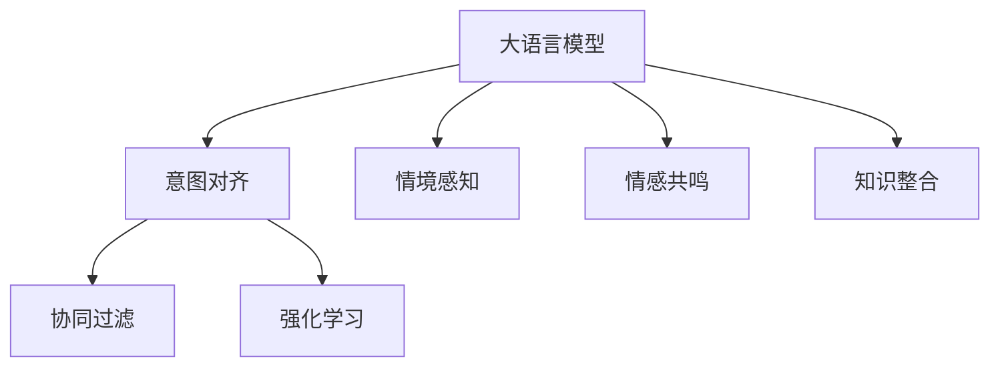

                 

# 人机协作新篇章：LLM与人类意图的对齐

> 关键词：大语言模型(Large Language Model, LLM)，人机协作，意图对齐，自然语言处理(NLP)，推荐系统，智能客服

## 1. 背景介绍

随着人工智能技术的飞速发展，大语言模型(LLM)在自然语言处理(NLP)领域取得了巨大的突破。这些模型，如GPT、BERT等，通过在海量文本数据上进行预训练，获得了强大的语言理解和生成能力。然而，尽管LLM在许多任务上表现出色，但与人类智能的对齐仍是一个关键问题。如何在LLM的强大计算能力与人类直觉、常识、情感等复杂的认知能力之间建立有效桥梁，实现真正意义上的人机协作，是当前人工智能研究的前沿话题。

### 1.1 问题由来

LLM在生成自然语言方面展现出了超乎想象的能力，能够产生高度流畅、逻辑一致的回答。然而，这种能力的背后，往往缺乏对人类意图和上下文情境的深刻理解。这导致LLM在一些需要细腻情感感知和复杂推理的场景下，容易输出与人类预期相悖的结果。例如，在智能客服、医疗咨询等高风险领域，错误或误导性的输出可能会对用户造成不可逆的负面影响。

### 1.2 问题核心关键点

LLM与人类意图对齐的核心在于如何让机器更好地理解并执行人类的真实意图。这一过程涉及以下几个关键点：

1. **意图理解**：准确识别用户输入的意图，避免被表面文字误导。
2. **情境感知**：理解对话或任务的具体语境，提供符合情境的响应。
3. **情感共鸣**：能够感知用户的情感，做出适度的情感响应。
4. **知识整合**：整合人类知识与数据，提升决策的全面性和可靠性。

这些问题在传统机器学习系统中较为容易处理，但在大语言模型中，由于其复杂性和规模性，解决起来更具挑战性。

## 2. 核心概念与联系

### 2.1 核心概念概述

为更好地理解LLM与人类意图对齐的方法，本节将介绍几个关键概念及其联系：

- **大语言模型(LLM)**：以自回归或自编码模型为代表的大规模预训练语言模型。通过在大规模无标签文本数据上进行预训练，学习通用的语言表示，具备强大的语言理解和生成能力。

- **意图对齐(Intent Alignment)**：指将LLM的输出与人类意图进行匹配的过程。通过任务适配层、损失函数等设计，使得模型能够准确理解和执行人类的真实意图。

- **情境感知(Contextual Understanding)**：指模型能够理解任务的具体情境，包括对话历史、任务目标、用户身份等，从而提供符合情境的响应。

- **情感共鸣(Emotional Resonance)**：指模型能够感知用户的情感，做出适度的情感响应，提高用户体验。

- **知识整合(Knowledge Integration)**：指模型能够整合人类知识与数据，提升决策的全面性和可靠性。

- **协同过滤(Collaborative Filtering)**：指基于用户历史行为和相似用户偏好，推荐系统推荐内容。

- **强化学习(Reinforcement Learning)**：指通过奖励信号指导模型行为，提升模型的决策能力。

这些概念之间的逻辑关系可以通过以下Mermaid流程图来展示：



这个流程图展示了大语言模型的核心概念及其之间的关系：

1. 大语言模型通过预训练获得基础能力。
2. 意图对齐是对预训练模型进行任务特定的优化，使得模型能够准确理解和执行人类的真实意图。
3. 情境感知和情感共鸣是意图对齐的重要组成部分，提升模型的智能水平。
4. 知识整合使模型具备更全面的知识库，提升决策的可靠性。
5. 协同过滤和强化学习是微调模型获取用户偏好的手段，提高模型的个性化水平。

这些概念共同构成了LLM与人类意图对齐的框架，使得机器能够更好地理解人类需求，提供更加智能、人性化的服务。

## 3. 核心算法原理 & 具体操作步骤
### 3.1 算法原理概述

LLM与人类意图对齐的核心算法是意图对齐算法，其核心思想是让模型在执行任务时，始终以理解并执行人类意图为目标。这通常通过任务适配层、损失函数、反向传播等技术实现。

以智能客服为例，当用户提出问题时，模型首先需要理解用户的意图（如咨询产品信息、售后服务等），然后再基于情境感知、情感共鸣和知识整合等能力，提供符合人类期望的响应。这一过程可以看作是让模型在训练数据上反复练习，不断调整权重，以最大化满足用户需求的输出。

### 3.2 算法步骤详解

基于意图对齐的LLM实现一般包括以下几个关键步骤：

**Step 1: 准备数据集**
- 收集标注数据集 $D$，每个样本包括用户输入文本 $x_i$ 和对应的意图标签 $y_i$。
- 选择适合任务适配层的设计，如分类、回归、序列标注等。

**Step 2: 设计任务适配层**
- 在预训练模型的顶层设计任务适配层，实现特定任务的输出。
- 对于文本分类任务，通常使用线性分类器；对于序列标注任务，可以使用Transformer等架构。

**Step 3: 选择损失函数**
- 选择合适的损失函数，如交叉熵、均方误差等，用于衡量模型输出与真实意图之间的差异。

**Step 4: 执行反向传播**
- 使用反向传播算法更新模型参数，最小化损失函数。
- 根据任务特性，选择不同的优化器和超参数。

**Step 5: 评估和调整**
- 在验证集上评估模型性能，根据评估结果调整模型结构、超参数等。
- 在测试集上最终测试模型，确保模型性能满足预期。

### 3.3 算法优缺点

意图对齐算法具有以下优点：
1. 简单高效。基于标注数据，可以显著提升模型在特定任务上的表现。
2. 适用性广。适用于各种NLP任务，如问答、对话、摘要等。
3. 参数高效。可以通过参数高效微调技术，只调整少量模型参数，避免过拟合。

同时，该算法也存在一些局限性：
1. 依赖标注数据。标注数据的质量和数量对模型性能有直接影响。
2. 模型泛化能力有限。当目标任务与预训练数据分布差异较大时，微调的效果可能不理想。
3. 可解释性不足。意图对齐模型的内部决策过程通常难以解释。

尽管存在这些局限性，但就目前而言，意图对齐算法仍是LLM与人类意图对齐的主要范式。未来相关研究的重点在于如何进一步降低对标注数据的依赖，提高模型的跨领域迁移能力，同时兼顾可解释性和伦理安全性等因素。

### 3.4 算法应用领域

意图对齐的LLM已经在智能客服、金融咨询、医疗诊断等多个领域得到了广泛应用，为人类与机器的协同工作提供了新的可能：

- **智能客服**：使用意图对齐的LLM构建智能客服系统，能够理解用户的真实需求，提供准确、及时、人性化的服务。
- **金融咨询**：基于意图对齐的LLM进行金融市场分析，理解用户需求并提供个性化的投资建议。
- **医疗诊断**：使用意图对齐的LLM进行疾病诊断，理解患者症状并提供诊断和治疗建议。
- **知识查询**：构建意图对齐的LLM进行知识检索和问答，帮助用户快速获取所需信息。
- **内容生成**：使用意图对齐的LLM进行文本生成，生成符合用户意图和情感的文章、摘要等。

## 4. 数学模型和公式 & 详细讲解 & 举例说明

### 4.1 数学模型构建

假设我们有一个二分类任务，用户输入文本 $x_i$ 被标注为意图标签 $y_i \in \{0,1\}$。模型输出 $h_i$ 为预测意图，使用二元交叉熵作为损失函数 $L$，定义如下：

$$
L(h_i, y_i) = -[y_i\log h_i + (1-y_i)\log(1-h_i)]
$$

模型参数 $\theta$ 通过梯度下降等优化算法更新：

$$
\theta \leftarrow \theta - \eta \nabla_{\theta}L(h_i, y_i)
$$

其中，$\eta$ 为学习率，$\nabla_{\theta}L(h_i, y_i)$ 为损失函数对参数 $\theta$ 的梯度。

### 4.2 公式推导过程

对于二分类任务，假设模型的输出为 $h_i$，其取值为 $[0,1]$。令 $y_i=1$ 为正类，$y_i=0$ 为负类。则二元交叉熵损失函数定义为：

$$
L(h_i, y_i) = -[y_i\log h_i + (1-y_i)\log(1-h_i)]
$$

将其代入经验风险公式，得：

$$
\mathcal{L}(\theta) = \frac{1}{N}\sum_{i=1}^N L(h_i, y_i)
$$

根据链式法则，损失函数对参数 $\theta_k$ 的梯度为：

$$
\frac{\partial \mathcal{L}(\theta)}{\partial \theta_k} = -\frac{1}{N}\sum_{i=1}^N \left(\frac{y_i}{h_i} - \frac{1-y_i}{1-h_i}\right)\frac{\partial h_i}{\partial \theta_k}
$$

其中 $\frac{\partial h_i}{\partial \theta_k}$ 为模型输出对参数 $\theta_k$ 的梯度，通过反向传播算法计算得到。

在得到损失函数的梯度后，即可带入参数更新公式，完成模型的迭代优化。重复上述过程直至收敛，最终得到适应特定任务的最优模型参数 $\theta^*$。

### 4.3 案例分析与讲解

以智能客服系统为例，假设用户输入为 "我想查询退货政策"，模型的任务是判断用户的意图是否为 "查询退货政策"。具体计算过程如下：

1. 收集标注数据集 $D$，每个样本包括用户输入文本 $x_i$ 和对应的意图标签 $y_i$。例如，用户输入 "我想查询退货政策" 对应的意图标签为 $1$。

2. 在预训练模型顶层设计分类器，输出为 $[0,1]$，使用二元交叉熵作为损失函数。

3. 将输入文本 "我想查询退货政策" 输入模型，得到输出 $h_i$。假设输出为 $0.9$，表示模型预测为 "查询退货政策"。

4. 根据交叉熵损失函数计算损失值 $L(h_i, y_i) = -\log(0.9) = 0.1$。

5. 使用梯度下降等优化算法，更新模型参数 $\theta$，使得模型输出 $h_i$ 逼近真实意图标签 $y_i=1$。

6. 在验证集上评估模型性能，调整超参数等，直至满足预期。

通过这样的过程，模型能够理解并执行用户的真实意图，提供符合人类期望的响应。

## 5. 项目实践：代码实例和详细解释说明

### 5.1 开发环境搭建

在进行意图对齐实践前，我们需要准备好开发环境。以下是使用Python进行PyTorch开发的环境配置流程：

1. 安装Anaconda：从官网下载并安装Anaconda，用于创建独立的Python环境。

2. 创建并激活虚拟环境：
```bash
conda create -n intent对齐-env python=3.8 
conda activate intent对齐-env
```

3. 安装PyTorch：根据CUDA版本，从官网获取对应的安装命令。例如：
```bash
conda install pytorch torchvision torchaudio cudatoolkit=11.1 -c pytorch -c conda-forge
```

4. 安装Transformers库：
```bash
pip install transformers
```

5. 安装各类工具包：
```bash
pip install numpy pandas scikit-learn matplotlib tqdm jupyter notebook ipython
```

完成上述步骤后，即可在`intent对齐-env`环境中开始意图对齐实践。

### 5.2 源代码详细实现

下面我们以智能客服系统为例，给出使用Transformers库对BERT模型进行意图对齐的PyTorch代码实现。

首先，定义意图对齐的数据处理函数：

```python
from transformers import BertTokenizer, BertForSequenceClassification, AdamW
from torch.utils.data import Dataset
import torch

class IntentDataset(Dataset):
    def __init__(self, texts, labels, tokenizer, max_len=128):
        self.texts = texts
        self.labels = labels
        self.tokenizer = tokenizer
        self.max_len = max_len
        
    def __len__(self):
        return len(self.texts)
    
    def __getitem__(self, item):
        text = self.texts[item]
        label = self.labels[item]
        
        encoding = self.tokenizer(text, return_tensors='pt', max_length=self.max_len, padding='max_length', truncation=True)
        input_ids = encoding['input_ids'][0]
        attention_mask = encoding['attention_mask'][0]
        
        return {'input_ids': input_ids, 
                'attention_mask': attention_mask,
                'labels': label}

# 标签与id的映射
label2id = {'查询退货政策': 1, '查询商品信息': 2, '售后服务': 3, '其他': 4}
id2label = {v: k for k, v in label2id.items()}

# 创建dataset
tokenizer = BertTokenizer.from_pretrained('bert-base-cased')

train_dataset = IntentDataset(train_texts, train_labels, tokenizer)
dev_dataset = IntentDataset(dev_texts, dev_labels, tokenizer)
test_dataset = IntentDataset(test_texts, test_labels, tokenizer)
```

然后，定义模型和优化器：

```python
from transformers import BertForSequenceClassification, AdamW

model = BertForSequenceClassification.from_pretrained('bert-base-cased', num_labels=len(label2id))

optimizer = AdamW(model.parameters(), lr=2e-5)
```

接着，定义训练和评估函数：

```python
from torch.utils.data import DataLoader
from tqdm import tqdm
from sklearn.metrics import classification_report

device = torch.device('cuda') if torch.cuda.is_available() else torch.device('cpu')
model.to(device)

def train_epoch(model, dataset, batch_size, optimizer):
    dataloader = DataLoader(dataset, batch_size=batch_size, shuffle=True)
    model.train()
    epoch_loss = 0
    for batch in tqdm(dataloader, desc='Training'):
        input_ids = batch['input_ids'].to(device)
        attention_mask = batch['attention_mask'].to(device)
        labels = batch['labels'].to(device)
        model.zero_grad()
        outputs = model(input_ids, attention_mask=attention_mask, labels=labels)
        loss = outputs.loss
        epoch_loss += loss.item()
        loss.backward()
        optimizer.step()
    return epoch_loss / len(dataloader)

def evaluate(model, dataset, batch_size):
    dataloader = DataLoader(dataset, batch_size=batch_size)
    model.eval()
    preds, labels = [], []
    with torch.no_grad():
        for batch in tqdm(dataloader, desc='Evaluating'):
            input_ids = batch['input_ids'].to(device)
            attention_mask = batch['attention_mask'].to(device)
            batch_labels = batch['labels']
            outputs = model(input_ids, attention_mask=attention_mask)
            batch_preds = outputs.logits.argmax(dim=2).to('cpu').tolist()
            batch_labels = batch_labels.to('cpu').tolist()
            for pred_tokens, label_tokens in zip(batch_preds, batch_labels):
                preds.append(pred_tokens[:len(label_tokens)])
                labels.append(label_tokens)
                
    print(classification_report(labels, preds))
```

最后，启动训练流程并在测试集上评估：

```python
epochs = 5
batch_size = 16

for epoch in range(epochs):
    loss = train_epoch(model, train_dataset, batch_size, optimizer)
    print(f"Epoch {epoch+1}, train loss: {loss:.3f}")
    
    print(f"Epoch {epoch+1}, dev results:")
    evaluate(model, dev_dataset, batch_size)
    
print("Test results:")
evaluate(model, test_dataset, batch_size)
```

以上就是使用PyTorch对BERT进行意图对齐的完整代码实现。可以看到，得益于Transformers库的强大封装，我们可以用相对简洁的代码完成BERT模型的加载和意图对齐。

### 5.3 代码解读与分析

让我们再详细解读一下关键代码的实现细节：

**IntentDataset类**：
- `__init__`方法：初始化文本、标签、分词器等关键组件。
- `__len__`方法：返回数据集的样本数量。
- `__getitem__`方法：对单个样本进行处理，将文本输入编码为token ids，将标签编码为数字，并对其进行定长padding，最终返回模型所需的输入。

**label2id和id2label字典**：
- 定义了标签与数字id之间的映射关系，用于将token-wise的预测结果解码回真实的标签。

**训练和评估函数**：
- 使用PyTorch的DataLoader对数据集进行批次化加载，供模型训练和推理使用。
- 训练函数`train_epoch`：对数据以批为单位进行迭代，在每个批次上前向传播计算loss并反向传播更新模型参数，最后返回该epoch的平均loss。
- 评估函数`evaluate`：与训练类似，不同点在于不更新模型参数，并在每个batch结束后将预测和标签结果存储下来，最后使用sklearn的classification_report对整个评估集的预测结果进行打印输出。

**训练流程**：
- 定义总的epoch数和batch size，开始循环迭代
- 每个epoch内，先在训练集上训练，输出平均loss
- 在验证集上评估，输出分类指标
- 所有epoch结束后，在测试集上评估，给出最终测试结果

可以看到，PyTorch配合Transformers库使得BERT意图对齐的代码实现变得简洁高效。开发者可以将更多精力放在数据处理、模型改进等高层逻辑上，而不必过多关注底层的实现细节。

当然，工业级的系统实现还需考虑更多因素，如模型的保存和部署、超参数的自动搜索、更灵活的任务适配层等。但核心的意图对齐范式基本与此类似。

## 6. 实际应用场景
### 6.1 智能客服系统

基于意图对齐的LLM构建智能客服系统，能够实现高度自然流畅的对话，理解用户真实意图，提供个性化服务。例如，在用户咨询退货政策时，系统能够准确识别出用户意图，并结合上下文信息，提供符合用户需求的回答。对于用户提出的新问题，系统还能够通过检索系统实时搜索相关内容，动态组织生成回答，从而提供更为精准、高效的服务。

### 6.2 金融咨询

使用意图对齐的LLM进行金融市场分析，理解用户需求并提供个性化的投资建议。例如，在用户查询某支股票的未来走势时，系统能够通过意图对齐技术，理解用户的具体需求，结合市场数据和预测模型，提供最符合用户期望的投资建议。

### 6.3 医疗诊断

在医疗领域，使用意图对齐的LLM进行疾病诊断，理解患者症状并提供诊断和治疗建议。例如，在用户描述某症状时，系统能够通过意图对齐技术，准确理解症状描述，结合患者病史和医学知识，提供精准的诊断和治疗方案。

### 6.4 知识查询

构建意图对齐的LLM进行知识检索和问答，帮助用户快速获取所需信息。例如，在用户查询某历史事件时，系统能够通过意图对齐技术，准确理解用户的问题，结合知识库和网络数据，提供准确、全面的回答。

### 6.5 内容生成

使用意图对齐的LLM进行文本生成，生成符合用户意图和情感的文章、摘要等。例如，在用户要求生成一篇关于某主题的文章时，系统能够通过意图对齐技术，准确理解用户需求，结合网络数据和知识库，生成符合用户期望的高质量内容。

## 7. 工具和资源推荐
### 7.1 学习资源推荐

为了帮助开发者系统掌握LLM与人类意图对齐的理论基础和实践技巧，这里推荐一些优质的学习资源：

1. 《深度学习基础》课程：由斯坦福大学开设，涵盖深度学习的基本概念和算法。

2. CS224N《自然语言处理与深度学习》课程：斯坦福大学开设的NLP明星课程，提供Lecture视频和配套作业。

3. 《自然语言处理》书籍：李航教授的经典著作，全面介绍自然语言处理的基本概念和技术。

4. 《AI: A Guide for Everyone》书籍：吴恩达教授的科普书籍，深入浅出地介绍人工智能的基本原理和应用。

5. 《Transformer从原理到实践》系列博文：由大模型技术专家撰写，深入浅出地介绍Transformer原理、BERT模型、微调技术等前沿话题。

6. 《自然语言处理手册》书籍：周志华教授等编著，全面介绍NLP领域的主要技术。

通过对这些资源的学习实践，相信你一定能够快速掌握LLM与人类意图对齐的精髓，并用于解决实际的NLP问题。

### 7.2 开发工具推荐

高效的开发离不开优秀的工具支持。以下是几款用于LLM意图对齐开发的常用工具：

1. PyTorch：基于Python的开源深度学习框架，灵活动态的计算图，适合快速迭代研究。大部分预训练语言模型都有PyTorch版本的实现。

2. TensorFlow：由Google主导开发的开源深度学习框架，生产部署方便，适合大规模工程应用。同样有丰富的预训练语言模型资源。

3. Transformers库：HuggingFace开发的NLP工具库，集成了众多SOTA语言模型，支持PyTorch和TensorFlow，是进行意图对齐任务开发的利器。

4. Weights & Biases：模型训练的实验跟踪工具，可以记录和可视化模型训练过程中的各项指标，方便对比和调优。与主流深度学习框架无缝集成。

5. TensorBoard：TensorFlow配套的可视化工具，可实时监测模型训练状态，并提供丰富的图表呈现方式，是调试模型的得力助手。

6. Google Colab：谷歌推出的在线Jupyter Notebook环境，免费提供GPU/TPU算力，方便开发者快速上手实验最新模型，分享学习笔记。

合理利用这些工具，可以显著提升LLM意图对齐任务的开发效率，加快创新迭代的步伐。

### 7.3 相关论文推荐

LLM与人类意图对齐技术的发展源于学界的持续研究。以下是几篇奠基性的相关论文，推荐阅读：

1. Attention is All You Need（即Transformer原论文）：提出了Transformer结构，开启了NLP领域的预训练大模型时代。

2. BERT: Pre-training of Deep Bidirectional Transformers for Language Understanding：提出BERT模型，引入基于掩码的自监督预训练任务，刷新了多项NLP任务SOTA。

3. Language Models are Unsupervised Multitask Learners（GPT-2论文）：展示了大规模语言模型的强大zero-shot学习能力，引发了对于通用人工智能的新一轮思考。

4. GPT-3: Language Models are Few-Shot Learners：进一步提升了GPT-3在少样本学习上的表现，展示了其高度泛化性和灵活性。

5. T5: Explainability-aware Pre-training for Text-to-Text Transfer Tasks：提出T5模型，通过预训练增强模型的可解释性，提高了模型的透明度和可信度。

6. XLNet: Generalized Autoregressive Pre-training for Language Understanding：提出XLNet模型，通过更先进的预训练方法，提升了模型的理解能力和泛化性能。

这些论文代表了大语言模型意图对齐技术的发展脉络。通过学习这些前沿成果，可以帮助研究者把握学科前进方向，激发更多的创新灵感。

## 8. 总结：未来发展趋势与挑战

### 8.1 总结

本文对基于意图对齐的大语言模型技术进行了全面系统的介绍。首先阐述了LLM与人类意图对齐的研究背景和意义，明确了意图对齐在拓展预训练模型应用、提升下游任务性能方面的独特价值。其次，从原理到实践，详细讲解了意图对齐的数学模型和操作步骤，给出了意图对齐任务开发的完整代码实例。同时，本文还广泛探讨了意图对齐技术在智能客服、金融咨询、医疗诊断等多个领域的应用前景，展示了意图对齐范式的巨大潜力。

通过本文的系统梳理，可以看到，基于意图对齐的LLM正在成为NLP领域的重要范式，极大地拓展了预训练语言模型的应用边界，催生了更多的落地场景。受益于大规模语料的预训练和意图对齐技术的不断演进，LLM必将在更广阔的应用领域大放异彩，深刻影响人类的生产生活方式。

### 8.2 未来发展趋势

展望未来，LLM与人类意图对齐技术将呈现以下几个发展趋势：

1. 模型规模持续增大。随着算力成本的下降和数据规模的扩张，预训练语言模型的参数量还将持续增长。超大规模语言模型蕴含的丰富语言知识，有望支撑更加复杂多变的下游任务意图对齐。

2. 意图对齐方法日趋多样。除了传统的全参数微调外，未来会涌现更多意图对齐方法，如AdaLoRA、Prompt Tuning等，在固定大部分预训练参数的同时，只更新极少量的任务相关参数。

3. 持续学习成为常态。随着数据分布的不断变化，意图对齐模型也需要持续学习新知识以保持性能。如何在不遗忘原有知识的同时，高效吸收新样本信息，将成为重要的研究课题。

4. 标注样本需求降低。受启发于Prompt学习(Prompt-based Learning)的思路，未来的意图对齐方法将更好地利用大模型的语言理解能力，通过更加巧妙的任务描述，在更少的标注样本上也能实现理想的意图对齐效果。

5. 多模态意图对齐崛起。当前的意图对齐主要聚焦于纯文本数据，未来会进一步拓展到图像、视频、语音等多模态数据意图对齐。多模态信息的融合，将显著提升语言模型对现实世界的理解和建模能力。

6. 模型通用性增强。经过海量数据的预训练和多领域任务的意图对齐，未来的语言模型将具备更强大的常识推理和跨领域迁移能力，逐步迈向通用人工智能(AGI)的目标。

以上趋势凸显了LLM与人类意图对齐技术的广阔前景。这些方向的探索发展，必将进一步提升NLP系统的性能和应用范围，为人类认知智能的进化带来深远影响。

### 8.3 面临的挑战

尽管LLM与人类意图对齐技术已经取得了瞩目成就，但在迈向更加智能化、普适化应用的过程中，它仍面临着诸多挑战：

1. 标注成本瓶颈。尽管意图对齐方法可以显著降低标注数据的需求，但对于长尾应用场景，难以获得充足的高质量标注数据，成为制约意图对齐性能的瓶颈。如何进一步降低意图对齐对标注样本的依赖，将是一大难题。

2. 模型鲁棒性不足。当前意图对齐模型面对域外数据时，泛化性能往往大打折扣。对于测试样本的微小扰动，意图对齐模型的输出也容易发生波动。如何提高意图对齐模型的鲁棒性，避免灾难性遗忘，还需要更多理论和实践的积累。

3. 推理效率有待提高。尽管大语言模型的精度高，但在实际部署时往往面临推理速度慢、内存占用大等效率问题。如何在保证性能的同时，简化模型结构，提升推理速度，优化资源占用，将是重要的优化方向。

4. 可解释性亟需加强。当前意图对齐模型更像是"黑盒"系统，难以解释其内部工作机制和决策逻辑。对于医疗、金融等高风险应用，算法的可解释性和可审计性尤为重要。如何赋予意图对齐模型更强的可解释性，将是亟待攻克的难题。

5. 安全性有待保障。预训练语言模型难免会学习到有偏见、有害的信息，通过意图对齐传递到下游任务，产生误导性、歧视性的输出，给实际应用带来安全隐患。如何从数据和算法层面消除模型偏见，避免恶意用途，确保输出的安全性，也将是重要的研究课题。

6. 知识整合能力不足。现有的意图对齐模型往往局限于任务内数据，难以灵活吸收和运用更广泛的先验知识。如何让意图对齐过程更好地与外部知识库、规则库等专家知识结合，形成更加全面、准确的信息整合能力，还有很大的想象空间。

正视意图对齐面临的这些挑战，积极应对并寻求突破，将是大语言模型意图对齐走向成熟的必由之路。相信随着学界和产业界的共同努力，这些挑战终将一一被克服，大语言模型意图对齐必将在构建人机协同的智能时代中扮演越来越重要的角色。

### 8.4 研究展望

面对大语言模型意图对齐所面临的种种挑战，未来的研究需要在以下几个方面寻求新的突破：

1. 探索无监督和半监督意图对齐方法。摆脱对大规模标注数据的依赖，利用自监督学习、主动学习等无监督和半监督范式，最大限度利用非结构化数据，实现更加灵活高效的意图对齐。

2. 研究参数高效和计算高效的意图对齐范式。开发更加参数高效的意图对齐方法，在固定大部分预训练参数的同时，只更新极少量的任务相关参数。同时优化意图对齐模型的计算图，减少前向传播和反向传播的资源消耗，实现更加轻量级、实时性的部署。

3. 融合因果和对比学习范式。通过引入因果推断和对比学习思想，增强意图对齐模型建立稳定因果关系的能力，学习更加普适、鲁棒的语言表征，从而提升模型泛化性和抗干扰能力。

4. 引入更多先验知识。将符号化的先验知识，如知识图谱、逻辑规则等，与神经网络模型进行巧妙融合，引导意图对齐过程学习更准确、合理的语言模型。同时加强不同模态数据的整合，实现视觉、语音等多模态信息与文本信息的协同建模。

5. 结合因果分析和博弈论工具。将因果分析方法引入意图对齐模型，识别出模型决策的关键特征，增强输出解释的因果性和逻辑性。借助博弈论工具刻画人机交互过程，主动探索并规避模型的脆弱点，提高系统稳定性。

6. 纳入伦理道德约束。在模型训练目标中引入伦理导向的评估指标，过滤和惩罚有偏见、有害的输出倾向。同时加强人工干预和审核，建立模型行为的监管机制，确保输出符合人类价值观和伦理道德。

这些研究方向的探索，必将引领大语言模型意图对齐技术迈向更高的台阶，为构建安全、可靠、可解释、可控的智能系统铺平道路。面向未来，大语言模型意图对齐技术还需要与其他人工智能技术进行更深入的融合，如知识表示、因果推理、强化学习等，多路径协同发力，共同推动自然语言理解和智能交互系统的进步。只有勇于创新、敢于突破，才能不断拓展语言模型的边界，让智能技术更好地造福人类社会。

## 9. 附录：常见问题与解答

**Q1：大语言模型意图对齐是否适用于所有NLP任务？**

A: 大语言模型意图对齐在大多数NLP任务上都能取得不错的效果，特别是对于数据量较小的任务。但对于一些特定领域的任务，如医学、法律等，仅仅依靠通用语料预训练的模型可能难以很好地适应。此时需要在特定领域语料上进一步预训练，再进行意图对齐，才能获得理想效果。此外，对于一些需要时效性、个性化很强的任务，如对话、推荐等，意图对齐方法也需要针对性的改进优化。

**Q2：意图对齐过程中如何选择合适的学习率？**

A: 意图对齐的学习率一般要比预训练时小1-2个数量级，如果使用过大的学习率，容易破坏预训练权重，导致过拟合。一般建议从1e-5开始调参，逐步减小学习率，直至收敛。也可以使用warmup策略，在开始阶段使用较小的学习率，再逐渐过渡到预设值。需要注意的是，不同的优化器(如AdamW、Adafactor等)以及不同的学习率调度策略，可能需要设置不同的学习率阈值。

**Q3：在意图对齐中如何缓解过拟合问题？**

A: 过拟合是意图对齐面临的主要挑战，尤其是在标注数据不足的情况下。常见的缓解策略包括：

1. 数据增强：通过回译、近义替换等方式扩充训练集
2. 正则化：使用L2正则、Dropout、Early Stopping等防止模型过度适应小规模训练集。
3. 对抗训练：引入对抗样本，提高模型鲁棒性。
4. 参数高效微调：只调整少量参数(如Adapter、Prefix等)，减小过拟合风险。

这些策略往往需要根据具体任务和数据特点进行灵活组合。只有在数据、模型、训练、推理等各环节进行全面优化，才能最大限度地发挥大语言模型意图对齐的威力。

**Q4：在意图对齐中如何进行多模态数据融合？**

A: 多模态意图对齐指的是将文本、图像、视频、语音等多种数据类型进行融合，以提升模型的理解和生成能力。例如，在智能客服中，可以通过语音识别将用户的语音转换为文本，然后利用文本意图对齐模型进行理解。在医疗诊断中，可以结合患者的图像、病理报告等多模态数据进行综合分析，从而提供更准确的诊断建议。

在进行多模态意图对齐时，可以使用多模态特征融合方法，如Attention、Transformer等，将不同模态的数据进行编码和融合，最终输入意图对齐模型进行处理。同时，也可以结合多模态知识图谱等外部知识库，进一步提升模型的决策能力。

**Q5：在意图对齐中如何进行高效计算？**

A: 大语言模型意图对齐的计算量通常较大，尤其是在模型规模较大、数据量较多的情况下。为了提高计算效率，可以采用以下方法：

1. 分布式计算：利用多台机器进行并行计算，加速训练过程。
2. 模型剪枝：去除冗余参数，减少计算量。
3. 量化加速：将浮点模型转为定点模型，压缩存储空间，提高计算效率。
4. 算法优化：优化算法实现，减少计算资源消耗。

这些方法可以显著提升大语言模型意图对齐的计算效率，使其在实际应用中更加高效。

---

作者：禅与计算机程序设计艺术 / Zen and the Art of Computer Programming

